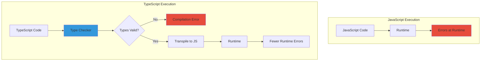
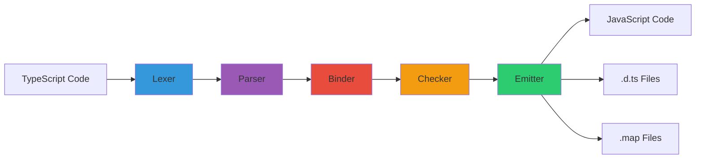
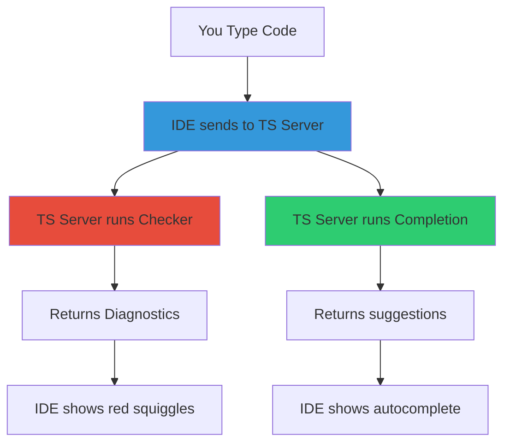
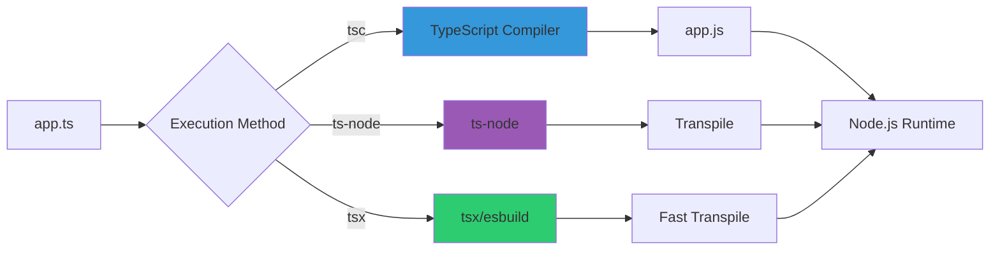

# TypeScript: Complete Professional Guide

**Static Type Checking for JavaScript**

---

## Table of Contents

1. [TypeScript Fundamentals](https://claude.ai/chat/607261bc-c435-4531-ba14-e695a595220c#typescript-fundamentals)
2. [Why TypeScript Exists](https://claude.ai/chat/607261bc-c435-4531-ba14-e695a595220c#why-typescript-exists)
3. [Type System Basics](https://claude.ai/chat/607261bc-c435-4531-ba14-e695a595220c#type-system-basics)
4. [Compilation Pipeline](https://claude.ai/chat/607261bc-c435-4531-ba14-e695a595220c#compilation-pipeline)
5. [Abstract Syntax Tree](https://claude.ai/chat/607261bc-c435-4531-ba14-e695a595220c#abstract-syntax-tree)
6. [Runtime vs Compile Time](https://claude.ai/chat/607261bc-c435-4531-ba14-e695a595220c#runtime-vs-compile-time)
7. [IDE Integration](https://claude.ai/chat/607261bc-c435-4531-ba14-e695a595220c#ide-integration)
8. [Node vs Bun Execution](https://claude.ai/chat/607261bc-c435-4531-ba14-e695a595220c#node-vs-bun-execution)
9. [Setup Guide](https://claude.ai/chat/607261bc-c435-4531-ba14-e695a595220c#setup-guide)

---

## TypeScript Fundamentals

### What is TypeScript

TypeScript is a **statically-typed superset of JavaScript** that compiles to plain JavaScript.

**Definition:**

```
TypeScript = JavaScript + Static Type System
```

**Core Properties:**

|Property|Description|
|---|---|
|Superset|All valid JS is valid TS|
|Static typing|Types checked before runtime|
|Transpiled|Converted to JavaScript|
|Optional|Can gradually adopt|
|Tooling|Better IDE support|

### TypeScript vs JavaScript



**Comparison:**

```
JavaScript (Runtime Errors)
━━━━━━━━━━━━━━━━━━━━━━━━━━━━━━━━━━━━━━━━━━━━━━━━━━━━
function add(a, b) {
    return a + b;
}

add(5, "10");        // Returns "510" (string concatenation)
add(5);              // Returns NaN (undefined + number)
add({}, []);         // Returns "[object Object]"

Problems:
- No error until runtime
- Silent type coercion
- Bugs discovered by users


TypeScript (Compile-Time Errors)
━━━━━━━━━━━━━━━━━━━━━━━━━━━━━━━━━━━━━━━━━━━━━━━━━━━━
function add(a: number, b: number): number {
    return a + b;
}

add(5, "10");        // ERROR: Argument type 'string' not assignable
add(5);              // ERROR: Expected 2 arguments, got 1
add({}, []);         // ERROR: Type '{}' not assignable to 'number'

Benefits:
- Errors caught during development
- IDE shows errors immediately
- Bugs found before deployment
```

### What TypeScript Adds

```
┌────────────────────────────────────────────────────────┐
│          TypeScript Additional Features                │
├────────────────────────────────────────────────────────┤
│                                                        │
│  1. Type Annotations                                   │
│     let name: string = "mukul";                        │
│                                                        │
│  2. Interfaces                                         │
│     interface User { name: string; age: number; }      │
│                                                        │
│  3. Type Inference                                     │
│     let count = 5;  // Inferred as number              │
│                                                        │
│  4. Generics                                           │
│     function identity<T>(arg: T): T { return arg; }    │
│                                                        │
│  5. Enums                                              │
│     enum Color { Red, Green, Blue }                    │
│                                                        │
│  6. Type Aliases                                       │
│     type ID = string | number;                         │
│                                                        │
│  7. Union Types                                        │
│     let value: string | number;                        │
│                                                        │
│  8. Intersection Types                                 │
│     type Combined = TypeA & TypeB;                     │
│                                                        │
│  9. Access Modifiers                                   │
│     class Person { private age: number; }              │
│                                                        │
│  10. Decorators (Experimental)                         │
│     @Component class MyComponent {}                    │
│                                                        │
└────────────────────────────────────────────────────────┘
```

---

## Why TypeScript Exists

### Problems with JavaScript

**Problem 1: Late error discovery**

```javascript
// JavaScript - Error at runtime
function calculateTotal(price, quantity) {
    return price * quantity;
}

calculateTotal(100, "five");  // Returns NaN (runtime)
// User sees broken total, reports bug, developer fixes
```

```typescript
// TypeScript - Error at compile time
function calculateTotal(price: number, quantity: number): number {
    return price * quantity;
}

calculateTotal(100, "five");  // ERROR: Type 'string' not assignable
// Developer sees error immediately, fixes before deployment
```

**Problem 2: Refactoring nightmares**

```javascript
// JavaScript - Breaking changes go unnoticed
const user = {
    name: "John",
    email: "john@example.com"
};

// Later, someone changes the structure
const user = {
    fullName: "John",  // Changed from 'name'
    email: "john@example.com"
};

// Existing code breaks silently
console.log(user.name);  // undefined (no error)
```

```typescript
// TypeScript - Refactoring catches issues
interface User {
    name: string;
    email: string;
}

const user: User = {
    fullName: "John",  // ERROR: 'fullName' does not exist
    email: "john@example.com"
};
```

**Problem 3: Poor IDE support**

```
JavaScript:
- Limited autocomplete
- No parameter hints
- Cannot jump to definition reliably

TypeScript:
- Full autocomplete
- Parameter types shown
- Jump to definition works
- Refactoring tools
```

### Behavior Differences

**String literals:** `""` vs `''` vs `` ` ` ``

```typescript
// TypeScript treats all equally for type checking
let str1: string = "hello";    // Double quotes
let str2: string = 'hello';    // Single quotes
let str3: string = `hello`;    // Template literal

// Linting rules (ESLint/Prettier) enforce consistency
// TypeScript doesn't care which you use
```

**Type annotations don't prevent runtime issues:**

```typescript
// TypeScript catches type error at compile time
function double(x: number): number {
    return x * 2;
}

double("5");  // ERROR: Argument of type 'string' not assignable

// But if you bypass the type system...
const value: any = "5";
double(value);  // Compiles, but NaN at runtime

// Why? TypeScript is erased at runtime
// Compiled JS doesn't have type checks
```

**The crucial limitation:**

```
┌────────────────────────────────────────────────────────┐
│        Why Types Don't Prevent Runtime Errors          │
├────────────────────────────────────────────────────────┤
│                                                        │
│  TypeScript Code:                                      │
│  function add(a: number, b: number) { return a + b; }  │
│                                                        │
│  Compiled JavaScript:                                  │
│  function add(a, b) { return a + b; }                  │
│                                                        │
│  All type information is REMOVED during compilation!   │
│                                                        │
│  If data comes from:                                   │
│  - User input                                          │
│  - External API                                        │
│  - Database                                            │
│  - Network request                                     │
│                                                        │
│  TypeScript cannot guarantee type safety at runtime    │
│                                                        │
│  Solution: Runtime validation libraries                │
│  - Zod, Yup, io-ts, Joi, etc.                         │
│                                                        │
└────────────────────────────────────────────────────────┘
```

---

## Type System Basics

### Primitive Types

```typescript
// Boolean
let isDone: boolean = false;

// Number
let decimal: number = 6;
let hex: number = 0xf00d;
let binary: number = 0b1010;

// String
let color: string = "blue";
let fullName: string = `Bob Bobbington`;

// Array
let list: number[] = [1, 2, 3];
let list2: Array<number> = [1, 2, 3];

// Tuple (fixed length, typed array)
let x: [string, number] = ["hello", 10];

// Enum
enum Color {
    Red,
    Green,
    Blue
}
let c: Color = Color.Green;

// Any (opt-out of type checking)
let notSure: any = 4;
notSure = "maybe a string";

// Unknown (type-safe 'any')
let uncertain: unknown = 4;
// uncertain.toFixed();  // ERROR: Must check type first
if (typeof uncertain === "number") {
    uncertain.toFixed();  // OK
}

// Void (no return value)
function warnUser(): void {
    console.log("Warning!");
}

// Null and Undefined
let u: undefined = undefined;
let n: null = null;

// Never (never returns)
function error(message: string): never {
    throw new Error(message);
}
```

### Type Inference

```typescript
// TypeScript infers types automatically
let num = 5;           // Inferred as number
let str = "hello";     // Inferred as string
let arr = [1, 2, 3];   // Inferred as number[]

// No need to annotate obvious types
let x = 10;            // number
let y = x + 5;         // number (inferred from x)

// Function return type inferred
function add(a: number, b: number) {
    return a + b;      // Inferred as number
}
```

### Union and Intersection Types

```typescript
// Union: can be one of several types
let value: string | number;
value = "hello";  // OK
value = 42;       // OK
value = true;     // ERROR

// Intersection: combines multiple types
interface Person {
    name: string;
}

interface Employee {
    employeeId: number;
}

type Worker = Person & Employee;

const worker: Worker = {
    name: "John",
    employeeId: 123
};
```

### Interfaces vs Type Aliases

```typescript
// Interface
interface User {
    name: string;
    age: number;
}

// Type alias
type User2 = {
    name: string;
    age: number;
};

// Both work similarly, but interfaces can be extended
interface Admin extends User {
    role: string;
}

// Type aliases support unions
type ID = string | number;
```

---

## Compilation Pipeline

### High-Level Overview



### Detailed Pipeline

```
┌────────────────────────────────────────────────────────┐
│         TypeScript Compilation Pipeline                │
├────────────────────────────────────────────────────────┤
│                                                        │
│  Input: app.ts                                         │
│  ┌──────────────────────────────────────────────┐     │
│  │ function add(a: number, b: number) {         │     │
│  │     return a + b;                             │     │
│  │ }                                             │     │
│  └──────────────────────────────────────────────┘     │
│         │                                              │
│         ↓                                              │
│  [1] LEXER (Tokenization)                              │
│  ┌──────────────────────────────────────────────┐     │
│  │ Tokens:                                       │     │
│  │ - FUNCTION keyword                            │     │
│  │ - IDENTIFIER "add"                            │     │
│  │ - LPAREN "("                                  │     │
│  │ - IDENTIFIER "a"                              │     │
│  │ - COLON ":"                                   │     │
│  │ - TYPE "number"                               │     │
│  │ ... etc                                       │     │
│  └──────────────────────────────────────────────┘     │
│         │                                              │
│         ↓                                              │
│  [2] PARSER (AST Creation)                             │
│  ┌──────────────────────────────────────────────┐     │
│  │ FunctionDeclaration                           │     │
│  │ ├── name: "add"                               │     │
│  │ ├── parameters:                               │     │
│  │ │   ├── name: "a", type: number               │     │
│  │ │   └── name: "b", type: number               │     │
│  │ ├── returnType: inferred                      │     │
│  │ └── body: Block                               │     │
│  │     └── ReturnStatement                       │     │
│  │         └── BinaryExpression (+)              │     │
│  └──────────────────────────────────────────────┘     │
│         │                                              │
│         ↓                                              │
│  [3] BINDER (Symbol Table)                             │
│  ┌──────────────────────────────────────────────┐     │
│  │ Scope: Global                                 │     │
│  │ ├── Symbol: "add"                             │     │
│  │ │   └── Type: Function                        │     │
│  │                                               │     │
│  │ Scope: Function "add"                         │     │
│  │ ├── Symbol: "a"                               │     │
│  │ │   └── Type: number                          │     │
│  │ └── Symbol: "b"                               │     │
│  │     └── Type: number                          │     │
│  └──────────────────────────────────────────────┘     │
│         │                                              │
│         ↓                                              │
│  [4] CHECKER (Type Validation)                         │
│  ┌──────────────────────────────────────────────┐     │
│  │ Verify:                                       │     │
│  │ - "a" is number ✓                             │     │
│  │ - "b" is number ✓                             │     │
│  │ - "+" operator valid for number ✓             │     │
│  │ - Return type matches ✓                       │     │
│  │                                               │     │
│  │ No type errors found                          │     │
│  └──────────────────────────────────────────────┘     │
│         │                                              │
│         ↓                                              │
│  [5] EMITTER (Code Generation)                         │
│  ┌──────────────────────────────────────────────┐     │
│  │ Output: app.js                                │     │
│  │ function add(a, b) {                          │     │
│  │     return a + b;                             │     │
│  │ }                                             │     │
│  │                                               │     │
│  │ Output: app.d.ts (Type definitions)           │     │
│  │ declare function add(                         │     │
│  │     a: number,                                │     │
│  │     b: number                                 │     │
│  │ ): number;                                    │     │
│  │                                               │     │
│  │ Output: app.js.map (Source map)               │     │
│  │ {"version":3,"file":"app.js"...}              │     │
│  └──────────────────────────────────────────────┘     │
│                                                        │
└────────────────────────────────────────────────────────┘
```

### Stage 1: Lexer (Tokenization)

**Purpose:** Break source code into tokens.

```typescript
// Input
function add(a: number) { return a + 1; }

// Output (Tokens)
[
    { type: "FUNCTION", value: "function" },
    { type: "IDENTIFIER", value: "add" },
    { type: "LPAREN", value: "(" },
    { type: "IDENTIFIER", value: "a" },
    { type: "COLON", value: ":" },
    { type: "TYPE", value: "number" },
    { type: "RPAREN", value: ")" },
    { type: "LBRACE", value: "{" },
    { type: "RETURN", value: "return" },
    { type: "IDENTIFIER", value: "a" },
    { type: "PLUS", value: "+" },
    { type: "NUMBER", value: "1" },
    { type: "SEMICOLON", value: ";" },
    { type: "RBRACE", value: "}" }
]
```

### Stage 2: Parser (AST Generation)

**Purpose:** Convert tokens into Abstract Syntax Tree.

```
Input Tokens → AST Structure

FunctionDeclaration
├── name: Identifier("add")
├── parameters: [
│   ParameterDeclaration
│   ├── name: Identifier("a")
│   └── type: TypeReference("number")
│ ]
├── returnType: null (inferred)
└── body: Block
    └── ReturnStatement
        └── BinaryExpression
            ├── operator: "+"
            ├── left: Identifier("a")
            └── right: NumericLiteral(1)
```

### Stage 3: Binder (Symbol Creation)

**Purpose:** Create symbol table and resolve scopes.

```
┌────────────────────────────────────────────────────────┐
│              Symbol Table Creation                     │
├────────────────────────────────────────────────────────┤
│                                                        │
│  Global Scope                                          │
│  ├── Symbol: "add"                                     │
│  │   ├── Type: Function                               │
│  │   ├── Flags: Export                                │
│  │   └── Declarations: [FunctionDeclaration]          │
│                                                        │
│  Function "add" Scope (parent: Global)                 │
│  ├── Symbol: "a"                                       │
│  │   ├── Type: number                                 │
│  │   ├── Flags: FunctionScopedVariable                │
│  │   └── Declarations: [ParameterDeclaration]         │
│                                                        │
│  Parent Pointer Chain:                                 │
│  "a" symbol → Function scope → Global scope → null    │
│                                                        │
└────────────────────────────────────────────────────────┘
```

**Parent pointer example:**

```typescript
function outer() {
    let x = 10;
    
    function inner() {
        let y = 20;
        console.log(x);  // Resolves via parent pointer
    }
}

/*
Symbol table with parent pointers:

inner() scope
├── Symbol: "y"
└── parent → outer() scope
             ├── Symbol: "x"
             └── parent → Global scope

When resolving "x" in inner():
1. Check inner() scope → not found
2. Follow parent pointer to outer() → found "x"
*/
```

### Stage 4: Checker (Type Checking)

**Purpose:** Validate type correctness.

```typescript
function add(a: number, b: number) {
    return a + b;
}

add(5, "10");  // Type error

/*
Checker process:

1. Check function call: add(5, "10")
2. Retrieve "add" symbol from table
3. Get parameter types: [number, number]
4. Get argument types: [number, string]
5. Compare:
   - Argument 1: number matches number ✓
   - Argument 2: string vs number ✗
6. Report error: "Argument of type 'string' is not 
   assignable to parameter of type 'number'"
*/
```

**Type checking algorithm:**

```
For each expression:
    1. Infer or retrieve type
    2. Check against expected type
    3. If mismatch, report error
    4. Continue (don't stop compilation)

For each variable:
    1. Check declaration type
    2. Check all assignments
    3. Verify type consistency

For each function call:
    1. Retrieve function signature
    2. Check argument count
    3. Check argument types
    4. Verify return type usage
```

### Stage 5: Emitter (Code Generation)

**Purpose:** Generate JavaScript output.

```typescript
// Input: app.ts
interface User {
    name: string;
    age: number;
}

function greet(user: User): string {
    return `Hello ${user.name}`;
}

const person: User = { name: "John", age: 30 };
console.log(greet(person));
```

**Output: app.js**

```javascript
function greet(user) {
    return `Hello ${user.name}`;
}
const person = { name: "John", age: 30 };
console.log(greet(person));

// Note: All type annotations removed
// Interface completely erased
```

**Output: app.d.ts**

```typescript
interface User {
    name: string;
    age: number;
}
declare function greet(user: User): string;
declare const person: User;
```

**Output: app.js.map**

```json
{
  "version": 3,
  "file": "app.js",
  "sourceRoot": "",
  "sources": ["app.ts"],
  "names": [],
  "mappings": "AAKA,SAAS,KAAK,CAAC,IAAU..."
}
```

### Is This Compilation?

```
┌────────────────────────────────────────────────────────┐
│         Compilation vs Transpilation                   │
├────────────────────────────────────────────────────────┤
│                                                        │
│  Traditional Compilation (C/C++/Rust)                  │
│  ────────────────────────────────────────────          │
│  Source Code → Machine Code                            │
│  - Lower abstraction level                             │
│  - Platform-specific binary                            │
│  - Cannot read output                                  │
│  - Optimizations applied                               │
│                                                        │
│  TypeScript "Compilation" (Actually Transpilation)     │
│  ──────────────────────────────────────────────        │
│  Source Code → Source Code (different syntax)          │
│  - Same abstraction level                              │
│  - Platform-independent text                           │
│  - Can read output                                     │
│  - Minimal transformation                              │
│                                                        │
│  Correct terms:                                        │
│  - TypeScript → JavaScript: Transpilation              │
│  - JavaScript → Machine Code: JIT Compilation          │
│                                                        │
│  Common confusion:                                     │
│  "tsc compiles TypeScript" ✗                           │
│  "tsc transpiles TypeScript" ✓                         │
│  But "compile" is widely accepted in TS community      │
│                                                        │
└────────────────────────────────────────────────────────┘
```

**Complete flow for all languages:**

```
High-Level Language Process
━━━━━━━━━━━━━━━━━━━━━━━━━━━━━━━━━━━━━━━━━━━━━━━━━━━━

TypeScript:
Source → Lexer → Parser → Checker → Emitter → JavaScript
         (tokens) (AST)    (types)   (codegen) (text)

JavaScript (V8/SpiderMonkey):
Source → Parser → ByteCode → JIT Compiler → Machine Code
         (AST)    (IR)       (optimization)  (binary)

Python:
Source → Lexer → Parser → Compiler → ByteCode → Interpreter
         (tokens) (AST)    (codegen)  (.pyc)    (execution)

Java:
Source → Lexer → Parser → Compiler → ByteCode → JVM
         (tokens) (AST)    (codegen)  (.class)  (execution)

C/C++:
Source → Preprocessor → Lexer → Parser → Optimizer → Assembler → Machine Code
         (macros)       (tokens) (AST)   (IR)       (asm)       (binary)

Go:
Source → Lexer → Parser → Type Checker → Compiler → Machine Code
         (tokens) (AST)    (validation)   (codegen)  (binary)

Rust:
Source → Lexer → Parser → HIR → MIR → LLVM IR → Machine Code
         (tokens) (AST)    (high) (mid)  (low)     (binary)

Common stages across all:
1. Lexical Analysis (Tokenization)
2. Syntax Analysis (Parsing to AST)
3. Semantic Analysis (Type checking, etc)
4. Code Generation/Transformation
```

---

## Abstract Syntax Tree

### What is an AST

An Abstract Syntax Tree represents code structure as a tree of nodes.

**Example code:**

```typescript
function add(a: number, b: number) {
    return a + b;
}
```

**AST representation:**

```
Program
└── FunctionDeclaration
    ├── Identifier: "add"
    ├── Parameters
    │   ├── Parameter
    │   │   ├── Identifier: "a"
    │   │   └── TypeAnnotation: NumberKeyword
    │   └── Parameter
    │       ├── Identifier: "b"
    │       └── TypeAnnotation: NumberKeyword
    ├── ReturnType: (inferred)
    └── Block
        └── ReturnStatement
            └── BinaryExpression
                ├── Left: Identifier("a")
                ├── Operator: "+"
                └── Right: Identifier("b")
```

### AST vs Parser Diagnostic

```
┌────────────────────────────────────────────────────────┐
│              AST vs Parse Diagnostics                  │
├────────────────────────────────────────────────────────┤
│                                                        │
│  AST (Abstract Syntax Tree)                            │
│  ─────────────────────────────                         │
│  - Represents valid code structure                     │
│  - Used for type checking                              │
│  - Used for code generation                            │
│  - Created by parser                                   │
│                                                        │
│  Parser Diagnostics                                    │
│  ──────────────────────                                │
│  - Syntax errors detected                              │
│  - Position information                                │
│  - Error messages                                      │
│  - Recovery strategies                                 │
│                                                        │
│  Example:                                              │
│                                                        │
│  Code: function add(a: number                          │
│                      ^                                 │
│  Parser Diagnostic:                                    │
│  - Error: Expected ')'                                 │
│  - Location: Line 1, Column 23                         │
│  - Suggestion: Add missing parenthesis                 │
│                                                        │
│  Parser still attempts to build AST with errors        │
│  to enable IDE features on incomplete code             │
│                                                        │
└────────────────────────────────────────────────────────┘
```

### Short Circuiting in Parsing

```typescript
// Short-circuit evaluation example
function example() {
    const result = null && null.property;
    // TypeScript short-circuits type checking here
    // Knows null.property won't execute
}

/*
Parser short-circuiting:

1. Parse "null"
2. See "&&" operator
3. Know right side won't execute if left is falsy
4. Don't error on null.property access
5. This is semantic analysis, not syntax error

Contrast with:
*/

const value = null.property;
// ERROR: Cannot read property of null

/*
Why different?

null && null.property
- Short-circuit: right side conditional
- Type checker allows this pattern

null.property
- Direct access: will always error
- Type checker prevents this
*/
```

---

## Runtime vs Compile Time

### Type Checking is Compile-Time Only

```
┌────────────────────────────────────────────────────────┐
│          Compile Time vs Runtime                       │
├────────────────────────────────────────────────────────┤
│                                                        │
│  COMPILE TIME (TypeScript)                             │
│  ─────────────────────────                             │
│  - Type checking happens                               │
│  - Errors caught                                       │
│  - No code execution                                   │
│  - Annotations available                               │
│                                                        │
│  RUNTIME (JavaScript)                                  │
│  ─────────────────────                                 │
│  - No type information                                 │
│  - No type checking                                    │
│  - Code executes                                       │
│  - All types erased                                    │
│                                                        │
└────────────────────────────────────────────────────────┘
```

**Demonstration:**

```typescript
// TypeScript file: app.ts
function greet(name: string) {
    console.log(`Hello ${name}`);
}

greet(42);  // ERROR at compile time

// But if you compile with errors suppressed:
// tsc --noEmitOnError false app.ts

// Generated JavaScript: app.js
function greet(name) {
    console.log(`Hello ${name}`);
}

greet(42);  // Works at runtime, outputs "Hello 42"

/*
Why it works:

Compile time:
- TypeScript sees: function greet(name: string)
- Argument 42 is number
- Error reported
- But compilation continues

Runtime:
- JavaScript sees: function greet(name)
- No type information
- Accepts any argument
- Executes successfully
*/
```

**The critical implication:**

```typescript
// TypeScript gives false sense of security
function processUser(user: User) {
    console.log(user.name.toUpperCase());
}

// Type checks pass
processUser({ name: "John", age: 30 });

// But at runtime, if data comes from external source:
fetch('/api/user')
    .then(res => res.json())
    .then(data => {
        // data is typed as 'any' implicitly
        // If API returns { username: "John" } instead of { name: "John" }
        processUser(data);  // Runtime error: Cannot read 'name' of undefined
    });

/*
Solution: Runtime validation
*/

import { z } from 'zod';

const UserSchema = z.object({
    name: z.string(),
    age: z.number()
});

fetch('/api/user')
    .then(res => res.json())
    .then(data => {
        const user = UserSchema.parse(data);  // Validates at runtime
        processUser(user);  // Now safe
    });
```

---

## IDE Integration

### How IDEs Use TypeScript



**Architecture:**

```
┌────────────────────────────────────────────────────────┐
│           TypeScript Language Server                   │
├────────────────────────────────────────────────────────┤
│                                                        │
│  IDE (VS Code, WebStorm, etc)                          │
│     │                                                  │
│     ├─→ Language Server Protocol (LSP)                 │
│     │                                                  │
│     ├─→ TypeScript Server (tsserver)                   │
│         │                                              │
│         ├─→ Parser: Creates AST                        │
│         ├─→ Binder: Builds symbol table                │
│         ├─→ Checker: Validates types                   │
│         │   └─→ Returns errors to IDE                  │
│         │                                              │
│         ├─→ Completion Provider                        │
│         │   └─→ Suggests available symbols             │
│         │                                              │
│         ├─→ Definition Provider                        │
│         │   └─→ Jumps to symbol definition             │
│         │                                              │
│         └─→ Rename Provider                            │
│             └─→ Renames symbol everywhere              │
│                                                        │
└────────────────────────────────────────────────────────┘
```

**Real-time checking:**

```typescript
// As you type...
function add(a: number, b: number) {
    return a + b;
}

add(5, "10")
//      ^^^^ IDE shows error immediately
//           without saving file

/*
How it works:

1. You type: add(5, "
2. IDE sends current buffer to tsserver
3. Parser creates AST (even with incomplete code)
4. Checker validates types
5. Checker finds type error
6. tsserver sends diagnostic to IDE
7. IDE shows red squiggle
8. All in ~50ms
*/
```

**Built-in checker usage:**

```typescript
// When you request autocomplete (Ctrl+Space)
const user = {
    name: "John",
    age: 30
};

user.
//   ^ IDE shows: name, age, toString, valueOf, etc

/*
How autocomplete works:

1. User types "user."
2. IDE sends: getCompletionsAtPosition
3. Checker looks up "user" in symbol table
4. Retrieves type information: { name: string, age: number }
5. Adds Object.prototype members
6. Returns completion list
7. IDE displays suggestions
*/
```

---

## Node vs Bun Execution

### How Node.js Handles TypeScript

```
┌────────────────────────────────────────────────────────┐
│           Node.js TypeScript Execution                 │
├────────────────────────────────────────────────────────┤
│                                                        │
│  Method 1: Traditional (two steps)                     │
│  ─────────────────────────────────                     │
│  app.ts → tsc → app.js → node app.js                   │
│                                                        │
│  Method 2: ts-node (runtime transpilation)             │
│  ──────────────────────────────────────                │
│  app.ts → ts-node app.ts                               │
│           └─→ transpiles on-the-fly                    │
│           └─→ executes JavaScript                      │
│                                                        │
│  Method 3: tsx (faster ts-node alternative)            │
│  ───────────────────────────────────────               │
│  app.ts → tsx app.ts                                   │
│           └─→ uses esbuild (faster)                    │
│                                                        │
│  Method 4: Node.js 20.6+ (experimental)                │
│  ───────────────────────────────────────               │
│  node --loader ts-node/esm app.ts                      │
│                                                        │
└────────────────────────────────────────────────────────┘
```

**Node.js execution flow:**



### How Bun Handles TypeScript

```
┌────────────────────────────────────────────────────────┐
│             Bun TypeScript Execution                   │
├────────────────────────────────────────────────────────┤
│                                                        │
│  Native TypeScript support (built-in)                  │
│  ─────────────────────────────────────                 │
│  app.ts → bun run app.ts                               │
│           └─→ transpiles internally                    │
│           └─→ executes immediately                     │
│                                                        │
│  Process:                                              │
│  1. Bun reads app.ts                                   │
│  2. JavaScriptCore transpiles TS → JS                  │
│  3. Executes JavaScript directly                       │
│  4. No intermediate .js files                          │
│                                                        │
│  Speed: Much faster than Node.js + ts-node             │
│  Reason: Written in Zig, optimized for TS              │
│                                                        │
└────────────────────────────────────────────────────────┘
```

**Comparison:**

```
Performance Benchmark (1000 TypeScript files)
━━━━━━━━━━━━━━━━━━━━━━━━━━━━━━━━━━━━━━━━━━━━━━

Method                    Time        Notes
────────────────────────────────────────────
tsc + node               8.2s        Slowest, but safest
ts-node                  5.1s        Slower startup
tsx                      2.3s        Fast, uses esbuild
bun                      0.8s        Fastest

Why Bun is faster:
- Native TS transpilation (no separate process)
- Written in Zig (compiled language)
- JavaScriptCore engine (fast)
- Optimized for TypeScript workflows
```

**Internal differences:**

```
Node.js (with tsx):
━━━━━━━━━━━━━━━━━━━━━━━━━━━━━━━━━━━━━━━━━━━━━━
app.ts
  ↓
Node.js process starts
  ↓
tsx loader invoked
  ↓
esbuild transpiles TS → JS (separate process)
  ↓
JavaScript returned to Node.js
  ↓
V8 engine executes JavaScript


Bun:
━━━━━━━━━━━━━━━━━━━━━━━━━━━━━━━━━━━━━━━━━━━━━━
app.ts
  ↓
Bun process starts
  ↓
Built-in transpiler (Zig) converts TS → JS
  ↓
JavaScriptCore executes JavaScript
  ↓
All in one optimized pipeline
```

**Type checking differences:**

```
┌────────────────────────────────────────────────────────┐
│         Type Checking: Node vs Bun                     │
├────────────────────────────────────────────────────────┤
│                                                        │
│  tsc (TypeScript Compiler)                             │
│  ─────────────────────────                             │
│  - Full type checking                                  │
│  - Slow but accurate                                   │
│  - Reports all errors                                  │
│  - Required for production                             │
│                                                        │
│  ts-node / tsx                                         │
│  ──────────────────                                    │
│  - Optional type checking                              │
│  - Faster, skips some checks                           │
│  - Can ignore type errors                              │
│  - Good for development                                │
│                                                        │
│  Bun                                                   │
│  ────                                                  │
│  - NO type checking by default                         │
│  - Only transpiles (strips types)                      │
│  - Runs code even with type errors                     │
│  - Must run tsc separately for checking                │
│                                                        │
│  Recommendation:                                       │
│  Always use tsc for type checking                      │
│  Use bun/tsx for fast execution                        │
│                                                        │
└────────────────────────────────────────────────────────┘
```

---

## Setup Guide

### Basic TypeScript Setup

**1. Install TypeScript:**

```bash
# Global installation
npm install -g typescript

# Project installation (recommended)
npm install --save-dev typescript

# Verify installation
tsc --version
```

**2. Initialize TypeScript project:**

```bash
# Create tsconfig.json
tsc --init

# Or manually create
mkdir my-ts-project
cd my-ts-project
npm init -y
npm install --save-dev typescript @types/node
```

**3. Configure tsconfig.json:**

```json
{
  "compilerOptions": {
    "target": "ES2022",
    "module": "commonjs",
    "lib": ["ES2022"],
    "outDir": "./dist",
    "rootDir": "./src",
    "strict": true,
    "esModuleInterop": true,
    "skipLibCheck": true,
    "forceConsistentCasingInFileNames": true,
    "resolveJsonModule": true,
    "declaration": true,
    "declarationMap": true,
    "sourceMap": true,
    "removeComments": true
  },
  "include": ["src/**/*"],
  "exclude": ["node_modules", "dist"]
}
```

**4. Project structure:**

```
my-ts-project/
├── src/
│   ├── index.ts
│   └── utils.ts
├── dist/               # Generated by tsc
├── node_modules/
├── package.json
├── tsconfig.json
└── .gitignore
```

**5. Create source files:**

```typescript
// src/index.ts
import { greet } from './utils';

const name: string = "Mukul";
console.log(greet(name));
```

```typescript
// src/utils.ts
export function greet(name: string): string {
    return `Hello, ${name}!`;
}
```

**6. Compile and run:**

```bash
# Compile
tsc

# Run
node dist/index.js

# Or watch mode
tsc --watch
```

### Setup with Node.js

**Using ts-node:**

```bash
# Install
npm install --save-dev ts-node

# Run directly
npx ts-node src/index.ts

# Add to package.json scripts
{
  "scripts": {
    "dev": "ts-node src/index.ts",
    "build": "tsc",
    "start": "node dist/index.js"
  }
}
```

**Using tsx (recommended):**

```bash
# Install
npm install --save-dev tsx

# Run
npx tsx src/index.ts

# Package.json scripts
{
  "scripts": {
    "dev": "tsx watch src/index.ts",
    "build": "tsc",
    "start": "node dist/index.js"
  }
}
```

### Setup with Bun

```bash
# Install Bun
curl -fsSL https://bun.sh/install | bash

# Initialize project
bun init

# Run TypeScript directly
bun run src/index.ts

# Install dependencies
bun add package-name

# Build
bun build src/index.ts --outdir ./dist

# Package.json scripts
{
  "scripts": {
    "dev": "bun run src/index.ts",
    "build": "bun build src/index.ts --outdir ./dist",
    "start": "bun run dist/index.js"
  }
}
```

### Production Configuration

```json
// tsconfig.json (production)
{
  "compilerOptions": {
    "target": "ES2022",
    "module": "commonjs",
    "outDir": "./dist",
    "rootDir": "./src",
    
    // Strict checking
    "strict": true,
    "noUnusedLocals": true,
    "noUnusedParameters": true,
    "noImplicitReturns": true,
    "noFallthroughCasesInSwitch": true,
    
    // Output options
    "declaration": true,
    "sourceMap": false,
    "removeComments": true,
    "importHelpers": true,
    
    // Interop
    "esModuleInterop": true,
    "allowSyntheticDefaultImports": true,
    "forceConsistentCasingInFileNames": true,
    
    // Skip type checking of declaration files
    "skipLibCheck": true
  },
  "include": ["src/**/*"],
  "exclude": ["node_modules", "dist", "**/*.test.ts"]
}
```

### ESLint & Prettier Setup

```bash
# Install
npm install --save-dev eslint @typescript-eslint/parser @typescript-eslint/eslint-plugin prettier eslint-config-prettier

# Initialize ESLint
npx eslint --init
```

**.eslintrc.json:**

```json
{
  "parser": "@typescript-eslint/parser",
  "extends": [
    "eslint:recommended",
    "plugin:@typescript-eslint/recommended",
    "prettier"
  ],
  "plugins": ["@typescript-eslint"],
  "env": {
    "node": true,
    "es6": true
  },
  "rules": {
    "@typescript-eslint/explicit-function-return-type": "error",
    "@typescript-eslint/no-explicit-any": "error",
    "@typescript-eslint/no-unused-vars": "error"
  }
}
```

**.prettierrc:**

```json
{
  "semi": true,
  "trailingComma": "es5",
  "singleQuote": true,
  "printWidth": 80,
  "tabWidth": 2
}
```

---

## Quick Reference

### tsconfig.json Common Options

|Option|Description|Example|
|---|---|---|
|`target`|ECMAScript version|`"ES2022"`|
|`module`|Module system|`"commonjs"`, `"ESNext"`|
|`outDir`|Output directory|`"./dist"`|
|`rootDir`|Source directory|`"./src"`|
|`strict`|Enable all strict checks|`true`|
|`sourceMap`|Generate .map files|`true`|
|`declaration`|Generate .d.ts files|`true`|
|`esModuleInterop`|Better CommonJS imports|`true`|

### Common Commands

|Command|Description|
|---|---|
|`tsc`|Compile project|
|`tsc --watch`|Watch mode|
|`tsc --noEmit`|Check types only|
|`tsc --init`|Create tsconfig.json|
|`tsc file.ts`|Compile single file|

### Type Checking Levels

```typescript
// No type checking
let value: any = "hello";
value = 42;
value.nonExistent();  // No error

// Some type checking
let value: unknown = "hello";
// value.length;  // Error: must check type first
if (typeof value === "string") {
    value.length;  // OK
}

// Strict type checking
let value: string = "hello";
// value = 42;  // Error
value.length;  // OK
```

---

## Summary

### Key Concepts

**What TypeScript is:**

- JavaScript with static types
- Transpiled, not compiled (traditional sense)
- Types erased at runtime
- IDE integration for better DX

**Compilation pipeline:**

1. Lexer: Source → Tokens
2. Parser: Tokens → AST
3. Binder: AST → Symbol Table
4. Checker: Validate types
5. Emitter: Generate JavaScript

**Runtime limitations:**

- No type checking at runtime
- All types erased in output
- Need runtime validation for external data
- Can bypass type system with `any`

**Execution:**

- Node.js: Requires transpilation (tsc/ts-node/tsx)
- Bun: Native TS support, faster
- Both produce same JavaScript
- Type checking separate from execution

**Best practices:**

- Use strict mode
- Avoid `any`
- Validate external data at runtime
- Type your functions explicitly
- Use ESLint for code quality