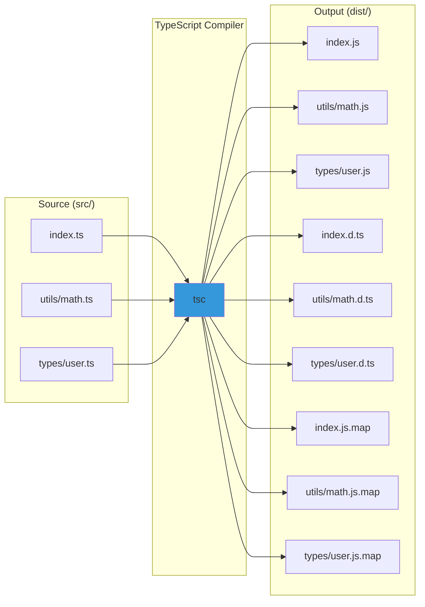

# TypeScript Configuration Complete Guide

**Understanding tsconfig.json and Build Process**

---

## Table of Contents

1. [tsconfig.json Basics](#tsconfigjson-basics)
2. [File Organization (src → dist)](#file-organization-src--dist)
3. [Output Files Explained](#output-files-explained)
4. [Choosing ES Version](#choosing-es-version)
5. [Node.js Compatibility](#nodejs-compatibility)
6. [Automated Build Process](#automated-build-process)
7. [Configuration Options Deep Dive](#configuration-options-deep-dive)

---

## tsconfig.json Basics

### Creating tsconfig.json

```bash
# Initialize TypeScript project
npx tsc --init

# Creates tsconfig.json with default options
# File is heavily commented with explanations
```

### What's Inside

```
┌────────────────────────────────────────────────────────┐
│           tsconfig.json Structure                      │
├────────────────────────────────────────────────────────┤
│                                                        │
│  {                                                     │
│    "compilerOptions": {                                │
│      // Where TypeScript compiler options go           │
│      "target": "ES2022",      // Output JS version     │
│      "module": "commonjs",    // Module system         │
│      "outDir": "./dist",      // Output directory      │
│      "rootDir": "./src",      // Source directory      │
│      "strict": true,          // Type checking level   │
│      ...                                               │
│    },                                                  │
│                                                        │
│    "include": ["src/**/*"],   // Files to compile      │
│    "exclude": ["node_modules"] // Files to ignore      │
│  }                                                     │
│                                                        │
└────────────────────────────────────────────────────────┘
```

### Default Generated Config

**When you run `npx tsc --init`:**

```json
{
  "compilerOptions": {
    "target": "es2016",
    "module": "commonjs",
    "esModuleInterop": true,
    "forceConsistentCasingInFileNames": true,
    "strict": true,
    "skipLibCheck": true
  }
}
```

**Minimal options only. Many are commented out.**

---

## File Organization (src → dist)

### Why src and dist?

```
┌────────────────────────────────────────────────────────┐
│         Source vs Distribution Pattern                 │
├────────────────────────────────────────────────────────┤
│                                                        │
│  src/ (Source)                                         │
│  ├── Contains TypeScript files (.ts)                   │
│  ├── Human-readable, editable code                     │
│  ├── Has type annotations                              │
│  └── Not executable by Node.js                         │
│                                                        │
│  dist/ (Distribution)                                  │
│  ├── Contains JavaScript files (.js)                   │
│  ├── Machine-executable code                           │
│  ├── No type annotations                               │
│  └── Ready for deployment                              │
│                                                        │
│  Why separate?                                         │
│  ────────────                                          │
│  1. Keep source code clean                             │
│  2. Prevent accidental edits to generated code         │
│  3. Easy to .gitignore dist/                           │
│  4. Clear separation of concerns                       │
│                                                        │
└────────────────────────────────────────────────────────┘
```

### Directory Structure Example

```
my-project/
│
├── src/                    # Your TypeScript source
│   ├── index.ts
│   ├── utils/
│   │   ├── math.ts
│   │   └── string.ts
│   └── types/
│       └── user.ts
│
├── dist/                   # Generated JavaScript (auto-created)
│   ├── index.js
│   ├── index.d.ts
│   ├── index.js.map
│   ├── utils/
│   │   ├── math.js
│   │   ├── math.d.ts
│   │   ├── math.js.map
│   │   ├── string.js
│   │   ├── string.d.ts
│   │   └── string.js.map
│   └── types/
│       ├── user.js
│       ├── user.d.ts
│       └── user.js.map
│
├── node_modules/
├── package.json
├── tsconfig.json
└── .gitignore
```

### How Compilation Maps Directories



### Configuration That Controls This

```json
{
  "compilerOptions": {
    "rootDir": "./src",     // Input directory
    "outDir": "./dist"      // Output directory
  }
}
```

**How it works:**

```
Input:  src/utils/math.ts
        └─ rootDir strips "src"
        └─ Relative path: utils/math.ts

Output: dist/utils/math.js
        └─ outDir prepends "dist"
        └─ Final path: dist/utils/math.js
```

**Without rootDir/outDir:**

```json
{
  "compilerOptions": {
    // No rootDir or outDir specified
  }
}
```

**Result:** JavaScript files created alongside TypeScript files

```
src/
├── index.ts
├── index.js        ← Generated next to source
├── utils/
│   ├── math.ts
│   └── math.js     ← Generated next to source
```

**Why this is bad:**
- Mixes source and generated code
- Harder to clean build artifacts
- Confusing for developers
- Can't easily exclude from Git

---

## Output Files Explained

### Types of Files Generated

```
┌────────────────────────────────────────────────────────┐
│            TypeScript Output Files                     │
├────────────────────────────────────────────────────────┤
│                                                        │
│  1. .js (JavaScript)                                   │
│     ├── Executable code                                │
│     ├── Types removed                                  │
│     └── Run by Node.js                                 │
│                                                        │
│  2. .d.ts (Type Declarations)                          │
│     ├── Type information only                          │
│     ├── Used by TypeScript for type checking           │
│     ├── Published with npm packages                    │
│     └── No executable code                             │
│                                                        │
│  3. .js.map (Source Maps)                              │
│     ├── Maps generated JS to original TS               │
│     ├── Used for debugging                             │
│     ├── Allows stepping through TS in debugger         │
│     └── Optional (controlled by sourceMap option)      │
│                                                        │
└────────────────────────────────────────────────────────┘
```

### Example Transformation

**Input: src/math.ts**

```typescript
export function add(a: number, b: number): number {
    return a + b;
}

export function subtract(a: number, b: number): number {
    return a - b;
}
```

**Output 1: dist/math.js**

```javascript
"use strict";
Object.defineProperty(exports, "__esModule", { value: true });
exports.add = add;
exports.subtract = subtract;

function add(a, b) {
    return a + b;
}

function subtract(a, b) {
    return a - b;
}
```

**Output 2: dist/math.d.ts**

```typescript
export declare function add(a: number, b: number): number;
export declare function subtract(a: number, b: number): number;
```

**Output 3: dist/math.js.map**

```json
{
  "version": 3,
  "file": "math.js",
  "sourceRoot": "",
  "sources": ["../src/math.ts"],
  "names": [],
  "mappings": ";;AAAA,SAAgB,GAAG,CAAC,CAAS,EAAE,CAAS;IACpC,OAAO,CAAC,GAAG,CAAC,CAAC;AACjB,CAAC..."
}
```

### File Comparison

```
Source Code (math.ts)           782 bytes
├── TypeScript syntax
├── Type annotations
├── Comments
└── Formatted for readability

↓ [Compilation]

JavaScript (math.js)            1,243 bytes
├── CommonJS module wrapper
├── No type annotations
├── Comments removed (default)
└── Executable by Node.js

Declaration (math.d.ts)         124 bytes
├── Only type signatures
├── No implementation
└── Used by TypeScript only

Source Map (math.js.map)        348 bytes
├── Mapping information
├── Original source reference
└── Used by debuggers
```

### Configuration for Output Files

```json
{
  "compilerOptions": {
    "declaration": true,         // Generate .d.ts files
    "declarationMap": true,      // Generate .d.ts.map files
    "sourceMap": true,           // Generate .js.map files
    "removeComments": true       // Strip comments from .js
  }
}
```

---

## Choosing ES Version

### What is "target"?

```
┌────────────────────────────────────────────────────────┐
│              TypeScript "target" Option                │
├────────────────────────────────────────────────────────┤
│                                                        │
│  "target" determines the ECMAScript version of         │
│  the generated JavaScript code.                        │
│                                                        │
│  Higher version = More modern features                 │
│  Lower version = Better compatibility                  │
│                                                        │
│  TypeScript Input (always modern):                     │
│  const greet = (name: string) => `Hello ${name}`;      │
│                                                        │
│  ↓ [target: ES5]                                       │
│                                                        │
│  var greet = function(name) {                          │
│      return "Hello " + name;                           │
│  };                                                    │
│                                                        │
│  ↓ [target: ES2015/ES6]                                │
│                                                        │
│  const greet = (name) => `Hello ${name}`;              │
│                                                        │
│  ↓ [target: ESNext]                                    │
│                                                        │
│  const greet = (name) => `Hello ${name}`;              │
│  (Uses latest features available)                      │
│                                                        │
└────────────────────────────────────────────────────────┘
```

### Available Target Options

| Target | Year | Features | Use Case |
|--------|------|----------|----------|
| ES3 | 1999 | Basic JS | Legacy browsers (IE8) |
| ES5 | 2009 | JSON, strict mode | Old browsers (IE9-11) |
| ES6/ES2015 | 2015 | Arrow functions, classes, let/const | Modern browsers |
| ES2016 | 2016 | Exponentiation operator | Most environments |
| ES2017 | 2017 | async/await | Node 8+ |
| ES2018 | 2018 | Rest/spread properties | Node 10+ |
| ES2019 | 2019 | Optional catch binding | Node 12+ |
| ES2020 | 2020 | Optional chaining, nullish coalescing | Node 14+ |
| ES2021 | 2021 | Logical assignment | Node 16+ |
| ES2022 | 2022 | Top-level await, class fields | Node 18+ |
| ESNext | Latest | All latest features | Bleeding edge |

### Feature Transformation Examples

**Arrow Functions:**

```typescript
// TypeScript source
const double = (x: number) => x * 2;
```

```javascript
// target: ES5
var double = function(x) { return x * 2; };

// target: ES2015+
const double = (x) => x * 2;
```

**Classes:**

```typescript
// TypeScript source
class Person {
    constructor(public name: string) {}
}
```

```javascript
// target: ES5
var Person = (function () {
    function Person(name) {
        this.name = name;
    }
    return Person;
}());

// target: ES2015+
class Person {
    constructor(name) {
        this.name = name;
    }
}
```

**Async/Await:**

```typescript
// TypeScript source
async function fetchData() {
    const response = await fetch('/api');
    return response.json();
}
```

```javascript
// target: ES5 (transformed to promises)
function fetchData() {
    return __awaiter(this, void 0, void 0, function* () {
        const response = yield fetch('/api');
        return response.json();
    });
}

// target: ES2017+
async function fetchData() {
    const response = await fetch('/api');
    return response.json();
}
```

### How to Choose Target

```
Decision Tree:
━━━━━━━━━━━━━━━━━━━━━━━━━━━━━━━━━━━━━━━━━━━━━━━━━━━━

Question 1: Where will code run?
├── Browser
│   ├── Modern browsers only? → ES2020+
│   ├── Support IE11? → ES5
│   └── General web? → ES2015 (ES6)
│
└── Node.js
    ├── Which version?
    │   ├── Node 18+ → ES2022
    │   ├── Node 16+ → ES2021
    │   ├── Node 14+ → ES2020
    │   └── Node 12+ → ES2019
    │
    └── Recommendation: Match Node.js version

Question 2: Need bleeding edge features?
├── Yes → ESNext
└── No → Use stable version (ES2022)

Recommendation for most projects:
- Node.js backend: ES2022
- React/Vue app: ES2020
- Library: ES2015 (wider compatibility)
```

---

## Node.js Compatibility

### Node.js and ECMAScript Versions

```
┌────────────────────────────────────────────────────────┐
│         Node.js Version → ES Target Mapping            │
├────────────────────────────────────────────────────────┤
│                                                        │
│  Node Version  │ ES Target  │ Key Features            │
│  ──────────────────────────────────────────────────    │
│                                                        │
│  Node 12       │ ES2019     │ Optional catch          │
│  (EOL)         │            │ Array.flat()            │
│                                                        │
│  Node 14       │ ES2020     │ Optional chaining       │
│  (EOL)         │            │ Nullish coalescing      │
│                │            │ BigInt                  │
│                                                        │
│  Node 16       │ ES2021     │ Logical assignment      │
│  (Maintenance) │            │ String.replaceAll()     │
│                                                        │
│  Node 18       │ ES2022     │ Top-level await         │
│  (LTS)         │            │ Class fields            │
│                │            │ Private methods         │
│                                                        │
│  Node 20       │ ES2023     │ Array.toSorted()        │
│  (Current LTS) │            │ Array.findLast()        │
│                                                        │
│  Node 21+      │ ESNext     │ Latest features         │
│  (Current)     │            │                         │
│                                                        │
└────────────────────────────────────────────────────────┘
```

### Checking Your Node.js Version

```bash
# Check Node.js version
node --version
# Output: v20.10.0

# Check supported ES features
node -p "process.versions.v8"
# Output: 11.3.244.8-node.16
```

### Recommended Configuration

**For Node.js 18+ (LTS):**

```json
{
  "compilerOptions": {
    "target": "ES2022",
    "module": "NodeNext",
    "lib": ["ES2022"],
    "moduleResolution": "NodeNext"
  }
}
```

**For Node.js 16:**

```json
{
  "compilerOptions": {
    "target": "ES2021",
    "module": "commonjs",
    "lib": ["ES2021"]
  }
}
```

**For Node.js 14:**

```json
{
  "compilerOptions": {
    "target": "ES2020",
    "module": "commonjs",
    "lib": ["ES2020"]
  }
}
```

### Installing Node Types

```bash
# Install Node.js type definitions
npm install --save-dev @types/node

# Now you can use Node.js APIs with types
```

**Usage in TypeScript:**

```typescript
import { readFile } from 'fs/promises';
import { EventEmitter } from 'events';

// TypeScript knows about Node.js APIs
const data = await readFile('file.txt', 'utf-8');
const emitter = new EventEmitter();
```

**tsconfig.json with Node types:**

```json
{
  "compilerOptions": {
    "types": ["node"]  // Include Node.js types
  }
}
```

---

## Automated Build Process

### Why Manual Compilation is Tedious

```
Manual Process (every time you make a change):
━━━━━━━━━━━━━━━━━━━━━━━━━━━━━━━━━━━━━━━━━━━━━━━━━━━━

1. Edit src/index.ts
2. Run: tsc
3. Run: node dist/index.js
4. See output
5. Find bug
6. Repeat from step 1

Problems:
- Forget to compile
- Waste time typing commands
- No live reload
- Slow feedback loop
```

### Automated Solutions

**Method 1: npm Scripts**

```json
// package.json
{
  "name": "my-project",
  "scripts": {
    "build": "tsc",
    "start": "node dist/index.js",
    "dev": "tsc && node dist/index.js",
    "watch": "tsc --watch"
  }
}
```

**Usage:**

```bash
# Build once
npm run build

# Build and run
npm run dev

# Watch mode (auto-rebuild on changes)
npm run watch

# In another terminal
npm start
```

**Method 2: Concurrent Build & Run**

```bash
# Install nodemon and concurrently
npm install --save-dev nodemon concurrently
```

```json
// package.json
{
  "scripts": {
    "build": "tsc",
    "start": "node dist/index.js",
    "watch:build": "tsc --watch",
    "watch:run": "nodemon dist/index.js",
    "dev": "concurrently \"npm:watch:build\" \"npm:watch:run\""
  }
}
```

**Now just run:**

```bash
npm run dev

# Automatically:
# - Watches for TypeScript changes
# - Recompiles on save
# - Restarts Node.js
# - Shows output
```

**Method 3: tsx (Fastest for Development)**

```bash
# Install tsx
npm install --save-dev tsx
```

```json
// package.json
{
  "scripts": {
    "build": "tsc",
    "start": "node dist/index.js",
    "dev": "tsx watch src/index.ts"
  }
}
```

```bash
# Run directly without pre-compilation
npm run dev

# Watches and runs TypeScript directly
# No dist folder needed during development
```

### When dist is Created

```
┌────────────────────────────────────────────────────────┐
│            When is dist/ Created?                      │
├────────────────────────────────────────────────────────┤
│                                                        │
│  Development (Local)                                   │
│  ───────────────────                                   │
│  - Run: npm run build                                  │
│  - Or: tsc                                             │
│  - dist/ folder created                                │
│  - Files generated according to tsconfig              │
│                                                        │
│  Production (Deployment)                               │
│  ───────────────────────                               │
│  - CI/CD runs: npm run build                           │
│  - dist/ created on server                             │
│  - Only dist/ deployed (src/ not needed)               │
│                                                        │
│  React/Next.js                                         │
│  ──────────────                                        │
│  - Run: npm run build                                  │
│  - Creates: .next/ or build/ folder                    │
│  - Bundled JavaScript + assets                         │
│  - Optimized for browsers                              │
│                                                        │
│  Node.js API                                           │
│  ────────────                                          │
│  - Run: npm run build                                  │
│  - Creates: dist/ folder                               │
│  - Plain JavaScript files                              │
│  - Keeps directory structure                           │
│                                                        │
└────────────────────────────────────────────────────────┘
```

### React vs Node.js Build

**Node.js Backend Build:**

```bash
npm run build

# Creates:
dist/
├── index.js
├── routes/
│   ├── users.js
│   └── posts.js
└── utils/
    └── db.js

# Files maintain structure
# No bundling
# Module resolution unchanged
```

**React Frontend Build:**

```bash
npm run build

# Creates:
build/  (or .next/ or dist/)
├── static/
│   ├── js/
│   │   ├── main.abc123.js      # Bundled
│   │   └── vendor.def456.js    # Dependencies
│   └── css/
│       └── main.xyz789.css     # Styles
├── index.html                   # Entry point
└── asset-manifest.json         # Asset mapping

# All code bundled into few files
# Optimized, minified
# Different output structure
```

---

## Configuration Options Deep Dive

### Your Provided Configuration Explained

```jsonc
{
  "compilerOptions": {
    // ────────────────────────────────────────────────────
    // FILE LAYOUT
    // ────────────────────────────────────────────────────
    
    "rootDir": "./src",
    /*
     * Source files location
     * All TypeScript files should be under src/
     * This is stripped from output paths
     */

    "outDir": "./dist",
    /*
     * Compiled JavaScript output location
     * Mirrors src/ structure in dist/
     * Created automatically on build
     */

    // ────────────────────────────────────────────────────
    // ENVIRONMENT SETTINGS
    // ────────────────────────────────────────────────────

    "module": "nodenext",
    /*
     * Module system to use
     * 
     * Options:
     * - commonjs: require/exports (Node.js traditional)
     * - esnext: import/export (ES Modules)
     * - nodenext: Auto-detect based on package.json "type"
     * 
     * Use "nodenext" for modern Node.js projects
     */

    "target": "esnext",
    /*
     * JavaScript version to emit
     * 
     * "esnext" = Latest ECMAScript features
     * Safe for Node.js 18+
     * 
     * Alternative: "ES2022" for Node.js 18
     */

    "lib": ["esnext"],
    /*
     * Type definitions to include
     * 
     * Provides types for:
     * - Array.prototype.at()
     * - String.prototype.replaceAll()
     * - Promise.any()
     * - And other ESNext features
     */

    "types": ["node"],
    /*
     * Include Node.js type definitions
     * 
     * Requires: npm install -D @types/node
     * 
     * Provides types for:
     * - fs, path, http, etc.
     * - process, Buffer, __dirname
     */

    // ────────────────────────────────────────────────────
    // OTHER OUTPUTS
    // ────────────────────────────────────────────────────

    "sourceMap": true,
    /*
     * Generate .js.map files
     * 
     * Benefits:
     * - Debug TypeScript in Node.js debugger
     * - Stack traces show TS line numbers
     * - Better error messages
     * 
     * File size: ~30% of .js file
     */

    "declaration": true,
    /*
     * Generate .d.ts files
     * 
     * Use cases:
     * - Publishing npm packages
     * - Other TS projects using your code
     * - Type-safe imports
     * 
     * Required for libraries
     */

    "declarationMap": true,
    /*
     * Generate .d.ts.map files
     * 
     * Benefits:
     * - Jump to .ts source from .d.ts
     * - Better IDE "Go to Definition"
     * 
     * Only useful if publishing source
     */

    // ────────────────────────────────────────────────────
    // STRICTER TYPE CHECKING
    // ────────────────────────────────────────────────────

    "noUncheckedIndexedAccess": true,
    /*
     * Array/object access returns T | undefined
     * 
     * Without:
     * const arr: number[] = [1, 2, 3];
     * const x = arr[10];  // Type: number
     * 
     * With:
     * const x = arr[10];  // Type: number | undefined
     * 
     * Prevents runtime errors from undefined access
     */

    "exactOptionalPropertyTypes": true,
    /*
     * Stricter optional property checking
     * 
     * interface Config {
     *   debug?: boolean;
     * }
     * 
     * Without: Can set to undefined explicitly
     * const config: Config = { debug: undefined };  // OK
     * 
     * With: Must omit or set to boolean
     * const config: Config = { debug: undefined };  // Error
     */

    // ────────────────────────────────────────────────────
    // STYLE OPTIONS (Commented - Optional)
    // ────────────────────────────────────────────────────

    // "noImplicitReturns": true,
    /*
     * All code paths must return
     * 
     * function test(x: number) {
     *   if (x > 0) {
     *     return "positive";
     *   }
     *   // Error: Not all paths return
     * }
     */

    // "noUnusedLocals": true,
    /*
     * Error on unused variables
     * 
     * function test() {
     *   const x = 5;  // Error: 'x' is declared but never used
     *   return 10;
     * }
     */

    // "noUnusedParameters": true,
    /*
     * Error on unused function parameters
     * 
     * function greet(name: string, age: number) {
     *   return `Hello ${name}`;
     *   // Error: 'age' is declared but never used
     * }
     */

    // ────────────────────────────────────────────────────
    // RECOMMENDED OPTIONS
    // ────────────────────────────────────────────────────

    "strict": true,
    /*
     * Enable all strict type checking options
     * 
     * Includes:
     * - strictNullChecks
     * - strictFunctionTypes
     * - strictBindCallApply
     * - strictPropertyInitialization
     * - noImplicitAny
     * - noImplicitThis
     * - alwaysStrict
     * 
     * Recommended for all projects
     */

    "jsx": "react-jsx",
    /*
     * JSX support for React
     * 
     * Only needed for React projects
     * Remove for Node.js backend
     */

    "verbatimModuleSyntax": true,
    /*
     * Strict import/export syntax
     * 
     * Forces explicit type imports:
     * import type { User } from './types';
     * 
     * Prevents accidental runtime imports of types
     */

    "isolatedModules": true,
    /*
     * Each file must be valid standalone
     * 
     * Required for:
     * - Babel
     * - esbuild
     * - swc
     * 
     * Prevents TypeScript-specific features
     * that don't work in other transpilers
     */

    "noUncheckedSideEffectImports": true,
    /*
     * Warn about imports with side effects
     * 
     * import './polyfill';  // Warning
     * 
     * Forces explicit declaration of intent
     */

    "moduleDetection": "force",
    /*
     * Treat all files as modules
     * 
     * Even without import/export,
     * files are treated as modules
     * 
     * Prevents global scope pollution
     */

    "skipLibCheck": true
    /*
     * Skip type checking of .d.ts files
     * 
     * Benefits:
     * - Faster compilation
     * - Ignore third-party library errors
     * 
     * Recommended: true (unless debugging lib types)
     */
  }
}
```

### Complete Example Setup

**Directory structure:**

```
my-node-api/
├── src/
│   ├── index.ts
│   ├── routes/
│   │   └── users.ts
│   └── utils/
│       └── db.ts
├── package.json
├── tsconfig.json
└── .gitignore
```

**tsconfig.json:**

```json
{
  "compilerOptions": {
    "rootDir": "./src",
    "outDir": "./dist",
    
    "module": "NodeNext",
    "target": "ES2022",
    "lib": ["ES2022"],
    "types": ["node"],
    
    "sourceMap": true,
    "declaration": true,
    "declarationMap": true,
    
    "strict": true,
    "noUncheckedIndexedAccess": true,
    "verbatimModuleSyntax": true,
    "isolatedModules": true,
    "moduleDetection": "force",
    "skipLibCheck": true
  },
  "include": ["src/**/*"],
  "exclude": ["node_modules", "dist"]
}
```

**package.json:**

```json
{
  "name": "my-node-api",
  "version": "1.0.0",
  "type": "module",
  "scripts": {
    "build": "tsc",
    "start": "node dist/index.js",
    "dev": "tsx watch src/index.ts",
    "type-check": "tsc --noEmit"
  },
  "devDependencies": {
    "@types/node": "^20.10.0",
    "tsx": "^4.7.0",
    "typescript": "^5.3.0"
  }
}
```

**.gitignore:**

```
node_modules/
dist/
*.log
.env
```

**Build and run:**

```bash
# Install dependencies
npm install

# Development (no dist/ needed)
npm run dev

# Production build
npm run build

# Run production
npm start

# Type check only (no output)
npm run type-check
```

---

## Quick Reference

### Common tsconfig Options

| Option | Values | Purpose |
|--------|--------|---------|
| `target` | ES5, ES2015, ES2020, ESNext | Output JS version |
| `module` | commonjs, esnext, nodenext | Module system |
| `lib` | ES2022, DOM, ES2022.Array | Available APIs |
| `outDir` | ./dist, ./build | Output directory |
| `rootDir` | ./src | Source directory |
| `strict` | true, false | All strict checks |
| `sourceMap` | true, false | Generate .map files |
| `declaration` | true, false | Generate .d.ts files |

### Build Commands

| Command | Purpose |
|---------|---------|
| `tsc` | Compile once |
| `tsc --watch` | Watch mode |
| `tsc --noEmit` | Type check only |
| `tsc --project tsconfig.prod.json` | Use specific config |
| `tsc --showConfig` | Display effective config |

### Output File Types

| Extension | Contains | Size | Used By |
|-----------|----------|------|---------|
| `.js` | Executable JavaScript | 100% | Node.js runtime |
| `.d.ts` | Type declarations | ~20% | TypeScript compiler |
| `.js.map` | Source mapping | ~30% | Debuggers |

---

## Summary

**Key Concepts:**

1. **tsconfig.json controls compilation**
   - Where source files are (rootDir)
   - Where output goes (outDir)
   - What JS version to emit (target)
   - What module system to use (module)

2. **dist/ folder is auto-generated**
   - Created by `tsc` command
   - Mirrors src/ structure
   - Contains .js, .d.ts, .js.map files
   - Should be in .gitignore

3. **Choose target based on runtime**
   - Node.js 18+: ES2022
   - Node.js 16: ES2021
   - Modern browsers: ES2020
   - Legacy support: ES5

4. **Automate with scripts**
   - `npm run dev` for development
   - `npm run build` for production
   - Use tsx/ts-node for fast iteration
   - Watch mode for auto-rebuild

5. **Node.js compatibility**
   - Install @types/node
   - Match target to Node version
   - Use "nodenext" module for ESM support