# 📡 Physical Layer - Comprehensive Networking Notes

```
╔══════════════════════════════════════════════════════════════════╗
║                    PHYSICAL LAYER (Layer 1)                      ║
║                  The Foundation of Network Communication         ║
╚══════════════════════════════════════════════════════════════════╝
```

---

## Table of Contents
1. [Introduction to Physical Layer](#introduction)
2. [Network Topology Design](#network-topology)
3. [Networking Devices](#networking-devices)
4. [Transmission Media](#transmission-media)
5. [Signal Transmission and Encoding](#signal-transmission)
6. [Multiplexing Techniques](#multiplexing)
7. [Network Performance & Impairments](#network-performance)
8. [Switching Techniques](#switching-techniques)
9. [Cables, Ports & Electronics](#cables-and-ports)
10. [How Everything Works Together](#integration)

---

## 1. Introduction to Physical Layer {#introduction}

The **Physical Layer** is the first and foundational layer of the OSI model. It deals with the actual physical connection between devices and the transmission of raw bits over a communication channel.

```
┌─────────────────────────────────────────────────────────────┐
│  PHYSICAL LAYER RESPONSIBILITIES                            │
├─────────────────────────────────────────────────────────────┤
│  • Bit-by-bit delivery                                      │
│  • Physical topology definition                             │
│  • Transmission mode (simplex, half-duplex, full-duplex)   │
│  • Signal encoding and modulation                           │
│  • Physical medium specifications                           │
│  • Data rate and synchronization                            │
└─────────────────────────────────────────────────────────────┘
```

**Key Concepts:**
- **Bandwidth**: Amount of data that can be transmitted (measured in bits per second - bps)
- **Frequency**: Speed/rate of signal oscillation (measured in Hertz - Hz)
- **Wavelength**: Physical length of one signal cycle
- **Attenuation**: Signal strength loss over distance

---

## 2. Network Topology Design {#network-topology}

Network topology defines how devices are physically or logically connected in a network.

### Physical Topologies

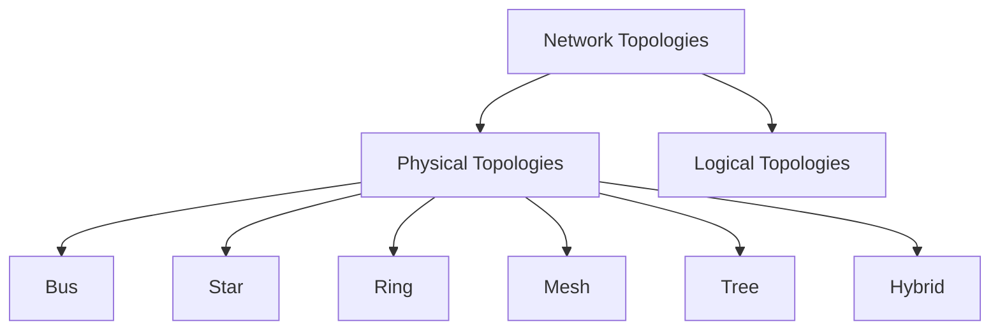

#### 2.1 Bus Topology

```
     Device1    Device2    Device3    Device4
        │          │          │          │
    ────┴──────────┴──────────┴──────────┴────────
           Single Communication Channel
                (Backbone Cable)
```

**Characteristics:**
- All devices share a single communication line
- Terminators at both ends prevent signal reflection
- Simple and cost-effective
- Failure of backbone affects entire network

#### 2.2 Star Topology

```
                    ┌─────────┐
                    │ Central │
                    │  Switch │
                    └────┬────┘
                         │
         ┌───────┬───────┼───────┬───────┐
         │       │       │       │       │
      ┌──┴──┐ ┌──┴──┐ ┌──┴──┐ ┌──┴──┐ ┌──┴──┐
      │ PC1 │ │ PC2 │ │ PC3 │ │ PC4 │ │ PC5 │
      └─────┘ └─────┘ └─────┘ └─────┘ └─────┘
```

**Characteristics:**
- All devices connect to a central hub/switch
- Easy to install and manage
- Failure of one device doesn't affect others
- Central device failure brings down entire network

#### 2.3 Ring Topology

```
       ┌─────┐         ┌─────┐
       │ PC1 │────────▶│ PC2 │
       └─────┘         └─────┘
          ▲               │
          │               ▼
       ┌─────┐         ┌─────┐
       │ PC4 │◀────────│ PC3 │
       └─────┘         └─────┘
```

**Characteristics:**
- Each device connects to exactly two other devices
- Data travels in one direction (unidirectional)
- Token passing mechanism for access control
- Failure of one device can disrupt entire network

#### 2.4 Mesh Topology

```
          ┌─────┐
      ┌───│ PC1 │───┐
      │   └─────┘   │
      │     /   \   │
   ┌──┴──┐      ┌──┴──┐
   │ PC2 │──────│ PC3 │
   └──┬──┘      └──┬──┘
      │   ┌─────┐  │
      └───│ PC4 │──┘
          └─────┘
```

**Characteristics:**
- Every device connects to every other device
- **Full Mesh**: n(n-1)/2 connections needed
- **Partial Mesh**: Some devices have full connections
- Highly reliable but expensive

#### 2.5 Tree (Hierarchical) Topology

```
                  ┌──────────┐
                  │Root Switch│
                  └─────┬────┘
                        │
         ┌──────────────┼──────────────┐
         │              │              │
    ┌────┴────┐    ┌────┴────┐    ┌────┴────┐
    │Switch 1 │    │Switch 2 │    │Switch 3 │
    └────┬────┘    └────┬────┘    └────┬────┘
         │              │              │
    ┌────┼────┐    ┌────┼────┐    ┌────┼────┐
    │    │    │    │    │    │    │    │    │
   PC1  PC2 PC3  PC4  PC5 PC6  PC7  PC8 PC9
```

**Characteristics:**
- Hierarchical structure (root, branches, leaves)
- Scalable and manageable
- Easy to expand
- Failure of higher-level nodes affects entire branch

---

## 3. Networking Devices {#networking-devices}

### 3.1 Hub (Physical Layer Device)

```
┌──────────────────────────────────────────────────────┐
│                    HUB (Layer 1)                     │
│  ┌────────────────────────────────────────────────┐ │
│  │  Receives signal → Amplifies → Broadcasts to  │ │
│  │  ALL ports (flooding)                          │ │
│  └────────────────────────────────────────────────┘ │
│                                                      │
│   Port1   Port2   Port3   Port4   Port5   Port6    │
│     │       │       │       │       │       │       │
└─────┴───────┴───────┴───────┴───────┴───────┴───────┘
```

**How Hub Works:**
1. Receives electrical signal on one port
2. Regenerates/amplifies the signal
3. Broadcasts to **ALL** other ports
4. No intelligence - doesn't examine frames
5. Creates single collision domain
6. Half-duplex communication

**Types:**
- **Passive Hub**: Just connects cables, no signal regeneration
- **Active Hub**: Regenerates and amplifies signals
- **Intelligent Hub**: Has management capabilities

**Limitations:**
- ❌ High collision rate
- ❌ Wastes bandwidth
- ❌ Security issues (all devices see all traffic)
- ❌ No filtering capability

---

### 3.2 Bridge (Data Link Layer Device)

```
┌─────────────────────────────────────────────────────┐
│              BRIDGE (Layer 2)                       │
│  ┌──────────────────────────────────────────────┐  │
│  │ Reads MAC addresses → Makes forwarding       │  │
│  │ decisions → Reduces collision domains        │  │
│  └──────────────────────────────────────────────┘  │
│                                                     │
│    Segment A                    Segment B          │
│    ┌─────────┐                 ┌─────────┐         │
│    │  Devices │◄──── Bridge ───►│ Devices │        │
│    └─────────┘                 └─────────┘         │
│   Collision                     Collision          │
│   Domain 1                      Domain 2           │
└─────────────────────────────────────────────────────┘
```

**How Bridge Works:**

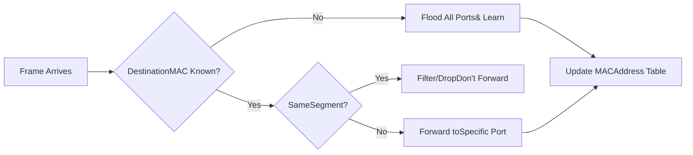

**MAC Address Table Learning:**
```
Port | MAC Address       | Timestamp
-----|-------------------|----------
  1  | 00:1A:2B:3C:4D:5E | 10:30:45
  2  | 00:1A:2B:3C:4D:5F | 10:30:47
  3  | 00:1A:2B:3C:4D:60 | 10:30:50
```

**Functions:**
- ✅ Divides collision domains
- ✅ Filters traffic based on MAC addresses
- ✅ Learns MAC addresses automatically
- ✅ Forwards frames intelligently
- ✅ Can connect different media types

---

### 3.3 Switch (Data Link Layer Device)

```
╔═══════════════════════════════════════════════════════╗
║              NETWORK SWITCH (Layer 2/3)               ║
╠═══════════════════════════════════════════════════════╣
║   ┌─────────────────────────────────────────────┐    ║
║   │    MAC Address Table (CAM Table)            │    ║
║   │  Port | MAC Address       | VLAN            │    ║
║   │  ─────┼───────────────────┼─────            │    ║
║   │   1   | AA:BB:CC:DD:EE:01 | 10              │    ║
║   │   2   | AA:BB:CC:DD:EE:02 | 10              │    ║
║   │   3   | AA:BB:CC:DD:EE:03 | 20              │    ║
║   └─────────────────────────────────────────────┘    ║
║                                                       ║
║  P1   P2   P3   P4   P5   P6   P7   P8   P9   P10   ║
║  │    │    │    │    │    │    │    │    │    │     ║
║  ▼    ▼    ▼    ▼    ▼    ▼    ▼    ▼    ▼    ▼     ║
╚═══════════════════════════════════════════════════════╝
```

**Switch vs Hub Comparison:**

```
┌────────────────┬─────────────────┬─────────────────┐
│   Feature      │      HUB        │     SWITCH      │
├────────────────┼─────────────────┼─────────────────┤
│ OSI Layer      │ Layer 1         │ Layer 2/3       │
│ Intelligence   │ None            │ Smart           │
│ Forwarding     │ Broadcast       │ Unicast         │
│ Collision Dom. │ Single          │ Per Port        │
│ Bandwidth      │ Shared          │ Dedicated       │
│ Speed          │ Half-Duplex     │ Full-Duplex     │
│ MAC Learning   │ No              │ Yes             │
└────────────────┴─────────────────┴─────────────────┘
```

**Switch Operation Workflow:**

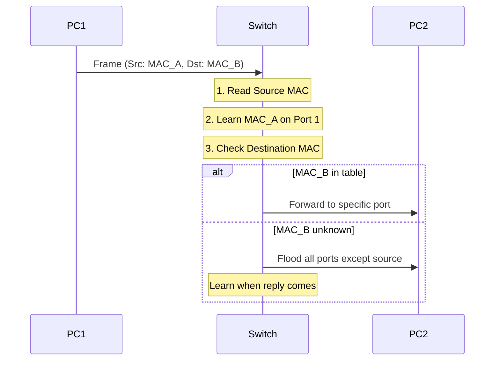

**Switch Forwarding Methods:**
1. **Store-and-Forward**: Receives entire frame, checks for errors, then forwards
2. **Cut-Through**: Forwards as soon as destination MAC is read (low latency)
3. **Fragment-Free**: Checks first 64 bytes, then forwards

**VLAN Capability:**
```
Switch with VLANs:
┌────────────────────────────────────┐
│  VLAN 10 (Sales)                   │
│  Ports: 1, 2, 3                    │
├────────────────────────────────────┤
│  VLAN 20 (Engineering)             │
│  Ports: 4, 5, 6                    │
├────────────────────────────────────┤
│  VLAN 30 (Management)              │
│  Ports: 7, 8                       │
└────────────────────────────────────┘
```

---

### 3.4 Router (Network Layer Device)

```
╔════════════════════════════════════════════════════════╗
║                ROUTER (Layer 3)                        ║
╠════════════════════════════════════════════════════════╣
║  ┌──────────────────────────────────────────────────┐ ║
║  │         Routing Table                            │ ║
║  │  Network      | Next Hop    | Interface | Metric│ ║
║  │  ────────────┼─────────────┼───────────┼────────│ ║
║  │  192.168.1.0 | Direct      | eth0      | 0     │ ║
║  │  192.168.2.0 | Direct      | eth1      | 0     │ ║
║  │  10.0.0.0    | 192.168.1.1 | eth0      | 10    │ ║
║  │  0.0.0.0     | 203.0.113.1 | wan0      | 20    │ ║
║  └──────────────────────────────────────────────────┘ ║
║                                                        ║
║   eth0 (LAN1)    eth1 (LAN2)    wan0 (Internet)      ║
║   192.168.1.1    192.168.2.1    203.0.113.50         ║
║       │              │               │                ║
╚═══════╧══════════════╧═══════════════╧════════════════╝
        │              │               │
    ┌───┴───┐      ┌───┴───┐      ┌────┴────┐
    │Network│      │Network│      │ Internet│
    │   A   │      │   B   │      │         │
    └───────┘      └───────┘      └─────────┘
```

**How Router Works:**

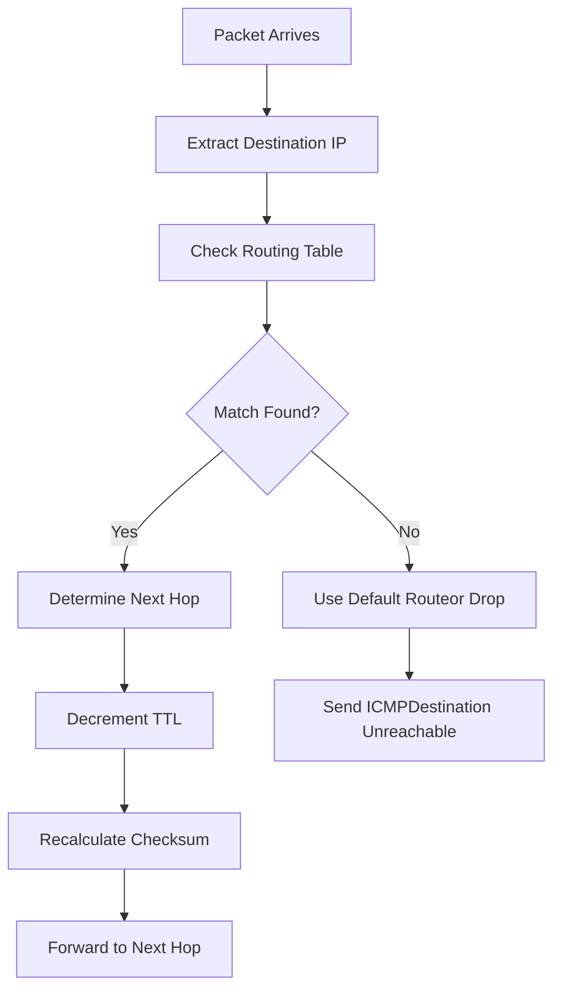

**Router Functions:**
- ✅ Connects different networks (different IP subnets)
- ✅ Makes path determination decisions
- ✅ Provides broadcast domain separation
- ✅ Implements access control lists (ACLs)
- ✅ Performs NAT (Network Address Translation)
- ✅ Can connect different media types

**Example: Connecting Wired and Wireless Networks**

```
┌──────────────────────────────────────────────────────────┐
│                    ROUTER                                │
│  ┌────────────────────────────────────────────────────┐ │
│  │  Wireless Interface (802.11ac)                     │ │
│  │  SSID: MyNetwork                                   │ │
│  │  Frequency: 5 GHz (5.180-5.825 GHz range)         │ │
│  │  Channel Width: 80 MHz                             │ │
│  │  IP: 192.168.1.1/24                               │ │
│  └──────────────────┬─────────────────────────────────┘ │
│                     │                                   │
│  ┌──────────────────┴─────────────────────────────────┐ │
│  │         Router Processing Unit                     │ │
│  │  • Receives WiFi signals (electromagnetic waves)   │ │
│  │  • Demodulates to digital data                     │ │
│  │  • Routes based on IP addresses                    │ │
│  │  • Converts to electrical signals for Ethernet     │ │
│  └──────────────────┬─────────────────────────────────┘ │
│                     │                                   │
│  ┌──────────────────┴─────────────────────────────────┐ │
│  │  Ethernet Interface (RJ-45)                        │ │
│  │  Standard: IEEE 802.3 (Gigabit Ethernet)          │ │
│  │  Frequency: Baseband (not frequency-based)         │ │
│  │  Encoding: Manchester/MLT-3                        │ │
│  │  IP: 192.168.2.1/24                               │ │
│  └────────────────────────────────────────────────────┘ │
└──────────────────────────────────────────────────────────┘
           │                              │
      (Wireless)                      (Wired)
           │                              │
    Laptop, Phone                    Desktop PC
    Tablet, etc.                     Server, etc.
```

**Media Conversion Process:**

1. **Wireless to Wired:**
   - Receives RF signal (5 GHz electromagnetic wave)
   - WiFi chipset demodulates to digital bits
   - Router processes packets (Layer 3)
   - Ethernet controller encodes bits using Manchester encoding
   - Sends electrical signals over Cat6 cable at baseband

2. **Wired to Wireless:**
   - Receives electrical signals from Ethernet cable
   - Decodes Manchester encoding to bits
   - Router processes packets
   - WiFi chipset modulates onto 5 GHz carrier
   - Transmits as electromagnetic waves

---

### 3.5 Modem (Modulator-Demodulator)

```
┌─────────────────────────────────────────────────────┐
│                MODEM                                │
│  ┌───────────────────────────────────────────────┐ │
│  │         MODULATOR                             │ │
│  │  Digital Signal ──► Analog Signal             │ │
│  │  (Computer Data)    (Phone/Cable Line)        │ │
│  │                                               │ │
│  │      010110011 ──► ∿∿∿∿∿∿∿∿                  │ │
│  └───────────────────────────────────────────────┘ │
│                                                     │
│  ┌───────────────────────────────────────────────┐ │
│  │         DEMODULATOR                           │ │
│  │  Analog Signal ──► Digital Signal             │ │
│  │  (Phone/Cable Line)  (Computer Data)          │ │
│  │                                               │ │
│  │      ∿∿∿∿∿∿∿∿ ──► 010110011                  │ │
│  └───────────────────────────────────────────────┘ │
└─────────────────────────────────────────────────────┘
```

**Types of Modems:**

1. **DSL Modem** (Digital Subscriber Line)
   - Uses existing telephone lines
   - Frequency division: Voice (0-4 kHz), Data (25 kHz - 1.1 MHz)
   - Speeds: 1-100 Mbps

2. **Cable Modem**
   - Uses coaxial cable (TV cable)
   - DOCSIS standard
   - Speeds: 100 Mbps - 1 Gbps

3. **Fiber Modem (ONT - Optical Network Terminal)**
   - Converts optical signals to electrical
   - Speeds: 100 Mbps - 10 Gbps

**Modulation Techniques:**
```
ASK (Amplitude Shift Keying):
  1: ▂▂▂▂▂    0: ▁▁▁▁▁

FSK (Frequency Shift Keying):
  1: ∿∿∿∿∿∿   0: ∼∼∼∼∼∼

PSK (Phase Shift Keying):
  1: ∿∿∿∿∿    0: ∽∽∽∽∽
```

---

### 3.6 Wireless Access Point (WAP)

```
╔════════════════════════════════════════════════════════╗
║         WIRELESS ACCESS POINT (WAP)                    ║
╠════════════════════════════════════════════════════════╣
║                                                        ║
║              ((  ))  Wireless Signal                   ║
║           ((    /\    ))  Broadcasting                 ║
║        ((      /  \      ))                           ║
║      ((       /WAP \       ))                         ║
║                └──┘                                    ║
║                 │                                      ║
║                 │ Ethernet Cable                       ║
║                 │ (Wired Backhaul)                    ║
║                 ▼                                      ║
║            ┌─────────┐                                ║
║            │ Switch  │                                ║
║            └─────────┘                                ║
╚════════════════════════════════════════════════════════╝
```

**WAP Functions:**
- Converts wired network to wireless (802.11 WiFi)
- Broadcasts SSID (Service Set Identifier)
- Handles wireless authentication
- Operates on specific channels and frequencies

**WiFi Standards:**
```
Standard | Frequency   | Max Speed | Range
─────────┼─────────────┼───────────┼────────
802.11b  | 2.4 GHz     | 11 Mbps   | 35m
802.11g  | 2.4 GHz     | 54 Mbps   | 38m
802.11n  | 2.4/5 GHz   | 600 Mbps  | 70m
802.11ac | 5 GHz       | 1.3 Gbps  | 35m
802.11ax | 2.4/5/6 GHz | 9.6 Gbps  | 30m
(WiFi 6)
```

---

### 3.7 Repeater/Extender

```
      Signal Path with Repeater:

  Source                                     Destination
  Device                                       Device
    │                                            │
    │ Strong Signal                              │
    ▼                                            ▼
  ▓▓▓▓▓                                        ▓▓▓▓▓
  ▓▓▓▓▓ ─────► ▓▓▓▓ ──► ▓▓▓ ──► ▓▓ ──► ▓      ▓▓▓▓▓
  ▓▓▓▓▓         Weak     Very    Too    Too    ▓▓▓▓▓
  ▓▓▓▓▓                  Weak   Weak   Weak   ▓▓▓▓▓
                                 │
                          ┌──────┴──────┐
                          │  REPEATER   │
                          │ (Regenerate)│
                          └──────┬──────┘
                                 │ Strong Signal Again
                                 ▼
                               ▓▓▓▓▓ ──────────► [Destination]
                               ▓▓▓▓▓
                               ▓▓▓▓▓
```

**Repeater Functions:**
- Regenerates weakened signals
- Extends network distance
- Operates at Physical Layer (Layer 1)
- No intelligence - just amplifies
- Both wired and wireless versions exist

---

### 3.8 Gateway

```
┌──────────────────────────────────────────────────────┐
│                   GATEWAY                            │
│  ┌────────────────────────────────────────────────┐ │
│  │  Protocol Translation                          │ │
│  │  Network A  ◄──────────────►  Network B        │ │
│  │  (Protocol 1)                (Protocol 2)      │ │
│  │  Example: IPv4  ◄─────►  IPv6                 │ │
│  │          TCP/IP ◄─────►  OSI                  │ │
│  └────────────────────────────────────────────────┘ │
│                                                      │
│  Can operate at any layer (typically Layer 7)       │
└──────────────────────────────────────────────────────┘
```

---

### Device Comparison Table

```
┌──────────┬────────┬─────────────┬───────────┬──────────────┐
│ Device   │ Layer  │ Collision   │ Broadcast │ Intelligence │
│          │        │ Domains     │ Domains   │              │
├──────────┼────────┼─────────────┼───────────┼──────────────┤
│ Hub      │   1    │ Single      │ Single    │ None         │
│ Repeater │   1    │ Extends     │ Extends   │ None         │
│ Bridge   │   2    │ Multiple    │ Single    │ MAC Learning │
│ Switch   │   2    │ Per Port    │ Multiple* │ MAC + VLAN   │
│ Router   │   3    │ Per Port    │ Per Port  │ IP Routing   │
│ Gateway  │  7     │ Per Port    │ Per Port  │ Full Stack   │
└──────────┴────────┴─────────────┴───────────┴──────────────┘
* with VLANs
```

---

## 4. Transmission Media {#transmission-media}

Transmission media is the physical path between transmitter and receiver in a network.

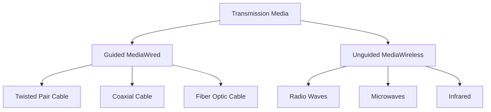

---

### 4.1 Guided Transmission Media (Wired)

#### A) Twisted Pair Cable

```
┌─────────────────────────────────────────────────────────┐
│            TWISTED PAIR CABLE STRUCTURE                 │
│                                                         │
│    Outer Jacket                                        │
│    ┌────────────────────────────────────────────┐     │
│    │  ╔════════════════════════════════════╗    │     │
│    │  ║  Twisted Pairs (4 pairs = 8 wires)║    │     │
│    │  ║                                    ║    │     │
│    │  ║   Orange  ╱╲╱╲╱╲╱╲  White-Orange  ║    │     │
│    │  ║           ╲╱╲╱╲╱╲╱                 ║    │     │
│    │  ║                                    ║    │     │
│    │  ║   Green   ╱╲╱╲╱╲╱╲  White-Green   ║    │     │
│    │  ║           ╲╱╲╱╲╱╲╱                 ║    │     │
│    │  ║                                    ║    │     │
│    │  ║   Blue    ╱╲╱╲╱╲╱╲  White-Blue    ║    │     │
│    │  ║           ╲╱╲╱╲╱╲╱                 ║    │     │
│    │  ║                                    ║    │     │
│    │  ║   Brown   ╱╲╱╲╱╲╱╲  White-Brown   ║    │     │
│    │  ║           ╲╱╲╱╲╱╲╱                 ║    │     │
│    │  ╚════════════════════════════════════╝    │     │
│    └────────────────────────────────────────────┘     │
│                                                         │
│  Why Twisted? To reduce electromagnetic interference   │
│  and crosstalk between pairs                           │
└─────────────────────────────────────────────────────────┘
```

**Types:**

**1. UTP (Unshielded Twisted Pair)**
```
  No Shielding
  ┌─────────────────────┐
  │  ╱╲╱╲╱╲  ╱╲╱╲╱╲   │
  │  ╲╱╲╱╲╱  ╲╱╲╱╲╱   │
  │  ╱╲╱╲╱╲  ╱╲╱╲╱╲   │
  │  ╲╱╲╱╲╱  ╲╱╲╱╲╱   │
  └─────────────────────┘
  Cheaper, more flexible
  Susceptible to EMI
```

**2. STP (Shielded Twisted Pair)**
```
  Metal Foil/Braid Shielding
  ┌─────────────────────┐
  │ ▓▓▓▓▓▓▓▓▓▓▓▓▓▓▓▓▓ │ ← Shield
  │ ▓ ╱╲╱╲  ╱╲╱╲ ▓    │
  │ ▓ ╲╱╲╱  ╲╱╲╱ ▓    │
  │ ▓ ╱╲╱╲  ╱╲╱╲ ▓    │
  │ ▓▓▓▓▓▓▓▓▓▓▓▓▓▓▓▓▓ │
  └─────────────────────┘
  Better EMI protection
  More expensive, less flexible
```

**Category Ratings (CAT Cables):**

```
┌──────┬────────────┬──────────────┬─────────────┬─────────────┐
│ Cat  │ Bandwidth  │ Max Speed    │ Max Distance│ Applications│
├──────┼────────────┼──────────────┼─────────────┼─────────────┤
│ Cat3 │ 16 MHz     │ 10 Mbps      │ 100m        │ Phone/10BT  │
│ Cat5 │ 100 MHz    │ 100 Mbps     │ 100m        │ Fast Eth    │
│ Cat5e│ 100 MHz    │ 1 Gbps       │ 100m        │ Gigabit Eth │
│ Cat6 │ 250 MHz    │ 1 Gbps (10G*)│ 100m (55m*) │ 10G Ethernet│
│ Cat6a│ 500 MHz    │ 10 Gbps      │ 100m        │ 10G Ethernet│
│ Cat7 │ 600 MHz    │ 10 Gbps      │ 100m        │ Data Centers│
│ Cat8 │ 2000 MHz   │ 25-40 Gbps   │ 30m         │ Data Centers│
└──────┴────────────┴──────────────┴─────────────┴─────────────┘
```

**Frequency vs Bandwidth Explanation:**
- **Frequency (MHz)**: How fast the signal oscillates - higher frequency allows more rapid signal changes
- **Bandwidth (Mbps/Gbps)**: Amount of data that can be transmitted - depends on frequency, encoding, and cable quality
- Higher category cables support higher frequencies, enabling higher bandwidth

**RJ-45 Connector Pin Configuration:**

```
    ┌─────────────────────┐
    │  8  7  6  5  4  3  2  1    Looking at connector
    │  │  │  │  │  │  │  │  │    (clip down)
    └──┴──┴──┴──┴──┴──┴──┴──┘

T568B Standard (Most Common):
Pin 1: White-Orange  (TX+)
Pin 2: Orange        (TX-)
Pin 3: White-Green   (RX+)
Pin 4: Blue          (Not used in 100Mbps)
Pin 5: White-Blue    (Not used in 100Mbps)
Pin 6: Green         (RX-)
Pin 7: White-Brown   (Not used in 100Mbps)
Pin 8: Brown         (Not used in 100Mbps)

For Gigabit Ethernet, all 8 pins are used.
```

**How Twisted Pairs Maintain Signal Integrity:**

1. **Twisting reduces crosstalk**: Each twist ensures equal exposure to interference
2. **Differential signaling**: Uses pairs (TX+/TX-, RX+/RX-)
3. **Cancellation**: Interference affects both wires equally, cancels out
4. **Not frequency-based like wireless**: Uses baseband signaling with Manchester/MLT-3 encoding

```
Signal Propagation in UTP:

     TX+ ────▲────▲────▲────▲────▲──►
              ╲    ╲    ╲    ╲    ╲
               ╲    ╲    ╲    ╲    ╲
                ╲    ╲    ╲    ╲    ╲
     TX- ────────▼────▼────▼────▼────▼──►
     
    Receiver calculates: Signal = TX+ minus TX-
    Noise affects both equally, so it cancels out
```

---

#### B) Coaxial Cable

```
┌───────────────────────────────────────────────────────┐
│         COAXIAL CABLE CROSS-SECTION                   │
│                                                       │
│  Outer Jacket (PVC/Polyethylene)                     │
│  ┌────────────────────────────────────────────┐     │
│  │ Braided Shield (Copper mesh)               │     │
│  │ ╔══════════════════════════════════════╗   │     │
│  │ ║ Dielectric Insulator (Foam/Plastic) ║   │     │
│  │ ║ ┌──────────────────────────────────┐ ║   │     │
│  │ ║ │ Inner Conductor (Copper wire)    │ ║   │     │
│  │ ║ │        ═══════════════           │ ║   │     │
│  │ ║ └──────────────────────────────────┘ ║   │     │
│  │ ╚══════════════════════════════════════╝   │     │
│  └────────────────────────────────────────────┘     │
└───────────────────────────────────────────────────────┘
```

**Types:**
- **RG-6**: Cable TV, Internet (75Ω impedance)
- **RG-59**: CCTV, older TV systems
- **RG-11**: Long-distance runs

**Advantages:**
- ✅ Better shielding than UTP
- ✅ Longer distances (500m+)
- ✅ Higher bandwidth
- ✅ Less susceptible to EMI

**Disadvantages:**
- ❌ More expensive than UTP
- ❌ Less flexible
- ❌ Bulkier

---

#### C) Fiber Optic Cable

```
╔═══════════════════════════════════════════════════════════╗
║           FIBER OPTIC CABLE STRUCTURE                     ║
╠═══════════════════════════════════════════════════════════╣
║                                                           ║
║  Outer Jacket                                            ║
║  ┌────────────────────────────────────────────────┐     ║
║  │ Kevlar Strength Member                         │     ║
║  │ ▓▓▓▓▓▓▓▓▓▓▓▓▓▓▓▓▓▓▓▓▓▓▓▓▓▓▓▓▓▓▓▓▓▓▓▓▓▓▓▓▓▓   │     ║
║  │   Buffer Coating                               │     ║
║  │   ┌──────────────────────────────────────┐     │     ║
║  │   │ Cladding (Lower refractive index)   │     │     ║
║  │   │ ╔════════════════════════════════╗  │     │     ║
║  │   │ ║ Core (Higher refractive index)║  │     │     ║
║  │   │ ║    ─ ─ ─ → Light Ray → ─ ─ ─ ║  │     │     ║
║  │   │ ║    (Total Internal Reflection)║  │     │     ║
║  │   │ ╚════════════════════════════════╝  │     │     ║
║  │   └──────────────────────────────────────┘     │     ║
║  │ ▓▓▓▓▓▓▓▓▓▓▓▓▓▓▓▓▓▓▓▓▓▓▓▓▓▓▓▓▓▓▓▓▓▓▓▓▓▓▓▓▓▓   │     ║
║  └────────────────────────────────────────────────┘     ║
╚═══════════════════════════════════════════════════════════╝
```

**Light Propagation - Total Internal Reflection:**

```
     Core (n=1.48)
  ══════════════════════
  ║   ╲   ↓   ╱       ║   Light bounces
  ║    ╲  ↓  ╱        ║   due to TIR
  ║     ╲ ↓ ╱         ║
  ║      ╲↓╱          ║
  ║       ↓           ║
  ══════════════════════
     Cladding (n=1.46)
```

**Types of Fiber Optic:**

**1. Single-Mode Fiber (SMF)**
```
  Core: 8-10 μm (very thin)
  ════════════════════════
  ║    ────────→         ║  Single light path
  ════════════════════════
  
  • Long distances (40+ km)
  • Higher bandwidth
  • Laser light source (1310nm, 1550nm)
  • More expensive
```

**2. Multi-Mode Fiber (MMF)**
```
  Core: 50-62.5 μm (thicker)
  ════════════════════════
  ║   ╲  ↓  ╱           ║  Multiple light paths
  ║    ╲ ↓ ╱            ║
  ║     ╲↓╱             ║
  ════════════════════════
  
  • Shorter distances (2 km max)
  • Lower cost
  • LED light source (850nm, 1300nm)
  • Modal dispersion occurs
```

**Fiber Optic Advantages:**
- ✅ Extremely high bandwidth (Tbps capable)
- ✅ Long distances (100+ km without repeaters)
- ✅ Immune to EMI
- ✅ Secure (hard to tap)
- ✅ Lightweight

**Fiber Optic Disadvantages:**
- ❌ Expensive
- ❌ Fragile
- ❌ Requires specialized skills for installation
- ❌ Difficult to splice/terminate

**Wavelengths and Windows:**
```
Window | Wavelength | Attenuation | Use
───────┼────────────┼─────────────┼─────────────
  1st  | 850 nm     | High        | MMF, LAN
  2nd  | 1310 nm    | Medium      | SMF, Metro
  3rd  | 1550 nm    | Low         | SMF, Long-haul
```

---

### 4.2 Unguided Transmission Media (Wireless)

#### A) Radio Waves

```
Frequency Range: 3 kHz - 1 GHz

    Transmitter                                 Receiver
        │                                           │
        │  )))                                )))  │
        │ )))                                  (((  │
        │)))           Radio Waves             ((( │
        ├─────────────────────────────────────────┤
              Omnidirectional Propagation

Applications:
• AM/FM Radio
• TV Broadcasting
• Mobile Communications (GSM, LTE, 5G)
• WiFi (2.4 GHz, 5 GHz)
• Bluetooth
```

**Characteristics:**
- Can penetrate walls
- Omnidirectional
- Long-range
- Subject to interference

---

#### B) Microwaves

```
Frequency Range: 1 GHz - 300 GHz

    Antenna 1                               Antenna 2
    ┌──────┐                                 ┌──────┐
    │  │   │                                 │   │  │
    │  │)) │ ═══════════════════════════► │ ((│  │
    │  │   │    Directional Beam             │   │  │
    └──────┘                                 └──────┘
    
    Line-of-Sight Required

Types:
1. Terrestrial Microwave (2-40 GHz)
   • Point-to-point communication
   • Cell phone towers
   
2. Satellite Microwave (1-40 GHz)
   • GPS, Satellite TV
   • GEO, MEO, LEO satellites
```

**Satellite Orbits:**
```
         ┌─────────────────────┐
         │  GEO (35,786 km)    │ ← Geostationary
         │  Latency: 240ms     │
         └─────────────────────┘
              ┌───────────┐
              │ MEO       │ ← GPS Satellites
              │ (2k-35k)  │
              └───────────┘
         ┌─────────────┐
         │ LEO         │ ← Starlink, Iridium
         │ (160-2000km)│
         └─────────────┘
    ═══════════════════════════
           Earth Surface
```

---

#### C) Infrared

```
Frequency Range: 300 GHz - 400 THz
Wavelength: 1mm - 700nm

    Remote                                    TV/Device
    ┌──────┐                                 ┌──────┐
    │  ▓▓  │                                 │  ○   │
    │  ▓▓  │ ═════════════════════════════► │  ○   │
    │  ▓▓  │    IR Beam (Line-of-Sight)     │  ○   │
    └──────┘                                 └──────┘

Applications:
• TV Remotes
• IrDA (Infrared Data Association)
• Short-range device communication
```

**Characteristics:**
- Cannot penetrate walls
- Line-of-sight required
- Short range (few meters)
- Very secure
- No licensing required

---

### 4.3 Four Factors for Selecting Best Transmission Media

```
┌──────────────────────────────────────────────────────────────┐
│  FOUR CRITICAL FACTORS FOR TRANSMISSION MEDIA SELECTION      │
└──────────────────────────────────────────────────────────────┘
```

#### 1. **Bandwidth (Data Capacity)**

```
 Bandwidth = Amount of data that can be transmitted

   Low Bandwidth                      High Bandwidth
        │                                   │
   ┌────▼────┐                         ┌────▼────┐
   │ Twisted │                         │  Fiber  │
   │  Pair   │ ◄──── Comparison ────► │  Optic  │
   └─────────┘                         └─────────┘
   100 Mbps -                          100 Gbps+
   1 Gbps

┌─────────────┬──────────────────┬────────────────┐
│   Medium    │   Bandwidth      │  Best For      │
├─────────────┼──────────────────┼────────────────┤
│ UTP Cat5e   │ 100 MHz (1Gbps)  │ LANs           │
│ UTP Cat6a   │ 500 MHz (10Gbps) │ Data centers   │
│ Coaxial     │ 1-2 GHz          │ Cable Internet │
│ Fiber SMF   │ Unlimited*       │ Backbone, WAN  │
│ WiFi 6      │ 9.6 Gbps         │ Wireless LAN   │
│ 5G          │ 20 Gbps          │ Mobile         │
└─────────────┴──────────────────┴────────────────┘
* Practically limited by equipment
```

---

#### 2. **Radiation (Signal Leakage/Emission)**

```
 Radiation = Electromagnetic energy leaking from the medium

   High Radiation                    Low/No Radiation
   (Security Risk)                   (More Secure)
        │                                   │
   ┌────▼────┐                         ┌────▼────┐
   │Wireless │                         │  Fiber  │
   │  WiFi   │ ◄──── Comparison ────► │  Optic  │
   └─────────┘                         └─────────┘
   
   Can be                              Light doesn't
   intercepted                         leak from cable

┌─────────────┬──────────────┬──────────────────────┐
│   Medium    │  Radiation   │  Security Level      │
├─────────────┼──────────────┼──────────────────────┤
│ UTP         │ Medium       │ Can be tapped        │
│ STP         │ Low          │ Better shielding     │
│ Coaxial     │ Very Low     │ Good shielding       │
│ Fiber Optic │ None         │ Extremely secure     │
│ Wireless    │ High         │ Requires encryption  │
└─────────────┴──────────────┴──────────────────────┘
```

**EMI Shielding Comparison:**
```
UTP (Unshielded):
┌─────────────────┐
│  ╱╲╱╲  ╱╲╱╲    │  ← EMI can enter/leave
│  ╲╱╲╱  ╲╱╲╱    │
└─────────────────┘

STP (Shielded):
┌─────────────────┐
│▓▓▓▓▓▓▓▓▓▓▓▓▓▓▓│  ← Metal shield blocks EMI
│▓ ╱╲╱╲  ╱╲╱╲ ▓│
│▓ ╲╱╲╱  ╲╱╲╱ ▓│
│▓▓▓▓▓▓▓▓▓▓▓▓▓▓▓│
└─────────────────┘
```

---

#### 3. **Noise Absorption (Interference Susceptibility)**

```
 Noise = Unwanted signals that corrupt data

   High Noise Absorption             Low Noise Absorption
   (More Interference)               (Less Interference)
        │                                   │
   ┌────▼────┐                         ┌────▼────┐
   │   UTP   │                         │  Fiber  │
   │  Cable  │ ◄──── Comparison ────► │  Optic  │
   └─────────┘                         └─────────┘

Sources of Noise:
╔════════════════════════════════════════════════════╗
║ • Electromagnetic Interference (EMI)               ║
║   - From power lines, motors, fluorescent lights   ║
║                                                    ║
║ • Radio Frequency Interference (RFI)              ║
║   - From wireless devices, cell towers            ║
║                                                    ║
║ • Crosstalk                                       ║
║   - Signal bleeding between adjacent wires        ║
║                                                    ║
║ • Thermal Noise                                   ║
║   - Random electron movement due to heat          ║
╚════════════════════════════════════════════════════╝

┌─────────────┬──────────────┬──────────────────────┐
│   Medium    │  Noise Level │  Environment Needed  │
├─────────────┼──────────────┼──────────────────────┤
│ UTP         │ High         │ Office (low EMI)     │
│ STP         │ Medium       │ Industrial           │
│ Coaxial     │ Low          │ Any                  │
│ Fiber Optic │ Immune       │ High EMI areas       │
│ Wireless    │ Very High    │ Clear spectrum       │
└─────────────┴──────────────┴──────────────────────┘
```

**Why Fiber is Immune to EMI:**
```
Electrical Cable:           Fiber Optic Cable:
                           
    ╱╲  EMI                      EMI
   ╱  ╲  │                        │
  ╱    ╲ ▼                        ▼
 ────────────── ← Interferes  ═════════════
 Electrical                   Light signal
 Signal                       (Not affected by
                              electromagnetic
 ❌ Corrupted                 fields)
                              
                              ✅ Clean Signal
```

---

#### 4. **Attenuation (Signal Loss Over Distance)**

```
 Attenuation = Loss of signal strength as it travels

   High Attenuation                 Low Attenuation
   (Needs repeaters)                (Long distances OK)
        │                                   │
   ┌────▼────┐                         ┌────▼────┐
   │Wireless │                         │  Fiber  │
   │  WiFi   │ ◄──── Comparison ────► │  Optic  │
   └─────────┘                         └─────────┘
   30-70m range                        40+ km range

Signal Strength over Distance:

Strong  ████████████
        ███████████╮
        ██████████  ╲
        █████████    ╲  UTP Cable
        ████████      ╲
        ███            ╲
Weak    ██──────────────▼
        0m    50m   100m   (Max distance)

Strong  ████████████████████████████████
        ████████████████████████████████ Fiber Optic
        ███████████████████████████████╮
        ██████████████████████████████  ╲
Weak    ██──────────────────────────────▼
        0km   10km   20km   30km   40km+

┌─────────────┬────────────┬──────────────────────┐
│   Medium    │ Max Dist.  │  Attenuation Rate    │
├─────────────┼────────────┼──────────────────────┤
│ UTP Cat5e   │ 100m       │ High (5-6 dB/100m)   │
│ UTP Cat6    │ 100m       │ Medium (4 dB/100m)   │
│ Coaxial     │ 500m       │ Medium (2-3 dB/100m) │
│ SMF Fiber   │ 40+ km     │ Very Low (0.2dB/km)  │
│ MMF Fiber   │ 2 km       │ Low (3 dB/km)        │
│ WiFi 2.4GHz │ 70m        │ High                 │
│ WiFi 5GHz   │ 35m        │ Very High            │
└─────────────┴────────────┴──────────────────────┘
```

**dB (Decibel) Explanation:**
```
Attenuation in dB = 10 × log₁₀(P_out / P_in)

  3 dB loss  = Signal reduced to 50% power
  6 dB loss  = Signal reduced to 25% power
  10 dB loss = Signal reduced to 10% power
  20 dB loss = Signal reduced to 1% power

Lower dB/distance = Better (less loss)
```

---

### Comparison Matrix: All Four Factors

```
┌──────────┬───────────┬───────────┬──────────┬────────────┬──────────┐
│  Medium  │ Bandwidth │ Radiation │  Noise   │Attenuation │  Score   │
│          │ (Higher=✓)│(Lower=✓)  │(Lower=✓) │ (Lower=✓)  │          │
├──────────┼───────────┼───────────┼──────────┼────────────┼──────────┤
│ UTP      │    ⭐⭐    │    ⭐⭐    │   ⭐⭐    │    ⭐⭐     │   6/20   │
│ STP      │    ⭐⭐    │   ⭐⭐⭐   │   ⭐⭐⭐   │    ⭐⭐     │   10/20  │
│ Coaxial  │   ⭐⭐⭐   │   ⭐⭐⭐⭐  │   ⭐⭐⭐⭐  │   ⭐⭐⭐    │   14/20  │
│ Fiber    │  ⭐⭐⭐⭐⭐ │  ⭐⭐⭐⭐⭐ │  ⭐⭐⭐⭐⭐ │  ⭐⭐⭐⭐⭐  │   20/20  │
│ Wireless │   ⭐⭐⭐   │    ⭐     │   ⭐     │    ⭐      │   6/20   │
└──────────┴───────────┴───────────┴──────────┴────────────┴──────────┘

Best Overall: Fiber Optic Cable
Best Cost/Performance: Cat6a UTP
Best Flexibility: Wireless
```

---

## 5. Signal Transmission and Encoding {#signal-transmission}

### 5.1 Types of Signals

```
╔═══════════════════════════════════════════════════════════╗
║              ANALOG vs DIGITAL SIGNALS                    ║
╠═══════════════════════════════════════════════════════════╣
║                                                           ║
║  ANALOG SIGNAL (Continuous):                             ║
║     ∿∿∿∿∿∿∿∿∿∿∿∿∿∿∿∿∿∿∿∿                              ║
║    ╱           ╲                ╱                          ║
║   ╱             ╲              ╱                           ║
║  ╱               ╲            ╱                            ║
║ ────────────────────────────────── Time                  ║
║                                                           ║
║  • Infinite possible values                               ║
║  • Varies smoothly                                        ║
║  • Subject to noise accumulation                          ║
║  • Examples: Voice, music, radio waves                    ║
║                                                           ║
╠═══════════════════════════════════════════════════════════╣
║                                                           ║
║  DIGITAL SIGNAL (Discrete):                              ║
║                                                           ║
║    ████    ████    ████    ████                          ║
║    ████    ████    ████    ████                          ║
║ ────    ────    ────    ────    ──── Time              ║
║    1  0    1  0    1  0    1  0                         ║
║                                                           ║
║  • Only discrete values (typically 0 and 1)              ║
║  • Square wave pattern                                    ║
║  • Can be regenerated without loss                        ║
║  • Examples: Computer data, digital phone                 ║
║                                                           ║
╚═══════════════════════════════════════════════════════════╝
```

---

### 5.2 Digital Encoding Schemes

Digital data must be encoded into signals for transmission.

#### A) Non-Return to Zero (NRZ)

```
Data:    1    0    1    1    0    0    1
       ┌────┐         ┌─────────┐         ┌────
       │    │         │         │         │
   ────┘    └─────────┘         └─────────┘
   
   High = 1, Low = 0
   
   Problems:
   • Synchronization issues with long runs of same bit
   • No self-clocking
```

#### B) Manchester Encoding (Used in Ethernet)

```
Data:    1    0    1    1    0    0    1
       ┌──╲╱──┐╱╲╱──┌──╲╱──┌──╲╱──┐╱╲╱──┐╱╲╱──┌──╲╱──
       │      │      │      │      │      │      │
   ────┘      └──────┘      └──────┘      └──────┘
   
   Transition in middle of each bit period:
   • 1 = High-to-Low transition
   • 0 = Low-to-High transition
   
   Advantages:
   ✅ Self-clocking (receiver can extract clock)
   ✅ No DC component
   ✅ Easy error detection
   
   Disadvantage:
   ❌ Requires double the bandwidth
```

#### C) Differential Manchester

```
Data:    1    0    1    1    0    0    1
       ──╲╱────╱╲╱╲──╲╱────╲╱────╱╲╱╲──╱╲╱╲──╲╱──
         
   • Transition at start of bit period = 0
   • No transition at start = 1
   • Always transition in middle (for clocking)
   
   More robust against polarity reversals
```

#### D) 4B/5B Encoding

```
Maps 4 data bits to 5 code bits to ensure sufficient transitions

Data bits  →  Code bits
0000       →  11110
0001       →  01001
0010       →  10100
...
1111       →  11101

Then uses NRZI (Non-Return to Zero Inverted)
Used in Fast Ethernet (100BASE-TX)
```

#### E) MLT-3 (Multi-Level Transmit - 3 levels)

```
Used in Fast Ethernet and Gigabit Ethernet

Three voltage levels: +V, 0, -V

Data: 1    0    0    1    1    0    1    1
      
 +V   ╱╲         ╱╲   ╱╲      ╱╲   ╱╲
  0  ╱  ╲───────╱  ╲─╱  ╲────╱  ╲─╱  ╲
 -V       ╲───────╱                  

• 1 = Transition to next level
• 0 = No change

Advantage: Lower frequency components (less EMI)
```

---

### 5.3 Modulation Techniques (for Analog Transmission)

When transmitting digital data over analog medium (like telephone lines):

#### A) Amplitude Shift Keying (ASK)

```
Data:    1    1    0    1    0    0    1

     ∿∿∿∿∿∿∿∿∿∿∿∿∿∿∿∿∿∿∿∿∿∿∿∿∿∿∿∿∿∿∿
    ╱              ╲   ╱              ╲
   ╱                ╲ ╱                ╲
  ────────────────────────────────────────
  1 = High amplitude
  0 = Low/zero amplitude
  
  Susceptible to noise
```

#### B) Frequency Shift Keying (FSK)

```
Data:    1    0    1    1    0    1

  ∿∿∿∿∿∿∿   ∼∼∼∼∼   ∿∿∿∿∿∿∿∿∿∿∿∿   ∼∼∼   ∿∿∿∿
  
  1 = Higher frequency
  0 = Lower frequency
  
  More resistant to noise than ASK
  Used in older modems
```

#### C) Phase Shift Keying (PSK)

```
Data:    1    0    1    0    1

     ∿∿∿∿∿  ∽∽∽∽∽  ∿∿∿∿∿  ∽∽∽∽∽  ∿∿∿∿∿
    ╱    ╲╱    ╲╱    ╲╱    ╲╱    ╲
   ╱      ╲      ╲      ╲      ╲      ╲
  
  1 = Phase 0°
  0 = Phase 180° (inverted)
  
  Most resistant to noise
  Used in modern communications (WiFi, LTE)
```

#### D) Quadrature Amplitude Modulation (QAM)

```
Combines amplitude and phase modulation
Can encode multiple bits per symbol

QAM-16: 4 bits per symbol (16 possible states)
QAM-64: 6 bits per symbol
QAM-256: 8 bits per symbol

Used in:
• Cable modems
• WiFi (802.11ac/ax)
• Digital TV
• DSL
```

---

### 5.4 Transmission Modes

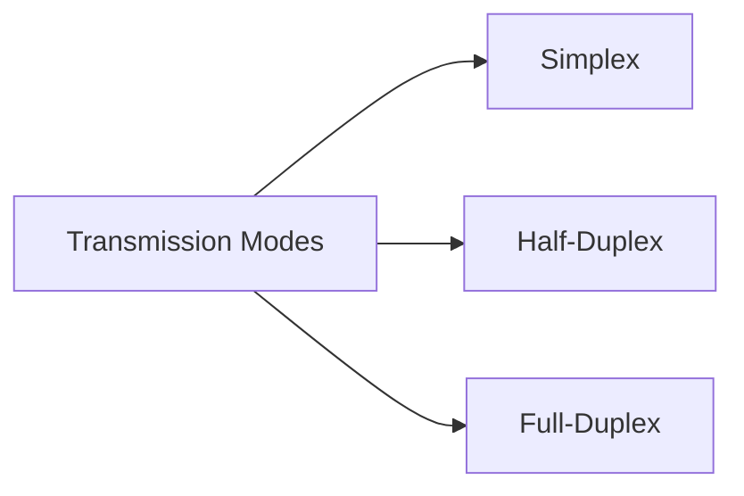

#### A) Simplex

```
    Sender ──────────────────────► Receiver
    
    One-way communication only
    
    Examples:
    • TV Broadcasting
    • Radio Broadcasting
    • Keyboard to computer
```

#### B) Half-Duplex

```
    Device A ◄──────────────────── Device B
    
              (At one time)
    
    Device A ──────────────────────► Device B
    
              (At another time)
    
    Two-way, but not simultaneously
    
    Examples:
    • Walkie-talkies
    • CB Radio
    • Old Ethernet (with hubs)
```

#### C) Full-Duplex

```
    Device A ──────────────────────► Device B
             ◄──────────────────────
    
    Two-way, simultaneously
    
    Examples:
    • Telephone
    • Modern Ethernet (with switches)
    • Fiber optic (separate transmit/receive)
```

---

## 6. Multiplexing Techniques {#multiplexing}

**Multiplexing** allows multiple signals to share a single communication medium.

```
╔═══════════════════════════════════════════════════════════╗
║                  MULTIPLEXING (MUX)                       ║
╠═══════════════════════════════════════════════════════════╣
║                                                           ║
║  Multiple Input Signals → Single Medium → Multiple Output║
║                                                           ║
║   Signal 1 ─┐                              ┌─ Signal 1  ║
║   Signal 2 ─┤                              ├─ Signal 2  ║
║   Signal 3 ─┼─► MUX ─► Medium ─► DEMUX ─►├─ Signal 3  ║
║   Signal 4 ─┤                              ├─ Signal 4  ║
║   Signal 5 ─┘                              └─ Signal 5  ║
║                                                           ║
╚═══════════════════════════════════════════════════════════╝
```

### 6.1 Frequency Division Multiplexing (FDM)

```
┌────────────────────────────────────────────────────────┐
│         FREQUENCY DIVISION MULTIPLEXING (FDM)          │
│                                                        │
│  Frequency                                             │
│    ▲                                                   │
│    │   ┌──────┐  ┌──────┐  ┌──────┐  ┌──────┐       │
│    │   │Signal│  │Signal│  │Signal│  │Signal│       │
│    │   │  1   │  │  2   │  │  3   │  │  4   │       │
│    │   └──────┘  └──────┘  └──────┘  └──────┘       │
│    │                                                   │
│    └────────────────────────────────────────► Time    │
│                                                        │
│  Each signal occupies different frequency band         │
│                                                        │
│  Guard bands prevent interference:                     │
│   ┌───┐ gap ┌───┐ gap ┌───┐ gap ┌───┐               │
│   │ 1 │     │ 2 │     │ 3 │     │ 4 │               │
│   └───┘     └───┘     └───┘     └───┘               │
└────────────────────────────────────────────────────────┘

Applications:
• Cable TV (each channel at different frequency)
• Radio broadcasting (FM: 88-108 MHz)
• First-generation analog cellular (AMPS)
```

**Example: Cable TV**
```
Channel 2:  54-60 MHz
Channel 3:  60-66 MHz
Channel 4:  66-72 MHz
...
Channel 83: 884-890 MHz

All transmitted simultaneously on same cable
TV receiver tunes to specific frequency
```

---

### 6.2 Time Division Multiplexing (TDM)

```
┌────────────────────────────────────────────────────────┐
│         TIME DIVISION MULTIPLEXING (TDM)               │
│                                                        │
│  Time Slots:                                           │
│   │ S1 │ S2 │ S3 │ S4 │ S1 │ S2 │ S3 │ S4 │ S1 │...  │
│   └────┴────┴────┴────┴────┴────┴────┴────┴────┘     │
│                                                        │
│  Each signal gets entire bandwidth for a time slot     │
│                                                        │
│  Signal 1: ████    ████    ████                       │
│  Signal 2:     ████    ████    ████                   │
│  Signal 3:         ████    ████    ████               │
│  Signal 4:             ████    ████    ████           │
│                                                        │
│  ─────────────────────────────────────────► Time      │
└────────────────────────────────────────────────────────┘

Types:

1. Synchronous TDM:
   • Fixed time slots
   • Slot allocated even if no data
   • Wasted bandwidth if source idle
   • Used in: T1/E1 lines, SONET/SDH

2. Statistical TDM (Asynchronous):
   • Dynamic allocation
   • Only active sources get slots
   • More efficient
   • Needs addressing overhead
```

**T1 Carrier Example:**
```
╔═══════════════════════════════════════════════════════╗
║                T1 FRAME STRUCTURE                     ║
╠═══════════════════════════════════════════════════════╣
║  1 Frame = 193 bits                                   ║
║  ┌─┬──────┬──────┬──────┬───────┬──────┬──────┐     ║
║  │F│ CH1  │ CH2  │ CH3  │  ...  │ CH23 │ CH24 │     ║
║  │ │8 bits│8 bits│8 bits│       │8 bits│8 bits│     ║
║  └─┴──────┴──────┴──────┴───────┴──────┴──────┘     ║
║   F = Framing bit                                     ║
║                                                       ║
║  • 24 voice channels                                  ║
║  • 8000 frames/second                                 ║
║  • 8 bits per channel per frame                       ║
║  • Total: 1.544 Mbps                                  ║
║    (24 × 8 × 8000 + 8000 framing bits)               ║
╚═══════════════════════════════════════════════════════╝
```

---

### 6.3 Wavelength Division Multiplexing (WDM)

```
┌────────────────────────────────────────────────────────┐
│    WAVELENGTH DIVISION MULTIPLEXING (WDM)              │
│        (Used in Fiber Optic Networks)                  │
│                                                        │
│                  ┌─────────────┐                       │
│  λ1 (1310nm) ───┤             ├─── λ1                 │
│  λ2 (1330nm) ───┤   OPTICAL   ├─── λ2                 │
│  λ3 (1350nm) ───┤     MUX     ├─── λ3                 │
│  λ4 (1370nm) ───┤             ├─── λ4                 │
│                  └──────┬──────┘                       │
│                         │                              │
│                   Fiber Optic Cable                    │
│                   (Single fiber carries                │
│                    multiple wavelengths)               │
│                         │                              │
│                  ┌──────┴──────┐                       │
│            ┌────┤   OPTICAL   ├────┐                  │
│            │    │   DEMUX     │    │                  │
│            ▼    └─────────────┘    ▼                  │
│          λ1, λ2, λ3, λ4...                            │
│                                                        │
│  Types:                                                │
│  • CWDM (Coarse): 8-18 channels, 20nm spacing         │
│  • DWDM (Dense): 40-80+ channels, 0.8nm spacing       │
│  • DWDM can reach 160 channels = 16 Tbps!             │
└────────────────────────────────────────────────────────┘
```

**How It Works:**
1. Each input uses different wavelength (color) of light
2. Prism (MUX) combines all wavelengths onto single fiber
3. All wavelengths travel simultaneously
4. Prism (DEMUX) separates wavelengths at receiving end

**Visual Representation:**
```
     Laser 1 (1310nm - Red)     ─┐
     Laser 2 (1330nm - Orange)  ─┤
     Laser 3 (1350nm - Yellow)  ─┼─► Prism ═══► Fiber
     Laser 4 (1370nm - Green)   ─┤            (Rainbow)
     Laser 5 (1390nm - Blue)    ─┘
```

---

### 6.4 Code Division Multiplexing (CDM/CDMA)

```
┌────────────────────────────────────────────────────────┐
│     CODE DIVISION MULTIPLE ACCESS (CDMA)               │
│                                                        │
│  All signals use same frequency simultaneously         │
│  Each user has unique code (spreading sequence)        │
│                                                        │
│  Station A: Code = [-1 -1 -1 +1 +1 -1 +1 +1]         │
│  Station B: Code = [-1 -1 +1 -1 +1 +1 +1 -1]         │
│  Station C: Code = [-1 +1 -1 +1 +1 +1 -1 -1]         │
│  Station D: Code = [-1 +1 -1 -1 -1 -1 +1 -1]         │
│                                                        │
│  Process:                                              │
│  1. Data bit XORed with code                          │
│  2. Spread across wider bandwidth                      │
│  3. Multiple users transmit simultaneously             │
│  4. Receiver uses same code to extract original        │
│                                                        │
│  Original bit: 1                                       │
│  Code:        [-1 -1 -1 +1 +1 -1 +1 +1]              │
│  Transmitted: [-1 -1 -1 +1 +1 -1 +1 +1]              │
│                                                        │
│  Original bit: 0                                       │
│  Code:        [-1 -1 -1 +1 +1 -1 +1 +1]              │
│  Transmitted: [+1 +1 +1 -1 -1 +1 -1 -1]  (inverted)  │
└────────────────────────────────────────────────────────┘

Applications:
• 3G Cellular (CDMA2000, WCDMA)
• GPS
• Military communications
```

---

### 6.5 How MUX Works in Transmission System

```
╔═══════════════════════════════════════════════════════════════╗
║         COMPLETE MULTIPLEXING SYSTEM WITH SWITCH              ║
╠═══════════════════════════════════════════════════════════════╣
║                                                               ║
║  Location A                 Transmission                      ║
║                               Medium                          ║
║  PC 1 ─┐                   (High Speed)        Location B     ║
║  PC 2 ─┤                                                      ║
║  PC 3 ─┼─► [SWITCH] ─┐                    ┌─► [SWITCH] ─┐   ║
║  PC 4 ─┤              │                    │              ├─► PC 5
║  PC 5 ─┘              │                    │              ├─► PC 6
║                       ▼                    ▼              ├─► PC 7
║                     [MUX] ═══════════► [DEMUX]           └─► PC 8
║                       ▲                    ▲                  ║
║  Server 1 ─┐          │                    │                  ║
║  Server 2 ─┼─► [SWITCH]                    └─► [SWITCH] ─┐   ║
║  Server 3 ─┘                                              ├─► Server 4
║                                                           └─► Server 5
║                                                               ║
╚═══════════════════════════════════════════════════════════════╝

Process Flow:
┌─────────────────────────────────────────────────────────────┐
│ 1. Devices connect to SWITCH (Layer 2)                     │
│    • Switch learns MAC addresses                           │
│    • Forwards frames to appropriate devices locally        │
│                                                             │
│ 2. For inter-site communication:                           │
│    • Switch forwards to MUX                                │
│                                                             │
│ 3. MULTIPLEXER (Physical Layer)                            │
│    • Combines multiple low-speed inputs                    │
│    • Creates single high-speed output                      │
│    • Uses TDM, FDM, or WDM technique                       │
│                                                             │
│ 4. TRANSMISSION MEDIUM                                      │
│    • High-speed fiber optic link (WDM)                     │
│    • T1/T3 line (TDM)                                      │
│    • Microwave link (FDM)                                  │
│                                                             │
│ 5. DEMULTIPLEXER                                           │
│    • Separates combined signal                             │
│    • Forwards to correct outputs                           │
│                                                             │
│ 6. Local SWITCH at Location B                              │
│    • Distributes to destination devices                    │
└─────────────────────────────────────────────────────────────┘
```

**Example: Enterprise WAN with WDM**

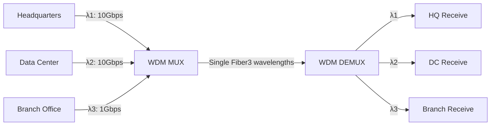

---

### 6.6 Signal Forwarding and Error Correction in MUX Systems

#### Signal Forwarding:

```
┌──────────────────────────────────────────────────────┐
│  How Multiplexer Forwards Signals                    │
│                                                      │
│  INPUT STAGE:                                        │
│  ┌────────┐     ┌────────┐                          │
│  │ Input 1│────►│ Buffer │                          │
│  └────────┘     └───┬────┘                          │
│  ┌────────┐         │                                │
│  │ Input 2│────►┌───┴────┐                          │
│  └────────┘     │ Buffer │                          │
│  ┌────────┐     └───┬────┘                          │
│  │ Input 3│────►┌───┴────┐                          │
│  └────────┘     │ Buffer │                          │
│                 └───┬────┘                          │
│  MULTIPLEXING:      │                                │
│                 ┌───┴─────────┐                      │
│                 │ Multiplexer │                      │
│                 │   Logic     │                      │
│                 │ • TDM: Time │                      │
│                 │ • FDM: Freq │                      │
│                 │ • WDM: λ    │                      │
│                 └───┬─────────┘                      │
│  OUTPUT:            │                                │
│                 ┌───┴────┐                           │
│                 │Combined│                           │
│                 │ Signal │────► Transmission         │
│                 └────────┘                           │
└──────────────────────────────────────────────────────┘
```

#### Error Correction:

```
╔════════════════════════════════════════════════════════╗
║         ERROR DETECTION & CORRECTION IN MUX            ║
╠════════════════════════════════════════════════════════╣
║                                                        ║
║ 1. PARITY CHECK                                        ║
║    Data: 1011001                                       ║
║    Parity bit: 0 (even parity)                        ║
║    Transmitted: 10110010                               ║
║                                                        ║
║    If received with error: 10110110                    ║
║    Parity: 1 (odd) → Error detected! ✗                ║
║                                                        ║
║ 2. CHECKSUM                                            ║
║    Sum all data bytes                                  ║
║    Send sum with data                                  ║
║    Receiver recalculates and compares                  ║
║                                                        ║
║ 3. CYCLIC REDUNDANCY CHECK (CRC)                       ║
║    Polynomial division                                 ║
║    Remainder is CRC code                               ║
║    Very effective for burst errors                     ║
║    Used in Ethernet, WiFi                              ║
║                                                        ║
║ 4. FORWARD ERROR CORRECTION (FEC)                      ║
║    Reed-Solomon codes                                  ║
║    Hamming codes                                       ║
║    Can correct errors without retransmission           ║
║                                                        ║
║    Original:  1011                                     ║
║    Hamming:   1011010 (added redundancy)              ║
║    Received:  1001010 (1 bit error)                   ║
║    Corrected: 1011010 → 1011 ✓                        ║
╚════════════════════════════════════════════════════════╝
```

**ARQ (Automatic Repeat Request):**
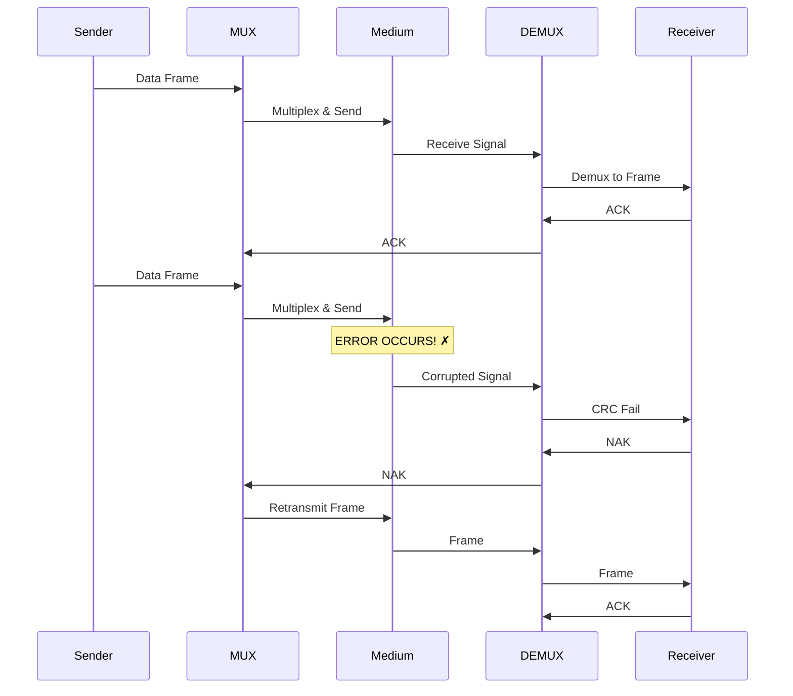

---

## 7. Network Performance & Transmission Impairments {#network-performance}

### 7.1 Performance Metrics

```
┌──────────────────────────────────────────────────────────┐
│            KEY PERFORMANCE METRICS                       │
└──────────────────────────────────────────────────────────┘
```

#### A) Bandwidth

```
 Bandwidth = Maximum data transfer rate

  ┌────────────────────────────────────────┐
  │  Like a pipe carrying water:           │
  │                                        │
  │  Narrow Pipe (Low Bandwidth):          │
  │  ─────────────────                     │
  │  ▓▓▓▓ → Limited flow                   │
  │  ─────────────────                     │
  │                                        │
  │  Wide Pipe (High Bandwidth):           │
  │  ═══════════════════                   │
  │  ▓▓▓▓▓▓▓▓▓▓ → More flow                │
  │  ═══════════════════                   │
  └────────────────────────────────────────┘

Measurement Units:
• bps   = bits per second
• Kbps  = Kilobits (10³)
• Mbps  = Megabits (10⁶)
• Gbps  = Gigabits (10⁹)
• Tbps  = Terabits (10¹²)

Example Bandwidths:
• Dial-up Modem: 56 Kbps
• DSL: 1-100 Mbps
• Cable: 100-1000 Mbps
• Fiber (Home): 1-10 Gbps
• Backbone: 100 Gbps - 1 Tbps
```

#### B) Throughput

```
 Throughput = Actual data transfer rate (always ≤ Bandwidth)

  Bandwidth: 100 Mbps  ┌─────────────────────┐
                       │ Available Capacity  │
                       └─────────────────────┘
                            ▲
  Throughput: 75 Mbps  ┌────┴──────────┐
                       │ Actual Usage  │
                       └───────────────┘
                       
  Factors reducing throughput:
  • Protocol overhead
  • Network congestion
  • Processing delays
  • Errors and retransmissions
```

#### C) Latency (Delay)

```
 Latency = Time for data to travel from source to destination

  ┌──────────┐                           ┌──────────┐
  │ Sender   │  ─────── 50ms ─────────► │ Receiver │
  └──────────┘                           └──────────┘
  
  Components of Latency:
  
  1. Propagation Delay = Distance / Speed of light
     • Fiber: ~5 μs per km
     • Copper: ~5 μs per km
     
  2. Transmission Delay = Packet Size / Bandwidth
     • 1500 bytes at 1 Gbps = 12 μs
     
  3. Processing Delay = Time to process packet
     • Router: 1-10 μs
     
  4. Queuing Delay = Time waiting in buffer
     • Variable, depends on congestion

  Total Latency = Sum of all delays
  
  Examples:
  • LAN: < 1 ms
  • Cross-country: 30-50 ms
  • Satellite (GEO): 240-280 ms
  • Around the world: 200-300 ms
```

#### D) Jitter

```
 Jitter = Variation in latency

  Expected:  ───50ms───50ms───50ms───50ms───
             Packet 1  Packet 2  Packet 3
             
  With Jitter: ───50ms───45ms───55ms───48ms───
  
  ┌──────────────────────────────────────────┐
  │  Jitter Buffer smooths variations:       │
  │                                          │
  │  Input (variable):  50  45  55  48  52   │
  │          ▲▼▲▼▲▼▲▼▲▼                      │
  │  Buffer: [───────────]                   │
  │          ───────────                      │
  │  Output (stable): 50  50  50  50  50     │
  └──────────────────────────────────────────┘
  
  Critical for:
  • VoIP (Voice over IP)
  • Video conferencing
  • Online gaming
  • Real-time applications
```

#### E) Packet Loss

```
 Packet Loss = Percentage of packets that don't reach destination

  Sent:     [1][2][3][4][5][6][7][8][9][10]
  
  Received: [1][2][✗][4][5][✗][7][8][9][10]
  
  Loss Rate = (2/10) × 100% = 20%
  
  Causes:
  • Buffer overflow (congestion)
  • Transmission errors
  • Route changes
  • Equipment failure
  
  Impact:
  • TCP: Automatic retransmission (slower)
  • UDP: Lost forever (affects voice/video quality)
  • Acceptable: < 1% for data, < 0.1% for VoIP
```

---

### 7.2 Transmission Impairments

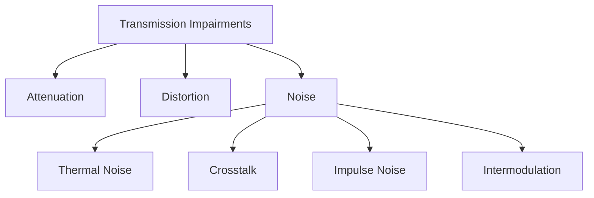

#### A) Attenuation

```
╔═══════════════════════════════════════════════════════╗
║                   ATTENUATION                         ║
╠═══════════════════════════════════════════════════════╣
║                                                       ║
║  Signal strength decreases over distance              ║
║                                                       ║
║  Source        Distance        Destination            ║
║   100%  ───→  75%  ───→  50%  ───→  25%  ───→  10%  ║
║   ████         ███         ██          █         ▌    ║
║                                                       ║
║  Solution: REPEATERS/AMPLIFIERS                       ║
║                                                       ║
║   100%  ───→  25%  ───→ [AMP] ───→  100% ───→  25%  ║
║   ████         █          ███         ████       █    ║
║                           ▲                           ║
║                      Regenerates                      ║
║                       signal                          ║
╚═══════════════════════════════════════════════════════╝

Attenuation Formula:
dB = 10 × log₁₀(P_out / P_in)

Example:
  Input Power: 100 mW
  Output Power: 1 mW
  Attenuation = 10 × log₁₀(1/100) = -20 dB
```

---

#### B) Distortion

```
╔═══════════════════════════════════════════════════════╗
║                    DISTORTION                         ║
╠═══════════════════════════════════════════════════════╣
║                                                       ║
║  Signal shape changes during transmission             ║
║                                                       ║
║  Original Signal:                                     ║
║      ╱╲      ╱╲                                      ║
║     ╱  ╲    ╱  ╲                                     ║
║    ╱    ╲  ╱    ╲                                    ║
║  ──      ──      ──                                  ║
║                                                       ║
║  Distorted Signal:                                    ║
║     ╱╲    ╱─╲                                        ║
║    ╱  ╲  ╱   ╲                                       ║
║   ╱    ╲╱     ╲___                                   ║
║  ──                                                   ║
║  (Phase shifted, amplitude changed)                   ║
║                                                       ║
║  Types:                                               ║
║  • Delay Distortion: Different frequency components  ║
║    travel at different speeds                         ║
║  • Amplitude Distortion: Frequency-dependent loss    ║
║  • Phase Distortion: Non-linear phase shift          ║
╚═══════════════════════════════════════════════════════╝

Solution: Equalization (compensate for distortion)
```

---

#### C) Noise Types

**1. Thermal Noise (White Noise/Johnson Noise)**

```
╔═══════════════════════════════════════════════════════╗
║               THERMAL NOISE                           ║
╠═══════════════════════════════════════════════════════╣
║                                                       ║
║  Random electron movement due to heat                 ║
║  Present in all electronic devices                    ║
║  Predictable and unavoidable                          ║
║                                                       ║
║  Signal:  ∿∿∿∿∿∿∿∿∿∿∿∿∿∿∿                           ║
║  Noise:   ▴▾▴▾▴▾▴▴▾▴▾▴▾▾▴                           ║
║  Result:  ∿▴∿▾∿▴∿∿▾∿▴∿▾∿▾▴∿                         ║
║                                                       ║
║  Power = k × T × B                                    ║
║  k = Boltzmann constant (1.38 × 10⁻²³ J/K)          ║
║  T = Temperature (Kelvin)                             ║
║  B = Bandwidth (Hz)                                   ║
║                                                       ║
║  Reduction: Cool equipment, minimize bandwidth        ║
╚═══════════════════════════════════════════════════════╝
```

**2. Crosstalk**

```
╔═══════════════════════════════════════════════════════╗
║                   CROSSTALK                           ║
╠═══════════════════════════════════════════════════════╣
║                                                       ║
║  Signal from one wire interferes with adjacent wire   ║
║                                                       ║
║  Wire A:  ∿∿∿∿∿∿∿∿∿∿∿∿∿∿∿                           ║
║           │ │ │ │ │ │  (Electromagnetic coupling)    ║
║  Wire B:  ─────────────▴▾▴▾▴▾── (Unwanted signal)    ║
║                                                       ║
║  Near-End Crosstalk (NEXT):                           ║
║  Transmitter ───────∿∿∿───────►                      ║
║              │ │ │                                    ║
║              ▼ ▼ ▼                                    ║
║  Adjacent ◄──▴▾▴──────────────                       ║
║  (Interference at same end)                           ║
║                                                       ║
║  Far-End Crosstalk (FEXT):                           ║
║  Transmitter ───────∿∿∿───────►                      ║
║                       │ │ │                           ║
║                       ▼ ▼ ▼                           ║
║  Adjacent ──────────────▴▾▴────►                     ║
║  (Interference at far end)                            ║
║                                                       ║
║  Solution:                                            ║
║  • Twist wire pairs (cancels interference)           ║
║  • Shielding (STP)                                    ║
║  • Increase wire separation                           ║
╚═══════════════════════════════════════════════════════╝
```

**3. Impulse Noise**

```
╔═══════════════════════════════════════════════════════╗
║                 IMPULSE NOISE                         ║
╠═══════════════════════════════════════════════════════╣
║                                                       ║
║  Sudden, sharp spikes of energy                       ║
║  Most disruptive type of noise                        ║
║                                                       ║
║  Normal Signal:                                       ║
║    ∿∿∿∿∿∿∿∿∿∿∿∿∿∿∿∿∿∿∿∿                             ║
║                                                       ║
║  With Impulse Noise:                                  ║
║    ∿∿∿∿∿∿█∿∿∿∿∿∿∿∿∿█∿∿∿                             ║
║          ▲               ▲                            ║
║        Spike           Spike                          ║
║                                                       ║
║  Causes:                                              ║
║  • Lightning strikes                                  ║
║  • Power line fluctuations                            ║
║  • Switching transients                               ║
║  • Electromagnetic motors                             ║
║                                                       ║
║  Effects:                                             ║
║  • Bit errors in digital transmission                 ║
║  • Burst errors (multiple consecutive bits)           ║
║                                                       ║
║  Solution:                                            ║
║  • Error detection and correction codes               ║
║  • Shielding and grounding                            ║
║  • Surge protectors                                   ║
╚═══════════════════════════════════════════════════════╝
```

**4. Intermodulation Noise**

```
When multiple signals share same medium,
they can create unwanted sum/difference frequencies

Signal 1: f₁ = 100 MHz
Signal 2: f₂ = 200 MHz

Intermodulation products:
f₁ + f₂ = 300 MHz (interference!)
f₂ - f₁ = 100 MHz (interference!)
2f₁ = 200 MHz (interference!)

Common in:
• Wireless communications
• Cable TV systems
• Frequency Division Multiplexing

Solution: Proper frequency planning, filters
```

---

### 7.3 Signal-to-Noise Ratio (SNR)

```
╔═══════════════════════════════════════════════════════╗
║           SIGNAL-TO-NOISE RATIO (SNR)                 ║
╠═══════════════════════════════════════════════════════╣
║                                                       ║
║  SNR = Ratio of signal power to noise power           ║
║                                                       ║
║  SNR (dB) = 10 × log₁₀(Signal Power / Noise Power)   ║
║                                                       ║
║  Higher SNR = Better quality                          ║
║                                                       ║
║  Good SNR (30 dB):                                    ║
║  Signal: ████████████████████████████                 ║
║  Noise:  ▴▾▴▾▴                                       ║
║  Clear signal!                                        ║
║                                                       ║
║  Poor SNR (5 dB):                                     ║
║  Signal: ████████████████████████████                 ║
║  Noise:  ▴▾▴▾▴▾▴▾▴▾▴▾▴▾▴▾▴▾▴▾                       ║
║  Difficult to distinguish!                            ║
║                                                       ║
║  Shannon's Channel Capacity:                          ║
║  C = B × log₂(1 + SNR)                               ║
║  C = Maximum data rate (bps)                          ║
║  B = Bandwidth (Hz)                                   ║
║                                                       ║
║  Example:                                             ║
║  B = 3000 Hz (telephone line)                         ║
║  SNR = 1000 (30 dB)                                   ║
║  C = 3000 × log₂(1001) ≈ 30 kbps                     ║
╚═══════════════════════════════════════════════════════╝
```

---

## 8. Switching Techniques {#switching-techniques}

Switching determines the path that data takes through a network.

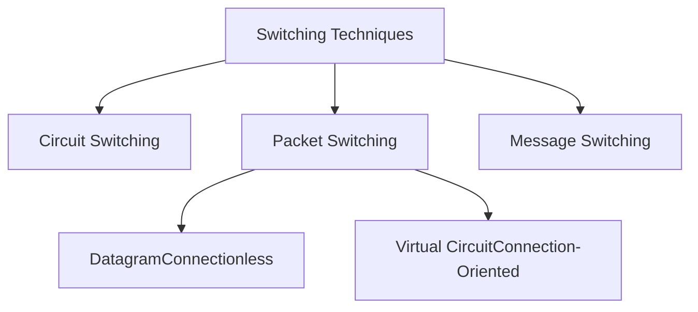

---

### 8.1 Circuit Switching

```
╔═══════════════════════════════════════════════════════════╗
║                  CIRCUIT SWITCHING                        ║
╠═══════════════════════════════════════════════════════════╣
║                                                           ║
║  Dedicated path established for entire communication      ║
║                                                           ║
║  Phases:                                                  ║
║  1. Connection Setup                                      ║
║  2. Data Transfer                                         ║
║  3. Connection Teardown                                   ║
║                                                           ║
║  Example: Traditional Telephone System (PSTN)            ║
║                                                           ║
║  Caller A ─────┐                    ┌───── Caller B      ║
║                │                    │                     ║
║              ┌─▼────────────────────▼─┐                  ║
║              │   Telephone Network    │                  ║
║              │  ┌──────────────────┐  │                  ║
║              │  │ Dedicated Circuit│  │                  ║
║              │  │ Reserved for call│  │                  ║
║              │  └──────────────────┘  │                  ║
║              └────────────────────────┘                  ║
║                                                           ║
║  Timeline:                                                ║
║  ├────Setup────┼────Data Transfer────┼────Teardown───┤  ║
║  0s           2s                    120s             122s║
║                                                           ║
║  During 118s transfer:                                    ║
║  • Path reserved exclusively                              ║
║  • No sharing with other users                            ║
║  • Even during silence (wasted bandwidth)                 ║
╚═══════════════════════════════════════════════════════════╝

Advantages:
✅ Guaranteed bandwidth
✅ Fixed delay (predictable)
✅ No congestion during data transfer
✅ In-order delivery

Disadvantages:
❌ Inefficient (wasted capacity during idle times)
❌ Setup time required
❌ If any link fails, entire connection drops
❌ Not suitable for bursty data
```

**Circuit Switching Types:**

**1. Space Division Switching**
```
Physical separate paths

┌────────────────────────┐
│   Crossbar Switch      │
│                        │
│  In1 ─┬─┬─┬─┬─        │
│  In2 ─┼─┼─┼─┼─        │
│  In3 ─┼─┼─┼─┼─        │
│       │ │ │ │         │
│       │ │ │ └─ Out1   │
│       │ │ └─── Out2   │
│       │ └───── Out3   │
│       └─────── Out4   │
└────────────────────────┘

Physical crosspoints connect inputs to outputs
```

**2. Time Division Switching**
```
Share common path using time slots

Time Slot: │ 1 │ 2 │ 3 │ 4 │ 1 │ 2 │ 3 │ 4 │
           └───┴───┴───┴───┴───┴───┴───┴───┘
Connection 1: Uses slot 1
Connection 2: Uses slot 2
Connection 3: Uses slot 3
Connection 4: Uses slot 4

Used in digital telephone systems (T1, E1)
```

---

### 8.2 Packet Switching

```
╔═══════════════════════════════════════════════════════════╗
║                  PACKET SWITCHING                         ║
╠═══════════════════════════════════════════════════════════╣
║                                                           ║
║  Data broken into small packets                           ║
║  Each packet routed independently                         ║
║  No dedicated path required                               ║
║                                                           ║
║  Large Message:                                           ║
║  ████████████████████████████████████████                ║
║                                                           ║
║  Broken into Packets:                                     ║
║  [Hdr│Data1] [Hdr│Data2] [Hdr│Data3] [Hdr│Data4]        ║
║                                                           ║
║  Each packet contains:                                    ║
║  • Source address                                         ║
║  • Destination address                                    ║
║  • Sequence number                                        ║
║  • Data payload                                           ║
║  • Error checking                                         ║
║                                                           ║
║  Packets can take different routes:                       ║
║                                                           ║
║  Source ─┬─► Router A ───┐                              ║
║           │               ├──► Router D ──► Destination  ║
║           └─► Router B ──┬┘                              ║
║                          │                                ║
║               Router C ──┘                                ║
║                                                           ║
║  Packets may arrive out of order!                         ║
║  Receiver reassembles in correct sequence                 ║
╚═══════════════════════════════════════════════════════════╝

Advantages:
✅ Efficient use of bandwidth (statistical multiplexing)
✅ No setup time (can start immediately)
✅ Route around failures
✅ Suitable for bursty traffic

Disadvantages:
❌ Variable delay (queuing)
❌ Packets can be lost
❌ Out-of-order delivery
❌ Overhead of packet headers
```

---

### 8.2.1 Datagram Packet Switching (Connectionless)

```
╔═══════════════════════════════════════════════════════════╗
║              DATAGRAM SWITCHING                           ║
╠═══════════════════════════════════════════════════════════╣
║                                                           ║
║  • Each packet treated independently                      ║
║  • No connection setup required                           ║
║  • Packets may take different paths                       ║
║  • Used by: IP (Internet Protocol), UDP                   ║
║                                                           ║
║  Packet 1 Path: A → R1 → R3 → B                         ║
║  Packet 2 Path: A → R2 → R4 → B                         ║
║  Packet 3 Path: A → R1 → R4 → B                         ║
║                                                           ║
║  Routing Decision at EACH router:                         ║
║                                                           ║
║       Packet Arrives                                      ║
║           │                                               ║
║           ▼                                               ║
║  ┌─────────────────┐                                     ║
║  │ Read Destination│                                     ║
║  └────────┬────────┘                                     ║
║           │                                               ║
║           ▼                                               ║
║  ┌─────────────────┐                                     ║
║  │ Check Routing   │                                     ║
║  │ Table           │                                     ║
║  └────────┬────────┘                                     ║
║           │                                               ║
║           ▼                                               ║
║  ┌─────────────────┐                                     ║
║  │ Forward to Best │                                     ║
║  │ Next Hop        │                                     ║
║  └─────────────────┘                                     ║
║                                                           ║
║  Routing Table Example:                                   ║
║  ┌──────────────┬──────────────┬──────┐                 ║
║  │ Destination  │ Next Hop     │ Cost │                 ║
║  ├──────────────┼──────────────┼──────┤                 ║
║  │ 192.168.1.0  │ Router A     │  10  │                 ║
║  │ 192.168.2.0  │ Router B     │  15  │                 ║
║  │ 0.0.0.0      │ Default GW   │  20  │                 ║
║  └──────────────┴──────────────┴──────┘                 ║
╚═══════════════════════════════════════════════════════════╝

Characteristics:
• Fast (no setup delay)
• Flexible (adapts to network changes)
• No guarantees (best-effort delivery)
• Packets may arrive out of order
```

---

### 8.2.2 Virtual Circuit Switching (Connection-Oriented)

```
╔═══════════════════════════════════════════════════════════╗
║           VIRTUAL CIRCUIT SWITCHING                       ║
╠═══════════════════════════════════════════════════════════╣
║                                                           ║
║  • Logical connection established before data transfer    ║
║  • All packets follow same path                           ║
║  • Used by: ATM, Frame Relay, MPLS, TCP (over IP)        ║
║                                                           ║
║  Phases:                                                  ║
║  1. Setup: Establish virtual circuit                      ║
║  2. Data Transfer: Send packets                           ║
║  3. Teardown: Release circuit                             ║
║                                                           ║
║  Setup Phase:                                             ║
║  Source ─► R1 ─► R2 ─► R3 ─► Destination                ║
║         (Setup Request)                                   ║
║  Source ◄─ R1 ◄─ R2 ◄─ R3 ◄─ Destination                ║
║         (Setup Acknowledgment)                            ║
║                                                           ║
║  Data Transfer Phase:                                     ║
║  All packets: Source ─► R1 ─► R2 ─► R3 ─► Dest          ║
║  (Same path for all)                                      ║
║                                                           ║
║  Virtual Circuit Table (at Router R1):                    ║
║  ┌────────────┬─────────┬─────────────┐                 ║
║  │ Incoming   │ Outgoing│ Next        │                 ║
║  │ Port & VCI │ Port    │ Hop         │                 ║
║  ├────────────┼─────────┼─────────────┤                 ║
║  │ Port1/VCI5 │ Port2   │ Router R2   │                 ║
║  │ Port3/VCI8 │ Port4   │ Router R4   │                 ║
║  └────────────┴─────────┴─────────────┘                 ║
║  VCI = Virtual Circuit Identifier                         ║
╚═══════════════════════════════════════════════════════════╝

Types:
1. PVC (Permanent Virtual Circuit)
   • Pre-configured
   • Always available
   • Like leased line

2. SVC (Switched Virtual Circuit)
   • Established on-demand
   • Released when done
   • Like dial-up connection

Advantages:
✅ In-order delivery guaranteed
✅ More predictable performance
✅ Quality of Service (QoS) possible

Disadvantages:
❌ Setup delay
❌ Less flexible than datagrams
❌ If link fails, must re-establish
```

---

### 8.3 Message Switching

```
╔═══════════════════════════════════════════════════════════╗
║              MESSAGE SWITCHING                            ║
║             (Store and Forward)                           ║
╠═══════════════════════════════════════════════════════════╣
║                                                           ║
║  • Entire message stored at each intermediate node        ║
║  • Message forwarded when next link available             ║
║  • No longer used for real-time data                      ║
║  • Historical: Telegraph systems, email                   ║
║                                                           ║
║  Source ──► [Router 1] ──► [Router 2] ──► Destination    ║
║             [Store    ]    [Store    ]                    ║
║             [entire   ]    [entire   ]                    ║
║             [message  ]    [message  ]                    ║
║                                                           ║
║  Timeline:                                                ║
║  ├──Transmit──┼──Store──┼──Transmit──┼──Store──┼─────┤  ║
║  Source    Router 1   Router 1    Router 2   Dest       ║
║                                                           ║
║  Advantages:                                              ║
║  ✅ No path setup required                               ║
║  ✅ Can wait for best route                              ║
║  ✅ Error checking at each hop                           ║
║  ✅ Can broadcast to multiple destinations               ║
║                                                           ║
║  Disadvantages:                                           ║
║  ❌ Long delays (store entire message)                   ║
║  ❌ Requires large storage at intermediate nodes          ║
║  ❌ Not suitable for interactive applications             ║
║  ❌ Message size limits                                   ║
╚═══════════════════════════════════════════════════════════╝
```

---

### Switching Comparison

```
┌──────────────┬────────────┬──────────────┬────────────────┐
│ Feature      │ Circuit    │ Datagram     │ Virtual Circuit│
│              │ Switching  │ Packet       │ Packet         │
├──────────────┼────────────┼──────────────┼────────────────┤
│ Path         │ Dedicated  │ Dynamic      │ Fixed (logical)│
│ Setup        │ Required   │ None         │ Required       │
│ State Info   │ At switches│ None         │ At switches    │
│ Addressing   │ Once       │ Every packet │ Once (VC ID)   │
│ Routing      │ At setup   │ Every packet │ At setup       │
│ Order        │ Preserved  │ May vary     │ Preserved      │
│ Bandwidth    │ Fixed      │ Dynamic      │ Dynamic        │
│ Overhead     │ Low        │ High         │ Medium         │
│ Delay        │ Fixed      │ Variable     │ Variable       │
│ Congestion   │ At setup   │ At each node │ At each node   │
│ Examples     │ PSTN       │ IP, UDP      │ ATM, MPLS, TCP │
└──────────────┴────────────┴──────────────┴────────────────┘
```

---

## 9. Cables, Ports & Electronics {#cables-and-ports}

### 9.1 Cable Types Deep Dive

#### UTP (Unshielded Twisted Pair)

```
╔═══════════════════════════════════════════════════════════╗
║              UTP CABLE DETAILED STRUCTURE                 ║
╠═══════════════════════════════════════════════════════════╣
║                                                           ║
║  PVC Outer Jacket (Protection)                            ║
║  ┌───────────────────────────────────────────────────┐   ║
║  │                                                   │   ║
║  │  Rip Cord (for easy jacket removal)              │   ║
║  │  ─────────────────────────────────────────        │   ║
║  │                                                   │   ║
║  │  Pair 1: Orange/White-Orange (Transmit+/-)       │   ║
║  │  ╱╲╱╲╱╲╱╲╱╲╱╲╱╲╱╲╱╲╱╲╱╲╱╲  (3.5 twists/inch)  │   ║
║  │  ╲╱╲╱╲╱╲╱╲╱╲╱╲╱╲╱╲╱╲╱╲╱╲╱                      │   ║
║  │                                                   │   ║
║  │  Pair 2: Green/White-Green (Receive+/-)          │   ║
║  │  ╱╲╱╲╱╲╱╲╱╲╱╲╱╲╱╲╱╲╱╲  (4 twists/inch)        │   ║
║  │  ╲╱╲╱╲╱╲╱╲╱╲╱╲╱╲╱╲╱╲╱                          │   ║
║  │                                                   │   ║
║  │  Pair 3: Blue/White-Blue (Not used in 100Mbps)   │   ║
║  │  ╱╲╱╲╱╲╱╲╱╲╱╲╱╲╱╲  (3 twists/inch)            │   ║
║  │  ╲╱╲╱╲╱╲╱╲╱╲╱╲╱╲╱                              │   ║
║  │                                                   │   ║
║  │  Pair 4: Brown/White-Brown (Not used in 100Mbps) │   ║
║  │  ╱╲╱╲╱╲╱╲╱╲╱╲╱╲  (4.5 twists/inch)            │   ║
║  │  ╲╱╲╱╲╱╲╱╲╱╲╱╲╱                                │   ║
║  │                                                   │   ║
║  │  Note: Each pair has different twist rate        │   ║
║  │  to minimize crosstalk between pairs              │   ║
║  └───────────────────────────────────────────────────┘   ║
╚═══════════════════════════════════════════════════════════╝

Wire Gauge: 22-24 AWG (American Wire Gauge)
• 24 AWG = 0.5mm diameter
• Solid core: Better for permanent installations
• Stranded: More flexible, for patch cables
```

**Twist Rate Importance:**
```
Different pairs have different twist rates:

Pair 1 (Orange):  ╱╲╱╲╱╲╱╲╱╲╱╲╱╲
Pair 2 (Green):   ╱╲╱╲╱╲╱╲╱╲╱╲╱╲╱╲
Pair 3 (Blue):    ╱╲╱╲╱╲╱╲╱╲
Pair 4 (Brown):   ╱╲╱╲╱╲╱╲╱╲╱╲╱╲╱╲╱╲

Why different rates?
• Prevents constructive interference
• Reduces crosstalk between pairs
• Minimizes external EMI pickup
```

---

#### STP (Shielded Twisted Pair)

```
╔═══════════════════════════════════════════════════════════╗
║              STP CABLE STRUCTURE                          ║
╠═══════════════════════════════════════════════════════════╣
║                                                           ║
║  PVC Outer Jacket                                         ║
║  ┌───────────────────────────────────────────────────┐   ║
║  │                                                   │   ║
║  │  Braided Shield (Copper mesh)                     │   ║
║  │  ▓▓▓▓▓▓▓▓▓▓▓▓▓▓▓▓▓▓▓▓▓▓▓▓▓▓▓▓▓▓▓▓▓▓▓▓▓▓▓▓▓▓▓   │   ║
║  │  ▓                                             ▓   │   ║
║  │  ▓  Aluminum Foil Shield (Per Pair or Overall)▓   │   ║
║  │  ▓  ═══════════════════════════════════════  ▓   │   ║
║  │  ▓  ║                                      ║  ▓   │   ║
║  │  ▓  ║  Twisted Pairs (Same as UTP)         ║  ▓   │   ║
║  │  ▓  ║  ╱╲╱╲╱╲╱╲╱╲╱╲╱╲╱╲                 ║  ▓   │   ║
║  │  ▓  ║  ╲╱╲╱╲╱╲╱╲╱╲╱╲╱╲╱                 ║  ▓   │   ║
║  │  ▓  ║                                      ║  ▓   │   ║
║  │  ▓  ║  ╱╲╱╲╱╲╱╲╱╲╱╲╱╲                   ║  ▓   │   ║
║  │  ▓  ║  ╲╱╲╱╲╱╲╱╲╱╲╱╲╱                   ║  ▓   │   ║
║  │  ▓  ║                                      ║  ▓   │   ║
║  │  ▓  ═══════════════════════════════════════  ▓   │   ║
║  │  ▓                                             ▓   │   ║
║  │  ▓  Drain Wire (Grounding connection)          ▓   │   ║
║  │  ▓▓▓▓▓▓▓▓▓▓▓▓▓▓▓▓▓▓▓▓▓▓▓▓▓▓▓▓▓▓▓▓▓▓▓▓▓▓▓▓▓▓▓   │   ║
║  │                                                   │   ║
║  └───────────────────────────────────────────────────┘   ║
║                                                           ║
║  Shield MUST be properly grounded at both ends!           ║
║  Otherwise acts like antenna and makes things worse       ║
╚═══════════════════════════════════════════════════════════╝

STP Types:
• F/UTP: Foil shield around all pairs
• S/UTP: Braided shield around all pairs
• SF/UTP: Both foil and braided shield
• F/FTP: Overall foil + foil per pair
• S/FTP: Overall braid + foil per pair
```

---

### 9.2 Port Types and Connectors

#### RJ-45 Connector (Registered Jack)

```
╔═══════════════════════════════════════════════════════════╗
║               RJ-45 CONNECTOR DETAIL                      ║
╠═══════════════════════════════════════════════════════════╣
║                                                           ║
║  Front View (Looking at contacts, clip down):             ║
║                                                           ║
║     ┌───────────────────────────────────┐                ║
║     │  8   7   6   5   4   3   2   1   │                ║
║     │ ┌─┐ ┌─┐ ┌─┐ ┌─┐ ┌─┐ ┌─┐ ┌─┐ ┌─┐ │                ║
║     │ │ │ │ │ │ │ │ │ │ │ │ │ │ │ │ │ │                ║
║     │ └─┘ └─┘ └─┘ └─┘ └─┘ └─┘ └─┘ └─┘ │                ║
║     └─────────────────────────────────┬─┘                ║
║                                       │                   ║
║                                       └─ Locking clip     ║
║                                                           ║
║  T568B Wiring Standard (Most Common):                     ║
║  ┌───┬──────────────┬─────────────────────────┐         ║
║  │Pin│  Color       │  Function (100BASE-TX)  │         ║
║  ├───┼──────────────┼─────────────────────────┤         ║
║  │ 1 │ White-Orange │ TX+ (Transmit Positive) │         ║
║  │ 2 │ Orange       │ TX- (Transmit Negative) │         ║
║  │ 3 │ White-Green  │ RX+ (Receive Positive)  │         ║
║  │ 4 │ Blue         │ Not used (100BASE-TX)   │         ║
║  │ 5 │ White-Blue   │ Not used (100BASE-TX)   │         ║
║  │ 6 │ Green        │ RX- (Receive Negative)  │         ║
║  │ 7 │ White-Brown  │ Not used (100BASE-TX)   │         ║
║  │ 8 │ Brown        │ Not used (100BASE-TX)   │         ║
║  └───┴──────────────┴─────────────────────────┘         ║
║                                                           ║
║  For Gigabit Ethernet (1000BASE-T):                       ║
║  ALL 8 pins are used for bidirectional transmission       ║
║  Each pair both transmits AND receives simultaneously     ║
╚═══════════════════════════════════════════════════════════╝

Cable Types:
┌─────────────────────────────────────────────────────┐
│ STRAIGHT-THROUGH CABLE (Most common):               │
│ ┌────────┐                      ┌────────┐          │
│ │  Host  │                      │ Switch │          │
│ └───┬────┘                      └───┬────┘          │
│     │                               │               │
│     │  Pin 1 ──────────────── Pin 1 │               │
│     │  Pin 2 ──────────────── Pin 2 │               │
│     │  Pin 3 ──────────────── Pin 3 │               │
│     │  Pin 6 ──────────────── Pin 6 │               │
│                                                      │
│ Use: PC to Switch, Router to Switch                 │
└─────────────────────────────────────────────────────┘

┌─────────────────────────────────────────────────────┐
│ CROSSOVER CABLE:                                    │
│ ┌────────┐                      ┌────────┐          │
│ │  PC 1  │                      │  PC 2  │          │
│ └───┬────┘                      └───┬────┘          │
│     │                               │               │
│     │  Pin 1 ──────────────── Pin 3 │  (TX → RX)   │
│     │  Pin 2 ──────────────── Pin 6 │  (TX → RX)   │
│     │  Pin 3 ──────────────── Pin 1 │  (RX → TX)   │
│     │  Pin 6 ──────────────── Pin 2 │  (RX → TX)   │
│                                                      │
│ Use: PC to PC, Switch to Switch, Router to Router   │
│ Note: Modern devices have Auto-MDIX (automatic)     │
└─────────────────────────────────────────────────────┘
```

---

#### Other Port Types

```
╔═══════════════════════════════════════════════════════════╗
║                   OTHER NETWORK PORTS                     ║
╠═══════════════════════════════════════════════════════════╣
║                                                           ║
║ 1. RJ-11 (Telephone)                                      ║
║    ┌───────────────┐                                     ║
║    │  4  3  2  1   │  (4 or 6 pins)                      ║
║    └───────────────┘                                     ║
║    Use: Telephone, DSL modems                             ║
║                                                           ║
║ 2. Fiber Optic Connectors                                ║
║                                                           ║
║    SC (Subscriber Connector):                             ║
║    ┌─┐ ┌─┐                                               ║
║    │○│ │○│  Push-pull locking                           ║
║    └─┘ └─┘  Common in telecom                            ║
║                                                           ║
║    LC (Lucent Connector):                                 ║
║    ┌┐┌┐                                                  ║
║    ││││  Small form factor                               ║
║    └┘└┘  Used in SFP+ modules                            ║
║                                                           ║
║    ST (Straight Tip):                                     ║
║    ╔═╗                                                    ║
║    ║○║  Bayonet twist lock                               ║
║    ╚═╝  Older standard                                    ║
║                                                           ║
║ 3. Coaxial Connectors                                     ║
║                                                           ║
║    BNC (Bayonet Neill-Concelman):                         ║
║    ──────(○)──────  Twist lock                           ║
║    Use: Old 10BASE2 Ethernet, video                       ║
║                                                           ║
║    F-Connector:                                           ║
║    ──────(   )──────  Screw-on                           ║
║    Use: Cable TV, cable modem                             ║
║                                                           ║
║ 4. SFP/SFP+ (Small Form-factor Pluggable)                ║
║    ┌──────────────┐                                      ║
║    │ ┌──────────┐ │  Hot-swappable transceiver           ║
║    │ │          │ │  Fiber or copper                     ║
║    │ └──────────┘ │  1G, 10G, 25G, 100G speeds           ║
║    └──────────────┘                                      ║
║                                                           ║
║ 5. QSFP (Quad SFP)                                       ║
║    Wider module, 4× bandwidth                             ║
║    QSFP28: 100 Gbps                                       ║
║    QSFP56: 200 Gbps                                       ║
╚═══════════════════════════════════════════════════════════╝
```

---

### 9.3 How Wired Media Maintains Signal Integrity

```
╔═══════════════════════════════════════════════════════════╗
║    SIGNAL INTEGRITY IN WIRED TRANSMISSION                 ║
╠═══════════════════════════════════════════════════════════╣
║                                                           ║
║ Unlike wireless (which uses carrier frequencies like      ║
║ 2.4 GHz, 5 GHz), wired Ethernet uses BASEBAND            ║
║ transmission - signals sent directly without modulation   ║
║                                                           ║
║ Key Techniques:                                           ║
║                                                           ║
║ 1. DIFFERENTIAL SIGNALING                                 ║
║    ┌────────────────────────────────────────┐            ║
║    │  TX+ wire:   ──╱──╱──╱──╱──           │            ║
║    │  TX- wire:   ──╲──╲──╲──╲──(inverted) │            ║
║    │                                        │            ║
║    │  Receiver calculates: Signal = TX+ - TX-│            ║
║    │  Noise affects both wires equally      │            ║
║    │  Noise cancels out in subtraction!     │            ║
║    └────────────────────────────────────────┘            ║
║                                                           ║
║ 2. TWISTED PAIR GEOMETRY                                  ║
║    ╱╲╱╲╱╲╱╲╱╲╱╲╱╲╱╲                                    ║
║    ╲╱╲╱╲╱╲╱╲╱╲╱╲╱╲╱                                    ║
║                                                           ║
║    • Each twist ensures equal EMI exposure               ║
║    • Tighter twists (Cat6) = better performance          ║
║    • Different twist rates per pair prevents crosstalk   ║
║                                                           ║
║ 3. ENCODING SCHEMES                                       ║
║                                                           ║
║    Cat5/Cat5e (100BASE-TX): MLT-3                        ║
║    ┌────────────────────────────────────┐                ║
║    │  Uses 3 voltage levels: +V, 0, -V │                ║
║    │  Reduces frequency spectrum        │                ║
║    │  Less EMI radiation                │                ║
║    └────────────────────────────────────┘                ║
║                                                           ║
║    Cat6/Cat6a (1000BASE-T): PAM-5                        ║
║    ┌────────────────────────────────────┐                ║
║    │  5 voltage levels                  │                ║
║    │  All 4 pairs used bidirectionally  │                ║
║    │  250 MHz signaling                 │                ║
║    └────────────────────────────────────┘                ║
║                                                           ║
║ 4. IMPEDANCE MATCHING (100 Ω)                            ║
║    Cable, connectors, and equipment must all             ║
║    have matching 100 Ω impedance to prevent              ║
║    signal reflections                                     ║
║                                                           ║
║ 5. CATEGORY CABLE SPECIFICATIONS                          ║
║    Higher categories = stricter requirements:            ║
║    • Tighter twist pitch                                  ║
║    • Better insulation                                    ║
║    • Separator between pairs (Cat6)                      ║
║    • Improved connectors                                  ║
║                                                           ║
║ NO CARRIER FREQUENCY IN WIRED ETHERNET!                  ║
║ • Signals are baseband (direct electrical pulses)        ║
║ • "Frequency" refers to maximum signal change rate       ║
║ • Cat6 250 MHz means signals can change up to            ║
║   250 million times per second, NOT radio frequency      ║
╚═══════════════════════════════════════════════════════════╝
```

**Baseband vs Broadband:**

```
┌──────────────────────────────────────────────────────┐
│ BASEBAND (Ethernet, USB, etc.):                      │
│                                                      │
│  Signal sent directly on wire:                       │
│  ████    ████    ████    ████                       │
│  ████    ████    ████    ████                       │
│ ────    ────    ────    ────                       │
│  Digital pulses, no carrier wave                     │
│  Entire bandwidth used for one signal                │
│                                                      │
└──────────────────────────────────────────────────────┘

┌──────────────────────────────────────────────────────┐
│ BROADBAND (Cable modem, DSL):                        │
│                                                      │
│  Multiple signals on different frequencies:          │
│                                                      │
│  Channel 1 (10 MHz):   ∿∿∿∿∿∿∿                     │
│  Channel 2 (20 MHz):   ∿∿∿∿∿∿∿∿∿∿∿∿               │
│  Channel 3 (30 MHz):   ∿∿∿∿∿∿∿∿∿∿∿∿∿∿∿∿∿         │
│                                                      │
│  FDM allows multiple simultaneous transmissions      │
│                                                      │
└──────────────────────────────────────────────────────┘
```

---

### 9.4 Cat Cable Frequencies Explained

```
╔═══════════════════════════════════════════════════════════╗
║      CAT CABLE "FREQUENCY" - WHAT IT REALLY MEANS         ║
╠═══════════════════════════════════════════════════════════╣
║                                                           ║
║ Cat5:  100 MHz  │                                         ║
║ Cat5e: 100 MHz  │  This is NOT radio frequency!           ║
║ Cat6:  250 MHz  │  It's the maximum rate of              ║
║ Cat6a: 500 MHz  │  signal transitions (bandwidth)         ║
║ Cat7:  600 MHz  │                                         ║
║ Cat8:  2000 MHz │                                         ║
║                                                           ║
║ What it means:                                            ║
║ ┌──────────────────────────────────────────────────┐     ║
║ │ Higher frequency rating =                        │     ║
║ │ • Cable can handle faster signal transitions     │     ║
║ │ • Better electrical characteristics              │     ║
║ │ • Less signal degradation                        │     ║
║ │ • Enables higher data rates                      │     ║
║ └──────────────────────────────────────────────────┘     ║
║                                                           ║
║ Example: Cat5e (100 MHz)                                  ║
║                                                           ║
║ Can handle signals changing up to 100 million times/sec  ║
║                                                           ║
║   ▀▄▀▄▀▄▀▄▀▄▀▄▀▄▀▄▀▄▀▄▀▄▀▄▀▄▀▄▀▄▀▄▀▄▀▄▀▄▀▄              ║
║   └─ 100 MHz = 100 million transitions per second        ║
║                                                           ║
║ But data rate also depends on encoding:                   ║
║                                                           ║
║ 100BASE-TX (100 Mbps on Cat5):                           ║
║ • Uses MLT-3 encoding                                     ║
║ • 125 MHz symbol rate                                     ║
║ • 4B/5B encoding (80% efficiency)                        ║
║ • Result: 100 Mbps data rate                             ║
║                                                           ║
║ 1000BASE-T (1000 Mbps on Cat5e):                         ║
║ • Uses PAM-5 encoding (5 levels)                         ║
║ • 125 MHz symbol rate on EACH of 4 pairs                 ║
║ • Each symbol = 2 bits                                    ║
║ • 4 pairs × 125 MHz × 2 bits = 1000 Mbps                ║
║                                                           ║
║ Physical Factors That Determine Frequency Rating:        ║
║ 1. Wire gauge (thinner = higher frequency capable)       ║
║ 2. Insulation quality                                     ║
║ 3. Twist rate (tighter = less crosstalk)                 ║
║ 4. Pair separation (Cat6 has physical separator)         ║
║ 5. Shield quality (STP better than UTP)                  ║
╚═══════════════════════════════════════════════════════════╝
```

---

## 10. How Everything Works Together {#integration}

### Complete Data Flow: From Application to Physical Layer

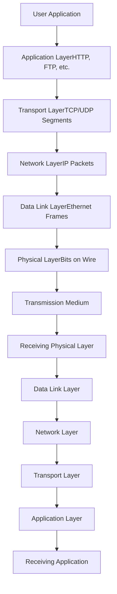

### Example: Web Page Request

```
╔═══════════════════════════════════════════════════════════════════╗
║         COMPLETE NETWORK TRANSACTION EXAMPLE                      ║
║         User requests www.example.com                             ║
╠═══════════════════════════════════════════════════════════════════╣
║                                                                   ║
║ 1. APPLICATION LAYER (HTTP)                                       ║
║    User types URL in browser                                      ║
║    Browser generates HTTP GET request:                            ║
║    "GET / HTTP/1.1                                               ║
║     Host: www.example.com"                                        ║
║                                                                   ║
║ 2. TRANSPORT LAYER (TCP)                                          ║
║    ┌─────────────────────────────────────────┐                   ║
║    │ TCP Header added:                       │                   ║
║    │ Source Port: 49152 (random)             │                   ║
║    │ Dest Port: 80 (HTTP)                    │                   ║
║    │ Sequence number, Flags, Checksum        │                   ║
║    └─────────────────────────────────────────┘                   ║
║    Establishes connection (3-way handshake)                       ║
║                                                                   ║
║ 3. NETWORK LAYER (IP)                                             ║
║    ┌─────────────────────────────────────────┐                   ║
║    │ IP Header added:                        │                   ║
║    │ Source IP: 192.168.1.100                │                   ║
║    │ Dest IP: 93.184.216.34                  │                   ║
║    │ TTL: 64, Protocol: TCP                  │                   ║
║    └─────────────────────────────────────────┘                   ║
║    Router determines next hop                                     ║
║                                                                   ║
║ 4. DATA LINK LAYER (Ethernet)                                     ║
║    ┌─────────────────────────────────────────┐                   ║
║    │ Ethernet Frame:                         │                   ║
║    │ Dest MAC: AA:BB:CC:DD:EE:FF (router)    │                   ║
║    │ Source MAC: 11:22:33:44:55:66 (PC)      │                   ║
║    │ EtherType: 0x0800 (IPv4)                │                   ║
║    │ Payload: [IP Packet]                    │                   ║
║    │ FCS: CRC checksum                       │                   ║
║    └─────────────────────────────────────────┘                   ║
║    Switch forwards based on MAC address                           ║
║                                                                   ║
║ 5. PHYSICAL LAYER                                                 ║
║    ┌─────────────────────────────────────────┐                   ║
║    │ Encoding: Manchester (Ethernet)         │                   ║
║    │ Medium: Cat6 UTP cable                  │                   ║
║    │ Speed: 1 Gbps                           │                   ║
║    │                                         │                   ║
║    │ Bit stream:                             │                   ║
║    │ 10101100010011110...                    │                   ║
║    │                                         │                   ║
║    │ Electrical signals on wire:             │                   ║
║    │ ▀▄▀▄▀▀▄▄▀▄▀▀▄▄▀▄▀▄▀▄▀▄                │                   ║
║    └─────────────────────────────────────────┘                   ║
║                                                                   ║
║ PHYSICAL PATH:                                                    ║
║                                                                   ║
║ [PC] ──Cat6──► [Switch] ──Fiber──► [Router] ──Internet──►       ║
║                Port 5      Port 24   WAN Port                     ║
║                                                                   ║
║ Switch Operation:                                                 ║
║ • Receives frame on Port 5                                        ║
║ • Checks destination MAC in CAM table                             ║
║ • Forwards to Port 24 (uplink to router)                          ║
║ • Full-duplex, no collisions                                      ║
║                                                                   ║
║ Router Operation:                                                 ║
║ • Receives frame, strips Ethernet header                          ║
║ • Examines IP destination: 93.184.216.34                         ║
║ • Checks routing table, determines next hop                       ║
║ • Decrements TTL, recalculates checksum                           ║
║ • Forwards packet to ISP                                          ║
║                                                                   ║
║ ISP Path (Multiple Hops):                                         ║
║ [Router] → [ISP Edge] → [Core Router] → [Backbone] →             ║
║ → [Peering Point] → [example.com Network] → [Web Server]         ║
║                                                                   ║
║ REVERSE PATH - Response:                                          ║
║ Web server sends HTML page back through same process in reverse   ║
╚═══════════════════════════════════════════════════════════════════╝
```

---

### Enterprise Network Architecture

```
╔═══════════════════════════════════════════════════════════════════╗
║              ENTERPRISE NETWORK ARCHITECTURE                      ║
╠═══════════════════════════════════════════════════════════════════╣
║                                                                   ║
║                        INTERNET                                   ║
║                           │                                       ║
║                     ┌─────▼─────┐                                ║
║                     │ Firewall  │                                ║
║                     │           │                                ║
║                     └─────┬─────┘                                ║
║                           │                                       ║
║                  ┌────────▼────────┐                             ║
║                  │  Core Router    │                             ║
║                  │  Layer 3 Switch │                             ║
║                  └────────┬────────┘                             ║
║                           │                                       ║
║          ┌────────────────┼────────────────┐                     ║
║          │                │                │                     ║
║     ┌────▼────┐      ┌────▼────┐     ┌────▼────┐               ║
║     │Building │      │Building │     │Building │               ║
║     │ Switch1 │      │ Switch2 │     │ Switch3 │               ║
║     │(Layer 2)│      │(Layer 2)│     │(Layer 2)│               ║
║     └────┬────┘      └────┬────┘     └────┬────┘               ║
║          │                │                │                     ║
║  ┌───────┼─────┐   ┌──────┼──────┐  ┌──────┼──────┐            ║
║  │       │     │   │      │      │  │      │      │            ║
║ ┌▼─┐  ┌─▼┐  ┌─▼┐ ┌▼─┐  ┌─▼┐   ┌─▼┐┌▼─┐  ┌─▼┐  ┌─▼┐           ║
║ │PC│  │PC│  │AP│ │PC│  │PC│   │AP││PC│  │PC│  │AP│           ║
║ └──┘  └──┘  └──┘ └──┘  └──┘   └──┘└──┘  └──┘  └──┘           ║
║                                                                   ║
║ Data Center (Same site):                                          ║
║                  Core Router                                      ║
║                       │                                           ║
║              ┌────────┼────────┐                                 ║
║              │                 │                                 ║
║         ┌────▼────┐      ┌────▼────┐                            ║
║         │Top-of-  │      │Top-of-  │                            ║
║         │Rack Sw 1│      │Rack Sw 2│                            ║
║         └────┬────┘      └────┬────┘                            ║
║              │                 │                                 ║
║         ┌────┼────┐       ┌────┼────┐                           ║
║         │    │    │       │    │    │                           ║
║      ┌──▼┐┌──▼┐┌──▼┐  ┌──▼┐┌──▼┐┌──▼┐                         ║
║      │Svr││Svr││Svr│  │Svr││Svr││Svr│                         ║
║      └───┘└───┘└───┘  └───┘└───┘└───┘                         ║
║                                                                   ║
║ WAN Connection to Branch Office:                                 ║
║                                                                   ║
║ Main Office         WAN Link          Branch Office              ║
║ ┌────────┐         (T1/MPLS/         ┌────────┐                 ║
║ │ Router ├─────────Fiber)─────────────┤ Router │                ║
║ └───┬────┘                            └───┬────