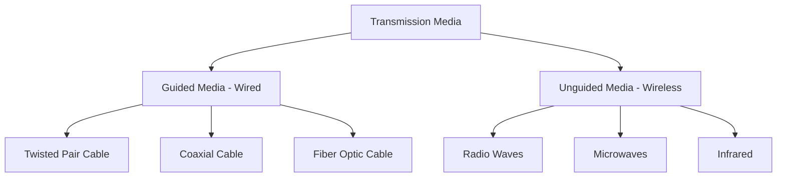
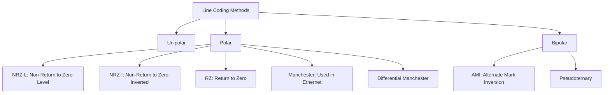

## Table of Contents

1. [Transmission Media](https://claude.ai/chat/1f251fa6-0735-438d-8a0e-209f2c147346#1-transmission-media)
2. [Signal Transmission and Encoding](https://claude.ai/chat/1f251fa6-0735-438d-8a0e-209f2c147346#2-signal-transmission-and-encoding)
3. [Multiplexing Techniques](https://claude.ai/chat/1f251fa6-0735-438d-8a0e-209f2c147346#3-multiplexing-techniques)
4. [Cables, Ports & Electronics](https://claude.ai/chat/1f251fa6-0735-438d-8a0e-209f2c147346#4-cables-ports--electronics)
5. [Complete System Integration](https://claude.ai/chat/1f251fa6-0735-438d-8a0e-209f2c147346#5-complete-system-integration)

---

# 1. Transmission Media {#1-transmission-media}

Transmission media is the physical path between transmitter and receiver in a network. It forms the foundation of all network communication.



---

## 1.1 Guided Transmission Media (Wired)

### A) Twisted Pair Cable

```
┌─────────────────────────────────────────────────────────┐
│            TWISTED PAIR CABLE STRUCTURE                 │
│                                                         │
│    Outer Jacket (PVC Protection)                       │
│    ┌────────────────────────────────────────────┐     │
│    │  ╔════════════════════════════════════╗    │     │
│    │  ║  Twisted Pairs (4 pairs = 8 wires)║    │     │
│    │  ║                                    ║    │     │
│    │  ║   Orange  ╱╲╱╲╱╲╱╲  White-Orange  ║    │     │
│    │  ║           ╲╱╲╱╲╱╲╱                 ║    │     │
│    │  ║                                    ║    │     │
│    │  ║   Green   ╱╲╱╲╱╲╱╲  White-Green   ║    │     │
│    │  ║           ╲╱╲╱╲╱╲╱                 ║    │     │
│    │  ║                                    ║    │     │
│    │  ║   Blue    ╱╲╱╲╱╲╱╲  White-Blue    ║    │     │
│    │  ║           ╲╱╲╱╲╱╲╱                 ║    │     │
│    │  ║                                    ║    │     │
│    │  ║   Brown   ╱╲╱╲╱╲╱╲  White-Brown   ║    │     │
│    │  ║           ╲╱╲╱╲╱╲╱                 ║    │     │
│    │  ╚════════════════════════════════════╝    │     │
│    └────────────────────────────────────────────┘     │
│                                                         │
│  Why Twisted? To reduce electromagnetic interference   │
│  and crosstalk between pairs                           │
│                                                         │
│  Wire Gauge: 22-24 AWG (American Wire Gauge)          │
│  • 24 AWG = 0.5mm diameter                            │
│  • Solid core: Better for permanent installations      │
│  • Stranded: More flexible, for patch cables          │
└─────────────────────────────────────────────────────────┘
```

**Types:**

**1. UTP (Unshielded Twisted Pair)**

```
  No Shielding - More Susceptible to EMI
  ┌─────────────────────┐
  │  ╱╲╱╲╱╲  ╱╲╱╲╱╲   │
  │  ╲╱╲╱╲╱  ╲╱╲╱╲╱   │
  │  ╱╲╱╲╱╲  ╱╲╱╲╱╲   │
  │  ╲╱╲╱╲╱  ╲╱╲╱╲╱   │
  └─────────────────────┘
  
  Advantages:
  ✅ Cheaper cost
  ✅ More flexible
  ✅ Easier to install
  
  Disadvantages:
  ❌ Susceptible to EMI
  ❌ Higher crosstalk
  ❌ Shorter distances
```

**2. STP (Shielded Twisted Pair)**

```
  Metal Foil/Braid Shielding
  ┌─────────────────────┐
  │ ▓▓▓▓▓▓▓▓▓▓▓▓▓▓▓▓▓ │ ← Shield Layer
  │ ▓ ╱╲╱╲  ╱╲╱╲ ▓    │
  │ ▓ ╲╱╲╱  ╲╱╲╱ ▓    │
  │ ▓ ╱╲╱╲  ╱╲╱╲ ▓    │
  │ ▓▓▓▓▓▓▓▓▓▓▓▓▓▓▓▓▓ │
  └─────────────────────┘
  
  Advantages:
  ✅ Better EMI protection
  ✅ Lower crosstalk
  ✅ More secure
  
  Disadvantages:
  ❌ More expensive
  ❌ Less flexible
  ❌ Requires proper grounding
```

**Category Ratings (CAT Cables):**

```
┌──────┬────────────┬──────────────┬─────────────┬──────────────────┐
│ Cat  │ Frequency  │ Max Speed    │ Max Distance│ Applications     │
├──────┼────────────┼──────────────┼─────────────┼──────────────────┤
│ Cat3 │ 16 MHz     │ 10 Mbps      │ 100m        │ Phone/10BASE-T   │
│ Cat5 │ 100 MHz    │ 100 Mbps     │ 100m        │ Fast Ethernet    │
│ Cat5e│ 100 MHz    │ 1 Gbps       │ 100m        │ Gigabit Ethernet │
│ Cat6 │ 250 MHz    │ 1 Gbps       │ 100m        │ Gigabit Ethernet │
│      │            │ 10 Gbps      │ 55m         │ 10G Ethernet     │
│ Cat6a│ 500 MHz    │ 10 Gbps      │ 100m        │ 10G Ethernet     │
│ Cat7 │ 600 MHz    │ 10 Gbps      │ 100m        │ Data Centers     │
│ Cat8 │ 2000 MHz   │ 25-40 Gbps   │ 30m         │ Data Centers     │
└──────┴────────────┴──────────────┴─────────────┴──────────────────┘
```

**Understanding Frequency vs Bandwidth:**

```
╔═══════════════════════════════════════════════════════════╗
║      FREQUENCY vs BANDWIDTH EXPLANATION                   ║
╠═══════════════════════════════════════════════════════════╣
║                                                           ║
║ FREQUENCY (MHz):                                          ║
║ • How fast the signal can oscillate/change                ║
║ • Higher frequency = more rapid signal transitions        ║
║ • Measured in Hertz (cycles per second)                   ║
║ • Example: Cat6 @ 250 MHz = 250 million transitions/sec  ║
║                                                           ║
║ BANDWIDTH (Mbps/Gbps):                                    ║
║ • Amount of data that can be transmitted                  ║
║ • Depends on: frequency, encoding, cable quality          ║
║ • Measured in bits per second                             ║
║ • Example: Cat6 supports 1 Gbps (or 10 Gbps at 55m)      ║
║                                                           ║
║ RELATIONSHIP:                                             ║
║ Higher Category → Higher Frequency → Higher Bandwidth     ║
║                                                           ║
║ Cat5e:  100 MHz  →  1 Gbps                               ║
║ Cat6:   250 MHz  →  10 Gbps (short distance)             ║
║ Cat6a:  500 MHz  →  10 Gbps (full 100m)                  ║
║ Cat8:   2000 MHz →  40 Gbps                              ║
╚═══════════════════════════════════════════════════════════╝
```

**RJ-45 Connector Pin Configuration:**

```
    ┌─────────────────────┐
    │  8  7  6  5  4  3  2  1    Looking at connector
    │  │  │  │  │  │  │  │  │    (clip facing down)
    └──┴──┴──┴──┴──┴──┴──┴──┘

T568B Standard (Most Common):
┌────┬──────────────┬──────────────────────────────┐
│Pin │ Wire Color   │ Function (100BASE-TX)        │
├────┼──────────────┼──────────────────────────────┤
│ 1  │ White-Orange │ TX+ (Transmit Positive)      │
│ 2  │ Orange       │ TX- (Transmit Negative)      │
│ 3  │ White-Green  │ RX+ (Receive Positive)       │
│ 4  │ Blue         │ Not used (100BASE-TX)        │
│ 5  │ White-Blue   │ Not used (100BASE-TX)        │
│ 6  │ Green        │ RX- (Receive Negative)       │
│ 7  │ White-Brown  │ Not used (100BASE-TX)        │
│ 8  │ Brown        │ Not used (100BASE-TX)        │
└────┴──────────────┴──────────────────────────────┘

NOTE: For Gigabit Ethernet (1000BASE-T), ALL 8 pins are used
      for bidirectional transmission.
```

**How Twisted Pairs Maintain Signal Integrity:**

```
┌──────────────────────────────────────────────────────────┐
│  DIFFERENTIAL SIGNALING & NOISE CANCELLATION             │
│                                                          │
│  1. Twisting reduces crosstalk:                          │
│     Each twist ensures equal exposure to interference    │
│                                                          │
│     Pair 1 (Orange):  ╱╲╱╲╱╲╱╲╱╲╱╲╱╲  (3.5 twists/inch)│
│     Pair 2 (Green):   ╱╲╱╲╱╲╱╲╱╲╱╲╱╲╱╲ (4 twists/inch)  │
│     Pair 3 (Blue):    ╱╲╱╲╱╲╱╲╱╲ (3 twists/inch)        │
│     Pair 4 (Brown):   ╱╲╱╲╱╲╱╲╱╲╱╲╱╲╱╲╱╲ (4.5 twists/in)│
│                                                          │
│     Different twist rates prevent constructive           │
│     interference between pairs                           │
│                                                          │
│  2. Differential signaling uses pairs (TX+/TX-, RX+/RX-)│
│                                                          │
│     TX+ wire: ────▲────▲────▲────▲────▲──►             │
│                    ╲    ╲    ╲    ╲    ╲                │
│                     ╲    ╲    ╲    ╲    ╲               │
│                      ╲    ╲    ╲    ╲    ╲              │
│     TX- wire: ────────▼────▼────▼────▼────▼──►         │
│                                                          │
│  3. Noise cancellation:                                  │
│     • Receiver calculates: Signal = TX+ minus TX-       │
│     • External noise affects both wires equally         │
│     • Noise cancels out in subtraction!                 │
│                                                          │
│     Clean Signal = (TX+ + Noise) - (TX- + Noise)        │
│                  = TX+ - TX-                            │
│                                                          │
│  4. NOT frequency-based like wireless:                   │
│     • Uses baseband signaling (direct electrical pulses)│
│     • Manchester/MLT-3 encoding for transitions         │
│     • No carrier wave modulation                        │
└──────────────────────────────────────────────────────────┘
```

---

### B) Coaxial Cable

```
┌───────────────────────────────────────────────────────┐
│         COAXIAL CABLE CROSS-SECTION                   │
│                                                       │
│  Outer Jacket (PVC/Polyethylene)                     │
│  ┌────────────────────────────────────────────┐     │
│  │ Braided Shield (Copper mesh)               │     │
│  │ ╔══════════════════════════════════════╗   │     │
│  │ ║ Dielectric Insulator (Foam/Plastic) ║   │     │
│  │ ║ ┌──────────────────────────────────┐ ║   │     │
│  │ ║ │ Inner Conductor (Copper wire)    │ ║   │     │
│  │ ║ │        ═══════════════           │ ║   │     │
│  │ ║ └──────────────────────────────────┘ ║   │     │
│  │ ╚══════════════════════════════════════╝   │     │
│  └────────────────────────────────────────────┘     │
│                                                       │
│  Coaxial = "Co" (shared) + "axial" (same axis)      │
│  Inner conductor and outer shield share center axis  │
└───────────────────────────────────────────────────────┘
```

**Types:**

- **RG-6**: Cable TV, Internet (75Ω impedance) - Most common
- **RG-59**: CCTV, older TV systems (75Ω impedance)
- **RG-11**: Long-distance runs (75Ω impedance)

**Advantages:**

- ✅ Better shielding than UTP
- ✅ Longer distances (500m+ without repeaters)
- ✅ Higher bandwidth (1-2 GHz)
- ✅ Less susceptible to EMI
- ✅ Can carry multiple signals (FDM)

**Disadvantages:**

- ❌ More expensive than UTP
- ❌ Less flexible (harder to bend)
- ❌ Bulkier and heavier
- ❌ Harder to install connectors

---

### C) Fiber Optic Cable

```
╔═══════════════════════════════════════════════════════════╗
║           FIBER OPTIC CABLE STRUCTURE                     ║
╠═══════════════════════════════════════════════════════════╣
║                                                           ║
║  Outer Jacket (PVC/Polyethylene)                          ║
║  ┌────────────────────────────────────────────────┐     ║
║  │ Kevlar Strength Member (Aramid fibers)         │     ║
║  │ ▓▓▓▓▓▓▓▓▓▓▓▓▓▓▓▓▓▓▓▓▓▓▓▓▓▓▓▓▓▓▓▓▓▓▓▓▓▓▓▓▓▓▓   │     ║
║  │   Buffer Coating (Protective layer)            │     ║
║  │   ┌──────────────────────────────────────┐     │     ║
║  │   │ Cladding (Lower refractive index)   │     │     ║
║  │   │ n = 1.46                             │     │     ║
║  │   │ ╔════════════════════════════════╗  │     │     ║
║  │   │ ║ Core (Higher refractive index)║  │     │     ║
║  │   │ ║ n = 1.48                       ║  │     │     ║
║  │   │ ║    ─ ─ ─ → Light Ray → ─ ─ ─ ║  │     │     ║
║  │   │ ║    (Total Internal Reflection)║  │     │     ║
║  │   │ ╚════════════════════════════════╝  │     │     ║
║  │   └──────────────────────────────────────┘     │     ║
║  │ ▓▓▓▓▓▓▓▓▓▓▓▓▓▓▓▓▓▓▓▓▓▓▓▓▓▓▓▓▓▓▓▓▓▓▓▓▓▓▓▓▓▓▓   │     ║
║  └────────────────────────────────────────────────┘     ║
╚═══════════════════════════════════════════════════════════╝
```

**Light Propagation - Total Internal Reflection (TIR):**

```
┌──────────────────────────────────────────────────────┐
│  TOTAL INTERNAL REFLECTION PRINCIPLE                 │
│                                                      │
│  Core (n = 1.48, Higher refractive index)           │
│  ══════════════════════════════════════             │
│  ║   ╲   ↓   ╱       ║   Light bounces              │
│  ║    ╲  ↓  ╱        ║   at core-cladding           │
│  ║     ╲ ↓ ╱         ║   boundary                   │
│  ║      ╲↓╱          ║                              │
│  ║       ↓           ║   Angle > Critical Angle     │
│  ══════════════════════════════════════             │
│  Cladding (n = 1.46, Lower refractive index)        │
│                                                      │
│  Critical Angle θc = arcsin(n₂/n₁)                  │
│                   = arcsin(1.46/1.48)               │
│                   ≈ 80.6°                           │
│                                                      │
│  If incident angle > 80.6°, light reflects 100%     │
│  If incident angle < 80.6°, light refracts out      │
└──────────────────────────────────────────────────────┘
```

**Types of Fiber Optic:**

**1. Single-Mode Fiber (SMF)**

```
╔═══════════════════════════════════════════════════╗
║  SINGLE-MODE FIBER (SMF)                          ║
╠═══════════════════════════════════════════════════╣
║                                                   ║
║  Core Diameter: 8-10 μm (very thin)              ║
║  ════════════════════════                        ║
║  ║    ────────→         ║  Single light path     ║
║  ════════════════════════  (One mode)            ║
║                                                   ║
║  Characteristics:                                 ║
║  • Long distances (40+ km without repeaters)     ║
║  • Very high bandwidth (Unlimited practically)    ║
║  • Laser light source (1310nm, 1550nm)           ║
║  • More expensive equipment                       ║
║  • No modal dispersion                            ║
║  • Lower attenuation (0.2-0.4 dB/km)             ║
║                                                   ║
║  Applications:                                    ║
║  • Long-haul telecommunications                   ║
║  • Backbone networks                              ║
║  • Undersea cables                                ║
║  • Metropolitan Area Networks (MANs)              ║
╚═══════════════════════════════════════════════════╝
```

**2. Multi-Mode Fiber (MMF)**

```
╔═══════════════════════════════════════════════════╗
║  MULTI-MODE FIBER (MMF)                           ║
╠═══════════════════════════════════════════════════╣
║                                                   ║
║  Core Diameter: 50-62.5 μm (thicker)             ║
║  ════════════════════════                        ║
║  ║   ╲  ↓  ╱           ║  Multiple light paths   ║
║  ║    ╲ ↓ ╱            ║  (Multiple modes)       ║
║  ║     ╲↓╱             ║                         ║
║  ════════════════════════                        ║
║                                                   ║
║  Characteristics:                                 ║
║  • Shorter distances (2 km maximum)              ║
║  • Lower bandwidth than SMF                       ║
║  • LED light source (850nm, 1300nm)              ║
║  • Lower cost equipment                           ║
║  • Modal dispersion occurs                        ║
║  • Higher attenuation (3 dB/km)                  ║
║                                                   ║
║  Modal Dispersion Problem:                        ║
║  Different light paths take different times       ║
║  to arrive → signal spreading → limit distance   ║
║                                                   ║
║  Applications:                                    ║
║  • Local Area Networks (LANs)                    ║
║  • Building-to-building connections              ║
║  • Data centers (short runs)                     ║
╚═══════════════════════════════════════════════════╝
```

**Fiber Optic Advantages:**

- ✅ Extremely high bandwidth (Terabits per second capable)
- ✅ Very long distances (100+ km without repeaters)
- ✅ Completely immune to EMI (uses light, not electricity)
- ✅ Highly secure (difficult to tap without detection)
- ✅ Lightweight and small diameter
- ✅ No electrical hazard
- ✅ Low signal attenuation

**Fiber Optic Disadvantages:**

- ❌ Expensive equipment and installation
- ❌ Fragile (glass fibers can break)
- ❌ Requires specialized skills for installation
- ❌ Difficult to splice and terminate
- ❌ Cannot carry electrical power (unlike copper)
- ❌ More complex maintenance

**Wavelengths and Windows:**

```
┌────────┬────────────┬─────────────┬──────────────────────┐
│ Window │ Wavelength │ Attenuation │ Primary Use          │
├────────┼────────────┼─────────────┼──────────────────────┤
│  1st   │ 850 nm     │ 3.0 dB/km   │ MMF, LAN             │
│  2nd   │ 1310 nm    │ 0.4 dB/km   │ SMF, Metro networks  │
│  3rd   │ 1550 nm    │ 0.2 dB/km   │ SMF, Long-haul       │
└────────┴────────────┴─────────────┴──────────────────────┘

Lower attenuation = Can go longer distances
1550nm window is preferred for undersea cables
```

---

## 1.2 Unguided Transmission Media (Wireless)

### A) Radio Waves

```
Frequency Range: 3 kHz - 1 GHz
Wavelength: 100 km - 0.3 m

    Transmitter                                 Receiver
        │                                           │
        │  )))                                )))  │
        │ )))                                  (((  │
        │)))           Radio Waves             ((( │
        ├─────────────────────────────────────────┤
              Omnidirectional Propagation

Characteristics:
┌────────────────────────────────────────────────────┐
│ • Can penetrate walls and obstacles                │
│ • Omnidirectional (spreads in all directions)      │
│ • Long-range capability                            │
│ • Subject to interference                          │
│ • License may be required (depends on frequency)   │
│ • Lower frequencies = better penetration           │
│ • Higher frequencies = more bandwidth              │
└────────────────────────────────────────────────────┘

Applications:
┌─────────────────┬────────────────┬──────────────────┐
│ Technology      │ Frequency      │ Typical Range    │
├─────────────────┼────────────────┼──────────────────┤
│ AM Radio        │ 535-1605 kHz   │ 100+ km          │
│ FM Radio        │ 88-108 MHz     │ 50-100 km        │
│ TV Broadcasting │ 54-890 MHz     │ 50+ km           │
│ WiFi 2.4GHz     │ 2.4-2.485 GHz  │ 30-50m indoor    │
│ WiFi 5GHz       │ 5.15-5.85 GHz  │ 15-25m indoor    │
│ Bluetooth       │ 2.4-2.485 GHz  │ 10-100m          │
│ LTE/5G          │ 600MHz-6GHz    │ 1-10 km          │
└─────────────────┴────────────────┴──────────────────┘
```

---

### B) Microwaves

```
Frequency Range: 1 GHz - 300 GHz
Wavelength: 30 cm - 1 mm

    Antenna 1                               Antenna 2
    ┌──────┐                                 ┌──────┐
    │  │   │                                 │   │  │
    │  │)) │ ═══════════════════════════► │ ((│  │
    │  │   │    Directional Beam             │   │  │
    └──────┘                                 └──────┘
    
    Line-of-Sight Required
    Highly directional transmission

Characteristics:
┌────────────────────────────────────────────────────┐
│ • Requires line-of-sight between antennas          │
│ • Highly directional (focused beam)                │
│ • Cannot penetrate most obstacles                  │
│ • Affected by weather (rain fade)                  │
│ • High bandwidth capability                        │
│ • Point-to-point communication                     │
└────────────────────────────────────────────────────┘

Types:

1. TERRESTRIAL MICROWAVE (2-40 GHz)
   ┌───────────────────────────────────────────┐
   │ • Point-to-point communication            │
   │ • Relay towers every 25-50 km             │
   │ • Cell phone towers                       │
   │ • Building-to-building links              │
   │ • Typical range: 1-50 km per hop          │
   └───────────────────────────────────────────┘

2. SATELLITE MICROWAVE (1-40 GHz)
   Satellite Orbits:
   
   ┌─────────────────────────────────────────┐
   │  GEO (Geostationary Earth Orbit)        │
   │  • Altitude: 35,786 km                  │
   │  • Latency: 240ms (round trip)          │
   │  • Coverage: 1/3 of Earth               │
   │  • Examples: DirecTV, satellite internet│
   └─────────────────────────────────────────┘
   
   ┌─────────────────────────────────────────┐
   │  MEO (Medium Earth Orbit)               │
   │  • Altitude: 2,000-35,786 km            │
   │  • Latency: 50-150ms                    │
   │  • Examples: GPS, Galileo               │
   └─────────────────────────────────────────┘
   
   ┌─────────────────────────────────────────┐
   │  LEO (Low Earth Orbit)                  │
   │  • Altitude: 160-2,000 km               │
   │  • Latency: 20-40ms                     │
   │  • Examples: Starlink, OneWeb, Iridium  │
   │  • Requires constellation of satellites │
   └─────────────────────────────────────────┘

Applications:
• Cellular networks (4G, 5G)
• Satellite TV and internet
• GPS navigation
• Wireless backhaul
• Point-to-point links
```

---

### C) Infrared

```
Frequency Range: 300 GHz - 400 THz
Wavelength: 1mm - 700nm

    Remote Control                            TV/Device
    ┌──────┐                                 ┌──────┐
    │  ▓▓  │                                 │  ○   │
    │  ▓▓  │ ═════════════════════════════► │  ○   │
    │  ▓▓  │    IR Beam (Line-of-Sight)     │  ○   │
    └──────┘                                 └──────┘

Characteristics:
┌────────────────────────────────────────────────────┐
│ • Cannot penetrate walls or solid objects         │
│ • Line-of-sight strictly required                 │
│ • Very short range (few meters)                   │
│ • Highly secure (contained within room)           │
│ • No licensing required                           │
│ • Susceptible to bright light interference        │
│ • Low power consumption                           │
└────────────────────────────────────────────────────┘

Applications:
┌─────────────────────────────────────────────┐
│ • TV/appliance remote controls              │
│ • IrDA (Infrared Data Association)          │
│ • Short-range device communication          │
│ • Wireless headphones (older models)        │
│ • Some security systems                     │
│ • Medical devices                           │
└─────────────────────────────────────────────┘
```

---

## 1.3 Four Critical Factors for Transmission Media Selection

```
╔═══════════════════════════════════════════════════════════╗
║  FOUR FACTORS FOR CHOOSING TRANSMISSION MEDIA             ║
╠═══════════════════════════════════════════════════════════╣
║  1. Bandwidth (Data Capacity)                             ║
║  2. Radiation (Signal Leakage/Security)                   ║
║  3. Noise Absorption (Interference Susceptibility)        ║
║  4. Attenuation (Signal Loss Over Distance)               ║
╚═══════════════════════════════════════════════════════════╝
```

### Factor 1: Bandwidth (Data Capacity)

```
┌──────────────────────────────────────────────────────────┐
│  BANDWIDTH = Amount of data that can be transmitted      │
│                                                          │
│   Low Bandwidth                      High Bandwidth     │
│        │                                   │            │
│   ┌────▼────┐                         ┌────▼────┐      │
│   │ Twisted │                         │  Fiber  │      │
│   │  Pair   │ ◄──── Comparison ────► │  Optic  │      │
│   └─────────┘                         └─────────┘      │
│   100 Mbps -                          100 Gbps+        │
│   1 Gbps                                               │
└──────────────────────────────────────────────────────────┘

Bandwidth Comparison Table:
┌──────────────┬──────────────────┬───────────────────────┐
│   Medium     │   Bandwidth      │  Best For             │
├──────────────┼──────────────────┼───────────────────────┤
│ UTP Cat5e    │ 100 MHz (1Gbps)  │ Desktop connectivity  │
│ UTP Cat6     │ 250 MHz (10Gbps*)│ Office networks       │
│ UTP Cat6a    │ 500 MHz (10Gbps) │ Data centers          │
│ UTP Cat8     │ 2000 MHz (40Gbps)│ Server rooms          │
│ Coaxial RG-6 │ 1-2 GHz          │ Cable Internet/TV     │
│ Fiber SMF    │ Unlimited*       │ Backbone, WAN, Metro  │
│ Fiber MMF    │ Very High        │ Campus networks, LAN  │
│ WiFi 5 (ac)  │ 3.5 Gbps         │ Wireless LAN          │
│ WiFi 6 (ax)  │ 9.6 Gbps         │ High-density wireless │
│ 5G           │ 20 Gbps          │ Mobile networks       │
└──────────────┴──────────────────┴───────────────────────┘
* Practically limited by equipment, not cable
```

---

### Factor 2: Radiation (Signal Leakage/Security)

```
┌──────────────────────────────────────────────────────────┐
│  RADIATION = Electromagnetic energy leaking from medium  │
│                                                          │
│   High Radiation                    Low/No Radiation    │
│   (Security Risk)                   (More Secure)       │
│        │                                   │            │
│   ┌────▼────┐                         ┌────▼────┐      │
│   │Wireless │                         │  Fiber  │      │
│   │  WiFi   │ ◄──── Comparison ────► │  Optic  │      │
│   └─────────┘                         └─────────┘      │
│   Can be easily                       Light doesn't    │
│   intercepted                         leak from cable  │
└──────────────────────────────────────────────────────────┘

Radiation & Security Comparison:
┌──────────────┬──────────────┬─────────────────────────┐
│   Medium     │  Radiation   │  Security Level         │
├──────────────┼──────────────┼─────────────────────────┤
│ UTP          │ Medium       │ Can be tapped easily    │
│ STP          │ Low          │ Better shielding        │
│ Coaxial      │ Very Low     │ Good shielding          │
│ Fiber Optic  │ None         │ Extremely secure        │
│              │              │ (Light doesn't radiate) │
│ Wireless     │ Very High    │ Requires encryption     │
│              │              │ (Broadcast to all)      │
└──────────────┴──────────────┴─────────────────────────┘

EMI Shielding Visual Comparison:

UTP (Unshielded):              STP (Shielded):
┌─────────────────┐            ┌─────────────────┐
│  ╱╲╱╲  ╱╲╱╲    │  ← EMI     │▓▓▓▓▓▓▓▓▓▓▓▓▓▓▓│
│  ╲╱╲╱  ╲╱╲╱    │  can       │▓ ╱╲╱╲  ╱╲╱╲ ▓│
└─────────────────┘  enter     │▓ ╲╱╲╱  ╲╱╲╱ ▓│
                     & leave   │▓▓▓▓▓▓▓▓▓▓▓▓▓▓▓│
                                └─────────────────┘
                                Metal shield blocks EMI
```

---

### Factor 3: Noise Absorption (Interference Susceptibility)

```
┌──────────────────────────────────────────────────────────┐
│  NOISE = Unwanted signals that corrupt data              │
│                                                          │
│   High Noise Absorption           Low Noise Absorption  │
│   (More Interference)             (Less Interference)   │
│        │                                   │            │
│   ┌────▼────┐                         ┌────▼────┐      │
│   │   UTP   │                         │  Fiber  │      │
│   │  Cable  │ ◄──── Comparison ────► │  Optic  │      │
│   └─────────┘                         └─────────┘      │
└──────────────────────────────────────────────────────────┘

Sources of Noise:
╔════════════════════════════════════════════════════╗
║ 1. ELECTROMAGNETIC INTERFERENCE (EMI)              ║
║    • From power lines, motors, transformers        ║
║    • Fluorescent lights, microwaves                ║
║    • Heavy machinery                               ║
║                                                    ║
║ 2. RADIO FREQUENCY INTERFERENCE (RFI)             ║
║    • From wireless devices, cell towers            ║
║    • AM/FM radio transmitters                      ║
║    • Other RF equipment                            ║
║                                                    ║
║ 3. CROSSTALK                                      ║
║    • Signal bleeding between adjacent wires        ║
║    • Common in poorly twisted cables               ║
║    • Worse at higher frequencies                   ║
║                                                    ║
║ 4. THERMAL NOISE (Johnson Noise)                  ║
║    • Random electron movement due to heat          ║
║    • Present in all conductors                     ║
║    • Increases with temperature                    ║
║                                                    ║
║ 5. IMPULSE NOISE                                  ║
║    • Sudden spikes (lightning, switching)          ║
║    • Can cause data corruption                     ║
╚════════════════════════════════════════════════════╝

Noise Susceptibility Table:
┌──────────────┬──────────────┬───────────────────────┐
│   Medium     │  Noise Level │  Environment Needed   │
├──────────────┼──────────────┼───────────────────────┤
│ UTP          │ High         │ Office (low EMI)      │
│ STP          │ Medium       │ Industrial areas      │
│ Coaxial      │ Low          │ Any environment       │
│ Fiber Optic  │ Immune       │ High EMI areas        │
│              │              │ (Best for factories)  │
│ Wireless     │ Very High    │ Clear spectrum needed │
└──────────────┴──────────────┴───────────────────────┘

Why Fiber is Immune to EMI:

Electrical Cable:              Fiber Optic Cable:
                              
    ╱╲  EMI                         EMI
   ╱  ╲  │                           │
  ╱    ╲ ▼                           ▼
 ────────────── ← Interferes    ═════════════
 Electrical                     Light signal
 Signal                         (Not affected by
                                electromagnetic
 ❌ Corrupted                   fields)
 Data                           
                                ✅ Clean Signal
```

---

### Factor 4: Attenuation (Signal Loss Over Distance)

```
┌──────────────────────────────────────────────────────────┐
│  ATTENUATION = Loss of signal strength as it travels     │
│                                                          │
│   High Attenuation                 Low Attenuation      │
│   (Needs repeaters)                (Long distances OK)  │
│        │                                   │            │
│   ┌────▼────┐                         ┌────▼────┐      │
│   │Wireless │                         │  Fiber  │      │
│   │  WiFi   │ ◄──── Comparison ────► │  Optic  │      │
│   └─────────┘                         └─────────┘      │
│   30-70m range                        40+ km range     │
└──────────────────────────────────────────────────────────┘

Signal Strength over Distance:

UTP Cable (Cat6):
Strong  ████████████
        ███████████╮
        ██████████  ╲
        █████████    ╲  Signal degrades
        ████████      ╲
        ███            ╲
Weak    ██──────────────▼
        0m    50m   100m   (Maximum distance)

Fiber Optic (Single-Mode):
Strong  ████████████████████████████████
        ████████████████████████████████
        ███████████████████████████████╮
        ██████████████████████████████  ╲
Weak    ██──────────────────────────────▼
        0km   10km   20km   30km   40km+

Attenuation Comparison Table:
┌──────────────┬────────────┬──────────────────────┐
│   Medium     │ Max Dist.  │  Attenuation Rate    │
├──────────────┼────────────┼──────────────────────┤
│ UTP Cat5e    │ 100m       │ High (5-6 dB/100m)   │
│ UTP Cat6     │ 100m       │ Medium (4 dB/100m)   │
│ UTP Cat6a    │ 100m       │ Medium (3.5 dB/100m) │
│ Coaxial RG-6 │ 500m       │ Medium (2-3 dB/100m) │
│ SMF Fiber    │ 40+ km     │ Very Low (0.2dB/km)  │
│ MMF Fiber    │ 2 km       │ Low (3 dB/km)        │
│ WiFi 2.4GHz  │ 50m indoor │ High                 │
│ WiFi 5GHz    │ 25m indoor │ Very High            │
└──────────────┴────────────┴──────────────────────┘

Understanding Decibels (dB):
╔════════════════════════════════════════════════╗
║  Attenuation in dB = 10 × log₁₀(Pout / Pin)   ║
║                                                ║
║   3 dB loss  = Signal reduced to 50% power    ║
║   6 dB loss  = Signal reduced to 25% power    ║
║  10 dB loss  = Signal reduced to 10% power    ║
║  20 dB loss  = Signal reduced to 1% power     ║
║  30 dB loss  = Signal reduced to 0.1% power   ║
║                                                ║
║  Lower dB/distance = Better (less loss)       ║
╚════════════════════════════════════════════════╝
```

---

### Comprehensive Comparison Matrix

```
┌──────────┬───────────┬───────────┬──────────┬────────────┬──────────┐
│  Medium  │ Bandwidth │ Radiation │  Noise   │Attenuation │  Score   │
│          │(Higher=✓) │(Lower=✓)  │(Lower=✓) │ (Lower=✓)  │          │
├──────────┼───────────┼───────────┼──────────┼────────────┼──────────┤
│ UTP      │    ⭐⭐    │    ⭐⭐    │   ⭐⭐    │    ⭐⭐     │   8/20   │
│ STP      │    ⭐⭐⭐  │   ⭐⭐⭐   │   ⭐⭐⭐   │    ⭐⭐     │   11/20  │
│ Coaxial  │   ⭐⭐⭐   │   ⭐⭐⭐⭐  │   ⭐⭐⭐⭐  │   ⭐⭐⭐    │   14/20  │
│ Fiber    │  ⭐⭐⭐⭐⭐ │  ⭐⭐⭐⭐⭐ │  ⭐⭐⭐⭐⭐ │  ⭐⭐⭐⭐⭐  │   20/20  │
│ Wireless │   ⭐⭐⭐   │    ⭐     │   ⭐     │    ⭐      │   6/20   │
└──────────┴───────────┴───────────┴──────────┴────────────┴──────────┘

Summary:
┌────────────────────────────────────────────────────────┐
│ Best Overall Performance: Fiber Optic Cable            │
│ Best Cost/Performance: Cat6a UTP                       │
│ Best Flexibility/Mobility: Wireless                    │
│ Best for Long Distance: Single-Mode Fiber              │
│ Best for Short Distance & Cost: Cat5e/Cat6 UTP         │
└────────────────────────────────────────────────────────┘
```

---

# 2. Signal Transmission and Encoding {#2-signal-transmission-and-encoding}

## 2.1 Types of Signals

```
╔═══════════════════════════════════════════════════════════╗
║              ANALOG vs DIGITAL SIGNALS                    ║
╠═══════════════════════════════════════════════════════════╣
║                                                           ║
║  ANALOG SIGNAL (Continuous):                             ║
║                                                           ║
║     Amplitude                                             ║
║       ▲                                                   ║
║       │     ∿∿∿∿∿∿∿∿∿∿∿∿∿∿∿∿∿∿∿∿                      ║
║       │    ╱           ╲                ╱                 ║
║       │   ╱             ╲              ╱                  ║
║       │  ╱               ╲            ╱                   ║
║       ├────────────────────────────────────► Time        ║
║       │                                                   ║
║  Characteristics:                                         ║
║  • Infinite possible values                               ║
║  • Varies smoothly and continuously                       ║
║  • Subject to noise accumulation                          ║
║  • Examples: Voice, music, radio waves, temperature       ║
║  • Harder to regenerate without loss                      ║
║                                                           ║
╠═══════════════════════════════════════════════════════════╣
║                                                           ║
║  DIGITAL SIGNAL (Discrete):                              ║
║                                                           ║
║     Amplitude                                             ║
║       ▲                                                   ║
║       │    ████    ████    ████    ████                  ║
║   High│    ████    ████    ████    ████                  ║
║       ├────    ────    ────    ────    ──── Time        ║
║   Low │    1  0    1  0    1  0    1  0                 ║
║       │                                                   ║
║  Characteristics:                                         ║
║  • Only discrete values (typically 0 and 1)              ║
║  • Square wave pattern                                    ║
║  • Can be regenerated without loss                        ║
║  • Examples: Computer data, digital phone, Ethernet       ║
║  • More resistant to noise                                ║
║  • Requires encoding scheme                               ║
╚═══════════════════════════════════════════════════════════╝
```

**Why Digital is Better for Data Transmission:**

```
┌───────────────────────────────────────────────────────────┐
│ ANALOG SIGNAL WITH NOISE:                                 │
│                                                           │
│   Sent:     ∿∿∿∿∿∿∿∿∿∿                                  │
│   Received: ∿∿∿∼∼∿∿∿∿∿  ← Noise added, hard to remove   │
│                                                           │
│ DIGITAL SIGNAL WITH NOISE:                                │
│                                                           │
│   Sent:     ████  ████  ████                             │
│   Received: ████  ███~  ████  ← Regenerator fixes it     │
│   Output:   ████  ████  ████  ✓ Perfect restoration     │
└───────────────────────────────────────────────────────────┘
```

---

## 2.2 Line Coding Schemes

**Line Coding** converts digital data (bits) into digital signals (electrical pulses) for transmission.



---

### DETAILED LINE CODING EXAMPLES

### Using Bit Sequence: **01001110**

---

### A) Unipolar Encoding (Simple, Rarely Used)

```
╔═══════════════════════════════════════════════════════════╗
║              UNIPOLAR ENCODING                            ║
║              Bit Sequence: 01001110                       ║
╠═══════════════════════════════════════════════════════════╣
║                                                           ║
║ Data Bits:  0   1   0   0   1   1   1   0               ║
║             │   │   │   │   │   │   │   │               ║
║        +V   │   ┌───┐   │   ┌───┬───┬───┐   │           ║
║  Voltage    │   │   │   │   │   │   │   │   │           ║
║          0V ┴───┘   └───┴───┘   │   │   │   └───        ║
║             │   │   │   │   │   │   │   │   │           ║
║          Time ───────────────────────────────►           ║
║                                                           ║
║  Encoding Rule:                                           ║
║  • Bit 0 = 0 volts (no signal)                           ║
║  • Bit 1 = +V volts (positive voltage)                   ║
║                                                           ║
║  Advantages:                                              ║
║  ✅ Simple to implement                                   ║
║  ✅ Requires only one voltage level                       ║
║                                                           ║
║  Disadvantages:                                           ║
║  ❌ DC component (average voltage ≠ 0)                   ║
║  ❌ No synchronization for long runs of 0s               ║
║  ❌ No error detection capability                         ║
║  ❌ Baseline wander issues                                ║
║                                                           ║
║  Usage: Rarely used (obsolete)                            ║
╚═══════════════════════════════════════════════════════════╝
```

---

### B) Non-Return to Zero - Level (NRZ-L)

```
╔═══════════════════════════════════════════════════════════╗
║         NRZ-L (NON-RETURN TO ZERO - LEVEL)                ║
║              Bit Sequence: 01001110                       ║
╠═══════════════════════════════════════════════════════════╣
║                                                           ║
║ Data Bits:  0   1   0   0   1   1   1   0               ║
║             │   │   │   │   │   │   │   │               ║
║        +V   │   ┌───┐   │   ┌───────────┐   │           ║
║  Voltage    │   │   │   │   │   │   │   │   │           ║
║        -V   ┴───┘   └───┴───┘   │   │   │   └───        ║
║             │   │   │   │   │   │   │   │   │           ║
║          Time ───────────────────────────────►           ║
║                                                           ║
║  Encoding Rule:                                           ║
║  • Bit 0 = -V volts (negative voltage)                   ║
║  • Bit 1 = +V volts (positive voltage)                   ║
║  • Signal stays at voltage level for entire bit duration ║
║                                                           ║
║  Advantages:                                              ║
║  ✅ Simple implementation                                 ║
║  ✅ No DC component (balanced +V and -V)                 ║
║  ✅ Efficient use of bandwidth                            ║
║                                                           ║
║  Disadvantages:                                           ║
║  ❌ No clock synchronization                              ║
║  ❌ Long runs of same bit cause sync loss                ║
║  ❌ Example: "0000000" = flat line at -V                 ║
║  ❌ Baseline wander on long runs                          ║
║                                                           ║
║  Usage: Simple point-to-point links                       ║
╚═══════════════════════════════════════════════════════════╝
```

---

### C) Non-Return to Zero - Inverted (NRZ-I)

```
╔═══════════════════════════════════════════════════════════╗
║       NRZ-I (NON-RETURN TO ZERO - INVERTED)               ║
║              Bit Sequence: 01001110                       ║
╠═══════════════════════════════════════════════════════════╣
║                                                           ║
║ Data Bits:  0   1   0   0   1   1   1   0               ║
║             │   │   │   │   │   │   │   │               ║
║        +V   ┌───┐   │   │   └───┐   └───┐   │           ║
║  Voltage    │   │   │   │   │   │   │   │   │           ║
║        -V   │   └───┴───┴───┘   └───┘   └───┴───        ║
║             │   ▲   ▲   ▲   ▲   ▲   ▲   ▲   ▲           ║
║          Time ───│───│───│───│───│───│───│───►           ║
║                 No  Yes No  No  Yes Yes Yes No           ║
║              Transition on 1, No transition on 0         ║
║                                                           ║
║  Encoding Rule:                                           ║
║  • Bit 1 = Transition (invert signal level)              ║
║  • Bit 0 = No transition (maintain signal level)         ║
║  • Start: Assume signal begins at +V                     ║
║                                                           ║
║  Step-by-step for 01001110:                              ║
║  Bit 0: No transition → stays +V                         ║
║  Bit 1: Transition → inverts to -V                       ║
║  Bit 0: No transition → stays -V                         ║
║  Bit 0: No transition → stays -V                         ║
║  Bit 1: Transition → inverts to +V                       ║
║  Bit 1: Transition → inverts to -V                       ║
║  Bit 1: Transition → inverts to +V                       ║
║  Bit 0: No transition → stays +V                         ║
║                                                           ║
║  Advantages:                                              ║
║  ✅ Better synchronization than NRZ-L                     ║
║  ✅ String of 1s provides clock sync                      ║
║  ✅ Polarity independent (can reverse +/-V)              ║
║                                                           ║
║  Disadvantages:                                           ║
║  ❌ Long runs of 0s still problematic                     ║
║  ❌ No sync on consecutive 0s                             ║
║                                                           ║
║  Usage: USB, SATA, some magnetic storage                  ║
╚═══════════════════════════════════════════════════════════╝
```

---

### D) Manchester Encoding (Used in Ethernet)

```
╔═══════════════════════════════════════════════════════════╗
║              MANCHESTER ENCODING                          ║
║              Bit Sequence: 01001110                       ║
║              (IEEE 802.3 Ethernet Standard)               ║
╠═══════════════════════════════════════════════════════════╣
║                                                           ║
║ Data Bits:  0     1     0     0     1     1     1     0  ║
║             │     │     │     │     │     │     │     │  ║
║        +V   │  ╱──┤  ╲  ╱──┤  ╱──┤  ╲  ╱──┤  ╲  ╱──┤  ╲  ╱──┤  ╲  ╱──┤  ║
║  Voltage    │ ╱   │   ╲╱   │ ╱   │   ╲╱   │   ╲╱   │   ╲╱   │ ╱   │  ║
║        -V   │╱    │    │   │╱    │    │    │    │    │╱    │  ║
║             │     │     │     │     │     │     │     │  ║
║          Time ───────────────────────────────────────────►  ║
║             │  ╲  │  ╱  │  ╲  │  ╲  │  ╱  │  ╱  │  ╱  │  ╲  │  ║
║             │   ▼ │  ▲  │   ▼ │   ▼ │  ▲  │  ▲  │  ▲  │   ▼ │  ║
║          0:Low→High  1:High→Low (Mid-bit transitions)    ║
║                                                           ║
║  Encoding Rule:                                           ║
║  • Each bit period divided into TWO halves                ║
║  • Bit 0 = Low-to-High transition at center              ║
║  •         (Start low, end high)                         ║
║  • Bit 1 = High-to-Low transition at center              ║
║  •         (Start high, end low)                         ║
║  • ALWAYS a transition in the middle of each bit!        ║
║                                                           ║
║  Detailed Breakdown for 01001110:                         ║
║                                                           ║
║  Bit 0: │▁▁▁▔▔▔│  Start low, transition to high         ║
║  Bit 1: │▔▔▔▁▁▁│  Start high, transition to low         ║
║  Bit 0: │▁▁▁▔▔▔│  Start low, transition to high         ║
║  Bit 0: │▁▁▁▔▔▔│  Start low, transition to high         ║
║  Bit 1: │▔▔▔▁▁▁│  Start high, transition to low         ║
║  Bit 1: │▔▔▔▁▁▁│  Start high, transition to low         ║
║  Bit 1: │▔▔▔▁▁▁│  Start high, transition to low         ║
║  Bit 0: │▁▁▁▔▔▔│  Start low, transition to high         ║
║                                                           ║
║  Advantages:                                              ║
║  ✅ SELF-CLOCKING: Receiver can extract clock            ║
║  ✅ No DC component (balanced signal)                     ║
║  ✅ Easy error detection (missing transition = error)    ║
║  ✅ Guaranteed transition for synchronization            ║
║  ✅ Works with long runs of 0s or 1s                     ║
║                                                           ║
║  Disadvantages:                                           ║
║  ❌ Requires DOUBLE the bandwidth                         ║
║  ❌ Two signal changes per bit                            ║
║  ❌ Less efficient than NRZ                               ║
║                                                           ║
║  Usage:                                                   ║
║  • Ethernet (10BASE-T, 10BASE2, 10BASE5)                 ║
║  • RFID systems                                           ║
║  • NFC communications                                     ║
╚═══════════════════════════════════════════════════════════╝
```

---

### E) Differential Manchester Encoding

```
╔═══════════════════════════════════════════════════════════╗
║         DIFFERENTIAL MANCHESTER ENCODING                  ║
║              Bit Sequence: 01001110                       ║
║              (Used in Token Ring)                         ║
╠═══════════════════════════════════════════════════════════╣
║                                                           ║
║ Data Bits:  0     1     0     0     1     1     1     0  ║
║             │     │     │     │     │     │     │     │  ║
║        +V   ┤  ╱──┤──╲╱─┤  ╱──┤  ╱──┤──╲╱─┤──╲╱─┤──╲╱─┤  ╱──┤  ║
║  Voltage    │ ╱   │    │ ╱   │ ╱   │    │    │    │ ╱   │  ║
║        -V   │╱    │    │╱    │╱    │    │    │    │╱    │  ║
║             │     │     │     │     │     │     │     │  ║
║             ├─────┼─────┼─────┼─────┼─────┼─────┼─────┤  ║
║             ▲     ▲     ▲     ▲     │     │     │     ▲  ║
║          Start  No    Start Start  No    No    No   Start║
║          Trans  Start Trans Trans  Start Start Start Trans║
║                                                           ║
║  Encoding Rule:                                           ║
║  • ALWAYS transition at bit center (for clocking)        ║
║  • Bit 0 = Transition at START of bit period             ║
║  • Bit 1 = NO transition at START of bit period          ║
║                                                           ║
║  Two types of transitions:                                ║
║  1. Start-of-bit transition (data dependent)             ║
║  2. Mid-bit transition (always present)                  ║
║                                                           ║
║  Detailed Breakdown for 01001110:                         ║
║                                                           ║
║  Bit 0: Transition at start + transition at middle       ║
║        │▁▔│▔▁│  (0 = start transition)                  ║
║                                                           ║
║  Bit 1: NO transition at start, transition at middle     ║
║        │▔▔│▁▁│  (1 = no start transition)               ║
║                                                           ║
║  Bit 0: Transition at start + transition at middle       ║
║        │▁▔│▔▁│  (0 = start transition)                  ║
║                                                           ║
║  Bit 0: Transition at start + transition at middle       ║
║        │▁▔│▔▁│  (0 = start transition)                  ║
║                                                           ║
║  Bit 1: NO transition at start, transition at middle     ║
║        │▔▔│▁▁│  (1 = no start transition)               ║
║                                                           ║
║  Bit 1: NO transition at start, transition at middle     ║
║        │▔▔│▁▁│  (1 = no start transition)               ║
║                                                           ║
║  Bit 1: NO transition at start, transition at middle     ║
║        │▔▔│▁▁│  (1 = no start transition)               ║
║                                                           ║
║  Bit 0: Transition at start + transition at middle       ║
║        │▁▔│▔▁│  (0 = start transition)                  ║
║                                                           ║
║  Advantages:                                              ║
║  ✅ Self-clocking (like Manchester)                       ║
║  ✅ Better noise immunity                                 ║
║  ✅ Polarity independent (immune to wire reversal)       ║
║  ✅ More robust than Manchester                           ║
║                                                           ║
║  Disadvantages:                                           ║
║  ❌ Requires double bandwidth                             ║
║  ❌ More complex to decode                                ║
║                                                           ║
║  Usage:                                                   ║
║  • Token Ring networks (IEEE 802.5)                      ║
║  • Some industrial control systems                        ║
╚═══════════════════════════════════════════════════════════╝
```

---

### F) Return to Zero (RZ)

```
╔═══════════════════════════════════════════════════════════╗
║              RETURN TO ZERO (RZ)                          ║
║              Bit Sequence: 01001110                       ║
╠═══════════════════════════════════════════════════════════╣
║                                                           ║
║ Data Bits:  0     1     0     0     1     1     1     0  ║
║             │     │     │     │     │     │     │     │  ║
║        +V   │     ┌─┐   │     │     ┌─┐   ┌─┐   ┌─┐   │  ║
║  Voltage    │     │ │   │     │     │ │   │ │   │ │   │  ║
║          0V ┴─────┘ └───┴─────┴─────┘ └───┘ └───┘ └───┴─ ║
║             │  ▲    ▼   │  ▲  │  ▲   ▲ ▼   ▲ ▼   ▲ ▼  │  ║
║          Time ───────────────────────────────────────────►  ║
║                                                           ║
║             Returns to zero for second half of bit       ║
║                                                           ║
║  Encoding Rule:                                           ║
║  • Bit 0 = Stay at 0V for entire bit period              ║
║  • Bit 1 = +V for FIRST HALF, then return to 0V          ║
║  • Signal always returns to zero during bit              ║
║                                                           ║
║  Detailed Breakdown for 01001110:                         ║
║                                                           ║
║  Bit 0: │000000│  Stay at 0V entire period               ║
║  Bit 1: │+++000│  High first half, return to 0           ║
║  Bit 0: │000000│  Stay at 0V entire period               ║
║  Bit 0: │000000│  Stay at 0V entire period               ║
║  Bit 1: │+++000│  High first half, return to 0           ║
║  Bit 1: │+++000│  High first half, return to 0           ║
║  Bit 1: │+++000│  High first half, return to 0           ║
║  Bit 0: │000000│  Stay at 0V entire period               ║
║                                                           ║
║  Advantages:                                              ║
║  ✅ Better synchronization than NRZ                       ║
║  ✅ Return to zero provides timing reference             ║
║  ✅ Good for error detection                              ║
║                                                           ║
║  Disadvantages:                                           ║
║  ❌ Requires MORE bandwidth than NRZ                      ║
║  ❌ Requires THREE voltage levels: +V, 0, -V             ║
║  ❌ Less efficient                                        ║
║                                                           ║
║  Usage: Some optical fiber systems                        ║
╚═══════════════════════════════════════════════════════════╝
```

---

### G) Alternate Mark Inversion (AMI) - Bipolar

```
╔═══════════════════════════════════════════════════════════╗
║        AMI (ALTERNATE MARK INVERSION) - BIPOLAR           ║
║              Bit Sequence: 01001110                       ║
╠═══════════════════════════════════════════════════════════╣
║                                                           ║
║ Data Bits:  0     1     0     0     1     1     1     0  ║
║             │     │     │     │     │     │     │     │  ║
║        +V   │     ┌─┐   │     │     │     ┌─┐   │     │  ║
║  Voltage    │     │ │   │     │     │     │ │   │     │  ║
║          0V ┴─────┘ └───┴─────┴─────┐ ┌───┘ └───┐ ┌───┴─ ║
║             │     │     │     │     │ │   │     │ │   │  ║
║        -V   │     │     │     │     └─┘   │     └─┘   │  ║
║             │     │     │     │     │     │     │     │  ║
║          Time ───────────────────────────────────────────►  ║
║             │     ▲     │     │     ▼     ▲     ▼     │  ║
║             │    +V     │     │    -V    +V    -V     │  ║
║                                                           ║
║  Encoding Rule:                                           ║
║  • Bit 0 = Always 0V (no pulse)                          ║
║  • Bit 1 = Alternates between +V and -V                  ║
║  • "Mark" = 1, "Space" = 0                               ║
║  • Each successive 1 has OPPOSITE polarity               ║
║                                                           ║
║  Detailed Breakdown for 01001110:                         ║
║                                                           ║
║  Bit 0: │  0V  │  No pulse                               ║
║  Bit 1: │  +V  │  First 1, use +V                        ║
║  Bit 0: │  0V  │  No pulse                               ║
║  Bit 0: │  0V  │  No pulse                               ║
║  Bit 1: │  -V  │  Second 1, alternate to -V              ║
║  Bit 1: │  +V  │  Third 1, alternate to +V               ║
║  Bit 1: │  -V  │  Fourth 1, alternate to -V              ║
║  Bit 0: │  0V  │  No pulse                               ║
║                                                           ║
║  Advantages:                                              ║
║  ✅ No DC component (equal +V and -V)                    ║
║  ✅ Error detection: two consecutive same-polarity 1s    ║
║  ✅ Simple implementation                                 ║
║  ✅ Good for long-distance transmission                   ║
║                                                           ║
║  Disadvantages:                                           ║
║  ❌ Long strings of 0s lose synchronization              ║
║  ❌ Requires three voltage levels                         ║
║                                                           ║
║  Usage:                                                   ║
║  • T1/E1 carrier systems                                 ║
║  • ISDN                                                   ║
╚═══════════════════════════════════════════════════════════╝
```

---

### H) 4B/5B Encoding

```
╔═══════════════════════════════════════════════════════════╗
║              4B/5B ENCODING                               ║
║              Maps 4 data bits → 5 code bits               ║
║              (Used in Fast Ethernet 100BASE-TX)           ║
╠═══════════════════════════════════════════════════════════╣
║                                                           ║
║  Example with first 4 bits: 0100                          ║
║                                                           ║
║  Original 4-bit Data:  0100                               ║
║                        ↓                                  ║
║  Mapped to 5-bit Code: 01010                              ║
║                        ↓                                  ║
║  Then encoded with NRZI (NRZ-Inverted)                    ║
║                                                           ║
║  4B/5B Mapping Table (Partial):                           ║
║  ┌──────────┬───────────┬─────────────────────┐          ║
║  │ 4B Data  │ 5B Code   │ Reason              │          ║
║  ├──────────┼───────────┼─────────────────────┤          ║
║  │ 0000     │ 11110     │ No more than 3 zeros│          ║
║  │ 0001     │ 01001     │ Ensures transitions │          ║
║  │ 0010     │ 10100     │                     │          ║
║  │ 0011     │ 10101     │                     │          ║
║  │ 0100     │ 01010     │ ← Our example       │          ║
║  │ 0101     │ 01011     │                     │          ║
║  │ ...      │ ...       │                     │          ║
║  │ 1111     │ 11101     │                     │          ║
║  └──────────┴───────────┴─────────────────────┘          ║
║                                                           ║
║  Why 4B/5B?                                               ║
║  • Prevents long runs of 0s (max 3 consecutive)          ║
║  • Guarantees sufficient transitions for sync            ║
║  • 80% efficient (4 data bits per 5 code bits)           ║
║  • Some 5-bit codes reserved for control signals         ║
║                                                           ║
║  Advantages:                                              ║
║  ✅ Guaranteed clock transitions                          ║
║  ✅ Better than Manchester (only 25% overhead)           ║
║  ✅ Control codes for signaling                           ║
║                                                           ║
║  Disadvantages:                                           ║
║  ❌ 25% bandwidth overhead                                ║
║  ❌ More complex encoding/decoding                        ║
║                                                           ║
║  Usage:                                                   ║
║  • 100BASE-TX Fast Ethernet                              ║
║  • FDDI (Fiber Distributed Data Interface)               ║
╚═══════════════════════════════════════════════════════════╝
```

---

### I) MLT-3 (Multi-Level Transmit)

```
╔═══════════════════════════════════════════════════════════╗
║         MLT-3 (MULTI-LEVEL TRANSMIT - 3 LEVELS)           ║
║              Bit Sequence: 01001110                       ║
║              (Used in Fast Ethernet & Gigabit Ethernet)   ║
╠═══════════════════════════════════════════════════════════╣
║                                                           ║
║ Data Bits:  0     1     0     0     1     1     1     0  ║
║             │     │     │     │     │     │     │     │  ║
║        +V   │     ╱╲    │     │     ╱╲    │     ╱╲    │  ║
║  Voltage    │    ╱  ╲   │     │    ╱  ╲   │    ╱  ╲   │  ║
║          0V ┴───╱    ╲──┴─────┴───╱    ╲──┴───╱    ╲──┴─ ║
║             │  ╱      ╲ │     │  ╱      ╲ │  ╱      ╲ │  ║
║        -V   │ ╱        ╲│     │ ╱        ╲│ ╱        ╲│  ║
║             │           │     │           │           │  ║
║          Time ───────────────────────────────────────────►  ║
║             │    ▲  ▲   │     │   ▲  ▲   │   ▲  ▲   │  ║
║                                                           ║
║  Encoding Rule (Cycle: 0→+V→0→-V→0):                     ║
║  • Bit 0 = No change in signal level                     ║
║  • Bit 1 = Move to NEXT level in sequence                ║
║  • Levels cycle: 0V → +V → 0V → -V → 0V → ...           ║
║                                                           ║
║  Detailed Breakdown for 01001110:                         ║
║  Start at 0V                                              ║
║                                                           ║
║  Bit 0: No transition, stay at 0V                        ║
║  Bit 1: Transition to next level → +V                    ║
║  Bit 0: No transition, stay at +V                        ║
║  Bit 0: No transition, stay at +V                        ║
║  Bit 1: Transition to next level → 0V (going down)      ║
║  Bit 1: Transition to next level → -V                    ║
║  Bit 1: Transition to next level → 0V (going up)        ║
║  Bit 0: No transition, stay at 0V                        ║
║                                                           ║
║  Level Progression:                                       ║
║  0V → 0V → +V → +V → +V → 0V → -V → 0V → 0V             ║
║   0    1    0    0    1    1    1    0                   ║
║                                                           ║
║  Advantages:                                              ║
║  ✅ Lower frequency spectrum (less EMI radiation)        ║
║  ✅ One-third the bandwidth of Manchester                ║
║  ✅ Reduces crosstalk in cables                          ║
║  ✅ FCC emissions compliance                              ║
║                                                           ║
║  Disadvantages:                                           ║
║  ❌ More complex circuitry                                ║
║  ❌ Long runs of 0s lose sync (solved with 4B/5B)       ║
║                                                           ║
║  Usage:                                                   ║
║  • 100BASE-TX (with 4B/5B encoding first)                ║
║  • FDDI                                                   ║
║                                                           ║
║  Complete 100BASE-TX Encoding:                            ║
║  Data → 4B/5B → Scramble → MLT-3 → UTP Cable             ║
╚═══════════════════════════════════════════════════════════╝
```

---

## 2.3 Modulation Techniques (for Analog Transmission)

When transmitting digital data over analog mediums (like telephone lines or wireless):

### A) Amplitude Shift Keying (ASK)

```
╔═══════════════════════════════════════════════════════════╗
║     AMPLITUDE SHIFT KEYING (ASK)                          ║
║              Bit Sequence: 01001110                       ║
╠═══════════════════════════════════════════════════════════╣
║                                                           ║
║ Data Bits:  0     1     0     0     1     1     1     0  ║
║             │     │     │     │     │     │     │     │  ║
║             │ ∿∿∿∿∿∿∿∿│     │ ∿∿∿∿∿∿∿∿∿∿∿∿∿∿∿∿∿∿│     │  ║
║    High     │╱        ╲│     │╱                    ╲│     │  ║
║ Amplitude   ╱          ╲     ╱                      ╲     │  ║
║             │            │     │                      │     │  ║
║     Low     │            ────┴─                      └────┴─ ║
║  or Zero    │     │     │     │     │     │     │     │  ║
║          Time ───────────────────────────────────────────►  ║
║                                                           ║
║  Encoding Rule:                                           ║
║  • Bit 1 = HIGH amplitude carrier wave                   ║
║  • Bit 0 = LOW or ZERO amplitude carrier wave            ║
║  • Carrier frequency remains constant                     ║
║                                                           ║
║  Advantages:                                              ║
║  ✅ Simple implementation                                 ║
║  ✅ Bandwidth efficient                                   ║
║                                                           ║
║  Disadvantages:                                           ║
║  ❌ Very susceptible to noise and attenuation            ║
║  ❌ Poor performance over long distances                  ║
║  ❌ Amplitude variations affect data                      ║
║                                                           ║
║  Usage:                                                   ║
║  • Fiber optic communications (On-Off Keying)            ║
║  • Some RFID systems                                      ║
║  • Rarely used for data transmission                      ║
╚═══════════════════════════════════════════════════════════╝
```

---

### B) Frequency Shift Keying (FSK)

```
╔═══════════════════════════════════════════════════════════╗
║     FREQUENCY SHIFT KEYING (FSK)                          ║
║              Bit Sequence: 01001110                       ║
╠═══════════════════════════════════════════════════════════╣
║                                                           ║
║ Data Bits:  0     1     0     0     1     1     1     0  ║
║             │     │     │     │     │     │     │     │  ║
║             │∿∿∿∿∿∿∿∿∿∿│∿∿∿∿∿│∿∿∿∿∿│∿∿∿∿∿∿∿∿∿∿∿∿∿∿∿∿∿∿│∿∿∿∿∿│  ║
║  High freq  │           │     │     │                 │     │  ║
║  (bit=1)    │           │     │     │                 │     │  ║
║             ∿           ∿     ∿     ∿                 ∿     ∿  ║
║   Low freq  ∿           ∿     ∿     ∿                 ∿     ∿  ║
║  (bit=0)    ∿           ∿     ∿     ∿                 ∿     ∿  ║
║          Time ───────────────────────────────────────────►  ║
║                                                           ║
║  f₀ = low frequency (e.g., 1200 Hz) for bit 0            ║
║  f₁ = high frequency (e.g., 2200 Hz) for bit 1           ║
║                                                           ║
║  Encoding Rule:                                           ║
║  • Bit 0 = Lower frequency carrier (f₀)                  ║
║  • Bit 1 = Higher frequency carrier (f₁)                 ║
║  • Amplitude remains constant                             ║
║                                                           ║
║  Advantages:                                              ║
║  ✅ More noise resistant than ASK                         ║
║  ✅ Constant amplitude easier to detect                   ║
║  ✅ Good for telephone lines                              ║
║                                                           ║
║  Disadvantages:                                           ║
║  ❌ Requires more bandwidth than ASK                      ║
║  ❌ More complex demodulation                             ║
║                                                           ║
║  Usage:                                                   ║
║  • Older modems (300-1200 baud)                          ║
║  • Caller ID signaling                                    ║
║  • Ham radio                                              ║
╚═══════════════════════════════════════════════════════════╝
```

---

### C) Phase Shift Keying (PSK)

```
╔═══════════════════════════════════════════════════════════╗
║     PHASE SHIFT KEYING (PSK)                              ║
║              Bit Sequence: 01001110                       ║
╠═══════════════════════════════════════════════════════════╣
║                                                           ║
║ Data Bits:  0     1     0     0     1     1     1     0  ║
║             │     │     │     │     │     │     │     │  ║
║             │ ∿∿∿∿│∽∽∽∽│ ∿∿∿∿│ ∿∿∿∿│∽∽∽∽│∽∽∽∽│∽∽∽∽│ ∿∿∿∿│  ║
║  Phase 0°   │╱   ╲│    ╲│╱   ╲│╱   ╲│    ╲│    ╲│    ╲│╱   ╲│  ║
║             ╱     ╲    ╱╲     ╲     ╲    ╱╲    ╱╲    ╱╲     ╲  ║
║  Phase 180° │     │╱    ╲│    │     │    │    │    │     │  ║
║          Time ───────────────────────────────────────────►  ║
║             │  0° │180° │ 0°  │ 0°  │180°│180°│180°│ 0°  │  ║
║                                                           ║
║  Encoding Rule (BPSK - Binary PSK):                       ║
║  • Bit 0 = Phase 0° (normal wave)                        ║
║  • Bit 1 = Phase 180° (inverted wave)                    ║
║  • Frequency and amplitude remain constant               ║
║                                                           ║
║  Phase change happens at bit boundaries                   ║
║                                                           ║
║  Advantages:                                              ║
║  ✅ MOST noise resistant                                  ║
║  ✅ Constant amplitude and frequency                      ║
║  ✅ Best error performance                                ║
║  ✅ Works well at low signal-to-noise ratios             ║
║                                                           ║
║  Disadvantages:                                           ║
║  ❌ More complex demodulation                             ║
║  ❌ Requires phase synchronization                        ║
║                                                           ║
║  Advanced PSK Variants:                                   ║
║  • QPSK: 4 phases (encodes 2 bits per symbol)            ║
║  • 8-PSK: 8 phases (encodes 3 bits per symbol)           ║
║  • 16-PSK: 16 phases (encodes 4 bits per symbol)         ║
║                                                           ║
║  Usage:                                                   ║
║  • WiFi (802.11a/b/g/n/ac/ax)                            ║
║  • LTE/5G cellular                                        ║
║  • Satellite communications                               ║
║  • Bluetooth                                              ║
╚═══════════════════════════════════════════════════════════╝
```

---

### D) Quadrature Amplitude Modulation (QAM)

```
╔═══════════════════════════════════════════════════════════╗
║  QAM (QUADRATURE AMPLITUDE MODULATION)                    ║
║  Combines BOTH Amplitude and Phase modulation             ║
╠═══════════════════════════════════════════════════════════╣
║                                                           ║
║  QAM-16 Constellation Diagram (16 possible states):       ║
║                                                           ║
║         Amplitude                                         ║
║            ▲                                              ║
║            │                                              ║
║      3A    │   •       •       •       •                 ║
║            │                                              ║
║      2A    │   •       •       •       •                 ║
║            │                                              ║
║       A    │   •       •       •       •                 ║
║            │                                              ║
║            │   •       •       •       •                 ║
║            ├───────────────────────────────► Phase       ║
║           0°     45°     90°    135°   180°              ║
║                                                           ║
║  Each dot represents a unique combination of:             ║
║  • Amplitude (vertical position)                          ║
║  • Phase (horizontal position)                            ║
║                                                           ║
║  QAM-16: 16 states = 4 bits per symbol (2⁴ = 16)        ║
║  QAM-64: 64 states = 6 bits per symbol (2⁶ = 64)        ║
║  QAM-256: 256 states = 8 bits per symbol (2⁸ = 256)     ║
║                                                           ║
║  Advantages:                                              ║
║  ✅ Very high data rates                                  ║
║  ✅ Efficient use of bandwidth                            ║
║  ✅ Multiple bits per symbol                              ║
║                                                           ║
║  Disadvantages:                                           ║
║  ❌ Susceptible to noise (many states close together)    ║
║  ❌ Requires high signal-to-noise ratio                   ║
║  ❌ Complex implementation                                ║
║                                                           ║
║  Usage:                                                   ║
║  • Cable modems (DOCSIS)                                 ║
║  • DSL (ADSL, VDSL)                                      ║
║  • WiFi 6 (802.11ax) - up to 1024-QAM                    ║
║  • Digital TV (DVB, ATSC)                                ║
║  • LTE/5G (up to 256-QAM)                                ║
╚═══════════════════════════════════════════════════════════╝
```

---

## 2.4 Transmission Modes

```
╔═══════════════════════════════════════════════════════════╗
║              TRANSMISSION MODES                           ║
╠═══════════════════════════════════════════════════════════╣
║                                                           ║
║  1. SIMPLEX (One Direction Only)                          ║
║     ────────────────────────►                            ║
║     Sender                    Receiver                    ║
║                                                           ║
║     Examples:                                             ║
║     • TV Broadcasting (transmitter → TV)                 ║
║     • Radio Broadcasting                                  ║
║     • Keyboard → Computer                                ║
║     • Mouse → Computer                                    ║
║                                                           ║
║ ─────────────────────────────────────────────────────────║
║                                                           ║
║  2. HALF-DUPLEX (Both Directions, Not Simultaneous)       ║
║     ────────────────────────►                            ║
║     Device A                  Device B                    ║
║                  (At one time)                            ║
║                                                           ║
║     ◄────────────────────────                            ║
║     Device A                  Device B                    ║
║                  (At another time)                        ║
║                                                           ║
║     Examples:                                             ║
║     • Walkie-talkies (push-to-talk)                      ║
║     • CB Radio                                            ║
║     • Old Ethernet with hubs (CSMA/CD)                   ║
║     • WiFi (CSMA/CA)                                     ║
║                                                           ║
║ ─────────────────────────────────────────────────────────║
║                                                           ║
║  3. FULL-DUPLEX (Both Directions Simultaneously)          ║
║     ────────────────────────►                            ║
║     ◄────────────────────────                            ║
║     Device A                  Device B                    ║
║            (Simultaneously)                               ║
║                                                           ║
║     Examples:                                             ║
║     • Telephone conversation                              ║
║     • Modern Ethernet with switches                       ║
║     • Fiber optic (separate TX/RX fibers)                ║
║     • Full-duplex WiFi (not common)                      ║
║                                                           ║
║     How it works in Ethernet:                             ║
║     • Separate wire pairs for TX and RX                  ║
║     • Pins 1,2 transmit, Pins 3,6 receive                ║
║     • No collisions possible                              ║
╚═══════════════════════════════════════════════════════════╝
```

---

# 3. Multiplexing Techniques {#3-multiplexing-techniques}

**Multiplexing** allows multiple signals to share a single communication medium efficiently.

```
╔═══════════════════════════════════════════════════════════╗
║                  MULTIPLEXING (MUX)                       ║
╠═══════════════════════════════════════════════════════════╣
║                                                           ║
║  Multiple Input Signals → Single Medium → Multiple Output║
║                                                           ║
║   Signal 1 ─┐                              ┌─ Signal 1  ║
║   Signal 2 ─┤                              ├─ Signal 2  ║
║   Signal 3 ─┼─► MUX ─► Medium ─► DEMUX ─►├─ Signal 3  ║
║   Signal 4 ─┤                              ├─ Signal 4  ║
║   Signal 5 ─┘                              └─ Signal 5  ║
║                                                           ║
║  Benefits:                                                ║
║  • Efficient use of expensive transmission medium        ║
║  • Reduces number of physical links needed               ║
║  • Cost-effective for long-distance communication        ║
╚═══════════════════════════════════════════════════════════╝
```

## 3.1 Frequency Division Multiplexing (FDM)

```
┌────────────────────────────────────────────────────────┐
│         FREQUENCY DIVISION MULTIPLEXING (FDM)          │
│         (Analog Technique)                             │
│                                                        │
│  Frequency                                             │
│    ▲                                                   │
│    │   ┌──────┐  ┌──────┐  ┌──────┐  ┌──────┐       │
│    │   │Signal│  │Signal│  │Signal│  │Signal│       │
│    │   │  1   │  │  2   │  │  3   │  │  4   │       │
│    │   │ f1-f2│  │ f3-f4│  │ f5-f6│  │ f7-f8│       │
│    │   └──────┘  └──────┘  └──────┘  └──────┘       │
│    │      ▲         ▲         ▲         ▲            │
│    │   Guard     Guard     Guard     Guard           │
│    │   Band      Band      Band      Band            │
│    └────────────────────────────────────────► Time    │
│                                                        │
│  Each signal occupies different frequency band         │
│  Guard bands prevent interference between channels     │
│                                                        │
│  Example: Cable TV                                     │
│   ┌───┐ gap ┌───┐ gap ┌───┐ gap ┌───┐               │
│   │Ch2│     │Ch3│     │Ch4│     │Ch5│               │
│   │54-│     │60-│     │66-│     │76-│               │
│   │60 │     │66 │     │72 │     │82 │               │
│   │MHz│     │MHz│     │MHz│     │MHz│               │
│   └───┘     └───┘     └───┘     └───┘               │
└────────────────────────────────────────────────────────┘

Applications:
┌──────────────────────────────────────────────────┐
│ • Cable TV (each channel = different frequency)  │
│ • FM Radio Broadcasting (88-108 MHz)            │
│ • First-generation analog cellular (AMPS)        │
│ • Analog telephone trunk lines                   │
│ • Traditional radio broadcasting                 │
└──────────────────────────────────────────────────┘

Advantages:
✅ All channels transmitted simultaneously
✅ No processing delay
✅ Works well for analog signals

Disadvantages:
❌ Wastes bandwidth with guard bands
❌ All channels must be active
❌ Requires analog circuitry
```

---

## 3.2 Time Division Multiplexing (TDM)

```
┌────────────────────────────────────────────────────────┐
│         TIME DIVISION MULTIPLEXING (TDM)               │
│         (Digital Technique)                            │
│                                                        │
│  Time Slots (Each signal gets full bandwidth):        │
│   ┌────┬────┬────┬────┬────┬────┬────┬────┬────┐     │
│   │ S1 │ S2 │ S3 │ S4 │ S1 │ S2 │ S3 │ S4 │ S1 │...  │
│   └────┴────┴────┴────┴────┴────┴────┴────┴────┘     │
│                                                        │
│  Each signal gets entire bandwidth for its time slot   │
│                                                        │
│  Signal 1: ████    ████    ████                       │
│  Signal 2:     ████    ████    ████                   │
│  Signal 3:         ████    ████    ████               │
│  Signal 4:             ████    ████    ████           │
│                                                        │
│  ─────────────────────────────────────────► Time      │
└────────────────────────────────────────────────────────┘

Types of TDM:

1. SYNCHRONOUS TDM (Fixed Time Slots)
   ┌─────────────────────────────────────────┐
   │ • Fixed time slot per source            │
   │ • Slot allocated even if source idle    │
   │ • Wasted bandwidth if source has no data│
   │ • Simple implementation                  │
   │ • Example: T1 carrier (24 channels)     │
   └─────────────────────────────────────────┘

2. STATISTICAL TDM (Dynamic Allocation)
   ┌─────────────────────────────────────────┐
   │ • Dynamic slot allocation               │
   │ • Only active sources get slots         │
   │ • More efficient bandwidth usage        │
   │ • Requires addressing overhead          │
   │ • More complex implementation           │
   └─────────────────────────────────────────┘

T1 Carrier Example:
╔═══════════════════════════════════════════════════════╗
║                T1 FRAME STRUCTURE                     ║
╠═══════════════════════════════════════════════════════╣
║  1 Frame = 193 bits, 8000 frames/second               ║
║  ┌─┬──────┬──────┬──────┬───────┬──────┬──────┐     ║
║  │F│ CH1  │ CH2  │ CH3  │  ...  │ CH23 │ CH24 │     ║
║  │ │8 bits│8 bits│8 bits│       │8 bits│8 bits│     ║
║  └─┴──────┴──────┴──────┴───────┴──────┴──────┘     ║
║   ▲                                                   ║
║   Framing bit                                         ║
║                                                       ║
║  • 24 voice channels (DS0 = 64 kbps each)            ║
║  • 8000 frames/second (125 μs per frame)             ║
║  • 8 bits per channel per frame                       ║
║  • Total bitrate:                                     ║
║    (24 channels × 8 bits + 1 framing bit) × 8000     ║
║    = 193 bits × 8000 = 1.544 Mbps                    ║
╚═══════════════════════════════════════════════════════╝

Applications:
• T1/E1 carrier systems
• SONET/SDH
• Digital telephone networks
• ISDN
```

---

## 3.3 Wavelength Division Multiplexing (WDM)

```
┌────────────────────────────────────────────────────────┐
│    WAVELENGTH DIVISION MULTIPLEXING (WDM)              │
│        (Optical Fiber Networks)                        │
│                                                        │
│                  ┌─────────────┐                       │
│  λ1 (1310nm) ───┤             ├─── λ1                 │
│  λ2 (1330nm) ───┤   OPTICAL   ├─── λ2                 │
│  λ3 (1350nm) ───┤   PRISM     ├─── λ3                 │
│  λ4 (1370nm) ───┤   (MUX)     ├─── λ4                 │
│                  └──────┬──────┘                       │
│                         │                              │
│                   Single Fiber                         │
│                   (Carries multiple                    │
│                    wavelengths/colors)                 │
│                         │                              │
│                  ┌──────┴──────┐                       │
│            ┌────┤   OPTICAL   ├────┐                  │
│            │    │   PRISM     │    │                  │
│            │    │  (DEMUX)    │    │                  │
│            ▼    └─────────────┘    ▼                  │
│          λ1, λ2, λ3, λ4...                            │
└────────────────────────────────────────────────────────┘

How It Works:
┌────────────────────────────────────────────────────┐
│ 1. Each input uses different wavelength of light   │
│    (λ = lambda, represents different colors)       │
│                                                    │
│ 2. Optical multiplexer (prism) combines all        │
│    wavelengths onto single fiber                   │
│                                                    │
│ 3. All wavelengths travel simultaneously           │
│    without interfering (different colors)          │
│                                                    │
│ 4. Optical demultiplexer separates wavelengths     │
│    at receiving end                                │
└────────────────────────────────────────────────────┘

Visual Representation:
     Laser 1 (Red - 1310nm)      ─┐
     Laser 2 (Orange - 1330nm)   ─┤
     Laser 3 (Yellow - 1350nm)   ─┼─► Prism ═══► Fiber
     Laser 4 (Green - 1370nm)    ─┤          (Rainbow)
     Laser 5 (Blue - 1390nm)     ─┘

Types of WDM:

1. CWDM (Coarse Wavelength Division Multiplexing)
   ┌──────────────────────────────────────┐
   │ • 8-18 channels                      │
   │ • 20nm spacing between wavelengths   │
   │ • Less expensive                     │
   │ • Shorter distances (60-80 km)       │
   │ • Typical: 1270-1610 nm range        │
   └──────────────────────────────────────┘

2. DWDM (Dense Wavelength Division Multiplexing)
   ┌──────────────────────────────────────┐
   │ • 40-160+ channels                   │
   │ • 0.8nm (or 100 GHz) spacing         │
   │ • Very expensive                     │
   │ • Long distances (100+ km)           │
   │ • Can reach 160 channels = 16 Tbps!  │
   │ • Typical: 1530-1565 nm (C-band)     │
   └──────────────────────────────────────┘

Capacity Example:
┌─────────────────────────────────────────────┐
│ 80 channels × 100 Gbps per channel          │
│ = 8 Terabits per second on single fiber!   │
│                                             │
│ Compare to:                                 │
│ • Cat6: 10 Gbps                            │
│ • Single wavelength fiber: 100 Gbps        │
│ • WDM fiber: 8000 Gbps (8 Tbps)            │
└─────────────────────────────────────────────┘

Applications:
• Long-haul telecommunications
• Submarine cables
• Metropolitan area networks
• Data center interconnects
• Backbone networks
```

---

## 3.4 Code Division Multiplexing (CDMA)

```
┌────────────────────────────────────────────────────────┐
│     CODE DIVISION MULTIPLE ACCESS (CDMA)               │
│                                                        │
│  All users transmit simultaneously on same frequency   │
│  Each user has unique spreading code (chip sequence)   │
│                                                        │
│  Station A: Code = [-1 -1 -1 +1 +1 -1 +1 +1]         │
│  Station B: Code = [-1 -1 +1 -1 +1 +1 +1 -1]         │
│  Station C: Code = [-1 +1 -1 +1 +1 +1 -1 -1]         │
│  Station D: Code = [-1 +1 -1 -1 -1 -1 +1 -1]         │
│                                                        │
│  Properties of Codes:                                  │
│  • Orthogonal (dot product of different codes = 0)    │
│  • Dot product of code with itself = +8 or -8         │
└────────────────────────────────────────────────────────┘

How CDMA Works:

Step 1: Encode Data Bit
  Data bit (Station A): 1
  Code:        [-1 -1 -1 +1 +1 -1 +1 +1]
  Transmitted: [-1 -1 -1 +1 +1 -1 +1 +1]  (bit 1 = code)
  
  Data bit (Station A): 0
  Code:        [-1 -1 -1 +1 +1 -1 +1 +1]
  Transmitted: [+1 +1 +1 -1 -1 +1 -1 -1]  (bit 0 = -code)

Step 2: All Stations Transmit Simultaneously
  Combined signal = Sum of all transmitted signals

Step 3: Receiver Decodes Using Its Code
  Received × Code → Sum of products
  If sum = +8 → bit was 1
  If sum = -8 → bit was 0
  If sum = 0 → different station's data (ignored)

Advantages:
✅ Multiple users share same frequency
✅ Secure (requires knowledge of code)
✅ Resistant to interference
✅ Soft handoff between cells
✅ No frequency planning needed

Disadvantages:
❌ Complex implementation
❌ Near-far problem (power control needed)
❌ Self-interference

Applications:
• 3G Cellular (CDMA2000, WCDMA)
• GPS satellite navigation
• Military communications
• Some satellite systems
```

---

# 4. Cables, Ports & Electronics {#4-cables-ports--electronics}

## 4.1 Detailed UTP Cable Structure

```
╔═══════════════════════════════════════════════════════════╗
║              UTP CABLE DETAILED ANATOMY                   ║
╠═══════════════════════════════════════════════════════════╣
║                                                           ║
║  PVC Outer Jacket (Protection from physical damage)       ║
║  ┌───────────────────────────────────────────────────┐   ║
║  │                                                   │   ║
║  │  Rip Cord (for easy jacket removal)              │   ║
║  │  ─────────────────────────────────────────        │   ║
║  │                                                   │   ║
║  │  Pair 1: Orange/White-Orange (Transmit+/-)       │   ║
║  │  ╱╲╱╲╱╲╱╲╱╲╱╲╱╲╱╲╱╲╱╲╱╲╱╲  (3.5 twists/inch)  │   ║
║  │  ╲╱╲╱╲╱╲╱╲╱╲╱╲╱╲╱╲╱╲╱╲╱╲╱                      │   ║
║  │                                                   │   ║
║  │  Pair 2: Green/White-Green (Receive+/-)          │   ║
║  │  ╱╲╱╲╱╲╱╲╱╲╱╲╱╲╱╲╱╲╱╲  (4 twists/inch)        │   ║
║  │  ╲╱╲╱╲╱╲╱╲╱╲╱╲╱╲╱╲╱╲╱                          │   ║
║  │                                                   │   ║
║  │  Pair 3: Blue/White-Blue (PoE/Gigabit)           │   ║
║  │  ╱╲╱╲╱╲╱╲╱╲╱╲╱╲╱╲  (3 twists/inch)            │   ║
║  │  ╲╱╲╱╲╱╲╱╲╱╲╱╲╱╲╱                              │   ║
║  │                                                   │   ║
║  │  Pair 4: Brown/White-Brown (PoE/Gigabit)         │   ║
║  │  ╱╲╱╲╱╲╱╲╱╲╱╲╱╲  (4.5 twists/inch)            │   ║
║  │  ╲╱╲╱╲╱╲╱╲╱╲╱╲╱                                │   ║
║  │                                                   │   ║
║  │  Cat6 Addition: Central plastic separator         │   ║
║  │  (keeps pairs physically separated)               │   ║
║  └───────────────────────────────────────────────────┘   ║
║                                                           ║
║  Why different twist rates?                                ║
║  • Minimizes crosstalk between pairs                      ║
║  • Prevents constructive interference                     ║
║  • Each pair has unique electrical characteristic         ║
╚═══════════════════════════════════════════════════════════╝
```

---

## 4.2 Cable Types Comparison

### Straight-Through vs Crossover Cables

```
╔═══════════════════════════════════════════════════════════╗
║         STRAIGHT-THROUGH CABLE (Standard)                 ║
╠═══════════════════════════════════════════════════════════╣
║                                                           ║
║  Pin 1 (White-Orange) ────────────────► Pin 1            ║
║  Pin 2 (Orange)       ────────────────► Pin 2            ║
║  Pin 3 (White-Green)  ────────────────► Pin 3            ║
║  Pin 6 (Green)        ────────────────► Pin 6            ║
║                                                           ║
║  Both ends wired identically (T568B or T568A)            ║
║                                                           ║
║  Use Cases:                                               ║
║  • PC to Switch                                           ║
║  • PC to Hub                                              ║
║  • Router to Switch                                       ║
║  • Any DTE to DCE connection                              ║
╚═══════════════════════════════════════════════════════════╝

╔═══════════════════════════════════════════════════════════╗
║         CROSSOVER CABLE (TX/RX Swapped)                   ║
╠═══════════════════════════════════════════════════════════╣
║                                                           ║
║  Pin 1 (White-Orange) ─────────────┐                     ║
║  Pin 2 (Orange)       ─────────────┼──► Pin 3            ║
║  Pin 3 (White-Green)  ◄─────┼──────┤                     ║
║  Pin 6 (Green)        ◄─────┘      │                     ║
║                           └──────────► Pin 6             ║
║                                                           ║
║  TX and RX pairs are swapped                              ║
║                                                           ║
║  Use Cases:                                               ║
║  • PC to PC (direct connection)                          ║
║  • Switch to Switch                                       ║
║  • Router to Router                                       ║
║  • Any DCE to DCE or DTE to DTE                          ║
║                                                           ║
║  NOTE: Modern devices have Auto-MDIX                      ║
║  (Automatically detects and swaps internally)            ║
╚═══════════════════════════════════════════════════════════╝
```

---

## 4.3 Common Network Ports and Connectors

```
╔═══════════════════════════════════════════════════════════╗
║                   NETWORK CONNECTORS                      ║
╠═══════════════════════════════════════════════════════════╣
║                                                           ║
║ 1. RJ-45 (8P8C - 8 Position 8 Contact)                   ║
║    ┌───────────────┐                                     ║
║    │8 7 6 5 4 3 2 1│  Most common for Ethernet           ║
║    └───────────────┘                                     ║
║    • Cat5e/Cat6/Cat6a cables                             ║
║    • Gigabit Ethernet                                     ║
║    • PoE (Power over Ethernet)                           ║
║                                                           ║
║ 2. RJ-11 (6P4C - 6 Position 4 Contact)                   ║
║    ┌─────────┐                                           ║
║    │6 5 4 3 2 1│  Telephone/DSL                          ║
║    └─────────┘                                           ║
║    • Telephone lines                                      ║
║    • DSL modems                                           ║
║    • Smaller than RJ-45                                   ║
║                                                           ║
║ 3. Fiber Optic Connectors                                ║
║                                                           ║
║    SC (Subscriber Connector):                             ║
║    ┌─┐ ┌─┐                                               ║
║    │○│ │○│  Square shape, push-pull                     ║
║    └─┘ └─┘  Common in telecom                            ║
║                                                           ║
║    LC (Lucent Connector):                                 ║
║    ┌┐┌┐                                                  ║
║    ││││  Small, similar to RJ-45 size                    ║
║    └┘└┘  Used in SFP/SFP+ modules                        ║
║                                                           ║
║    ST (Straight Tip):                                     ║
║    ╔═╗                                                    ║
║    ║○║  Bayonet twist-lock mechanism                     ║
║    ╚═╝  Older standard, still used                        ║
║                                                           ║
║    MTP/MPO (Multi-fiber Push On):                        ║
║    ┌────────┐                                            ║
║    │12-fiber│  12 or 24 fibers in one connector         ║
║    └────────┘  Used in data centers                      ║
║                                                           ║
║ 4. SFP/SFP+ (Small Form-factor Pluggable)                ║
║    ┌──────────────┐                                      ║
║    │ ┌──────────┐ │  Hot-swappable transceiver           ║
║    │ │Fiber/    │ │                                      ║
║    │ │Copper    │ │  • SFP: 1 Gbps                       ║
║    │ └──────────┘ │  • SFP+: 10 Gbps                     ║
║    └──────────────┘  • SFP28: 25 Gbps                    ║
║                                                           ║
║ 5. QSFP (Quad SFP)                                       ║
║    ┌──────────────────┐                                  ║
║    │ ┌──────────────┐ │  4× the bandwidth                ║
║    │ │   Quad SFP   │ │                                  ║
║    │ └──────────────┘ │  • QSFP+: 40 Gbps                ║
║    └──────────────────┘  • QSFP28: 100 Gbps              ║
║                          • QSFP56: 200 Gbps              ║
╚═══════════════════════════════════════════════════════════╝
```

---

## 4.4 How Wired Media Maintains Signal Integrity

```
╔═══════════════════════════════════════════════════════════╗
║    SIGNAL INTEGRITY IN WIRED ETHERNET                     ║
╠═══════════════════════════════════════════════════════════╣
║                                                           ║
║  KEY CONCEPT: Ethernet uses BASEBAND transmission         ║
║  • Signals sent directly without carrier modulation      ║
║  • NOT like wireless (which uses 2.4 GHz, 5 GHz, etc.)   ║
║                                                           ║
║ ══════════════════════════════════════════════════════════║
║                                                           ║
║  TECHNIQUE 1: DIFFERENTIAL SIGNALING                      ║
║  ┌────────────────────────────────────────┐              ║
║  │  TX+ wire:   ──╱──╱──╱──╱──           │              ║
║  │  TX- wire:   ──╲──╲──╲──╲──(inverted) │              ║
║  │                                        │              ║
║  │  Receiver: Signal = TX+ minus TX-      │              ║
║  │  Noise on both wires cancels out!      │              ║
║  └────────────────────────────────────────┘              ║
║                                                           ║
║  Example:                                                 ║
║  TX+ has signal + noise: +5V + 1V = +6V                  ║
║  TX- has -signal + noise: -5V + 1V = -4V                 ║
║  Receiver: (+6V) - (-4V) = +10V (noise cancelled!)       ║
║                                                           ║
║ ══════════════════════════════════════════════════════════║
║                                                           ║
║  TECHNIQUE 2: TWISTED PAIR GEOMETRY                       ║
║  ╱╲╱╲╱╲╱╲╱╲╱╲╱╲╱╲                                      ║
║  ╲╱╲╱╲╱╲╱╲╱╲╱╲╱╲╱                                      ║
║                                                           ║
║  Benefits:                                                 ║
║  • Each twist ensures equal EMI exposure to both wires   ║
║  • Tighter twists = better high-frequency performance    ║
║  • Different twist rates per pair prevents crosstalk     ║
║  • Twists create magnetic field cancellation             ║
║                                                           ║
║ ══════════════════════════════════════════════════════════║
║                                                           ║
║  TECHNIQUE 3: ENCODING SCHEMES FOR SYNC                   ║
║                                                           ║
║  Cat5/Cat5e (100BASE-TX): MLT-3 + 4B/5B                  ║
║  ┌────────────────────────────────────┐                  ║
║  │ • 3 voltage levels reduce spectrum │                  ║
║  │ • Lower EMI radiation              │                  ║
║  │ • 4B/5B ensures transitions        │                  ║
║  └────────────────────────────────────┘                  ║
║                                                           ║
║  Cat6/Cat6a (1000BASE-T): PAM-5                          ║
║  ┌────────────────────────────────────┐                  ║
║  │ • 5 voltage levels                 │                  ║
║  │ • All 4 pairs bidirectional        │                  ║
║  │ • 250 MHz signaling rate           │                  ║
║  └────────────────────────────────────┘                  ║
║                                                           ║
║ ══════════════════════════════════════════════════════════║
║                                                           ║
║  TECHNIQUE 4: IMPEDANCE MATCHING (100 Ω)                 ║
║  Cable, connectors, and NIC must all have 100Ω impedance ║
║  Prevents signal reflections and standing waves          ║
║                                                           ║
║ ══════════════════════════════════════════════════════════║
║                                                           ║
║  IMPORTANT: "Frequency" in Cat Cables                     ║
║                                                           ║
║  Cat6 "250 MHz" does NOT mean:                            ║
║  ❌ Radio frequency like WiFi                             ║
║  ❌ Carrier wave at 250 MHz                               ║
║                                                           ║
║  It DOES mean:                                            ║
║  ✅ Signals can transition up to 250 million times/sec   ║
║  ✅ Maximum rate of change the cable can handle          ║
║  ✅ Electrical bandwidth, not RF frequency               ║
║                                                           ║
║  Baseband vs Broadband:                                   ║
║  • Baseband: Direct digital pulses (Ethernet, USB)       ║
║  • Broadband: Modulated carrier (Cable modem, WiFi)      ║
╚═══════════════════════════════════════════════════════════╝
```

---

# 5. Complete System Integration {#5-complete-system-integration}

## 5.1 End-to-End Data Flow Example

### User Requests www.example.com

```
╔═══════════════════════════════════════════════════════════════════╗
║         COMPLETE NETWORK TRANSACTION                              ║
║         Following OSI Model Layers                                ║
╠═══════════════════════════════════════════════════════════════════╣
║                                                                   ║
║ ┌─────────────────────────────────────────────────────────────┐  ║
║ │ LAYER 7: APPLICATION (HTTP)                                  │  ║
║ ├─────────────────────────────────────────────────────────────┤  ║
║ │ User types: www.example.com in browser                       │  ║
║ │ Browser generates HTTP GET request:                          │  ║
║ │                                                              │  ║
║ │   GET / HTTP/1.1                                            │  ║
║ │   Host: www.example.com                                      │  ║
║ │   User-Agent: Mozilla/5.0...                                │  ║
║ │   Accept: text/html                                          │  ║
║ └─────────────────────────────────────────────────────────────┘  ║
║                          ↓                                        ║
║ ┌─────────────────────────────────────────────────────────────┐  ║
║ │ LAYER 4: TRANSPORT (TCP)                                     │  ║
║ ├─────────────────────────────────────────────────────────────┤  ║
║ │ TCP Header Added:                                            │  ║
║ │ • Source Port: 49152 (ephemeral)                            │  ║
║ │ • Destination Port: 80 (HTTP)                                │  ║
║ │ • Sequence Number: 1000                                      │  ║
║ │ • Acknowledgment: 0                                          │  ║
║ │ • Flags: SYN (3-way handshake starts)                       │  ║
║ │ • Window Size: 65535                                         │  ║
║ │ • Checksum: 0xAB12                                           │  ║
║ │                                                              │  ║
║ │ Segment = [TCP Header] + [HTTP Request]                     │  ║
║ └─────────────────────────────────────────────────────────────┘  ║
║                          ↓                                        ║
║ ┌─────────────────────────────────────────────────────────────┐  ║
║ │ LAYER 3: NETWORK (IP)                                        │  ║
║ ├─────────────────────────────────────────────────────────────┤  ║
║ │ IP Header Added:                                             │  ║
║ │ • Version: 4 (IPv4)                                          │  ║
║ │ • Source IP: 192.168.1.100                                   │  ║
║ │ • Destination IP: 93.184.216.34                             │  ║
║ │ • TTL: 64 hops                                               │  ║
║ │ • Protocol: 6 (TCP)                                          │  ║
║ │ • Header Checksum: 0x1234                                    │  ║
║ │                                                              │  ║
║ │ Router consulted for next hop                                │  ║
║ │ Packet = [IP Header] + [TCP Segment] + [Data]               │  ║
║ └─────────────────────────────────────────────────────────────┘  ║
║                          ↓                                        ║
║ ┌─────────────────────────────────────────────────────────────┐  ║
║ │ LAYER 2: DATA LINK (Ethernet)                                │  ║
║ ├─────────────────────────────────────────────────────────────┤  ║
║ │ Ethernet Frame Created:                                      │  ║
║ │                                                              │  ║
║ │ ┌──────────┬──────────┬──────┬─────────┬─────┬─────────┐   │  ║
║ │ │Preamble  │Dest MAC  │Source│EtherType│ IP  │   FCS   │   │  ║
║ │ │ 7 bytes  │ 6 bytes  │ MAC  │ 2 bytes │Packet│ 4 bytes │   │  ║
║ │ │          │          │6 bytes│         │     │         │   │  ║
║ │ └──────────┴──────────┴──────┴─────────┴─────┴─────────┘   │  ║
║ │                                                              │  ║
║ │ • Dest MAC: AA:BB:CC:DD:EE:FF (default gateway/router)      │  ║
║ │ • Source MAC: 11:22:33:44:55:66 (PC's NIC)                  │  ║
║ │ • EtherType: 0x0800 (IPv4)                                   │  ║
║ │ • FCS: CRC-32 checksum for error detection                  │  ║
║ │                                                              │  ║
║ │ Switch examines MAC, forwards to correct port                │  ║
║ └─────────────────────────────────────────────────────────────┘  ║
║                          ↓                                        ║
║ ┌─────────────────────────────────────────────────────────────┐  ║
║ │ LAYER 1: PHYSICAL                                            │  ║
║ ├─────────────────────────────────────────────────────────────┤  ║
║ │ Encoding: Manchester (Ethernet 10BASE-T)                     │  ║
║ │       or MLT-3 (Fast Ethernet 100BASE-TX)                    │  ║
║ │ Medium: Cat6 UTP cable                                       │  ║
║ │ Speed: 1 Gbps (1000BASE-T)                                   │  ║
║ │                                                              │  ║
║ │ Frame converted to bit stream:                               │  ║
║ │ 10101100010011110110...                                      │  ║
║ │                                                              │  ║
║ │ Electrical signals on wire pairs:                            │  ║
║ │ TX+: ▀▄▀▄▀▀▄▄▀▄▀▀▄▄▀▄▀▄▀▄▀▄                                │  ║
║ │ TX-: ▄▀▄▀▄▄▀▀▄▀▄▄▀▀▄▀▄▀▄▀▄▀ (inverted)                      │  ║
║ └─────────────────────────────────────────────────────────────┘  ║
║                                                                   ║
║ ══════════════════════════════════════════════════════════════║
║                      PHYSICAL PATH                                ║
║ ══════════════════════════════════════════════════════════════║
║                                                                   ║
║  [PC] ──Cat6 100m──► [Switch] ──Fiber 2km──► [Router]            ║
║   NIC     Port 12        Port 24               WAN                ║
║                                                                   ║
║  Switch Operation:                                                 ║
║  1. Receives frame on Port 12                                     ║
║  2. Checks destination MAC in CAM table                           ║
║  3. Finds MAC on Port 24 (uplink to router)                       ║
║  4. Forwards frame to Port 24                                     ║
║  5. Full-duplex, no collisions                                    ║
║                                                                   ║
║  Router Operation:                                                 ║
║  1. Receives frame, strips Ethernet header                        ║
║  2. Examines IP destination: 93.184.216.34                       ║
║  3. Checks routing table                                          ║
║  4. Determines next hop (ISP gateway)                             ║
║  5. Decrements TTL (64 → 63)                                      ║
║  6. Recalculates IP checksum                                      ║
║  7. Creates new Ethernet frame for ISP link                       ║
║  8. Forwards packet                                               ║
║                                                                   ║
║  Internet Path (Simplified):                                       ║
║  [Router] → [ISP Edge] → [Core Router] →                         ║
║  → [Backbone] → [Peering Point] →                                ║
║  → [example.com Network] → [Load Balancer] →                     ║
║  → [Web Server]                                                   ║
║                                                                   ║
║ ══════════════════════════════════════════════════════════════║
║                     RESPONSE PATH                                 ║
║ ══════════════════════════════════════════════════════════════║
║                                                                   ║
║  Web server sends HTML page back:                                 ║
║  • Application Layer: HTTP 200 OK + HTML content                 ║
║  • Transport Layer: TCP with ACK                                  ║
║  • Network Layer: IP (src=93.184.216.34, dst=192.168.1.100)     ║
║  • Data Link Layer: Ethernet frames                               ║
║  • Physical Layer: Signals on fiber/copper                        ║
║                                                                   ║
║  Same process in REVERSE through all routers and switches         ║
║  until page displays in browser!                                  ║
╚═══════════════════════════════════════════════════════════════════╝
```

---

## 5.2 Enterprise Network Architecture

```
╔═══════════════════════════════════════════════════════════════════╗
║              COMPLETE ENTERPRISE NETWORK                          ║
╠═══════════════════════════════════════════════════════════════════╣
║                                                                   ║
║                        INTERNET                                   ║
║                           │                                       ║
║                      ┌────▼────┐                                 ║
║                      │Firewall │                                 ║
║                      │(Security│                                 ║
║                      │Perimeter│                                 ║
║                      └────┬────┘                                 ║
║                           │                                       ║
║                   ┌───────▼───────┐                              ║
║                   │  Core Router  │                              ║
║                   │(Layer 3 Switch│                              ║
║                   │ Redundant)    │                              ║
║                   └───────┬───────┘                              ║
║                           │                                       ║
║           ┌───────────────┼───────────────┐                      ║
║           │               │               │                      ║
║      ┌────▼────┐     ┌────▼────┐    ┌────▼────┐                ║
║      │Building │     │Building │    │Building │                ║
║      │Switch 1 │     │Switch 2 │    │Switch 3 │                ║
║      │(Layer 2)│     │(Layer 2)│    │(Layer 2)│                ║
║      │48 ports │     │48 ports │    │48 ports │                ║
║      └────┬────┘     └────┬────┘    └────┬────┘                ║
║           │               │               │                      ║
║   ┌───────┼─────┐  ┌──────┼──────┐ ┌──────┼──────┐             ║
║   │       │     │  │      │      │ │      │      │             ║
║  ┌▼┐   ┌─▼┐  ┌─▼┐┌▼┐   ┌─▼┐  ┌─▼┐┌▼┐   ┌─▼┐  ┌─▼┐            ║
║  │PC│   │PC│  │AP││PC│   │PC│  │AP││PC│   │PC│  │AP│            ║
║  └──┘   └──┘  └──┘└──┘   └──┘  └──┘└──┘   └──┘  └──┘            ║
║  Dept A       WiFi Dept B      WiFi Dept C       WiFi           ║
║                                                                   ║
║ ═════════════════════════════════════════════════════════════════║
║                      DATA CENTER                                  ║
║ ═════════════════════════════════════════════════════════════════║
║                                                                   ║
║                   Core Router                                     ║
║                        │                                          ║
║              ┌─────────┼─────────┐                               ║
║              │                   │                               ║
║         ┌────▼────┐         ┌────▼────┐                         ║
║         │Top-of-  │◄───────►│Top-of-  │                         ║
║         │Rack Sw1 │  LACP   │Rack Sw2 │                         ║
║         │(10G)    │         │(10G)    │                         ║
║         └────┬────┘         └────┬────┘                         ║
║              │                   │                               ║
║         ┌────┼────┐         ┌────┼────┐                         ║
║         │    │    │         │    │    │                         ║
║      ┌──▼┐┌──▼┐┌──▼┐    ┌──▼┐┌──▼┐┌──▼┐                       ║
║      │Web││App││DB │    │Web││App││DB │                       ║
║      │Svr││Svr││Svr│    │Svr││Svr││Svr│                       ║
║      └───┘└───┘└───┘    └───┘└───┘└───┘                       ║
║      Rack 1               Rack 2                                 ║
║                                                                   ║
║ ═════════════════════════════════════════════════════════════════║
║                  WAN TO BRANCH OFFICE                             ║
║ ═════════════════════════════════════════════════════════════════║
║                                                                   ║
║  Main Office           WAN Link           Branch Office          ║
║  ┌────────┐      (MPLS/Metro Ethernet)    ┌────────┐            ║
║  │ Router ├───────────────────────────────┤ Router │            ║
║  │(WAN    │     Fiber 1Gbps or            │(WAN    │            ║
║  │Interface│     T3 45Mbps                │Interface│            ║
║  └───┬────┘                                └───┬────┘            ║
║      │                                         │                 ║
║      │                                         │                 ║
║  ┌───▼────┐                               ┌───▼────┐            ║
║  │ Switch │                               │ Switch │            ║
║  │24-port │                               │24-port │            ║
║  └────────┘                               └────────┘            ║
║                                                                   ║
║ ═════════════════════════════════════════════════════════════════║
║                    TYPICAL VLANS                                  ║
║ ═════════════════════════════════════════════════════════════════║
║                                                                   ║
║  VLAN 10: Management (192.168.10.0/24)                           ║
║  VLAN 20: Employees (192.168.20.0/24)                            ║
║  VLAN 30: Guests (192.168.30.0/24)                               ║
║  VLAN 40: Servers (192.168.40.0/24)                              ║
║  VLAN 50: VoIP (192.168.50.0/24)                                 ║
║                                                                   ║
║  Inter-VLAN routing handled by Core Router/Layer 3 Switch        ║
╚═══════════════════════════════════════════════════════════════════╝
```

---

## SUMMARY: Complete Technology Stack

```
┌────────────────────────────────────────────────────────────┐
│                 NETWORKING TECHNOLOGY STACK                │
├────────────────────────────────────────────────────────────┤
│                                                            │
│ TRANSMISSION MEDIA                                         │
│ • Copper: UTP (Cat5e-Cat8), STP, Coaxial                  │
│ • Fiber: Single-mode, Multi-mode                          │
│ • Wireless: Radio, Microwave, Infrared                    │
│                                                            │
│ SIGNAL ENCODING                                            │
│ • Line Coding: NRZ, Manchester, MLT-3, 4B/5B              │
│ • Modulation: ASK, FSK, PSK, QAM                          │
│                                                            │
│ MULTIPLEXING                                               │
│ • FDM: Frequency division (analog)                        │
│ • TDM: Time division (digital)                            │
│ • WDM: Wavelength division (optical)                      │
│ • CDMA: Code division (spread spectrum)                   │
│                                                            │
│ PHYSICAL CONNECTIVITY                                      │
│ • RJ-45, RJ-11 connectors                                 │
│ • Fiber: SC, LC, ST, MTP                                  │
│ • Transceivers: SFP, SFP+, QSFP                           │
│                                                            │
│ NETWORK DEVICES                                            │
│ • Layer 1: Hub, Repeater                                  │
│ • Layer 2: Switch, Bridge                                 │
│ • Layer 3: Router, Layer 3 Switch                         │
│ • Security: Firewall                                       │
└────────────────────────────────────────────────────────────┘
```

---

## END OF ENHANCED NETWORKING NOTES

**Key Improvements Made:**

1. ✅ Transmission Media moved to Topic 1 (Section 1)
2. ✅ Detailed line coding examples with bit sequence "01001110"
3. ✅ Wave plots showing actual signal transitions
4. ✅ Step-by-step explanations for each encoding scheme
5. ✅ Enhanced visual diagrams throughout
6. ✅ Comprehensive comparisons and real-world applications
7. ✅ Logical flow from physical media → encoding → multiplexing → integration

---

**Document Created:** Complete Computer Networking Notes **Focus Areas:** Transmission Media, Signal Encoding, Multiplexing, Physical Layer **Level:** Comprehensive with practical examples