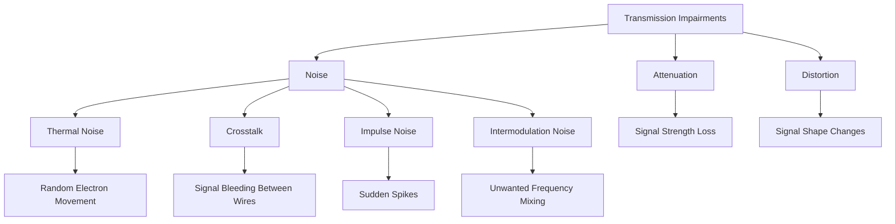
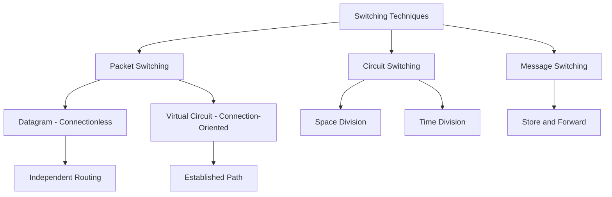
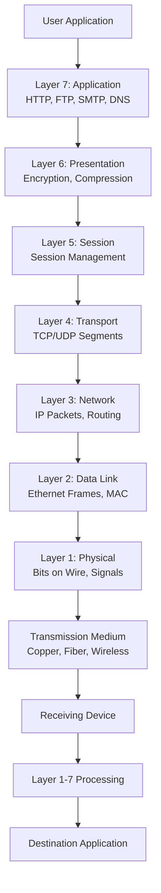

## Table of Contents

1. [Network Performance & Transmission Impairments](https://claude.ai/chat/1f251fa6-0735-438d-8a0e-209f2c147346#1-network-performance)
2. [Switching Techniques](https://claude.ai/chat/1f251fa6-0735-438d-8a0e-209f2c147346#2-switching-techniques)
3. [Complete System Integration](https://claude.ai/chat/1f251fa6-0735-438d-8a0e-209f2c147346#3-system-integration)

---

# 1. Network Performance & Transmission Impairments {#1-network-performance}

## 1.1 Performance Metrics

Network performance is measured using several key metrics that determine the quality and efficiency of data transmission.

### A) Bandwidth

**Definition:** Bandwidth is the maximum data transfer rate of a network or internet connection. It represents the theoretical maximum capacity of a communication channel.

**Key Concepts:**

- Bandwidth measures the amount of data that can be transmitted per unit of time
- Expressed in bits per second (bps) and its multiples
- Represents the "pipe size" through which data flows
- Higher bandwidth allows more data to be transferred simultaneously

**Measurement Units:**

- bps = bits per second (base unit)
- Kbps = Kilobits per second (10³ bps)
- Mbps = Megabits per second (10⁶ bps)
- Gbps = Gigabits per second (10⁹ bps)
- Tbps = Terabits per second (10¹² bps)

**Example Bandwidths in Real Networks:**

- Dial-up Modem: 56 Kbps
- DSL Connection: 1-100 Mbps
- Cable Internet: 100-1000 Mbps
- Fiber to Home (FTTH): 1-10 Gbps
- Enterprise Backbone: 100 Gbps - 1 Tbps
- Data Center Interconnect: 400 Gbps - 1 Tbps

```
Bandwidth Analogy: Water Pipe

  Narrow Pipe (Low Bandwidth):
  ─────────────────
  ▓▓▓▓ → Limited flow capacity
  ─────────────────
  Only small amount of water flows through

  Wide Pipe (High Bandwidth):
  ═══════════════════
  ▓▓▓▓▓▓▓▓▓▓ → Large flow capacity
  ═══════════════════
  Large amount of water flows through
```

---

### B) Throughput

**Definition:** Throughput is the actual data transfer rate achieved in practice. It represents the real-world performance of a network.

**Key Characteristics:**

- Throughput is always less than or equal to bandwidth
- Measures actual successful data delivery rate
- Varies based on network conditions and congestion
- More realistic measure of network performance than bandwidth

**Relationship to Bandwidth:**

```
Bandwidth vs Throughput

Bandwidth: 100 Mbps  ┌─────────────────────┐
                     │ Available Capacity  │
                     │ (Theoretical Max)   │
                     └─────────────────────┘
                          ▲
Throughput: 75 Mbps  ┌────┴──────────┐
                     │ Actual Usage  │
                     │ (Real World)  │
                     └───────────────┘
```

**Factors Reducing Throughput:**

- Protocol overhead: Headers and control information reduce usable payload
- Network congestion: Multiple users competing for bandwidth
- Processing delays: Time spent in routers and switches
- Errors and retransmissions: Corrupted packets must be resent
- Hardware limitations: NIC, router, or switch processing capacity
- Distance: Signal degradation over long distances

**Calculating Efficiency:**

- Efficiency = (Throughput / Bandwidth) × 100%
- Example: 75 Mbps throughput on 100 Mbps bandwidth = 75% efficiency

---

### C) Latency (Delay)

**Definition:** Latency is the time required for data to travel from source to destination. It represents the total delay experienced by a packet traversing the network.

**Four Components of Latency:**

1. **Propagation Delay**
    
    - Time for signal to physically travel through medium
    - Calculated as: Distance / Speed of Signal
    - Speed in fiber optic: ~200,000 km/s (2/3 speed of light)
    - Speed in copper: ~200,000 km/s (similar to fiber)
    - Example: 1000 km fiber link = 5 milliseconds propagation delay
2. **Transmission Delay**
    
    - Time to push all packet bits onto the link
    - Calculated as: Packet Size / Bandwidth
    - Example: 1500 byte packet at 1 Gbps = 12 microseconds
    - Larger packets or slower links increase transmission delay
3. **Processing Delay**
    
    - Time spent processing packet headers and making forwarding decisions
    - Occurs at routers, switches, and endpoints
    - Modern routers: 1-10 microseconds per packet
    - Includes: header checksum verification, routing table lookup, output port determination
4. **Queuing Delay**
    
    - Time packet waits in buffer before transmission
    - Most variable component of latency
    - Depends on traffic congestion level
    - Can range from near zero to hundreds of milliseconds
    - Causes jitter in network performance

```
Latency Components Visualization

  ┌──────────┐                           ┌──────────┐
  │ Sender   │  ─────── Total Latency ─────────► │ Receiver │
  └──────────┘                           └──────────┘
  
  │←─ Propagation ─→│←Transmission→│←Process→│←Queue→│
  │   (Distance)    │  (Pkt Size)  │ (CPU)  │(Congestion)│
```

**Total Latency Formula:**

- Total Latency = Propagation + Transmission + Processing + Queuing
- Example calculation for 1000 km link with 1500 byte packet at 1 Gbps:
    - Propagation: 5 ms
    - Transmission: 0.012 ms
    - Processing: 0.005 ms (at each of 10 routers = 0.05 ms)
    - Queuing: 2 ms (average)
    - Total: ~7.062 ms

**Typical Latency Values:**

- Local Area Network (LAN): Less than 1 millisecond
- Metropolitan Area Network (MAN): 1-10 milliseconds
- Cross-country (e.g., New York to Los Angeles): 30-50 milliseconds
- Intercontinental (e.g., US to Europe): 80-120 milliseconds
- Geostationary Satellite: 240-280 milliseconds (round trip)
- Around the world: 200-300 milliseconds

---

### D) Jitter

**Definition:** Jitter is the variation in packet delay over time. It represents inconsistency in latency between consecutive packets.

**Characteristics:**

- Measured as the variance in packet arrival times
- Caused by network congestion, route changes, and queuing delays
- Particularly problematic for real-time applications
- Can make latency unpredictable

**Jitter Visualization:**

```
Expected Packet Arrival (No Jitter):
───50ms───50ms───50ms───50ms───
Packet 1  Packet 2  Packet 3  Packet 4
Consistent, predictable timing

With Jitter (Variable Latency):
───50ms───45ms───55ms───48ms───52ms───
Packet 1  Packet 2  Packet 3  Packet 4  Packet 5
Inconsistent, unpredictable timing
```

**Impact on Applications:**

- Voice over IP (VoIP): Choppy audio, gaps in conversation
- Video conferencing: Frozen frames, audio-video desynchronization
- Online gaming: Lag spikes, inconsistent response times
- Live streaming: Buffering, playback interruptions

**Jitter Buffer Solution:**

```
Jitter Buffer Operation

Input (Variable Timing):     50  45  55  48  52  60  43
                             ▲▼▲▼▲▼▲▼▲▼▲▼▲▼
Buffer (Smoothing Layer):    [─────────────────]
                             Holds packets briefly
Output (Stable Timing):      50  50  50  50  50  50  50
                             Consistent delivery

Process:
1. Packets arrive at variable times
2. Buffer holds packets temporarily
3. Packets released at constant rate
4. Smooth, predictable playback

Trade-off: Adds small constant delay for consistency
```

**Jitter Tolerance by Application:**

- Data transfer: High tolerance (can wait for packets)
- VoIP: Low tolerance (less than 30 ms acceptable)
- Video conferencing: Low tolerance (less than 50 ms acceptable)
- Online gaming: Very low tolerance (less than 20 ms ideal)

---

### E) Packet Loss

**Definition:** Packet loss occurs when one or more packets traveling across a network fail to reach their destination. Expressed as a percentage of total packets sent.

**Packet Loss Visualization:**

```
Packets Sent:       [1][2][3][4][5][6][7][8][9][10]
                     │  │  │  │  │  │  │  │  │  │
Packets Received:   [1][2][✗][4][5][✗][7][8][9][10]
                                ▲           ▲
                            Lost packets

Loss Rate = (2/10) × 100% = 20%
```

**Causes of Packet Loss:**

1. **Buffer Overflow (Congestion)**
    
    - Network devices have limited buffer space
    - When buffers full, new packets dropped
    - Most common cause in well-functioning networks
    - Temporary during traffic spikes
2. **Transmission Errors**
    
    - Bit errors due to noise or interference
    - Checksum verification fails
    - Packet discarded at receiving end
    - More common on wireless and long-distance links
3. **Route Changes**
    
    - Packets in flight when route changes
    - May be dropped during convergence
    - Temporary during network topology changes
4. **Equipment Failure**
    
    - Failed links or network devices
    - Hardware malfunction
    - Power outages
    - Usually results in complete connection loss
5. **Incorrect Configuration**
    
    - Firewall rules blocking traffic
    - Routing loops causing TTL expiration
    - Access control lists (ACLs) misconfigured

**Impact by Protocol:**

**TCP (Transmission Control Protocol):**

- Detects packet loss through missing acknowledgments
- Automatically retransmits lost packets
- Ensures reliable delivery
- Side effect: Increased latency and reduced throughput
- Connection may stall if loss rate too high

**UDP (User Datagram Protocol):**

- No automatic retransmission
- Lost packets are gone forever
- Application must handle loss
- Used when speed more important than reliability
- Examples: Live video streaming, VoIP, online gaming

**Acceptable Packet Loss Rates:**

- Data applications (TCP): Less than 1%
- VoIP: Less than 0.1%
- Video streaming: Less than 0.5%
- Online gaming: Less than 0.1%
- Critical applications: Near 0%

---

## 1.2 Transmission Impairments

Transmission impairments are problems that degrade signal quality as it travels through a communication medium. Understanding these impairments is essential for network design and troubleshooting.



---

### A) Attenuation

**Definition:** Attenuation is the reduction in signal strength as it propagates through a transmission medium. Signal power decreases with distance.

**Key Characteristics:**

- Natural phenomenon in all transmission media
- Proportional to distance traveled
- Frequency-dependent (higher frequencies attenuate more)
- Measured in decibels (dB)
- Can be overcome with amplifiers or repeaters

```
Attenuation Over Distance

Source        Distance        Destination
 100%  ───→  75%  ───→  50%  ───→  25%  ───→  10%
 ████         ███         ██          █         ▌
 
Signal strength progressively decreases
```

**Attenuation Formula:**

- Attenuation (dB) = 10 × log₁₀(P_out / P_in)
- Negative dB indicates signal loss
- Example: Input 100 mW, Output 1 mW
    - Attenuation = 10 × log₁₀(1/100) = 10 × log₁₀(0.01) = 10 × (-2) = -20 dB

**Attenuation Rates by Medium:**

- Twisted pair (Cat5e): 5-6 dB per 100 meters
- Coaxial cable (RG-6): 2-3 dB per 100 meters
- Multi-mode fiber: 3 dB per kilometer
- Single-mode fiber: 0.2-0.4 dB per kilometer
- Free space (wireless): Increases with square of distance

**Solutions to Attenuation:**

1. **Repeaters (Digital)**
    
    - Regenerate digital signal
    - Clean up noise and restore original shape
    - Used in digital communication systems
    - Example: Ethernet repeater extends cable length
2. **Amplifiers (Analog)**
    
    - Boost signal strength
    - Also amplify noise (limitation)
    - Used in analog systems
    - Example: Cable TV amplifiers

```
Repeater Operation

Before Repeater:
 100%  ───→  25%  (Weak, noisy signal)
 ████         █▴▾

After Repeater:
 100%  ───→  25%  ───→ [REPEATER] ───→  100% ───→  25%
 ████         █              │           ████       █
                      Regenerates
                      clean signal
```

3. **Using Lower Frequencies**
    
    - Lower frequencies attenuate less
    - Trade-off: Lower bandwidth
4. **Higher Quality Cable**
    
    - Better shielding reduces loss
    - Thicker conductors reduce resistance

---

### B) Distortion

**Definition:** Distortion occurs when the signal shape changes during transmission. Different signal components arrive at different times, causing the signal waveform to be altered.

**Types of Distortion:**

1. **Delay Distortion**
    
    - Different frequency components travel at different speeds
    - Also called "dispersion"
    - Causes signal spreading
    - Common in guided media (cables)
2. **Amplitude Distortion**
    
    - Frequency-dependent signal attenuation
    - Some frequencies lose more power than others
    - Results in unbalanced signal
3. **Phase Distortion**
    
    - Non-linear phase shift across frequencies
    - Different phase delays for different frequencies
    - Affects signal timing relationships

```
Signal Distortion Visualization

Original Signal (Transmitted):
    ╱╲      ╱╲      ╱╲
   ╱  ╲    ╱  ╲    ╱  ╲
  ╱    ╲  ╱    ╲  ╱    ╲
──      ──      ──      ──
Sharp, clean waveform

Distorted Signal (Received):
   ╱╲    ╱─╲     ╱──╲
  ╱  ╲  ╱   ╲   ╱    ╲___
 ╱    ╲╱     ╲─╱         ╲__
──
Smeared, phase-shifted waveform
```

**Causes of Distortion:**

- Impedance mismatches in transmission line
- Non-linear characteristics of electronic components
- Multiple signal reflections
- Capacitance and inductance in cables
- Modal dispersion in multi-mode fiber

**Effects of Distortion:**

- Inter-symbol interference (ISI)
- Reduced maximum data rate
- Increased bit error rate
- Need for complex equalization

**Solutions:**

- Equalization: Electronic compensation for known distortion patterns
- Adaptive equalization: Automatically adjusts to changing conditions
- Better quality cables: Tighter specifications reduce distortion
- Shorter transmission distances
- Lower data rates

---

### C) Noise

**Definition:** Noise refers to unwanted signals that interfere with the desired signal, degrading communication quality.

#### 1. Thermal Noise (White Noise / Johnson Noise)

**Characteristics:**

- Caused by random movement of electrons due to thermal agitation
- Present in all electronic devices at temperatures above absolute zero
- Distributed uniformly across all frequencies (white noise)
- Predictable and unavoidable
- Cannot be eliminated, only minimized

**Thermal Noise Power Formula:**

- N = k × T × B
- Where:
    - N = Noise power (Watts)
    - k = Boltzmann constant (1.38 × 10⁻²³ J/K)
    - T = Temperature (Kelvin)
    - B = Bandwidth (Hz)

**Example Calculation:**

- Room temperature: T = 300 K
- Bandwidth: B = 1 MHz = 10⁶ Hz
- N = (1.38 × 10⁻²³) × 300 × 10⁶
- N = 4.14 × 10⁻¹⁵ Watts
- N = -144 dBm

```
Thermal Noise Visualization

Clean Signal:     ∿∿∿∿∿∿∿∿∿∿∿∿∿∿∿
                  Smooth sine wave

Thermal Noise:    ▴▾▴▾▴▾▴▴▾▴▾▴▾▾▴
                  Random fluctuations

Combined Result:  ∿▴∿▾∿▴∿∿▾∿▴∿▾∿▾▴∿
                  Signal with noise added
```

**Methods to Reduce Thermal Noise:**

- Cool electronic equipment (lower T reduces noise)
- Minimize bandwidth (lower B reduces noise)
- Use low-noise amplifiers
- Shielding and grounding
- Note: Cannot be eliminated completely

---

#### 2. Crosstalk

**Definition:** Crosstalk is the unwanted coupling of signals from one transmission channel to another. Signal energy leaks from one wire and induces unwanted signals in adjacent wires.

**Types of Crosstalk:**

1. **Near-End Crosstalk (NEXT)**
    
    - Interference detected at the same end as the transmitter
    - Transmit signal couples into adjacent receive wire
    - More severe than FEXT due to stronger signal
    - Measured in dB (higher is better)
2. **Far-End Crosstalk (FEXT)**
    
    - Interference detected at the opposite end from transmitter
    - Weaker than NEXT due to attenuation
    - Less problematic in most cases

```
Near-End Crosstalk (NEXT)

Transmitter ───────∿∿∿───────►
            │ │ │           Receiver
            ▼ ▼ ▼           (Far End)
Adjacent ◄──▴▾▴──────────────
         Interference at transmit end

Far-End Crosstalk (FEXT)

Transmitter ───────∿∿∿───────►
                     │ │ │   Receiver
                     ▼ ▼ ▼   (Far End)
Adjacent ──────────────▴▾▴────►
         Interference at receive end
```

**Causes of Crosstalk:**

- Electromagnetic coupling between adjacent wires
- Capacitive coupling (electric field)
- Inductive coupling (magnetic field)
- Poor cable quality or installation
- Untwisted portions of twisted pair cables
- Proximity of high-power and low-power cables

**Prevention and Mitigation:**

1. **Twisted Pair Cable Design**
    
    - Twisting creates equal exposure to interference
    - Electromagnetic fields cancel out
    - Tighter twists reduce crosstalk
    - Different twist rates per pair
2. **Shielding (STP)**
    
    - Metal shield blocks electromagnetic fields
    - Foil or braided shield around pairs
    - Must be properly grounded
3. **Physical Separation**
    
    - Increase distance between cables
    - Separate high-power from low-power cables
    - Use cable trays and separate conduits
4. **Category Rating**
    
    - Higher category cables have better crosstalk rejection
    - Cat6 has separator between pairs
    - Cat6a, Cat7 have enhanced shielding

**Crosstalk Performance Standards:**

- Measured in dB (decibels)
- Higher values indicate better performance
- Cat5e NEXT: >35 dB at 100 MHz
- Cat6 NEXT: >44 dB at 100 MHz
- Cat6a NEXT: >50 dB at 500 MHz

---

#### 3. Impulse Noise

**Definition:** Impulse noise consists of sudden, short-duration, high-amplitude bursts of energy that cause brief but severe interference.

**Characteristics:**

- Irregular and unpredictable
- Short duration (microseconds to milliseconds)
- High amplitude relative to signal
- Most disruptive type of noise
- Can cause multiple bit errors (burst errors)

```
Impulse Noise Visualization

Normal Signal:
  ∿∿∿∿∿∿∿∿∿∿∿∿∿∿∿∿∿∿∿∿
  Smooth, continuous waveform

With Impulse Noise:
  ∿∿∿∿∿∿█∿∿∿∿∿∿∿∿∿█∿∿∿
        ▲               ▲
    Sudden spike    Sudden spike
    
Effect: Multiple consecutive bits corrupted
```

**Common Sources:**

- Lightning strikes (electromagnetic pulse)
- Power line fluctuations and surges
- Switching transients from electric motors
- Relay and switch operations
- Faulty electrical connections
- Nearby electrical machinery
- Electric arc welding equipment
- Fluorescent light ballasts

**Effects on Digital Communications:**

- Bit errors in transmitted data
- Burst errors (multiple consecutive bits affected)
- Frame check sequence (FCS) failures
- Packet loss and retransmissions
- Temporary disruption of connection

**Mitigation Strategies:**

1. **Error Detection and Correction**
    
    - Forward Error Correction (FEC) codes
    - Cyclic Redundancy Check (CRC)
    - Parity checking
    - Reed-Solomon coding
2. **Physical Protection**
    
    - Proper shielding and grounding
    - Surge protectors and UPS systems
    - Lightning arrestors
    - Isolated power supplies
3. **Protocol-Level Solutions**
    
    - Automatic Repeat Request (ARQ)
    - Interleaving (spread burst errors)
    - Adaptive retransmission strategies
4. **Infrastructure Design**
    
    - Separate data and power cables
    - Use shielded cables in industrial environments
    - Proper cable routing away from noise sources
    - Fiber optic cables (immune to electrical noise)

---

#### 4. Intermodulation Noise

**Definition:** Intermodulation noise occurs when two or more signals share the same transmission medium and their frequencies interact to create unwanted sum and difference frequencies.

**Mathematical Basis:**

- When signals at frequencies f₁ and f₂ combine
- Non-linear components create additional frequencies
- Intermodulation products: f₁ + f₂, f₂ - f₁, 2f₁, 2f₂, 2f₁ - f₂, etc.

**Example:**

- Signal 1: f₁ = 100 MHz
- Signal 2: f₂ = 200 MHz
- Intermodulation products:
    - f₁ + f₂ = 300 MHz
    - f₂ - f₁ = 100 MHz (interferes with original f₁)
    - 2f₁ = 200 MHz (interferes with original f₂)
    - 2f₁ - f₂ = 0 MHz
    - 2f₂ - f₁ = 300 MHz

**Common Scenarios:**

- Wireless communications with multiple channels
- Cable TV systems carrying many channels
- Frequency Division Multiplexing (FDM) systems
- Non-linear amplifiers
- Overdriven amplifiers

**Causes:**

- Non-linear characteristics of electronic components
- Amplifiers operating near saturation
- Mixing in active devices
- Poor isolation between channels

**Prevention Methods:**

1. **Proper Frequency Planning**
    
    - Careful selection of carrier frequencies
    - Avoid frequencies that create problematic products
    - Use guard bands between channels
2. **Filters**
    
    - Bandpass filters to isolate channels
    - Remove intermodulation products
    - Prevent unwanted signals from mixing
3. **Linear Amplifiers**
    
    - Operate amplifiers in linear region
    - Avoid saturation and overdrive
    - Use Class A amplifiers for critical applications
4. **Channel Separation**
    
    - Adequate spacing between frequency channels
    - Reduce power levels to minimize mixing

---

## 1.3 Signal-to-Noise Ratio (SNR)

**Definition:** Signal-to-Noise Ratio (SNR) is the ratio of signal power to noise power. It is a fundamental measure of signal quality in communication systems.

**SNR Formula:**

- SNR = Signal Power / Noise Power (ratio)
- SNR (dB) = 10 × log₁₀(Signal Power / Noise Power)

**Interpretation:**

- Higher SNR indicates better signal quality
- Lower SNR indicates more interference from noise
- SNR directly affects data rate and error rate
- Critical parameter for system design

```
Signal-to-Noise Ratio Visualization

Good SNR (30 dB - High Ratio):
Signal Power: ████████████████████████████
Noise Power:  ▴▾▴▾▴
Result: Clean, easily distinguishable signal

Poor SNR (5 dB - Low Ratio):
Signal Power: ████████████████████████████
Noise Power:  ▴▾▴▾▴▾▴▾▴▾▴▾▴▾▴▾▴▾▴▾
Result: Difficult to distinguish signal from noise
```

**SNR Examples:**

1. **High SNR (30 dB)**
    
    - Signal Power: 1000 mW
    - Noise Power: 1 mW
    - SNR = 10 × log₁₀(1000/1) = 30 dB
    - Excellent communication quality
2. **Moderate SNR (20 dB)**
    
    - Signal Power: 100 mW
    - Noise Power: 1 mW
    - SNR = 10 × log₁₀(100/1) = 20 dB
    - Good communication quality
3. **Low SNR (10 dB)**
    
    - Signal Power: 10 mW
    - Noise Power: 1 mW
    - SNR = 10 × log₁₀(10/1) = 10 dB
    - Marginal communication quality
4. **Very Low SNR (0 dB)**
    
    - Signal Power: 1 mW
    - Noise Power: 1 mW
    - SNR = 10 × log₁₀(1/1) = 0 dB
    - Signal equals noise, very poor quality

**Shannon's Channel Capacity Theorem:**

Shannon's theorem defines the theoretical maximum data rate (capacity) of a communication channel:

- C = B × log₂(1 + SNR)

Where:

- C = Channel capacity (bits per second)
- B = Bandwidth (Hertz)
- SNR = Signal-to-Noise Ratio (as a ratio, not dB)

**Example Calculation:**

- Bandwidth: B = 3000 Hz (telephone line)
- SNR: 30 dB = 1000 (as ratio)
- C = 3000 × log₂(1 + 1000)
- C = 3000 × log₂(1001)
- C = 3000 × 9.97
- C ≈ 30,000 bps (30 kbps)

**Key Insights from Shannon's Theorem:**

- Maximum data rate depends on both bandwidth and SNR
- Increasing bandwidth increases capacity linearly
- Increasing SNR increases capacity logarithmically
- No error-free communication possible above capacity limit
- Fundamental limit regardless of modulation technique

**Practical Implications:**

- Cannot achieve infinite data rate by increasing SNR
- Trade-off between bandwidth and SNR for desired capacity
- Error correction required near capacity limit
- Actual systems operate below theoretical capacity

**SNR Requirements by Application:**

- Digital voice: 15-20 dB minimum
- Data transmission: 20-25 dB for reliable operation
- High-speed data: 25-30 dB
- Video streaming: 20-25 dB
- WiFi 802.11n/ac: 15-30 dB depending on modulation

**Improving SNR:**

- Increase transmit power (increase signal)
- Use directional antennas (focus signal)
- Reduce noise sources (shielding, filtering)
- Move closer to transmitter (reduce attenuation)
- Use better quality cables (less noise pickup)
- Lower temperature (reduce thermal noise)

---

# 2. Switching Techniques {#2-switching-techniques}

Switching is the process of determining the path that data takes through a network. It involves connecting input ports to output ports to transfer data between network nodes.

**Purpose of Switching:**

- Establish communication paths between nodes
- Enable resource sharing among multiple users
- Optimize network utilization
- Provide different quality of service levels



---

## 2.1 Circuit Switching

**Definition:** Circuit switching establishes a dedicated physical path between sender and receiver for the duration of the communication session. The path remains reserved even during idle periods.

**Three Phases of Circuit Switching:**

1. **Connection Setup Phase**
    
    - Request for connection initiated
    - Path established through network
    - Resources allocated and reserved
    - Acknowledgment sent back to source
    - Time required before data transfer begins
2. **Data Transfer Phase**
    
    - Actual communication occurs
    - Dedicated path used exclusively
    - Constant bandwidth available
    - No intermediate storage of data
    - Path remains active throughout
3. **Connection Teardown Phase**
    
    - Either party can initiate disconnect
    - Resources released and made available
    - Path deallocated
    - Circuit returns to idle state

```
Circuit Switching Operation

Caller A ─────┐                    ┌───── Caller B
              │                    │
            ┌─▼────────────────────▼─┐
            │   Telephone Network    │
            │  ┌──────────────────┐  │
            │  │ Dedicated Circuit│  │
            │  │ Reserved for call│  │
            │  └──────────────────┘  │
            └────────────────────────┘

Timeline:
├────Setup────┼────Data Transfer────┼────Teardown───┤
0s           2s                    120s             122s
             ▲                      ▲
      Connection established    Call ends
```

**Resource Allocation:**

- Bandwidth reserved for entire duration
- Guaranteed availability
- No sharing with other connections
- Resources idle when no data transmitted
- Inefficient for bursty traffic

**Characteristics:**

- Dedicated path between communicating parties
- Constant bandwidth and low latency once established
- In-order delivery guaranteed
- Fixed delay (predictable)
- Setup time required before communication
- Resources wasted during silence periods
- Connection must be re-established if link fails

**Advantages:**

- Guaranteed bandwidth throughout session
- Fixed and predictable delay
- No congestion during data transfer phase
- In-order delivery of data
- Suitable for continuous traffic (voice calls)
- Simple to implement
- Low latency after setup

**Disadvantages:**

- Inefficient use of resources (idle time wasted)
- Connection setup time adds delay
- Dedicated resources even when not transmitting
- Single link failure drops entire connection
- Not suitable for bursty data traffic
- Poor utilization with variable traffic patterns
- Expensive infrastructure (dedicated paths)

**Classic Example:** Traditional Public Switched Telephone Network (PSTN)

- Analog and early digital telephone systems
- Dedicated circuit for each call
- Circuit held for entire call duration
- Resources released only when call ends

---

### 2.1.1 Types of Circuit Switching

#### A) Space Division Switching

**Definition:** Space division switching uses separate physical paths for each connection. Crosspoints physically connect input and output lines.

**Characteristics:**

- Physically separate signal paths
- Connections exist in space (physical crosspoints)
- Used in first generation switches
- Requires n×m crosspoints for n inputs and m outputs

```
Crossbar Switch (Space Division)

┌────────────────────────┐
│   Crossbar Switch      │
│                        │
│  In1 ─┬─┬─┬─┬─        │
│       │ │ │ │         │
│  In2 ─┼─┼─┼─┼─        │
│       │ │ │ │         │
│  In3 ─┼─┼─┼─┼─        │
│       │ │ │ │         │
│       │ │ │ └─ Out4   │
│       │ │ └─── Out3   │
│       │ └───── Out2   │
│       └─────── Out1   │
└────────────────────────┘

Each intersection is a crosspoint
that can be activated to connect
input to output
```

**Implementation:**

- Metallic crosspoints in analog systems
- Semiconductor switches in digital systems
- Matrix arrangement of switches
- Each crosspoint can be open or closed

**Advantages:**

- Simultaneous connections possible
- No time sharing of paths
- Simple and straightforward
- Predictable performance

**Disadvantages:**

- Number of crosspoints grows as n×m
- Expensive for large switches
- Physical space requirements
- Limited scalability

---

#### B) Time Division Switching

**Definition:** Time division switching shares a common path among multiple connections using time slots. Different connections use the same physical path at different times.

**Characteristics:**

- Time-shared use of common bus
- Digital switching technique
- Based on Time Division Multiplexing (TDM)
- Samples from different channels interleaved

```
Time Division Switching

Time Slots: │ 1 │ 2 │ 3 │ 4 │ 1 │ 2 │ 3 │ 4 │ 1 │ 2 │
           └───┴───┴───┴───┴───┴───┴───┴───┴───┴───┘
              ▲   ▲   ▲   ▲
              │   │   │   │
Connection 1: Uses slot 1 in every frame
Connection 2: Uses slot 2 in every frame
Connection 3: Uses slot 3 in every frame
Connection 4: Uses slot 4 in every frame

Frame repeats cyclically
```

**Operation:**

- Time divided into frames
- Each frame divided into time slots
- Each connection assigned specific slot(s)
- Data transmitted during assigned slot
- Slots repeat at regular intervals

**Advantages:**

- Fewer physical switches required
- More scalable than space division
- Efficient use of resources
- Digital processing simplifies control

**Disadvantages:**

- Requires synchronization
- More complex control logic
- Digital processing required
- Slot overhead

**Applications:**

- Digital telephone exchanges
- T1/E1 carrier systems
- ISDN networks
- Modern PSTN infrastructure

---

## 2.2 Packet Switching

**Definition:** Packet switching breaks data into small units called packets, each transmitted independently through the network. No dedicated path is established; packets may take different routes.

**Packet Structure:** Each packet contains:

- Header: Control information (source, destination, sequence number)
- Payload: Actual data being transmitted
- Trailer: Error checking information (CRC, checksum)

```
Packet Anatomy

┌────────┬─────────────────┬──────────┐
│ Header │  Payload (Data) │ Trailer  │
└────────┴─────────────────┴──────────┘
    ▲            ▲              ▲
    │            │              │
Addresses,   Actual        Error
Sequence,    Information   Checking
Control                    (CRC)
```

**Packetization Process:**

```
Large Message (Original Data):
████████████████████████████████████████
Single large block of data

Broken into Packets:
[Hdr│Data1] [Hdr│Data2] [Hdr│Data3] [Hdr│Data4]
Each packet independent

Multiple Possible Routes:

Source ─┬─► Router A ───┐
        │               ├──► Router D ──► Destination
        └─► Router B ──┬┘
                       │
            Router C ──┘

Packet 1: A → D → Destination
Packet 2: B → D → Destination  
Packet 3: A → C → D → Destination
Packet 4: B → D → Destination
```

**Key Characteristics:**

- No dedicated path required
- Each packet routed independently
- Statistical multiplexing of network resources
- Packets may arrive out of order
- Store-and-forward at each node
- Queuing delays vary

**Advantages:**

- Efficient bandwidth utilization
- No setup time required (connectionless)
- Can route around network failures
- Suitable for bursty traffic
- Multiple simultaneous connections
- Resource sharing among users
- Better fault tolerance

**Disadvantages:**

- Variable delay (queuing at routers)
- Packets can be lost
- Out-of-order delivery possible
- Protocol overhead (headers)
- More complex routing decisions
- Requires reassembly at destination
- Potential for congestion

**Applications:**

- Internet Protocol (IP)
- Email systems
- File transfers
- Web browsing
- Most modern data networks

---

### 2.2.1 Datagram Packet Switching (Connectionless)

**Definition:** In datagram switching, each packet is treated as an independent entity. Packets are routed individually based on destination address in the header. No connection setup required.

**Characteristics:**

- Each packet routed independently
- No connection establishment phase
- Packets may take different paths
- Packets may arrive out of order
- No guaranteed delivery
- "Best-effort" service model

```
Datagram Routing Example

Network Topology:

      R1 ─── R3
     /         \
    A           B
     \         /
      R2 ─── R4

Packet routing decisions:
- Packet 1: A → R1 → R3 → B
- Packet 2: A → R2 → R4 → B
- Packet 3: A → R1 → R4 → B

Each packet routed based on:
1. Current routing table
2. Network conditions
3. Link availability
4. Routing algorithm
```

**Routing Decision Process at Each Router:**

```
Packet Arrives at Router
        │
        ▼
┌─────────────────┐
│ Read Destination│
│ Address         │
└────────┬────────┘
         │
         ▼
┌─────────────────┐
│ Look up in      │
│ Routing Table   │
└────────┬────────┘
         │
         ▼
┌─────────────────┐
│ Determine Best  │
│ Next Hop        │
└────────┬────────┘
         │
         ▼
┌─────────────────┐
│ Forward Packet  │
│ to Output Port  │
└─────────────────┘
```

**Routing Table Example:**

```
Router Routing Table
┌──────────────┬──────────────┬──────┬──────┐
│ Destination  │ Next Hop     │ Cost │ Port │
│ Network      │ Router       │      │      │
├──────────────┼──────────────┼──────┼──────┤
│ 192.168.1.0  │ Router A     │  10  │  1   │
│ 192.168.2.0  │ Router B     │  15  │  2   │
│ 10.0.0.0     │ Router C     │  20  │  3   │
│ 0.0.0.0      │ Default GW   │  50  │  4   │
└──────────────┴──────────────┴──────┴──────┘
(Default gateway handles unknown destinations)
```

**Advantages:**

- Fast: No setup delay
- Flexible: Adapts to network changes quickly
- Robust: Routes around failures automatically
- Simple: No state information maintained
- Load balancing: Traffic distributed across paths

**Disadvantages:**

- No guarantees: Best-effort delivery only
- Variable delay: Unpredictable latency
- Out-of-order delivery: Higher-layer protocols must reorder
- No resource reservation: May encounter congestion
- Overhead: Full address in every packet

**Protocols Using Datagram Switching:**

- IP (Internet Protocol)
- UDP (User Datagram Protocol)
- ICMP (Internet Control Message Protocol)
- Most Internet traffic

---

### 2.2.2 Virtual Circuit Packet Switching (Connection-Oriented)

**Definition:** Virtual circuit switching establishes a logical connection before data transfer. All packets follow the same predetermined path, but path is shared with other connections using statistical multiplexing.

**Three Phases:**

1. **Setup Phase**
    
    - Call request sent through network
    - Resources reserved along path
    - Virtual Circuit Identifier (VCI) assigned
    - Path established and stored in routing tables
    - Acknowledgment returned to source
2. **Data Transfer Phase**
    
    - All packets follow established path
    - Packets tagged with VCI instead of full address
    - In-order delivery guaranteed
    - Possible Quality of Service (QoS) guarantees
3. **Teardown Phase**
    
    - Either party can initiate disconnect
    - Resources released along path
    - VCI freed for reuse
    - Path information removed from tables

```
Virtual Circuit Setup

Setup Phase:
Source ─► R1 ─► R2 ─► R3 ─► Destination
      (Setup Request Propagates)

Source ◄─ R1 ◄─ R2 ◄─ R3 ◄─ Destination
      (Acknowledgment Returns)

Path now established in routing tables

Data Transfer Phase:
All packets follow same path:
Source ─► R1 ─► R2 ─► R3 ─► Destination
      (VCI identifies connection)
```

**Virtual Circuit Table at Router:**

```
Virtual Circuit Table (Router R1)
┌──────────────┬──────────┬──────────┬─────────┐
│ Incoming     │ Incoming │ Outgoing │ Next    │
│ Port         │ VCI      │ Port     │ Hop     │
├──────────────┼──────────┼──────────┼─────────┤
│ Port 1       │ VCI 5    │ Port 2   │ R2      │
│ Port 3       │ VCI 8    │ Port 4   │ R4      │
│ Port 1       │ VCI 12   │ Port 2   │ R2      │
│ Port 2       │ VCI 20   │ Port 4   │ R4      │
└──────────────┴──────────┴──────────┴─────────┘

VCI may change at each hop (label swapping)
```

**Types of Virtual Circuits:**

**1. Permanent Virtual Circuit (PVC)**

- Pre-configured by network administrator
- Always available (like leased line)
- No setup/teardown signaling
- Used for constant traffic between sites
- Example: Frame Relay PVCs connecting branch offices

**2. Switched Virtual Circuit (SVC)**

- Established on-demand
- Setup signaling required
- Torn down when communication ends
- More flexible than PVC
- Example: ATM SVCs, X.25 connections

**Characteristics:**

- Logical connection, not physical
- Path determined during setup
- In-order delivery guaranteed
- Possible QoS guarantees
- Lower per-packet overhead (uses VCI not full address)
- State information maintained in switches

**Advantages:**

- In-order packet delivery
- More predictable performance than datagram
- Quality of Service possible
- Resource reservation possible
- Lower overhead after setup (shorter headers)
- Connection state enables features (e.g., bandwidth reservation)

**Disadvantages:**

- Setup delay before data transfer
- Less flexible than datagram
- State information must be maintained
- If link fails, connection must be re-established
- Less robust to failures during data transfer
- Resources tied up even during idle periods

**Protocols Using Virtual Circuits:**

- ATM (Asynchronous Transfer Mode)
- Frame Relay
- X.25
- MPLS (Multi-Protocol Label Switching)
- TCP (over IP datagram service)

---

## 2.3 Message Switching

**Definition:** Message switching is a store-and-forward technique where the entire message is stored at each intermediate node before being forwarded to the next node.

**Operation:**

- Complete message stored at each hop
- Message forwarded when link becomes available
- No real-time constraint
- Can wait for best route or off-peak hours

```
Message Switching Operation

Source ──► [Router 1] ──► [Router 2] ──► Destination
           [Store    ]    [Store    ]
           [Complete ]    [Complete ]
           [Message  ]    [Message  ]

Timeline:
├──Transmit──┼──Store──┼──Transmit──┼──Store──┼──Deliver─┤
Source     Router 1  Router 1    Router 2  Router 2  Dest

Entire message must be received before forwarding
```

**Store-and-Forward Process:**

1. **Receive Phase**
    
    - Entire message received at node
    - Error checking performed
    - Message stored on disk/memory
2. **Wait Phase**
    
    - Wait for output link availability
    - May wait for better route
    - Can implement priority queuing
3. **Forward Phase**
    
    - Entire message transmitted to next hop
    - Process repeats at each node

**Characteristics:**

- No path setup required
- Store complete message at each node
- Forward when convenient
- No maximum message size in principle
- Long delays common
- Historical significance

**Advantages:**

- No connection setup required
- Can wait for best route
- Can store messages during network congestion
- Error checking at each hop
- Can broadcast to multiple destinations
- Message priority possible
- Efficient use of links (can wait for off-peak)

**Disadvantages:**

- Long delays (store entire message)
- Large storage requirements at nodes
- Not suitable for interactive applications
- Message size limitations in practice
- Delay increases with message size
- Poor for real-time traffic

**Historical Applications:**

- Telegraph systems
- Early computer networks
- Email systems (store-and-forward)
- Telex networks

**Modern Usage:**

- Email still uses store-and-forward concept
- No longer used for real-time or interactive traffic
- Largely replaced by packet switching

---

## 2.4 Switching Techniques Comparison

```
Comprehensive Comparison Table

┌──────────────┬──────────────┬──────────────┬──────────────┬──────────────┐
│ Feature      │ Circuit      │ Datagram     │ Virtual      │ Message      │
│              │ Switching    │ Packet       │ Circuit      │ Switching    │
│              │              │ Switching    │ Packet       │              │
├──────────────┼──────────────┼──────────────┼──────────────┼──────────────┤
│ Path         │ Dedicated    │ Dynamic      │ Fixed        │ Dynamic      │
│              │ Physical     │ per Packet   │ (Logical)    │ per Message  │
├──────────────┼──────────────┼──────────────┼──────────────┼──────────────┤
│ Setup        │ Required     │ Not Required │ Required     │ Not Required │
│ Phase        │              │              │              │              │
├──────────────┼──────────────┼──────────────┼──────────────┼──────────────┤
│ State        │ At switches  │ None         │ At switches  │ At nodes     │
│ Information  │              │              │              │              │
├──────────────┼──────────────┼──────────────┼──────────────┼──────────────┤
│ Addressing   │ Once         │ Every packet │ Once (VCI    │ Every        │
│              │ (at setup)   │              │ used after)  │ message      │
├──────────────┼──────────────┼──────────────┼──────────────┼──────────────┤
│ Routing      │ At setup     │ Every packet │ At setup     │ Every        │
│ Decision     │ only         │              │ only         │ message      │
├──────────────┼──────────────┼──────────────┼──────────────┼──────────────┤
│ Packet       │ Always       │ May vary     │ Always       │ Always       │
│ Order        │ preserved    │              │ preserved    │ preserved    │
├──────────────┼──────────────┼──────────────┼──────────────┼──────────────┤
│ Bandwidth    │ Fixed        │ Dynamic      │ Dynamic      │ Dynamic      │
│ Allocation   │ (Reserved)   │ (Shared)     │ (Shared)     │ (Shared)     │
├──────────────┼──────────────┼──────────────┼──────────────┼──────────────┤
│ Header       │ None after   │ High         │ Medium       │ High         │
│ Overhead     │ setup        │              │              │              │
├──────────────┼──────────────┼──────────────┼──────────────┼──────────────┤
│ Delay        │ Fixed        │ Variable     │ Variable     │ Very High    │
│              │ (Constant)   │ (Queuing)    │ (Queuing)    │              │
├──────────────┼──────────────┼──────────────┼──────────────┼──────────────┤
│ Congestion   │ At setup     │ At each node │ At each node │ Store until  │
│              │ (Blocking)   │              │              │ available    │
├──────────────┼──────────────┼──────────────┼──────────────┼──────────────┤
│ Efficiency   │ Low          │ High         │ High         │ Medium       │
│              │ (Idle time)  │              │              │              │
├──────────────┼──────────────┼──────────────┼──────────────┼──────────────┤
│ Suitable     │ Continuous   │ Bursty       │ Bursty       │ Non-real     │
│ Traffic      │ (Voice)      │ (Data)       │ (Data)       │ time         │
├──────────────┼──────────────┼──────────────┼──────────────┼──────────────┤
│ Examples     │ PSTN         │ IP           │ ATM          │ Email        │
│              │ Traditional  │ UDP          │ Frame Relay  │ Telegraph    │
│              │ Telephone    │              │ MPLS         │              │
│              │              │              │ TCP/IP       │              │
└──────────────┴──────────────┴──────────────┴──────────────┴──────────────┘
```

**Selection Criteria:**

**Use Circuit Switching when:**

- Continuous traffic expected
- Constant bandwidth required
- Predictable delay critical
- Connection duration long
- Example: Voice telephone calls

**Use Datagram Packet Switching when:**

- Traffic is bursty
- Flexibility more important than guarantees
- Simple implementation preferred
- Multiple destinations possible
- Example: Internet browsing, email

**Use Virtual Circuit Packet Switching when:**

- Traffic is bursty but connection-oriented
- QoS guarantees needed
- In-order delivery required
- Resource reservation beneficial
- Example: Video streaming, VoIP

**Use Message Switching when:**

- Real-time delivery not required
- Store-and-forward acceptable
- Message priority needed
- Example: Email, batch file transfers

---

# 3. Complete System Integration {#3-system-integration}

## 3.1 OSI Model and Data Flow

The OSI (Open Systems Interconnection) model provides a framework for understanding how data flows through a network from application to physical transmission.

**Seven Layers of OSI Model:**

1. **Application Layer** - User interface, application services
2. **Presentation Layer** - Data format translation, encryption
3. **Session Layer** - Dialog control, session management
4. **Transport Layer** - End-to-end reliability, flow control
5. **Network Layer** - Routing, logical addressing
6. **Data Link Layer** - Frame formatting, MAC addressing
7. **Physical Layer** - Bit transmission, physical medium



---

## 3.2 Complete End-to-End Transaction Example

### Scenario: User Requests www.example.com

This example demonstrates how all network concepts work together in a real-world web page request.

```
Complete Network Transaction Flow

┌─────────────────────────────────────────────────────────────┐
│ LAYER 7: APPLICATION (HTTP)                                 │
├─────────────────────────────────────────────────────────────┤
│                                                             │
│ User Action: Types "www.example.com" in browser            │
│                                                             │
│ DNS Resolution:                                             │
│ 1. Browser checks cache for IP address                     │
│ 2. Queries local DNS server: "What is IP of example.com?"  │
│ 3. DNS server responds: "93.184.216.34"                    │
│                                                             │
│ HTTP Request Generated:                                     │
│   GET / HTTP/1.1                                            │
│   Host: www.example.com                                     │
│   User-Agent: Mozilla/5.0 (Windows NT 10.0)                │
│   Accept: text/html,application/xhtml+xml                  │
│   Accept-Language: en-US,en;q=0.9                          │
│   Connection: keep-alive                                    │
│                                                             │
└─────────────────────────────────────────────────────────────┘
                        ↓
┌─────────────────────────────────────────────────────────────┐
│ LAYER 4: TRANSPORT (TCP)                                    │
├─────────────────────────────────────────────────────────────┤
│                                                             │
│ TCP Three-Way Handshake:                                    │
│ 1. SYN: Client → Server (Seq=1000, Flags=SYN)              │
│ 2. SYN-ACK: Server → Client (Seq=5000, Ack=1001)           │
│ 3. ACK: Client → Server (Seq=1001, Ack=5001)               │
│                                                             │
│ TCP Header Added to HTTP Request:                           │
│   Source Port: 49152 (ephemeral port)                      │
│   Destination Port: 80 (HTTP standard port)                │
│   Sequence Number: 1001                                     │
│   Acknowledgment Number: 5001                              │
│   Flags: PSH, ACK (Push data, acknowledge)                 │
│   Window Size: 65535 bytes (flow control)                  │
│   Checksum: 0xAB12 (error detection)                       │
│   Urgent Pointer: 0                                         │
│                                                             │
│ Result: TCP Segment = [TCP Header] + [HTTP Request]        │
│                                                             │
└─────────────────────────────────────────────────────────────┘
                        ↓
┌─────────────────────────────────────────────────────────────┐
│ LAYER 3: NETWORK (IP)                                       │
├─────────────────────────────────────────────────────────────┤
│                                                             │
│ IP Header Added to TCP Segment:                             │
│   Version: 4 (IPv4)                                         │
│   Header Length: 20 bytes                                   │
│   Type of Service: 0x00                                     │
│   Total Length: 576 bytes                                   │
│   Identification: 54321                                     │
│   Flags: Don't Fragment                                     │
│   Fragment Offset: 0                                        │
│   Time to Live (TTL): 64 hops                               │
│   Protocol: 6 (TCP)                                         │
│   Header Checksum: 0x1234                                   │
│   Source IP: 192.168.1.100                                  │
│   Destination IP: 93.184.216.34                             │
│                                                             │
│ Routing Decision:                                           │
│ 1. Check routing table                                      │
│ 2. Destination not on local network                         │
│ 3. Forward to default gateway (router)                      │
│                                                             │
│ Result: IP Packet = [IP Header] + [TCP Segment] + [Data]   │
│                                                             │
└─────────────────────────────────────────────────────────────┘
                        ↓
┌─────────────────────────────────────────────────────────────┐
│ LAYER 2: DATA LINK (Ethernet)                               │
├─────────────────────────────────────────────────────────────┤
│                                                             │
│ ARP Resolution (if needed):                                 │
│ 1. "Who has IP 192.168.1.1?" (default gateway)             │
│ 2. "I have 192.168.1.1, my MAC is AA:BB:CC:DD:EE:FF"       │
│                                                             │
│ Ethernet Frame Created:                                     │
│                                                             │
│ ┌──────────┬──────────┬──────┬────────┬─────┬──────┐     │
│ │Preamble  │Dest MAC  │Source│ Type   │ IP  │ FCS  │     │
│ │(7 bytes) │(6 bytes) │ MAC  │(2 bytes│Packet│(4 by)│     │
│ │          │          │(6 by)│        │     │      │     │
│ └──────────┴──────────┴──────┴────────┴─────┴──────┘     │
│                                                             │
│ Preamble: 10101010...10101011 (synchronization)            │
│ Destination MAC: AA:BB:CC:DD:EE:FF (router)                 │
│ Source MAC: 11:22:33:44:55:66 (PC's NIC)                   │
│ EtherType: 0x0800 (IPv4)                                    │
│ Payload: IP Packet (including TCP and HTTP)                │
│ FCS: CRC-32 checksum (0xDEADBEEF)                          │
│                                                             │
│ Switch Operation:                                           │
│ 1. Receives frame on Port 5                                │
│ 2. Reads destination MAC address                           │
│ 3. Looks up MAC in CAM (Content Addressable Memory) table  │
│ 4. Finds MAC on Port 24                                    │
│ 5. Forwards frame to Port 24 (uplink to router)            │
│ 6. Full-duplex operation, no collisions                    │
│                                                             │
└─────────────────────────────────────────────────────────────┘
                        ↓
┌─────────────────────────────────────────────────────────────┐
│ LAYER 1: PHYSICAL                                           │
├─────────────────────────────────────────────────────────────┤
│                                                             │
│ Frame Encoding and Transmission:                            │
│                                                             │
│ Manchester Encoding (for 10/100 Mbps Ethernet):             │
│ - Each bit encoded with mid-bit transition                  │
│ - Self-clocking mechanism                                   │
│ - Bit 0: Low-to-High transition                             │
│ - Bit 1: High-to-Low transition                             │
│                                                             │
│ Physical Transmission:                                      │
│ Medium: Cat6 UTP cable                                      │
│ Speed: 1000 Mbps (1 Gigabit Ethernet)                       │
│ Encoding: PAM-5 (5-level pulse amplitude modulation)        │
│ All 4 pairs used bidirectionally                            │
│                                                             │
│ Bit Stream: 10101100010011110110...                         │
│                                                             │
│ Differential Signaling on Wire Pairs:                       │
│ TX+ (Pin 1): ▀▄▀▄▀▀▄▄▀▄▀▀▄▄▀▄▀▄▀▄▀▄                        │
│ TX- (Pin 2): ▄▀▄▀▄▄▀▀▄▀▄▄▀▀▄▀▄▀▄▀▄▀ (inverted)             │
│                                                             │
│ Noise Cancellation:                                         │
│ Receiver calculates: Signal = TX+ minus TX-                │
│ Common-mode noise cancels out                               │
│                                                             │
└─────────────────────────────────────────────────────────────┘
```

---

### Network Path and Device Operations

```
Physical Network Path

[PC] ──Cat6 100m──► [Switch] ──Fiber 2km──► [Router] ──Internet
 NIC     Port 12       Port 24              WAN Port
192.168.1.100      Layer 2             Layer 3
                   Switching           Routing
```

**Switch Operation Detail:**

```
Layer 2 Switch Processing

1. Frame Reception:
   - Receive frame on Port 12
   - Check FCS (Frame Check Sequence)
   - If FCS valid, proceed; if invalid, discard

2. MAC Address Learning:
   - Read source MAC: 11:22:33:44:55:66
   - Update CAM table: MAC on Port 12
   - Set aging timer (typically 300 seconds)

3. Forwarding Decision:
   - Read destination MAC: AA:BB:CC:DD:EE:FF
   - Look up in CAM table
   - Find MAC on Port 24

4. Frame Forwarding:
   - Queue frame for Port 24
   - Wait for port availability
   - Transmit frame on Port 24
   - Full-duplex: simultaneous TX and RX

CAM Table (Content Addressable Memory):
┌──────────────────────┬──────┬────────┐
│ MAC Address          │ Port │ Age    │
├──────────────────────┼──────┼────────┤
│ 11:22:33:44:55:66    │  12  │  5 sec │
│ AA:BB:CC:DD:EE:FF    │  24  │ 30 sec │
│ 77:88:99:AA:BB:CC    │  18  │120 sec │
└──────────────────────┴──────┴────────┘
```

**Router Operation Detail:**

```
Layer 3 Router Processing

1. Frame Reception:
   - Receive Ethernet frame
   - Verify FCS
   - Strip Ethernet header and trailer

2. IP Packet Processing:
   - Read destination IP: 93.184.216.34
   - Verify IP header checksum
   - Check TTL (Time To Live)

3. TTL Processing:
   - Current TTL: 64
   - Decrement TTL: 64 → 63
   - If TTL reaches 0, discard and send ICMP error
   - Recalculate IP header checksum

4. Routing Decision:
   - Look up 93.184.216.34 in routing table
   - Find longest prefix match
   - Determine next hop: ISP gateway

5. ARP Resolution (if needed):
   - Look up next hop IP in ARP cache
   - If not found, send ARP request
   - Get MAC address of next hop

6. New Frame Creation:
   - Create new Ethernet frame
   - New source MAC: Router WAN interface
   - New destination MAC: Next hop router
   - Encapsulate IP packet
   - Calculate new FCS

7. Frame Transmission:
   - Send frame on WAN interface
   - Interface type: Fiber, T1, DSL, etc.

Routing Table:
┌─────────────────┬──────────────┬──────┬────────┐
│ Destination     │ Next Hop     │ Cost │ Interface│
├─────────────────┼──────────────┼──────┼────────┤
│ 192.168.1.0/24  │ Connected    │  0   │ LAN0   │
│ 93.184.0.0/16   │ 203.0.113.1  │  10  │ WAN0   │
│ 0.0.0.0/0       │ 203.0.113.1  │  20  │ WAN0   │
└─────────────────┴──────────────┴──────┴────────┘
```

---

### ISP and Internet Path

```
Internet Service Provider (ISP) Path

[Router] → [ISP Edge Router] → [ISP Core Router] →
           ↓                    ↓
     First Hop            Aggregation
     203.0.113.1          10.0.0.1

→ [Internet Backbone] → [Peering Point] →
  ↓                     ↓
  Major Carrier         IX (Internet Exchange)
  AS 701                AS 3356

→ [example.com Network] → [Load Balancer] → [Web Server]
  ↓                       ↓                  ↓
  Destination AS          Distributes        93.184.216.34
  AS 15133                traffic            Serves content
```

**Multiple Hop Processing:**

Each router along the path:

- Receives packet
- Checks destination IP
- Looks up in routing table
- Determines next hop
- Decrements TTL
- Recalculates checksum
- Forwards to next router

**Typical Hop Count:**

- Local network: 1-3 hops
- Cross-city: 5-10 hops
- Cross-country: 10-20 hops
- International: 15-30 hops

---

### Response Path (Server to Client)

```
Web Server Response

┌─────────────────────────────────────────────────────┐
│ Web Server Processing:                              │
├─────────────────────────────────────────────────────┤
│                                                     │
│ 1. TCP Connection Established:                      │
│    - Three-way handshake completed                  │
│    - Connection state: ESTABLISHED                  │
│                                                     │
│ 2. HTTP Request Processing:                         │
│    - Parse HTTP GET request                         │
│    - Check requested resource: "/"                  │
│    - Read index.html from disk                      │
│    - Generate HTTP response                         │
│                                                     │
│ 3. HTTP Response Generated:                         │
│    HTTP/1.1 200 OK                                  │
│    Date: Mon, 15 Feb 2026 10:30:00 GMT              │
│    Server: Apache/2.4.41                            │
│    Content-Type: text/html; charset=UTF-8           │
│    Content-Length: 2048                             │
│    Connection: keep-alive                           │
│                                                     │
│    <html>                                           │
│    <head><title>Example Domain</title></head>      │
│    <body>                                           │
│    <h1>Example Domain</h1>                          │
│    <p>This domain is for use in illustrative       │
│    examples in documents...</p>                     │
│    </body>                                          │
│    </html>                                          │
│                                                     │
└─────────────────────────────────────────────────────┘
                        ↓
Response follows SAME process in REVERSE:
- Layer 4: TCP segment (Source Port 80, Dest Port 49152)
- Layer 3: IP packet (Source 93.184.216.34, Dest 192.168.1.100)
- Layer 2: Ethernet frames (multiple frames for large response)
- Layer 1: Electrical/optical signals

All intermediate routers and switches process packet:
- Routers decrement TTL, route based on destination IP
- Switches forward based on destination MAC
- Eventually reaches original client

Client receives response:
- Physical layer detects signals
- Data link layer validates frames, strips headers
- Network layer reassembles IP packet
- Transport layer reorders segments, sends ACK
- Application layer (browser) renders HTML page

Total Round-Trip Time (RTT):
- DNS lookup: 20-50 ms
- TCP handshake: 30-100 ms (depending on distance)
- HTTP request/response: 50-200 ms
- Total: 100-350 ms for first page load
```

---

## 3.3 Enterprise Network Architecture

```
Complete Enterprise Network

                      INTERNET
                         │
                         │ Fiber/Metro Ethernet
                         │
                    ┌────▼────┐
                    │Firewall │
                    │Security │
                    │Gateway  │
                    └────┬────┘
                         │
                   ┌─────▼─────┐
                   │ Core Router│
                   │Layer 3 Sw  │
                   │(Redundant) │
                   └─────┬─────┘
                         │
          ┌──────────────┼──────────────┐
          │              │              │
     ┌────▼────┐    ┌────▼────┐   ┌────▼────┐
     │Building │    │Building │   │Building │
     │Switch 1 │    │Switch 2 │   │Switch 3 │
     │Layer 2  │    │Layer 2  │   │Layer 2  │
     │48 Port  │    │48 Port  │   │48 Port  │
     └────┬────┘    └────┬────┘   └────┬────┘
          │              │              │
    ┌─────┼─────┐  ┌─────┼─────┐ ┌─────┼─────┐
    │     │     │  │     │     │ │     │     │
   PC   PC    AP PC   PC    AP PC   PC    AP
   │    │     │  │    │     │  │    │     │
  VLAN VLAN  WiFi VLAN VLAN WiFi VLAN VLAN WiFi
   10   20   30  10   20   30  10   20   30
```

**VLAN Configuration:**

```
Virtual LAN (VLAN) Segmentation

VLAN 10: Management (192.168.10.0/24)
- Network equipment management
- Access restricted to IT staff
- Critical infrastructure

VLAN 20: Employees (192.168.20.0/24)
- Employee workstations
- Department printers
- Internal resources access

VLAN 30: Guests (192.168.30.0/24)
- Guest WiFi access
- Internet only (no internal access)
- Captive portal authentication

VLAN 40: Servers (192.168.40.0/24)
- Database servers
- Application servers
- File servers
- Restricted access via ACLs

VLAN 50: VoIP (192.168.50.0/24)
- IP phones
- Voice gateway
- QoS priority enabled
- Separate from data for quality

Inter-VLAN Routing:
- Handled by Core Router (Layer 3)
- Access Control Lists (ACLs) enforce security
- Each VLAN is separate broadcast domain
```

---

### Data Center Architecture

```
Data Center Network Topology

                   Core Routers
                   (Redundant Pair)
                 ┌────────┬────────┐
                 │        │        │
           ┌─────▼────┬───▼────┬───▼─────┐
           │          │        │         │
      ┌────▼────┐┌────▼────┐┌───▼────┐┌───▼────┐
      │Top-of-  ││Top-of-  ││Top-of- ││Top-of- │
      │Rack Sw1 ││Rack Sw2 ││Rack Sw3││Rack Sw4│
      │(10G/25G)││(10G/25G)││(10G/25G││(10G/25G│
      └────┬────┘└────┬────┘└────┬───┘└────┬───┘
           │          │          │         │
    ┌──────┼───┐ ┌────┼────┐ ┌───┼───┐ ┌───┼───┐
    │      │   │ │    │    │ │   │   │ │   │   │
  ┌─▼─┐ ┌─▼─┐┌▼┐┌▼─┐┌─▼─┐┌▼┐┌─▼─┐┌▼─┐┌─▼─┐┌▼─┐
  │Web│ │App││DB│Web││App││DB│Web││App││DB│
  │Svr│ │Svr││Sv│Svr││Svr││Sv│Svr││Svr││Sv│
  └───┘ └───┘└─┘└───┘└───┘└─┘└───┘└───┘└───┘
  Rack 1     Rack 2     Rack 3     Rack 4

Design Features:
- Leaf-Spine architecture
- 10/25/100 Gbps links
- Layer 3 to the access
- Equal-cost multipath (ECMP)
- Redundant paths for resilience
- Low latency (microseconds)
```

---

### WAN Connection to Branch Office

```
Wide Area Network (WAN) Design

Main Office                              Branch Office
┌────────────────┐                      ┌────────────────┐
│                │                      │                │
│  Core Router   │                      │  Branch Router │
│  (Primary)     │                      │                │
└───────┬────────┘                      └────────┬───────┘
        │                                        │
        │ Primary Link                           │
        │ (MPLS or Metro Ethernet)               │
        │ 100 Mbps - 1 Gbps                      │
        └────────────────────────────────────────┘
        
Backup/Failover:
        ┌────────────────────────────────────────┐
        │ Secondary Link                         │
        │ (Internet VPN or 4G/5G)                │
        │ 50 Mbps - 500 Mbps                     │
        │ Activates if primary fails             │
        └────────────────────────────────────────┘

WAN Technologies:
1. MPLS (Multi-Protocol Label Switching)
   - Private network
   - QoS guarantees
   - SLA (Service Level Agreement)
   - Higher cost

2. SD-WAN (Software-Defined WAN)
   - Intelligent path selection
   - Multiple links (MPLS + Internet)
   - Application-aware routing
   - Lower cost

3. Internet VPN
   - IPsec encryption
   - Lower cost
   - Best-effort delivery
   - Suitable for backup
```

---

## 3.4 Quality of Service (QoS)

**Definition:** Quality of Service (QoS) refers to technologies that manage network traffic to reduce packet loss, latency, and jitter for critical applications.

**Traffic Classification:**

```
QoS Priority Levels

Priority 1 (Highest): Voice
- VoIP phone calls
- Video conferencing
- Latency: <30 ms
- Jitter: <20 ms
- Loss: <0.1%

Priority 2: Interactive Video
- Video calls
- Remote desktop
- Latency: <100 ms
- Jitter: <50 ms

Priority 3: Streaming Video
- YouTube, Netflix
- Corporate video
- Latency: <200 ms
- Can buffer

Priority 4: Business Critical Data
- ERP systems
- Database transactions
- Email
- Latency: <500 ms

Priority 5: General Browsing
- Web traffic
- Social media
- Best effort

Priority 6: Bulk Transfer
- File downloads
- Backups
- Scavenger traffic
- Lowest priority
```

**QoS Mechanisms:**

1. **Classification and Marking**
    
    - Identify traffic types
    - Mark packets with priority (DSCP, CoS)
    - Based on: ports, IP addresses, protocols
2. **Queuing**
    
    - Multiple queues per interface
    - High priority traffic processed first
    - Prevents head-of-line blocking
3. **Policing and Shaping**
    
    - Policing: Drop excess traffic
    - Shaping: Buffer and delay excess traffic
    - Enforce bandwidth contracts
4. **Congestion Avoidance**
    
    - Random Early Detection (RED)
    - Drop packets before queue full
    - Signal TCP to slow down

---

## Summary: Integration of All Concepts

**Complete Network Operation Requires:**

1. **Physical Infrastructure**
    
    - Transmission media (copper, fiber, wireless)
    - Proper cable categories for bandwidth
    - Understanding of attenuation and noise
2. **Signal Encoding**
    
    - Manchester, MLT-3, or other encoding
    - Modulation for wireless transmission
    - Error detection and correction
3. **Data Link Layer**
    
    - Frame formatting
    - MAC addressing
    - Switch operation and CAM tables
4. **Network Layer**
    
    - IP addressing and routing
    - Router operation
    - Path determination
5. **Transport Layer**
    
    - TCP for reliability
    - UDP for speed
    - Port numbers for multiplexing
6. **Switching Strategy**
    
    - Circuit switching for constant traffic
    - Packet switching for bursty data
    - Virtual circuits for QoS
7. **Performance Management**
    
    - Monitor bandwidth and throughput
    - Manage latency and jitter
    - Minimize packet loss
    - Implement QoS
8. **Network Design**
    
    - Hierarchical topology
    - Redundancy for reliability
    - VLANs for segmentation
    - Security at all layers

**All these elements work together to enable modern network communication, from a simple web page request to complex enterprise applications.**

---

