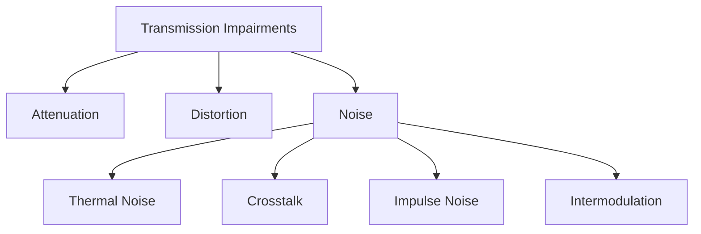
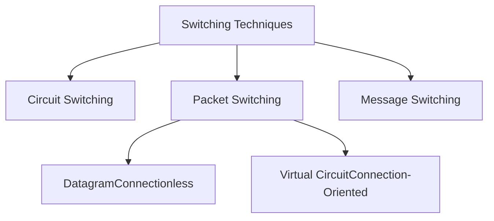
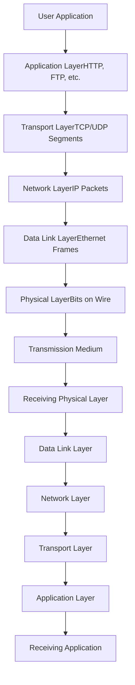

## 7. Network Performance & Transmission Impairments {#network-performance}

### 7.1 Performance Metrics

```
┌──────────────────────────────────────────────────────────┐
│            KEY PERFORMANCE METRICS                       │
└──────────────────────────────────────────────────────────┘
```

#### A) Bandwidth

```
 Bandwidth = Maximum data transfer rate

  ┌────────────────────────────────────────┐
  │  Like a pipe carrying water:           │
  │                                        │
  │  Narrow Pipe (Low Bandwidth):          │
  │  ─────────────────                     │
  │  ▓▓▓▓ → Limited flow                   │
  │  ─────────────────                     │
  │                                        │
  │  Wide Pipe (High Bandwidth):           │
  │  ═══════════════════                   │
  │  ▓▓▓▓▓▓▓▓▓▓ → More flow                │
  │  ═══════════════════                   │
  └────────────────────────────────────────┘

Measurement Units:
• bps   = bits per second
• Kbps  = Kilobits (10³)
• Mbps  = Megabits (10⁶)
• Gbps  = Gigabits (10⁹)
• Tbps  = Terabits (10¹²)

Example Bandwidths:
• Dial-up Modem: 56 Kbps
• DSL: 1-100 Mbps
• Cable: 100-1000 Mbps
• Fiber (Home): 1-10 Gbps
• Backbone: 100 Gbps - 1 Tbps
```

#### B) Throughput

```
 Throughput = Actual data transfer rate (always ≤ Bandwidth)

  Bandwidth: 100 Mbps  ┌─────────────────────┐
                       │ Available Capacity  │
                       └─────────────────────┘
                            ▲
  Throughput: 75 Mbps  ┌────┴──────────┐
                       │ Actual Usage  │
                       └───────────────┘
                       
  Factors reducing throughput:
  • Protocol overhead
  • Network congestion
  • Processing delays
  • Errors and retransmissions
```

#### C) Latency (Delay)

```
 Latency = Time for data to travel from source to destination

  ┌──────────┐                           ┌──────────┐
  │ Sender   │  ─────── 50ms ─────────► │ Receiver │
  └──────────┘                           └──────────┘
  
  Components of Latency:
  
  1. Propagation Delay = Distance / Speed of light
     • Fiber: ~5 μs per km
     • Copper: ~5 μs per km
     
  2. Transmission Delay = Packet Size / Bandwidth
     • 1500 bytes at 1 Gbps = 12 μs
     
  3. Processing Delay = Time to process packet
     • Router: 1-10 μs
     
  4. Queuing Delay = Time waiting in buffer
     • Variable, depends on congestion

  Total Latency = Sum of all delays
  
  Examples:
  • LAN: < 1 ms
  • Cross-country: 30-50 ms
  • Satellite (GEO): 240-280 ms
  • Around the world: 200-300 ms
```

#### D) Jitter

```
 Jitter = Variation in latency

  Expected:  ───50ms───50ms───50ms───50ms───
             Packet 1  Packet 2  Packet 3
             
  With Jitter: ───50ms───45ms───55ms───48ms───
  
  ┌──────────────────────────────────────────┐
  │  Jitter Buffer smooths variations:       │
  │                                          │
  │  Input (variable):  50  45  55  48  52   │
  │          ▲▼▲▼▲▼▲▼▲▼                      │
  │  Buffer: [───────────]                   │
  │          ───────────                      │
  │  Output (stable): 50  50  50  50  50     │
  └──────────────────────────────────────────┘
  
  Critical for:
  • VoIP (Voice over IP)
  • Video conferencing
  • Online gaming
  • Real-time applications
```

#### E) Packet Loss

```
 Packet Loss = Percentage of packets that don't reach destination

  Sent:     [1][2][3][4][5][6][7][8][9][10]
  
  Received: [1][2][✗][4][5][✗][7][8][9][10]
  
  Loss Rate = (2/10) × 100% = 20%
  
  Causes:
  • Buffer overflow (congestion)
  • Transmission errors
  • Route changes
  • Equipment failure
  
  Impact:
  • TCP: Automatic retransmission (slower)
  • UDP: Lost forever (affects voice/video quality)
  • Acceptable: < 1% for data, < 0.1% for VoIP
```

---

### 7.2 Transmission Impairments



#### A) Attenuation

```
╔═══════════════════════════════════════════════════════╗
║                   ATTENUATION                         ║
╠═══════════════════════════════════════════════════════╣
║                                                       ║
║  Signal strength decreases over distance              ║
║                                                       ║
║  Source        Distance        Destination            ║
║   100%  ───→  75%  ───→  50%  ───→  25%  ───→  10%  ║
║   ████         ███         ██          █         ▌    ║
║                                                       ║
║  Solution: REPEATERS/AMPLIFIERS                       ║
║                                                       ║
║   100%  ───→  25%  ───→ [AMP] ───→  100% ───→  25%  ║
║   ████         █          ███         ████       █    ║
║                           ▲                           ║
║                      Regenerates                      ║
║                       signal                          ║
╚═══════════════════════════════════════════════════════╝

Attenuation Formula:
dB = 10 × log₁₀(P_out / P_in)

Example:
  Input Power: 100 mW
  Output Power: 1 mW
  Attenuation = 10 × log₁₀(1/100) = -20 dB
```

---

#### B) Distortion

```
╔═══════════════════════════════════════════════════════╗
║                    DISTORTION                         ║
╠═══════════════════════════════════════════════════════╣
║                                                       ║
║  Signal shape changes during transmission             ║
║                                                       ║
║  Original Signal:                                     ║
║      ╱╲      ╱╲                                      ║
║     ╱  ╲    ╱  ╲                                     ║
║    ╱    ╲  ╱    ╲                                    ║
║  ──      ──      ──                                  ║
║                                                       ║
║  Distorted Signal:                                    ║
║     ╱╲    ╱─╲                                        ║
║    ╱  ╲  ╱   ╲                                       ║
║   ╱    ╲╱     ╲___                                   ║
║  ──                                                   ║
║  (Phase shifted, amplitude changed)                   ║
║                                                       ║
║  Types:                                               ║
║  • Delay Distortion: Different frequency components  ║
║    travel at different speeds                         ║
║  • Amplitude Distortion: Frequency-dependent loss    ║
║  • Phase Distortion: Non-linear phase shift          ║
╚═══════════════════════════════════════════════════════╝

Solution: Equalization (compensate for distortion)
```

---

#### C) Noise Types

**1. Thermal Noise (White Noise/Johnson Noise)**

```
╔═══════════════════════════════════════════════════════╗
║               THERMAL NOISE                           ║
╠═══════════════════════════════════════════════════════╣
║                                                       ║
║  Random electron movement due to heat                 ║
║  Present in all electronic devices                    ║
║  Predictable and unavoidable                          ║
║                                                       ║
║  Signal:  ∿∿∿∿∿∿∿∿∿∿∿∿∿∿∿                           ║
║  Noise:   ▴▾▴▾▴▾▴▴▾▴▾▴▾▾▴                           ║
║  Result:  ∿▴∿▾∿▴∿∿▾∿▴∿▾∿▾▴∿                         ║
║                                                       ║
║  Power = k × T × B                                    ║
║  k = Boltzmann constant (1.38 × 10⁻²³ J/K)          ║
║  T = Temperature (Kelvin)                             ║
║  B = Bandwidth (Hz)                                   ║
║                                                       ║
║  Reduction: Cool equipment, minimize bandwidth        ║
╚═══════════════════════════════════════════════════════╝
```

**2. Crosstalk**

```
╔═══════════════════════════════════════════════════════╗
║                   CROSSTALK                           ║
╠═══════════════════════════════════════════════════════╣
║                                                       ║
║  Signal from one wire interferes with adjacent wire   ║
║                                                       ║
║  Wire A:  ∿∿∿∿∿∿∿∿∿∿∿∿∿∿∿                           ║
║           │ │ │ │ │ │  (Electromagnetic coupling)    ║
║  Wire B:  ─────────────▴▾▴▾▴▾── (Unwanted signal)    ║
║                                                       ║
║  Near-End Crosstalk (NEXT):                           ║
║  Transmitter ───────∿∿∿───────►                      ║
║              │ │ │                                    ║
║              ▼ ▼ ▼                                    ║
║  Adjacent ◄──▴▾▴──────────────                       ║
║  (Interference at same end)                           ║
║                                                       ║
║  Far-End Crosstalk (FEXT):                           ║
║  Transmitter ───────∿∿∿───────►                      ║
║                       │ │ │                           ║
║                       ▼ ▼ ▼                           ║
║  Adjacent ──────────────▴▾▴────►                     ║
║  (Interference at far end)                            ║
║                                                       ║
║  Solution:                                            ║
║  • Twist wire pairs (cancels interference)           ║
║  • Shielding (STP)                                    ║
║  • Increase wire separation                           ║
╚═══════════════════════════════════════════════════════╝
```

**3. Impulse Noise**

```
╔═══════════════════════════════════════════════════════╗
║                 IMPULSE NOISE                         ║
╠═══════════════════════════════════════════════════════╣
║                                                       ║
║  Sudden, sharp spikes of energy                       ║
║  Most disruptive type of noise                        ║
║                                                       ║
║  Normal Signal:                                       ║
║    ∿∿∿∿∿∿∿∿∿∿∿∿∿∿∿∿∿∿∿∿                             ║
║                                                       ║
║  With Impulse Noise:                                  ║
║    ∿∿∿∿∿∿█∿∿∿∿∿∿∿∿∿█∿∿∿                             ║
║          ▲               ▲                            ║
║        Spike           Spike                          ║
║                                                       ║
║  Causes:                                              ║
║  • Lightning strikes                                  ║
║  • Power line fluctuations                            ║
║  • Switching transients                               ║
║  • Electromagnetic motors                             ║
║                                                       ║
║  Effects:                                             ║
║  • Bit errors in digital transmission                 ║
║  • Burst errors (multiple consecutive bits)           ║
║                                                       ║
║  Solution:                                            ║
║  • Error detection and correction codes               ║
║  • Shielding and grounding                            ║
║  • Surge protectors                                   ║
╚═══════════════════════════════════════════════════════╝
```

**4. Intermodulation Noise**

```
When multiple signals share same medium,
they can create unwanted sum/difference frequencies

Signal 1: f₁ = 100 MHz
Signal 2: f₂ = 200 MHz

Intermodulation products:
f₁ + f₂ = 300 MHz (interference!)
f₂ - f₁ = 100 MHz (interference!)
2f₁ = 200 MHz (interference!)

Common in:
• Wireless communications
• Cable TV systems
• Frequency Division Multiplexing

Solution: Proper frequency planning, filters
```

---

### 7.3 Signal-to-Noise Ratio (SNR)

```
╔═══════════════════════════════════════════════════════╗
║           SIGNAL-TO-NOISE RATIO (SNR)                 ║
╠═══════════════════════════════════════════════════════╣
║                                                       ║
║  SNR = Ratio of signal power to noise power           ║
║                                                       ║
║  SNR (dB) = 10 × log₁₀(Signal Power / Noise Power)   ║
║                                                       ║
║  Higher SNR = Better quality                          ║
║                                                       ║
║  Good SNR (30 dB):                                    ║
║  Signal: ████████████████████████████                 ║
║  Noise:  ▴▾▴▾▴                                       ║
║  Clear signal!                                        ║
║                                                       ║
║  Poor SNR (5 dB):                                     ║
║  Signal: ████████████████████████████                 ║
║  Noise:  ▴▾▴▾▴▾▴▾▴▾▴▾▴▾▴▾▴▾▴▾                       ║
║  Difficult to distinguish!                            ║
║                                                       ║
║  Shannon's Channel Capacity:                          ║
║  C = B × log₂(1 + SNR)                               ║
║  C = Maximum data rate (bps)                          ║
║  B = Bandwidth (Hz)                                   ║
║                                                       ║
║  Example:                                             ║
║  B = 3000 Hz (telephone line)                         ║
║  SNR = 1000 (30 dB)                                   ║
║  C = 3000 × log₂(1001) ≈ 30 kbps                     ║
╚═══════════════════════════════════════════════════════╝
```

---

## 8. Switching Techniques {#switching-techniques}

Switching determines the path that data takes through a network.



---

### 8.1 Circuit Switching

```
╔═══════════════════════════════════════════════════════════╗
║                  CIRCUIT SWITCHING                        ║
╠═══════════════════════════════════════════════════════════╣
║                                                           ║
║  Dedicated path established for entire communication      ║
║                                                           ║
║  Phases:                                                  ║
║  1. Connection Setup                                      ║
║  2. Data Transfer                                         ║
║  3. Connection Teardown                                   ║
║                                                           ║
║  Example: Traditional Telephone System (PSTN)            ║
║                                                           ║
║  Caller A ─────┐                    ┌───── Caller B      ║
║                │                    │                     ║
║              ┌─▼────────────────────▼─┐                  ║
║              │   Telephone Network    │                  ║
║              │  ┌──────────────────┐  │                  ║
║              │  │ Dedicated Circuit│  │                  ║
║              │  │ Reserved for call│  │                  ║
║              │  └──────────────────┘  │                  ║
║              └────────────────────────┘                  ║
║                                                           ║
║  Timeline:                                                ║
║  ├────Setup────┼────Data Transfer────┼────Teardown───┤  ║
║  0s           2s                    120s             122s║
║                                                           ║
║  During 118s transfer:                                    ║
║  • Path reserved exclusively                              ║
║  • No sharing with other users                            ║
║  • Even during silence (wasted bandwidth)                 ║
╚═══════════════════════════════════════════════════════════╝

Advantages:
✅ Guaranteed bandwidth
✅ Fixed delay (predictable)
✅ No congestion during data transfer
✅ In-order delivery

Disadvantages:
❌ Inefficient (wasted capacity during idle times)
❌ Setup time required
❌ If any link fails, entire connection drops
❌ Not suitable for bursty data
```

**Circuit Switching Types:**

**1. Space Division Switching**
```
Physical separate paths

┌────────────────────────┐
│   Crossbar Switch      │
│                        │
│  In1 ─┬─┬─┬─┬─        │
│  In2 ─┼─┼─┼─┼─        │
│  In3 ─┼─┼─┼─┼─        │
│       │ │ │ │         │
│       │ │ │ └─ Out1   │
│       │ │ └─── Out2   │
│       │ └───── Out3   │
│       └─────── Out4   │
└────────────────────────┘

Physical crosspoints connect inputs to outputs
```

**2. Time Division Switching**
```
Share common path using time slots

Time Slot: │ 1 │ 2 │ 3 │ 4 │ 1 │ 2 │ 3 │ 4 │
           └───┴───┴───┴───┴───┴───┴───┴───┘
Connection 1: Uses slot 1
Connection 2: Uses slot 2
Connection 3: Uses slot 3
Connection 4: Uses slot 4

Used in digital telephone systems (T1, E1)
```

---

### 8.2 Packet Switching

```
╔═══════════════════════════════════════════════════════════╗
║                  PACKET SWITCHING                         ║
╠═══════════════════════════════════════════════════════════╣
║                                                           ║
║  Data broken into small packets                           ║
║  Each packet routed independently                         ║
║  No dedicated path required                               ║
║                                                           ║
║  Large Message:                                           ║
║  ████████████████████████████████████████                ║
║                                                           ║
║  Broken into Packets:                                     ║
║  [Hdr│Data1] [Hdr│Data2] [Hdr│Data3] [Hdr│Data4]        ║
║                                                           ║
║  Each packet contains:                                    ║
║  • Source address                                         ║
║  • Destination address                                    ║
║  • Sequence number                                        ║
║  • Data payload                                           ║
║  • Error checking                                         ║
║                                                           ║
║  Packets can take different routes:                       ║
║                                                           ║
║  Source ─┬─► Router A ───┐                              ║
║           │               ├──► Router D ──► Destination  ║
║           └─► Router B ──┬┘                              ║
║                          │                                ║
║               Router C ──┘                                ║
║                                                           ║
║  Packets may arrive out of order!                         ║
║  Receiver reassembles in correct sequence                 ║
╚═══════════════════════════════════════════════════════════╝

Advantages:
✅ Efficient use of bandwidth (statistical multiplexing)
✅ No setup time (can start immediately)
✅ Route around failures
✅ Suitable for bursty traffic

Disadvantages:
❌ Variable delay (queuing)
❌ Packets can be lost
❌ Out-of-order delivery
❌ Overhead of packet headers
```

---

### 8.2.1 Datagram Packet Switching (Connectionless)

```
╔═══════════════════════════════════════════════════════════╗
║              DATAGRAM SWITCHING                           ║
╠═══════════════════════════════════════════════════════════╣
║                                                           ║
║  • Each packet treated independently                      ║
║  • No connection setup required                           ║
║  • Packets may take different paths                       ║
║  • Used by: IP (Internet Protocol), UDP                   ║
║                                                           ║
║  Packet 1 Path: A → R1 → R3 → B                         ║
║  Packet 2 Path: A → R2 → R4 → B                         ║
║  Packet 3 Path: A → R1 → R4 → B                         ║
║                                                           ║
║  Routing Decision at EACH router:                         ║
║                                                           ║
║       Packet Arrives                                      ║
║           │                                               ║
║           ▼                                               ║
║  ┌─────────────────┐                                     ║
║  │ Read Destination│                                     ║
║  └────────┬────────┘                                     ║
║           │                                               ║
║           ▼                                               ║
║  ┌─────────────────┐                                     ║
║  │ Check Routing   │                                     ║
║  │ Table           │                                     ║
║  └────────┬────────┘                                     ║
║           │                                               ║
║           ▼                                               ║
║  ┌─────────────────┐                                     ║
║  │ Forward to Best │                                     ║
║  │ Next Hop        │                                     ║
║  └─────────────────┘                                     ║
║                                                           ║
║  Routing Table Example:                                   ║
║  ┌──────────────┬──────────────┬──────┐                 ║
║  │ Destination  │ Next Hop     │ Cost │                 ║
║  ├──────────────┼──────────────┼──────┤                 ║
║  │ 192.168.1.0  │ Router A     │  10  │                 ║
║  │ 192.168.2.0  │ Router B     │  15  │                 ║
║  │ 0.0.0.0      │ Default GW   │  20  │                 ║
║  └──────────────┴──────────────┴──────┘                 ║
╚═══════════════════════════════════════════════════════════╝

Characteristics:
• Fast (no setup delay)
• Flexible (adapts to network changes)
• No guarantees (best-effort delivery)
• Packets may arrive out of order
```

---

### 8.2.2 Virtual Circuit Switching (Connection-Oriented)

```
╔═══════════════════════════════════════════════════════════╗
║           VIRTUAL CIRCUIT SWITCHING                       ║
╠═══════════════════════════════════════════════════════════╣
║                                                           ║
║  • Logical connection established before data transfer    ║
║  • All packets follow same path                           ║
║  • Used by: ATM, Frame Relay, MPLS, TCP (over IP)        ║
║                                                           ║
║  Phases:                                                  ║
║  1. Setup: Establish virtual circuit                      ║
║  2. Data Transfer: Send packets                           ║
║  3. Teardown: Release circuit                             ║
║                                                           ║
║  Setup Phase:                                             ║
║  Source ─► R1 ─► R2 ─► R3 ─► Destination                ║
║         (Setup Request)                                   ║
║  Source ◄─ R1 ◄─ R2 ◄─ R3 ◄─ Destination                ║
║         (Setup Acknowledgment)                            ║
║                                                           ║
║  Data Transfer Phase:                                     ║
║  All packets: Source ─► R1 ─► R2 ─► R3 ─► Dest          ║
║  (Same path for all)                                      ║
║                                                           ║
║  Virtual Circuit Table (at Router R1):                    ║
║  ┌────────────┬─────────┬─────────────┐                 ║
║  │ Incoming   │ Outgoing│ Next        │                 ║
║  │ Port & VCI │ Port    │ Hop         │                 ║
║  ├────────────┼─────────┼─────────────┤                 ║
║  │ Port1/VCI5 │ Port2   │ Router R2   │                 ║
║  │ Port3/VCI8 │ Port4   │ Router R4   │                 ║
║  └────────────┴─────────┴─────────────┘                 ║
║  VCI = Virtual Circuit Identifier                         ║
╚═══════════════════════════════════════════════════════════╝

Types:
1. PVC (Permanent Virtual Circuit)
   • Pre-configured
   • Always available
   • Like leased line

2. SVC (Switched Virtual Circuit)
   • Established on-demand
   • Released when done
   • Like dial-up connection

Advantages:
✅ In-order delivery guaranteed
✅ More predictable performance
✅ Quality of Service (QoS) possible

Disadvantages:
❌ Setup delay
❌ Less flexible than datagrams
❌ If link fails, must re-establish
```

---

### 8.3 Message Switching

```
╔═══════════════════════════════════════════════════════════╗
║              MESSAGE SWITCHING                            ║
║             (Store and Forward)                           ║
╠═══════════════════════════════════════════════════════════╣
║                                                           ║
║  • Entire message stored at each intermediate node        ║
║  • Message forwarded when next link available             ║
║  • No longer used for real-time data                      ║
║  • Historical: Telegraph systems, email                   ║
║                                                           ║
║  Source ──► [Router 1] ──► [Router 2] ──► Destination    ║
║             [Store    ]    [Store    ]                    ║
║             [entire   ]    [entire   ]                    ║
║             [message  ]    [message  ]                    ║
║                                                           ║
║  Timeline:                                                ║
║  ├──Transmit──┼──Store──┼──Transmit──┼──Store──┼─────┤  ║
║  Source    Router 1   Router 1    Router 2   Dest       ║
║                                                           ║
║  Advantages:                                              ║
║  ✅ No path setup required                               ║
║  ✅ Can wait for best route                              ║
║  ✅ Error checking at each hop                           ║
║  ✅ Can broadcast to multiple destinations               ║
║                                                           ║
║  Disadvantages:                                           ║
║  ❌ Long delays (store entire message)                   ║
║  ❌ Requires large storage at intermediate nodes          ║
║  ❌ Not suitable for interactive applications             ║
║  ❌ Message size limits                                   ║
╚═══════════════════════════════════════════════════════════╝
```

---

### Switching Comparison

```
┌──────────────┬────────────┬──────────────┬────────────────┐
│ Feature      │ Circuit    │ Datagram     │ Virtual Circuit│
│              │ Switching  │ Packet       │ Packet         │
├──────────────┼────────────┼──────────────┼────────────────┤
│ Path         │ Dedicated  │ Dynamic      │ Fixed (logical)│
│ Setup        │ Required   │ None         │ Required       │
│ State Info   │ At switches│ None         │ At switches    │
│ Addressing   │ Once       │ Every packet │ Once (VC ID)   │
│ Routing      │ At setup   │ Every packet │ At setup       │
│ Order        │ Preserved  │ May vary     │ Preserved      │
│ Bandwidth    │ Fixed      │ Dynamic      │ Dynamic        │
│ Overhead     │ Low        │ High         │ Medium         │
│ Delay        │ Fixed      │ Variable     │ Variable       │
│ Congestion   │ At setup   │ At each node │ At each node   │
│ Examples     │ PSTN       │ IP, UDP      │ ATM, MPLS, TCP │
└──────────────┴────────────┴──────────────┴────────────────┘
```

---

## 9. Cables, Ports & Electronics {#cables-and-ports}

### 9.1 Cable Types Deep Dive

#### UTP (Unshielded Twisted Pair)

```
╔═══════════════════════════════════════════════════════════╗
║              UTP CABLE DETAILED STRUCTURE                 ║
╠═══════════════════════════════════════════════════════════╣
║                                                           ║
║  PVC Outer Jacket (Protection)                            ║
║  ┌───────────────────────────────────────────────────┐   ║
║  │                                                   │   ║
║  │  Rip Cord (for easy jacket removal)              │   ║
║  │  ─────────────────────────────────────────        │   ║
║  │                                                   │   ║
║  │  Pair 1: Orange/White-Orange (Transmit+/-)       │   ║
║  │  ╱╲╱╲╱╲╱╲╱╲╱╲╱╲╱╲╱╲╱╲╱╲╱╲  (3.5 twists/inch)  │   ║
║  │  ╲╱╲╱╲╱╲╱╲╱╲╱╲╱╲╱╲╱╲╱╲╱╲╱                      │   ║
║  │                                                   │   ║
║  │  Pair 2: Green/White-Green (Receive+/-)          │   ║
║  │  ╱╲╱╲╱╲╱╲╱╲╱╲╱╲╱╲╱╲╱╲  (4 twists/inch)        │   ║
║  │  ╲╱╲╱╲╱╲╱╲╱╲╱╲╱╲╱╲╱╲╱                          │   ║
║  │                                                   │   ║
║  │  Pair 3: Blue/White-Blue (Not used in 100Mbps)   │   ║
║  │  ╱╲╱╲╱╲╱╲╱╲╱╲╱╲╱╲  (3 twists/inch)            │   ║
║  │  ╲╱╲╱╲╱╲╱╲╱╲╱╲╱╲╱                              │   ║
║  │                                                   │   ║
║  │  Pair 4: Brown/White-Brown (Not used in 100Mbps) │   ║
║  │  ╱╲╱╲╱╲╱╲╱╲╱╲╱╲  (4.5 twists/inch)            │   ║
║  │  ╲╱╲╱╲╱╲╱╲╱╲╱╲╱                                │   ║
║  │                                                   │   ║
║  │  Note: Each pair has different twist rate        │   ║
║  │  to minimize crosstalk between pairs              │   ║
║  └───────────────────────────────────────────────────┘   ║
╚═══════════════════════════════════════════════════════════╝

Wire Gauge: 22-24 AWG (American Wire Gauge)
• 24 AWG = 0.5mm diameter
• Solid core: Better for permanent installations
• Stranded: More flexible, for patch cables
```

**Twist Rate Importance:**
```
Different pairs have different twist rates:

Pair 1 (Orange):  ╱╲╱╲╱╲╱╲╱╲╱╲╱╲
Pair 2 (Green):   ╱╲╱╲╱╲╱╲╱╲╱╲╱╲╱╲
Pair 3 (Blue):    ╱╲╱╲╱╲╱╲╱╲
Pair 4 (Brown):   ╱╲╱╲╱╲╱╲╱╲╱╲╱╲╱╲╱╲

Why different rates?
• Prevents constructive interference
• Reduces crosstalk between pairs
• Minimizes external EMI pickup
```

---

#### STP (Shielded Twisted Pair)

```
╔═══════════════════════════════════════════════════════════╗
║              STP CABLE STRUCTURE                          ║
╠═══════════════════════════════════════════════════════════╣
║                                                           ║
║  PVC Outer Jacket                                         ║
║  ┌───────────────────────────────────────────────────┐   ║
║  │                                                   │   ║
║  │  Braided Shield (Copper mesh)                     │   ║
║  │  ▓▓▓▓▓▓▓▓▓▓▓▓▓▓▓▓▓▓▓▓▓▓▓▓▓▓▓▓▓▓▓▓▓▓▓▓▓▓▓▓▓▓▓   │   ║
║  │  ▓                                             ▓   │   ║
║  │  ▓  Aluminum Foil Shield (Per Pair or Overall)▓   │   ║
║  │  ▓  ═══════════════════════════════════════  ▓   │   ║
║  │  ▓  ║                                      ║  ▓   │   ║
║  │  ▓  ║  Twisted Pairs (Same as UTP)         ║  ▓   │   ║
║  │  ▓  ║  ╱╲╱╲╱╲╱╲╱╲╱╲╱╲╱╲                 ║  ▓   │   ║
║  │  ▓  ║  ╲╱╲╱╲╱╲╱╲╱╲╱╲╱╲╱                 ║  ▓   │   ║
║  │  ▓  ║                                      ║  ▓   │   ║
║  │  ▓  ║  ╱╲╱╲╱╲╱╲╱╲╱╲╱╲                   ║  ▓   │   ║
║  │  ▓  ║  ╲╱╲╱╲╱╲╱╲╱╲╱╲╱                   ║  ▓   │   ║
║  │  ▓  ║                                      ║  ▓   │   ║
║  │  ▓  ═══════════════════════════════════════  ▓   │   ║
║  │  ▓                                             ▓   │   ║
║  │  ▓  Drain Wire (Grounding connection)          ▓   │   ║
║  │  ▓▓▓▓▓▓▓▓▓▓▓▓▓▓▓▓▓▓▓▓▓▓▓▓▓▓▓▓▓▓▓▓▓▓▓▓▓▓▓▓▓▓▓   │   ║
║  │                                                   │   ║
║  └───────────────────────────────────────────────────┘   ║
║                                                           ║
║  Shield MUST be properly grounded at both ends!           ║
║  Otherwise acts like antenna and makes things worse       ║
╚═══════════════════════════════════════════════════════════╝

STP Types:
• F/UTP: Foil shield around all pairs
• S/UTP: Braided shield around all pairs
• SF/UTP: Both foil and braided shield
• F/FTP: Overall foil + foil per pair
• S/FTP: Overall braid + foil per pair
```

---

### 9.2 Port Types and Connectors

#### RJ-45 Connector (Registered Jack)

```
╔═══════════════════════════════════════════════════════════╗
║               RJ-45 CONNECTOR DETAIL                      ║
╠═══════════════════════════════════════════════════════════╣
║                                                           ║
║  Front View (Looking at contacts, clip down):             ║
║                                                           ║
║     ┌───────────────────────────────────┐                ║
║     │  8   7   6   5   4   3   2   1   │                ║
║     │ ┌─┐ ┌─┐ ┌─┐ ┌─┐ ┌─┐ ┌─┐ ┌─┐ ┌─┐ │                ║
║     │ │ │ │ │ │ │ │ │ │ │ │ │ │ │ │ │ │                ║
║     │ └─┘ └─┘ └─┘ └─┘ └─┘ └─┘ └─┘ └─┘ │                ║
║     └─────────────────────────────────┬─┘                ║
║                                       │                   ║
║                                       └─ Locking clip     ║
║                                                           ║
║  T568B Wiring Standard (Most Common):                     ║
║  ┌───┬──────────────┬─────────────────────────┐         ║
║  │Pin│  Color       │  Function (100BASE-TX)  │         ║
║  ├───┼──────────────┼─────────────────────────┤         ║
║  │ 1 │ White-Orange │ TX+ (Transmit Positive) │         ║
║  │ 2 │ Orange       │ TX- (Transmit Negative) │         ║
║  │ 3 │ White-Green  │ RX+ (Receive Positive)  │         ║
║  │ 4 │ Blue         │ Not used (100BASE-TX)   │         ║
║  │ 5 │ White-Blue   │ Not used (100BASE-TX)   │         ║
║  │ 6 │ Green        │ RX- (Receive Negative)  │         ║
║  │ 7 │ White-Brown  │ Not used (100BASE-TX)   │         ║
║  │ 8 │ Brown        │ Not used (100BASE-TX)   │         ║
║  └───┴──────────────┴─────────────────────────┘         ║
║                                                           ║
║  For Gigabit Ethernet (1000BASE-T):                       ║
║  ALL 8 pins are used for bidirectional transmission       ║
║  Each pair both transmits AND receives simultaneously     ║
╚═══════════════════════════════════════════════════════════╝

Cable Types:
┌─────────────────────────────────────────────────────┐
│ STRAIGHT-THROUGH CABLE (Most common):               │
│ ┌────────┐                      ┌────────┐          │
│ │  Host  │                      │ Switch │          │
│ └───┬────┘                      └───┬────┘          │
│     │                               │               │
│     │  Pin 1 ──────────────── Pin 1 │               │
│     │  Pin 2 ──────────────── Pin 2 │               │
│     │  Pin 3 ──────────────── Pin 3 │               │
│     │  Pin 6 ──────────────── Pin 6 │               │
│                                                      │
│ Use: PC to Switch, Router to Switch                 │
└─────────────────────────────────────────────────────┘

┌─────────────────────────────────────────────────────┐
│ CROSSOVER CABLE:                                    │
│ ┌────────┐                      ┌────────┐          │
│ │  PC 1  │                      │  PC 2  │          │
│ └───┬────┘                      └───┬────┘          │
│     │                               │               │
│     │  Pin 1 ──────────────── Pin 3 │  (TX → RX)   │
│     │  Pin 2 ──────────────── Pin 6 │  (TX → RX)   │
│     │  Pin 3 ──────────────── Pin 1 │  (RX → TX)   │
│     │  Pin 6 ──────────────── Pin 2 │  (RX → TX)   │
│                                                      │
│ Use: PC to PC, Switch to Switch, Router to Router   │
│ Note: Modern devices have Auto-MDIX (automatic)     │
└─────────────────────────────────────────────────────┘
```

---

#### Other Port Types

```
╔═══════════════════════════════════════════════════════════╗
║                   OTHER NETWORK PORTS                     ║
╠═══════════════════════════════════════════════════════════╣
║                                                           ║
║ 1. RJ-11 (Telephone)                                      ║
║    ┌───────────────┐                                     ║
║    │  4  3  2  1   │  (4 or 6 pins)                      ║
║    └───────────────┘                                     ║
║    Use: Telephone, DSL modems                             ║
║                                                           ║
║ 2. Fiber Optic Connectors                                ║
║                                                           ║
║    SC (Subscriber Connector):                             ║
║    ┌─┐ ┌─┐                                               ║
║    │○│ │○│  Push-pull locking                           ║
║    └─┘ └─┘  Common in telecom                            ║
║                                                           ║
║    LC (Lucent Connector):                                 ║
║    ┌┐┌┐                                                  ║
║    ││││  Small form factor                               ║
║    └┘└┘  Used in SFP+ modules                            ║
║                                                           ║
║    ST (Straight Tip):                                     ║
║    ╔═╗                                                    ║
║    ║○║  Bayonet twist lock                               ║
║    ╚═╝  Older standard                                    ║
║                                                           ║
║ 3. Coaxial Connectors                                     ║
║                                                           ║
║    BNC (Bayonet Neill-Concelman):                         ║
║    ──────(○)──────  Twist lock                           ║
║    Use: Old 10BASE2 Ethernet, video                       ║
║                                                           ║
║    F-Connector:                                           ║
║    ──────(   )──────  Screw-on                           ║
║    Use: Cable TV, cable modem                             ║
║                                                           ║
║ 4. SFP/SFP+ (Small Form-factor Pluggable)                ║
║    ┌──────────────┐                                      ║
║    │ ┌──────────┐ │  Hot-swappable transceiver           ║
║    │ │          │ │  Fiber or copper                     ║
║    │ └──────────┘ │  1G, 10G, 25G, 100G speeds           ║
║    └──────────────┘                                      ║
║                                                           ║
║ 5. QSFP (Quad SFP)                                       ║
║    Wider module, 4× bandwidth                             ║
║    QSFP28: 100 Gbps                                       ║
║    QSFP56: 200 Gbps                                       ║
╚═══════════════════════════════════════════════════════════╝
```

---

### 9.3 How Wired Media Maintains Signal Integrity

```
╔═══════════════════════════════════════════════════════════╗
║    SIGNAL INTEGRITY IN WIRED TRANSMISSION                 ║
╠═══════════════════════════════════════════════════════════╣
║                                                           ║
║ Unlike wireless (which uses carrier frequencies like      ║
║ 2.4 GHz, 5 GHz), wired Ethernet uses BASEBAND            ║
║ transmission - signals sent directly without modulation   ║
║                                                           ║
║ Key Techniques:                                           ║
║                                                           ║
║ 1. DIFFERENTIAL SIGNALING                                 ║
║    ┌────────────────────────────────────────┐            ║
║    │  TX+ wire:   ──╱──╱──╱──╱──           │            ║
║    │  TX- wire:   ──╲──╲──╲──╲──(inverted) │            ║
║    │                                        │            ║
║    │  Receiver calculates: Signal = TX+ - TX-│            ║
║    │  Noise affects both wires equally      │            ║
║    │  Noise cancels out in subtraction!     │            ║
║    └────────────────────────────────────────┘            ║
║                                                           ║
║ 2. TWISTED PAIR GEOMETRY                                  ║
║    ╱╲╱╲╱╲╱╲╱╲╱╲╱╲╱╲                                    ║
║    ╲╱╲╱╲╱╲╱╲╱╲╱╲╱╲╱                                    ║
║                                                           ║
║    • Each twist ensures equal EMI exposure               ║
║    • Tighter twists (Cat6) = better performance          ║
║    • Different twist rates per pair prevents crosstalk   ║
║                                                           ║
║ 3. ENCODING SCHEMES                                       ║
║                                                           ║
║    Cat5/Cat5e (100BASE-TX): MLT-3                        ║
║    ┌────────────────────────────────────┐                ║
║    │  Uses 3 voltage levels: +V, 0, -V │                ║
║    │  Reduces frequency spectrum        │                ║
║    │  Less EMI radiation                │                ║
║    └────────────────────────────────────┘                ║
║                                                           ║
║    Cat6/Cat6a (1000BASE-T): PAM-5                        ║
║    ┌────────────────────────────────────┐                ║
║    │  5 voltage levels                  │                ║
║    │  All 4 pairs used bidirectionally  │                ║
║    │  250 MHz signaling                 │                ║
║    └────────────────────────────────────┘                ║
║                                                           ║
║ 4. IMPEDANCE MATCHING (100 Ω)                            ║
║    Cable, connectors, and equipment must all             ║
║    have matching 100 Ω impedance to prevent              ║
║    signal reflections                                     ║
║                                                           ║
║ 5. CATEGORY CABLE SPECIFICATIONS                          ║
║    Higher categories = stricter requirements:            ║
║    • Tighter twist pitch                                  ║
║    • Better insulation                                    ║
║    • Separator between pairs (Cat6)                      ║
║    • Improved connectors                                  ║
║                                                           ║
║ NO CARRIER FREQUENCY IN WIRED ETHERNET!                  ║
║ • Signals are baseband (direct electrical pulses)        ║
║ • "Frequency" refers to maximum signal change rate       ║
║ • Cat6 250 MHz means signals can change up to            ║
║   250 million times per second, NOT radio frequency      ║
╚═══════════════════════════════════════════════════════════╝
```

**Baseband vs Broadband:**

```
┌──────────────────────────────────────────────────────┐
│ BASEBAND (Ethernet, USB, etc.):                      │
│                                                      │
│  Signal sent directly on wire:                       │
│  ████    ████    ████    ████                       │
│  ████    ████    ████    ████                       │
│ ────    ────    ────    ────                       │
│  Digital pulses, no carrier wave                     │
│  Entire bandwidth used for one signal                │
│                                                      │
└──────────────────────────────────────────────────────┘

┌──────────────────────────────────────────────────────┐
│ BROADBAND (Cable modem, DSL):                        │
│                                                      │
│  Multiple signals on different frequencies:          │
│                                                      │
│  Channel 1 (10 MHz):   ∿∿∿∿∿∿∿                     │
│  Channel 2 (20 MHz):   ∿∿∿∿∿∿∿∿∿∿∿∿               │
│  Channel 3 (30 MHz):   ∿∿∿∿∿∿∿∿∿∿∿∿∿∿∿∿∿         │
│                                                      │
│  FDM allows multiple simultaneous transmissions      │
│                                                      │
└──────────────────────────────────────────────────────┘
```

---

### 9.4 Cat Cable Frequencies Explained

```
╔═══════════════════════════════════════════════════════════╗
║      CAT CABLE "FREQUENCY" - WHAT IT REALLY MEANS         ║
╠═══════════════════════════════════════════════════════════╣
║                                                           ║
║ Cat5:  100 MHz  │                                         ║
║ Cat5e: 100 MHz  │  This is NOT radio frequency!           ║
║ Cat6:  250 MHz  │  It's the maximum rate of              ║
║ Cat6a: 500 MHz  │  signal transitions (bandwidth)         ║
║ Cat7:  600 MHz  │                                         ║
║ Cat8:  2000 MHz │                                         ║
║                                                           ║
║ What it means:                                            ║
║ ┌──────────────────────────────────────────────────┐     ║
║ │ Higher frequency rating =                        │     ║
║ │ • Cable can handle faster signal transitions     │     ║
║ │ • Better electrical characteristics              │     ║
║ │ • Less signal degradation                        │     ║
║ │ • Enables higher data rates                      │     ║
║ └──────────────────────────────────────────────────┘     ║
║                                                           ║
║ Example: Cat5e (100 MHz)                                  ║
║                                                           ║
║ Can handle signals changing up to 100 million times/sec  ║
║                                                           ║
║   ▀▄▀▄▀▄▀▄▀▄▀▄▀▄▀▄▀▄▀▄▀▄▀▄▀▄▀▄▀▄▀▄▀▄▀▄▀▄▀▄              ║
║   └─ 100 MHz = 100 million transitions per second        ║
║                                                           ║
║ But data rate also depends on encoding:                   ║
║                                                           ║
║ 100BASE-TX (100 Mbps on Cat5):                           ║
║ • Uses MLT-3 encoding                                     ║
║ • 125 MHz symbol rate                                     ║
║ • 4B/5B encoding (80% efficiency)                        ║
║ • Result: 100 Mbps data rate                             ║
║                                                           ║
║ 1000BASE-T (1000 Mbps on Cat5e):                         ║
║ • Uses PAM-5 encoding (5 levels)                         ║
║ • 125 MHz symbol rate on EACH of 4 pairs                 ║
║ • Each symbol = 2 bits                                    ║
║ • 4 pairs × 125 MHz × 2 bits = 1000 Mbps                ║
║                                                           ║
║ Physical Factors That Determine Frequency Rating:        ║
║ 1. Wire gauge (thinner = higher frequency capable)       ║
║ 2. Insulation quality                                     ║
║ 3. Twist rate (tighter = less crosstalk)                 ║
║ 4. Pair separation (Cat6 has physical separator)         ║
║ 5. Shield quality (STP better than UTP)                  ║
╚═══════════════════════════════════════════════════════════╝
```

---

## 10. How Everything Works Together {#integration}

### Complete Data Flow: From Application to Physical Layer



### Example: Web Page Request

```
╔═══════════════════════════════════════════════════════════════════╗
║         COMPLETE NETWORK TRANSACTION EXAMPLE                      ║
║         User requests www.example.com                             ║
╠═══════════════════════════════════════════════════════════════════╣
║                                                                   ║
║ 1. APPLICATION LAYER (HTTP)                                       ║
║    User types URL in browser                                      ║
║    Browser generates HTTP GET request:                            ║
║    "GET / HTTP/1.1                                               ║
║     Host: www.example.com"                                        ║
║                                                                   ║
║ 2. TRANSPORT LAYER (TCP)                                          ║
║    ┌─────────────────────────────────────────┐                   ║
║    │ TCP Header added:                       │                   ║
║    │ Source Port: 49152 (random)             │                   ║
║    │ Dest Port: 80 (HTTP)                    │                   ║
║    │ Sequence number, Flags, Checksum        │                   ║
║    └─────────────────────────────────────────┘                   ║
║    Establishes connection (3-way handshake)                       ║
║                                                                   ║
║ 3. NETWORK LAYER (IP)                                             ║
║    ┌─────────────────────────────────────────┐                   ║
║    │ IP Header added:                        │                   ║
║    │ Source IP: 192.168.1.100                │                   ║
║    │ Dest IP: 93.184.216.34                  │                   ║
║    │ TTL: 64, Protocol: TCP                  │                   ║
║    └─────────────────────────────────────────┘                   ║
║    Router determines next hop                                     ║
║                                                                   ║
║ 4. DATA LINK LAYER (Ethernet)                                     ║
║    ┌─────────────────────────────────────────┐                   ║
║    │ Ethernet Frame:                         │                   ║
║    │ Dest MAC: AA:BB:CC:DD:EE:FF (router)    │                   ║
║    │ Source MAC: 11:22:33:44:55:66 (PC)      │                   ║
║    │ EtherType: 0x0800 (IPv4)                │                   ║
║    │ Payload: [IP Packet]                    │                   ║
║    │ FCS: CRC checksum                       │                   ║
║    └─────────────────────────────────────────┘                   ║
║    Switch forwards based on MAC address                           ║
║                                                                   ║
║ 5. PHYSICAL LAYER                                                 ║
║    ┌─────────────────────────────────────────┐                   ║
║    │ Encoding: Manchester (Ethernet)         │                   ║
║    │ Medium: Cat6 UTP cable                  │                   ║
║    │ Speed: 1 Gbps                           │                   ║
║    │                                         │                   ║
║    │ Bit stream:                             │                   ║
║    │ 10101100010011110...                    │                   ║
║    │                                         │                   ║
║    │ Electrical signals on wire:             │                   ║
║    │ ▀▄▀▄▀▀▄▄▀▄▀▀▄▄▀▄▀▄▀▄▀▄                │                   ║
║    └─────────────────────────────────────────┘                   ║
║                                                                   ║
║ PHYSICAL PATH:                                                    ║
║                                                                   ║
║ [PC] ──Cat6──► [Switch] ──Fiber──► [Router] ──Internet──►       ║
║                Port 5      Port 24   WAN Port                     ║
║                                                                   ║
║ Switch Operation:                                                 ║
║ • Receives frame on Port 5                                        ║
║ • Checks destination MAC in CAM table                             ║
║ • Forwards to Port 24 (uplink to router)                          ║
║ • Full-duplex, no collisions                                      ║
║                                                                   ║
║ Router Operation:                                                 ║
║ • Receives frame, strips Ethernet header                          ║
║ • Examines IP destination: 93.184.216.34                         ║
║ • Checks routing table, determines next hop                       ║
║ • Decrements TTL, recalculates checksum                           ║
║ • Forwards packet to ISP                                          ║
║                                                                   ║
║ ISP Path (Multiple Hops):                                         ║
║ [Router] → [ISP Edge] → [Core Router] → [Backbone] →             ║
║ → [Peering Point] → [example.com Network] → [Web Server]         ║
║                                                                   ║
║ REVERSE PATH - Response:                                          ║
║ Web server sends HTML page back through same process in reverse   ║
╚═══════════════════════════════════════════════════════════════════╝
```
