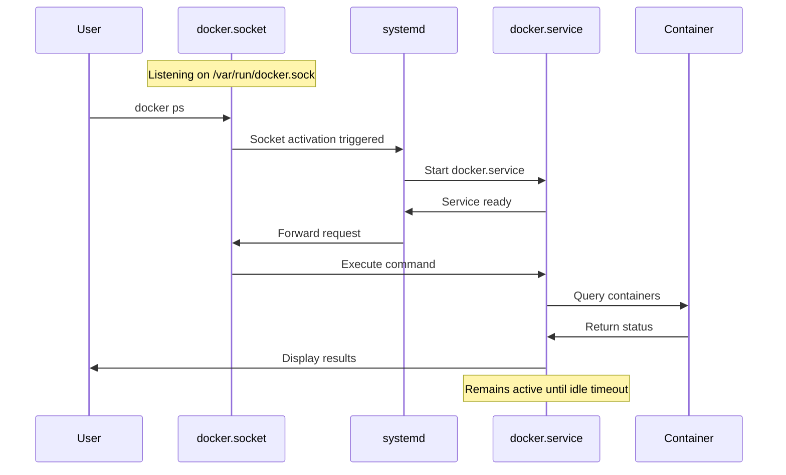
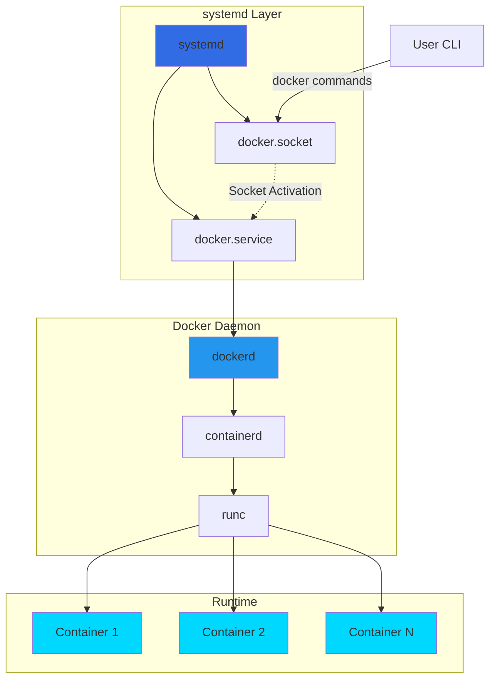
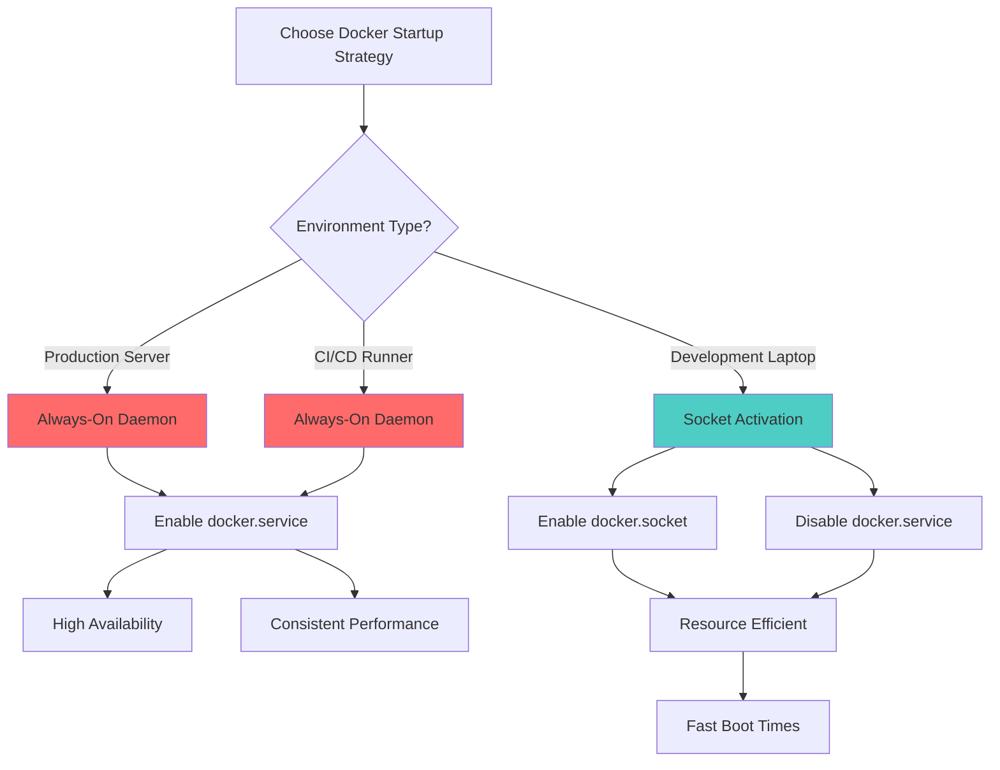
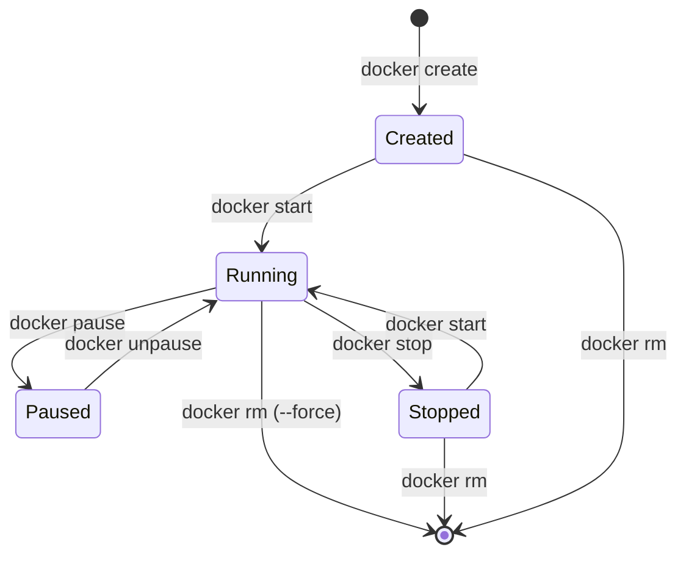
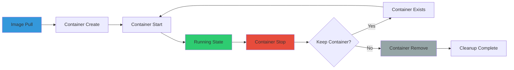
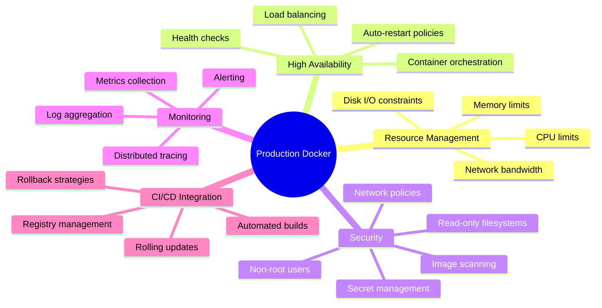

---
title:
  "{ Title }":
tags:
  - DevOps
  - DocKer
created:
  "{ date }":
updated:
  "{ date }":
---
# Docker & systemd - DevOps Interview Reference

```
╔═══════════════════════════════════════════════════════════════╗
║                                                               ║
║   ██████╗  ██████╗  ██████╗██╗  ██╗███████╗██████╗          ║
║   ██╔══██╗██╔═══██╗██╔════╝██║ ██╔╝██╔════╝██╔══██╗         ║
║   ██║  ██║██║   ██║██║     █████╔╝ █████╗  ██████╔╝         ║
║   ██║  ██║██║   ██║██║     ██╔═██╗ ██╔══╝  ██╔══██╗         ║
║   ██████╔╝╚██████╔╝╚██████╗██║  ██╗███████╗██║  ██║         ║
║   ╚═════╝  ╚═════╝  ╚═════╝╚═╝  ╚═╝╚══════╝╚═╝  ╚═╝         ║
║                                                               ║
║            + systemd Integration Guide                       ║
║                                                               ║
╚═══════════════════════════════════════════════════════════════╝
```

---

## Table of Contents

1. [Docker + systemd Architecture](https://claude.ai/chat/ccc747c5-c7ba-45c1-8ef0-6f9e4b64f666#docker--systemd-architecture)
2. [systemd Unit Management](https://claude.ai/chat/ccc747c5-c7ba-45c1-8ef0-6f9e4b64f666#systemd-unit-management)
3. [Docker Commands Reference](https://claude.ai/chat/ccc747c5-c7ba-45c1-8ef0-6f9e4b64f666#docker-commands-reference)
4. [Dockerfile Best Practices](https://claude.ai/chat/ccc747c5-c7ba-45c1-8ef0-6f9e4b64f666#dockerfile-best-practices)
5. [Interview Key Points](https://claude.ai/chat/ccc747c5-c7ba-45c1-8ef0-6f9e4b64f666#interview-key-points)

---

## Docker + systemd Architecture

### System Components Overview

```markmap
# Docker systemd Integration
## systemd Units
### docker.service
- Docker daemon (dockerd)
- Full service runtime
- Resource-intensive
### docker.socket
- Socket activation listener
- Monitors /var/run/docker.sock
- Auto-starts docker.service
- Lightweight alternative
## Boot Strategies
### Production
- Enable docker.service
- Always-on daemon
- Immediate availability
### Development
- Enable docker.socket only
- On-demand activation
- Resource efficient
## Benefits
### Performance
- Reduced memory footprint
- Lower CPU usage at idle
- Faster boot times
### Operational
- Transparent to users
- Same CLI experience
- systemd managed lifecycle
```

### Service Activation Flow



### Architecture Diagram



---

## systemd Unit Management

### Unit Types Explained

**docker.service**

- Full Docker daemon process (dockerd)
- Manages container lifecycle
- Resource overhead: moderate to high
- Use case: Production environments, continuous workloads

**docker.socket**

- Socket-based activation mechanism
- Listens on `/var/run/docker.sock`
- Automatically triggers docker.service when needed
- Resource overhead: minimal
- Use case: Development machines, intermittent Docker usage

### Common systemd Commands

```bash
# Service Status Inspection
sudo systemctl status docker
sudo systemctl status docker.socket

# Daemon Control
sudo systemctl start docker
sudo systemctl stop docker
sudo systemctl restart docker

# Socket Control
sudo systemctl start docker.socket
sudo systemctl stop docker.socket
sudo systemctl restart docker.socket

# Boot Configuration
sudo systemctl enable docker          # Auto-start daemon at boot
sudo systemctl disable docker         # Prevent auto-start at boot
sudo systemctl enable docker.socket   # Enable socket activation
sudo systemctl disable docker.socket  # Disable socket activation

# Detailed Status
sudo systemctl is-active docker
sudo systemctl is-enabled docker
```

### Recommended Development Setup

```bash
# Step 1: Enable socket-based activation
sudo systemctl enable docker.socket
sudo systemctl start docker.socket

# Step 2: Disable always-on daemon (optional optimization)
sudo systemctl disable docker
sudo systemctl stop docker
```

**Benefits of Socket Activation:**

- On-demand startup: Daemon runs only when Docker commands are executed
- Reduced resource consumption: Lower RAM and CPU usage during idle periods
- Transparent user experience: No changes to Docker CLI workflow
- systemd handles process lifecycle automatically

### Configuration Decision Matrix



---

## Docker Commands Reference

### Build Commands

```ascii
┌─────────────────────────────────────────────────────────┐
│                    DOCKER BUILD                         │
├─────────────────────────────────────────────────────────┤
│  Purpose: Create Docker images from Dockerfile         │
└─────────────────────────────────────────────────────────┘
```

```bash
# Basic image build
docker build -t my-image .

# Specify custom Dockerfile
docker build -t my-image -f Dockerfile.dev .

# Build without cache (force rebuild)
docker build --no-cache -t my-image .

# Pass build arguments
docker build -t my-image --build-arg NODE_ENV=production .

# Multi-architecture build (buildx)
docker buildx build -t my-image --platform linux/amd64,linux/arm64 .

# Build with specific target stage
docker build -t my-image --target production .

# Build with labels
docker build -t my-image --label version=1.0.0 .
```

**Key Flags:**

- `-t, --tag`: Name and optionally tag the image (format: name:tag)
- `-f, --file`: Specify Dockerfile location
- `--no-cache`: Do not use cache when building
- `--build-arg`: Set build-time variables
- `--platform`: Target platform for multi-arch builds

### Run Commands

```ascii
┌─────────────────────────────────────────────────────────┐
│                    DOCKER RUN                           │
├─────────────────────────────────────────────────────────┤
│  Purpose: Create and start a new container             │
└─────────────────────────────────────────────────────────┘
```

```bash
# Foreground execution (view logs)
docker run my-image

# Detached mode (background)
docker run -d my-image

# Port mapping (host:container)
docker run -d -p 3000:3000 my-image

# Named container
docker run -d -p 3000:3000 --name my-container my-image

# Volume mounting (persistent storage)
docker run -d -p 3000:3000 -v ./data:/app/data my-image

# Auto-remove after exit
docker run --rm my-image

# Interactive terminal
docker run -it my-image /bin/bash

# Environment variables
docker run -d -e DATABASE_URL=postgres://... my-image

# Resource limits
docker run -d --memory="512m" --cpus="1.0" my-image

# Network configuration
docker run -d --network my-network my-image
```

**Key Flags:**

- `-d, --detach`: Run container in background
- `-p, --publish`: Publish container port to host (HOST:CONTAINER)
- `--name`: Assign a name to the container
- `-v, --volume`: Mount host directory or volume
- `--rm`: Automatically remove container when it exits
- `-it`: Interactive terminal (combines -i and -t)
- `-e, --env`: Set environment variables

### Container Lifecycle Management



```bash
# List containers
docker ps                    # Running containers only
docker ps -a                 # All containers (including stopped)
docker ps -q                 # Container IDs only
docker ps -a --format "table {{.Names}}\t{{.Status}}"  # Custom format

# Start/stop individual containers
docker start my-container
docker stop my-container
docker restart my-container
docker kill my-container     # Force stop (SIGKILL)

# Bulk operations
docker stop $(docker ps -q)              # Stop all running containers
docker start $(docker ps -aq)            # Start all stopped containers
docker rm $(docker ps -aq)               # Remove all containers
docker rm $(docker ps -aq -f status=exited)  # Remove exited containers only

# Container inspection
docker inspect my-container
docker logs my-container
docker logs -f my-container  # Follow log output
docker stats my-container    # Resource usage statistics
docker top my-container      # Running processes in container

# Execute commands in running container
docker exec -it my-container /bin/bash
docker exec my-container ls /app
```

### Image Management

```bash
# List images
docker images
docker images -a             # Include intermediate images
docker images -q             # Image IDs only

# Remove images
docker rmi my-image
docker rmi $(docker images -q)  # Remove all images
docker image prune           # Remove dangling images
docker image prune -a        # Remove all unused images

# Image inspection
docker inspect my-image
docker history my-image      # Layer history

# Tag and push
docker tag my-image registry.example.com/my-image:v1.0
docker push registry.example.com/my-image:v1.0

# Pull images
docker pull nginx:latest
docker pull --platform linux/amd64 nginx:latest
```

### Network and Volume Operations

```bash
# Network management
docker network ls
docker network create my-network
docker network inspect my-network
docker network rm my-network
docker network prune         # Remove unused networks

# Volume management
docker volume ls
docker volume create my-volume
docker volume inspect my-volume
docker volume rm my-volume
docker volume prune          # Remove unused volumes

# System cleanup
docker system df             # Show disk usage
docker system prune          # Remove all unused data
docker system prune -a       # Remove all unused data including images
```

---

## Dockerfile Best Practices

### Python Application Example

```dockerfile
# Use specific version tags for reproducibility
FROM python:3.11-slim

# Set working directory
WORKDIR /app

# Copy application source code
COPY src/ /app/

# Install dependencies without caching to reduce image size
RUN pip install --no-cache-dir flask

# Define container startup command
CMD ["python", "run.py"]
```

### Java Application Example

```dockerfile
# Use official Eclipse Temurin runtime (production-ready)
FROM eclipse-temurin:17-jdk-alpine

# Set working directory
WORKDIR /app

# Copy source code into container
COPY src/Main.java /app/Main.java

# Compile Java source code
RUN javac Main.java

# Execute compiled application on container start
CMD ["java", "Main"]
```

### Multi-Stage Build Pattern

```dockerfile
# Build stage
FROM maven:3.9-eclipse-temurin-17 AS build
WORKDIR /app
COPY pom.xml .
COPY src ./src
RUN mvn clean package -DskipTests

# Runtime stage
FROM eclipse-temurin:17-jre-alpine
WORKDIR /app
COPY --from=build /app/target/app.jar .
EXPOSE 8080
CMD ["java", "-jar", "app.jar"]
```

### Dockerfile Optimization Checklist

```markmap
# Dockerfile Best Practices
## Base Image Selection
### Use official images
### Prefer Alpine variants
### Pin specific versions
### Use multi-stage builds
## Layer Optimization
### Order commands by change frequency
### Combine RUN commands
### Use .dockerignore
### Leverage build cache
## Security
### Run as non-root user
### Scan for vulnerabilities
### Minimize installed packages
### Update base images regularly
## Size Reduction
### Use --no-cache-dir for pip
### Remove build dependencies
### Use .dockerignore
### Clean package manager cache
```

---

## Interview Key Points

### Technical Concepts to Master

```ascii
╔════════════════════════════════════════════════════════════╗
║              INTERVIEW PREPARATION CHECKLIST               ║
╠════════════════════════════════════════════════════════════╣
║  [ ] Docker architecture (daemon, containerd, runc)       ║
║  [ ] Container vs VM differences                          ║
║  [ ] systemd integration and socket activation           ║
║  [ ] Image layers and caching mechanism                   ║
║  [ ] Networking modes (bridge, host, overlay)             ║
║  [ ] Volume types (bind mounts, named volumes)            ║
║  [ ] Multi-stage builds                                   ║
║  [ ] Security best practices                              ║
║  [ ] Docker Compose orchestration                         ║
║  [ ] Registry operations                                  ║
╚════════════════════════════════════════════════════════════╝
```

### Container Lifecycle Deep Dive



### Common Interview Questions

**Q: Explain the difference between docker.service and docker.socket.**

A: docker.service is the full Docker daemon process that manages containers, while docker.socket is a systemd socket unit that listens on /var/run/docker.sock. The socket provides on-demand activation: when a Docker command is executed, systemd automatically starts docker.service. This approach reduces resource consumption on development machines while maintaining full functionality.

**Q: How do you optimize Docker image size?**

A: Key strategies include:

- Use Alpine-based images
- Implement multi-stage builds
- Combine RUN commands to reduce layers
- Use .dockerignore to exclude unnecessary files
- Remove package manager caches
- Run as non-root user for security
- Leverage build cache effectively

**Q: Explain Docker networking modes.**

A:

- **Bridge**: Default mode, isolated network with NAT
- **Host**: Container shares host network stack
- **Overlay**: Multi-host networking for Swarm
- **Macvlan**: Assigns MAC address to container
- **None**: Disables networking

**Q: What is the difference between CMD and ENTRYPOINT?**

A: CMD provides default arguments that can be overridden at runtime, while ENTRYPOINT defines the executable that cannot be easily overridden. Best practice: use ENTRYPOINT for the main command and CMD for default arguments.

### Production Deployment Considerations



### Performance Optimization

```bash
# View resource usage
docker stats

# Set resource limits
docker run -d \
  --memory="512m" \
  --memory-swap="1g" \
  --cpus="1.5" \
  --cpu-shares=1024 \
  my-image

# Disk usage analysis
docker system df -v

# Clean up unused resources
docker system prune -a --volumes
```

---

## Quick Reference

### Command Cheat Sheet

|Task|Command|
|---|---|
|Build image|`docker build -t name .`|
|Run detached|`docker run -d name`|
|View logs|`docker logs -f container`|
|Execute shell|`docker exec -it container /bin/bash`|
|Stop all|`docker stop $(docker ps -q)`|
|Remove all|`docker rm $(docker ps -aq)`|
|Prune system|`docker system prune -a`|
|Inspect|`docker inspect container`|

### systemd Quick Commands

|Task|Command|
|---|---|
|Check status|`systemctl status docker`|
|Enable socket|`systemctl enable docker.socket`|
|Start daemon|`systemctl start docker`|
|View logs|`journalctl -u docker.service`|
|Reload daemon|`systemctl daemon-reload`|

---


