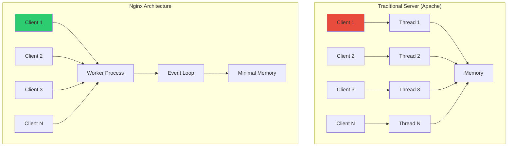
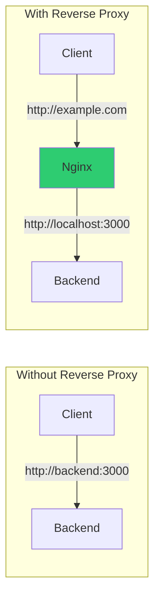
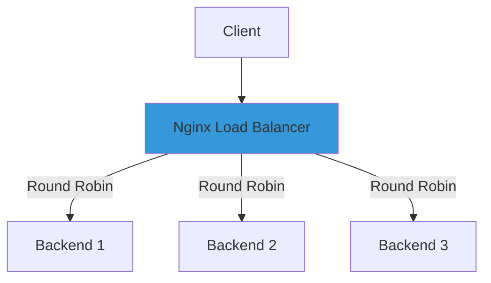
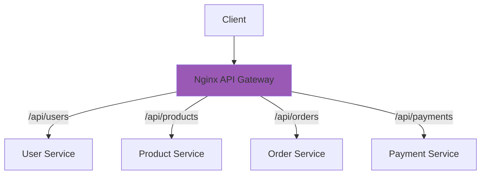
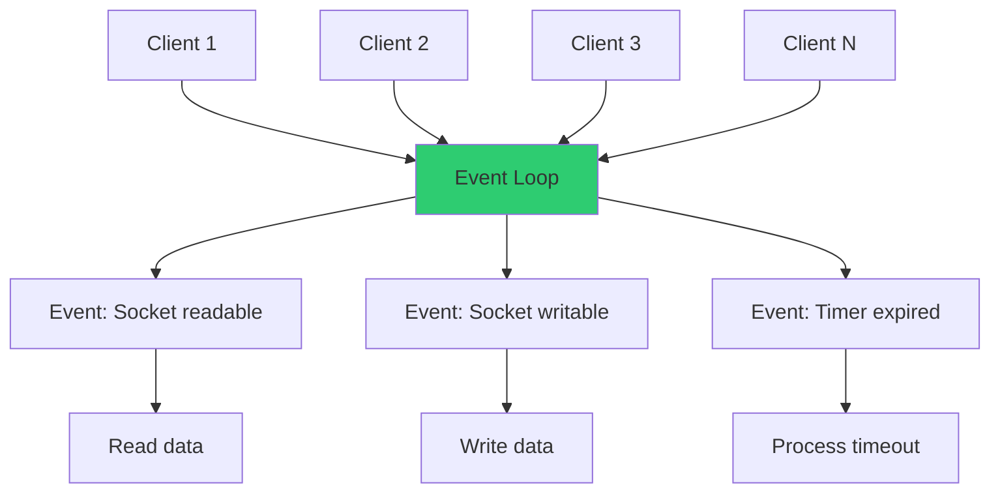

---
title:
  "{ Title }":
tags:
  - DevOps
  - Internet
created:
  "{ date }":
updated:
  "{ date }":
---

---

## Table of Contents

1. [Nginx Fundamentals](https://claude.ai/chat/607261bc-c435-4531-ba14-e695a595220c#nginx-fundamentals)
2. [Installation](https://claude.ai/chat/607261bc-c435-4531-ba14-e695a595220c#installation)
3. [Static Content Serving](https://claude.ai/chat/607261bc-c435-4531-ba14-e695a595220c#static-content-serving)
4. [Reverse Proxy](https://claude.ai/chat/607261bc-c435-4531-ba14-e695a595220c#reverse-proxy)
5. [Load Balancing](https://claude.ai/chat/607261bc-c435-4531-ba14-e695a595220c#load-balancing)
6. [SSL/TLS Configuration](https://claude.ai/chat/607261bc-c435-4531-ba14-e695a595220c#ssltls-configuration)
7. [HTTP Caching](https://claude.ai/chat/607261bc-c435-4531-ba14-e695a595220c#http-caching)
8. [API Gateway Pattern](https://claude.ai/chat/607261bc-c435-4531-ba14-e695a595220c#api-gateway-pattern)
9. [High Concurrency (C10K)](https://claude.ai/chat/607261bc-c435-4531-ba14-e695a595220c#high-concurrency-c10k)
10. [Production Configuration](https://claude.ai/chat/607261bc-c435-4531-ba14-e695a595220c#production-configuration)

---

## Nginx Fundamentals

### What is Nginx

Nginx (pronounced "engine-x") is a high-performance web server, reverse proxy, load balancer, and HTTP cache.

**Created:** 2004 by Igor Sysoev  
**Purpose:** Solve the C10K problem (handling 10,000+ concurrent connections)  
**Architecture:** Event-driven, asynchronous, non-blocking

### Core Architecture



### Process Model

```
┌──────────────────────────────────────────────────────┐
│                  Nginx Process Model                 │
├──────────────────────────────────────────────────────┤
│                                                      │
│  Master Process (PID 1)                              │
│  ├── Reads configuration                             │
│  ├── Manages worker processes                        │
│  ├── Handles signals (reload, restart)               │
│  └── Binds to privileged ports (80, 443)             │
│                                                      │
│  Worker Process 1                                    │
│  ├── Handles client connections                      │
│  ├── Event-driven loop                               │
│  └── Non-blocking I/O                                │
│                                                      │
│  Worker Process 2                                    │
│  Worker Process 3                                    │
│  Worker Process N (typically = CPU cores)            │
│                                                      │
│  Cache Manager Process                               │
│  └── Manages on-disk cache                           │
│                                                      │
│  Cache Loader Process                                │
│  └── Loads cache metadata at startup                 │
│                                                      │
└──────────────────────────────────────────────────────┘
```

### Why Nginx Exists

**Problem with traditional servers:**

```
Apache (Thread-per-connection model)
━━━━━━━━━━━━━━━━━━━━━━━━━━━━━━━━━━━━
Client 1 → Thread 1 (8 MB RAM)
Client 2 → Thread 2 (8 MB RAM)
...
Client 1000 → Thread 1000 (8 GB RAM)

Result: Memory exhaustion, context switching overhead
```

**Nginx solution:**

```
Nginx (Event-driven model)
━━━━━━━━━━━━━━━━━━━━━━━━━━━━━━━━━━━━
Client 1 ┐
Client 2 ├─→ Worker Process (Event Loop)
Client 3 │   └── Minimal memory overhead
...      │
Client 10000 ┘

Result: Low memory, high concurrency
```

### Nginx Capabilities

|Capability|Description|Use Case|
|---|---|---|
|Web Server|Serve static files|HTML, CSS, JS, images|
|Reverse Proxy|Forward requests to backends|Hide backend servers|
|Load Balancer|Distribute traffic|Scale applications|
|HTTP Cache|Cache responses|Reduce backend load|
|SSL/TLS Termination|Handle encryption|Offload SSL from backend|
|API Gateway|Route API requests|Microservices|
|WebSocket Proxy|Proxy WebSocket connections|Real-time apps|
|HTTP/2 Support|Modern protocol|Performance|

---

## Installation

### Installation Without Docker

#### Ubuntu / Debian

```bash
# Update package index
sudo apt update

# Install Nginx
sudo apt install nginx

# Start Nginx
sudo systemctl start nginx

# Enable on boot
sudo systemctl enable nginx

# Check status
sudo systemctl status nginx

# Verify installation
nginx -v
# Output: nginx version: nginx/1.18.0

# Test configuration
sudo nginx -t

# Reload configuration
sudo systemctl reload nginx
```

#### CentOS / RHEL / Fedora

```bash
# Install Nginx
sudo dnf install nginx

# Start and enable
sudo systemctl start nginx
sudo systemctl enable nginx

# Configure firewall
sudo firewall-cmd --permanent --add-service=http
sudo firewall-cmd --permanent --add-service=https
sudo firewall-cmd --reload
```

#### Arch Linux

```bash
# Install Nginx
sudo pacman -S nginx

# Start and enable
sudo systemctl start nginx
sudo systemctl enable nginx
```

#### From Source (Latest Version)

```bash
# Install dependencies
sudo apt install build-essential libpcre3 libpcre3-dev zlib1g zlib1g-dev libssl-dev

# Download latest
wget http://nginx.org/download/nginx-1.25.3.tar.gz
tar -xzf nginx-1.25.3.tar.gz
cd nginx-1.25.3

# Configure
./configure \
  --prefix=/etc/nginx \
  --sbin-path=/usr/sbin/nginx \
  --conf-path=/etc/nginx/nginx.conf \
  --with-http_ssl_module \
  --with-http_v2_module \
  --with-http_realip_module \
  --with-http_gzip_static_module

# Compile and install
make
sudo make install

# Verify
nginx -V
```

### Installation With Docker

#### Using Official Image

```bash
# Pull image
docker pull nginx:alpine

# Run container
docker run -d \
  --name nginx \
  -p 80:80 \
  nginx:alpine

# Verify
curl http://localhost
```

#### Custom Dockerfile

```dockerfile
FROM nginx:alpine

# Copy custom configuration
COPY nginx.conf /etc/nginx/nginx.conf

# Copy static content
COPY html/ /usr/share/nginx/html/

# Expose port
EXPOSE 80

# Health check
HEALTHCHECK --interval=30s --timeout=3s \
  CMD wget --quiet --tries=1 --spider http://localhost/ || exit 1
```

#### Docker Compose Setup

```yaml
version: "3.9"

services:
  nginx:
    image: nginx:alpine
    container_name: nginx
    restart: unless-stopped
    ports:
      - "80:80"
      - "443:443"
    volumes:
      - ./nginx.conf:/etc/nginx/nginx.conf:ro
      - ./html:/usr/share/nginx/html:ro
      - ./ssl:/etc/nginx/ssl:ro
    networks:
      - frontend

networks:
  frontend:
    driver: bridge
```

### File Locations

**Standard installation paths:**

|File/Directory|Purpose|
|---|---|
|`/etc/nginx/nginx.conf`|Main configuration|
|`/etc/nginx/conf.d/`|Additional configs|
|`/etc/nginx/sites-available/`|Available sites (Debian)|
|`/etc/nginx/sites-enabled/`|Enabled sites (Debian)|
|`/usr/share/nginx/html/`|Default web root|
|`/var/log/nginx/access.log`|Access logs|
|`/var/log/nginx/error.log`|Error logs|

---

## Static Content Serving

### Why Only Static Content

**What Nginx does:**

```
┌──────────────────────────────────────────────────────┐
│              Static Content Serving                  │
├──────────────────────────────────────────────────────┤
│                                                      │
│  Request: GET /index.html                            │
│           ↓                                          │
│  Nginx:   Read file from disk                        │
│           ↓                                          │
│  Response: Send file content                         │
│                                                      │
│  Speed: Extremely fast (no processing)               │
│  Memory: Minimal (sendfile syscall)                  │
│  CPU: Almost none                                    │
│                                                      │
└──────────────────────────────────────────────────────┘
```

**What Nginx does NOT do:**

```
┌──────────────────────────────────────────────────────┐
│              Dynamic Content Processing              │
├──────────────────────────────────────────────────────┤
│                                                      │
│  Request: GET /api/users                             │
│           ↓                                          │
│  Nginx:   Cannot process                             │
│           Must forward to backend                    │
│           ↓                                          │
│  Backend: PHP, Python, Node.js processes request     │
│           Queries database                           │
│           Generates response                         │
│           ↓                                          │
│  Nginx:   Receives response, sends to client         │
│                                                      │
└──────────────────────────────────────────────────────┘
```

**Comparison:**

|Feature|Static (Nginx)|Dynamic (Backend)|
|---|---|---|
|Processing|None|Business logic|
|Database|No|Yes|
|Response time|< 1ms|10-1000ms|
|Scalability|Very high|Limited|
|Examples|HTML, CSS, JS, images|API, database queries|

### Basic Static Server Configuration

**nginx.conf:**

```nginx
worker_processes auto;

events {
    worker_connections 1024;
}

http {
    include       mime.types;
    default_type  application/octet-stream;

    sendfile        on;
    tcp_nopush      on;
    tcp_nodelay     on;
    keepalive_timeout  65;

    server {
        listen 80;
        server_name localhost;
        root /usr/share/nginx/html;
        index index.html;

        location / {
            try_files $uri $uri/ =404;
        }
    }
}
```

**Directory structure:**

```
/usr/share/nginx/html/
├── index.html
├── about.html
├── css/
│   └── style.css
├── js/
│   └── app.js
└── images/
    └── logo.png
```

### Advanced Static Configuration

```nginx
http {
    # MIME types
    include mime.types;
    default_type application/octet-stream;

    # Performance
    sendfile on;
    tcp_nopush on;
    tcp_nodelay on;
    
    # Compression
    gzip on;
    gzip_vary on;
    gzip_min_length 1024;
    gzip_types text/css text/javascript application/javascript;

    server {
        listen 80;
        server_name example.com;
        root /var/www/html;
        index index.html;

        # Cache static assets
        location ~* \.(jpg|jpeg|png|gif|ico|css|js)$ {
            expires 30d;
            add_header Cache-Control "public, immutable";
        }

        # Security headers
        add_header X-Frame-Options "SAMEORIGIN" always;
        add_header X-Content-Type-Options "nosniff" always;
        add_header X-XSS-Protection "1; mode=block" always;

        # SPA fallback
        location / {
            try_files $uri $uri/ /index.html;
        }
    }
}
```

---

## Reverse Proxy

### What is a Reverse Proxy



**Benefits:**

```
┌──────────────────────────────────────────────────────┐
│           Reverse Proxy Benefits                     │
├──────────────────────────────────────────────────────┤
│                                                      │
│  1. Hide backend servers                             │
│     Client only knows: example.com                   │
│     Backend can be: localhost:3000                   │
│                                                      │
│  2. SSL/TLS termination                              │
│     Nginx handles HTTPS                              │
│     Backend uses HTTP (no SSL overhead)              │
│                                                      │
│  3. Load distribution                                │
│     Nginx routes to multiple backends                │
│                                                      │
│  4. Static + Dynamic separation                      │
│     /static → Nginx serves directly                  │
│     /api → Proxied to backend                        │
│                                                      │
│  5. Security layer                                   │
│     Rate limiting, DDoS protection                   │
│                                                      │
└──────────────────────────────────────────────────────┘
```

### Basic Reverse Proxy Configuration

```nginx
http {
    upstream backend {
        server localhost:3000;
    }

    server {
        listen 80;
        server_name example.com;

        location / {
            proxy_pass http://backend;
            proxy_set_header Host $host;
            proxy_set_header X-Real-IP $remote_addr;
            proxy_set_header X-Forwarded-For $proxy_add_x_forwarded_for;
            proxy_set_header X-Forwarded-Proto $scheme;
        }
    }
}
```

### Static + Dynamic Separation

```nginx
server {
    listen 80;
    server_name example.com;

    # Serve static files directly
    location /static/ {
        alias /var/www/static/;
        expires 30d;
        add_header Cache-Control "public, immutable";
    }

    # Proxy API requests
    location /api/ {
        proxy_pass http://localhost:3000;
        proxy_set_header Host $host;
        proxy_set_header X-Real-IP $remote_addr;
    }

    # Serve frontend
    location / {
        root /var/www/html;
        try_files $uri /index.html;
    }
}
```

### Proxy Headers Explained

|Header|Purpose|Example|
|---|---|---|
|`Host`|Original host|`example.com`|
|`X-Real-IP`|Client IP|`192.168.1.100`|
|`X-Forwarded-For`|Proxy chain IPs|`192.168.1.100, 10.0.0.1`|
|`X-Forwarded-Proto`|Original protocol|`https`|
|`X-Forwarded-Host`|Original hostname|`example.com`|

### Complete Proxy Example

```nginx
upstream backend_api {
    server 127.0.0.1:3000;
}

server {
    listen 80;
    server_name example.com;

    # Logging
    access_log /var/log/nginx/example.access.log;
    error_log /var/log/nginx/example.error.log;

    # Static files
    location /static {
        alias /var/www/static;
        expires 7d;
    }

    # API proxy
    location /api {
        proxy_pass http://backend_api;
        
        # Proxy headers
        proxy_set_header Host $host;
        proxy_set_header X-Real-IP $remote_addr;
        proxy_set_header X-Forwarded-For $proxy_add_x_forwarded_for;
        proxy_set_header X-Forwarded-Proto $scheme;
        
        # Timeouts
        proxy_connect_timeout 60s;
        proxy_send_timeout 60s;
        proxy_read_timeout 60s;
        
        # Buffering
        proxy_buffering on;
        proxy_buffer_size 4k;
        proxy_buffers 8 4k;
    }

    # Frontend
    location / {
        root /var/www/html;
        index index.html;
        try_files $uri $uri/ /index.html;
    }
}
```

---

## Load Balancing

### Load Balancing Strategies



**Available algorithms:**

|Algorithm|Description|Use Case|
|---|---|---|
|Round Robin|Sequential distribution|Default, balanced servers|
|Least Connections|Send to server with fewest connections|Variable request times|
|IP Hash|Same client → same server|Session persistence|
|Weighted|More requests to powerful servers|Heterogeneous servers|

### Round Robin (Default)

```nginx
upstream backend {
    server backend1.example.com;
    server backend2.example.com;
    server backend3.example.com;
}

server {
    listen 80;
    location / {
        proxy_pass http://backend;
    }
}
```

**Request distribution:**

```
Request 1 → backend1
Request 2 → backend2
Request 3 → backend3
Request 4 → backend1 (cycle repeats)
```

### Weighted Round Robin

```nginx
upstream backend {
    server backend1.example.com weight=3;
    server backend2.example.com weight=2;
    server backend3.example.com weight=1;
}
```

**Request distribution:**

```
Out of 6 requests:
- backend1 receives 3 (50%)
- backend2 receives 2 (33%)
- backend3 receives 1 (17%)
```

### Least Connections

```nginx
upstream backend {
    least_conn;
    server backend1.example.com;
    server backend2.example.com;
    server backend3.example.com;
}
```

**How it works:**

```
┌──────────────────────────────────────────────────────┐
│         Least Connections Algorithm                  │
├──────────────────────────────────────────────────────┤
│                                                      │
│  Current state:                                      │
│  Backend 1: 5 active connections                     │
│  Backend 2: 8 active connections                     │
│  Backend 3: 3 active connections  ← New request here │
│                                                      │
│  New request sent to backend with fewest connections │
│                                                      │
└──────────────────────────────────────────────────────┘
```

### IP Hash (Session Persistence)

```nginx
upstream backend {
    ip_hash;
    server backend1.example.com;
    server backend2.example.com;
    server backend3.example.com;
}
```

**How it works:**

```
Client IP: 192.168.1.100 → hash(192.168.1.100) → backend2
Same client always routes to backend2
Useful for: Sessions, WebSockets
```

### Health Checks

```nginx
upstream backend {
    server backend1.example.com max_fails=3 fail_timeout=30s;
    server backend2.example.com max_fails=3 fail_timeout=30s;
    server backend3.example.com backup;  # Only used if others fail
}
```

**Parameters:**

|Parameter|Description|Example|
|---|---|---|
|`max_fails`|Failed attempts before marking down|`3`|
|`fail_timeout`|Time to wait before retry|`30s`|
|`backup`|Only use if primary servers fail|-|
|`down`|Permanently mark as unavailable|-|

### Complete Load Balancer Example

```nginx
upstream api_backend {
    least_conn;
    
    server 10.0.0.1:3000 weight=3 max_fails=3 fail_timeout=30s;
    server 10.0.0.2:3000 weight=2 max_fails=3 fail_timeout=30s;
    server 10.0.0.3:3000 weight=1 max_fails=3 fail_timeout=30s;
    server 10.0.0.4:3000 backup;
    
    keepalive 32;  # Connection pool
}

server {
    listen 80;
    server_name api.example.com;

    location / {
        proxy_pass http://api_backend;
        
        # Headers
        proxy_set_header Host $host;
        proxy_set_header X-Real-IP $remote_addr;
        proxy_set_header X-Forwarded-For $proxy_add_x_forwarded_for;
        
        # Connection reuse
        proxy_http_version 1.1;
        proxy_set_header Connection "";
        
        # Timeouts
        proxy_connect_timeout 5s;
        proxy_send_timeout 60s;
        proxy_read_timeout 60s;
    }
}
```

---

## SSL/TLS Configuration

### SSL/TLS Termination


**Why terminate SSL at Nginx:**

```
┌──────────────────────────────────────────────────────┐
│            SSL Termination Benefits                  │
├──────────────────────────────────────────────────────┤
│                                                      │
│  1. Offload encryption from backend                  │
│     Backend doesn't need SSL libraries               │
│     CPU savings                                      │
│                                                      │
│  2. Centralized certificate management               │
│     One place to update certificates                 │
│                                                      │
│  3. Simplified backend configuration                 │
│     Backend uses plain HTTP                          │
│                                                      │
│  4. Performance optimization                         │
│     Nginx optimized for SSL/TLS                      │
│     Hardware acceleration support                    │
│                                                      │
└──────────────────────────────────────────────────────┘
```

### Generate Self-Signed Certificate (Testing)

```bash
# Create directory
sudo mkdir -p /etc/nginx/ssl

# Generate certificate
sudo openssl req -x509 -nodes -days 365 \
  -newkey rsa:2048 \
  -keyout /etc/nginx/ssl/nginx.key \
  -out /etc/nginx/ssl/nginx.crt \
  -subj "/C=US/ST=State/L=City/O=Org/CN=example.com"

# Set permissions
sudo chmod 600 /etc/nginx/ssl/nginx.key
```

### Basic HTTPS Configuration

```nginx
server {
    listen 443 ssl http2;
    server_name example.com;

    # SSL certificate
    ssl_certificate /etc/nginx/ssl/nginx.crt;
    ssl_certificate_key /etc/nginx/ssl/nginx.key;

    # SSL settings
    ssl_protocols TLSv1.2 TLSv1.3;
    ssl_prefer_server_ciphers on;
    ssl_ciphers 'ECDHE-ECDSA-AES128-GCM-SHA256:ECDHE-RSA-AES128-GCM-SHA256';

    root /var/www/html;
    index index.html;
}

# Redirect HTTP to HTTPS
server {
    listen 80;
    server_name example.com;
    return 301 https://$server_name$request_uri;
}
```

### Let's Encrypt (Free SSL)

```bash
# Install Certbot
sudo apt install certbot python3-certbot-nginx

# Obtain certificate
sudo certbot --nginx -d example.com -d www.example.com

# Auto-renewal (cron)
sudo certbot renew --dry-run
```

**Auto-generated configuration:**

```nginx
server {
    listen 443 ssl http2;
    server_name example.com www.example.com;

    ssl_certificate /etc/letsencrypt/live/example.com/fullchain.pem;
    ssl_certificate_key /etc/letsencrypt/live/example.com/privkey.pem;
    
    include /etc/letsencrypt/options-ssl-nginx.conf;
    ssl_dhparam /etc/letsencrypt/ssl-dhparams.pem;

    root /var/www/html;
}

server {
    listen 80;
    server_name example.com www.example.com;
    return 301 https://$server_name$request_uri;
}
```

### Production SSL Configuration

```nginx
server {
    listen 443 ssl http2;
    server_name example.com;

    # Certificates
    ssl_certificate /etc/nginx/ssl/fullchain.pem;
    ssl_certificate_key /etc/nginx/ssl/privkey.pem;
    ssl_trusted_certificate /etc/nginx/ssl/chain.pem;

    # Protocols
    ssl_protocols TLSv1.2 TLSv1.3;
    ssl_prefer_server_ciphers off;

    # Ciphers
    ssl_ciphers 'ECDHE-ECDSA-AES128-GCM-SHA256:ECDHE-RSA-AES128-GCM-SHA256:ECDHE-ECDSA-AES256-GCM-SHA384:ECDHE-RSA-AES256-GCM-SHA384';

    # Session cache
    ssl_session_cache shared:SSL:10m;
    ssl_session_timeout 10m;
    ssl_session_tickets off;

    # OCSP Stapling
    ssl_stapling on;
    ssl_stapling_verify on;
    resolver 8.8.8.8 8.8.4.4 valid=300s;

    # HSTS
    add_header Strict-Transport-Security "max-age=31536000; includeSubDomains" always;

    # Security headers
    add_header X-Frame-Options "SAMEORIGIN" always;
    add_header X-Content-Type-Options "nosniff" always;
    add_header X-XSS-Protection "1; mode=block" always;

    location / {
        root /var/www/html;
        index index.html;
    }
}
```

---

## HTTP Caching

### Cache Architecture


### Why Cache

```
┌──────────────────────────────────────────────────────┐
│              Without Cache                           │
├──────────────────────────────────────────────────────┤
│  Request 1 → Backend (200ms) → Database              │
│  Request 2 → Backend (200ms) → Database              │
│  Request 3 → Backend (200ms) → Database              │
│                                                      │
│  Backend load: High                                  │
│  Database load: High                                 │
│  Response time: 200ms                                │
└──────────────────────────────────────────────────────┘

┌──────────────────────────────────────────────────────┐
│              With Nginx Cache                        │
├──────────────────────────────────────────────────────┤
│  Request 1 → Backend (200ms) → Cache stored          │
│  Request 2 → Nginx cache (1ms)                       │
│  Request 3 → Nginx cache (1ms)                       │
│                                                      │
│  Backend load: Low                                   │
│  Database load: Low                                  │
│  Response time: 1ms                                  │
└──────────────────────────────────────────────────────┘
```

### Basic Caching Configuration

```nginx
http {
    # Cache path
    proxy_cache_path /var/cache/nginx 
                     levels=1:2 
                     keys_zone=my_cache:10m 
                     max_size=1g 
                     inactive=60m 
                     use_temp_path=off;

    server {
        listen 80;

        location / {
            proxy_cache my_cache;
            proxy_cache_valid 200 60m;
            proxy_cache_valid 404 10m;
            
            proxy_cache_use_stale error timeout updating;
            proxy_cache_background_update on;
            proxy_cache_lock on;
            
            add_header X-Cache-Status $upstream_cache_status;
            
            proxy_pass http://backend;
        }
    }
}
```

**Cache directive explanations:**

|Directive|Purpose|Example|
|---|---|---|
|`proxy_cache_path`|Cache storage location|`/var/cache/nginx`|
|`keys_zone`|Memory zone for cache keys|`10m` (10 MB)|
|`max_size`|Maximum cache size|`1g` (1 GB)|
|`inactive`|Remove if not accessed|`60m` (60 minutes)|
|`levels`|Directory structure|`1:2` (subdirectories)|

### Cache Status Header

```
X-Cache-Status values:
────────────────────────
MISS      - Not in cache, fetched from backend
HIT       - Served from cache
EXPIRED   - Cache expired, fetched fresh
STALE     - Serving stale while updating
UPDATING  - Cache being updated
BYPASS    - Cache bypassed
```

### Selective Caching

```nginx
server {
    listen 80;

    # Cache only GET requests
    proxy_cache_methods GET HEAD;

    # Don't cache authenticated requests
    proxy_cache_bypass $http_authorization;

    # Don't cache if query string contains nocache
    proxy_cache_bypass $arg_nocache;

    # Don't cache POST requests
    proxy_no_cache $request_method = POST;

    location /api {
        proxy_cache my_cache;
        proxy_cache_valid 200 5m;
        proxy_cache_key "$scheme$request_method$host$request_uri";
        
        proxy_pass http://backend;
    }
    
    # Don't cache admin pages
    location /admin {
        proxy_no_cache 1;
        proxy_cache_bypass 1;
        proxy_pass http://backend;
    }
}
```

### Cache Purging

```nginx
http {
    proxy_cache_path /var/cache/nginx keys_zone=my_cache:10m;

    map $request_method $purge_method {
        PURGE 1;
        default 0;
    }

    server {
        listen 80;

        location / {
            proxy_cache my_cache;
            proxy_cache_purge $purge_method;
            proxy_pass http://backend;
        }
    }
}
```

**Purge cache:**

```bash
curl -X PURGE http://example.com/api/users
```

---

## API Gateway Pattern

### API Gateway Architecture



### Basic API Gateway Configuration

```nginx
http {
    # Define upstreams
    upstream user_service {
        server 10.0.1.10:3001;
    }

    upstream product_service {
        server 10.0.1.20:3002;
    }

    upstream order_service {
        server 10.0.1.30:3003;
    }

    server {
        listen 80;
        server_name api.example.com;

        # User service
        location /api/users {
            rewrite ^/api/users(.*)$ $1 break;
            proxy_pass http://user_service;
            proxy_set_header Host $host;
        }

        # Product service
        location /api/products {
            rewrite ^/api/products(.*)$ $1 break;
            proxy_pass http://product_service;
            proxy_set_header Host $host;
        }

        # Order service
        location /api/orders {
            rewrite ^/api/orders(.*)$ $1 break;
            proxy_pass http://order_service;
            proxy_set_header Host $host;
        }
    }
}
```

### Rate Limiting

```nginx
http {
    # Define rate limit zones
    limit_req_zone $binary_remote_addr zone=api_limit:10m rate=10r/s;
    limit_req_zone $binary_remote_addr zone=login_limit:10m rate=1r/m;

    server {
        listen 80;

        # General API rate limit
        location /api {
            limit_req zone=api_limit burst=20 nodelay;
            limit_req_status 429;
            
            proxy_pass http://backend;
        }

        # Strict limit for login
        location /api/login {
            limit_req zone=login_limit burst=2;
            
            proxy_pass http://backend;
        }
    }
}
```

**Rate limit explained:**

```
limit_req_zone $binary_remote_addr zone=api_limit:10m rate=10r/s;
               └─────────────────┘  └───────────────┘  └────────┘
                     Key                Zone name         Rate
               (Client IP)          (10MB memory)    (10 req/sec)

limit_req zone=api_limit burst=20 nodelay;
          └────────────┘  └──────┘ └──────┘
           Use this zone   Allow    Process
                          20 burst  immediately
```

### Authentication Forwarding

```nginx
server {
    listen 80;

    location /api {
        # Forward auth header to backend
        proxy_set_header Authorization $http_authorization;
        
        # Or validate at Nginx level
        auth_request /auth;
        
        proxy_pass http://backend;
    }

    # Internal auth endpoint
    location = /auth {
        internal;
        proxy_pass http://auth_service/validate;
        proxy_pass_request_body off;
        proxy_set_header Content-Length "";
    }
}
```

### Complete API Gateway Example

```nginx
http {
    # Upstreams
    upstream user_api {
        least_conn;
        server 10.0.1.10:3001;
        server 10.0.1.11:3001;
    }

    upstream product_api {
        server 10.0.1.20:3002;
    }

    # Rate limiting
    limit_req_zone $binary_remote_addr zone=api:10m rate=100r/s;
    limit_req_zone $binary_remote_addr zone=auth:10m rate=5r/m;

    # Caching
    proxy_cache_path /var/cache/nginx keys_zone=api_cache:10m;

    server {
        listen 80;
        server_name api.example.com;

        # Logging
        access_log /var/log/nginx/api.access.log;
        error_log /var/log/nginx/api.error.log;

        # CORS
        add_header Access-Control-Allow-Origin *;
        add_header Access-Control-Allow-Methods "GET, POST, PUT, DELETE";

        # Authentication endpoint
        location /api/auth {
            limit_req zone=auth burst=3;
            proxy_pass http://user_api/auth;
        }

        # User API
        location /api/users {
            limit_req zone=api burst=20 nodelay;
            
            proxy_cache api_cache;
            proxy_cache_valid 200 5m;
            
            rewrite ^/api/users(.*)$ $1 break;
            proxy_pass http://user_api;
            
            proxy_set_header Host $host;
            proxy_set_header X-Real-IP $remote_addr;
        }

        # Product API
        location /api/products {
            limit_req zone=api burst=20 nodelay;
            
            proxy_cache api_cache;
            proxy_cache_valid 200 10m;
            
            rewrite ^/api/products(.*)$ $1 break;
            proxy_pass http://product_api;
        }

        # Health check
        location /health {
            access_log off;
            return 200 "healthy\n";
            add_header Content-Type text/plain;
        }
    }
}
```

---

## High Concurrency (C10K)

### The C10K Problem

```
┌──────────────────────────────────────────────────────┐
│              C10K Problem (Year 2000)                │
├──────────────────────────────────────────────────────┤
│                                                      │
│  Challenge: Handle 10,000 concurrent connections     │
│                                                      │
│  Traditional approach (Apache):                      │
│  - One thread per connection                         │
│  - 10,000 connections = 10,000 threads               │
│  - Memory: 10,000 × 8MB = 80 GB RAM                  │
│  - Context switching overhead                        │
│  - Result: Server crashes                            │
│                                                      │
│  Nginx solution:                                     │
│  - Event-driven architecture                         │
│  - One worker handles thousands of connections       │
│  - Memory: ~100 MB for 10,000 connections            │
│  - Non-blocking I/O                                  │
│  - Result: Server handles load easily                │
│                                                      │
└──────────────────────────────────────────────────────┘
```

### Event-Driven Architecture



**How it works:**

```
Traditional (Blocking):
Thread 1: read() → WAIT → process → write()
Thread 2: read() → WAIT → process → write()
...
Problem: Threads blocked during I/O

Nginx (Non-blocking):
Worker: 
  → Check socket 1 (ready? read data)
  → Check socket 2 (not ready? skip)
  → Check socket 3 (ready? write data)
  → Loop continues
  
Benefit: Never blocked, always progressing
```

### Configuration for High Concurrency

```nginx
# Main context
user nginx;
worker_processes auto;  # One per CPU core
worker_rlimit_nofile 65535;  # Max file descriptors

events {
    worker_connections 10000;  # Connections per worker
    use epoll;  # Efficient event method (Linux)
    multi_accept on;  # Accept multiple connections at once
}

http {
    # Connection settings
    sendfile on;
    tcp_nopush on;
    tcp_nodelay on;
    
    # Keepalive
    keepalive_timeout 65;
    keepalive_requests 100;
    
    # Buffer sizes
    client_body_buffer_size 128k;
    client_max_body_size 10m;
    client_header_buffer_size 1k;
    large_client_header_buffers 4 4k;
    output_buffers 1 32k;
    postpone_output 1460;
    
    # Timeouts
    client_header_timeout 60;
    client_body_timeout 60;
    send_timeout 60;
    
    # Compression
    gzip on;
    gzip_vary on;
    gzip_proxied any;
    gzip_comp_level 6;
    gzip_types text/plain text/css text/xml text/javascript 
               application/json application/javascript application/xml+rss;

    server {
        listen 80 reuseport;  # Socket sharing across workers
        
        location / {
            root /var/www/html;
        }
    }
}
```

### System-Level Tuning

```bash
# Increase file descriptor limit
echo "fs.file-max = 65535" | sudo tee -a /etc/sysctl.conf

# TCP tuning
echo "net.ipv4.tcp_max_syn_backlog = 4096" | sudo tee -a /etc/sysctl.conf
echo "net.core.somaxconn = 4096" | sudo tee -a /etc/sysctl.conf
echo "net.ipv4.tcp_tw_reuse = 1" | sudo tee -a /etc/sysctl.conf

# Apply changes
sudo sysctl -p

# Nginx user limits
echo "nginx soft nofile 65535" | sudo tee -a /etc/security/limits.conf
echo "nginx hard nofile 65535" | sudo tee -a /etc/security/limits.conf
```

### Performance Benchmarking

```bash
# Install Apache Bench
sudo apt install apache2-utils

# Test 10,000 requests, 1000 concurrent
ab -n 10000 -c 1000 http://localhost/

# Results interpretation:
# Requests per second: Higher is better
# Time per request: Lower is better
# Failed requests: Should be 0

# Advanced testing with wrk
wrk -t4 -c1000 -d30s http://localhost/
# -t4: 4 threads
# -c1000: 1000 connections
# -d30s: 30 second duration
```

### Monitoring High Load

```nginx
server {
    listen 80;
    
    # Status page
    location /nginx_status {
        stub_status on;
        access_log off;
        allow 127.0.0.1;
        deny all;
    }
}
```

**Check status:**

```bash
curl http://localhost/nginx_status

# Output:
# Active connections: 9856
# server accepts handled requests
#  100000 100000 200000
# Reading: 50 Writing: 200 Waiting: 9606
```

---

## Production Configuration

### Complete Production Example

```nginx
# /etc/nginx/nginx.conf

user nginx;
worker_processes auto;
worker_rlimit_nofile 65535;
error_log /var/log/nginx/error.log warn;
pid /var/run/nginx.pid;

events {
    worker_connections 10000;
    use epoll;
    multi_accept on;
}

http {
    include /etc/nginx/mime.types;
    default_type application/octet-stream;

    # Logging
    log_format main '$remote_addr - $remote_user [$time_local] "$request" '
                    '$status $body_bytes_sent "$http_referer" '
                    '"$http_user_agent" "$http_x_forwarded_for"';
    access_log /var/log/nginx/access.log main;

    # Performance
    sendfile on;
    tcp_nopush on;
    tcp_nodelay on;
    keepalive_timeout 65;
    types_hash_max_size 2048;
    server_tokens off;

    # Buffer sizes
    client_body_buffer_size 128k;
    client_max_body_size 10m;
    client_header_buffer_size 1k;
    large_client_header_buffers 4 4k;

    # Compression
    gzip on;
    gzip_vary on;
    gzip_proxied any;
    gzip_comp_level 6;
    gzip_types text/plain text/css text/xml text/javascript
               application/json application/javascript application/xml+rss;

    # Rate limiting
    limit_req_zone $binary_remote_addr zone=general:10m rate=10r/s;
    limit_req_zone $binary_remote_addr zone=api:10m rate=100r/s;

    # Caching
    proxy_cache_path /var/cache/nginx
                     levels=1:2
                     keys_zone=app_cache:10m
                     max_size=1g
                     inactive=60m
                     use_temp_path=off;

    # Upstream backends
    upstream backend_app {
        least_conn;
        server 10.0.1.10:3000 weight=3 max_fails=3 fail_timeout=30s;
        server 10.0.1.11:3000 weight=2 max_fails=3 fail_timeout=30s;
        server 10.0.1.12:3000 backup;
        keepalive 32;
    }

    # SSL configuration
    ssl_protocols TLSv1.2 TLSv1.3;
    ssl_prefer_server_ciphers off;
    ssl_ciphers 'ECDHE-ECDSA-AES128-GCM-SHA256:ECDHE-RSA-AES128-GCM-SHA256';
    ssl_session_cache shared:SSL:10m;
    ssl_session_timeout 10m;
    ssl_stapling on;
    ssl_stapling_verify on;

    # HTTP server (redirect to HTTPS)
    server {
        listen 80;
        listen [::]:80;
        server_name example.com www.example.com;
        return 301 https://$server_name$request_uri;
    }

    # HTTPS server
    server {
        listen 443 ssl http2;
        listen [::]:443 ssl http2;
        server_name example.com www.example.com;

        # SSL certificates
        ssl_certificate /etc/nginx/ssl/fullchain.pem;
        ssl_certificate_key /etc/nginx/ssl/privkey.pem;
        ssl_trusted_certificate /etc/nginx/ssl/chain.pem;

        # Security headers
        add_header Strict-Transport-Security "max-age=31536000; includeSubDomains" always;
        add_header X-Frame-Options "SAMEORIGIN" always;
        add_header X-Content-Type-Options "nosniff" always;
        add_header X-XSS-Protection "1; mode=block" always;
        add_header Referrer-Policy "no-referrer-when-downgrade" always;

        # Logging
        access_log /var/log/nginx/example.access.log;
        error_log /var/log/nginx/example.error.log;

        # Static files
        location /static {
            alias /var/www/static;
            expires 7d;
            add_header Cache-Control "public, immutable";
        }

        # API proxy with caching
        location /api {
            limit_req zone=api burst=20 nodelay;

            proxy_cache app_cache;
            proxy_cache_valid 200 5m;
            proxy_cache_use_stale error timeout updating;
            add_header X-Cache-Status $upstream_cache_status;

            proxy_pass http://backend_app;
            proxy_http_version 1.1;
            proxy_set_header Connection "";
            proxy_set_header Host $host;
            proxy_set_header X-Real-IP $remote_addr;
            proxy_set_header X-Forwarded-For $proxy_add_x_forwarded_for;
            proxy_set_header X-Forwarded-Proto $scheme;

            proxy_connect_timeout 5s;
            proxy_send_timeout 60s;
            proxy_read_timeout 60s;
        }

        # Frontend SPA
        location / {
            root /var/www/html;
            index index.html;
            try_files $uri $uri/ /index.html;
        }

        # Health check
        location /health {
            access_log off;
            return 200 "healthy\n";
            add_header Content-Type text/plain;
        }
    }

    # Include additional configs
    include /etc/nginx/conf.d/*.conf;
}
```

### Docker Compose Production Setup

```yaml
version: "3.9"

services:
  nginx:
    image: nginx:alpine
    container_name: nginx_prod
    restart: always
    ports:
      - "80:80"
      - "443:443"
    volumes:
      - ./nginx.conf:/etc/nginx/nginx.conf:ro
      - ./html:/var/www/html:ro
      - ./ssl:/etc/nginx/ssl:ro
      - nginx_cache:/var/cache/nginx
      - nginx_logs:/var/log/nginx
    networks:
      - frontend
      - backend
    depends_on:
      - backend_app
    healthcheck:
      test: ["CMD", "wget", "--quiet", "--tries=1", "--spider", "http://localhost/health"]
      interval: 30s
      timeout: 3s
      retries: 3
    deploy:
      resources:
        limits:
          cpus: '0.5'
          memory: 512M

  backend_app:
    image: myapp:latest
    container_name: backend
    restart: always
    environment:
      NODE_ENV: production
    networks:
      - backend
    healthcheck:
      test: ["CMD", "curl", "-f", "http://localhost:3000/health"]
      interval: 10s
      timeout: 5s
      retries: 3

networks:
  frontend:
    driver: bridge
  backend:
    driver: bridge
    internal: true

volumes:
  nginx_cache:
  nginx_logs:
```

---

## Quick Reference

### Common Commands

|Command|Description|
|---|---|
|`nginx -t`|Test configuration|
|`nginx -s reload`|Reload configuration|
|`nginx -s stop`|Stop server|
|`nginx -s quit`|Graceful shutdown|
|`nginx -V`|Show version and compile options|
|`systemctl status nginx`|Check service status|
|`systemctl restart nginx`|Restart service|

### Configuration Directives

|Directive|Context|Purpose|
|---|---|---|
|`worker_processes`|main|Number of worker processes|
|`worker_connections`|events|Max connections per worker|
|`sendfile`|http, server|Enable efficient file sending|
|`keepalive_timeout`|http, server|Connection keep-alive time|
|`proxy_pass`|location|Forward requests to backend|
|`proxy_cache`|location|Enable caching|
|`limit_req`|location|Rate limiting|
|`ssl_certificate`|server|SSL certificate path|

### Performance Tuning Checklist

```
[ ] Set worker_processes to auto
[ ] Increase worker_connections (10000+)
[ ] Enable sendfile and tcp_nopush
[ ] Configure gzip compression
[ ] Set appropriate buffer sizes
[ ] Enable keepalive connections
[ ] Configure caching where appropriate
[ ] Set timeout values
[ ] Disable server_tokens
[ ] Monitor with stub_status
```

---

## Summary

### Nginx Core Concepts

**What Nginx is:**

- High-performance web server
- Reverse proxy
- Load balancer
- HTTP cache
- Event-driven architecture

**Why Nginx exists:**

- Solve C10K problem
- Handle high concurrency
- Low memory footprint
- Non-blocking I/O

**Key capabilities:**

- Serve static files (fastest method)
- Proxy dynamic requests to backends
- Distribute load across servers
- Terminate SSL/TLS
- Cache responses
- Act as API gateway

**Production considerations:**

- Use specific version tags
- Enable SSL/TLS
- Configure rate limiting
- Implement caching
- Set resource limits
- Monitor performance
- Regular security updates