---
title:
  "{ Title }":
tags:
  - DevOps
  - DocKer
created:
  "{ date }":
updated:
  "{ date }":
---


```
╔════════════════════════════════════════════════════════════════╗
║                                                                ║
║   ███╗   ██╗███████╗████████╗██╗    ██╗ ██████╗ ██████╗██╗  ██╗  ║
║   ████╗  ██║██╔════╝╚══██╔══╝██║    ██║██╔═══██╗██╔══██╗██║ ██╔╝  ║
║   ██╔██╗ ██║█████╗     ██║   ██║ █╗ ██║██║   ██║██████╔╝█████╔╝   ║
║   ██║╚██╗██║██╔══╝     ██║   ██║███╗██║██║   ██║██╔══██╗██╔═██╗   ║
║   ██║ ╚████║███████╗   ██║   ╚███╔███╔╝╚██████╔╝██║  ██║██║  ██╗  ║
║   ╚═╝  ╚═══╝╚══════╝   ╚═╝    ╚══╝╚══╝  ╚═════╝ ╚═╝  ╚═╝╚═╝  ╚═╝  ║
║                                                                ║
║              Docker Networking Deep Dive                       ║
║                                                                ║
╚════════════════════════════════════════════════════════════════╝
```

---

## Table of Contents

1. [Network Types Overview](https://claude.ai/chat/ccc747c5-c7ba-45c1-8ef0-6f9e4b64f666#network-types-overview)
2. [Bridge Networks](https://claude.ai/chat/ccc747c5-c7ba-45c1-8ef0-6f9e4b64f666#bridge-networks)
3. [Host Network](https://claude.ai/chat/ccc747c5-c7ba-45c1-8ef0-6f9e4b64f666#host-network)
4. [None Network](https://claude.ai/chat/ccc747c5-c7ba-45c1-8ef0-6f9e4b64f666#none-network)
5. [User-Defined Networks](https://claude.ai/chat/ccc747c5-c7ba-45c1-8ef0-6f9e4b64f666#user-defined-networks)
6. [Docker Swarm Networks](https://claude.ai/chat/ccc747c5-c7ba-45c1-8ef0-6f9e4b64f666#docker-swarm-networks)
7. [Bridge vs docker-compose](https://claude.ai/chat/ccc747c5-c7ba-45c1-8ef0-6f9e4b64f666#bridge-vs-docker-compose)
8. [Practical Implementation](https://claude.ai/chat/ccc747c5-c7ba-45c1-8ef0-6f9e4b64f666#practical-implementation)
9. [Interview Preparation](https://claude.ai/chat/ccc747c5-c7ba-45c1-8ef0-6f9e4b64f666#interview-preparation)

---

## Network Types Overview

### Complete Network Type Hierarchy

```markmap
# Docker Network Types
## Standalone Docker
### Bridge (Default)
- Default docker0 interface
- Automatic container connectivity
- NAT for external access
### User-Defined Bridge
- Custom network isolation
- Automatic DNS resolution
- Better control over IP ranges
### Host
- No network isolation
- Container uses host networking
- Best performance
### None
- No networking
- Complete isolation
- Manual configuration required
## Docker Swarm Mode
### Overlay
- Multi-host communication
- Swarm service discovery
- Encrypted data plane option
### Macvlan
- Physical MAC address per container
- Direct L2 network access
- VLAN trunk integration
### Ipvlan (L2 mode)
- Similar to macvlan
- Single MAC address
- Better for MAC address restrictions
### Ipvlan (L3 mode)
- Layer 3 routing
- No broadcast traffic
- Scalable multi-network design
```

### Network Driver Comparison Matrix

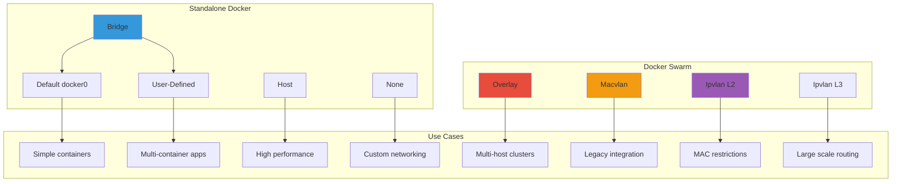

---

## Bridge Networks

### Default Bridge Architecture

```
┌─────────────────────────────────────────────────────────────┐
│                      Host Machine                           │
│                                                             │
│  ┌──────────────────────────────────────────────────────┐  │
│  │              docker0 Bridge                          │  │
│  │              (172.17.0.0/16)                         │  │
│  └──────────────────────────────────────────────────────┘  │
│         │                    │                   │          │
│    ┌────▼─────┐        ┌────▼─────┐       ┌────▼─────┐    │
│    │Container1│        │Container2│       │Container3│    │
│    │172.17.0.2│        │172.17.0.3│       │172.17.0.4│    │
│    └──────────┘        └──────────┘       └──────────┘    │
│                                                             │
│  ┌──────────────────────────────────────────────────────┐  │
│  │              iptables NAT Rules                      │  │
│  │  (Handles port forwarding and external access)      │  │
│  └──────────────────────────────────────────────────────┘  │
│                                                             │
│                    ┌─────────────┐                         │
│                    │  eth0       │                         │
│                    │  (External) │                         │
│                    └─────────────┘                         │
└─────────────────────────────────────────────────────────────┘
```

### Default Bridge Characteristics

**Properties:**

- Network: `172.17.0.0/16` (default)
- Driver: `bridge`
- DNS: No automatic container name resolution
- Isolation: Limited between containers
- Communication: Via IP address or `--link` (deprecated)

**Limitations:**

- No automatic service discovery
- Manual container linking required
- Less secure than user-defined networks
- Legacy approach for production

```bash
# View default bridge
docker network inspect bridge

# Containers use default bridge unless specified
docker run -d nginx
```

### User-Defined Bridge Networks

```
┌─────────────────────────────────────────────────────────────┐
│                      Host Machine                           │
│                                                             │
│  ┌──────────────────────────────────────────────────────┐  │
│  │         Custom Bridge Network (app_net)              │  │
│  │              (172.18.0.0/16)                         │  │
│  │                                                      │  │
│  │    ┌──────────────────────────────────────────┐     │  │
│  │    │    Embedded DNS Server (127.0.0.11)     │     │  │
│  │    │    flask_app → 172.18.0.2               │     │  │
│  │    │    mysql_db  → 172.18.0.3               │     │  │
│  │    └──────────────────────────────────────────┘     │  │
│  └──────────────────────────────────────────────────────┘  │
│         │                              │                   │
│    ┌────▼─────────┐             ┌─────▼──────────┐        │
│    │  flask_app   │────────────▶│   mysql_db     │        │
│    │  172.18.0.2  │  DNS query  │   172.18.0.3   │        │
│    │              │◀────────────│                │        │
│    └──────────────┘   Response  └────────────────┘        │
└─────────────────────────────────────────────────────────────┘
```

**Key Features:**

- Automatic DNS resolution by container name
- Better network isolation
- Custom IP address ranges
- Automatic service discovery
- No deprecated `--link` required

```bash
# Create user-defined bridge
docker network create app_net

# Specify custom subnet
docker network create --subnet=192.168.1.0/24 custom_net

# Run containers on custom network
docker run -d --name mysql_db --network app_net mysql
docker run -d --name flask_app --network app_net flask-image
```

### Bridge Network Communication Flow

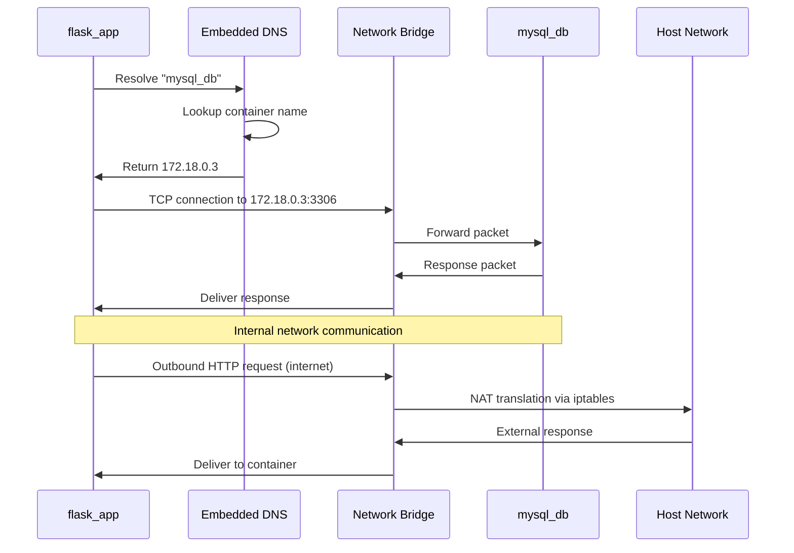

---

## Host Network

### Architecture

```
┌─────────────────────────────────────────────────────────────┐
│                      Host Machine                           │
│                                                             │
│               ┌─────────────────────┐                       │
│               │   eth0 (Host NIC)   │                       │
│               │   192.168.1.100     │                       │
│               └─────────────────────┘                       │
│                         │                                   │
│                         │ (Shared)                          │
│                         │                                   │
│               ┌─────────▼─────────┐                         │
│               │     Container     │                         │
│               │  (Host Network)   │                         │
│               │                   │                         │
│               │ No network        │                         │
│               │ namespace         │                         │
│               │ isolation         │                         │
│               └───────────────────┘                         │
│                                                             │
│  Container sees ALL host network interfaces                │
└─────────────────────────────────────────────────────────────┘
```

### Characteristics

**Properties:**

- Zero network isolation
- Container shares host network stack
- No port mapping needed
- Best network performance
- Container binds directly to host ports

**Use Cases:**

- High-performance networking requirements
- Network monitoring tools
- Load balancers requiring host network access
- Legacy applications expecting specific network setup

**Security Considerations:**

- Reduced isolation increases attack surface
- Container can access all host network interfaces
- Not recommended for untrusted containers
- Potential port conflicts with host services

```bash
# Run container with host network
docker run --network host nginx

# Container binds to host port directly
# No -p flag needed or allowed
docker run --network host my-app

# Verify network mode
docker inspect container_name | grep NetworkMode
```

**Key Limitation:**

- Port conflicts: Multiple containers cannot use same port
- Security risk: Full network access to host

---

## None Network

### Architecture

```
┌─────────────────────────────────────────────────────────────┐
│                      Host Machine                           │
│                                                             │
│               ┌─────────────────────┐                       │
│               │     Container       │                       │
│               │   (None Network)    │                       │
│               │                     │                       │
│               │  ┌───────────────┐  │                       │
│               │  │   Loopback    │  │                       │
│               │  │   127.0.0.1   │  │                       │
│               │  │   ONLY        │  │                       │
│               │  └───────────────┘  │                       │
│               │                     │                       │
│               │  No external        │                       │
│               │  network access     │                       │
│               └─────────────────────┘                       │
│                                                             │
│  Complete network isolation - Manual config required       │
└─────────────────────────────────────────────────────────────┘
```

### Characteristics

**Properties:**

- No network interfaces except loopback
- Complete network isolation
- Maximum security for non-networked workloads
- Manual network configuration possible

**Use Cases:**

- Security-sensitive batch processing
- Data processing without network access
- Testing network-free applications
- Custom network stack implementation

```bash
# Run container with no network
docker run --network none alpine

# Verify no network interfaces (except lo)
docker run --network none alpine ip addr show

# Output shows only loopback:
# 1: lo: <LOOPBACK,UP,LOWER_UP>
```

---

## User-Defined Networks

### Network Management Commands

```bash
# Create network with custom subnet
docker network create \
  --driver bridge \
  --subnet 192.168.100.0/24 \
  --gateway 192.168.100.1 \
  --ip-range 192.168.100.128/25 \
  custom_network

# Create with IPv6 support
docker network create \
  --ipv6 \
  --subnet fd00:dead:beef::/48 \
  ipv6_network

# List all networks
docker network ls

# Inspect network details
docker network inspect custom_network

# Remove network
docker network rm custom_network

# Prune unused networks
docker network prune
```

### Advanced Network Features

```bash
# Connect running container to network
docker network connect app_net existing_container

# Disconnect from network
docker network disconnect app_net existing_container

# Assign static IP to container
docker run -d \
  --network custom_network \
  --ip 192.168.100.50 \
  --name web nginx

# Connect container to multiple networks
docker network connect frontend_net web_container
docker network connect backend_net web_container
```

### Multi-Network Container Architecture

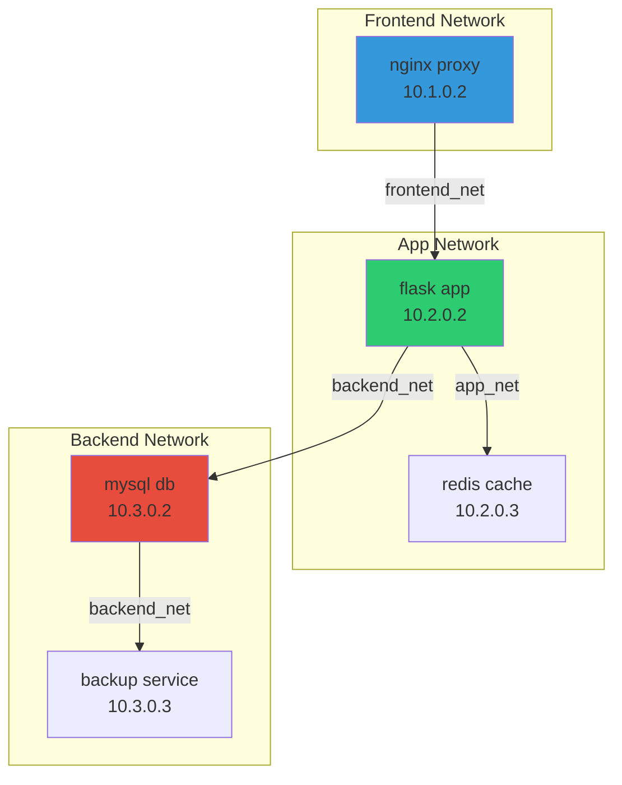

---

## Docker Swarm Networks

### Overlay Network

```
┌─────────────────────────────────────────────────────────────┐
│                  Docker Swarm Cluster                       │
│                                                             │
│  ┌────────────────────┐         ┌────────────────────┐     │
│  │   Manager Node 1   │◀───────▶│   Manager Node 2   │     │
│  │   192.168.1.10     │  Raft   │   192.168.1.11     │     │
│  └────────────────────┘         └────────────────────┘     │
│           │                              │                  │
│           │         Overlay Network      │                  │
│           │      (10.0.0.0/24 VXLAN)     │                  │
│           │                              │                  │
│  ┌────────▼────────┐           ┌────────▼────────┐         │
│  │  Worker Node 1  │◀─────────▶│  Worker Node 2  │         │
│  │  192.168.1.20   │  Gossip   │  192.168.1.21   │         │
│  │                 │           │                 │         │
│  │  ┌──────────┐   │           │   ┌──────────┐ │         │
│  │  │Service A │   │           │   │Service A │ │         │
│  │  │10.0.0.2  │   │           │   │10.0.0.3  │ │         │
│  │  └──────────┘   │           │   └──────────┘ │         │
│  └─────────────────┘           └─────────────────┘         │
│                                                             │
│  Containers communicate across hosts transparently         │
└─────────────────────────────────────────────────────────────┘
```

**Characteristics:**

- Multi-host container communication
- Built on VXLAN technology
- Automatic service discovery
- Load balancing across replicas
- Optional encryption (IPsec)

```bash
# Initialize swarm
docker swarm init

# Create overlay network
docker network create \
  --driver overlay \
  --subnet 10.0.9.0/24 \
  my_overlay

# Create encrypted overlay
docker network create \
  --driver overlay \
  --opt encrypted \
  secure_overlay

# Deploy service on overlay
docker service create \
  --name web \
  --network my_overlay \
  --replicas 3 \
  nginx
```

### Macvlan Network

```
┌─────────────────────────────────────────────────────────────┐
│                   Physical Network                          │
│                   192.168.1.0/24                            │
│                                                             │
│  ┌──────────┐    ┌──────────┐    ┌──────────┐             │
│  │ Physical │    │ Physical │    │  Docker   │             │
│  │ Machine  │    │ Machine  │    │  Host     │             │
│  │.100      │    │.101      │    │  .102     │             │
│  └──────────┘    └──────────┘    └───────────┘             │
│                                        │                    │
│                                   ┌────┴────┐               │
│                                   │  eth0   │               │
│                                   └────┬────┘               │
│                                        │                    │
│         ┌──────────────────────────────┴─────────┐          │
│         │         Macvlan Bridge                 │          │
│         └──────────────────────────────────┬─────┘          │
│                  │                         │                │
│         ┌────────▼────────┐       ┌───────▼────────┐       │
│         │   Container A   │       │   Container B  │       │
│         │   192.168.1.50  │       │   192.168.1.51 │       │
│         │   MAC: xx:xx... │       │   MAC: yy:yy...│       │
│         └─────────────────┘       └────────────────┘       │
│                                                             │
│  Each container appears as physical device on network      │
└─────────────────────────────────────────────────────────────┘
```

**Characteristics:**

- Containers get unique MAC addresses
- Direct Layer 2 access to physical network
- Integration with VLANs
- No port mapping needed
- Containers appear as physical devices

**Use Cases:**

- Legacy applications expecting physical network
- Network monitoring requiring promiscuous mode
- VLAN integration requirements
- Direct hardware access needs

```bash
# Create macvlan network
docker network create -d macvlan \
  --subnet=192.168.1.0/24 \
  --gateway=192.168.1.1 \
  -o parent=eth0 \
  macvlan_net

# Create with VLAN
docker network create -d macvlan \
  --subnet=192.168.10.0/24 \
  --gateway=192.168.10.1 \
  -o parent=eth0.10 \
  macvlan_vlan10

# Run container on macvlan
docker run -d \
  --network macvlan_net \
  --ip 192.168.1.50 \
  --name legacy_app \
  legacy-image
```

### Ipvlan Networks

#### Ipvlan L2 Mode

```
┌─────────────────────────────────────────────────────────────┐
│                   Physical Network                          │
│                   192.168.1.0/24                            │
│                                                             │
│                    ┌─────────────┐                          │
│                    │  Docker Host│                          │
│                    │  Single MAC │                          │
│                    └──────┬──────┘                          │
│                           │                                 │
│         ┌─────────────────┼─────────────────┐               │
│         │                 │                 │               │
│    ┌────▼─────┐    ┌─────▼──────┐    ┌────▼─────┐          │
│    │Container1│    │Container 2 │    │Container3│          │
│    │.50       │    │.51         │    │.52       │          │
│    │Same MAC  │    │Same MAC    │    │Same MAC  │          │
│    └──────────┘    └────────────┘    └──────────┘          │
│                                                             │
│  All containers share parent interface MAC address         │
└─────────────────────────────────────────────────────────────┘
```

**Characteristics:**

- Single MAC address shared by all containers
- Layer 2 connectivity
- Better for environments with MAC address restrictions
- Lower overhead than macvlan

```bash
# Create ipvlan L2 network
docker network create -d ipvlan \
  --subnet=192.168.2.0/24 \
  --gateway=192.168.2.1 \
  -o parent=eth0 \
  -o ipvlan_mode=l2 \
  ipvlan_l2
```

#### Ipvlan L3 Mode

```
┌─────────────────────────────────────────────────────────────┐
│                     Layer 3 Routing                         │
│                                                             │
│                    ┌─────────────┐                          │
│                    │  Docker Host│                          │
│                    │  (Router)   │                          │
│                    └──────┬──────┘                          │
│                           │                                 │
│         ┌─────────────────┼─────────────────┐               │
│         │                 │                 │               │
│    ┌────▼─────┐    ┌─────▼──────┐    ┌────▼─────┐          │
│    │Container1│    │Container 2 │    │Container3│          │
│    │10.0.1.2  │    │10.0.2.2    │    │10.0.3.2  │          │
│    │Subnet 1  │    │Subnet 2    │    │Subnet 3  │          │
│    └──────────┘    └────────────┘    └──────────┘          │
│                                                             │
│  Host routes traffic between container subnets             │
└─────────────────────────────────────────────────────────────┘
```

**Characteristics:**

- Layer 3 routing mode
- No broadcast/multicast traffic
- Highly scalable
- Each container can be on different subnet
- Host acts as router

```bash
# Create ipvlan L3 network
docker network create -d ipvlan \
  --subnet=10.1.1.0/24 \
  -o parent=eth0 \
  -o ipvlan_mode=l3 \
  ipvlan_l3
```

---

## Bridge vs docker-compose

### Conceptual Comparison

```ascii
╔═══════════════════════════════════════════════════════════╗
║                                                           ║
║  Manual Bridge         vs.        docker-compose         ║
║  ──────────────                   ─────────────          ║
║                                                           ║
║  Imperative                       Declarative            ║
║  Manual commands                  YAML configuration     ║
║  Error-prone                      Reproducible           ║
║  No dependencies                  Dependency management   ║
║  Learning tool                    Production-ready        ║
║                                                           ║
╚═══════════════════════════════════════════════════════════╝
```

### What docker-compose Actually Does

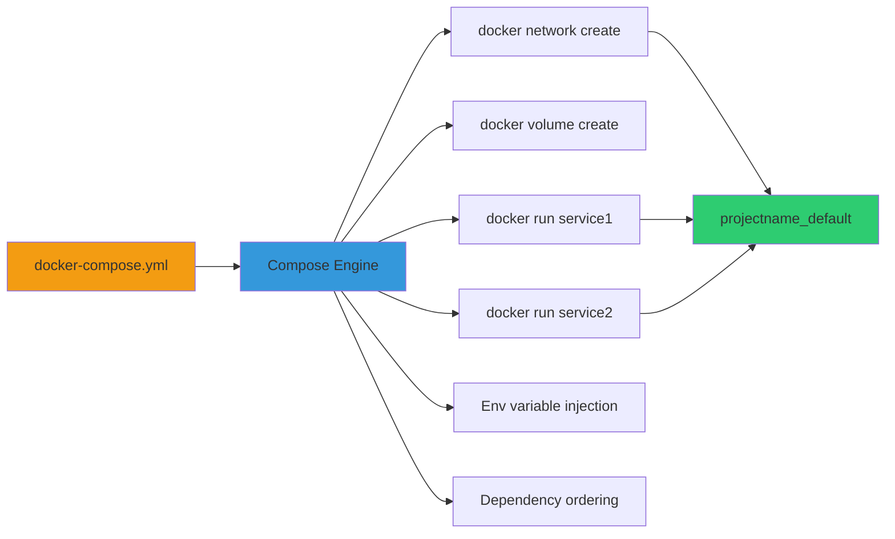

### Key Truth

```
┌─────────────────────────────────────────────────────────┐
│                                                         │
│  docker-compose does NOT create new networking tech    │
│                                                         │
│  It simply AUTOMATES bridge networks + containers      │
│                                                         │
│         Compose = Bridge + Automation + Sanity         │
│                                                         │
└─────────────────────────────────────────────────────────┘
```

### Feature Comparison Table

|Feature|Manual Bridge|docker-compose|
|---|---|---|
|Network Creation|`docker network create`|Automatic|
|Container Startup|`docker run` (manual order)|`docker-compose up`|
|DNS Resolution|Yes (user-defined only)|Yes (automatic)|
|Service Discovery|Manual container names|Service names in YAML|
|Dependency Handling|None|`depends_on`|
|Environment Variables|`-e` flags|`environment` section|
|Volume Management|Manual creation|Declarative `volumes`|
|Scaling|Manual replication|`docker-compose scale`|
|Reproducibility|Poor|Excellent|
|Ideal Use|Learning, debugging|Development, testing|
|Production Use|No|No (use Kubernetes)|

### Mental Model Hierarchy

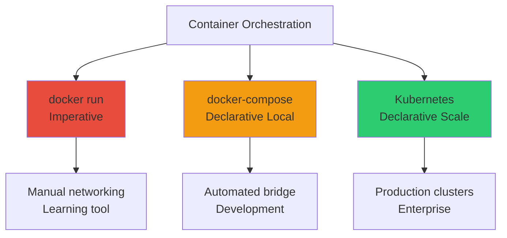

---

## Practical Implementation

### Manual Bridge Network Setup

#### Step 1: Create Custom Network

```bash
# Create user-defined bridge network
docker network create app_net

# Verify creation
docker network ls | grep app_net

# Inspect network details
docker network inspect app_net
```

#### Step 2: Run MySQL Container

```bash
docker run -d \
  --name mysql_db \
  --network app_net \
  -e MYSQL_ROOT_PASSWORD=root \
  -e MYSQL_DATABASE=testdb \
  -e MYSQL_USER=appuser \
  -e MYSQL_PASSWORD=password \
  mysql:8.0

# Verify container is running
docker ps | grep mysql_db

# Check container IP
docker inspect mysql_db | grep IPAddress
```

#### Step 3: Build and Run Flask Application

```bash
# Build Flask image
docker build -t flask-app .

# Run Flask container on same network
docker run -d \
  --name flask_app \
  --network app_net \
  -p 5000:5000 \
  -e DATABASE_HOST=mysql_db \
  -e DATABASE_USER=appuser \
  -e DATABASE_PASSWORD=password \
  -e DATABASE_NAME=testdb \
  flask-app

# Verify connectivity
docker logs flask_app
```

#### Step 4: Flask Connection Code

```python
import mysql.connector
import os

# Connection using container name (DNS resolution)
db = mysql.connector.connect(
    host=os.getenv("DATABASE_HOST", "mysql_db"),  # Container name
    user=os.getenv("DATABASE_USER", "appuser"),
    password=os.getenv("DATABASE_PASSWORD", "password"),
    database=os.getenv("DATABASE_NAME", "testdb")
)

# IMPORTANT:
# ✅ host="mysql_db" works (Docker DNS resolves it)
# ❌ host="localhost" will NOT work
# ❌ host="127.0.0.1" will NOT work
```

### Network Communication Verification

```bash
# Test DNS resolution from Flask container
docker exec flask_app nslookup mysql_db

# Output:
# Server:    127.0.0.11
# Address:   127.0.0.11#53
# 
# Name:      mysql_db
# Address:   172.18.0.3

# Test connectivity
docker exec flask_app ping -c 3 mysql_db

# Test MySQL connection
docker exec flask_app nc -zv mysql_db 3306
```

### docker-compose Equivalent

```yaml
version: '3.8'

services:
  mysql_db:
    image: mysql:8.0
    environment:
      MYSQL_ROOT_PASSWORD: root
      MYSQL_DATABASE: testdb
      MYSQL_USER: appuser
      MYSQL_PASSWORD: password
    networks:
      - app_net
    volumes:
      - mysql_data:/var/lib/mysql

  flask_app:
    build: .
    ports:
      - "5000:5000"
    environment:
      DATABASE_HOST: mysql_db
      DATABASE_USER: appuser
      DATABASE_PASSWORD: password
      DATABASE_NAME: testdb
    depends_on:
      - mysql_db
    networks:
      - app_net

networks:
  app_net:
    driver: bridge

volumes:
  mysql_data:
```

```bash
# Single command startup
docker-compose up -d

# View logs
docker-compose logs -f

# Scale services
docker-compose up -d --scale flask_app=3

# Cleanup
docker-compose down -v
```

### What You Lose Without Compose

```ascii
┌────────────────────────────────────────────────────────────┐
│              Without docker-compose                        │
├────────────────────────────────────────────────────────────┤
│                                                            │
│  ❌ One-command startup                                    │
│  ❌ Automatic dependency ordering                          │
│  ❌ Service health checks                                  │
│  ❌ Automatic container restart                            │
│  ❌ Environment management from .env                       │
│  ❌ Service scaling                                        │
│  ❌ Easy reproducibility across teams                      │
│  ❌ Configuration version control                          │
│  ❌ Network and volume cleanup automation                  │
│                                                            │
│  Result: Operational complexity and human error           │
│                                                            │
└────────────────────────────────────────────────────────────┘
```

---

## Interview Preparation

### Critical Concepts Checklist

```ascii
╔════════════════════════════════════════════════════════════╗
║          DOCKER NETWORKING INTERVIEW CHECKLIST             ║
╠════════════════════════════════════════════════════════════╣
║                                                            ║
║  [ ] Explain bridge vs user-defined bridge                ║
║  [ ] When to use host network vs bridge                   ║
║  [ ] How Docker DNS works (127.0.0.11)                    ║
║  [ ] Difference between macvlan and ipvlan                ║
║  [ ] Overlay network architecture in Swarm                ║
║  [ ] Container to container communication                 ║
║  [ ] Port mapping vs host network                         ║
║  [ ] Network isolation principles                         ║
║  [ ] docker-compose networking automation                 ║
║  [ ] Multi-host networking strategies                     ║
║  [ ] iptables and NAT in Docker                           ║
║  [ ] Service discovery mechanisms                         ║
║                                                            ║
╚════════════════════════════════════════════════════════════╝
```

### Common Interview Questions

#### Q1: Explain Docker's embedded DNS server

**Answer:** Docker runs an embedded DNS server at `127.0.0.11` inside each container connected to user-defined networks. This DNS server:

- Resolves container names to IP addresses
- Automatically updates when containers are added/removed
- Provides service discovery without external tools
- Only works on user-defined networks, not default bridge
- Enables containers to communicate using container names instead of IPs

```bash
# Inside container, DNS queries go to 127.0.0.11
docker exec container_name cat /etc/resolv.conf
# nameserver 127.0.0.11
```

#### Q2: When would you use macvlan instead of bridge?

**Answer:** Use macvlan when:

- Legacy applications expect to be directly on physical network
- Need to integrate with VLANs
- Applications require promiscuous mode
- Network monitoring tools need direct hardware access
- Container must appear as physical device to network infrastructure

Avoid macvlan when:

- Additional MAC addresses cause issues (some cloud providers)
- Simple container-to-container communication sufficient
- Need port mapping flexibility
- Working with dynamic cloud environments

#### Q3: How does docker-compose handle networking?

**Answer:** docker-compose automatically:

1. Creates a default bridge network named `<project>_default`
2. Connects all services to this network
3. Enables DNS resolution using service names
4. Handles network cleanup on `docker-compose down`
5. Supports custom networks defined in YAML
6. Provides network isolation per project

Under the hood, compose just automates `docker network create` and `docker run --network` commands.

#### Q4: Explain the difference between ipvlan L2 and L3

**Answer:**

**Ipvlan L2:**

- Layer 2 switching within same broadcast domain
- Containers share parent interface MAC address
- Same subnet as physical network
- Simpler configuration
- Use when containers need L2 adjacency

**Ipvlan L3:**

- Layer 3 routing mode
- No broadcast/multicast traffic
- Each container can be on different subnet
- Host acts as router between subnets
- More scalable for large deployments
- Use for multi-tenant or high-scale environments

#### Q5: Why can't containers on default bridge use DNS resolution?

**Answer:** The default bridge network (`docker0`) is legacy and doesn't include the embedded DNS server. It was designed before Docker implemented automatic service discovery. Containers on default bridge must use:

- IP addresses directly
- Deprecated `--link` flag
- Manual `/etc/hosts` entries

User-defined bridge networks always include embedded DNS, making them the recommended approach for modern Docker deployments.

### Network Type Selection Decision Tree

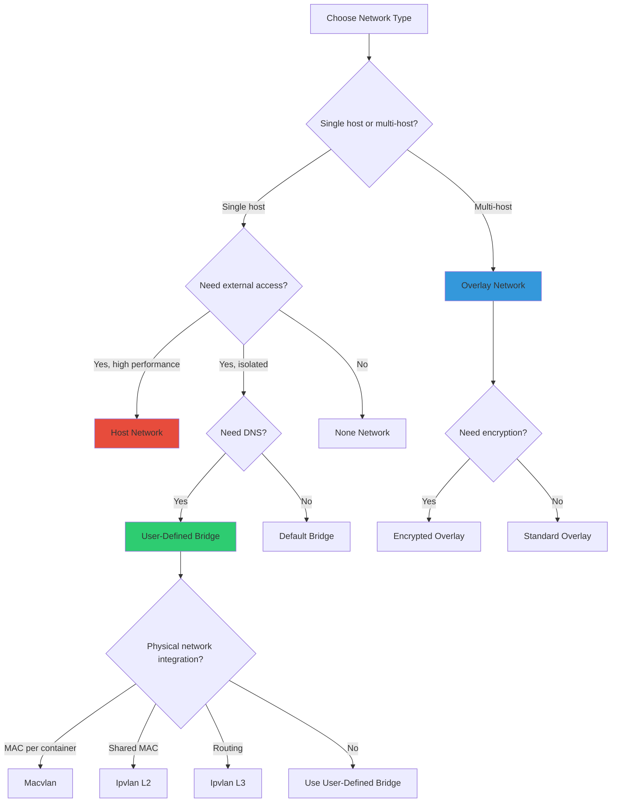

### Production Deployment Patterns

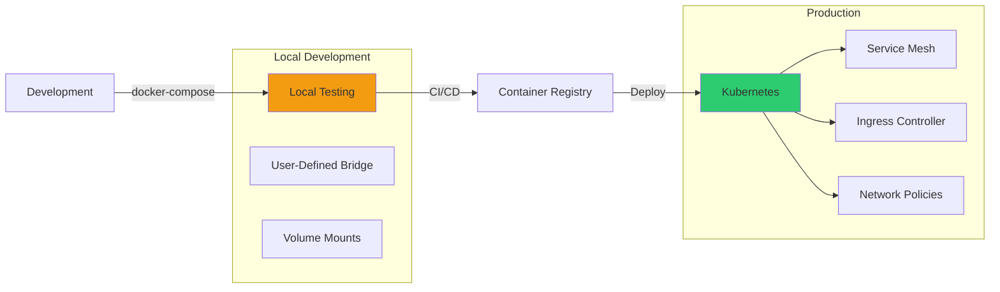

### Interview One-Liners

```ascii
┌────────────────────────────────────────────────────────────┐
│                  INTERVIEW ONE-LINERS                      │
├────────────────────────────────────────────────────────────┤
│                                                            │
│  • "Docker containers communicate via embedded DNS on      │
│    user-defined bridges at 127.0.0.11"                    │
│                                                            │
│  • "docker-compose is orchestration automation, not a     │
│    networking requirement"                                 │
│                                                            │
│  • "Host network provides best performance but reduces    │
│    isolation"                                              │
│                                                            │
│  • "Overlay networks use VXLAN for multi-host container   │
│    communication"                                          │
│                                                            │
│  • "Macvlan assigns unique MAC per container, ipvlan      │
│    shares parent MAC"                                      │
│                                                            │
│  • "Default bridge is legacy; user-defined bridges        │
│    provide DNS"                                            │
│                                                            │
│  • "Skipping compose increases operational complexity"    │
│                                                            │
│  • "Kubernetes replaces docker-compose in production"     │
│                                                            │
└────────────────────────────────────────────────────────────┘
```

### Debugging Network Issues

```bash
# Inspect network configuration
docker network inspect <network_name>

# Check container networking
docker exec <container> ip addr show
docker exec <container> ip route show

# Test DNS resolution
docker exec <container> nslookup <other_container>
docker exec <container> cat /etc/resolv.conf

# Test connectivity
docker exec <container> ping <target>
docker exec <container> telnet <host> <port>
docker exec <container> nc -zv <host> <port>

# View iptables rules (host)
sudo iptables -t nat -L -n -v

# Capture network traffic
docker exec <container> tcpdump -i eth0 -n

# Check bridge interfaces (host)
ip link show | grep docker
brctl show
```

### Real-World DevOps Flow

```ascii
┌────────────────────────────────────────────────────────────┐
│                                                            │
│  Local Dev  ──────▶  docker-compose                       │
│                      (User-Defined Bridge)                 │
│                                                            │
│  Testing    ──────▶  docker-compose or manual             │
│                      (Learn internals)                     │
│                                                            │
│  Staging    ──────▶  Kubernetes                           │
│                      (Overlay-like CNI)                    │
│                                                            │
│  Production ──────▶  Kubernetes + Service Mesh            │
│                      (Advanced networking)                 │
│                                                            │
└────────────────────────────────────────────────────────────┘
```

---

## Quick Reference Tables

### Network Driver Summary

|Driver|Use Case|Isolation|DNS|Multi-Host|
|---|---|---|---|---|
|bridge (default)|Legacy|Low|No|No|
|bridge (user-defined)|Dev/Test|High|Yes|No|
|host|Performance|None|N/A|No|
|none|Security|Complete|N/A|No|
|overlay|Swarm|High|Yes|Yes|
|macvlan|Legacy integration|High|No|No|
|ipvlan (L2)|MAC restrictions|High|No|No|
|ipvlan (L3)|Large scale|High|No|No|

### Command Quick Reference

|Task|Command|
|---|---|
|Create network|`docker network create <name>`|
|List networks|`docker network ls`|
|Inspect network|`docker network inspect <name>`|
|Connect container|`docker network connect <net> <container>`|
|Disconnect|`docker network disconnect <net> <container>`|
|Remove network|`docker network rm <name>`|
|Prune unused|`docker network prune`|

### Port Mapping vs Network Types

|Network Type|Port Mapping|Access Method|
|---|---|---|
|Bridge|`-p 8080:80`|Host IP:8080|
|Host|Not needed|Host IP:80|
|None|Not applicable|No access|
|User-defined|`-p 8080:80`|Host IP:8080|
|Overlay|Service ports|Swarm routing mesh|

---

**Document Version:** 1.0  
**Last Updated:** December 2025  
**Target Audience:** DevOps Engineers, System Administrators  
**Focus:** Interview Preparation, Production Deployment  
**Recommended Review:** Before technical interviews, system design discussions


# Flask + MySQL Docker Architecture - Implementation Guide

```
╔════════════════════════════════════════════════════════════════╗
║                                                                ║
║   ███████╗██╗      █████╗ ███████╗██╗  ██╗                    ║
║   ██╔════╝██║     ██╔══██╗██╔════╝██║ ██╔╝                    ║
║   █████╗  ██║     ███████║███████╗█████╔╝                     ║
║   ██╔══╝  ██║     ██╔══██║╚════██║██╔═██╗                     ║
║   ██║     ███████╗██║  ██║███████║██║  ██╗                    ║
║   ╚═╝     ╚══════╝╚═╝  ╚═╝╚══════╝╚═╝  ╚═╝                    ║
║                                                                ║
║              + MySQL + Docker Bridge Network                  ║
║                                                                ║
╚════════════════════════════════════════════════════════════════╝
```

---

## Table of Contents

1. [Problem Statement](https://claude.ai/chat/ccc747c5-c7ba-45c1-8ef0-6f9e4b64f666#problem-statement)
2. [Architecture Overview](https://claude.ai/chat/ccc747c5-c7ba-45c1-8ef0-6f9e4b64f666#architecture-overview)
3. [Network Design](https://claude.ai/chat/ccc747c5-c7ba-45c1-8ef0-6f9e4b64f666#network-design)
4. [Environment Configuration](https://claude.ai/chat/ccc747c5-c7ba-45c1-8ef0-6f9e4b64f666#environment-configuration)
5. [Application Implementation](https://claude.ai/chat/ccc747c5-c7ba-45c1-8ef0-6f9e4b64f666#application-implementation)
6. [Container Configuration](https://claude.ai/chat/ccc747c5-c7ba-45c1-8ef0-6f9e4b64f666#container-configuration)
7. [Data Flow Analysis](https://claude.ai/chat/ccc747c5-c7ba-45c1-8ef0-6f9e4b64f666#data-flow-analysis)
8. [Deployment Procedure](https://claude.ai/chat/ccc747c5-c7ba-45c1-8ef0-6f9e4b64f666#deployment-procedure)
9. [Verification and Testing](https://claude.ai/chat/ccc747c5-c7ba-45c1-8ef0-6f9e4b64f666#verification-and-testing)
10. [Troubleshooting](https://claude.ai/chat/ccc747c5-c7ba-45c1-8ef0-6f9e4b64f666#troubleshooting)
11. [Production Considerations](https://claude.ai/chat/ccc747c5-c7ba-45c1-8ef0-6f9e4b64f666#production-considerations)

---

## Problem Statement

### Objective

Build a production-style two-tier application architecture demonstrating:

- Multi-container orchestration without docker-compose
- Secure inter-container communication
- Environment-based configuration management
- Database persistence and data flow
- Manual networking fundamentals

### Requirements

```markmap
# Project Requirements
## Application Layer
### Flask web framework
### HTML form handling
### RESTful API endpoints
### Database integration
## Data Layer
### MySQL relational database
### User data persistence
### SQL operations (INSERT)
### Connection pooling
## Infrastructure
### Docker containerization
### Custom bridge network
### Environment variable injection
### No docker-compose dependency
## Security
### Network isolation
### Non-exposed database
### Credential management
### Least privilege access
```

### Technical Constraints

- Containers must communicate without docker-compose
- Environment variables managed via `.env` file
- Database not exposed to host network
- Flask publicly accessible via port mapping
- Production-ready architecture patterns

---

## Architecture Overview

### Logical Architecture

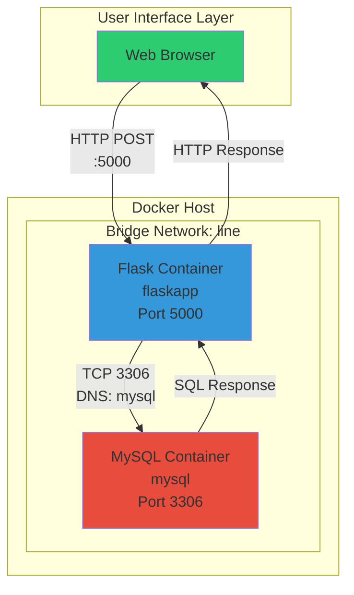

### Three-Tier Component Breakdown

```ascii
┌─────────────────────────────────────────────────────────────┐
│                    PRESENTATION LAYER                       │
│                                                             │
│  ┌───────────────────────────────────────────────────┐     │
│  │  Web Browser (User Interface)                     │     │
│  │  - HTML Form Rendering                            │     │
│  │  - User Input Collection                          │     │
│  │  - HTTP POST Requests                             │     │
│  └───────────────────────────────────────────────────┘     │
└─────────────────────────────────────────────────────────────┘
                            │
                            ▼ HTTP (Port 5000)
┌─────────────────────────────────────────────────────────────┐
│                   APPLICATION LAYER                         │
│                   (Flask Container)                         │
│                                                             │
│  ┌───────────────────────────────────────────────────┐     │
│  │  Flask Web Framework                              │     │
│  │  - Route Handling (/submit)                       │     │
│  │  - Form Data Processing                           │     │
│  │  - Database Connection Management                 │     │
│  │  - SQL Query Execution                            │     │
│  │  - Response Generation                            │     │
│  └───────────────────────────────────────────────────┘     │
└─────────────────────────────────────────────────────────────┘
                            │
                            ▼ TCP (Port 3306)
┌─────────────────────────────────────────────────────────────┐
│                      DATA LAYER                             │
│                   (MySQL Container)                         │
│                                                             │
│  ┌───────────────────────────────────────────────────┐     │
│  │  MySQL Database Server                            │     │
│  │  - Persistent Data Storage                        │     │
│  │  - ACID Transaction Management                    │     │
│  │  - Query Processing                               │     │
│  │  - Data Integrity Enforcement                     │     │
│  └───────────────────────────────────────────────────┘     │
└─────────────────────────────────────────────────────────────┘
```

---

## Network Design

### Docker Bridge Network Fundamentals

**Network Name:** `line`  
**Driver:** `bridge`  
**DNS Resolution:** Automatic (container name as hostname)  
**Isolation:** Container-level network namespace

### Network Creation

```bash
docker network create line -d bridge
```

### Network Architecture Diagram

```
┌───────────────────────────────────────────────────────────────┐
│                       Docker Host                             │
│                    (Physical Machine)                         │
│                                                               │
│  ┌─────────────────────────────────────────────────────────┐ │
│  │            Bridge Network: line                         │ │
│  │            Subnet: 172.18.0.0/16 (example)              │ │
│  │                                                         │ │
│  │   ┌──────────────────────────────────────────────┐     │ │
│  │   │      Embedded DNS Server (127.0.0.11)       │     │ │
│  │   │      Hostname Resolution Service            │     │ │
│  │   │                                              │     │ │
│  │   │      flaskapp  → 172.18.0.2                 │     │ │
│  │   │      mysql     → 172.18.0.3                 │     │ │
│  │   └──────────────────────────────────────────────┘     │ │
│  │                                                         │ │
│  │   ┌─────────────────┐          ┌─────────────────┐    │ │
│  │   │   flaskapp      │          │     mysql       │    │ │
│  │   │   172.18.0.2    │◄────────►│   172.18.0.3    │    │ │
│  │   │   Port: 5000    │   DNS    │   Port: 3306    │    │ │
│  │   └─────────────────┘  Query   └─────────────────┘    │ │
│  │          │                                             │ │
│  │          │ Port Mapping                                │ │
│  └──────────┼─────────────────────────────────────────────┘ │
│             │                                               │
│             ▼                                               │
│      ┌─────────────┐                                       │
│      │   eth0      │ Host Network Interface                │
│      │   (Public)  │                                       │
│      └─────────────┘                                       │
└───────────────────────────────────────────────────────────────┘
         │
         ▼ Port 5000 (Exposed)
    External Access
```

### Why Custom Bridge Network?

```markmap
# Bridge Network Benefits
## Automatic DNS Resolution
### Container name = hostname
### No IP hardcoding required
### Dynamic service discovery
### Simplifies configuration
## Network Isolation
### Separate from default bridge
### Project-specific networking
### Controlled connectivity
### Enhanced security
## Production Patterns
### Microservices communication
### Service mesh foundation
### Container orchestration prep
### Kubernetes similarity
```

### Network Verification Commands

```bash
# List all networks
docker network ls

# Inspect network details
docker network inspect line

# View connected containers
docker network inspect line | grep -A 10 "Containers"

# Check DNS resolution from Flask container
docker exec flaskapp nslookup mysql

# Test connectivity
docker exec flaskapp ping -c 3 mysql
```

---

## Environment Configuration

### Environment Variable Strategy

**Problem:** `.env` file exists outside `/src` directory, not included in Docker image

**Solution:** Runtime injection via `-e` flags during `docker run`

### Environment Variables Defined

```bash
# Flask Application Settings
FLASK_HOST=0.0.0.0          # Listen on all interfaces
FLASK_PORT=5000             # Application port

# Database Connection Settings
DB_HOST=mysql               # Container name (DNS resolution)
DB_USER=mukul               # Database username
DB_PASSWORD=0203            # Database password
DB_NAME=appdb               # Database name
```

### Critical Design Decision: DB_HOST Value

```ascii
┌───────────────────────────────────────────────────────────┐
│              DB_HOST Configuration Analysis               │
├───────────────────────────────────────────────────────────┤
│                                                           │
│  ❌ INCORRECT: DB_HOST=localhost                          │
│     Reason: Points to Flask container itself              │
│     Result: Connection refused                            │
│                                                           │
│  ❌ INCORRECT: DB_HOST=127.0.0.1                          │
│     Reason: Loopback to Flask container                   │
│     Result: Connection refused                            │
│                                                           │
│  ❌ INCORRECT: DB_HOST=<MySQL IP Address>                 │
│     Reason: IP changes on container restart               │
│     Result: Brittle configuration                         │
│                                                           │
│  ✅ CORRECT: DB_HOST=mysql                                │
│     Reason: Docker DNS resolves container name            │
│     Result: Reliable, dynamic resolution                  │
│                                                           │
└───────────────────────────────────────────────────────────┘
```

### Environment Variable Flow

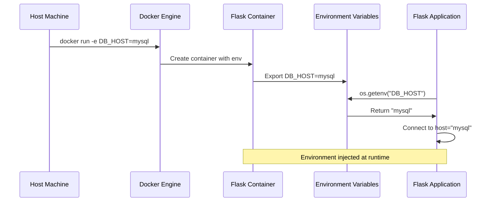

---

## Application Implementation

### Flask Application Code

```python
from flask import Flask, render_template, request
import mysql.connector
import os
from dotenv import load_dotenv

# Load environment variables from .env file (development fallback)
load_dotenv()

app = Flask(__name__)

# Database connection configuration
db = mysql.connector.connect(
    host=os.getenv("DB_HOST"),         # mysql (container name)
    user=os.getenv("DB_USER"),         # mukul
    password=os.getenv("DB_PASSWORD"), # 0203
    database=os.getenv("DB_NAME")      # appdb
)

cursor = db.cursor()

@app.route("/")
def index():
    """Render the main HTML form"""
    return render_template("index.html")

@app.route("/submit", methods=["POST"])
def submit():
    """Handle form submission and insert data into MySQL"""
    text = request.form["message"]
    
    # Execute parameterized query (SQL injection prevention)
    cursor.execute(
        "INSERT INTO users (name) VALUES (%s)",
        (text,)
    )
    db.commit()
    
    return "Text inserted successfully!"

if __name__ == "__main__":
    app.run(
        host=os.getenv("FLASK_HOST"),     # 0.0.0.0
        port=int(os.getenv("FLASK_PORT")) # 5000
    )
```

### Code Architecture Analysis

```markmap
# Flask Application Structure
## Imports
### Flask framework components
### MySQL connector library
### Environment variable handling
## Configuration
### Environment variable loading
### Database connection setup
### Cursor initialization
## Routes
### GET / (index)
- Render HTML form
- User interface
### POST /submit
- Process form data
- Execute SQL INSERT
- Commit transaction
- Return confirmation
## Security
### Parameterized queries
### SQL injection prevention
### Credential externalization
```

### Dependency Management

**requirements.txt:**

```text
flask
mysql-connector-python
python-dotenv
```

**Dependency Analysis:**

|Package|Version|Purpose|Criticality|
|---|---|---|---|
|flask|Latest|Web framework, routing, templating|Required|
|mysql-connector-python|Latest|MySQL database connectivity|Required|
|python-dotenv|Latest|Environment variable loading|Development|

**Note on python-dotenv:**

- Used for local development when `.env` file is present
- Not strictly required in production (uses `-e` injection)
- Provides fallback configuration mechanism
- Enables seamless local testing

---

## Container Configuration

### Flask Dockerfile

```dockerfile
# Use official Python slim image for smaller size
FROM python:3.11-slim

# Set working directory
WORKDIR /app

# Copy and install dependencies first (Docker layer caching)
COPY requirements.txt .
RUN pip install --no-cache-dir -r requirements.txt

# Copy application source code
COPY src/ /app/

# Document the port (metadata only)
EXPOSE 5000

# Run Flask application
CMD ["python", "app.py"]
```

### Dockerfile Design Principles

```ascii
┌────────────────────────────────────────────────────────────┐
│               Dockerfile Optimization Strategy             │
├────────────────────────────────────────────────────────────┤
│                                                            │
│  1. Base Image Selection                                  │
│     python:3.11-slim → Minimal attack surface             │
│                                                            │
│  2. Layer Caching                                          │
│     requirements.txt copied first                          │
│     Dependencies rarely change                             │
│     Faster rebuilds when only code changes                 │
│                                                            │
│  3. .env Exclusion                                         │
│     Not copied into image                                  │
│     Runtime injection preferred                            │
│     Secrets not baked into layers                          │
│                                                            │
│  4. Port Documentation                                     │
│     EXPOSE 5000 (informational)                           │
│     Does not publish port                                  │
│     Requires -p flag at runtime                            │
│                                                            │
│  5. Minimal Dependencies                                   │
│     --no-cache-dir reduces image size                     │
│     Only production dependencies                           │
│                                                            │
└────────────────────────────────────────────────────────────┘
```

### Build Process

```bash
# Build Flask image
docker build -t flask-app .

# Verify image creation
docker images | grep flask-app

# Inspect image layers
docker history flask-app
```

---

## Container Configuration

### MySQL Container Deployment

```bash
docker run -d \
  --name mysql \
  --network line \
  -e MYSQL_ROOT_PASSWORD=0203 \
  -e MYSQL_DATABASE=appdb \
  -e MYSQL_USER=mukul \
  -e MYSQL_PASSWORD=0203 \
  mysql:8
```

**Configuration Breakdown:**

|Flag|Value|Purpose|
|---|---|---|
|`-d`|N/A|Detached mode (background)|
|`--name`|mysql|Container name (DNS hostname)|
|`--network`|line|Attach to custom bridge|
|`-e MYSQL_ROOT_PASSWORD`|0203|Root user password|
|`-e MYSQL_DATABASE`|appdb|Auto-create database|
|`-e MYSQL_USER`|mukul|Application user|
|`-e MYSQL_PASSWORD`|0203|Application password|
|Image|mysql:8|Official MySQL 8.0 image|

### Flask Container Deployment

```bash
docker run -d \
  --name flaskapp \
  --network line \
  -e FLASK_HOST=0.0.0.0 \
  -e FLASK_PORT=5000 \
  -e DB_HOST=mysql \
  -e DB_USER=mukul \
  -e DB_PASSWORD=0203 \
  -e DB_NAME=appdb \
  -p 5000:5000 \
  flask-app
```

**Configuration Breakdown:**

|Flag|Value|Purpose|
|---|---|---|
|`-d`|N/A|Detached mode|
|`--name`|flaskapp|Container name|
|`--network`|line|Same network as MySQL|
|`-e FLASK_HOST`|0.0.0.0|Bind to all interfaces|
|`-e FLASK_PORT`|5000|Application port|
|`-e DB_HOST`|mysql|MySQL container name|
|`-e DB_USER`|mukul|Database username|
|`-e DB_PASSWORD`|0203|Database password|
|`-e DB_NAME`|appdb|Database name|
|`-p`|5000:5000|Port mapping (host:container)|
|Image|flask-app|Custom built image|

### Security Considerations

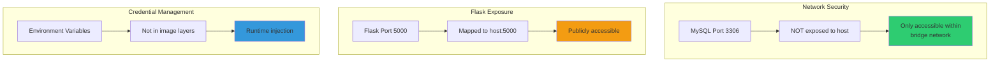

---

## Data Flow Analysis

### Request-Response Cycle

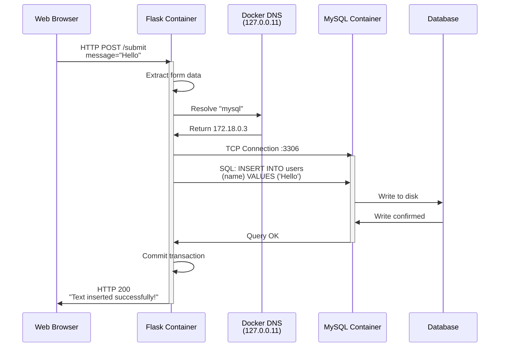

### Detailed Data Flow Stages

```ascii
┌────────────────────────────────────────────────────────────┐
│                 STAGE 1: USER INPUT                        │
├────────────────────────────────────────────────────────────┤
│                                                            │
│  User fills HTML form                                      │
│  Submits POST request to /submit                           │
│  Data: {"message": "Hello World"}                          │
│                                                            │
└────────────────────────────────────────────────────────────┘
                         │
                         ▼
┌────────────────────────────────────────────────────────────┐
│            STAGE 2: FLASK PROCESSING                       │
├────────────────────────────────────────────────────────────┤
│                                                            │
│  Flask receives POST request                               │
│  Extracts form data: request.form["message"]               │
│  Prepares parameterized SQL query                          │
│                                                            │
└────────────────────────────────────────────────────────────┘
                         │
                         ▼
┌────────────────────────────────────────────────────────────┐
│             STAGE 3: DNS RESOLUTION                        │
├────────────────────────────────────────────────────────────┤
│                                                            │
│  Flask attempts connection to "mysql"                      │
│  Docker DNS (127.0.0.11) resolves "mysql" → 172.18.0.3   │
│  TCP handshake initiated                                   │
│                                                            │
└────────────────────────────────────────────────────────────┘
                         │
                         ▼
┌────────────────────────────────────────────────────────────┐
│            STAGE 4: DATABASE OPERATION                     │
├────────────────────────────────────────────────────────────┤
│                                                            │
│  MySQL receives SQL INSERT statement                       │
│  Validates query syntax                                    │
│  Executes INSERT operation                                 │
│  Writes data to InnoDB storage engine                      │
│  Returns success status                                    │
│                                                            │
└────────────────────────────────────────────────────────────┘
                         │
                         ▼
┌────────────────────────────────────────────────────────────┐
│              STAGE 5: TRANSACTION COMMIT                   │
├────────────────────────────────────────────────────────────┤
│                                                            │
│  Flask calls db.commit()                                   │
│  MySQL finalizes transaction                               │
│  Data persisted to disk                                    │
│  ACID properties ensured                                   │
│                                                            │
└────────────────────────────────────────────────────────────┘
                         │
                         ▼
┌────────────────────────────────────────────────────────────┐
│               STAGE 6: USER RESPONSE                       │
├────────────────────────────────────────────────────────────┤
│                                                            │
│  Flask returns HTTP 200 OK                                 │
│  Message: "Text inserted successfully!"                    │
│  Browser displays confirmation                             │
│                                                            │
└────────────────────────────────────────────────────────────┘
```

### Network Packet Flow

```
User Browser (External)
        │
        │ HTTP POST (External IP:5000)
        ▼
Host Machine eth0
        │
        │ iptables NAT rules
        ▼
Bridge Network (line)
        │
        │ Forward to 172.18.0.2:5000
        ▼
Flask Container (flaskapp)
        │
        │ DNS Query: "mysql"
        ▼
Docker DNS Server (127.0.0.11)
        │
        │ Response: 172.18.0.3
        ▼
Flask Container
        │
        │ TCP Connection: 172.18.0.3:3306
        ▼
MySQL Container (mysql)
        │
        │ SQL Query Execution
        ▼
InnoDB Storage Engine
```

---

## Deployment Procedure

### Step-by-Step Deployment Guide

#### Step 1: Network Initialization

```bash
# Create custom bridge network
docker network create line -d bridge

# Verify network creation
docker network ls | grep line

# Expected output:
# xxxxxxxxxx   line        bridge    local
```

#### Step 2: MySQL Container Deployment

```bash
# Start MySQL container
docker run -d \
  --name mysql \
  --network line \
  -e MYSQL_ROOT_PASSWORD=0203 \
  -e MYSQL_DATABASE=appdb \
  -e MYSQL_USER=mukul \
  -e MYSQL_PASSWORD=0203 \
  mysql:8

# Wait for MySQL initialization (30-60 seconds)
sleep 45

# Verify MySQL is ready
docker logs mysql 2>&1 | grep "ready for connections"
```

#### Step 3: Database Schema Creation

```bash
# Connect to MySQL container
docker exec -it mysql mysql -u mukul -p

# Enter password: 0203

# Create table
USE appdb;

CREATE TABLE users (
    id INT AUTO_INCREMENT PRIMARY KEY,
    name VARCHAR(255) NOT NULL,
    created_at TIMESTAMP DEFAULT CURRENT_TIMESTAMP
);

# Verify table creation
DESCRIBE users;

# Exit MySQL
EXIT;
```

#### Step 4: Flask Image Build

```bash
# Build Flask application image
docker build -t flask-app .

# Verify image
docker images | grep flask-app

# Expected output:
# flask-app    latest    xxxxxxxxxx    X minutes ago    XXX MB
```

#### Step 5: Flask Container Deployment

```bash
# Start Flask container
docker run -d \
  --name flaskapp \
  --network line \
  -e FLASK_HOST=0.0.0.0 \
  -e FLASK_PORT=5000 \
  -e DB_HOST=mysql \
  -e DB_USER=mukul \
  -e DB_PASSWORD=0203 \
  -e DB_NAME=appdb \
  -p 5000:5000 \
  flask-app

# Verify Flask is running
docker logs flaskapp
```

#### Step 6: Deployment Verification

```bash
# Check all running containers
docker ps

# Expected output:
# CONTAINER ID   IMAGE       COMMAND                  STATUS         PORTS
# xxxxxxxxxxxx   flask-app   "python app.py"         Up X minutes   0.0.0.0:5000->5000/tcp
# xxxxxxxxxxxx   mysql:8     "docker-entrypoint.s…"  Up X minutes   3306/tcp

# Test Flask endpoint
curl http://localhost:5000

# Expected: HTML form rendered
```

### Deployment State Machine

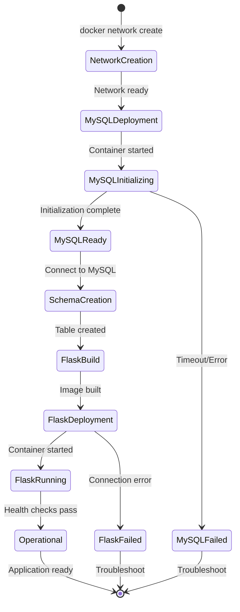

---

## Verification and Testing

### Container Health Checks

```bash
# Check container status
docker ps -a

# View Flask logs
docker logs flaskapp

# View MySQL logs
docker logs mysql

# Follow live logs
docker logs -f flaskapp
```

### Network Connectivity Tests

```bash
# Test DNS resolution from Flask container
docker exec flaskapp nslookup mysql

# Expected output:
# Server:    127.0.0.11
# Address:   127.0.0.11#53
#
# Name:      mysql
# Address:   172.18.0.3

# Test ping connectivity
docker exec flaskapp ping -c 3 mysql

# Test MySQL port connectivity
docker exec flaskapp nc -zv mysql 3306

# Expected: mysql (172.18.0.3:3306) open
```

### Database Verification

```bash
# Access MySQL shell
docker exec -it mysql mysql -u mukul -p
# Password: 0203

# Verify database and table
USE appdb;
SHOW TABLES;
DESCRIBE users;

# Insert test data
INSERT INTO users (name) VALUES ('test_user');

# Verify insertion
SELECT * FROM users;

# Expected output:
# +----+-----------+---------------------+
# | id | name      | created_at          |
# +----+-----------+---------------------+
# |  1 | test_user | 2025-12-21 10:30:00 |
# +----+-----------+---------------------+

EXIT;
```

### Application Testing

```bash
# Test Flask home route
curl http://localhost:5000

# Test form submission
curl -X POST \
  http://localhost:5000/submit \
  -d "message=Hello Docker" \
  -H "Content-Type: application/x-www-form-urlencoded"

# Expected: "Text inserted successfully!"

# Verify data in MySQL
docker exec -it mysql mysql -u mukul -p -e \
  "USE appdb; SELECT * FROM users ORDER BY id DESC LIMIT 1;"

# Should show the submitted message
```

### Comprehensive Test Script

```bash
#!/bin/bash

echo "=== Docker Container Health Check ==="
docker ps | grep -E "mysql|flaskapp"

echo "
=== Network Connectivity Test ==="
docker exec flaskapp ping -c 1 mysql > /dev/null 2>&1
if [ $? -eq 0 ]; then
    echo "✓ Network connectivity: OK"
else
    echo "✗ Network connectivity: FAILED"
fi

echo "
=== MySQL Port Test ==="
docker exec flaskapp nc -zv mysql 3306 2>&1 | grep "open" > /dev/null
if [ $? -eq 0 ]; then
    echo "✓ MySQL port accessible: OK"
else
    echo "✗ MySQL port accessible: FAILED"
fi

echo "
=== Flask HTTP Test ==="
curl -s http://localhost:5000 > /dev/null
if [ $? -eq 0 ]; then
    echo "✓ Flask HTTP endpoint: OK"
else
    echo "✗ Flask HTTP endpoint: FAILED"
fi

echo "
=== Database Record Count ==="
docker exec mysql mysql -u mukul -p0203 -e \
  "USE appdb; SELECT COUNT(*) FROM users;" 2>/dev/null

echo "
=== Test Complete ==="
```

---

## Troubleshooting

### Common Issues and Solutions

```markmap
# Troubleshooting Guide
## Connection Issues
### Flask cannot connect to MySQL
- Check containers on same network
- Verify DB_HOST=mysql (not localhost)
- Ensure MySQL is fully initialized
- Check firewall rules
### DNS Resolution Fails
- Verify user-defined network (not default)
- Check container names match
- Restart Docker daemon
- Inspect network configuration
## Database Issues
### Table does not exist
- Run schema creation commands
- Verify database name matches
- Check user permissions
- Review MySQL initialization logs
### Authentication fails
- Verify credentials match
- Check MYSQL_USER and MYSQL_PASSWORD
- Ensure user has proper grants
- Reset MySQL root password if needed
## Application Issues
### Flask returns 500 error
- Check Flask logs: docker logs flaskapp
- Verify environment variables
- Test database connection manually
- Review application code
### Port already in use
- Check existing processes: lsof -i :5000
- Stop conflicting services
- Use different port mapping
- Kill zombie processes
## Container Issues
### Container exits immediately
- Check logs: docker logs <container>
- Verify CMD in Dockerfile
- Test entry point manually
- Review resource constraints
```

### Debugging Commands Reference

```bash
# Container inspection
docker inspect flaskapp
docker inspect mysql

# Network inspection
docker network inspect line

# Process inspection inside container
docker exec flaskapp ps aux
docker exec mysql ps aux

# Check environment variables
docker exec flaskapp env | grep DB_
docker exec mysql env | grep MYSQL_

# File system inspection
docker exec flaskapp ls -la /app
docker exec mysql ls -la /var/lib/mysql

# Resource usage
docker stats flaskapp mysql

# Port mapping verification
docker port flaskapp
```

### Error Diagnosis Flowchart

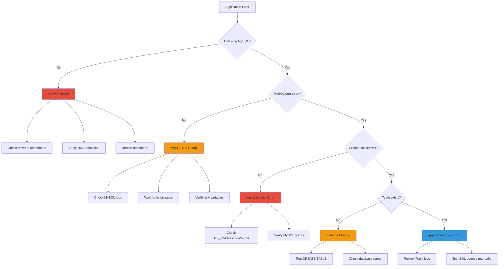

---

## Production Considerations

### What This Architecture Demonstrates

```ascii
╔════════════════════════════════════════════════════════════╗
║              Production-Ready Patterns Learned             ║
╠════════════════════════════════════════════════════════════╣
║                                                            ║
║  ✓ Network isolation and segmentation                     ║
║  ✓ Service discovery via DNS                              ║
║  ✓ Environment-based configuration                        ║
║  ✓ Container orchestration fundamentals                   ║
║  ✓ Database persistence patterns                          ║
║  ✓ Security through network design                        ║
║  ✓ Manual deployment understanding                        ║
║  ✓ Troubleshooting containerized applications             ║
║                                                            ║
╚════════════════════════════════════════════════════════════╝
```

### Limitations of Current Setup

**Missing Production Features:**

1. **No persistent storage** - MySQL data lost on container removal
2. **No health checks** - Container status not monitored
3. **No retry logic** - Flask fails if MySQL not ready
4. **No connection pooling** - Inefficient database connections
5. **No monitoring** - No metrics or logging aggregation
6. **No secrets management** - Passwords in plain text
7. **No load balancing** - Single Flask instance
8. **No backup strategy** - Data loss risk
9. **No CI/CD integration** - Manual deployment process
10. **No high availability** - Single point of failure

### Migration Path to Production

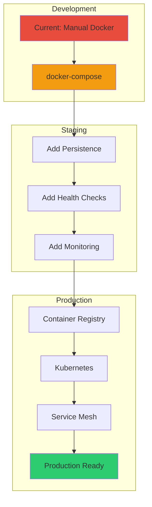

### docker-compose Conversion

```yaml
version: '3.8'

services:
  mysql:
    image: mysql:8
    container_name: mysql
    environment:
      MYSQL_ROOT_PASSWORD: ${MYSQL_ROOT_PASSWORD}
      MYSQL_DATABASE: ${MYSQL_DATABASE}
      MYSQL_USER: ${MYSQL_USER}
      MYSQL_PASSWORD: ${MYSQL_PASSWORD}
    volumes:
      - mysql_data:/var/lib/mysql
      - ./init.sql:/docker-entrypoint-initdb.d/init.sql
    networks:
      - line
    healthcheck:
      test: ["CMD", "mysqladmin", "ping", "-h", "localhost"]
      interval: 10s
      timeout: 5s
      retries: 5

  flaskapp:
    build: .
    container_name: flaskapp
    environment:
      FLASK_HOST: ${FLASK_HOST}
      FLASK_PORT: ${FLASK_PORT}
      DB_HOST: mysql
      DB_USER: ${MYSQL_USER}
      DB_PASSWORD: ${MYSQL_PASSWORD}
      DB_NAME: ${MYSQL_DATABASE}
    ports:
      - "5000:5000"
    networks:
      - line
    depends_on:
      mysql:
        condition: service_healthy
    restart: unless-stopped

networks:
  line:
    driver: bridge

volumes:
  mysql_data:
    driver: local
```

### Production Enhancement Checklist

```markmap
# Production Enhancements
## Data Persistence
### Named volumes
### Backup automation
### Point-in-time recovery
### Replication setup
## High Availability
### Multiple Flask replicas
### Load balancer (Nginx)
### Database clustering
### Failover mechanisms
## Security
### Secrets management (Vault)
### TLS/SSL encryption
### Network policies
### Read-only filesystems
### Non-root containers
## Monitoring
### Prometheus metrics
### Grafana dashboards
### Log aggregation (ELK)
### Distributed tracing
### Alerting rules
## Deployment
### CI/CD pipelines
### Rolling updates
### Blue-green deployment
### Canary releases
### Automated testing
## Scalability
### Horizontal pod autoscaling
### Database connection pooling
### Caching layer (Redis)
### CDN integration
```

---

## Key Learnings Summary

```ascii
┌────────────────────────────────────────────────────────────┐
│                   CORE CONCEPTS MASTERED                   │
├────────────────────────────────────────────────────────────┤
│                                                            │
│  1. User-defined bridge networks enable DNS resolution    │
│                                                            │
│  2. Container name serves as hostname for connectivity    │
│                                                            │
│  3. Environment variables must be injected at runtime     │
│                                                            │
│  4. .env files outside build context require -e flags     │
│                                                            │
│  5. MySQL must not use localhost in containerized env     │
│                                                            │
│  6. Startup order matters: DB before application          │
│                                                            │
│  7. Port mapping exposes services selectively             │
│                                                            │
│  8. docker-compose simplifies but manual teaches depth    │
│                                                            │
│  9. Network isolation provides security layer             │
│                                                            │
│ 10. Manual setup foundation for Kubernetes understanding  │
│                                                            │
└────────────────────────────────────────────────────────────┘
```

---

## Next Steps and Extensions

### Immediate Enhancements

1. **Add MySQL Volume**
    
    ```bash
    docker run -d \
      --name mysql \
      --network line \
      -v mysql_data:/var/lib/mysql \
      -e MYSQL_ROOT_PASSWORD=0203 \
      mysql:8
    ```
    
2. **Implement Health Checks**
    
    ```dockerfile
    HEALTHCHECK --interval=30s --timeout=3s \
      CMD curl -f http://localhost:5000/ || exit 1
    ```
    
3. **Add Connection Retry Logic**
    
    ```python
    import time
    from mysql.connector import Error
    
    max_retries = 5
    for attempt in range(max_retries):
        try:
            db = mysql.connector.connect(...)
            break
        except Error:
            time.sleep(5)
    ```
    
4. **Implement Nginx Reverse Proxy**
    
5. **Add Redis Caching Layer**
    
6. **Setup Database Migrations (Alembic)**
    
7. **Configure Logging Aggregation**
    
8. **Implement Automated Testing**
    

---

**Document Version:** 1.0  
**Last Updated:** December 2025  
**Architecture Type:** Two-Tier Containerized Application  
**Deployment Method:** Manual Docker Commands  
**Target Audience:** DevOps Engineers, Backend Developers  
**Complexity Level:** Intermediate  
**Production Ready:** No (Educational/Development Setup)