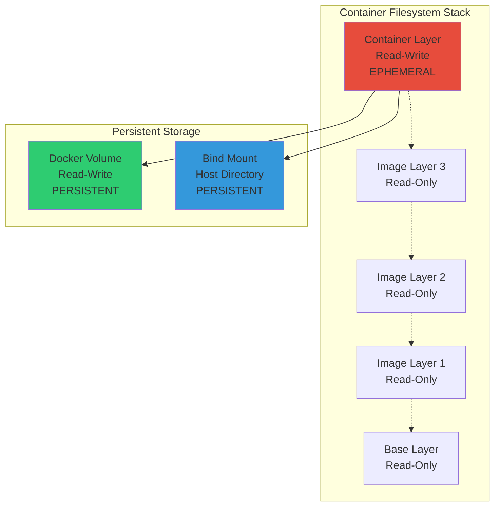
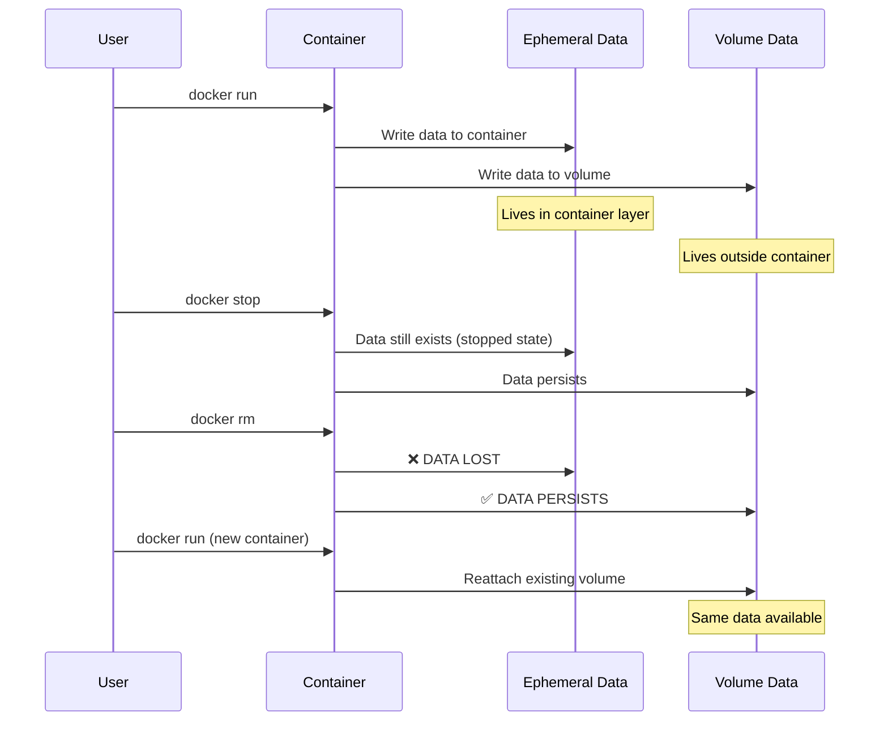
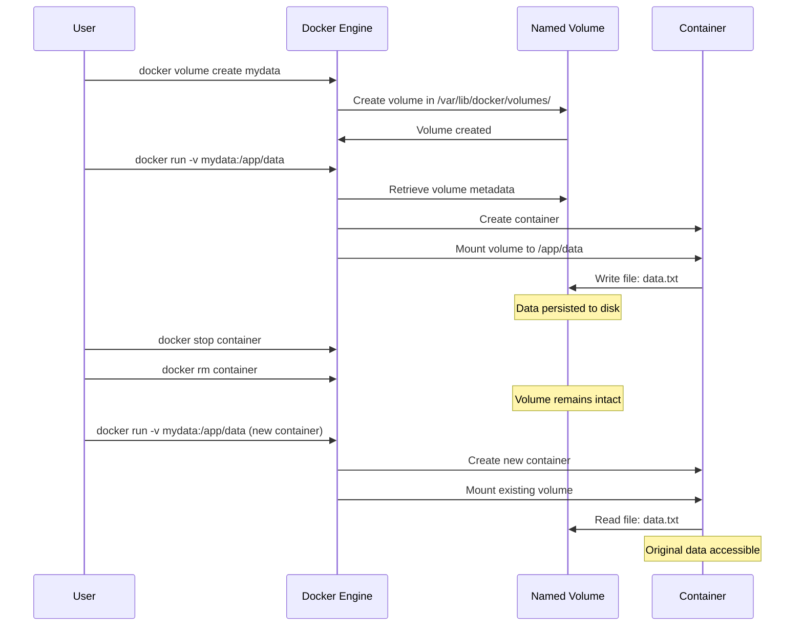
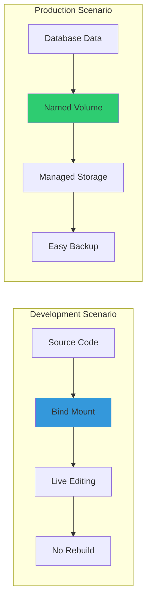
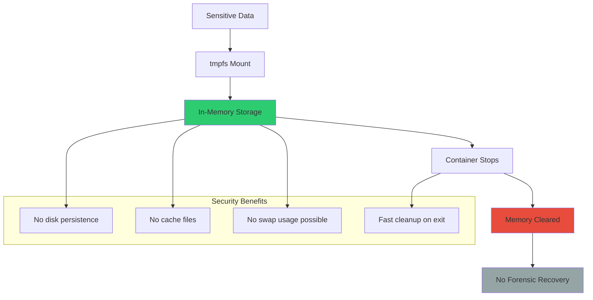
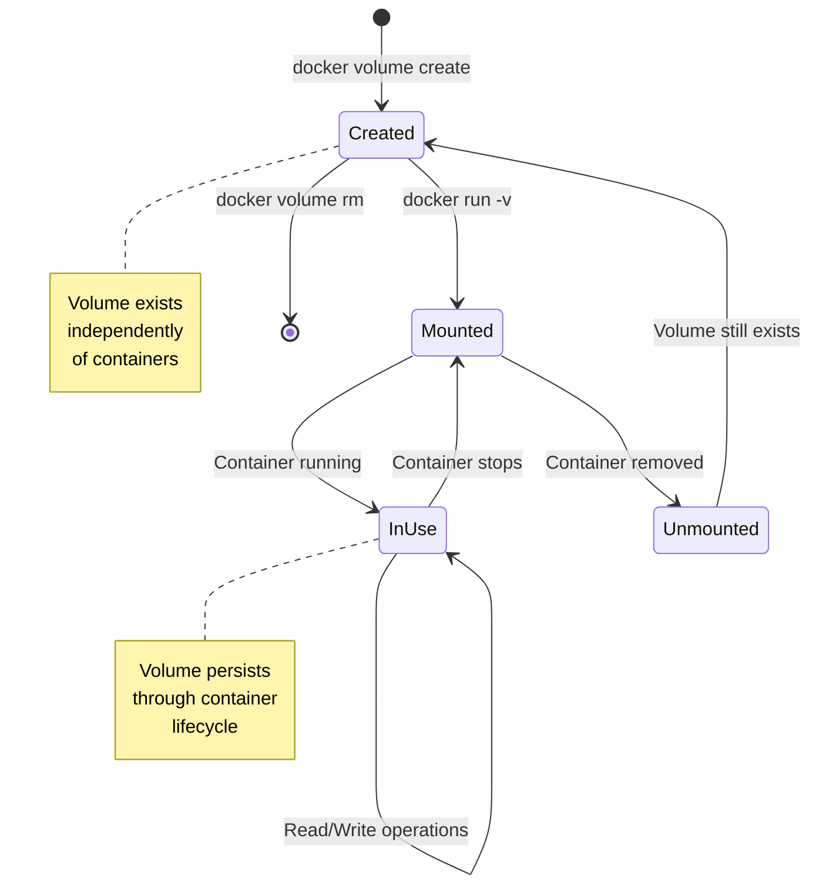
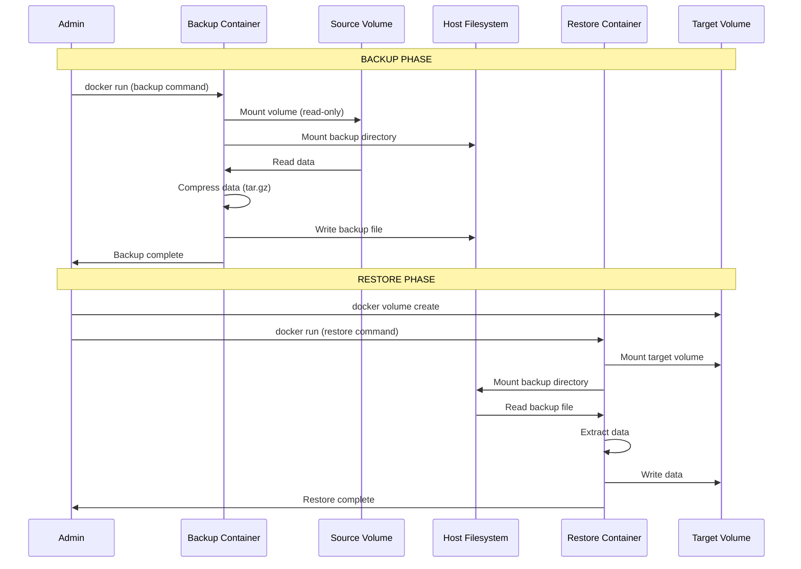
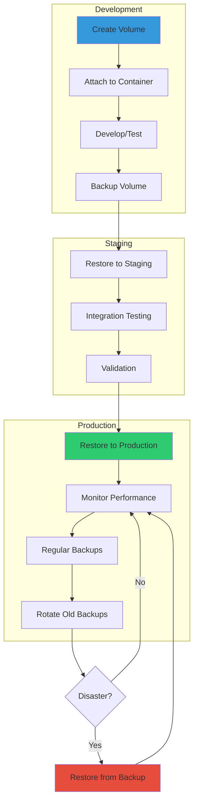
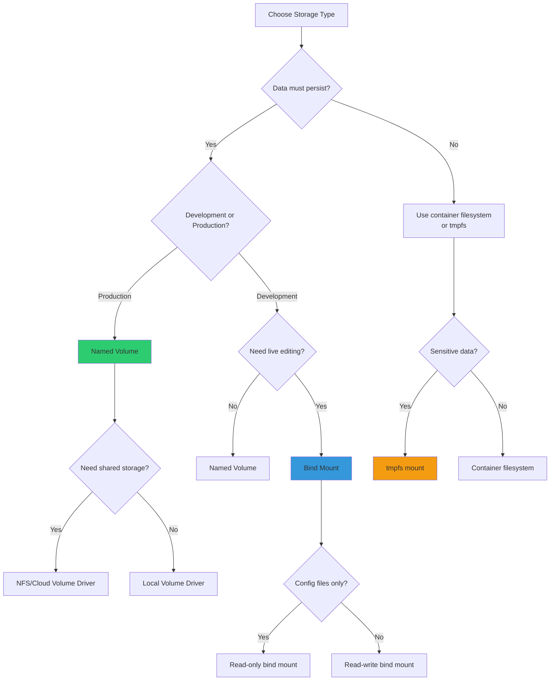

---
title:
  "{ Title }":
tags:
  - DevOps
  - DocKer
created:
  "{ date }":
updated:
  "{ date }":
---
# Docker Volume & Storage - Complete Reference Guide

```
╔════════════════════════════════════════════════════════════════╗
║                                                                ║
║   ██╗   ██╗ ██████╗ ██╗     ██╗   ██╗███╗   ███╗███████╗     ║
║   ██║   ██║██╔═══██╗██║     ██║   ██║████╗ ████║██╔════╝     ║
║   ██║   ██║██║   ██║██║     ██║   ██║██╔████╔██║█████╗       ║
║   ╚██╗ ██╔╝██║   ██║██║     ██║   ██║██║╚██╔╝██║██╔══╝       ║
║    ╚████╔╝ ╚██████╔╝███████╗╚██████╔╝██║ ╚═╝ ██║███████╗     ║
║     ╚═══╝   ╚═════╝ ╚══════╝ ╚═════╝ ╚═╝     ╚═╝╚══════╝     ║
║                                                                ║
║            Data Persistence & Storage Management              ║
║                                                                ║
╚════════════════════════════════════════════════════════════════╝
```

---

## Table of Contents

1. [Storage Fundamentals](https://claude.ai/chat/ccc747c5-c7ba-45c1-8ef0-6f9e4b64f666#storage-fundamentals)
2. [Volume Types Overview](https://claude.ai/chat/ccc747c5-c7ba-45c1-8ef0-6f9e4b64f666#volume-types-overview)
3. [Named Volumes](https://claude.ai/chat/ccc747c5-c7ba-45c1-8ef0-6f9e4b64f666#named-volumes)
4. [Bind Mounts](https://claude.ai/chat/ccc747c5-c7ba-45c1-8ef0-6f9e4b64f666#bind-mounts)
5. [tmpfs Mounts](https://claude.ai/chat/ccc747c5-c7ba-45c1-8ef0-6f9e4b64f666#tmpfs-mounts)
6. [Volume Drivers](https://claude.ai/chat/ccc747c5-c7ba-45c1-8ef0-6f9e4b64f666#volume-drivers)
7. [Storage Architecture](https://claude.ai/chat/ccc747c5-c7ba-45c1-8ef0-6f9e4b64f666#storage-architecture)
8. [Volume Management](https://claude.ai/chat/ccc747c5-c7ba-45c1-8ef0-6f9e4b64f666#volume-management)
9. [Data Backup and Restore](https://claude.ai/chat/ccc747c5-c7ba-45c1-8ef0-6f9e4b64f666#data-backup-and-restore)
10. [Performance Optimization](https://claude.ai/chat/ccc747c5-c7ba-45c1-8ef0-6f9e4b64f666#performance-optimization)
11. [Production Patterns](https://claude.ai/chat/ccc747c5-c7ba-45c1-8ef0-6f9e4b64f666#production-patterns)
12. [Interview Preparation](https://claude.ai/chat/ccc747c5-c7ba-45c1-8ef0-6f9e4b64f666#interview-preparation)

---

## Storage Fundamentals

### The Container Storage Problem

```ascii
┌────────────────────────────────────────────────────────────┐
│            WHY VOLUMES ARE NECESSARY                       │
├────────────────────────────────────────────────────────────┤
│                                                            │
│  Problem: Container filesystems are ephemeral             │
│                                                            │
│  ┌──────────────┐                                         │
│  │  Container   │  When container stops/removed:          │
│  │  Filesystem  │  → All data inside is LOST              │
│  │  (Writable   │  → No persistence across restarts       │
│  │   Layer)     │  → Cannot share data between containers │
│  └──────────────┘                                         │
│                                                            │
│  Solution: Docker Volumes                                 │
│                                                            │
│  ┌──────────────┐     ┌──────────────┐                   │
│  │  Container   │────▶│   Volume     │                   │
│  │  (Temporary) │     │  (Persistent)│                   │
│  └──────────────┘     └──────────────┘                   │
│                                                            │
│  Benefits:                                                │
│  ✓ Data survives container lifecycle                     │
│  ✓ Share data between containers                         │
│  ✓ Better I/O performance                                │
│  ✓ Backup and migration capabilities                     │
│                                                            │
└────────────────────────────────────────────────────────────┘
```

### Container Filesystem Layers



### Storage Lifecycle Comparison



---

## Volume Types Overview

### Three Primary Storage Types

```markmap
# Docker Storage Types
## Named Volumes
### Managed by Docker
### Stored in Docker area
### Best for production
### Easy backup/restore
### Platform independent
## Bind Mounts
### Direct host mapping
### Full path specification
### Development workflows
### Configuration injection
### Host file access
## tmpfs Mounts
### In-memory storage
### Ephemeral by design
### High performance
### Security sensitive data
### Linux only
```

### Storage Type Comparison Matrix

|Feature|Named Volume|Bind Mount|tmpfs Mount|
|---|---|---|---|
|**Management**|Docker managed|User managed|Docker managed|
|**Location**|`/var/lib/docker/volumes/`|User-specified path|RAM|
|**Portability**|High|Low|High|
|**Performance**|Good|Good|Excellent|
|**Persistence**|Yes|Yes|No|
|**Backup**|Easy (Docker tools)|Manual (host tools)|N/A|
|**Platform**|All|All|Linux only|
|**Use Case**|Production databases|Development|Sensitive temp data|
|**Sharing**|Between containers|Host ↔ Container|Single container|
|**Permissions**|Docker controls|Host controls|N/A|

### Storage Architecture Overview

```
┌─────────────────────────────────────────────────────────────┐
│                     Docker Host                             │
│                                                             │
│  ┌────────────────────────────────────────────────────┐    │
│  │         /var/lib/docker/volumes/                   │    │
│  │         (Docker Managed Area)                      │    │
│  │                                                    │    │
│  │  ┌──────────────┐   ┌──────────────┐             │    │
│  │  │ myapp_data   │   │ db_volume    │  Named      │    │
│  │  │ (Volume 1)   │   │ (Volume 2)   │  Volumes    │    │
│  │  └──────────────┘   └──────────────┘             │    │
│  └────────────────────────────────────────────────────┘    │
│                                                             │
│  ┌────────────────────────────────────────────────────┐    │
│  │         /home/user/project/                        │    │
│  │         (User Directory)                           │    │
│  │                                                    │    │
│  │  ┌──────────────┐   ┌──────────────┐             │    │
│  │  │    code/     │   │   config/    │   Bind      │    │
│  │  │  (Directory) │   │  (Directory) │   Mounts    │    │
│  │  └──────────────┘   └──────────────┘             │    │
│  └────────────────────────────────────────────────────┘    │
│                                                             │
│  ┌────────────────────────────────────────────────────┐    │
│  │              RAM (tmpfs)                           │    │
│  │                                                    │    │
│  │  ┌──────────────┐   ┌──────────────┐             │    │
│  │  │  secrets/    │   │   cache/     │   tmpfs     │    │
│  │  │  (In-Memory) │   │  (In-Memory) │   Mounts    │    │
│  │  └──────────────┘   └──────────────┘             │    │
│  └────────────────────────────────────────────────────┘    │
└─────────────────────────────────────────────────────────────┘
```

---

## Named Volumes

### What Are Named Volumes?

Named volumes are Docker-managed storage locations that persist data independently of container lifecycle. They are the recommended mechanism for production data persistence.

**Key Characteristics:**

- Fully managed by Docker
- Stored in `/var/lib/docker/volumes/` on Linux
- Referenced by name, not path
- Platform-independent
- Optimized for performance
- Easy backup and restoration
- Support for volume drivers

### Named Volume Architecture

```
┌─────────────────────────────────────────────────────────────┐
│                    Docker Engine                            │
│                                                             │
│  ┌──────────────────────────────────────────────────┐      │
│  │           Volume Management System               │      │
│  │                                                  │      │
│  │  Volume Metadata:                                │      │
│  │  - Name: postgres_data                           │      │
│  │  - Driver: local                                 │      │
│  │  - Mountpoint: /var/lib/docker/volumes/...      │      │
│  │  - Created: 2025-12-21T10:30:00Z                │      │
│  │  - Labels: {"env": "production"}                │      │
│  └──────────────────────────────────────────────────┘      │
│                         │                                   │
│                         ▼                                   │
│  ┌──────────────────────────────────────────────────┐      │
│  │     /var/lib/docker/volumes/postgres_data/       │      │
│  │                                                  │      │
│  │     _data/                                       │      │
│  │     ├── base/                                    │      │
│  │     ├── global/                                  │      │
│  │     ├── pg_wal/                                  │      │
│  │     └── postgresql.conf                          │      │
│  └──────────────────────────────────────────────────┘      │
│                         │                                   │
│                         ▼                                   │
│  ┌──────────────────────────────────────────────────┐      │
│  │            PostgreSQL Container                  │      │
│  │                                                  │      │
│  │  Mount: /var/lib/postgresql/data                │      │
│  │         ↓                                        │      │
│  │  Mapped to: postgres_data volume                │      │
│  └──────────────────────────────────────────────────┘      │
└─────────────────────────────────────────────────────────────┘
```

### Creating Named Volumes

#### Method 1: Explicit Creation

```bash
# Create a named volume
docker volume create my_volume

# Create with specific driver
docker volume create --driver local my_volume

# Create with labels
docker volume create \
  --label env=production \
  --label app=database \
  db_volume

# Create with driver options
docker volume create \
  --driver local \
  --opt type=nfs \
  --opt o=addr=192.168.1.100,rw \
  --opt device=:/path/to/dir \
  nfs_volume
```

#### Method 2: Implicit Creation (During docker run)

```bash
# Volume auto-created if it doesn't exist
docker run -d \
  --name postgres \
  -v postgres_data:/var/lib/postgresql/data \
  postgres:15

# Docker automatically creates 'postgres_data' volume
```

### Using Named Volumes

#### Basic Volume Mounting

```bash
# Mount named volume to container path
docker run -d \
  --name myapp \
  -v myapp_data:/app/data \
  myapp:latest

# Mount multiple volumes
docker run -d \
  --name webapp \
  -v app_data:/app/data \
  -v app_logs:/app/logs \
  -v app_config:/app/config \
  webapp:latest

# Read-only volume
docker run -d \
  --name readonly_app \
  -v config_volume:/app/config:ro \
  myapp:latest
```

#### Named Volume with MySQL Example

```bash
# Create volume
docker volume create mysql_data

# Run MySQL with persistent storage
docker run -d \
  --name mysql \
  -e MYSQL_ROOT_PASSWORD=secretpass \
  -e MYSQL_DATABASE=appdb \
  -v mysql_data:/var/lib/mysql \
  mysql:8

# Verify data persistence
docker exec mysql mysql -uroot -psecretpass -e "CREATE DATABASE testdb;"

# Stop and remove container
docker stop mysql
docker rm mysql

# Start new container with same volume
docker run -d \
  --name mysql_new \
  -e MYSQL_ROOT_PASSWORD=secretpass \
  -v mysql_data:/var/lib/mysql \
  mysql:8

# Data still exists
docker exec mysql_new mysql -uroot -psecretpass -e "SHOW DATABASES;"
```

### Named Volume Data Flow



### Named Volume Advantages

```ascii
╔════════════════════════════════════════════════════════════╗
║              NAMED VOLUME BENEFITS                         ║
╠════════════════════════════════════════════════════════════╣
║                                                            ║
║  ✓ Platform Independence                                  ║
║    Works on Windows, Linux, macOS without path changes    ║
║                                                            ║
║  ✓ Docker-Managed Lifecycle                               ║
║    Automatic creation, easy cleanup, metadata tracking    ║
║                                                            ║
║  ✓ Better Performance                                     ║
║    Optimized for container I/O operations                 ║
║                                                            ║
║  ✓ Flexible Drivers                                       ║
║    Support for NFS, cloud storage, custom backends        ║
║                                                            ║
║  ✓ Easy Backup/Restore                                    ║
║    Docker-native tools for volume management              ║
║                                                            ║
║  ✓ Container Portability                                  ║
║    Move containers across hosts with volume migration     ║
║                                                            ║
║  ✓ Security Isolation                                     ║
║    No direct host filesystem access                       ║
║                                                            ║
╚════════════════════════════════════════════════════════════╝
```

---

## Bind Mounts

### What Are Bind Mounts?

Bind mounts map a specific host directory or file directly into a container. The container sees the host filesystem location as if it were its own.

**Key Characteristics:**

- Direct host path mapping
- Host manages permissions and ownership
- Real-time file synchronization
- Full host filesystem access
- Development-friendly
- Platform-dependent paths
- No Docker management overhead

### Bind Mount Architecture

```
┌─────────────────────────────────────────────────────────────┐
│                      Host Machine                           │
│                                                             │
│  ┌──────────────────────────────────────────────────┐      │
│  │      /home/user/project/                         │      │
│  │                                                  │      │
│  │      src/                                        │      │
│  │      ├── app.py                                  │      │
│  │      ├── models.py                               │      │
│  │      └── utils.py                                │      │
│  │                                                  │      │
│  │      config/                                     │      │
│  │      └── settings.json                           │      │
│  └──────────────────────────────────────────────────┘      │
│              │                     │                        │
│              │  Bind Mount         │  Bind Mount            │
│              ▼                     ▼                        │
│  ┌──────────────────────────────────────────────────┐      │
│  │            Container Filesystem                  │      │
│  │                                                  │      │
│  │      /app/src/           /app/config/           │      │
│  │      ├── app.py          └── settings.json      │      │
│  │      ├── models.py                               │      │
│  │      └── utils.py                                │      │
│  │                                                  │      │
│  │      Same files, same inode!                    │      │
│  └──────────────────────────────────────────────────┘      │
│                                                             │
│  Changes in container immediately visible on host          │
│  Changes on host immediately visible in container          │
└─────────────────────────────────────────────────────────────┘
```

### Creating Bind Mounts

#### Absolute Path Syntax

```bash
# Basic bind mount (Linux/macOS)
docker run -d \
  --name dev_container \
  -v /home/user/project:/app \
  myapp:latest

# Windows absolute path
docker run -d \
  --name dev_container \
  -v C:\Users\user\project:/app \
  myapp:latest

# Multiple bind mounts
docker run -d \
  --name webapp \
  -v /home/user/project/src:/app/src \
  -v /home/user/project/config:/app/config \
  -v /home/user/project/logs:/app/logs \
  webapp:latest
```

#### Relative Path with PWD

```bash
# Current directory as bind mount
docker run -d \
  --name dev_env \
  -v $(pwd):/app \
  python:3.11

# Current directory (Windows PowerShell)
docker run -d \
  --name dev_env \
  -v ${PWD}:/app \
  python:3.11
```

#### Read-Only Bind Mounts

```bash
# Mount as read-only
docker run -d \
  --name readonly_app \
  -v /host/config:/app/config:ro \
  myapp:latest

# Container cannot modify host files
docker exec readonly_app touch /app/config/test.txt
# Error: Read-only file system
```


### Bind Mount Use Cases

#### Development Workflow

```bash
# Live code editing without rebuilding image
docker run -it --rm \
  --name flask_dev \
  -v $(pwd)/src:/app \
  -p 5000:5000 \
  python:3.11 \
  bash -c "cd /app && pip install flask && python app.py"

# Edit files on host
vim src/app.py

# Changes immediately reflected in container
# No rebuild required
```

#### Configuration Injection

```bash
# Inject configuration file
docker run -d \
  --name nginx \
  -v /host/nginx.conf:/etc/nginx/nginx.conf:ro \
  -p 80:80 \
  nginx:latest

# Inject environment-specific configs
docker run -d \
  --name app_production \
  -v /configs/production/app.conf:/app/config/app.conf:ro \
  myapp:latest
```

#### Log Collection

```bash
# Mount log directory for host access
docker run -d \
  --name app \
  -v /host/logs:/app/logs \
  myapp:latest

# Access logs from host
tail -f /host/logs/app.log
```

### Bind Mount Permissions

```ascii
┌────────────────────────────────────────────────────────────┐
│              BIND MOUNT PERMISSION FLOW                    │
├────────────────────────────────────────────────────────────┤
│                                                            │
│  Host:                                                     │
│  /home/user/data/  (UID: 1000, GID: 1000)                │
│         │                                                  │
│         │ Bind Mount                                       │
│         ▼                                                  │
│  Container:                                                │
│  /app/data/        (Appears with same UID/GID)           │
│                                                            │
│  Issue: Container process runs as UID 0 (root)            │
│         Host files owned by UID 1000 (user)               │
│                                                            │
│  Solution 1: Run container as matching UID                 │
│  docker run --user 1000:1000 ...                          │
│                                                            │
│  Solution 2: Change host permissions                       │
│  chown -R 1000:1000 /host/data/                           │
│                                                            │
│  Solution 3: Use volume (Docker manages permissions)      │
│  docker run -v named_volume:/app/data ...                 │
│                                                            │
└────────────────────────────────────────────────────────────┘
```

### Bind Mount vs Named Volume Comparison



### Bind Mount Pitfalls

```markmap
# Bind Mount Common Issues
## Path Dependencies
### Hard-coded host paths
### Platform-specific separators
### Breaks portability
### Solution: Use relative paths or volumes
## Permission Conflicts
### UID/GID mismatch
### Access denied errors
### Solution: --user flag or chown
## Performance Issues
### Slow on non-Linux Docker Desktop
### File watching problems
### Solution: Use volumes or optimize FS
## Security Concerns
### Full host access
### Container escape risk
### Solution: Read-only mounts, minimal access
```

---

## tmpfs Mounts

### What Are tmpfs Mounts?

tmpfs mounts create storage in the host system's RAM. Data is never written to disk, exists only in memory, and is lost when the container stops.

**Key Characteristics:**

- In-memory storage only
- Extremely fast I/O
- No disk writes
- Data lost on container stop
- Linux-only feature
- Security for sensitive data
- No persistence by design

### tmpfs Architecture

```
┌─────────────────────────────────────────────────────────────┐
│                      Host Machine                           │
│                                                             │
│  ┌──────────────────────────────────────────────────┐      │
│  │              Physical RAM                        │      │
│  │              (Volatile Memory)                   │      │
│  │                                                  │      │
│  │  ┌────────────────────────────────────────┐     │      │
│  │  │     tmpfs Allocation                   │     │      │
│  │  │     (Memory-backed filesystem)         │     │      │
│  │  │                                        │     │      │
│  │  │  secrets/                              │     │      │
│  │  │  ├── api_key.txt                       │     │      │
│  │  │  ├── db_password.txt                   │     │      │
│  │  │  └── cert.pem                          │     │      │
│  │  └────────────────────────────────────────┘     │      │
│  └──────────────────────────────────────────────────┘      │
│                         │                                   │
│                         │ tmpfs Mount                       │
│                         ▼                                   │
│  ┌──────────────────────────────────────────────────┐      │
│  │            Container Filesystem                  │      │
│  │                                                  │      │
│  │  /run/secrets/                                   │      │
│  │  ├── api_key.txt                                 │      │
│  │  ├── db_password.txt                             │      │
│  │  └── cert.pem                                    │      │
│  │                                                  │      │
│  │  Application reads from RAM                     │      │
│  │  Never written to disk                          │      │
│  └──────────────────────────────────────────────────┘      │
│                                                             │
│  Container stops → RAM cleared → Data gone                 │
└─────────────────────────────────────────────────────────────┘
```

### Creating tmpfs Mounts

```bash
# Basic tmpfs mount
docker run -d \
  --name secure_app \
  --tmpfs /run/secrets \
  myapp:latest

# tmpfs with size limit
docker run -d \
  --name limited_app \
  --tmpfs /tmp:size=100m \
  myapp:latest

# tmpfs with specific mode
docker run -d \
  --name restricted_app \
  --tmpfs /run/secrets:mode=1770 \
  myapp:latest

# Multiple tmpfs mounts
docker run -d \
  --name multi_tmpfs \
  --tmpfs /tmp \
  --tmpfs /run/secrets:size=50m \
  --tmpfs /cache:mode=1777 \
  myapp:latest
```

### tmpfs Use Cases

#### Sensitive Data Handling

```bash
# Store API keys in memory only
docker run -d \
  --name api_service \
  --tmpfs /run/secrets:mode=0700 \
  -e API_KEY_FILE=/run/secrets/api.key \
  api-app:latest

# Application reads from tmpfs
# No disk traces of sensitive data
```

#### High-Performance Caching

```bash
# Fast temporary cache
docker run -d \
  --name cache_service \
  --tmpfs /cache:size=500m \
  redis:latest \
  redis-server --dir /cache
```

#### Build-Time Artifacts

```bash
# Temporary build files
docker run --rm \
  --name builder \
  --tmpfs /tmp/build:size=1g \
  -v $(pwd)/output:/output \
  build-image:latest
```

### tmpfs vs Disk Storage Performance

```ascii
┌────────────────────────────────────────────────────────────┐
│              I/O PERFORMANCE COMPARISON                    │
├────────────────────────────────────────────────────────────┤
│                                                            │
│  Storage Type    │  Read Speed  │  Write Speed            │
│  ───────────────────────────────────────────────────      │
│                                                            │
│  tmpfs (RAM)     │  10-20 GB/s  │  10-20 GB/s            │
│  ████████████████████████████████████████████             │
│                                                            │
│  SSD Volume      │   500 MB/s   │   300 MB/s             │
│  ████████████                                             │
│                                                            │
│  HDD Volume      │   150 MB/s   │   100 MB/s             │
│  ███                                                      │
│                                                            │
│  Network Storage │    50 MB/s   │    30 MB/s             │
│  █                                                        │
│                                                            │
│  tmpfs is 20-400x faster than disk storage                │
│                                                            │
└────────────────────────────────────────────────────────────┘
```

### tmpfs Security Benefits



---

## Volume Drivers

### Understanding Volume Drivers

Volume drivers extend Docker's storage capabilities beyond the local filesystem, enabling integration with cloud storage, network filesystems, and specialized storage solutions.

**Default Driver:** `local` (host-based storage)

**Available Drivers:**

- **local** - Default, host filesystem storage
- **nfs** - Network File System
- **cifs/smb** - Windows file sharing
- **aws-ebs** - Amazon Elastic Block Store
- **azure-file** - Azure Files
- **gce-persistent-disk** - Google Compute Engine
- **glusterfs** - Distributed filesystem
- **ceph** - Distributed storage
- **flocker** - Container data volume manager

### Volume Driver Architecture

```
┌─────────────────────────────────────────────────────────────┐
│                    Docker Host                              │
│                                                             │
│  ┌──────────────────────────────────────────────────┐      │
│  │          Docker Volume Management                │      │
│  │                                                  │      │
│  │  Volume: db_data                                 │      │
│  │  Driver: nfs                                     │      │
│  │  Options:                                        │      │
│  │    - addr: 192.168.1.100                         │      │
│  │    - device: :/exports/data                      │      │
│  └──────────────────────────────────────────────────┘      │
│                         │                                   │
│                         ▼                                   │
│  ┌──────────────────────────────────────────────────┐      │
│  │          Volume Driver (NFS Plugin)              │      │
│  │                                                  │      │
│  │  - Mount NFS share                               │      │
│  │  - Handle I/O operations                         │      │
│  │  - Manage connections                            │      │
│  └──────────────────────────────────────────────────┘      │
│                         │                                   │
│                         │ Network                           │
└─────────────────────────┼───────────────────────────────────┘
                          │
                          ▼
┌─────────────────────────────────────────────────────────────┐
│                   NFS Server (192.168.1.100)                │
│                                                             │
│  /exports/data/                                             │
│  ├── database files                                         │
│  ├── application data                                       │
│  └── shared resources                                       │
└─────────────────────────────────────────────────────────────┘
```

### Using Volume Drivers

#### NFS Volume

```bash
# Create NFS volume
docker volume create \
  --driver local \
  --opt type=nfs \
  --opt o=addr=192.168.1.100,rw,nfsvers=4 \
  --opt device=:/exports/data \
  nfs_volume

# Use NFS volume
docker run -d \
  --name app \
  -v nfs_volume:/app/data \
  myapp:latest

# Multiple hosts can share same NFS volume
# Enables shared storage across cluster
```

#### Cloud Storage Example (AWS EBS)

```bash
# Using AWS EBS volume driver (requires plugin)
docker volume create \
  --driver rexray/ebs \
  --opt size=50 \
  --opt volumetype=gp3 \
  --opt iops=3000 \
  aws_ebs_volume

# Container uses cloud-backed storage
docker run -d \
  --name database \
  -v aws_ebs_volume:/var/lib/mysql \
  mysql:8
```

### Volume Driver Use Cases

```markmap
# Volume Driver Scenarios
## Multi-Host Storage
### Shared data across Docker hosts
### NFS, GlusterFS, Ceph
### Container migration
### High availability
## Cloud Integration
### AWS EBS, Azure Disk, GCP PD
### Cloud-native storage
### Automatic snapshots
### Geo-replication
## Performance Optimization
### SSD-backed volumes
### Low-latency storage
### High IOPS requirements
### Specialized hardware
## Backup and DR
### Automated snapshots
### Cross-region replication
### Point-in-time recovery
### Disaster recovery
```

---

## Storage Architecture

### Docker Storage Driver vs Volume Driver

```ascii
╔════════════════════════════════════════════════════════════╗
║         STORAGE DRIVER vs VOLUME DRIVER                    ║
╠════════════════════════════════════════════════════════════╣
║                                                            ║
║  Storage Driver (Graphdriver)                              ║
║  ────────────────────────────                              ║
║  • Manages container image layers                          ║
║  • Controls writable container layer                       ║
║  • Examples: overlay2, aufs, devicemapper                  ║
║  • Not for data persistence                                ║
║  • Performance impact on container operations              ║
║                                                            ║
║  Volume Driver (Plugin)                                    ║
║  ──────────────────────                                    ║
║  • Manages persistent data volumes                         ║
║  • Handles volume lifecycle                                ║
║  • Examples: local, nfs, aws-ebs, azure-file               ║
║  • Data persistence and sharing                            ║
║  • Independent of container lifecycle                      ║
║                                                            ║
╚════════════════════════════════════════════════════════════╝
```

### Complete Storage Stack

```
┌─────────────────────────────────────────────────────────────┐
│                Application Container                        │
│                                                             │
│  ┌──────────────┐  ┌──────────────┐  ┌──────────────┐     │
│  │   /app/data  │  │  /app/logs   │  │  /tmp        │     │
│  │  (Volume)    │  │  (Bind)      │  │  (tmpfs)     │     │
│  └──────┬───────┘  └──────┬───────┘  └──────┬───────┘     │
│         │                  │                  │             │
└─────────┼──────────────────┼──────────────────┼─────────────┘
          │                  │                  │
          ▼                  ▼                  ▼
┌─────────────────────────────────────────────────────────────┐
│                   Docker Engine                             │
│                                                             │
│  ┌──────────────┐  ┌──────────────┐  ┌──────────────┐     │
│  │Volume Driver │  │Bind Mount    │  │tmpfs Handler │     │
│  │  (Plugin)    │  │  (Direct)    │  │  (Memory)    │     │
│  └──────┬───────┘  └──────┬───────┘  └──────┬───────┘     │
│         │                  │                  │             │
└─────────┼──────────────────┼──────────────────┼─────────────┘
          │                  │                  │
          ▼                  ▼                  ▼
┌─────────────────────────────────────────────────────────────┐
│                   Host Operating System                     │
│                                                             │
│  ┌──────────────┐  ┌──────────────┐  ┌──────────────┐     │
│  │ /var/lib/    │  │ /host/path   │  │    RAM       │     │
│  │ docker/      │  │              │  │              │     │
│  │ volumes/     │  │              │  │              │     │
│  └──────┬───────┘  └──────┬───────┘  └──────┬───────┘     │
│         │                  │                  │             │
└─────────┼──────────────────┼──────────────────┼─────────────┘
          │                  │                  │
          ▼                  ▼                  ▼
┌─────────────────────────────────────────────────────────────┐
│              Physical Storage Layer                         │
│                                                             │
│  ┌──────────────┐  ┌──────────────┐  ┌──────────────┐     │
│  │     SSD      │  │     HDD      │  │Physical RAM  │     │
│  │   (Local)    │  │   (Local)    │  │  (Volatile)  │     │
│  └──────────────┘  └──────────────┘  └──────────────┘     │
└─────────────────────────────────────────────────────────────┘
```

### Volume Lifecycle Management



---

## Volume Management

### Volume Management Commands

#### Listing Volumes

```bash
# List all volumes
docker volume ls

# List with filters
docker volume ls --filter "dangling=true"
docker volume ls --filter "name=mysql"
docker volume ls --filter "driver=local"

# Format output
docker volume ls --format "table {{.Name}}\t{{.Driver}}\t{{.Mountpoint}}"

# Show volume usage
docker system df -v
```

#### Inspecting Volumes

```bash
# Inspect volume details
docker volume inspect my_volume

# Output (JSON format):
# [
#     {
#         "CreatedAt": "2025-12-21T10:30:00Z",
#         "Driver": "local",
#         "Labels": {},
#         "Mountpoint": "/var/lib/docker/volumes/my_volume/_data",
#         "Name": "my_volume",
#         "Options": {},
#         "Scope": "local"
#     }
# ]

# Pretty print
docker volume inspect my_volume --format '{{json .}}' | jq

# Get specific field
docker volume inspect my_volume --format '{{.Mountpoint}}'
```

#### Removing Volumes

```bash
# Remove specific volume
docker volume rm my_volume

# Remove multiple volumes
docker volume rm volume1 volume2 volume3

# Remove dangling volumes (not used by containers)
docker volume prune

# Remove all unused volumes
docker volume prune -a

# Force remove (even if in use - dangerous!)
docker volume rm -f my_volume
```

#### Cleaning Up Volumes

```bash
# Remove all stopped containers and their volumes
docker container prune
docker volume prune

# Remove everything (containers, volumes, networks, images)
docker system prune -a --volumes

# Check disk usage before cleanup
docker system df

# Check disk usage after cleanup
docker system df
```

### Volume Inspection Deep Dive

```bash
# Create test volume
docker volume create test_volume

# Inspect full details
docker volume inspect test_volume

# Check physical location
sudo ls -la /var/lib/docker/volumes/test_volume/

# Output:
# drwx-----x 3 root root 4096 Dec 21 10:30 .
# drwx--x--x 5 root root 4096 Dec 21 10:30 ..
# drwxr-xr-x 2 root root 4096 Dec 21 10:30 _data

# View actual data
sudo ls -la /var/lib/docker/volumes/test_volume/_data/

# Create data in volume
docker run --rm -v test_volume:/data alpine sh -c "echo 'Hello' > /data/test.txt"

# Verify data exists
sudo cat /var/lib/docker/volumes/test_volume/_data/test.txt
# Output: Hello
```

### Finding Orphaned Volumes

```bash
# List all volumes
docker volume ls -q

# List volumes in use
docker ps -a --format '{{.Mounts}}' | grep -o '[^,]*' | sort -u

# Find dangling volumes (not used)
docker volume ls -qf dangling=true

# Script to find truly orphaned volumes
#!/bin/bash
all_volumes=$(docker volume ls -q)
used_volumes=$(docker ps -a --format '{{.Mounts}}' | grep -o '[^,]*' | sort -u)

for vol in $all_volumes; do
    if ! echo "$used_volumes" | grep -q "$vol"; then
        echo "Orphaned: $vol"
    fi
done
```

---

## Data Backup and Restore

### Backup Strategies

#### Method 1: Volume Backup Using Container

```bash
# Backup named volume to tar file
docker run --rm \
  -v postgres_data:/source:ro \
  -v $(pwd):/backup \
  alpine \
  tar czf /backup/postgres_backup_$(date +%Y%m%d_%H%M%S).tar.gz -C /source .

# Explanation:
# - Mount source volume as read-only
# - Mount backup destination (host directory)
# - Use alpine container to create compressed archive
# - Timestamp in filename for versioning
```

#### Method 2: Direct Volume Copy

```bash
# Create new volume from existing
docker run --rm \
  -v old_volume:/source:ro \
  -v new_volume:/dest \
  alpine \
  sh -c "cp -av /source/. /dest/"

# Verify copy
docker run --rm -v new_volume:/data alpine ls -la /data
```

#### Method 3: Database-Specific Backup

```bash
# MySQL dump backup
docker exec mysql \
  mysqldump -u root -p'password' --all-databases \
  > mysql_backup_$(date +%Y%m%d).sql

# PostgreSQL dump backup
docker exec postgres \
  pg_dumpall -U postgres \
  > postgres_backup_$(date +%Y%m%d).sql

# MongoDB dump backup
docker exec mongo \
  mongodump --out /backup/$(date +%Y%m%d)
```

### Backup Automation Script

```bash
#!/bin/bash
# volume-backup.sh

VOLUME_NAME="$1"
BACKUP_DIR="/backups/docker-volumes"
TIMESTAMP=$(date +%Y%m%d_%H%M%S)
BACKUP_FILE="${BACKUP_DIR}/${VOLUME_NAME}_${TIMESTAMP}.tar.gz"

# Create backup directory
mkdir -p "$BACKUP_DIR"

# Perform backup
echo "Backing up volume: $VOLUME_NAME"
docker run --rm \
  -v "${VOLUME_NAME}:/source:ro" \
  -v "${BACKUP_DIR}:/backup" \
  alpine \
  tar czf "/backup/${VOLUME_NAME}_${TIMESTAMP}.tar.gz" -C /source .

if [ $? -eq 0 ]; then
    echo "Backup successful: $BACKUP_FILE"
    
    # Optional: Remove backups older than 30 days
    find "$BACKUP_DIR" -name "${VOLUME_NAME}_*.tar.gz" -mtime +30 -delete
else
    echo "Backup failed!"
    exit 1
fi
```

### Restore Procedures

#### Method 1: Restore from Tar Archive

```bash
# Create new volume
docker volume create restored_volume

# Restore data from backup
docker run --rm \
  -v restored_volume:/target \
  -v $(pwd):/backup \
  alpine \
  sh -c "cd /target && tar xzf /backup/postgres_backup_20251221.tar.gz"

# Verify restored data
docker run --rm -v restored_volume:/data alpine ls -la /data
```

#### Method 2: Database Restore

```bash
# MySQL restore
docker exec -i mysql \
  mysql -u root -p'password' \
  < mysql_backup_20251221.sql

# PostgreSQL restore
docker exec -i postgres \
  psql -U postgres \
  < postgres_backup_20251221.sql

# MongoDB restore
docker exec mongo \
  mongorestore /backup/20251221
```

### Backup and Restore Workflow



### Backup Best Practices

```markmap
# Backup Best Practices
## Scheduling
### Automated cron jobs
### Off-peak hours
### Frequency based on RPO
### Retention policies
## Verification
### Test restores regularly
### Checksum validation
### Integrity checks
### Documentation
## Storage
### Off-site backups
### Multiple locations
### Encrypted storage
### Access controls
## Monitoring
### Backup success/failure alerts
### Storage capacity monitoring
### Backup age tracking
### Recovery time testing
```

---

## Performance Optimization

### Storage Performance Factors

```ascii
┌────────────────────────────────────────────────────────────┐
│           STORAGE PERFORMANCE HIERARCHY                    │
├────────────────────────────────────────────────────────────┤
│                                                            │
│  Performance  │  Storage Type         │  Use Case         │
│  (Fastest)                                  (Slowest)      │
│                                                            │
│  ████████████ │  tmpfs (RAM)          │  Temp cache       │
│               │  20 GB/s read/write   │  Secrets          │
│                                                            │
│  ██████████   │  Named Volume (SSD)   │  Databases        │
│               │  500 MB/s read/write  │  Production       │
│                                                            │
│  ████████     │  Bind Mount (SSD)     │  Development      │
│               │  300 MB/s             │  Code editing     │
│                                                            │
│  ████         │  Named Volume (HDD)   │  Archives         │
│               │  150 MB/s             │  Logs             │
│                                                            │
│  ██          │  NFS Network Storage  │  Shared data      │
│               │  50 MB/s              │  Multi-host       │
│                                                            │
│  █            │  Cloud Block Storage  │  Cloud workloads  │
│               │  Variable             │  Backups          │
│                                                            │
└────────────────────────────────────────────────────────────┘
```

### Volume Performance Tuning

#### I/O Optimization

```bash
# Use volume for better performance than bind mount
docker run -d \
  --name fast_db \
  -v db_data:/var/lib/mysql \
  mysql:8

# vs slower bind mount (especially on macOS/Windows)
docker run -d \
  --name slow_db \
  -v /host/path:/var/lib/mysql \
  mysql:8

# Use local driver with specific options
docker volume create \
  --driver local \
  --opt type=ext4 \
  --opt device=/dev/sdb1 \
  fast_volume
```

#### Resource Limits

```bash
# Limit I/O bandwidth
docker run -d \
  --name limited_io \
  --device-read-bps /dev/sda:10mb \
  --device-write-bps /dev/sda:5mb \
  -v data:/app/data \
  myapp:latest

# Limit I/O operations per second
docker run -d \
  --name limited_iops \
  --device-read-iops /dev/sda:1000 \
  --device-write-iops /dev/sda:500 \
  -v data:/app/data \
  myapp:latest
```

#### Storage Driver Selection

```bash
# Check current storage driver
docker info | grep "Storage Driver"

# Overlay2 is recommended for production (default on modern systems)
# Provides best performance for most workloads

# Configure in daemon.json
cat /etc/docker/daemon.json
{
  "storage-driver": "overlay2",
  "storage-opts": [
    "overlay2.override_kernel_check=true"
  ]
}
```

### Performance Testing

```bash
# Test volume write performance
docker run --rm \
  -v test_volume:/data \
  alpine \
  sh -c "dd if=/dev/zero of=/data/test.img bs=1M count=1000 oflag=direct"

# Test volume read performance
docker run --rm \
  -v test_volume:/data \
  alpine \
  sh -c "dd if=/data/test.img of=/dev/null bs=1M iflag=direct"

# Benchmark with fio
docker run --rm \
  -v test_volume:/data \
  ubuntu:20.04 \
  bash -c "apt-get update && apt-get install -y fio && \
    fio --name=random-write --ioengine=libaio --rw=randwrite \
    --bs=4k --size=1g --numjobs=4 --runtime=60 --time_based \
    --filename=/data/test"
```

### Performance Comparison Matrix

|Storage Type|Sequential Read|Sequential Write|Random Read|Random Write|Best For|
|---|---|---|---|---|---|
|tmpfs|20 GB/s|20 GB/s|15 GB/s|15 GB/s|Temp cache|
|Volume (NVMe)|3.5 GB/s|3.0 GB/s|500 MB/s|450 MB/s|Databases|
|Volume (SSD)|550 MB/s|520 MB/s|90 MB/s|80 MB/s|Production|
|Bind Mount (SSD)|300 MB/s|250 MB/s|50 MB/s|40 MB/s|Development|
|Volume (HDD)|150 MB/s|120 MB/s|1 MB/s|1 MB/s|Archives|
|NFS|100 MB/s|80 MB/s|10 MB/s|5 MB/s|Shared storage|

---

## Production Patterns

### Database Persistence Pattern

```yaml
# docker-compose.yml for production database
version: '3.8'

services:
  postgres:
    image: postgres:15
    environment:
      POSTGRES_PASSWORD: ${DB_PASSWORD}
      POSTGRES_USER: ${DB_USER}
      POSTGRES_DB: ${DB_NAME}
    volumes:
      # Named volume for data persistence
      - postgres_data:/var/lib/postgresql/data
      # Bind mount for custom config
      - ./postgres.conf:/etc/postgresql/postgresql.conf:ro
      # Named volume for WAL logs
      - postgres_wal:/var/lib/postgresql/wal
    restart: unless-stopped
    healthcheck:
      test: ["CMD-SHELL", "pg_isready -U ${DB_USER}"]
      interval: 10s
      timeout: 5s
      retries: 5

volumes:
  postgres_data:
    driver: local
    driver_opts:
      type: none
      o: bind
      device: /mnt/postgres/data
  postgres_wal:
    driver: local
    driver_opts:
      type: none
      o: bind
      device: /mnt/postgres/wal
```

### Multi-Stage Application Pattern

```yaml
version: '3.8'

services:
  app:
    build: .
    volumes:
      # Application data
      - app_data:/app/data
      # Logs
      - app_logs:/app/logs
      # Configuration (read-only)
      - ./config:/app/config:ro
      # Uploads
      - uploads:/app/uploads
    tmpfs:
      # Temporary processing
      - /tmp
      # Cache
      - /app/cache
    depends_on:
      - database
      - cache

  database:
    image: postgres:15
    volumes:
      - db_data:/var/lib/postgresql/data
    
  cache:
    image: redis:7
    volumes:
      - cache_data:/data

volumes:
  app_data:
  app_logs:
  uploads:
  db_data:
  cache_data:
```

### Volume Sharing Pattern

```ascii
┌────────────────────────────────────────────────────────────┐
│              SHARED VOLUME ARCHITECTURE                    │
├────────────────────────────────────────────────────────────┤
│                                                            │
│  ┌──────────────┐         ┌──────────────┐               │
│  │   App 1      │◄───────►│ shared_logs  │               │
│  │  Container   │         │   (Volume)   │               │
│  └──────────────┘         └──────────────┘               │
│                                   ▲                        │
│                                   │                        │
│  ┌──────────────┐                 │                       │
│  │   App 2      │─────────────────┘                       │
│  │  Container   │                                         │
│  └──────────────┘                 │                       │
│                                   │                        │
│  ┌──────────────┐                 │                       │
│  │  Log Agent   │─────────────────┘                       │
│  │  Container   │                                         │
│  └──────────────┘                                         │
│                                                            │
│  Multiple containers can read/write to same volume        │
│  Use cases: Log aggregation, shared cache, config         │
│                                                            │
└────────────────────────────────────────────────────────────┘
```

### Volume Lifecycle Management Pattern



### High Availability Pattern

```yaml
version: '3.8'

services:
  mysql-master:
    image: mysql:8
    environment:
      MYSQL_ROOT_PASSWORD: ${MYSQL_ROOT_PASSWORD}
    volumes:
      - mysql_master_data:/var/lib/mysql
      - ./mysql-master.cnf:/etc/mysql/conf.d/master.cnf:ro
    networks:
      - db_network

  mysql-replica:
    image: mysql:8
    environment:
      MYSQL_ROOT_PASSWORD: ${MYSQL_ROOT_PASSWORD}
    volumes:
      - mysql_replica_data:/var/lib/mysql
      - ./mysql-replica.cnf:/etc/mysql/conf.d/replica.cnf:ro
    networks:
      - db_network
    depends_on:
      - mysql-master

volumes:
  mysql_master_data:
    driver: local
    driver_opts:
      type: none
      o: bind
      device: /mnt/mysql/master
  mysql_replica_data:
    driver: local
    driver_opts:
      type: none
      o: bind
      device: /mnt/mysql/replica

networks:
  db_network:
    driver: bridge
```

---

## Interview Preparation

### Critical Concepts Checklist

```ascii
╔════════════════════════════════════════════════════════════╗
║         DOCKER VOLUME INTERVIEW CHECKLIST                  ║
╠════════════════════════════════════════════════════════════╣
║                                                            ║
║  [ ] Named volumes vs bind mounts differences             ║
║  [ ] When to use tmpfs mounts                             ║
║  [ ] Volume driver architecture                           ║
║  [ ] Data persistence across container lifecycle          ║
║  [ ] Volume backup and restore strategies                 ║
║  [ ] Performance implications of storage types            ║
║  [ ] Production storage patterns                          ║
║  [ ] Volume sharing between containers                    ║
║  [ ] Storage driver vs volume driver                      ║
║  [ ] Permission handling in volumes                       ║
║  [ ] NFS and cloud storage integration                    ║
║  [ ] Volume cleanup and orphaned volume detection         ║
║                                                            ║
╚════════════════════════════════════════════════════════════╝
```

### Common Interview Questions

#### Q1: Explain the difference between named volumes and bind mounts

**Answer:** Named volumes are Docker-managed storage locations in `/var/lib/docker/volumes/` that persist data independently of container lifecycle. They are platform-independent, easier to back up, and recommended for production.

Bind mounts directly map a host directory to a container path, providing real-time synchronization between host and container. They are path-dependent, better for development, but require manual management.

**Key Differences:**

- Named volumes: Docker-managed, portable, better performance on macOS/Windows
- Bind mounts: User-managed, direct host access, better for live code editing

**Production recommendation:** Use named volumes for databases and application data; use bind mounts only for configuration files and development workflows.

#### Q2: How do you ensure database data persists after container removal?

**Answer:** Use named volumes to store database data outside the container filesystem:

```bash
# Create named volume
docker volume create mysql_data

# Run database with volume
docker run -d \
  --name mysql \
  -v mysql_data:/var/lib/mysql \
  mysql:8

# Data persists even after:
docker rm -f mysql
```

The volume `mysql_data` continues to exist independently. When you create a new container with the same volume mount, all data is preserved.

**Best practices:**

- Use separate volumes for data and logs
- Implement regular backup strategies
- Test restore procedures
- Monitor volume disk usage

#### Q3: When would you use tmpfs mounts?

**Answer:** tmpfs mounts store data in RAM and are ideal for:

1. **Sensitive data** - API keys, passwords, certificates that shouldn't touch disk
2. **High-performance caching** - Temporary data requiring ultra-fast access
3. **Build artifacts** - Intermediate compilation files
4. **Session storage** - Web application session data

**Example:**

```bash
docker run -d \
  --name secure_app \
  --tmpfs /run/secrets:mode=0700,size=50m \
  myapp:latest
```

**Key advantage:** Data never written to disk, automatically cleared on container stop, no forensic recovery possible.

**Limitation:** Data lost on container restart, requires sufficient RAM.

#### Q4: How do you backup and restore Docker volumes?

**Answer:**

**Backup:**

```bash
docker run --rm \
  -v source_volume:/source:ro \
  -v $(pwd)/backups:/backup \
  alpine \
  tar czf /backup/volume_backup.tar.gz -C /source .
```

**Restore:**

```bash
docker volume create restored_volume
docker run --rm \
  -v restored_volume:/target \
  -v $(pwd)/backups:/backup \
  alpine \
  tar xzf /backup/volume_backup.tar.gz -C /target
```

**Database-specific approach:**

```bash
# MySQL backup
docker exec mysql mysqldump -u root -p --all-databases > backup.sql

# Restore
docker exec -i mysql mysql -u root -p < backup.sql
```

**Best practices:**

- Automate with cron jobs
- Test restores regularly
- Store backups off-site
- Implement retention policies

#### Q5: What are volume drivers and when would you use them?

**Answer:** Volume drivers extend Docker's storage capabilities beyond local filesystem to support network storage, cloud storage, and specialized systems.

**Common drivers:**

- **local** - Default, host filesystem
- **nfs** - Network File System for shared storage
- **aws-ebs, azure-file, gce-pd** - Cloud block storage
- **glusterfs, ceph** - Distributed storage systems

**Use case - NFS volume:**

```bash
docker volume create \
  --driver local \
  --opt type=nfs \
  --opt o=addr=192.168.1.100,rw \
  --opt device=:/exports/data \
  shared_volume
```

**Benefits:**

- Multi-host data sharing
- Cloud-native storage integration
- High availability and replication
- Centralized backup management

**When to use:**

- Docker Swarm clusters requiring shared state
- Cloud deployments with managed storage
- Multi-region data replication
- Enterprise storage infrastructure integration

#### Q6: How do you handle volume permissions issues?

**Answer:** Permission issues occur when container UID/GID doesn't match host file ownership:

**Problem:**

```bash
docker run -v /host/data:/app/data myapp
# Error: Permission denied
```

**Solutions:**

1. **Run container as specific user:**

```bash
docker run --user 1000:1000 -v /host/data:/app/data myapp
```

2. **Change host permissions:**

```bash
chown -R 1000:1000 /host/data
```

3. **Use named volumes (Docker manages permissions):**

```bash
docker run -v app_data:/app/data myapp
```

4. **Dockerfile USER directive:**

```dockerfile
USER 1000:1000
```

**Best practice:** Use named volumes for production to avoid permission complexities. Use bind mounts only when necessary with proper UID/GID mapping.

#### Q7: Explain the container filesystem layer architecture

**Answer:** Containers use a layered filesystem with copy-on-write:

**Layers (bottom to top):**

1. **Base image layer** (read-only) - e.g., ubuntu:20.04
2. **Dependency layers** (read-only) - RUN apt-get install
3. **Application layers** (read-only) - COPY app files
4. **Container layer** (read-write) - Runtime changes

**Key points:**

- All image layers are immutable and shared
- Container layer is ephemeral and unique per container
- Writes use copy-on-write mechanism
- Data in container layer is lost when container removed
- Volumes bypass the layered filesystem for better performance

**Why volumes are necessary:** Container layer is temporary. Volumes provide persistent storage outside this layer, surviving container lifecycle.

### Storage Decision Tree



### Performance Optimization Checklist

```markmap
# Storage Performance Optimization
## Volume Type Selection
### Use named volumes for databases
### Use tmpfs for cache
### Avoid bind mounts on macOS/Windows Docker Desktop
### Use local SSD for volume backing
## Configuration
### Choose overlay2 storage driver
### Tune filesystem options
### Enable direct I/O when possible
### Set appropriate block sizes
## Monitoring
### Track volume disk usage
### Monitor I/O metrics
### Set up alerts for capacity
### Benchmark regularly
## Maintenance
### Prune unused volumes
### Rotate logs
### Archive old data
### Defragment filesystems
```

### Production Best Practices

```ascii
┌────────────────────────────────────────────────────────────┐
│             PRODUCTION VOLUME BEST PRACTICES               │
├────────────────────────────────────────────────────────────┤
│                                                            │
│  1. Always use named volumes for persistent data          │
│     ✓ docker volume create for explicit creation          │
│     ✓ Document volume purposes                            │
│                                                            │
│  2. Implement backup automation                           │
│     ✓ Scheduled backup scripts                            │
│     ✓ Off-site backup storage                             │
│     ✓ Regular restore testing                             │
│                                                            │
│  3. Monitor volume health                                 │
│     ✓ Disk usage alerts                                   │
│     ✓ I/O performance metrics                             │
│     ✓ Backup success monitoring                           │
│                                                            │
│  4. Use appropriate storage drivers                       │
│     ✓ NFS for multi-host sharing                          │
│     ✓ Cloud storage for managed backups                   │
│     ✓ Local for single-host production                    │
│                                                            │
│  5. Secure sensitive data                                 │
│     ✓ tmpfs for secrets                                   │
│     ✓ Encrypted volumes                                   │
│     ✓ Access control policies                             │
│                                                            │
│  6. Plan for disaster recovery                            │
│     ✓ Documented restore procedures                       │
│     ✓ Regular DR drills                                   │
│     ✓ Geographic redundancy                               │
│                                                            │
│  7. Optimize for performance                              │
│     ✓ SSD-backed volumes                                  │
│     ✓ Separate volumes for data/logs                      │
│     ✓ Right-size volume allocation                        │
│                                                            │
└────────────────────────────────────────────────────────────┘
```

---

## Real-World Implementation Example

### Complete Production Setup

```yaml
# docker-compose.yml - Production-ready multi-tier application
version: '3.8'

services:
  # Web Application
  webapp:
    build: ./app
    volumes:
      # Application data (named volume)
      - app_data:/app/data
      # Upload storage
      - uploads:/app/uploads
      # Configuration (read-only bind mount)
      - ./config/app.conf:/app/config/app.conf:ro
      # Logs (named volume)
      - app_logs:/app/logs
    tmpfs:
      # Temporary processing
      - /tmp
      # Session cache
      - /app/cache:size=100m
    depends_on:
      postgres:
        condition: service_healthy
      redis:
        condition: service_started
    restart: unless-stopped
    networks:
      - frontend
      - backend

  # Database
  postgres:
    image: postgres:15
    environment:
      POSTGRES_USER: ${DB_USER}
      POSTGRES_PASSWORD: ${DB_PASSWORD}
      POSTGRES_DB: ${DB_NAME}
    volumes:
      # Database data (named volume on dedicated disk)
      - postgres_data:/var/lib/postgresql/data
      # WAL logs (separate volume)
      - postgres_wal:/var/lib/postgresql/wal
      # Custom configuration
      - ./config/postgresql.conf:/etc/postgresql/postgresql.conf:ro
      # Initialization scripts
      - ./init:/docker-entrypoint-initdb.d:ro
    restart: unless-stopped
    healthcheck:
      test: ["CMD-SHELL", "pg_isready -U ${DB_USER}"]
      interval: 10s
      timeout: 5s
      retries: 5
    networks:
      - backend

  # Cache
  redis:
    image: redis:7-alpine
    command: redis-server --appendonly yes
    volumes:
      # Redis persistence
      - redis_data:/data
      # Configuration
      - ./config/redis.conf:/usr/local/etc/redis/redis.conf:ro
    restart: unless-stopped
    networks:
      - backend

  # Log Aggregator
  fluentd:
    image: fluent/fluentd:latest
    volumes:
      # Shared log volumes
      - app_logs:/logs/app:ro
      # Fluentd configuration
      - ./config/fluentd.conf:/fluentd/etc/fluent.conf:ro
      # Output buffer
      - fluentd_buffer:/fluentd/buffer
    restart: unless-stopped
    networks:
      - backend

  # Backup Service
  backup:
    image: alpine:latest
    volumes:
      # Read-only access to all data volumes
      - postgres_data:/backup/postgres:ro
      - redis_data:/backup/redis:ro
      - app_data:/backup/app:ro
      # Backup destination
      - ./backups:/backups
    command: |
      sh -c "while true; do
        tar czf /backups/postgres_\$(date +%Y%m%d_%H%M%S).tar.gz -C /backup/postgres .
        tar czf /backups/redis_\$(date +%Y%m%d_%H%M%S).tar.gz -C /backup/redis .
        tar czf /backups/app_\$(date +%Y%m%d_%H%M%S).tar.gz -C /backup/app .
        find /backups -name '*.tar.gz' -mtime +7 -delete
        sleep 86400
      done"
    restart: unless-stopped

volumes:
  # Application volumes
  app_data:
    driver: local
    driver_opts:
      type: none
      o: bind
      device: /mnt/app/data
  
  uploads:
    driver: local
    driver_opts:
      type: none
      o: bind
      device: /mnt/app/uploads
  
  app_logs:
    driver: local
  
  # Database volumes (on dedicated SSD)
  postgres_data:
    driver: local
    driver_opts:
      type: none
      o: bind
      device: /mnt/ssd/postgres/data
  
  postgres_wal:
    driver: local
    driver_opts:
      type: none
      o: bind
      device: /mnt/ssd/postgres/wal
  
  # Cache volume
  redis_data:
    driver: local
  
  # Log aggregation buffer
  fluentd_buffer:
    driver: local

networks:
  frontend:
    driver: bridge
  backend:
    driver: bridge
    internal: true
```

### Deployment and Management Scripts

```bash
#!/bin/bash
# deploy.sh - Production deployment script

set -e

echo "=== Docker Volume Production Deployment ==="

# Pre-deployment checks
echo "Checking volumes..."
docker volume ls | grep -E "postgres_data|redis_data|app_data" || {
    echo "Creating volumes..."
    docker-compose up --no-start
}

# Backup before deployment
echo "Creating pre-deployment backup..."
./backup.sh

# Deploy services
echo "Deploying services..."
docker-compose up -d

# Health checks
echo "Waiting for services..."
docker-compose ps

# Verify volumes
echo "Verifying volume mounts..."
docker-compose exec webapp ls -la /app/data
docker-compose exec postgres ls -la /var/lib/postgresql/data

# Check logs
echo "Checking logs..."
docker-compose logs --tail=50

echo "=== Deployment Complete ==="
```

---

## Quick Reference

### Command Cheat Sheet

|Task|Command|
|---|---|
|Create volume|`docker volume create <name>`|
|List volumes|`docker volume ls`|
|Inspect volume|`docker volume inspect <name>`|
|Remove volume|`docker volume rm <name>`|
|Prune volumes|`docker volume prune`|
|Backup volume|`docker run --rm -v <vol>:/src -v $(pwd):/backup alpine tar czf /backup/backup.tar.gz -C /src .`|
|Restore volume|`docker run --rm -v <vol>:/target -v $(pwd):/backup alpine tar xzf /backup/backup.tar.gz -C /target`|
|Mount named volume|`docker run -v <volume>:/path <image>`|
|Mount bind mount|`docker run -v /host/path:/container/path <image>`|
|Mount tmpfs|`docker run --tmpfs /path <image>`|
|Read-only mount|`docker run -v <volume>:/path:ro <image>`|

### Volume Syntax Quick Reference

```bash
# Named volume
-v volume_name:/container/path

# Bind mount (absolute path)
-v /host/absolute/path:/container/path

# Bind mount (relative path)
-v $(pwd)/relative/path:/container/path

# Read-only
-v volume_name:/container/path:ro

# tmpfs
--tmpfs /container/path
--tmpfs /container/path:size=100m,mode=1770

# With driver options
docker volume create --driver local \
  --opt type=nfs \
  --opt o=addr=192.168.1.100,rw \
  --opt device=:/exports/data \
  nfs_volume
```

### Storage Type Selection Guide

|Scenario|Recommended Storage|
|---|---|
|Database data|Named volume (SSD-backed)|
|Application uploads|Named volume|
|Log files|Named volume|
|Development code|Bind mount|
|Configuration files|Bind mount (read-only)|
|API secrets|tmpfs mount|
|Session cache|tmpfs mount|
|Temporary build files|tmpfs mount|
|Shared multi-host data|NFS volume|
|Cloud deployments|Cloud volume driver|

---

## Summary

### Key Takeaways

```ascii
╔════════════════════════════════════════════════════════════╗
║              DOCKER VOLUME KEY CONCEPTS                    ║
╠════════════════════════════════════════════════════════════╣
║                                                            ║
║  1. Container filesystems are ephemeral by design         ║
║     Volumes provide data persistence                       ║
║                                                            ║
║  2. Three storage types serve different purposes          ║
║     Named volumes: Production data                         ║
║     Bind mounts: Development and config                    ║
║     tmpfs: Sensitive temporary data                        ║
║                                                            ║
║  3. Named volumes are Docker-managed and portable         ║
║     Preferred for production environments                  ║
║                                                            ║
║  4. Volume drivers enable advanced storage                ║
║     NFS, cloud storage, distributed systems                ║
║                                                            ║
║  5. Regular backups are critical                          ║
║     Automate backup and test restore procedures            ║
║                                                            ║
║  6. Performance varies by storage type                    ║
║     tmpfs fastest, network storage slowest                 ║
║                                                            ║
║  7. Security through proper storage selection             ║
║     Sensitive data in tmpfs, isolated volumes              ║
║                                                            ║
║  8. Monitor and maintain volumes regularly                ║
║     Prune unused, track usage, optimize performance        ║
║                                                            ║
╚════════════════════════════════════════════════════════════╝
```

---

