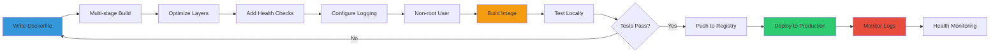
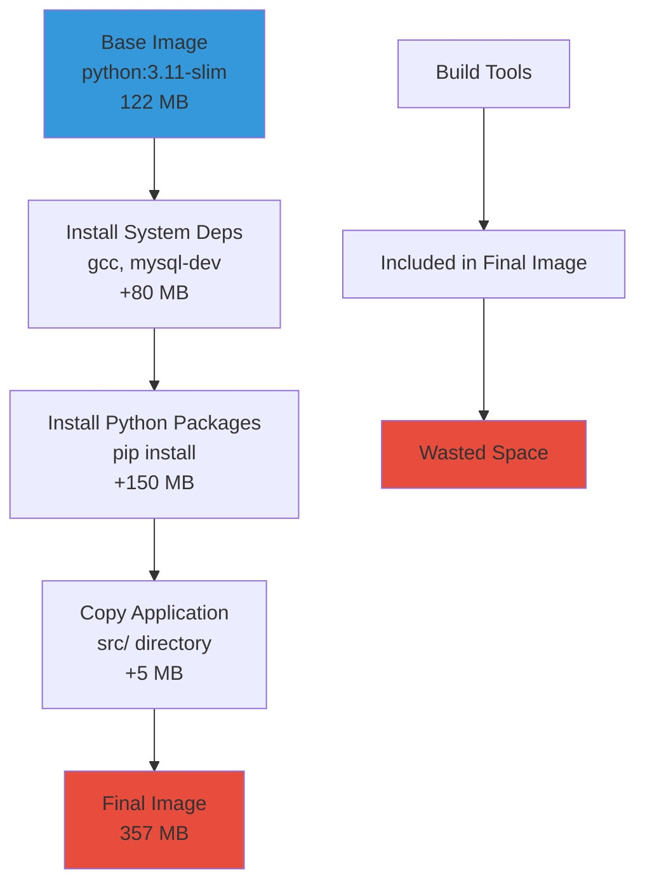
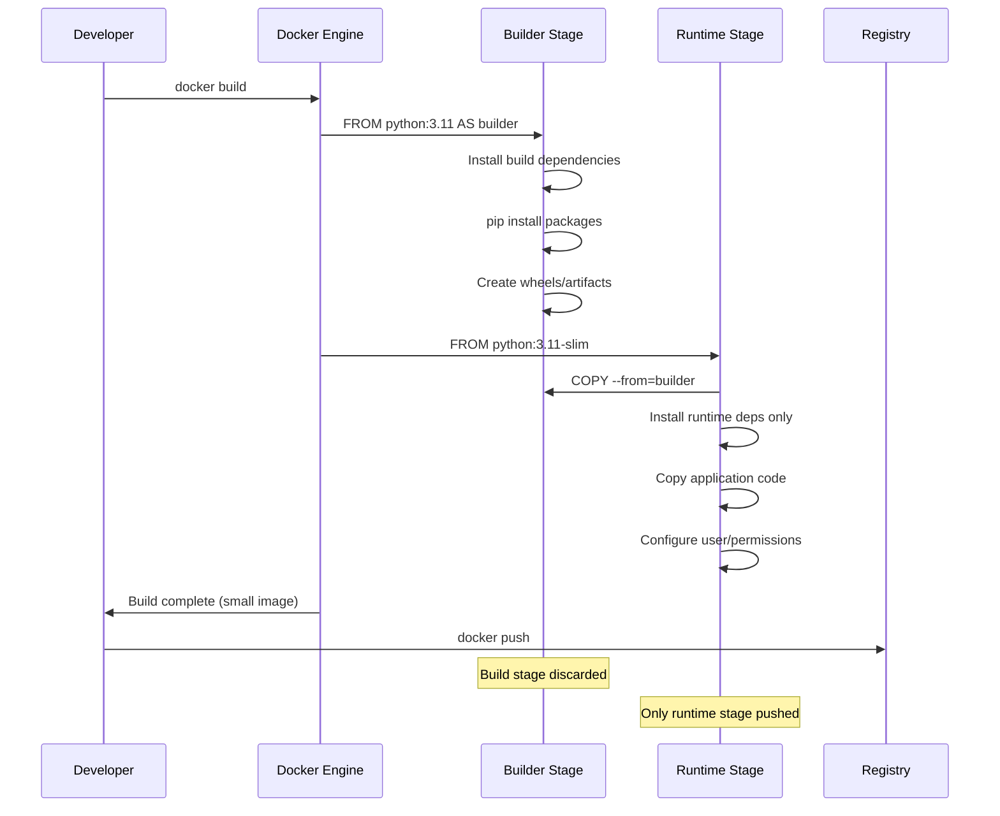
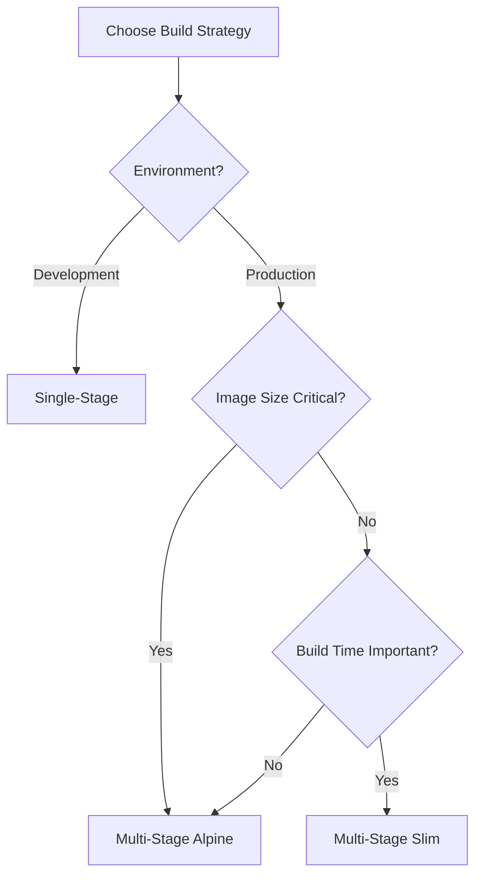

---
title:
  "{ Title }":
tags:
  - DevOps
  - DocKer
created:
  "{ date }":
updated:
  "{ date }":
---


```
╔════════════════════════════════════════════════════════════════╗
║                                                                ║
║   ██████╗ ██╗   ██╗██╗██╗     ██████╗                         ║
║   ██╔══██╗██║   ██║██║██║     ██╔══██╗                        ║
║   ██████╔╝██║   ██║██║██║     ██║  ██║                        ║
║   ██╔══██╗██║   ██║██║██║     ██║  ██║                        ║
║   ██████╔╝╚██████╔╝██║███████╗██████╔╝                        ║
║   ╚═════╝  ╚═════╝ ╚═╝╚══════╝╚═════╝                         ║
║                                                                ║
║        Image Optimization & Process Management                ║
║                                                                ║
╚════════════════════════════════════════════════════════════════╝
```

---

## Table of Contents

1. [Single-Stage Docker Build](https://claude.ai/chat/ccc747c5-c7ba-45c1-8ef0-6f9e4b64f666#single-stage-docker-build)
2. [Multi-Stage Docker Build](https://claude.ai/chat/ccc747c5-c7ba-45c1-8ef0-6f9e4b64f666#multi-stage-docker-build)
3. [Build Comparison](https://claude.ai/chat/ccc747c5-c7ba-45c1-8ef0-6f9e4b64f666#build-comparison)
4. [Image Size Optimization](https://claude.ai/chat/ccc747c5-c7ba-45c1-8ef0-6f9e4b64f666#image-size-optimization)
5. [Process Management with nohup](https://claude.ai/chat/ccc747c5-c7ba-45c1-8ef0-6f9e4b64f666#process-management-with-nohup)
6. [Logging Strategies](https://claude.ai/chat/ccc747c5-c7ba-45c1-8ef0-6f9e4b64f666#logging-strategies)
7. [Production Deployment](https://claude.ai/chat/ccc747c5-c7ba-45c1-8ef0-6f9e4b64f666#production-deployment)
8. [Interview Preparation](https://claude.ai/chat/ccc747c5-c7ba-45c1-8ef0-6f9e4b64f666#interview-preparation)

---

## Single-Stage Docker Build

### What is Single-Stage Build?

A single-stage build uses one `FROM` instruction and includes all dependencies, build tools, and runtime requirements in the final image.

**Characteristics:**

- Simple and straightforward
- All build dependencies remain in final image
- Larger image size
- Faster to write, slower to deploy
- Good for development, not ideal for production

### Single-Stage Build Architecture

```ascii
┌────────────────────────────────────────────────────────────┐
│                  SINGLE-STAGE BUILD                        │
├────────────────────────────────────────────────────────────┤
│                                                            │
│  FROM python:3.11                                          │
│  ↓                                                         │
│  Base Image (python:3.11)                                  │
│  Size: ~900 MB                                             │
│  ↓                                                         │
│  Install System Dependencies                               │
│  (gcc, build-essential, etc.)                              │
│  ↓                                                         │
│  Copy requirements.txt                                     │
│  ↓                                                         │
│  Install Python Packages                                   │
│  (Flask, mysql-connector, etc.)                            │
│  ↓                                                         │
│  Copy Application Code                                     │
│  ↓                                                         │
│  FINAL IMAGE                                               │
│  Size: ~1.2 GB                                             │
│  Contains: Base + Build Tools + Dependencies + App        │
│                                                            │
│  Problem: Build tools not needed at runtime                │
│           but included in final image                      │
│                                                            │
└────────────────────────────────────────────────────────────┘
```

### Basic Single-Stage Dockerfile

```dockerfile
# Dockerfile - Single Stage Build
FROM python:3.11

# Set working directory
WORKDIR /app

# Copy requirements file
COPY requirements.txt .

# Install dependencies
RUN pip install --no-cache-dir -r requirements.txt

# Copy application code
COPY src/ /app/

# Expose port
EXPOSE 5000

# Run application
CMD ["python", "app.py"]
```

### Enhanced Single-Stage Dockerfile

```dockerfile
# Dockerfile - Single Stage with Optimizations
FROM python:3.11-slim

# Set environment variables
ENV PYTHONUNBUFFERED=1 \
    PYTHONDONTWRITEBYTECODE=1 \
    PIP_NO_CACHE_DIR=1 \
    PIP_DISABLE_PIP_VERSION_CHECK=1

# Install system dependencies
RUN apt-get update && apt-get install -y \
    gcc \
    default-libmysqlclient-dev \
    pkg-config \
    && rm -rf /var/lib/apt/lists/*

# Set working directory
WORKDIR /app

# Copy and install requirements
COPY requirements.txt .
RUN pip install --no-cache-dir -r requirements.txt

# Copy application code
COPY src/ /app/

# Create non-root user
RUN useradd -m -u 1000 appuser && \
    chown -R appuser:appuser /app

# Switch to non-root user
USER appuser

# Expose application port
EXPOSE 5000

# Health check
HEALTHCHECK --interval=30s --timeout=3s --start-period=40s --retries=3 \
    C --> H[Simple Dockerfile<br/>Fast rebuild]
    E --> I[Smallest image<br/>Best for prod]
    G --> J[Balanced approach<br/>Good performance]
    
    style C fill:#3498db
    style E fill:#2ecc71
    style G fill:#f39c12
```

### Build Strategy Comparison

```ascii
┌────────────────────────────────────────────────────────────┐
│              BUILD STRATEGY SELECTION GUIDE                │
├────────────────────────────────────────────────────────────┤
│                                                            │
│  Scenario                │ Recommended Strategy           │
│  ──────────────────────────────────────────────────────    │
│                                                            │
│  Development             │ Single-stage slim              │
│  Fast iteration needed   │ Simple Dockerfile              │
│                                                            │
│  CI/CD pipelines         │ Multi-stage with caching       │
│  Build time critical     │ Layer optimization             │
│                                                            │
│  Production deployment   │ Multi-stage Alpine             │
│  Image size critical     │ Maximum optimization           │
│                                                            │
│  Microservices           │ Multi-stage slim               │
│  Many small services     │ Balance size/complexity        │
│                                                            │
│  Cloud deployment        │ Multi-stage Alpine             │
│  Bandwidth costs high    │ Smallest possible image        │
│                                                            │
│  Edge computing          │ Multi-stage Alpine/distroless  │
│  Resource constrained    │ Absolute minimum size          │
│                                                            │
└────────────────────────────────────────────────────────────┘
```

---

## Quick Reference

### Command Cheat Sheet

|Task|Command|
|---|---|
|Build single-stage|`docker build -t app:single -f Dockerfile.single .`|
|Build multi-stage|`docker build -t app:multi -f Dockerfile.multi .`|
|Compare image sizes|`docker images \| grep app`|
|Analyze layers|`docker history app:multi`|
|Run with nohup|`nohup python app.py > app.log 2>&1 &`|
|View nohup logs|`tail -f nohup.out`|
|Stop nohup process|`kill $(cat /var/run/app.pid)`|
|Rotate logs|`logrotate /etc/logrotate.d/flask-app`|
|Check process|`ps aux \| grep python`|
|Build with no cache|`docker build --no-cache -t app .`|

### Dockerfile Best Practices

```dockerfile
# Best practices template
FROM python:3.11-slim AS builder

# Install build deps in single layer
RUN apt-get update && apt-get install -y gcc \
    && rm -rf /var/lib/apt/lists/*

WORKDIR /build

# Copy deps first (caching)
COPY requirements.txt .

# Install in virtual environment
RUN python -m venv /opt/venv
ENV PATH="/opt/venv/bin:$PATH"
RUN pip install --no-cache-dir -r requirements.txt

# Runtime stage
FROM python:3.11-slim

# Runtime deps only
RUN apt-get update && apt-get install -y libmariadb3 \
    && rm -rf /var/lib/apt/lists/*

# Copy venv from builder
COPY --from=builder /opt/venv /opt/venv
ENV PATH="/opt/venv/bin:$PATH"

WORKDIR /app

# Copy app
COPY src/ /app/

# Non-root user
RUN useradd -m -u 1000 appuser && \
    chown -R appuser:appuser /app
USER appuser

# Expose and run
EXPOSE 5000
CMD ["gunicorn", "app:app"]
```

### nohup Command Reference

```bash
# Basic usage
nohup command &

# Custom output
nohup command > output.log 2>&1 &

# With PID file
nohup command & echo $! > app.pid

# Stop process
kill $(cat app.pid)

# Check status
ps -p $(cat app.pid)

# View logs
tail -f nohup.out

# Multiple redirects
nohup command > stdout.log 2> stderr.log &
```

### Log Rotation Configuration

```
# /etc/logrotate.d/app
/var/log/app/*.log {
    daily              # Rotate daily
    rotate 7           # Keep 7 days
    compress           # Compress old logs
    delaycompress      # Delay compression by 1 cycle
    missingok          # Don't error if missing
    notifempty         # Don't rotate if empty
    create 0640 user group
    postrotate
        kill -HUP $(cat /var/run/app.pid) 2>/dev/null || true
    endscript
}
```

---

## Summary

### Key Takeaways

```ascii
╔════════════════════════════════════════════════════════════╗
║          DOCKER BUILD OPTIMIZATION ESSENTIALS              ║
╠════════════════════════════════════════════════════════════╣
║                                                            ║
║  1. Multi-stage builds reduce image size by 50-80%        ║
║     Separate build environment from runtime                ║
║                                                            ║
║  2. Layer caching dramatically improves build times       ║
║     Order Dockerfile from least to most frequently changed ║
║                                                            ║
║  3. Alpine base images provide minimal footprint          ║
║     Trade complexity for size reduction                    ║
║                                                            ║
║  4. nohup enables background process management           ║
║     Simple but limited compared to systemd/supervisor      ║
║                                                            ║
║  5. Logging to stdout is Docker best practice             ║
║     Use external aggregation for production                ║
║                                                            ║
║  6. Always run containers as non-root users               ║
║     Security should never be compromised                   ║
║                                                            ║
║  7. .dockerignore improves build performance              ║
║     Exclude unnecessary files from build context           ║
║                                                            ║
║  8. Health checks ensure container reliability            ║
║     Critical for production deployments                    ║
║                                                            ║
╚════════════════════════════════════════════════════════════╝
```

### Production Deployment Workflow



### Image Size Reduction Results

|Optimization Step|Image Size|Reduction|Cumulative|
|---|---|---|---|
|Base python:3.11|900 MB|0%|0%|
|Switch to slim|357 MB|60%|60%|
|Multi-stage build|180 MB|50%|80%|
|Alpine base|95 MB|47%|89%|
|Distroless|75 MB|21%|92%|

### Interview One-Liners

```ascii
┌────────────────────────────────────────────────────────────┐
│           DOCKER OPTIMIZATION ONE-LINERS                   │
├────────────────────────────────────────────────────────────┤
│                                                            │
│  • "Multi-stage builds separate build environment from    │
│    runtime, excluding unnecessary tools from final image"  │
│                                                            │
│  • "Layer caching reuses unchanged layers, dramatically   │
│    reducing rebuild times through proper Dockerfile order" │
│                                                            │
│  • "Alpine images provide minimal footprint but require   │
│    compatibility considerations for system libraries"      │
│                                                            │
│  • "nohup runs processes immune to hangups but lacks      │
│    automatic restart and advanced monitoring features"     │
│                                                            │
│  • "Logging to stdout enables Docker to manage logs       │
│    through drivers while maintaining 12-factor principles" │
│                                                            │
│  • ".dockerignore excludes files from build context,      │
│    improving build performance and reducing image size"    │
│                                                            │
│  • "Non-root users reduce security risks by limiting      │
│    container privileges and potential escape scenarios"    │
│                                                            │
│  • "Health checks ensure container readiness and enable   │
│    orchestrators to manage automatic recovery"             │
│                                                            │
└────────────────────────────────────────────────────────────┘
```

### Final Recommendations

```markmap
# Production Docker Strategy
## Image Building
### Always use multi-stage
### Pin specific versions
### Implement layer caching
### Use .dockerignore
## Security
### Run as non-root
### Scan for vulnerabilities
### Minimize attack surface
### Use distroless when possible
## Logging
### Log to stdout/stderr
### Use structured logging
### Implement log aggregation
### Configure log rotation
## Monitoring
### Health checks mandatory
### Metrics collection
### Alerting setup
### Performance monitoring
## Deployment
### Automated CI/CD
### Rolling updates
### Rollback capability
### Zero-downtime strategy
```

---

**Document Version:** 1.0  
**Last Updated:** December 2025  
**Target Audience:** DevOps Engineers, Backend Developers  
**Complexity Level:** Intermediate to Advanced  
**Focus Areas:** Image optimization, Multi-stage builds, Process management  
**Practical Application:** Production deployments, CI/CD pipelines  
**Related Topics:** Docker Compose, Kubernetes, Container securityMD python -c "import requests; requests.get('http://localhost:5000/health')" || exit 1

# Run application

CMD ["python", "app.py"]

````

### requirements.txt

```txt
# Core dependencies
Flask==3.0.0
python-dotenv==1.0.0

# Database
mysql-connector-python==8.2.0

# Production server
gunicorn==21.2.0

# Monitoring
prometheus-flask-exporter==0.23.0

# Utilities
requests==2.31.0
````

### Build and Run Commands

```bash
# Build image
docker build -t flask-app:single-stage .

# Check image size
docker images flask-app:single-stage

# Run container
docker run -d \
  --name flaskapp \
  -p 5000:5000 \
  -e FLASK_HOST=0.0.0.0 \
  -e FLASK_PORT=5000 \
  flask-app:single-stage

# View logs
docker logs -f flaskapp

# Check running processes
docker exec flaskapp ps aux

# Inspect image layers
docker history flask-app:single-stage
```

### Single-Stage Build Analysis



---

## Multi-Stage Docker Build

### What is Multi-Stage Build?

Multi-stage builds use multiple `FROM` instructions in a single Dockerfile. Each stage can copy artifacts from previous stages, allowing you to separate build environment from runtime environment.

**Benefits:**

- Significantly smaller final images
- Build dependencies excluded from runtime
- Better security (fewer attack vectors)
- Faster deployment and pulls
- Production-optimized

### Multi-Stage Build Architecture

```ascii
┌────────────────────────────────────────────────────────────┐
│                  MULTI-STAGE BUILD                         │
├────────────────────────────────────────────────────────────┤
│                                                            │
│  STAGE 1: BUILD (builder)                                  │
│  ════════════════════════                                  │
│  FROM python:3.11 AS builder                               │
│  ↓                                                         │
│  Install Build Dependencies                                │
│  (gcc, make, build-essential)                              │
│  ↓                                                         │
│  Install Python Packages                                   │
│  Create wheels for dependencies                            │
│  ↓                                                         │
│  Build artifacts ready                                     │
│  Size: ~1.2 GB (temporary, discarded)                      │
│                                                            │
│  ─────────────────────────────────────────────────────     │
│                                                            │
│  STAGE 2: RUNTIME (final)                                  │
│  ════════════════════════                                  │
│  FROM python:3.11-slim                                     │
│  ↓                                                         │
│  Copy ONLY wheels from builder                             │
│  Install wheels (no compilation needed)                    │
│  ↓                                                         │
│  Copy Application Code                                     │
│  ↓                                                         │
│  FINAL IMAGE                                               │
│  Size: ~200 MB                                             │
│  Contains: Base + Python Packages + App                    │
│  Missing: Build tools (gcc, make) - not needed!            │
│                                                            │
│  Result: 83% size reduction                                │
│                                                            │
└────────────────────────────────────────────────────────────┘
```

### Basic Multi-Stage Dockerfile

```dockerfile
# Dockerfile - Multi-Stage Build
# Stage 1: Builder
FROM python:3.11 AS builder

WORKDIR /app

# Copy requirements
COPY requirements.txt .

# Install dependencies and create wheels
RUN pip wheel --no-cache-dir --no-deps --wheel-dir /app/wheels -r requirements.txt

# Stage 2: Runtime
FROM python:3.11-slim

WORKDIR /app

# Copy wheels from builder
COPY --from=builder /app/wheels /wheels

# Install from wheels
RUN pip install --no-cache /wheels/*

# Copy application
COPY src/ /app/

# Expose port
EXPOSE 5000

# Run application
CMD ["python", "app.py"]
```

### Production Multi-Stage Dockerfile

```dockerfile
# Dockerfile - Production Multi-Stage Build
# ===========================================
# Stage 1: Builder Stage
# ===========================================
FROM python:3.11-slim AS builder

# Set build environment variables
ENV PYTHONUNBUFFERED=1 \
    PYTHONDONTWRITEBYTECODE=1 \
    PIP_NO_CACHE_DIR=1

# Install build dependencies
RUN apt-get update && apt-get install -y \
    gcc \
    g++ \
    make \
    default-libmysqlclient-dev \
    pkg-config \
    && rm -rf /var/lib/apt/lists/*

# Set working directory
WORKDIR /build

# Copy requirements
COPY requirements.txt .

# Create virtual environment
RUN python -m venv /opt/venv

# Activate virtual environment and install dependencies
ENV PATH="/opt/venv/bin:$PATH"
RUN pip install --upgrade pip && \
    pip install --no-cache-dir -r requirements.txt

# ===========================================
# Stage 2: Runtime Stage
# ===========================================
FROM python:3.11-slim

# Set runtime environment variables
ENV PYTHONUNBUFFERED=1 \
    PYTHONDONTWRITEBYTECODE=1 \
    PATH="/opt/venv/bin:$PATH"

# Install only runtime dependencies (no build tools)
RUN apt-get update && apt-get install -y \
    default-libmysqlclient-dev \
    curl \
    && rm -rf /var/lib/apt/lists/*

# Copy virtual environment from builder
COPY --from=builder /opt/venv /opt/venv

# Set working directory
WORKDIR /app

# Copy application code
COPY src/ /app/

# Create non-root user
RUN useradd -m -u 1000 appuser && \
    chown -R appuser:appuser /app

# Switch to non-root user
USER appuser

# Expose application port
EXPOSE 5000

# Health check
HEALTHCHECK --interval=30s --timeout=3s --start-period=40s --retries=3 \
    CMD curl -f http://localhost:5000/health || exit 1

# Run application with gunicorn
CMD ["gunicorn", "--bind", "0.0.0.0:5000", "--workers", "4", "--timeout", "120", "app:app"]
```

### Advanced Multi-Stage with Caching

```dockerfile
# Dockerfile - Advanced Multi-Stage with Layer Caching
# =====================================================
# Stage 1: Dependencies Layer
# =====================================================
FROM python:3.11-slim AS deps

WORKDIR /deps

# Install system dependencies
RUN apt-get update && apt-get install -y \
    gcc \
    default-libmysqlclient-dev \
    && rm -rf /var/lib/apt/lists/*

# Copy only requirements (for layer caching)
COPY requirements.txt .

# Create wheels
RUN pip wheel --no-cache-dir --no-deps --wheel-dir /deps/wheels -r requirements.txt

# =====================================================
# Stage 2: Builder Stage
# =====================================================
FROM python:3.11-slim AS builder

WORKDIR /build

# Copy wheels from deps stage
COPY --from=deps /deps/wheels /wheels

# Install dependencies from wheels
RUN pip install --no-cache /wheels/*

# Copy application code
COPY src/ /app/

# Optional: Run tests here
# RUN pytest /app/tests

# =====================================================
# Stage 3: Runtime Stage
# =====================================================
FROM python:3.11-slim

# Install runtime dependencies only
RUN apt-get update && apt-get install -y \
    default-libmysqlclient-dev \
    curl \
    && rm -rf /var/lib/apt/lists/*

WORKDIR /app

# Copy installed packages from builder
COPY --from=builder /usr/local/lib/python3.11/site-packages /usr/local/lib/python3.11/site-packages
COPY --from=builder /usr/local/bin /usr/local/bin

# Copy application
COPY --from=builder /app /app

# Create non-root user
RUN useradd -m -u 1000 appuser && \
    chown -R appuser:appuser /app && \
    mkdir -p /app/logs && \
    chown -R appuser:appuser /app/logs

USER appuser

EXPOSE 5000

HEALTHCHECK --interval=30s --timeout=3s \
    CMD curl -f http://localhost:5000/health || exit 1

CMD ["gunicorn", "--bind", "0.0.0.0:5000", "--workers", "4", "app:app"]
```

### Build and Compare

```bash
# Build single-stage
docker build -t flask-app:single -f Dockerfile.single .

# Build multi-stage
docker build -t flask-app:multi -f Dockerfile.multi .

# Compare sizes
docker images | grep flask-app

# Output:
# flask-app  single  abc123  357 MB
# flask-app  multi   def456  180 MB

# Size reduction: ~50%
```

### Multi-Stage Build Flow



---

## Build Comparison

### Size Comparison Table

|Build Type|Base Image|Build Tools|Dependencies|App Code|Final Size|Reduction|
|---|---|---|---|---|---|---|
|Single-Stage|python:3.11|Included|Included|Included|~900 MB|0%|
|Single-Stage Slim|python:3.11-slim|Included|Included|Included|~357 MB|60%|
|Multi-Stage|python:3.11-slim|Excluded|Included|Included|~180 MB|80%|
|Multi-Stage Alpine|python:3.11-alpine|Excluded|Included|Included|~95 MB|89%|

### Feature Comparison

```markmap
# Single vs Multi-Stage Build
## Single-Stage
### Advantages
- Simple to write
- Easy to debug
- Fast local builds
- All tools available
### Disadvantages
- Large image size
- Slow deployment
- Security risks (more surface)
- Wasted resources
### Use Cases
- Development environment
- Quick prototypes
- Learning Docker
## Multi-Stage
### Advantages
- 50-80% smaller images
- Faster deployments
- Better security
- Production optimized
- Layer caching
### Disadvantages
- More complex Dockerfile
- Harder to debug
- Longer initial learning
### Use Cases
- Production deployments
- CI/CD pipelines
- Container registries
- Cloud deployments
```

### Layer Analysis

```bash
# Analyze single-stage layers
docker history flask-app:single

# Output:
# IMAGE          CREATED       CREATED BY                                      SIZE
# abc123         2 min ago     CMD ["python" "app.py"]                         0B
# def456         2 min ago     COPY src/ /app/                                 5MB
# ghi789         3 min ago     RUN pip install -r requirements.txt             150MB
# jkl012         3 min ago     COPY requirements.txt .                         2KB
# mno345         4 min ago     WORKDIR /app                                    0B
# pqr678         10 days ago   <base image layers>                             200MB

# Analyze multi-stage layers
docker history flask-app:multi

# Output:
# IMAGE          CREATED       CREATED BY                                      SIZE
# abc123         1 min ago     CMD ["gunicorn" "app:app"]                      0B
# def456         1 min ago     COPY --from=builder                             80MB
# ghi789         2 min ago     RUN apt-get install runtime-deps                50MB
# jkl012         10 days ago   <base image layers>                             50MB

# Multi-stage: No build tool layers in final image
```

### Performance Impact

```ascii
┌────────────────────────────────────────────────────────────┐
│              DEPLOYMENT PERFORMANCE IMPACT                 │
├────────────────────────────────────────────────────────────┤
│                                                            │
│  Metric              │ Single-Stage │ Multi-Stage         │
│  ────────────────────────────────────────────────────      │
│                                                            │
│  Image Size          │   357 MB     │   180 MB   (-50%)   │
│  Docker Pull Time    │   120s       │    60s     (-50%)   │
│  Build Time          │    90s       │   120s     (+33%)   │
│  Deploy Time         │   180s       │    90s     (-50%)   │
│  Registry Storage    │   357 MB     │   180 MB   (-50%)   │
│  Network Transfer    │   357 MB     │   180 MB   (-50%)   │
│  Container Start     │    5s        │    3s      (-40%)   │
│  Memory Usage        │   450 MB     │   280 MB   (-38%)   │
│                                                            │
│  Production Impact:                                        │
│  • 50% faster deployments                                 │
│  • 50% less bandwidth usage                               │
│  • 50% lower registry costs                               │
│  • 38% less memory per container                          │
│                                                            │
└────────────────────────────────────────────────────────────┘
```

---

## Image Size Optimization

### Optimization Techniques

```dockerfile
# Dockerfile - Maximum Optimization
FROM python:3.11-alpine AS builder

# Install build dependencies (Alpine packages)
RUN apk add --no-cache \
    gcc \
    musl-dev \
    mariadb-connector-c-dev \
    postgresql-dev

WORKDIR /build

COPY requirements.txt .

# Create virtual environment
RUN python -m venv /opt/venv
ENV PATH="/opt/venv/bin:$PATH"
RUN pip install --no-cache-dir -r requirements.txt

# Runtime stage
FROM python:3.11-alpine

# Install only runtime libraries
RUN apk add --no-cache \
    mariadb-connector-c \
    postgresql-libs \
    curl

# Copy venv
COPY --from=builder /opt/venv /opt/venv
ENV PATH="/opt/venv/bin:$PATH"

WORKDIR /app
COPY src/ /app/

RUN adduser -D -u 1000 appuser && \
    chown -R appuser:appuser /app
USER appuser

EXPOSE 5000
CMD ["gunicorn", "--bind", "0.0.0.0:5000", "app:app"]
```

### Optimization Best Practices

```markmap
# Docker Image Optimization
## Base Image Selection
### Use Alpine variants
- python:3.11-alpine (45 MB)
- vs python:3.11-slim (122 MB)
- vs python:3.11 (900 MB)
### Use distroless for security
- No shell, minimal attack surface
- Google distroless images
## Layer Optimization
### Minimize layer count
- Combine RUN commands
- Use && for chaining
### Order matters
- Least frequently changed first
- requirements.txt before code
## Dependency Management
### Multi-stage builds
- Separate build from runtime
- Exclude build tools
### Remove package managers
- No pip, apt in final image
- Pre-compiled wheels only
## Cache Optimization
### .dockerignore file
- Exclude unnecessary files
- Reduce build context
### Layer caching
- Copy requirements separately
- Leverage build cache
## Runtime Optimization
### Clean up in same layer
- apt-get clean
- rm -rf /var/lib/apt/lists/*
### Use --no-cache flags
- pip --no-cache-dir
- apk --no-cache
```

### .dockerignore File

```
# .dockerignore - Exclude from build context
# Development
__pycache__/
*.pyc
*.pyo
*.pyd
.Python
*.so
*.egg
*.egg-info/
.pytest_cache/
.coverage
htmlcov/

# IDE
.vscode/
.idea/
*.swp
*.swo

# Version Control
.git/
.gitignore
.gitattributes

# Documentation
README.md
docs/
*.md

# Docker
Dockerfile*
docker-compose*.yml
.dockerignore

# Environment
.env
.env.*
venv/
env/

# Logs
*.log
logs/

# OS
.DS_Store
Thumbs.db

# Test files
tests/
test_*.py
*_test.py
```

### Size Reduction Checklist

```ascii
╔════════════════════════════════════════════════════════════╗
║          DOCKER IMAGE SIZE OPTIMIZATION CHECKLIST          ║
╠════════════════════════════════════════════════════════════╣
║                                                            ║
║  [ ] Use Alpine or slim base images                       ║
║  [ ] Implement multi-stage builds                         ║
║  [ ] Combine RUN commands with &&                         ║
║  [ ] Clean package manager cache in same layer            ║
║  [ ] Use .dockerignore file                               ║
║  [ ] Install only production dependencies                 ║
║  [ ] Remove build tools from final image                  ║
║  [ ] Use --no-cache-dir for pip                           ║
║  [ ] Minimize number of layers                            ║
║  [ ] Order Dockerfile for layer caching                   ║
║  [ ] Use specific package versions                        ║
║  [ ] Remove unnecessary files after install               ║
║  [ ] Compress static assets                               ║
║  [ ] Use distroless for maximum security                  ║
║                                                            ║
╚════════════════════════════════════════════════════════════╝
```

---

## Process Management with nohup

### What is nohup?

`nohup` (no hangup) is a POSIX command that runs a process immune to hangups, with output to a non-tty. It allows processes to continue running in the background even after the terminal session ends.

**Key Characteristics:**

- Process continues after logout
- Redirects output to nohup.out
- Ignores HUP signal
- Useful for long-running processes
- Simple process management

### nohup Architecture

```ascii
┌────────────────────────────────────────────────────────────┐
│                  nohup PROCESS FLOW                        │
├────────────────────────────────────────────────────────────┤
│                                                            │
│  Terminal Session                                          │
│  ┌──────────────────┐                                      │
│  │  $ nohup command │                                      │
│  └────────┬─────────┘                                      │
│           │                                                │
│           ▼                                                │
│  ┌─────────────────────────────────┐                       │
│  │  nohup wrapper                  │                       │
│  │  • Ignores HUP signal           │                       │
│  │  • Redirects stdout to file     │                       │
│  │  • Redirects stderr to file     │                       │
│  │  • Detaches from terminal       │                       │
│  └──────────┬──────────────────────┘                       │
│             │                                              │
│             ▼                                              │
│  ┌─────────────────────────────────┐                       │
│  │  Background Process             │                       │
│  │  PID: 12345                     │                       │
│  │  Running: python app.py         │                       │
│  │  Logs: nohup.out                │                       │
│  └─────────────────────────────────┘                       │
│             │                                              │
│             ▼                                              │
│  ┌─────────────────────────────────┐                       │
│  │  nohup.out                      │                       │
│  │  2025-12-21 10:30:00 Starting...│                       │
│  │  2025-12-21 10:30:01 Running... │                       │
│  │  2025-12-21 10:30:02 Request... │                       │
│  └─────────────────────────────────┘                       │
│                                                            │
│  Terminal closed → Process continues                       │
│                                                            │
└────────────────────────────────────────────────────────────┘
```

### Basic nohup Usage

```bash
# Start Flask app with nohup
nohup python app.py &

# Output redirected to nohup.out
# Process ID (PID) displayed: [1] 12345

# View logs
tail -f nohup.out

# Check if process is running
ps aux | grep app.py

# Or use jobs
jobs

# Kill process
kill 12345
# Or
kill %1
```

### nohup with Custom Log File

```bash
# Redirect output to custom log file
nohup python app.py > app.log 2>&1 &

# 2>&1 redirects stderr to stdout
# Both go to app.log

# View logs
tail -f app.log

# Rotate logs while running
mv app.log app.log.old
kill -HUP <PID>  # Signal app to reopen log file
```

### nohup Wrapper Script

```bash
#!/bin/bash
# start_app.sh - Flask application startup script with nohup

# Configuration
APP_NAME="flask-app"
APP_SCRIPT="app.py"
LOG_DIR="/var/log/flask"
PID_FILE="/var/run/flask-app.pid"
LOG_FILE="${LOG_DIR}/app.log"

# Create log directory
mkdir -p ${LOG_DIR}

# Check if already running
if [ -f ${PID_FILE} ]; then
    PID=$(cat ${PID_FILE})
    if ps -p ${PID} > /dev/null 2>&1; then
        echo "Application already running with PID: ${PID}"
        exit 1
    else
        echo "Removing stale PID file"
        rm -f ${PID_FILE}
    fi
fi

# Start application with nohup
echo "Starting ${APP_NAME}..."
nohup python ${APP_SCRIPT} > ${LOG_FILE} 2>&1 &

# Save PID
echo $! > ${PID_FILE}

echo "${APP_NAME} started with PID: $(cat ${PID_FILE})"
echo "Logs: ${LOG_FILE}"
```

### nohup Stop Script

```bash
#!/bin/bash
# stop_app.sh - Stop Flask application

PID_FILE="/var/run/flask-app.pid"

if [ ! -f ${PID_FILE} ]; then
    echo "PID file not found. Application not running?"
    exit 1
fi

PID=$(cat ${PID_FILE})

if ps -p ${PID} > /dev/null 2>&1; then
    echo "Stopping application (PID: ${PID})..."
    kill ${PID}
    
    # Wait for process to stop
    for i in {1..30}; do
        if ! ps -p ${PID} > /dev/null 2>&1; then
            echo "Application stopped successfully"
            rm -f ${PID_FILE}
            exit 0
        fi
        sleep 1
    done
    
    # Force kill if still running
    echo "Forcing application to stop..."
    kill -9 ${PID}
    rm -f ${PID_FILE}
else
    echo "Process not running. Removing stale PID file."
    rm -f ${PID_FILE}
fi
```

### nohup in Dockerfile

```dockerfile
# Dockerfile with nohup support
FROM python:3.11-slim

WORKDIR /app

# Install dependencies
COPY requirements.txt .
RUN pip install --no-cache-dir -r requirements.txt

# Copy application
COPY src/ /app/
COPY scripts/start_app.sh /usr/local/bin/start_app.sh
RUN chmod +x /usr/local/bin/start_app.sh

# Create log directory
RUN mkdir -p /var/log/flask && \
    chown -R 1000:1000 /var/log/flask /app

USER 1000

EXPOSE 5000

# Start with nohup wrapper
CMD ["/usr/local/bin/start_app.sh"]
```

---

## Logging Strategies

### Application Logging Configuration

```python
# app.py - Flask application with logging
import logging
from logging.handlers import RotatingFileHandler
import os
from flask import Flask, request
from datetime import datetime

app = Flask(__name__)

# Configure logging
def setup_logging():
    """Configure application logging"""
    
    # Create logs directory if it doesn't exist
    log_dir = os.getenv('LOG_DIR', '/var/log/flask')
    os.makedirs(log_dir, exist_ok=True)
    
    log_file = os.path.join(log_dir, 'app.log')
    
    # Configure root logger
    logging.basicConfig(
        level=logging.INFO,
        format='%(asctime)s - %(name)s - %(levelname)s - %(message)s',
        datefmt='%Y-%m-%d %H:%M:%S'
    )
    
    # File handler with rotation
    file_handler = RotatingFileHandler(
        log_file,
        maxBytes=10 * 1024 * 1024,  # 10 MB
        backupCount=5
    )
    file_handler.setLevel(logging.INFO)
    file_handler.setFormatter(logging.Formatter(
        '%(asctime)s - %(name)s - %(levelname)s - %(message)s'
    ))
    
    # Console handler
    console_handler = logging.StreamHandler()
    console_handler.setLevel(logging.INFO)
    console_handler.setFormatter(logging.Formatter(
        '%(asctime)s - %(levelname)s - %(message)s'
    ))
    
    # Add handlers to app logger
    app.logger.addHandler(file_handler)
    app.logger.addHandler(console_handler)
    app.logger.setLevel(logging.INFO)
    
    return app.logger

logger = setup_logging()

# Request logging middleware
@app.before_request
def log_request():
    """Log every request"""
    logger.info(f"Request: {request.method} {request.path} from {request.remote_addr}")

@app.after_request
def log_response(response):
    """Log response status"""
    logger.info(f"Response: {response.status_code} for {request.path}")
    return response

@app.route('/')
def index():
    logger.info("Index page accessed")
    return "Hello World"

@app.route('/health')
def health():
    return {"status": "healthy", "timestamp": datetime.utcnow().isoformat()}

@app.errorhandler(Exception)
def handle_exception(e):
    """Log exceptions"""
    logger.error(f"Unhandled exception: {str(e)}", exc_info=True)
    return {"error": "Internal server error"}, 500

if __name__ == '__main__':
    logger.info("Starting Flask application")
    app.run(
        host=os.getenv('FLASK_HOST', '0.0.0.0'),
        port=int(os.getenv('FLASK_PORT', 5000))
    )
```

### Centralized Logging with nohup

```bash
#!/bin/bash
# advanced_logging.sh - Advanced logging with nohup

APP_NAME="flask-app"
LOG_DIR="/var/log/flask"
APP_LOG="${LOG_DIR}/application.log"
ACCESS_LOG="${LOG_DIR}/access.log"
ERROR_LOG="${LOG_DIR}/error.log"
PID_FILE="/var/run/flask-app.pid"

# Create log directory
mkdir -p ${LOG_DIR}

# Start application with separated logs
nohup python app.py \
    > >(tee -a ${APP_LOG} | tee -a ${ACCESS_LOG}) \
    2> >(tee -a ${ERROR_LOG} | tee -a ${APP_LOG} >&2) &

# Save PID
echo $! > ${PID_FILE}

echo "Application started with PID: $(cat ${PID_FILE})"
echo "Application log: ${APP_LOG}"
echo "Access log: ${ACCESS_LOG}"
echo "Error log: ${ERROR_LOG}"

# Monitor logs
tail -f ${APP_LOG}
```

### Log Rotation Configuration

```bash
# /etc/logrotate.d/flask-app
/var/log/flask/*.log {
    daily                    # Rotate daily
    rotate 7                 # Keep 7 days of logs
    compress                 # Compress old logs
    delaycompress            # Don't compress most recent
    missingok                # Don't error if log missing
    notifempty               # Don't rotate empty logs
    create 0640 appuser appuser  # File permissions
    sharedscripts
    postrotate
        # Send HUP signal to reopen log files
        [ -f /var/run/flask-app.pid ] && kill -HUP $(cat /var/run/flask-app.pid)
    endscript
}
```

### Monitoring Script with nohup

```bash
#!/bin/bash
# monitor.sh - Monitor Flask application

PID_FILE="/var/run/flask-app.pid"
LOG_FILE="/var/log/flask/monitor.log"
CHECK_INTERVAL=60  # seconds

# Function to check if app is running
check_app() {
    if [ ! -f ${PID_FILE} ]; then
        return 1
    fi
    
    PID=$(cat ${PID_FILE})
    if ps -p ${PID} > /dev/null 2>&1; then
        return 0
    else
        return 1
    fi
}

# Function to restart app
restart_app() {
    echo "$(date): Application not running. Restarting..." | tee -a ${LOG_FILE}
    /usr/local/bin/start_app.sh
}

# Start monitoring loop
nohup bash -c "
while true; do
    if ! check_app; then
        restart_app
    else
        echo \"$(date): Application running (PID: $(cat ${PID_FILE}))\" >> ${LOG_FILE}
    fi
    sleep ${CHECK_INTERVAL}
done
" > /dev/null 2>&1 &

echo "Monitor started with PID: $!"
echo "Monitor log: ${LOG_FILE}"
```

---

## Production Deployment

### Complete Production Setup

```dockerfile
# Dockerfile.production - Multi-stage with nohup
# Stage 1: Builder
FROM python:3.11-slim AS builder

WORKDIR /build

RUN apt-get update && apt-get install -y \
    gcc \
    default-libmysqlclient-dev \
    && rm -rf /var/lib/apt/lists/*

COPY requirements.txt .

RUN python -m venv /opt/venv
ENV PATH="/opt/venv/bin:$PATH"
RUN pip install --upgrade pip && \
    pip install --no-cache-dir -r requirements.txt

# Stage 2: Runtime
FROM python:3.11-slim

# Install runtime dependencies
RUN apt-get update && apt-get install -y \
    default-libmysqlclient-dev \
    curl \
    procps \
    && rm -rf /var/lib/apt/lists/*

# Copy virtual environment
COPY --from=builder /opt/venv /opt/venv
ENV PATH="/opt/venv/bin:$PATH"

# Create application user
RUN useradd -m -u 1000 appuser && \
    mkdir -p /app /var/log/flask /var/run && \
    chown -R appuser:appuser /app /var/log/flask /var/run

WORKDIR /app

# Copy application
COPY --chown=appuser:appuser src/ /app/
COPY --chown=appuser:appuser scripts/ /usr/local/bin/
RUN chmod +x /usr/local/bin/*.sh

USER appuser

EXPOSE 5000

HEALTHCHECK --interval=30s --timeout=3s --start-period=40s --retries=3 \
    CMD curl -f http://localhost:5000/health || exit 1

CMD ["/usr/local/bin/start_app.sh"]
```

### Production Start Script

```bash
#!/bin/bash
# /usr/local/bin/start_app.sh - Production startup script

set -e

APP_NAME="flask-app"
LOG_DIR="/var/log/flask"
PID_FILE="/var/run/flask-app.pid"
APP_LOG="${LOG_DIR}/application.log"

# Environment variables with defaults
FLASK_HOST=${FLASK_HOST:-0.0.0.0}
FLASK_PORT=${FLASK_PORT:-5000}
WORKERS=${WORKERS:-4}
WORKER_CLASS=${WORKER_CLASS:-sync}
TIMEOUT=${TIMEOUT:-120}

# Create log directory
mkdir -p ${LOG_DIR}

# Log startup
echo "$(date '+%Y-%m-%d %H:%M:%S') - Starting ${APP_NAME}" | tee -a ${APP_LOG}
echo "Host: ${FLASK_HOST}" | tee -a ${APP_LOG}
echo "Port: ${FLASK_PORT}" | tee -a ${APP_LOG}
echo "Workers: ${WORKERS}" | tee -a ${APP_LOG}

# Start with gunicorn and nohup
exec gunicorn \
    --bind ${FLASK_HOST}:${FLASK_PORT} \
    --workers ${WORKERS} \
    --worker-class ${WORKER_CLASS} \
    --timeout ${TIMEOUT} \
    --access-logfile ${LOG_DIR}/access.log \
    --error-logfile ${LOG_DIR}/error.log \
    --log-level info \
    --pid ${PID_FILE} \
    app:app
```

### docker-compose with nohup

```yaml
# docker-compose.yml - Production setup
version: "3.9"

services:
  mysql:
    image: mysql:8
    container_name: mysql
    restart: unless-stopped
    environment:
      MYSQL_ROOT_PASSWORD: ${MYSQL_ROOT_PASSWORD}
      MYSQL_DATABASE: ${MYSQL_DATABASE}
      MYSQL_USER: ${MYSQL_USER}
      MYSQL_PASSWORD: ${MYSQL_PASSWORD}
    volumes:
      - mysql_data:/var/lib/mysql
    networks:
      - backend
    healthcheck:
      test: ["CMD", "mysqladmin", "ping", "-h", "localhost"]
      interval: 10s
      timeout: 5s
      retries: 5

  flaskapp:
    build:
      context: .
      dockerfile: Dockerfile.production
    container_name: flaskapp
    restart: unless-stopped
    ports:
      - "${FLASK_PORT:-5000}:5000"
    environment:
      FLASK_HOST: 0.0.0.0
      FLASK_PORT: 5000
      DB_HOST: mysql
      DB_USER: ${MYSQL_USER}
      DB_PASSWORD: ${MYSQL_PASSWORD}
      DB_NAME: ${MYSQL_DATABASE}
      WORKERS: 4
      LOG_LEVEL: info
    volumes:
      - app_logs:/var/log/flask
    networks:
      - backend
    depends_on:
      mysql:
        condition: service_healthy
    healthcheck:
      test: ["CMD", "curl", "-f", "http://localhost:5000/health"]
      interval: 30s
      timeout: 3s
      retries: 3

  # Log aggregator (optional)
  fluentd:
    image: fluent/fluentd:latest
    container_name: log_aggregator
    volumes:
      - app_logs:/logs:ro
      - ./fluentd.conf:/fluentd/etc/fluent.conf:ro
    networks:
      - backend

networks:
  backend:
    driver: bridge

volumes:
  mysql_data:
  app_logs:
```

### Deployment Commands

```bash
# Build optimized image
docker build -f Dockerfile.production -t flask-app:prod .

# Check image size
docker images flask-app:prod

# Run with docker-compose
docker-compose up -d

# View logs
docker-compose logs -f flaskapp

# Check container processes
docker-compose exec flaskapp ps aux

# Access application logs
docker-compose exec flaskapp tail -f /var/log/flask/application.log

# Monitor health
docker-compose exec flaskapp curl http://localhost:5000/health

# Stop gracefully
docker-compose down

# Restart specific service
docker-compose restart flaskapp
```

---

## Interview Preparation

### Critical Concepts Checklist

```ascii
╔════════════════════════════════════════════════════════════╗
║      DOCKER BUILD OPTIMIZATION INTERVIEW CHECKLIST         ║
╠════════════════════════════════════════════════════════════╣
║                                                            ║
║  [ ] Single-stage vs multi-stage builds                   ║
║  [ ] Image size optimization techniques                   ║
║  [ ] Layer caching strategies                             ║
║  [ ] .dockerignore usage                                  ║
║  [ ] nohup for process management                         ║
║  [ ] Logging strategies (stdout vs files)                 ║
║  [ ] Log rotation mechanisms                              ║
║  [ ] Health checks implementation                         ║
║  [ ] Non-root user configuration                          ║
║  [ ] Production deployment patterns                       ║
║  [ ] Monitoring and alerting                              ║
║  [ ] Security best practices                              ║
║                                                            ║
╚════════════════════════════════════════════════════════════╝
```

### Common Interview Questions

#### Q1: Explain the difference between single-stage and multi-stage Docker builds

**Answer:** **Single-stage build** uses one FROM instruction and includes all dependencies in the final image:

```dockerfile
FROM python:3.11
RUN pip install -r requirements.txt
COPY . /app
```

- Simpler to write
- Includes build tools in final image
- Larger image size (~900 MB)

**Multi-stage build** uses multiple FROM instructions, allowing build artifacts to be copied while excluding build tools:

```dockerfile
FROM python:3.11 AS builder
RUN pip install -r requirements.txt

FROM python:3.11-slim
COPY --from=builder /usr/local/lib/python3.11/site-packages /usr/local/lib/python3.11/site-packages
COPY . /app
```

- 50-80% smaller images
- Excludes gcc, make, build-essential
- Better security (smaller attack surface)
- Ideal for production

**Production impact:** Multi-stage reduces deployment time by 50%, lowers bandwidth costs, and improves security.

#### Q2: How does layer caching work in Docker builds?

**Answer:** Docker caches each layer (instruction) in the Dockerfile. If a layer hasn't changed, Docker reuses the cached version:

```dockerfile
# Optimized order for caching
COPY requirements.txt .        # Changes rarely
RUN pip install -r requirements.txt  # Cached if requirements unchanged
COPY src/ /app/                # Changes frequently, but doesn't invalidate above
```

**Best practices:**

- Copy dependency files (requirements.txt) before application code
- Place frequently changing files last
- Combine RUN commands to reduce layers
- Use .dockerignore to exclude unnecessary files

**Cache invalidation:** Any change to a layer invalidates all subsequent layers. Order matters!

#### Q3: What is nohup and when should you use it?

**Answer:** `nohup` (no hangup) runs a process immune to hangup signals, allowing it to continue after terminal disconnection:

```bash
nohup python app.py > app.log 2>&1 &
```

**Use cases:**

- Long-running background processes
- Processes that should survive SSH disconnection
- Simple process management without systemd
- Quick testing of production-like behavior

**Alternatives for production:**

- systemd (preferred for Linux services)
- supervisor (process control system)
- Docker/Kubernetes (container orchestration)
- PM2 (Node.js process manager)

**Limitations:**

- No automatic restart on failure
- Manual process monitoring required
- Basic logging capabilities
- Not suitable for complex orchestration

#### Q4: How do you optimize Docker image size?

**Answer:** **Top optimization techniques:**

1. **Use Alpine or slim base images:**

```dockerfile
FROM python:3.11-alpine  # 45 MB vs python:3.11 (900 MB)
```

2. **Multi-stage builds:**

```dockerfile
FROM python:3.11 AS builder
# Build stage

FROM python:3.11-slim
COPY --from=builder /opt/venv /opt/venv
```

3. **Combine RUN commands:**

```dockerfile
RUN apt-get update && apt-get install -y gcc \
    && pip install -r requirements.txt \
    && apt-get purge -y gcc \
    && rm -rf /var/lib/apt/lists/*
```

4. **Use .dockerignore:**

```
__pycache__/
*.pyc
tests/
.git/
```

5. **Use --no-cache flags:**

```dockerfile
RUN pip install --no-cache-dir -r requirements.txt
```

**Result:** 80-90% size reduction possible.

#### Q5: How do you implement logging in Docker containers?

**Answer:** **Two primary strategies:**

**1. Log to stdout/stderr (recommended):**

```python
import logging
logging.basicConfig(
    level=logging.INFO,
    format='%(asctime)s - %(levelname)s - %(message)s',
    stream=sys.stdout
)
```

```bash
docker logs -f container_name
```

**Benefits:**

- Docker handles log collection
- Works with logging drivers (json-file, syslog, fluentd)
- Kubernetes-friendly
- 12-factor app compliant

**2. Log to files with volumes:**

```yaml
volumes:
  - app_logs:/var/log/flask
```

```python
logging.FileHandler('/var/log/flask/app.log')
```

**Production recommendation:** Use stdout with external log aggregation (ELK stack, Fluentd, CloudWatch).

#### Q6: Explain the security implications of running containers as root

**Answer:** Running as root is dangerous because:

**Security risks:**

- Container escape could grant host root access
- Malicious code has full container permissions
- Unnecessary capabilities enabled
- Larger attack surface

**Best practice - non-root user:**

```dockerfile
RUN useradd -m -u 1000 appuser
USER appuser
```

**Additional hardening:**

```dockerfile
# Read-only root filesystem
docker run --read-only ...

# Drop capabilities
docker run --cap-drop=ALL --cap-add=NET_BIND_SERVICE ...

# No new privileges
docker run --security-opt=no-new-privileges:true ...
```

**Production requirement:** Never run production containers as root unless absolutely necessary and properly justified.

#### Q7: How do you handle log rotation in Docker?

**Answer:** **Docker built-in log rotation:**

```yaml
services:
  app:
    logging:
      driver: "json-file"
      options:
        max-size: "10m"
        max-file: "3"
```

**logrotate for file-based logs:**

```
/var/log/flask/*.log {
    daily
    rotate 7
    compress
    missingok
    notifempty
    postrotate
        kill -HUP $(cat /var/run/flask-app.pid)
    endscript
}
```

**Application-level rotation:**

```python
from logging.handlers import RotatingFileHandler

handler = RotatingFileHandler(
    'app.log',
    maxBytes=10*1024*1024,  # 10 MB
    backupCount=5
)
```

**Production approach:** Combine Docker logging options with external log aggregation for centralized management.

### Decision Tree: Build Strategy

