## Table of Contents

1. [IP Addressing & Types](https://claude.ai/chat/2bb45d7a-775d-4e65-b19f-b464be367530#ip-addressing--types)
2. [DHCP (Dynamic Host Configuration Protocol)](https://claude.ai/chat/2bb45d7a-775d-4e65-b19f-b464be367530#dhcp-dynamic-host-configuration-protocol)
3. [NAT (Network Address Translation)](https://claude.ai/chat/2bb45d7a-775d-4e65-b19f-b464be367530#nat-network-address-translation)
4. [Ports & Port Forwarding](https://claude.ai/chat/2bb45d7a-775d-4e65-b19f-b464be367530#ports--port-forwarding)
5. [ISP (Internet Service Provider)](https://claude.ai/chat/2bb45d7a-775d-4e65-b19f-b464be367530#isp-internet-service-provider)
6. [Network Types: LAN, MAN, WAN](https://claude.ai/chat/2bb45d7a-775d-4e65-b19f-b464be367530#network-types-lan-man-wan)
7. [SONET & Frame Relay](https://claude.ai/chat/2bb45d7a-775d-4e65-b19f-b464be367530#sonet--frame-relay)
8. [Network Devices: Modems & Routers](https://claude.ai/chat/2bb45d7a-775d-4e65-b19f-b464be367530#network-devices-modems--routers)
9. [Network Topologies](https://claude.ai/chat/2bb45d7a-775d-4e65-b19f-b464be367530#network-topologies)
10. [OSI Model (7 Layers)](https://claude.ai/chat/2bb45d7a-775d-4e65-b19f-b464be367530#osi-model-7-layers)
11. [Transport Layer Protocols: TCP vs UDP](https://claude.ai/chat/2bb45d7a-775d-4e65-b19f-b464be367530#transport-layer-protocols-tcp-vs-udp)
12. [Packets, Subnets & Addressing](https://claude.ai/chat/2bb45d7a-775d-4e65-b19f-b464be367530#packets-subnets--addressing)
13. [IPv4 vs IPv6](https://claude.ai/chat/2bb45d7a-775d-4e65-b19f-b464be367530#ipv4-vs-ipv6)

---

## IP Addressing & Types

**IP (Internet Protocol) Address** is a unique identifier assigned to each device on a network for communication purposes.

### Types of IP Addresses

|Type|Description|Example|Use Case|
|---|---|---|---|
|**Public IP**|Globally unique, routable on the internet|203.0.113.45|Web servers, external-facing services|
|**Private IP**|Used within private networks, not routable on internet|192.168.1.10, 10.0.0.5|Internal corporate networks, home networks|
|**Static IP**|Manually assigned, doesn't change|Fixed assignment|Servers, network printers, critical infrastructure|
|**Dynamic IP**|Automatically assigned by DHCP, can change|Varies|End-user devices, workstations|
|**Loopback IP**|References the local machine|127.0.0.1|Testing, local development|

### Private IP Ranges (RFC 1918)

```
Class A: 10.0.0.0 to 10.255.255.255 (10.0.0.0/8)
Class B: 172.16.0.0 to 172.31.255.255 (172.16.0.0/12)
Class C: 192.168.0.0 to 192.168.255.255 (192.168.0.0/16)
```

### DevOps Context

In containerized environments (Docker, Kubernetes), each container gets its own IP address within a virtual network. Understanding IP allocation is crucial for service discovery, load balancing, and network policies.

---

## DHCP (Dynamic Host Configuration Protocol)

DHCP automates the assignment of IP addresses and network configuration parameters to devices on a network.

### DHCP Process (DORA)

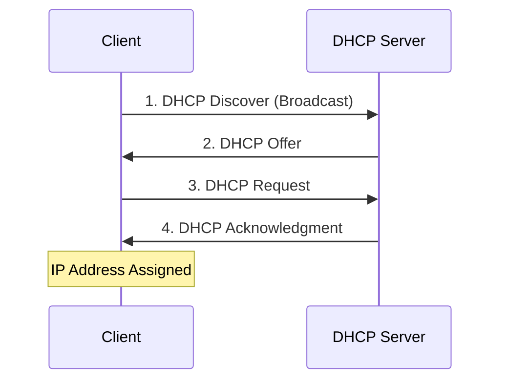

### DHCP Components

|Component|Description|
|---|---|
|**DHCP Server**|Manages IP address pool and assigns addresses|
|**DHCP Client**|Device requesting network configuration|
|**IP Address Pool**|Range of available IP addresses|
|**Lease Time**|Duration for which IP is assigned|
|**Scope**|Range of IPs available for distribution|

### Configuration Parameters Provided by DHCP

- IP Address
- Subnet Mask
- Default Gateway
- DNS Server addresses
- Domain Name
- Lease Duration

### DevOps Relevance

In cloud environments (AWS, Azure, GCP), DHCP is managed by the cloud provider's VPC. In on-premise infrastructure automation (Ansible, Terraform), understanding DHCP is essential for network provisioning.

---

## NAT (Network Address Translation)

NAT translates private IP addresses to public IP addresses, allowing multiple devices to share a single public IP.

### Types of NAT

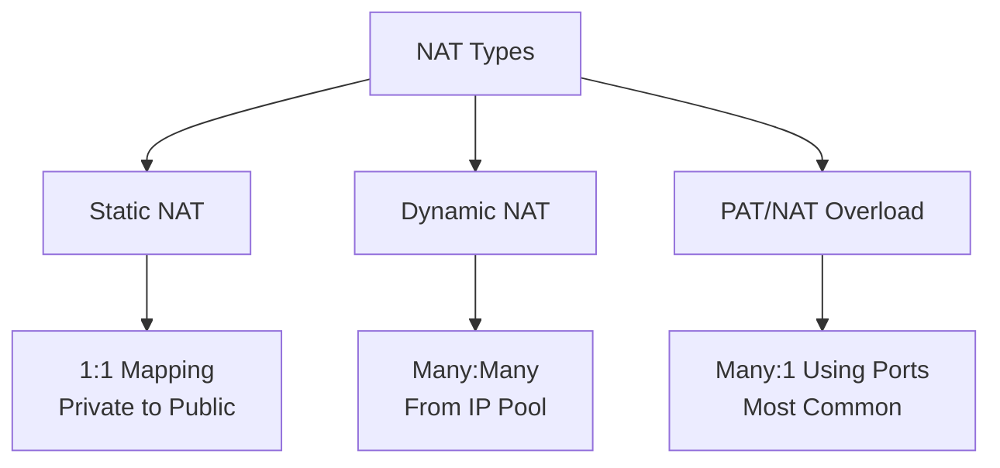

### NAT Translation Table Example

|Private IP|Private Port|Public IP|Public Port|Destination|
|---|---|---|---|---|
|192.168.1.10|54321|203.0.113.5|54321|93.184.216.34:80|
|192.168.1.15|49152|203.0.113.5|49152|142.250.185.46:443|
|192.168.1.20|51234|203.0.113.5|51234|151.101.1.140:443|

### NAT Advantages

- **IP Conservation**: Multiple devices share one public IP
- **Security**: Hides internal network structure
- **Flexibility**: Easy network reconfiguration

### NAT Disadvantages

- **Performance Overhead**: Translation processing
- **Breaks End-to-End Connectivity**: Some protocols require special handling
- **Complicates Peer-to-Peer Applications**: NAT traversal techniques needed

### DevOps Context

Understanding NAT is critical when configuring AWS NAT Gateways, Azure NAT services, or setting up VPN connections. Docker networking also uses NAT for container-to-host communication.

---

## Ports & Port Forwarding

**Ports** are virtual endpoints for network communication, allowing multiple services to run on a single IP address.

### Port Ranges

|Range|Type|Usage|
|---|---|---|
|**0-1023**|Well-Known Ports|System/privileged services (HTTP:80, HTTPS:443, SSH:22)|
|**1024-49151**|Registered Ports|User/application services (MySQL:3306, PostgreSQL:5432)|
|**49152-65535**|Dynamic/Private|Temporary client-side ports|

### Common Ports for DevOps

|Service|Port|Protocol|Description|
|---|---|---|---|
|SSH|22|TCP|Secure Shell access|
|HTTP|80|TCP|Web traffic|
|HTTPS|443|TCP|Secure web traffic|
|DNS|53|UDP/TCP|Domain Name System|
|SMTP|25|TCP|Email sending|
|MySQL|3306|TCP|Database|
|PostgreSQL|5432|TCP|Database|
|MongoDB|27017|TCP|NoSQL Database|
|Redis|6379|TCP|Cache/Data store|
|Elasticsearch|9200|TCP|Search engine|
|Kubernetes API|6443|TCP|K8s control plane|
|Docker|2375/2376|TCP|Docker daemon|
|Jenkins|8080|TCP|CI/CD|
|Prometheus|9090|TCP|Monitoring|
|Grafana|3000|TCP|Visualization|

### Port Forwarding

Port forwarding redirects traffic from one port to another, often used to expose internal services.

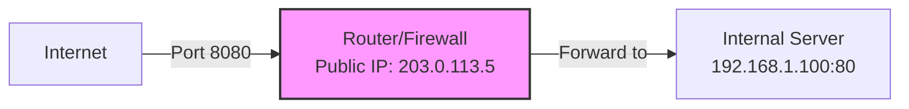

### DevOps Application

Configuring security groups (AWS), Network Security Groups (Azure), or firewall rules requires deep understanding of ports. Kubernetes Services use port mapping extensively.

---

## ISP (Internet Service Provider)

An ISP provides internet access to customers, acting as the gateway to the global internet.

### ISP Tiers

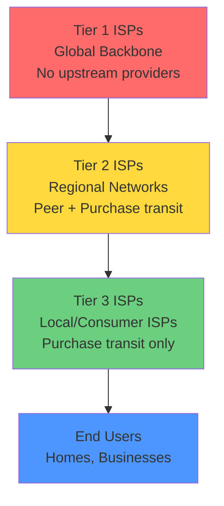

### Services Provided

- Internet connectivity
- IP address allocation
- DNS services
- Email hosting (sometimes)
- Bandwidth management
- Network security (basic)

### DevOps Perspective

When designing multi-region cloud architectures, understanding ISP peering and transit affects latency and costs. CDN selection also depends on ISP relationships.

---

## Network Types: LAN, MAN, WAN

### Comparison Table

|Feature|LAN|MAN|WAN|
|---|---|---|---|
|**Full Form**|Local Area Network|Metropolitan Area Network|Wide Area Network|
|**Coverage**|Single building/campus|City or large campus|Countries/continents|
|**Range**|Up to 1-2 km|5-50 km|Unlimited|
|**Speed**|100 Mbps - 10 Gbps+|10 Mbps - 1 Gbps|1 Mbps - 100 Gbps|
|**Ownership**|Private (organization)|Private/Public|Service provider|
|**Technology**|Ethernet, Wi-Fi|Fiber optics, WiMAX|MPLS, Leased lines, Internet|
|**Latency**|Very Low (<1ms)|Low (1-10ms)|Variable (10-500ms+)|
|**Cost**|Low|Medium|High|
|**Example**|Office network|City-wide cable network|Internet, Corporate WAN|

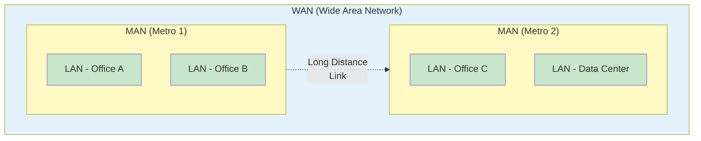

### DevOps Context

- **LAN**: Container networks, Kubernetes pod networks
- **MAN**: Multi-datacenter setups in the same city
- **WAN**: Multi-region cloud deployments, hybrid cloud architectures

---

## SONET & Frame Relay

### SONET (Synchronous Optical Networking)

SONET is a standardized protocol for transferring multiple digital bit streams synchronously over optical fiber.

**Key Characteristics:**

- High-speed data transmission over fiber
- Synchronous transmission (precise timing)
- Ring topology for redundancy
- Self-healing capabilities

**SONET Hierarchy:**

|Level|Signal|Data Rate|
|---|---|---|
|OC-1|STS-1|51.84 Mbps|
|OC-3|STS-3|155.52 Mbps|
|OC-12|STS-12|622.08 Mbps|
|OC-48|STS-48|2.488 Gbps|
|OC-192|STS-192|9.953 Gbps|
|OC-768|STS-768|39.813 Gbps|

### Frame Relay

Frame Relay is a packet-switching technology for connecting devices on a WAN.

**Characteristics:**

- Variable-length packets (frames)
- Virtual circuits (PVC/SVC)
- Lower cost than dedicated lines
- Largely obsolete, replaced by MPLS and Ethernet

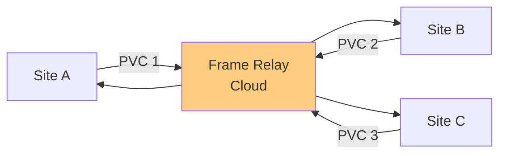

### DevOps Relevance

While SONET and Frame Relay are legacy technologies, understanding them helps when dealing with enterprise customers or migrating legacy systems to cloud infrastructure. Modern equivalents include AWS Direct Connect, Azure ExpressRoute.

---

## Network Devices: Modems & Routers

### Modem (Modulator-Demodulator)

Converts digital signals to analog (and vice versa) for transmission over phone lines, cable, or fiber.

**Types:**

- **DSL Modem**: Uses telephone lines
- **Cable Modem**: Uses coaxial cable
- **Fiber Modem (ONT)**: Optical Network Terminal for fiber connections
- **Wireless Modem**: Cellular (4G/5G) connections

### Router

Routes data packets between networks, determines the best path for data transmission.

**Functions:**

- Packet forwarding
- Routing table management
- NAT implementation
- Firewall capabilities
- DHCP server
- QoS (Quality of Service)

### Comparison

|Feature|Modem|Router|
|---|---|---|
|**Primary Function**|Signal conversion|Packet routing|
|**OSI Layer**|Layer 1-2 (Physical/Data Link)|Layer 3 (Network)|
|**Connects**|Network to ISP|Multiple devices to network|
|**IP Assignment**|Single public IP|Manages multiple private IPs|
|**Network Creation**|No|Yes (creates LAN)|

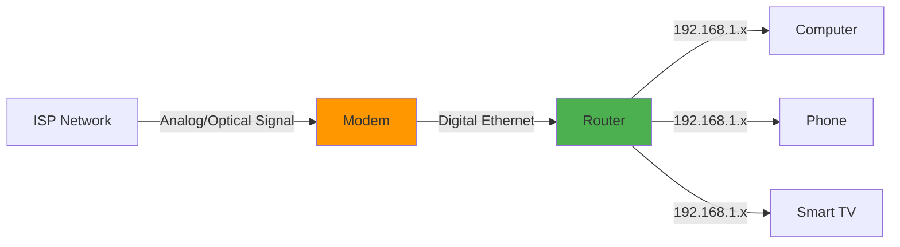

### Modern Context

In cloud environments, software-defined routers (like AWS Transit Gateway, Azure Virtual WAN) replace physical routers. Understanding routing principles remains crucial.

---

## Network Topologies

Network topology defines the arrangement of nodes and connections in a network.

### 1. Bus Topology

All devices connected to a single central cable (backbone).


**Characteristics:**

- Single point of failure (the bus)
- Easy to implement
- Limited cable length
- Performance degrades with more devices
- Difficult to troubleshoot

**Use Case:** Legacy Ethernet (10BASE2, 10BASE5) - rarely used today

### 2. Ring Topology

Each device connects to exactly two others, forming a circular path.

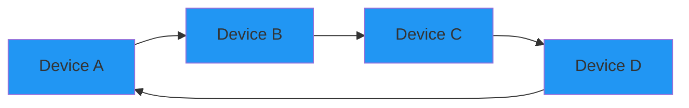

**Characteristics:**

- Data travels in one direction (or both in dual-ring)
- Equal access for all devices
- Predictable performance
- Failure of one device can break the network
- Token passing for collision avoidance

**Use Case:** SONET/SDH networks, Fiber Distributed Data Interface (FDDI)

### 3. Star Topology

All devices connect to a central hub or switch.

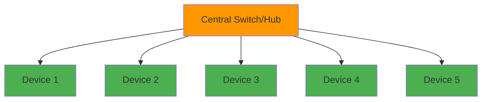

**Characteristics:**

- Central device is single point of failure
- Easy to add/remove devices
- Easy troubleshooting
- Requires more cable
- Good performance

**Use Case:** Most common in modern LANs (Ethernet networks)

### 4. Mesh Topology

Every device connects to every other device.

**Full Mesh:**

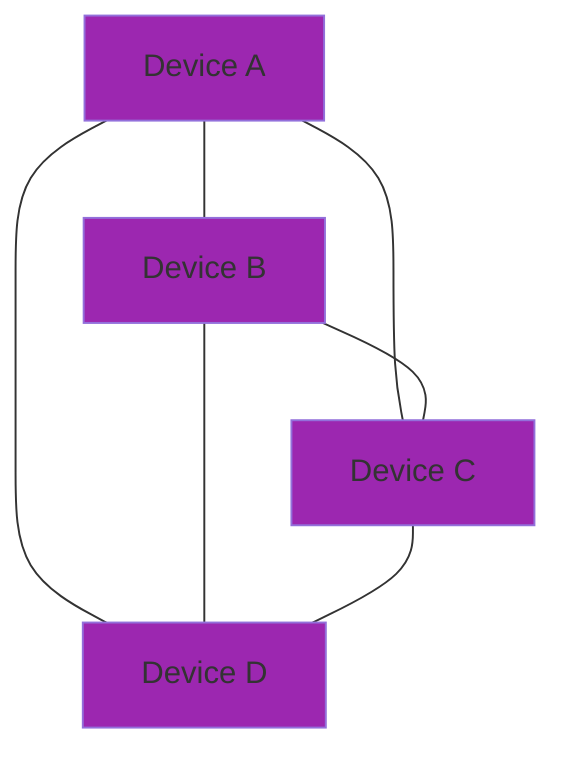

**Characteristics:**

- Highly redundant
- Expensive (many connections)
- Complex to implement
- Excellent fault tolerance
- Used in critical infrastructure

**Use Case:** Internet backbone, military networks, Kubernetes network policies

### 5. Hybrid Topology

Combination of two or more topologies.

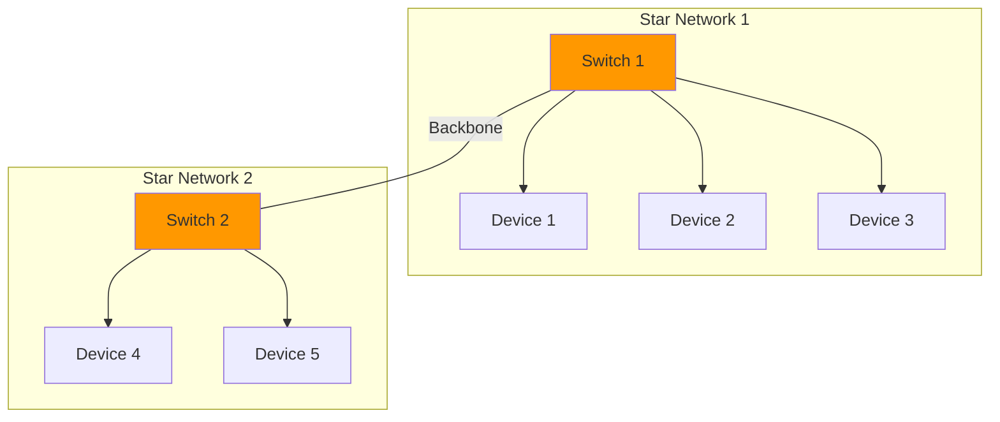

**Use Case:** Enterprise networks, data centers

### Topology Comparison for DevOps

|Topology|Redundancy|Scalability|Cost|DevOps Use Case|
|---|---|---|---|---|
|Bus|Low|Poor|Low|Legacy systems|
|Ring|Medium|Medium|Medium|Storage networks (FC)|
|Star|Low|Good|Medium|Office LANs, Wi-Fi|
|Mesh|Very High|Excellent|High|Service mesh (Istio, Linkerd)|
|Hybrid|High|Excellent|Medium-High|Modern data centers|

---

## OSI Model (7 Layers)

The OSI (Open Systems Interconnection) model is a conceptual framework for understanding network communication.

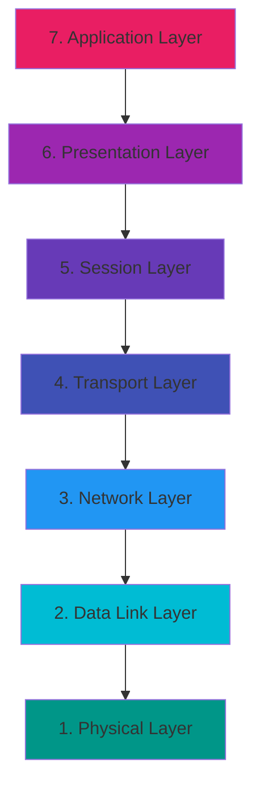

### Layer-by-Layer Breakdown

---

### Layer 7: Application Layer

**Function:** Provides network services directly to end-user applications.

**Protocols:**

- HTTP/HTTPS (Web)
- FTP/SFTP (File Transfer)
- SMTP/POP3/IMAP (Email)
- DNS (Name Resolution)
- SSH (Secure Shell)
- Telnet
- SNMP (Network Management)
- DHCP (partially)

**Data Unit:** Data/Message

**DevOps Tools at This Layer:**

- curl, wget (HTTP clients)
- Postman, Insomnia (API testing)
- Web browsers
- Email clients
- Ansible (uses SSH)

**Example:**

```bash
# HTTP request at application layer
curl -X GET https://api.example.com/users
```

---

### Layer 6: Presentation Layer

**Function:** Data translation, encryption, compression.

**Responsibilities:**

- Character encoding (ASCII, Unicode)
- Data encryption/decryption (SSL/TLS)
- Data compression
- Format conversion (JPEG, GIF, MPEG)

**Protocols/Standards:**

- SSL/TLS
- MIME
- ASCII, EBCDIC
- JPEG, GIF, PNG

**Data Unit:** Data

**DevOps Relevance:** SSL/TLS certificates for HTTPS, data serialization formats (JSON, XML, Protocol Buffers).

---

### Layer 5: Session Layer

**Function:** Manages sessions (connections) between applications.

**Responsibilities:**

- Session establishment, maintenance, termination
- Synchronization
- Dialog control (half-duplex, full-duplex)
- Session recovery

**Protocols:**

- NetBIOS
- RPC (Remote Procedure Call)
- PPTP
- L2TP

**Data Unit:** Data

**DevOps Context:** Database connections, SSH sessions, API session management (tokens, cookies).

---

### Layer 4: Transport Layer

**Function:** Reliable data transfer, flow control, error recovery.

**Key Protocols:**

#### TCP (Transmission Control Protocol)

- Connection-oriented
- Reliable delivery
- Ordered packets
- Flow control
- Error checking

#### UDP (User Datagram Protocol)

- Connectionless
- Unreliable (no delivery guarantee)
- No ordering
- Faster than TCP
- Minimal overhead

**Port Numbers:** Identifies applications (0-65535)

**Data Unit:** Segment (TCP) / Datagram (UDP)

**Sublayers:** None at this layer

**Key Concepts:**

**TCP Three-Way Handshake:**

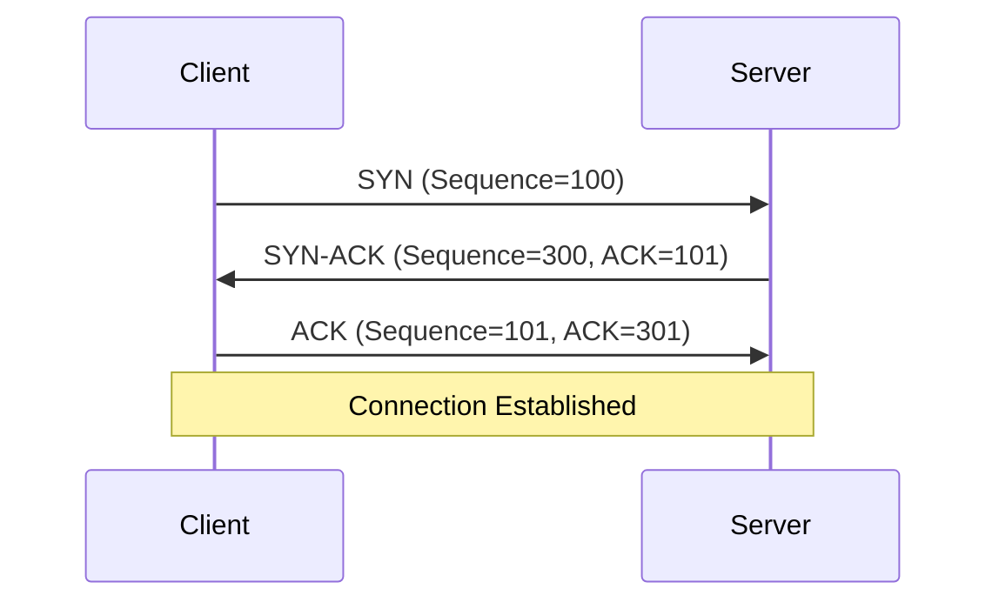

**Checksum:** Error detection mechanism

- Computed at sender
- Verified at receiver
- Detects corrupted data in transit

**Flow Control:** Window size management to prevent overwhelming receiver

**DevOps Tools:**

- netcat (nc)
- telnet
- tcpdump (packet analysis)
- Load balancers (operate at L4)

---

### Layer 3: Network Layer

**Function:** Logical addressing, routing, path determination.

**Key Responsibilities:**

- Packet forwarding
- Routing (path selection)
- Logical addressing (IP addresses)
- Packet fragmentation and reassembly

**Protocols:**

- **IP (Internet Protocol):** IPv4, IPv6
- **ICMP (Internet Control Message Protocol):** ping, traceroute
- **IGMP (Internet Group Management Protocol):** Multicast
- **IPsec:** VPN encryption
- **Routing Protocols:** OSPF, BGP, RIP, EIGRP

**Data Unit:** Packet

**Devices:** **Router** (primary device operating at Layer 3)

**Logical Addressing:**

**IPv4 Address Structure:**

```
192.168.1.10/24

Network Portion: 192.168.1
Host Portion: 10
Subnet Mask: 255.255.255.0 (or /24 in CIDR notation)
```

**Routing Table Example:**

|Destination Network|Subnet Mask|Next Hop|Interface|Metric|
|---|---|---|---|---|
|0.0.0.0|0.0.0.0|203.0.113.1|eth0|0|
|192.168.1.0|255.255.255.0|0.0.0.0|eth1|0|
|10.0.0.0|255.0.0.0|192.168.1.254|eth1|10|

**Packet Structure:**

```
+----------------+------------------+
|   IP Header    |      Payload     |
+----------------+------------------+

IP Header contains:
- Source IP Address
- Destination IP Address
- TTL (Time to Live)
- Protocol (TCP=6, UDP=17, ICMP=1)
- Header Checksum
- Flags and Fragment Offset
```

**DevOps Relevance:**

- VPC routing tables (AWS)
- Route tables (Azure)
- VPC peering
- VPN configurations
- BGP for multi-cloud connectivity
- Kubernetes NetworkPolicies

**Commands:**

```bash
# View routing table
ip route show
route -n

# Trace route
traceroute google.com

# Ping (uses ICMP)
ping 8.8.8.8
```

---

### Layer 2: Data Link Layer

**Function:** Node-to-node data transfer, physical addressing (MAC), error detection.

**Sublayers:**

#### 1. LLC (Logical Link Control)

- Flow control
- Error control
- Framing
- Protocol multiplexing

#### 2. MAC (Media Access Control)

- Physical addressing (MAC addresses)
- Channel access control
- Frame transmission/reception

**Protocols:**

- **Ethernet (IEEE 802.3)**
- **Wi-Fi (IEEE 802.11)**
- **PPP (Point-to-Point Protocol)**
- **ARP (Address Resolution Protocol)** - Maps IP to MAC
- **Spanning Tree Protocol (STP)**
- **VLAN (IEEE 802.1Q)**

**Data Unit:** Frame

**Devices:**

- **Switch** (primary device) Multi Port Bridge 
- **Bridge**:- A Repeator 
- **NIC (Network Interface Card)**

**MAC Address:**

- 48-bit address (6 bytes)
- Unique hardware identifier
- Format: `00:1A:2B:3C:4D:5E`
- First 3 bytes: OUI (Organizationally Unique Identifier)
- Last 3 bytes: Device-specific

**Ethernet Frame Structure:**

```
+----------+-------------+----------+----------+--------+-----+
| Preamble | Destination | Source   | Type/    | Data   | FCS |
| (7 bytes)| MAC (6)     | MAC (6)  | Length   |(46-1500| (4) |
+----------+-------------+----------+----------+--------+-----+

FCS = Frame Check Sequence (CRC for error detection)
```

**ARP (Address Resolution Protocol):** Maps IP addresses to MAC addresses within a LAN.

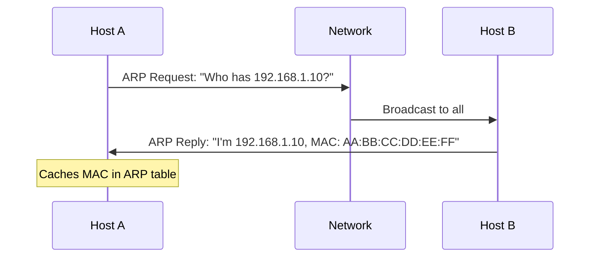

**VLAN (Virtual LAN):** Segments a physical network into multiple logical networks.

**DevOps Context:**

- Docker bridge networks use Layer 2
- Kubernetes uses virtual Ethernet pairs
- VLAN tagging in data centers
- Switch configuration in bare-metal provisioning

**Commands:**

```bash
# View MAC address
ip link show
ifconfig

# View ARP cache
arp -a
ip neigh show

# View switch MAC address table (on switch)
show mac address-table
```

---

### Layer 1: Physical Layer

**Function:** Transmission of raw bitstreams over physical medium.

**Responsibilities:**

- Bit encoding (electrical/optical signals)
- Physical topology
- Transmission mode (simplex, half-duplex, full-duplex)
- Bit rate control
- Physical medium (cables, connectors)

**Physical Media:**

- **Copper:** Ethernet cables (Cat5e, Cat6, Cat7)
- **Fiber Optic:** Single-mode, Multi-mode
- **Wireless:** Radio frequencies (Wi-Fi, Bluetooth, 5G)

**Standards:**

- IEEE 802.3 (Ethernet)
- RS-232, RS-485
- USB
- HDMI

**Data Unit:** Bits (1s and 0s)

**Devices:**

- **Hub** (broadcasts to all ports)
- **Repeater** (amplifies signal)
- **Cables, Connectors**
- **Network Interface Cards (physical components)**

**Cable Types:**

|Type|Max Distance|Speed|Use Case|
|---|---|---|---|
|Cat5e|100m|1 Gbps|Standard Ethernet|
|Cat6|100m|10 Gbps (short)|Modern LANs|
|Cat6a|100m|10 Gbps|Data centers|
|Single-mode Fiber|10-40 km|10-100 Gbps|Long distance|
|Multi-mode Fiber|550m|10-100 Gbps|Data centers|

**DevOps Relevance:**

- Data center cabling
- Fiber optic links for high-speed connections
- Understanding physical limitations for latency calculations

---

### OSI Model Summary Table

|Layer|Name|Data Unit|Key Function|Protocols|Devices|DevOps Relevance|
|---|---|---|---|---|---|---|
|7|Application|Data|User interface, application services|HTTP, SSH, DNS, SMTP|-|APIs, web services, monitoring|
|6|Presentation|Data|Data formatting, encryption|SSL/TLS, MIME|-|Certificate management|
|5|Session|Data|Session management|NetBIOS, RPC|-|Connection pooling|
|4|Transport|Segment/Datagram|Reliable delivery, ports|TCP, UDP|-|Load balancing, microservices|
|3|Network|Packet|Routing, logical addressing|IP, ICMP, OSPF, BGP|Router|VPC routing, VPNs|
|2|Data Link|Frame|Physical addressing, switching|Ethernet, ARP, VLAN|Switch, Bridge|Container networking|
|1|Physical|Bits|Physical transmission|Ethernet, Fiber|Hub, Cables|Infrastructure setup|

---

## Transport Layer Protocols: TCP vs UDP

### TCP (Transmission Control Protocol)

**Characteristics:**

- Connection-oriented (requires handshake)
- Reliable (guarantees delivery)
- Ordered (packets arrive in sequence)
- Error-checking and recovery
- Flow control
- Congestion control

**TCP Header Structure:**

```
TCP Header Fields:
- Source Port (16 bits)
- Destination Port (16 bits)
- Sequence Number (32 bits)
- Acknowledgment Number (32 bits)
- Data Offset + Flags (16 bits): SYN, ACK, FIN, RST, PSH, URG
- Window Size (16 bits)
- Checksum (16 bits)
- Urgent Pointer (16 bits)
- Options (variable)
```

**TCP Connection States:**

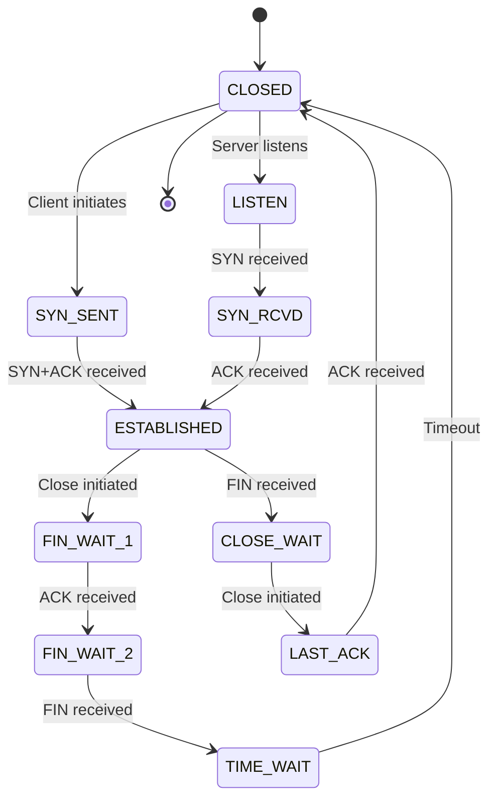

**Use Cases:**

- HTTP/HTTPS (web browsing)
- SSH (remote access)
- FTP/SFTP (file transfer)
- SMTP (email)
- Database connections (MySQL, PostgreSQL)

### UDP (User Datagram Protocol)

**Characteristics:**

- Connectionless (no handshake)
- Unreliable (no delivery guarantee)
- No ordering
- No error recovery
- Faster than TCP
- Lower overhead

**UDP Header Structure:**

```
UDP Header Fields (only 8 bytes!):
- Source Port (16 bits)
- Destination Port (16 bits)
- Length (16 bits)
- Checksum (16 bits)
```

**Use Cases:**

- DNS queries
- DHCP
- Video streaming (slight packet loss acceptable)
- Online gaming
- VoIP (Voice over IP)
- SNMP (network monitoring)
- NTP (time synchronization)

### TCP vs UDP Comparison

|Feature|TCP|UDP|
|---|---|---|
|**Connection**|Connection-oriented (3-way handshake)|Connectionless|
|**Reliability**|Guaranteed delivery, retransmission|No guarantee, no retransmission|
|**Ordering**|Packets arrive in order|No ordering|
|**Speed**|Slower (overhead)|Faster (minimal overhead)|
|**Header Size**|20-60 bytes|8 bytes|
|**Error Checking**|Extensive|Basic checksum only|
|**Flow Control**|Yes (window-based)|No|
|**Congestion Control**|Yes|No|
|**Use Case**|Reliability critical|Speed critical, loss tolerable|
|**Examples**|HTTPS, SSH, FTP, SMTP|DNS, DHCP, streaming, gaming|

### Checksum Mechanism

**Purpose:** Detect errors in transmitted data.

**Process:**

1. Sender calculates checksum from data
2. Checksum included in packet header
3. Receiver recalculates checksum
4. Compare: if mismatch, packet corrupted

**TCP Checksum:**

- Mandatory
- Covers header and data
- 16-bit one's complement sum
- Detects most errors

**UDP Checksum:**

- Optional in IPv4 (mandatory in IPv6)
- Basic error detection
- Less rigorous than TCP

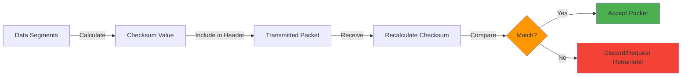

### DevOps Decision Matrix

**Choose TCP when:**

- Data integrity is critical (financial transactions, configuration files)
- Complete data delivery required (file transfers, API calls)
- Order matters (database replication)

**Choose UDP when:**

- Speed is prioritized over reliability (real-time monitoring)
- Occasional packet loss acceptable (metrics collection)
- Low latency required (service discovery)
- Broadcast/multicast needed (service announcements)

**DevOps Examples:**

|Technology|Protocol|Reason|
|---|---|---|
|Kubernetes API|TCP|Reliability for state changes|
|Prometheus scraping|TCP (HTTP)|Accurate metric collection|
|StatsD metrics|UDP|High-volume, loss tolerable|
|DNS lookups|UDP|Speed, retry on timeout|
|gRPC|TCP (HTTP/2)|Reliable RPC calls|
|Syslog|UDP/TCP|UDP for volume, TCP for critical logs|
|Docker registry|TCP (HTTPS)|Image integrity|
|Service mesh (Envoy)|TCP|Reliable proxy connections|

---

## Packets, Subnets & Addressing

### What is a Packet?

A **packet** is a formatted unit of data carried by a network. It contains both header information and payload data.

**Generic Packet Structure:**

```
+------------------+----------------------+
|     Headers      |       Payload        |
+------------------+----------------------+
| Layer 3 (IP)     |                      |
| Layer 4 (TCP/UDP)|    Application Data  |
| Layer 2 (Ethernet)|                      |
+------------------+----------------------+
```

**Encapsulation Process:**

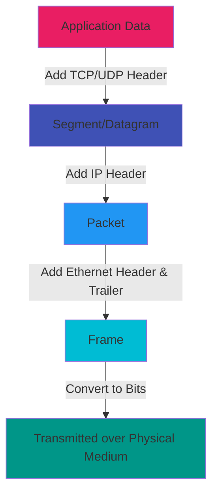

**Example: HTTP Request Packet**

```
[Ethernet Header: Src MAC | Dst MAC | Type]
  [IP Header: Src IP: 192.168.1.10 | Dst IP: 93.184.216.34 | Protocol: TCP]
    [TCP Header: Src Port: 54321 | Dst Port: 80 | Flags: PSH,ACK]
      [HTTP Data: GET /index.html HTTP/1.1...]
[Ethernet Trailer: FCS]
```

### Subnet Mask

A **subnet mask** divides an IP address into network and host portions, defining which portion identifies the network and which identifies the host.

**Purpose:**

- Network segmentation
- Efficient IP address allocation
- Routing optimization
- Security boundaries

**Subnet Mask Formats:**

```
Dotted Decimal: 255.255.255.0
Binary: 11111111.11111111.11111111.00000000
CIDR Notation: /24 (24 bits for network, 8 bits for hosts)
```

**Subnet Calculation Example:**

```
IP Address:    192.168.1.100
Subnet Mask:   255.255.255.0 (/24)

Binary Representation:
IP:            11000000.10101000.00000001.01100100
Mask:          11111111.11111111.11111111.00000000
               ─────────────────────────── ────────
Network Portion (24 bits)                  Host (8 bits)

Network Address:    192.168.1.0
Broadcast Address:  192.168.1.255
Usable Host Range:  192.168.1.1 - 192.168.1.254
Total Hosts:        256 (254 usable, 2 reserved)
```

**Common Subnet Masks:**

|CIDR|Subnet Mask|Hosts|Networks|Use Case|
|---|---|---|---|---|
|/8|255.0.0.0|16,777,214|126|Class A, very large|
|/16|255.255.0.0|65,534|16,384|Class B, large org|
|/24|255.255.255.0|254|2,097,152|Class C, typical LAN|
|/25|255.255.255.128|126|-|Small segments|
|/26|255.255.255.192|62|-|Department networks|
|/27|255.255.255.224|30|-|Small teams|
|/28|255.255.255.240|14|-|Tiny segments|
|/30|255.255.255.252|2|-|Point-to-point links|
|/32|255.255.255.255|1|-|Single host|

**VLSM (Variable Length Subnet Masking):** Allows different subnet masks within the same network for efficient IP utilization.

**Example:**

```
Organization has 192.168.1.0/24

Department A needs 100 hosts: 192.168.1.0/25 (126 hosts)
Department B needs 50 hosts:  192.168.1.128/26 (62 hosts)
Department C needs 20 hosts:  192.168.1.192/27 (30 hosts)
Point-to-point link:          192.168.1.224/30 (2 hosts)
```

### Logical Address (IP Address)

A **logical address** is a Layer 3 (Network Layer) address assigned to a device, typically an IPv4 or IPv6 address.

**Characteristics:**

- Assigned by administrator or DHCP
- Can change (especially with DHCP)
- Routable across networks
- Hierarchical structure (network + host)
- Used for end-to-end communication

**IPv4 Address Classes:**

|Class|Range|Default Mask|Networks|Hosts/Network|Usage|
|---|---|---|---|---|---|
|A|1.0.0.0 - 126.255.255.255|/8|126|16,777,214|Large organizations|
|B|128.0.0.0 - 191.255.255.255|/16|16,384|65,534|Medium organizations|
|C|192.0.0.0 - 223.255.255.255|/24|2,097,152|254|Small organizations|
|D|224.0.0.0 - 239.255.255.255|-|-|-|Multicast|
|E|240.0.0.0 - 255.255.255.255|-|-|-|Reserved/Experimental|

**Special IP Addresses:**

|Address|Purpose|
|---|---|
|0.0.0.0|Unspecified address|
|127.0.0.1|Loopback (localhost)|
|169.254.0.0/16|APIPA (Automatic Private IP Addressing)|
|255.255.255.255|Broadcast (all hosts)|
|Network Address|First IP in subnet (e.g., 192.168.1.0)|
|Broadcast Address|Last IP in subnet (e.g., 192.168.1.255)|

### MAC Address (Physical Address)

A **MAC (Media Access Control) address** is a Layer 2 (Data Link Layer) unique hardware identifier.

**Characteristics:**

- 48-bit address (6 bytes)
- Burned into NIC (Network Interface Card)
- Permanent (generally)
- Not routable (local segment only)
- Format: `XX:XX:XX:XX:XX:XX` or `XX-XX-XX-XX-XX-XX`

**Structure:**

```
MAC Address: 00:1A:2B:3C:4D:5E
             └─┬─┘ └────┬────┘
               │         │
               │         └─ Device Unique Identifier
               │
               └─ OUI (Organizationally Unique Identifier)
                  Assigned to manufacturer by IEEE
```

**Example Manufacturers:**

- `00:1A:2B` - Cisco
- `00:50:56` - VMware
- `08:00:27` - VirtualBox

**MAC Address Types:**

|Type|Description|Example|
|---|---|---|
|Unicast|Single destination|00:1A:2B:3C:4D:5E|
|Multicast|Group of devices|01:00:5E:xx:xx:xx|
|Broadcast|All devices on segment|FF:FF:FF:FF:FF:FF|

### Logical vs Physical Address Comparison

|Feature|Logical (IP) Address|Physical (MAC) Address|
|---|---|---|
|**Layer**|Layer 3 (Network)|Layer 2 (Data Link)|
|**Length**|32-bit (IPv4) or 128-bit (IPv6)|48-bit|
|**Assignment**|Dynamic (DHCP) or Static|Manufacturer (burned-in)|
|**Scope**|Global (routable)|Local (segment-only)|
|**Changeability**|Can change|Generally permanent|
|**Format**|192.168.1.10 or 2001:db8::1|00:1A:2B:3C:4D:5E|
|**Purpose**|End-to-end routing|Hop-to-hop delivery|
|**Used by**|Routers|Switches|

### Address Resolution Flow

```mermaid
sequenceDiagram
    participant Host A<br/>IP: 192.168.1.10<br/>MAC: AA:BB:CC:DD:EE:FF
    participant Switch
    participant Router<br/>IP: 192.168.1.1<br/>MAC: 11:22:33:44:55:66
    participant Internet
    
    Note over Host A: Wants to reach 8.8.8.8
    Host A->>Host A: Is 8.8.8.8 in my subnet? No
    Host A->>Host A: Need MAC of default gateway (192.168.1.1)
    Host A->>Switch: ARP: "Who has 192.168.1.1?"
    Switch->>Router: Forward ARP request
    Router->>Switch: ARP Reply: "I'm 192.168.1.1, MAC: 11:22:33:44:55:66"
    Switch->>Host A: Forward ARP reply
    Host A->>Router: Ethernet Frame<br/>Dst MAC: 11:22:33:44:55:66<br/>IP Packet to 8.8.8.8
    Router->>Internet: Routes packet with new Ethernet header
```

### DevOps Subnetting Example

**AWS VPC Subnet Design:**

```
VPC: 10.0.0.0/16 (65,536 IPs)

├─ Public Subnet 1 (AZ-1):  10.0.1.0/24  (256 IPs) - Web servers
├─ Public Subnet 2 (AZ-2):  10.0.2.0/24  (256 IPs) - Web servers
├─ Private Subnet 1 (AZ-1): 10.0.11.0/24 (256 IPs) - App servers
├─ Private Subnet 2 (AZ-2): 10.0.12.0/24 (256 IPs) - App servers
├─ Database Subnet 1 (AZ-1): 10.0.21.0/24 (256 IPs) - RDS
├─ Database Subnet 2 (AZ-2): 10.0.22.0/24 (256 IPs) - RDS
└─ Reserved for future use: 10.0.100.0/22 (1,024 IPs)
```

**Kubernetes Pod CIDR:**

```
Node 1: 10.244.1.0/24 (254 pods)
Node 2: 10.244.2.0/24 (254 pods)
Node 3: 10.244.3.0/24 (254 pods)
Service CIDR: 10.96.0.0/12
```

---

## IPv4 vs IPv6

The transition from IPv4 to IPv6 addresses the exhaustion of IPv4 addresses and introduces improvements.

### IPv4 (Internet Protocol version 4)

**Characteristics:**

- 32-bit address space
- ~4.3 billion addresses (2³² = 4,294,967,296)
- Dotted decimal notation
- Address exhaustion problem

**Format:**

```
192.168.1.100

Binary: 11000000.10101000.00000001.01100100
```

**Header Structure:**

- Variable length (20-60 bytes)
- Contains: Version, IHL, ToS, Total Length, Identification, Flags, Fragment Offset, TTL, Protocol, Checksum, Source IP, Destination IP, Options

### IPv6 (Internet Protocol version 6)

**Characteristics:**

- 128-bit address space
- 340 undecillion addresses (2¹²⁸ = 3.4 × 10³⁸)
- Hexadecimal notation with colons
- Simplified header
- Built-in IPsec support
- No NAT required
- Auto-configuration (SLAAC)

**Format:**

```
2001:0db8:85a3:0000:0000:8a2e:0370:7334

Shortened: 2001:db8:85a3::8a2e:370:7334
(consecutive zeros can be replaced with ::, only once)
```

**Address Types:**

|Type|Prefix|Description|Example|
|---|---|---|---|
|Unicast|-|Single interface|2001:db8::1|
|Multicast|ff00::/8|Group of interfaces|ff02::1|
|Anycast|-|Nearest of multiple interfaces|2001:db8::1|
|Link-Local|fe80::/10|Local network only|fe80::1|
|Unique Local|fc00::/7|Private addressing|fd00::1|
|Global Unicast|2000::/3|Internet-routable|2001:db8::1|
|Loopback|::1/128|Localhost|::1|
|Unspecified|::/128|No address|::|

### Comparison Table

|Feature|IPv4|IPv6|
|---|---|---|
|**Address Length**|32 bits|128 bits|
|**Address Space**|~4.3 billion|340 undecillion|
|**Notation**|Dotted decimal (192.168.1.1)|Hexadecimal with colons (2001:db8::1)|
|**Header Size**|Variable (20-60 bytes)|Fixed (40 bytes)|
|**Header Complexity**|More complex|Simplified|
|**Checksum**|Header checksum|No checksum (handled by L2/L4)|
|**Fragmentation**|Routers and hosts|Only hosts (PMTUD)|
|**Broadcasting**|Yes (broadcast addresses)|No (uses multicast)|
|**NAT**|Required (due to shortage)|Not needed|
|**IPsec**|Optional|Mandatory (built-in)|
|**Auto-configuration**|DHCP|SLAAC + DHCPv6|
|**QoS**|ToS field|Flow label + Traffic class|
|**Address Resolution**|ARP|NDP (Neighbor Discovery Protocol)|
|**Minimum MTU**|576 bytes|1280 bytes|
|**Address Types**|Unicast, Multicast, Broadcast|Unicast, Multicast, Anycast|

### IPv6 Address Abbreviation Rules

**Original:**

```
2001:0db8:0000:0000:0000:0000:0000:0001
```

**Rule 1: Remove leading zeros**

```
2001:db8:0:0:0:0:0:1
```

**Rule 2: Replace consecutive zeros with ::**

```
2001:db8::1
```

**Examples:**

```
2001:0db8:0000:0042:0000:8a2e:0370:7334
→ 2001:db8:0:42:0:8a2e:370:7334
→ 2001:db8:0:42::8a2e:370:7334  (or)
→ 2001:db8::42:0:8a2e:370:7334

fe80:0000:0000:0000:0000:0000:0000:0001
→ fe80::1

::1  (loopback)
::   (unspecified)
```

### IPv6 Header Format

```
+-+-+-+-+-+-+-+-+-+-+-+-+-+-+-+-+-+-+-+-+-+-+-+-+-+-+-+-+-+-+-+-+
|Version| Traffic Class |           Flow Label                  |
+-+-+-+-+-+-+-+-+-+-+-+-+-+-+-+-+-+-+-+-+-+-+-+-+-+-+-+-+-+-+-+-+
|         Payload Length        |  Next Header  |   Hop Limit   |
+-+-+-+-+-+-+-+-+-+-+-+-+-+-+-+-+-+-+-+-+-+-+-+-+-+-+-+-+-+-+-+-+
|                                                               |
+                         Source Address                        +
|                          (128 bits)                           |
+-+-+-+-+-+-+-+-+-+-+-+-+-+-+-+-+-+-+-+-+-+-+-+-+-+-+-+-+-+-+-+-+
|                                                               |
+                      Destination Address                      +
|                          (128 bits)                           |
+-+-+-+-+-+-+-+-+-+-+-+-+-+-+-+-+-+-+-+-+-+-+-+-+-+-+-+-+-+-+-+-+
```

### Transition Mechanisms

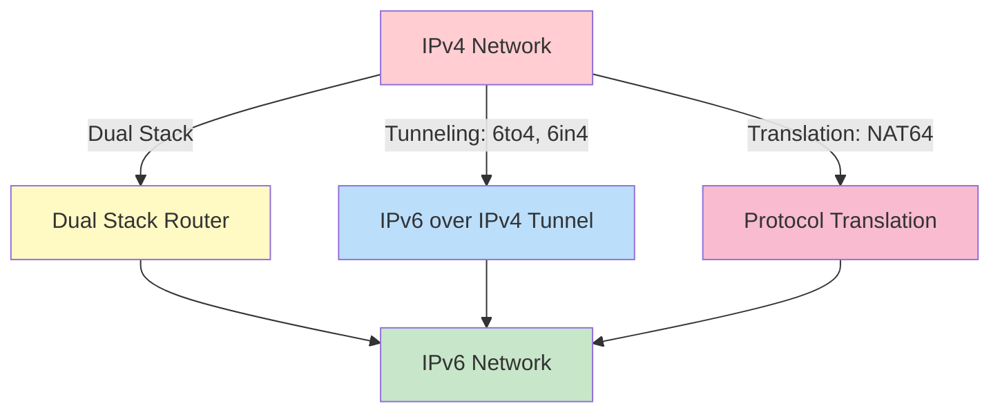

**Transition Strategies:**

1. **Dual Stack**: Running both IPv4 and IPv6 simultaneously
2. **Tunneling**: Encapsulating IPv6 packets in IPv4 packets
    - 6to4, 6in4, Teredo
3. **Translation**: Converting between IPv4 and IPv6
    - NAT64, DNS64

### DevOps Implications

**Cloud Platforms:**

- AWS: Dual-stack VPCs, IPv6-only subnets supported
- Azure: IPv6 support in VNets
- GCP: IPv6 addresses for instances

**Container Networking:**

- Docker: IPv6 support (must be explicitly enabled)
- Kubernetes: Dual-stack support (alpha/beta depending on version)

**DNS:**

- IPv4: A records
- IPv6: AAAA records ("quad-A")

```bash
# Check IPv4 DNS
dig A example.com

# Check IPv6 DNS
dig AAAA example.com

# Test IPv6 connectivity
ping6 google.com
traceroute6 google.com

# Check interface IPv6 address
ip -6 addr show
```

**Load Balancers:**

- Must support both IPv4 and IPv6
- Health checks for both address families
- Proper logging and monitoring

**Monitoring Considerations:**

```yaml
# Prometheus config example
scrape_configs:
  - job_name: 'dual-stack-app'
    static_configs:
      - targets: 
        - '[2001:db8::1]:9090'  # IPv6
        - '192.168.1.10:9090'    # IPv4
```

### Best Practices for DevOps

1. **Plan for Dual-Stack**: Support both IPv4 and IPv6 in new deployments
2. **Testing**: Test applications with both protocols
3. **Monitoring**: Monitor both address families separately
4. **Security**: Update firewall rules, security groups for IPv6
5. **Documentation**: Document IPv6 addressing schemes
6. **Training**: Ensure team understands IPv6 fundamentals
7. **Gradual Migration**: Don't rush; IPv4 will coexist for years

---

## Complete Data Flow: How Data Travels Across the Internet

### End-to-End Communication Flow

This diagram shows how data flows from one person to another across the internet, traversing through multiple layers and devices.

```mermaid
graph TB
    subgraph User_A["👤 User A (Sender)<br/>IP: 192.168.1.10<br/>MAC: AA:BB:CC:DD:EE:FF"]
        A1[Application Layer<br/>Email Client/Browser]
        A2[Presentation Layer<br/>SSL/TLS Encryption]
        A3[Session Layer<br/>Establish Session]
        A4[Transport Layer<br/>TCP Segment<br/>Port: 443]
        A5[Network Layer<br/>Add IP Header<br/>Src: 192.168.1.10<br/>Dst: 203.0.113.50]
        A6[Data Link Layer<br/>Add MAC Header<br/>Dst: Router MAC]
        A7[Physical Layer<br/>Convert to Bits]
    end

    subgraph Home_Network_A["🏠 Home Network A"]
        R1[Home Router<br/>Private: 192.168.1.1<br/>Public: 98.76.54.32]
        R1_NAT[NAT Translation<br/>Maps internal IP:Port<br/>to Public IP:Port]
    end

    subgraph ISP_A["🌐 ISP A Network"]
        ISP1[ISP Router 1]
        ISP2[ISP Router 2]
    end

    subgraph Internet_Core["☁️ Internet Core<br/>Backbone"]
        CORE1[Tier 1 ISP Router<br/>BGP Routing]
        CORE2[Tier 1 ISP Router]
        CORE3[Internet Exchange Point]
    end

    subgraph ISP_B["🌐 ISP B Network"]
        ISP3[ISP Router 3]
        ISP4[ISP Router 4]
    end

    subgraph Server_Network["🖥️ Server Network<br/>Data Center"]
        FW[Firewall<br/>Port Filtering]
        LB[Load Balancer<br/>Distributes Traffic]
        R2[Server Router<br/>Public: 203.0.113.1]
        R2_NAT[Reverse NAT<br/>Maps to Internal Server]
    end

    subgraph Web_Server["💻 Web Server<br/>IP: 10.0.1.100<br/>MAC: 11:22:33:44:55:66"]
        S7[Physical Layer<br/>Receive Bits]
        S6[Data Link Layer<br/>Remove MAC Header]
        S5[Network Layer<br/>Remove IP Header<br/>Route to Application]
        S4[Transport Layer<br/>TCP Reassembly<br/>Port: 443]
        S3[Session Layer<br/>Manage Session]
        S2[Presentation Layer<br/>SSL/TLS Decryption]
        S1[Application Layer<br/>Web Server Process<br/>Apache/Nginx]
    end

    %% Forward Path (Request)
    A1 -->|HTTP Request| A2
    A2 -->|Encrypt| A3
    A3 -->|Session Setup| A4
    A4 -->|Add TCP Header| A5
    A5 -->|Add IP Header| A6
    A6 -->|Add Ethernet Frame| A7
    A7 -->|Electrical Signals| R1

    R1 -->|Routing Decision| R1_NAT
    R1_NAT -->|Translate to Public IP| ISP1
    ISP1 -->|Layer 3 Routing| ISP2
    ISP2 -->|Route via BGP| CORE1
    
    CORE1 -->|Backbone Routing| CORE2
    CORE2 -->|Peering| CORE3
    CORE3 -->|Route to Destination| ISP3
    
    ISP3 -->|Layer 3 Routing| ISP4
    ISP4 -->|Deliver to Server Network| FW
    FW -->|Security Check<br/>Allow Port 443| LB
    LB -->|Health Check<br/>Select Server| R2
    R2 -->|Internal Routing| R2_NAT
    R2_NAT -->|Translate to 10.0.1.100| S7

    S7 -->|Convert to Digital| S6
    S6 -->|Remove Frame<br/>Check MAC| S5
    S5 -->|Remove IP Header<br/>Verify Checksum| S4
    S4 -->|Remove TCP Header<br/>Reassemble| S3
    S3 -->|Session Handling| S2
    S2 -->|Decrypt SSL/TLS| S1
    S1 -->|Process Request<br/>Generate Response| S1

    %% Styling
    style User_A fill:#e3f2fd,stroke:#1976d2,stroke-width:3px
    style Home_Network_A fill:#fff3e0,stroke:#f57c00,stroke-width:2px
    style ISP_A fill:#f3e5f5,stroke:#7b1fa2,stroke-width:2px
    style Internet_Core fill:#fce4ec,stroke:#c2185b,stroke-width:3px
    style ISP_B fill:#f3e5f5,stroke:#7b1fa2,stroke-width:2px
    style Server_Network fill:#fff3e0,stroke:#f57c00,stroke-width:2px
    style Web_Server fill:#e8f5e9,stroke:#388e3c,stroke-width:3px

    style A1 fill:#ef5350
    style A2 fill:#ec407a
    style A3 fill:#ab47bc
    style A4 fill:#5c6bc0
    style A5 fill:#42a5f5
    style A6 fill:#26c6da
    style A7 fill:#26a69a

    style S7 fill:#26a69a
    style S6 fill:#26c6da
    style S5 fill:#42a5f5
    style S4 fill:#5c6bc0
    style S3 fill:#ab47bc
    style S2 fill:#ec407a
    style S1 fill:#ef5350

    style R1_NAT fill:#ffb74d
    style R2_NAT fill:#ffb74d
    style FW fill:#e53935
    style LB fill:#43a047
    style CORE3 fill:#d81b60
```

### Detailed Step-by-Step Data Flow

#### **Phase 1: Data Encapsulation (User A's Device)**

1. **Application Layer (L7)**: User types `https://example.com` in browser, HTTP request created
2. **Presentation Layer (L6)**: SSL/TLS encrypts the data for security
3. **Session Layer (L5)**: Establishes and manages the communication session
4. **Transport Layer (L4)**:
    - Adds TCP header with source port (e.g., 54321) and destination port (443)
    - Adds sequence numbers for reliability
    - Calculates checksum
5. **Network Layer (L3)**:
    - Adds IP header with source IP (192.168.1.10) and destination IP (203.0.113.50)
    - Determines routing (destination not in local network)
6. **Data Link Layer (L2)**:
    - Performs ARP to find default gateway MAC
    - Adds Ethernet frame with source MAC and router's MAC as destination
7. **Physical Layer (L1)**: Converts frame to electrical/optical signals

#### **Phase 2: Home Network (NAT)**

8. **Home Router**:
    - Receives frame, removes Ethernet header
    - Examines IP packet
    - Performs NAT: translates private IP (192.168.1.10:54321) to public IP (98.76.54.32:54321)
    - Creates new Ethernet frame for ISP link
    - Forwards to ISP

#### **Phase 3: ISP Network (Routing)**

9. **ISP Routers**:
    - Each router examines destination IP (203.0.113.50)
    - Consults routing table
    - Forwards to next hop based on longest prefix match
    - TTL decremented at each hop
    - At each hop: old Ethernet frame removed, new one added

#### **Phase 4: Internet Core (Backbone Routing)**

10. **Tier 1 ISP Routers**:
    - Use BGP (Border Gateway Protocol) to determine best path
    - Route across internet backbone
    - May traverse multiple autonomous systems
    - Peering at Internet Exchange Points (IXP)

#### **Phase 5: Destination ISP**

11. **Destination ISP Routers**:
    - Recognize destination network (203.0.113.0/24)
    - Route to appropriate data center
    - Forward to server network edge

#### **Phase 6: Server Network (Security & Load Balancing)**

12. **Firewall**:
    
    - Inspects packet
    - Checks security rules
    - Allows port 443 (HTTPS)
    - Blocks malicious traffic
13. **Load Balancer**:
    
    - Distributes traffic across multiple servers
    - Performs health checks
    - Selects healthy server (10.0.1.100)
    - May perform SSL termination
14. **Server Router**:
    
    - Reverse NAT: translates public IP to private server IP
    - Routes to specific server

#### **Phase 7: Data Decapsulation (Web Server)**

15. **Physical Layer (L1)**: Receives signals, converts to bits
16. **Data Link Layer (L2)**:
    - Removes Ethernet frame
    - Verifies MAC address matches
    - Checks Frame Check Sequence (FCS)
17. **Network Layer (L3)**:
    - Removes IP header
    - Verifies IP address and checksum
    - Determines this is final destination
18. **Transport Layer (L4)**:
    - Removes TCP header
    - Verifies checksum
    - Reassembles segments in correct order
    - Sends ACK back to sender
19. **Session Layer (L5)**: Manages ongoing session state
20. **Presentation Layer (L6)**: Decrypts SSL/TLS encrypted data
21. **Application Layer (L7)**:
    - Web server (Apache/Nginx) processes HTTP request
    - Generates response (HTML page)

#### **Phase 8: Response (Return Path)**

The response follows the same path in reverse:

- Web server → Router → Load Balancer → Firewall → ISP → Internet Core → ISP → Home Router → User's Device
- Each device performs appropriate processing
- NAT mappings used to route back to correct internal device
- TCP ensures reliable delivery with ACK packets

### Key Protocols at Each Stage

|Stage|Layer|Key Protocols|Purpose|
|---|---|---|---|
|User Device|L1-L7|HTTP, TLS, TCP, IP, Ethernet|Data creation & encapsulation|
|Home Router|L3|NAT, IP, DHCP|Address translation|
|ISP Network|L3|IP, OSPF, MPLS|Internal routing|
|Internet Core|L3|BGP, IP|Inter-domain routing|
|Firewall|L3-L4|IP, TCP/UDP|Security filtering|
|Load Balancer|L4-L7|TCP, HTTP|Traffic distribution|
|Web Server|L1-L7|Ethernet, IP, TCP, TLS, HTTP|Request processing|

### Timing & Performance

**Typical Round-Trip Time (RTT) Breakdown:**

```
Component               Time
────────────────────────────────────
Local Network          <1 ms
ISP Network            5-20 ms
Internet Core          30-100 ms
Destination ISP        5-20 ms
Server Processing      10-50 ms
────────────────────────────────────
Total RTT:             50-200 ms
```

### What Happens at Each Router?

```mermaid
graph LR
    A[Packet Arrives] --> B{Check Destination IP}
    B --> C[Lookup in Routing Table]
    C --> D{Direct Connection?}
    D -->|Yes| E[Forward to Next Hop<br/>Same Network]
    D -->|No| F[Find Best Route<br/>Longest Prefix Match]
    F --> G[Decrement TTL]
    G --> H{TTL = 0?}
    H -->|Yes| I[Drop Packet<br/>Send ICMP Time Exceeded]
    H -->|No| J[Rewrite MAC Address<br/>Source: Router MAC<br/>Dest: Next Hop MAC]
    J --> K[Recalculate Checksum]
    K --> L[Forward Packet]
    
    style A fill:#e3f2fd
    style I fill:#ffcdd2
    style L fill:#c8e6c9
```

### NAT Translation Table Example

**At Home Router (Outbound):**

|Internal IP:Port|Public IP:Port|Destination|State|
|---|---|---|---|
|192.168.1.10:54321|98.76.54.32:54321|203.0.113.50:443|ESTABLISHED|
|192.168.1.15:49152|98.76.54.32:49152|142.250.185.46:443|ESTABLISHED|
|192.168.1.10:54322|98.76.54.32:54322|151.101.1.140:80|ESTABLISHED|

**At Server Load Balancer (Inbound):**

|Public IP:Port|Internal Server:Port|Client|State|
|---|---|---|---|
|203.0.113.50:443|10.0.1.100:443|98.76.54.32:54321|ESTABLISHED|
|203.0.113.50:443|10.0.1.101:443|203.45.67.89:49152|ESTABLISHED|
|203.0.113.50:443|10.0.1.102:443|198.51.100.23:51234|ESTABLISHED|

### DevOps Troubleshooting Using This Flow

When troubleshooting connectivity issues, work through each layer:

```bash
# Layer 1: Physical connectivity
ethtool eth0
ip link show

# Layer 2: MAC address resolution
arp -a
ip neigh show

# Layer 3: IP routing
ip route show
traceroute example.com
ping example.com

# Layer 4: Port connectivity
telnet example.com 443
nc -zv example.com 443

# Layer 7: Application
curl -v https://example.com
openssl s_client -connect example.com:443
```

### Common Failure Points

```mermaid
graph TD
    A[Connection Issue] --> B{Which Layer?}
    
    B -->|L1| C[Physical<br/>Cable unplugged<br/>Interface down<br/>Port disabled]
    
    B -->|L2| D[Data Link<br/>Wrong VLAN<br/>MAC filtering<br/>Switch port security]
    
    B -->|L3| E[Network<br/>Wrong subnet<br/>No route to host<br/>TTL expired<br/>Firewall blocking]
    
    B -->|L4| F[Transport<br/>Port closed<br/>Service not listening<br/>Connection timeout<br/>Firewall rules]
    
    B -->|L7| G[Application<br/>Service crashed<br/>Configuration error<br/>Certificate invalid<br/>HTTP error]
    
    style C fill:#ffcdd2
    style D fill:#f8bbd0
    style E fill:#e1bee7
    style F fill:#c5cae9
    style G fill:#bbdefb
```

---

## Conclusion

This comprehensive guide covers the essential networking concepts for DevOps engineers:

- **IP addressing and subnetting** for infrastructure design
- **DHCP and NAT** for address management
- **OSI Model layers** for troubleshooting and understanding protocols
- **TCP/UDP characteristics** for selecting appropriate protocols
- **Network topologies** for designing resilient architectures
- **IPv4 vs IPv6** for future-proofing infrastructure

### Key Takeaways for DevOps Interviews

1. **Understand the OSI model thoroughly** - it's the foundation for all networking discussions
2. **Know when to use TCP vs UDP** - this comes up in microservices design
3. **Master subnetting** - critical for cloud VPC design (AWS, Azure, GCP)
4. **Understand NAT and port forwarding** - essential for container networking
5. **Be familiar with common ports** - shows practical experience
6. **Know packet flow** - demonstrates deep understanding
7. **Understand IPv6 basics** - shows forward-thinking approach

### Common Interview Topics

- Designing VPC subnets for multi-tier applications
- Troubleshooting connectivity issues using OSI model
- Explaining how DNS works (multiple layers involved)
- Container networking (Docker bridge, Kubernetes CNI)
- Load balancer configurations and health checks
- Security group rules and network ACLs
- VPN configurations and tunneling protocols

### Recommended Practice

1. Set up a lab environment (VirtualBox, VMware, or cloud)
2. Practice subnetting calculations
3. Use tools: tcpdump, wireshark, netstat, ss, ip, traceroute
4. Deploy multi-tier applications and observe network flows
5. Configure firewalls, NAT, and routing
6. Troubleshoot connectivity issues systematically

---

**Document Version:** 1.0  
**Last Updated:** December 2025  
**Target Audience:** DevOps Engineers, SREs, Cloud Engineers

_This document is designed for interview preparation and practical DevOps work. For production deployments, always consult official documentation and follow organizational standards._+-