---

## Table of Contents
1. [Introduction to Java and Programming Languages](#1-introduction)
2. [Java Compilation and Execution Process](#2-compilation-execution)
3. [Platform Independence in Java](#3-platform-independence)
4. [Java Development Kit (JDK)](#4-jdk)
5. [Java Runtime Environment (JRE)](#5-jre)
6. [Java Virtual Machine (JVM)](#6-jvm)
7. [Class Loading Mechanism](#7-class-loading)
8. [JVM Execution Engine](#8-jvm-execution)
9. [Memory Management in JVM](#9-memory-management)
10. [Complete Java Architecture](#10-complete-architecture)
11. [Development Environment Setup](#11-environment-setup)

---

# 1. Introduction to Java and Programming Languages {#1-introduction}

## 1.1 Why Programming Languages Exist

**The Communication Challenge:**

Computers operate at the lowest level using machine code, which consists entirely of binary digits (0s and 1s). This binary representation is the only language that computer hardware directly understands and can execute. However, writing instructions in binary presents several fundamental challenges for human programmers.

**Challenges of Machine Code:**

- Binary code is extremely difficult for humans to read and comprehend
- Writing complex programs in 0s and 1s is error-prone and time-consuming
- Debugging and maintaining binary code is nearly impossible
- No abstraction or high-level constructs available
- Platform-specific instructions require different binary code for different processors

**The Solution: High-Level Programming Languages:**

Programming languages were created to bridge the gap between human thought processes and machine execution. These languages allow developers to write instructions in human-readable syntax, which are then translated into machine code that computers can execute.

**Benefits of High-Level Languages:**

- Human-readable syntax and structure
- Abstraction from hardware complexities
- Easier debugging and maintenance
- Code reusability through functions and classes
- Platform independence (in languages like Java)
- Rich standard libraries and frameworks
- Community support and documentation

---

## 1.2 Java as a Programming Language

**Introduction to Java:**

Java is a high-level, object-oriented programming language developed by Sun Microsystems (now owned by Oracle Corporation) in 1995. It was designed with the philosophy of "Write Once, Run Anywhere" (WORA), meaning that Java code can be executed on any platform that has a Java Virtual Machine, without requiring recompilation.

**Key Characteristics of Java:**

- Object-oriented programming paradigm
- Platform-independent execution
- Robust and secure architecture
- Automatic memory management (Garbage Collection)
- Multi-threaded capabilities
- Rich standard library (Java API)
- Strong community and enterprise support

**Java Source Code:**

Java programs are written in plain text files with human-readable syntax. These files are saved with the `.java` extension and are referred to as source code files. The source code contains instructions written according to Java's syntax rules, including class definitions, methods, variables, and control structures.

```java
// Example Java source code
public class HelloWorld {
    public static void main(String[] args) {
        System.out.println("Hello, World!");
    }
}
// Saved as: HelloWorld.java
```

---

# 2. Java Compilation and Execution Process {#2-compilation-execution}

## 2.1 The Two-Stage Translation Process

Java employs a unique two-stage translation process that contributes to its platform independence. Unlike languages like C or C++ that compile directly to machine code, Java introduces an intermediate bytecode format.

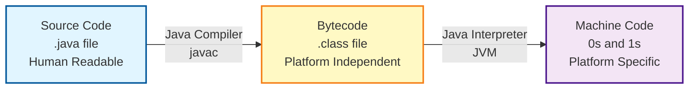

---

## 2.2 Java Compiler (javac)

**Purpose and Function:**

The Java compiler, invoked through the `javac` command, is responsible for the first stage of translation. It takes human-readable Java source code and converts it into an intermediate representation called bytecode.

**Compilation Process:**

When you compile a Java source file, the compiler performs several critical operations:

1. **Lexical Analysis:** The compiler breaks down the source code into tokens (keywords, identifiers, operators, literals)

2. **Syntax Analysis:** Verifies that the code follows Java's grammatical rules and constructs a parse tree

3. **Semantic Analysis:** Checks for semantic errors such as type mismatches, undeclared variables, and incorrect method signatures

4. **Bytecode Generation:** If all checks pass, the compiler generates platform-independent bytecode

**Bytecode Characteristics:**

- Stored in `.class` files (one per class definition)
- Platform-independent intermediate representation
- Not directly executable by the operating system
- Requires Java Virtual Machine (JVM) for execution
- More compact than source code
- Optimized for JVM interpretation

**Compilation Command:**

```bash
javac HelloWorld.java
# Produces: HelloWorld.class
```

**Why Bytecode Matters:**

The bytecode format is the key to Java's platform independence. Since bytecode is not tied to any specific hardware or operating system, the same `.class` file can be executed on any platform that has a compatible JVM. This eliminates the need to recompile code for different platforms.

---

## 2.3 Java Interpreter

**Purpose and Function:**

The Java interpreter is a component of the Java Virtual Machine that translates bytecode into machine code that the underlying hardware can execute. This translation happens at runtime, just before the instructions are executed.

**Interpretation Process:**

The interpreter reads bytecode instructions one by one and converts them to native machine instructions. This process occurs dynamically during program execution.

**Characteristics of Interpretation:**

- Line-by-line execution of bytecode
- Runtime translation to machine code
- Platform-specific machine code generation
- Slower than pre-compiled native code
- Flexible and portable

**Interpretation Limitations:**

Traditional interpretation has performance drawbacks because each bytecode instruction must be translated every time it is encountered. If a method is called repeatedly, the interpreter must translate the same bytecode multiple times, leading to performance overhead.

**Solution: Just-In-Time (JIT) Compilation:**

To address interpretation overhead, modern JVMs include a Just-In-Time compiler that compiles frequently executed bytecode sections into native machine code, which is then cached for reuse. This dramatically improves performance while maintaining platform independence.

---

# 3. Platform Independence in Java {#3-platform-independence}

## 3.1 Understanding Platform Independence

**Definition:**

Platform independence means that the same compiled Java program (bytecode) can execute on different operating systems and hardware architectures without modification or recompilation. This is one of Java's most significant advantages over traditional compiled languages.

**The Platform Dependency Problem in Traditional Languages:**

When programs written in languages like C or C++ are compiled, the compiler generates machine code specific to the target platform's processor architecture and operating system. This creates several challenges:

- Different executable files required for each platform (Windows .exe, Linux binary, macOS binary)
- Recompilation necessary when moving to a different platform
- Platform-specific APIs and system calls must be rewritten
- Testing required on each target platform
- Distribution complexity (multiple platform-specific builds)

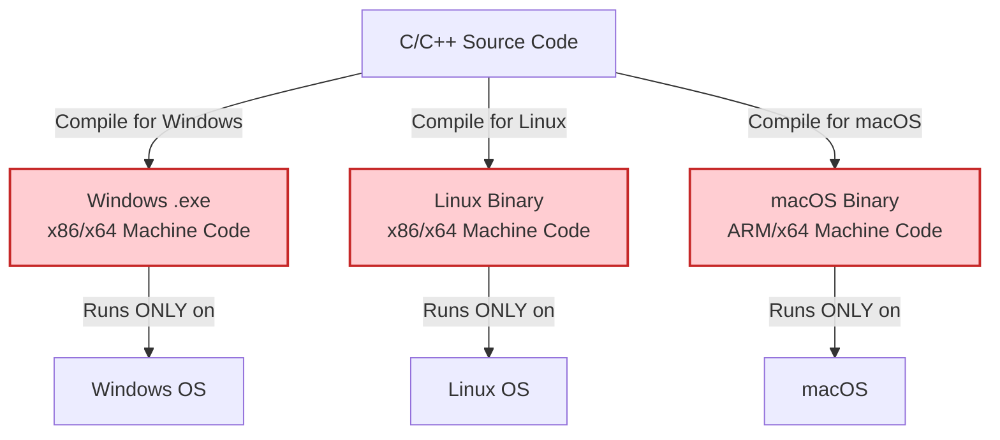

---

## 3.2 Java's Platform Independence Model

**How Java Achieves Platform Independence:**

Java introduces an abstraction layer between the compiled code and the operating system. Instead of compiling to platform-specific machine code, Java compiles to platform-independent bytecode. The Java Virtual Machine then handles the platform-specific execution.

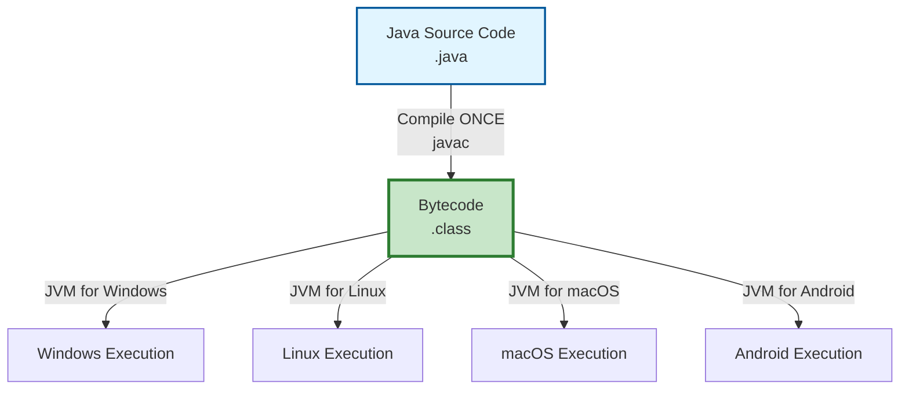

**Key Principle:**

"Java is platform independent, but the JVM is platform dependent."

This statement encapsulates Java's architecture:
- **Java bytecode** is the same regardless of the platform
- **JVM implementation** is customized for each specific operating system and hardware combination
- The JVM acts as a translator between universal bytecode and platform-specific machine code

---

## 3.3 The Role of Bytecode

**Bytecode as the Universal Intermediate:**

Bytecode serves as a universal intermediate representation that can run on any platform with an appropriate JVM. This design provides several advantages:

**Advantages of Bytecode:**

1. **True Portability:** Write once, run anywhere without recompilation

2. **Security:** Bytecode verification ensures code safety before execution

3. **Optimization Opportunities:** JVM can apply runtime optimizations based on actual execution patterns

4. **Updates and Patches:** Update JVM without recompiling applications

5. **Dynamic Loading:** Classes can be loaded and executed dynamically at runtime

**Bytecode Verification:**

Before executing bytecode, the JVM performs thorough verification to ensure:
- Code follows Java language semantics
- No stack overflows or underflows occur
- Type safety is maintained
- No illegal memory access attempts
- No violation of access restrictions

---

## 3.4 Platform-Dependent vs Platform-Independent Components

**Platform-Independent Components:**

- Java source code (.java files)
- Java bytecode (.class files)
- Java API (Application Programming Interface)
- Java language specifications
- Standard libraries and frameworks

**Platform-Dependent Components:**

- Java Virtual Machine (JVM) implementation
- Native method implementations
- Platform-specific file system access
- Hardware interaction layers
- Operating system integration

**Comparison with C/C++:**

```
C/C++ Compilation Model:
Source Code → Compiler → Platform-Specific Executable
(Must recompile for each platform)

Java Compilation Model:
Source Code → Compiler → Platform-Independent Bytecode → JVM → Execution
(Compile once, run on any platform with JVM)
```

---

# 4. Java Development Kit (JDK) {#4-jdk}

## 4.1 JDK Overview

**Definition:**

The Java Development Kit (JDK) is a complete software development environment for building Java applications. It provides all the tools necessary to write, compile, debug, and run Java programs. The JDK is essential for Java developers and includes the Java Runtime Environment (JRE) plus additional development tools.

**Purpose:**

The JDK serves as the comprehensive toolkit for Java development, containing everything a programmer needs to create Java applications from scratch. Without the JDK, developers cannot compile Java source code into bytecode.

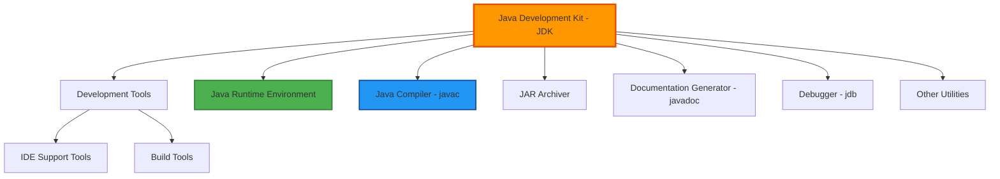

---

## 4.2 JDK Components

### A) Development Tools

**Purpose:**

Development tools provide the infrastructure and utilities needed to create, build, and manage Java applications throughout the development lifecycle.

**Key Development Tools:**

1. **Java Compiler (javac):**
   - Translates Java source code to bytecode
   - Performs syntax and semantic checking
   - Generates .class files from .java files
   - Supports various compilation options and flags

2. **Java Debugger (jdb):**
   - Command-line debugging tool
   - Allows setting breakpoints
   - Inspect variables and call stack
   - Step through code execution

3. **Java Archive Tool (jar):**
   - Creates and manages JAR (Java Archive) files
   - Packages multiple class files and resources
   - Supports compression and digital signatures
   - Used for application distribution

4. **Java Documentation Generator (javadoc):**
   - Generates HTML documentation from source code comments
   - Creates API documentation automatically
   - Supports custom tags and styling
   - Essential for project documentation

5. **Java Disassembler (javap):**
   - Disassembles class files
   - Shows bytecode instructions
   - Useful for understanding compiled code
   - Debugging and optimization tool

---

### B) Java Compiler (javac)

**Detailed Functionality:**

The Java compiler is the cornerstone of Java development, transforming human-readable source code into executable bytecode.

**Compilation Stages:**

1. **Parsing:** Analyzes source code syntax

2. **Type Checking:** Verifies type correctness

3. **Code Generation:** Creates bytecode instructions

4. **Optimization:** Performs compile-time optimizations

**Compiler Options:**

```bash
# Basic compilation
javac MyProgram.java

# Specify output directory
javac -d bin src/MyProgram.java

# Include classpath
javac -cp lib/library.jar MyProgram.java

# Enable warnings
javac -Xlint:all MyProgram.java

# Generate debugging information
javac -g MyProgram.java
```

---

### C) Archiver (JAR Tool)

**Java Archive Files:**

JAR files are compressed archive formats similar to ZIP files, specifically designed for distributing Java applications and libraries.

**JAR File Benefits:**

- Packages multiple class files into a single distributable unit
- Reduces download time through compression
- Preserves directory structure
- Can include metadata (manifest file)
- Supports digital signatures for security
- Executable JAR files can run directly with `java -jar`

**Creating JAR Files:**

```bash
# Create a JAR file
jar cf myapp.jar com/mycompany/*.class

# Create an executable JAR
jar cfe myapp.jar MainClass com/mycompany/*.class

# Extract JAR contents
jar xf myapp.jar

# View JAR contents
jar tf myapp.jar
```

---

### D) Documentation Generator (javadoc)

**Purpose:**

Javadoc automatically generates comprehensive API documentation in HTML format from specially formatted comments in source code.

**Documentation Comments:**

```java
/**
 * Calculates the factorial of a given number.
 * 
 * @param n the number to calculate factorial for
 * @return the factorial of n
 * @throws IllegalArgumentException if n is negative
 * @author John Doe
 * @version 1.0
 * @since 2024
 */
public long factorial(int n) {
    if (n < 0) {
        throw new IllegalArgumentException("Negative input");
    }
    return (n <= 1) ? 1 : n * factorial(n - 1);
}
```

**Generating Documentation:**

```bash
# Generate documentation
javadoc -d docs src/*.java

# Include private members
javadoc -private -d docs src/*.java
```

---

### E) Interpreter and Loader

**Java Interpreter:**

The interpreter component executes bytecode instructions. In modern JVMs, the interpreter works in conjunction with the JIT compiler for optimal performance.

**Class Loader:**

The class loader is responsible for loading class files into memory when needed. It finds and loads classes dynamically at runtime.

**Loader Functions:**

- Locates class files (from file system or network)
- Reads bytecode into memory
- Verifies bytecode integrity
- Links classes with dependencies
- Initializes static variables

---

## 4.3 JDK vs JRE

**Key Distinction:**

The JDK includes everything in the JRE plus additional development tools. The JRE is sufficient for running Java applications, while the JDK is required for developing them.

```
JDK = JRE + Development Tools

┌─────────────────────────────────────┐
│         JDK (Development)           │
│  ┌───────────────────────────────┐  │
│  │      JRE (Runtime)            │  │
│  │  ┌─────────────────────────┐  │  │
│  │  │     JVM (Execution)     │  │  │
│  │  │                         │  │  │
│  │  └─────────────────────────┘  │  │
│  │  + Standard Libraries         │  │
│  └───────────────────────────────┘  │
│  + Compiler (javac)                 │
│  + Debugger (jdb)                   │
│  + Documentation (javadoc)          │
│  + JAR tool                         │
└─────────────────────────────────────┘
```

---

# 5. Java Runtime Environment (JRE) {#5-jre}

## 5.1 JRE Overview

**Definition:**

The Java Runtime Environment (JRE) is an installation package that provides all the necessary components to run Java applications. While it cannot compile Java source code (no compiler included), it contains everything needed to execute pre-compiled Java bytecode.

**Target Users:**

The JRE is designed for end users who need to run Java applications but do not need development capabilities. It is a smaller, lighter package compared to the JDK.

**Primary Purpose:**

The JRE creates the runtime environment in which Java applications execute. It handles all aspects of program execution, from loading classes to managing memory and providing access to system resources.

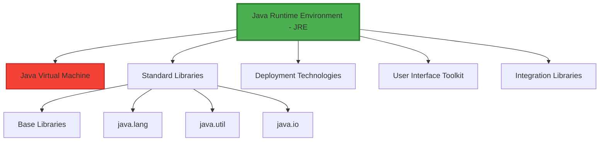

---

## 5.2 JRE Components

### A) Java Virtual Machine (JVM)

The JVM is the core execution engine within the JRE. It interprets and executes bytecode, manages memory, and provides runtime services.

**JVM Responsibilities:**

- Loading class files
- Verifying bytecode
- Executing instructions
- Managing memory (heap and stack)
- Garbage collection
- Thread management
- Security enforcement

---

### B) Base Libraries

**Core Java Libraries:**

The base libraries provide fundamental functionality that all Java programs rely on. These libraries are written in Java and compiled to bytecode, ensuring platform independence.

**Essential Packages:**

1. **java.lang:**
   - Fundamental classes automatically imported
   - String, Math, System, Thread
   - Wrapper classes (Integer, Double, etc.)
   - Exception and Error classes

2. **java.util:**
   - Collections Framework (List, Set, Map)
   - Date and time utilities
   - Random number generation
   - Scanner for input handling

3. **java.io:**
   - Input/output operations
   - File handling
   - Stream processing
   - Serialization

4. **java.net:**
   - Network programming
   - URL handling
   - Socket communication
   - HTTP connections

---

### C) Integration Libraries

**Purpose:**

Integration libraries enable Java applications to interact with external systems, databases, and other technologies.

**Key Integration Technologies:**

1. **JDBC (Java Database Connectivity):**
   - Database access and manipulation
   - SQL query execution
   - Transaction management
   - Connection pooling

2. **JNDI (Java Naming and Directory Interface):**
   - Directory service access
   - Resource lookup
   - Naming services integration

3. **RMI (Remote Method Invocation):**
   - Distributed object communication
   - Remote procedure calls
   - Network transparency

4. **JNI (Java Native Interface):**
   - Integration with native code (C/C++)
   - Platform-specific functionality
   - Performance-critical operations

---

### D) User Interface Toolkit

**GUI Frameworks:**

The JRE includes comprehensive libraries for building graphical user interfaces.

**Available Toolkits:**

1. **AWT (Abstract Window Toolkit):**
   - Original Java GUI framework
   - Platform-dependent components
   - Basic widgets and layouts

2. **Swing:**
   - Lightweight, pure Java components
   - Platform-independent appearance
   - Extensive component library
   - Pluggable look-and-feel

3. **JavaFX (in newer JRE versions):**
   - Modern UI framework
   - Rich multimedia support
   - CSS styling
   - Hardware-accelerated graphics

---

### E) Deployment Technologies

**Application Distribution:**

The JRE includes technologies for deploying and distributing Java applications.

**Deployment Options:**

1. **Java Web Start:**
   - Launch applications from web browsers
   - Automatic updates
   - Sandboxed execution

2. **Java Plugin:**
   - Run applets in web browsers
   - Browser integration
   - Secure execution environment

3. **Pack200:**
   - JAR file compression
   - Reduces download size
   - Optimized for network distribution

---

## 5.3 JRE vs JDK Comparison

```
┌──────────────────┬─────────────────────┬─────────────────────┐
│ Feature          │ JRE                 │ JDK                 │
├──────────────────┼─────────────────────┼─────────────────────┤
│ Purpose          │ Run Java programs   │ Develop and run     │
├──────────────────┼─────────────────────┼─────────────────────┤
│ Target Users     │ End users           │ Developers          │
├──────────────────┼─────────────────────┼─────────────────────┤
│ Contains JVM     │ Yes                 │ Yes                 │
├──────────────────┼─────────────────────┼─────────────────────┤
│ Contains         │ Yes                 │ Yes                 │
│ Libraries        │                     │                     │
├──────────────────┼─────────────────────┼─────────────────────┤
│ Compiler (javac) │ No                  │ Yes                 │
├──────────────────┼─────────────────────┼─────────────────────┤
│ Debugger         │ No                  │ Yes                 │
├──────────────────┼─────────────────────┼─────────────────────┤
│ JAR Tool         │ No                  │ Yes                 │
├──────────────────┼─────────────────────┼─────────────────────┤
│ Javadoc          │ No                  │ Yes                 │
├──────────────────┼─────────────────────┼─────────────────────┤
│ Size             │ Smaller             │ Larger              │
├──────────────────┼─────────────────────┼─────────────────────┤
│ Can Compile      │ No                  │ Yes                 │
│ .java files      │                     │                     │
├──────────────────┼─────────────────────┼─────────────────────┤
│ Can Run          │ Yes                 │ Yes                 │
│ .class files     │                     │                     │
└──────────────────┴─────────────────────┴─────────────────────┘
```

---

# 6. Java Virtual Machine (JVM) {#6-jvm}

## 6.1 JVM Architecture and Purpose

**Definition:**

The Java Virtual Machine (JVM) is an abstract computing machine that provides a runtime environment for executing Java bytecode. It is the cornerstone of Java's platform independence and handles all aspects of program execution, from loading classes to managing memory.

**Core Responsibilities:**

The JVM performs multiple critical functions that enable Java programs to run efficiently and securely:

1. **Bytecode Execution:** Interprets or compiles bytecode to native machine instructions

2. **Memory Management:** Allocates and manages heap and stack memory

3. **Garbage Collection:** Automatically reclaims unused memory

4. **Security:** Enforces Java security model and sandboxing

5. **Exception Handling:** Manages runtime exceptions and errors

6. **Thread Management:** Creates and schedules threads for concurrent execution

7. **Class Loading:** Dynamically loads classes as needed

---

## 6.2 JVM Architecture Layers

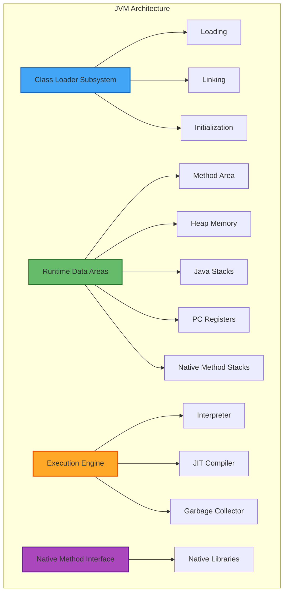

---

## 6.3 JVM Components

### A) Class Loader Subsystem

The class loader subsystem is responsible for loading class files into the JVM. It performs three main functions: loading, linking, and initialization.

**Loading Phase:**

The loading phase reads the `.class` file and loads its binary data into memory.

**Loading Steps:**

1. **Locate the Class:** Find the class file in the file system or network

2. **Read Binary Data:** Read the bytecode from the .class file

3. **Create Class Object:** Generate a Class object in the heap that represents this class

4. **Store in Method Area:** Store class-level data (methods, fields, constants) in the method area

**Types of Class Loaders:**

1. **Bootstrap Class Loader:**
   - Loads core Java classes (rt.jar)
   - Written in native code (C/C++)
   - Parent of all class loaders
   - Loads java.lang.* classes

2. **Extension Class Loader:**
   - Loads classes from extension directories
   - Loads jar files from lib/ext
   - Child of bootstrap loader

3. **Application Class Loader:**
   - Loads classes from classpath
   - Loads user-defined classes
   - Child of extension loader
   - Default class loader for applications

**Linking Phase:**

Linking prepares the loaded class for execution by performing verification, preparation, and resolution.

**Linking Sub-Phases:**

1. **Verification:**
   - Ensures bytecode is valid and safe
   - Checks file format correctness
   - Verifies bytecode instructions
   - Confirms no illegal type casting
   - Validates access restrictions
   - Prevents stack overflow/underflow

2. **Preparation:**
   - Allocates memory for static variables
   - Assigns default values to static fields
   - Default values: 0 for numbers, false for boolean, null for objects

3. **Resolution:**
   - Replaces symbolic references with direct references
   - Converts class names to memory addresses
   - Links method calls to actual method locations
   - Resolves field references

**Initialization Phase:**

The initialization phase assigns actual values to static variables and executes static initialization blocks.

**Initialization Steps:**

1. Execute static variable initializers in order of appearance

2. Execute static initialization blocks in order

3. Initialize parent class before child class

4. Initialization happens once per class

```java
public class Example {
    // Preparation: value = 0 (default)
    // Initialization: value = 100 (assigned)
    static int value = 100;
    
    // Executed during initialization
    static {
        System.out.println("Static block executed");
        value = 200;
    }
}
```

---

## 6.4 JVM Memory Areas

The JVM divides memory into several runtime data areas, each serving a specific purpose.

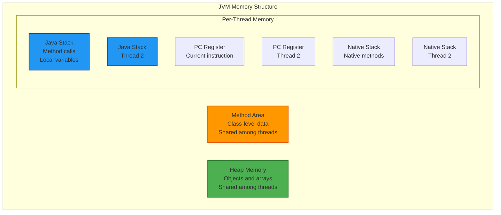

### A) Method Area

**Purpose:**

The method area stores class-level data that is shared among all instances of a class.

**Contents:**

- Class structures (metadata)
- Method bytecode
- Field information
- Static variables
- Runtime constant pool
- Method and constructor code
- Special methods (class initializers)

**Characteristics:**

- Created when JVM starts
- Shared among all threads
- Garbage collected (in modern JVMs)
- Limited size (can cause OutOfMemoryError)
- Also known as "Permanent Generation" or "Metaspace" (Java 8+)

---

### B) Heap Memory

**Purpose:**

The heap is the runtime data area where all class instances (objects) and arrays are allocated.

**Characteristics:**

- Created when JVM starts
- Shared among all threads
- Managed by garbage collector
- Dynamically sized
- Can grow or shrink based on needs
- Source of OutOfMemoryError if exhausted

**Heap Generations:**

Modern JVMs divide the heap into generations for efficient garbage collection:

1. **Young Generation:**
   - Newly created objects
   - Minor garbage collection
   - Eden space and Survivor spaces
   - Fast collection

2. **Old Generation (Tenured):**
   - Long-lived objects
   - Promoted from young generation
   - Major garbage collection
   - Less frequent collection

3. **Permanent Generation / Metaspace:**
   - Class metadata (moved to method area in Java 8+)
   - Interned strings
   - JVM internal data structures

---

### C) Java Stack

**Purpose:**

Each thread has its own private Java stack that stores method invocations and local variables.

**Stack Frame:**

Each method invocation creates a stack frame containing:

1. **Local Variables:** Method parameters and local variables

2. **Operand Stack:** Working area for bytecode operations

3. **Frame Data:** Reference to runtime constant pool, exception handling info

**Stack Operations:**

```
Method Call Sequence:

main() called:
┌────────────────┐
│ main() frame   │
│ - local vars   │
└────────────────┘

main() calls foo():
┌────────────────┐
│ foo() frame    │
│ - local vars   │
├────────────────┤
│ main() frame   │
│ - local vars   │
└────────────────┘

foo() calls bar():
┌────────────────┐
│ bar() frame    │
│ - local vars   │
├────────────────┤
│ foo() frame    │
│ - local vars   │
├────────────────┤
│ main() frame   │
│ - local vars   │
└────────────────┘

bar() returns:
(bar frame removed)
┌────────────────┐
│ foo() frame    │
│ - local vars   │
├────────────────┤
│ main() frame   │
│ - local vars   │
└────────────────┘
```

**Characteristics:**

- Thread-private (each thread has own stack)
- LIFO (Last In, First Out) structure
- Limited size (StackOverflowError if exceeded)
- Fast allocation and deallocation
- Stores primitives and object references

---

### D) Program Counter (PC) Register

**Purpose:**

The PC register contains the address of the currently executing JVM instruction.

**Characteristics:**

- One PC register per thread
- Points to current bytecode instruction
- Undefined for native methods
- Very small memory footprint
- Updated automatically during execution

---

### E) Native Method Stack

**Purpose:**

Native method stacks support native methods written in languages like C or C++ that are invoked through JNI (Java Native Interface).

**Characteristics:**

- Thread-private
- Used for native (non-Java) code execution
- Implementation-dependent
- Similar to Java stack but for native code

---

# 7. Class Loading Mechanism {#7-class-loading}

## 7.1 Complete Class Loading Process

The class loading mechanism is a crucial part of JVM runtime behavior. It follows a well-defined sequence that ensures classes are loaded correctly and securely.

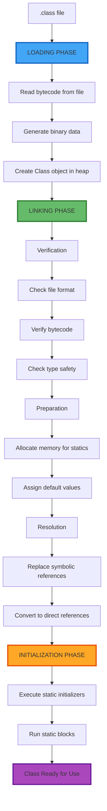

---

## 7.2 Loading Phase Details

**Binary Data Generation:**

When a class is loaded, the class loader reads the .class file and generates the following binary data:

1. **Fully Qualified Class Name:** Complete package and class name

2. **Immediate Parent Class Name:** Direct superclass information

3. **Modifiers:** Access modifiers (public, private, protected, etc.)

4. **Interfaces:** List of implemented interfaces

5. **Variables:** Field information with types and modifiers

6. **Methods:** Method signatures, code, and metadata

7. **Constructors:** Constructor definitions

8. **Static Initialization:** Static blocks and initializers

**Class Object Creation:**

After loading binary data, an instance of java.lang.Class is created in the heap memory. This Class object serves as an entry point to access the class metadata.

```java
// Accessing Class object
Class<?> clazz = MyClass.class;
String className = clazz.getName();
Method[] methods = clazz.getDeclaredMethods();
```

---

## 7.3 Linking Phase Details

### Verification

**Bytecode Verification:**

The bytecode verifier performs multiple checks to ensure the class file is valid and safe:

1. **File Format Verification:**
   - Correct magic number (0xCAFEBABE)
   - Valid version number
   - Proper constant pool structure
   - Correct file length

2. **Metadata Verification:**
   - Class has a superclass (except Object)
   - No final class is subclassed
   - No final methods are overridden
   - Access modifiers are valid

3. **Bytecode Verification:**
   - Code follows type rules
   - No stack overflow/underflow
   - Local variables initialized before use
   - Type conversions are safe

4. **Symbolic Reference Verification:**
   - Referenced classes exist
   - Methods and fields exist
   - Access permissions are correct

**Verification Benefits:**

- Prevents malicious code execution
- Ensures type safety
- Catches corrupted class files
- Enforces Java security model

---

### Preparation

**Memory Allocation:**

During preparation, the JVM allocates memory for class variables (static fields) and initializes them with default values.

**Default Values by Type:**

```
Primitive Types:
- byte, short, int, long: 0
- float, double: 0.0
- char: '\u0000' (null character)
- boolean: false

Reference Types:
- All object references: null
```

**Example:**

```java
public class Example {
    static int count;           // Preparation: count = 0
    static String name;         // Preparation: name = null
    static boolean flag;        // Preparation: flag = false
    static double value;        // Preparation: value = 0.0
}
```

---

### Resolution

**Symbolic to Direct References:**

Java bytecode uses symbolic references (names) to refer to classes, methods, and fields. Resolution converts these symbolic references to direct memory addresses.

**Resolution Types:**

1. **Class Resolution:** Convert class names to memory addresses

2. **Field Resolution:** Link field references to actual field locations

3. **Method Resolution:** Connect method calls to method implementations

4. **Interface Method Resolution:** Resolve interface method implementations

**Example:**

```java
// Source code
MyClass obj = new MyClass();
obj.myMethod();

// Bytecode (symbolic references)
new #2                  // Symbolic reference to MyClass
invokevirtual #3        // Symbolic reference to myMethod

// After resolution (direct references)
new 0x00FF1234          // Direct memory address
invokevirtual 0x00FF5678 // Direct method address
```

---

## 7.4 Initialization Phase

**Static Initialization:**

During initialization, static variables are assigned their actual values (as defined in code), and static initialization blocks are executed.

**Initialization Order:**

1. If the class has a superclass and it's not initialized, initialize the superclass first

2. Execute static variable initializers from top to bottom

3. Execute static initialization blocks from top to bottom

**Initialization Example:**

```java
public class Parent {
    static {
        System.out.println("Parent static block");
    }
    static int parentValue = initParent();
    
    static int initParent() {
        System.out.println("Parent static method");
        return 100;
    }
}

public class Child extends Parent {
    static {
        System.out.println("Child static block");
    }
    static int childValue = initChild();
    
    static int initChild() {
        System.out.println("Child static method");
        return 200;
    }
}

// When Child class is loaded:
// Output:
// Parent static block
// Parent static method
// Child static block
// Child static method
```

**Class Initialization Triggers:**

A class is initialized when:
- An instance is created (new keyword)
- A static method is invoked
- A static field is accessed (except compile-time constants)
- A subclass is initialized
- Designated as the startup class (contains main method)

---

# 8. JVM Execution Engine {#8-jvm-execution}

## 8.1 Execution Engine Overview

The execution engine is the component of the JVM that actually runs the bytecode. It consists of three main parts: the interpreter, the JIT compiler, and the garbage collector.

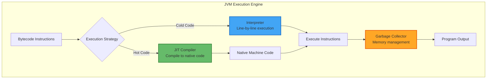

---

## 8.2 Interpreter

**Purpose:**

The interpreter reads bytecode instructions one at a time and executes them directly without prior compilation to machine code.

**Interpretation Process:**

1. **Fetch:** Read next bytecode instruction

2. **Decode:** Determine what operation to perform

3. **Execute:** Perform the operation

4. **Update:** Move to next instruction

**Characteristics:**

- Line-by-line execution
- Immediate execution (no compilation delay)
- Platform-independent behavior
- Slower than compiled code
- Suitable for infrequently executed code

**Interpretation Overhead:**

The main disadvantage of interpretation is repeated translation. If a method is called 1000 times, the interpreter translates the same bytecode 1000 times.

```
Example: Method called repeatedly

Loop iteration 1: Interpret bytecode
Loop iteration 2: Interpret bytecode (again!)
Loop iteration 3: Interpret bytecode (again!)
...
Loop iteration 1000: Interpret bytecode (again!)

Total: 1000 interpretations of the same code
Problem: Wasted effort, slow execution
```

---

## 8.3 Just-In-Time (JIT) Compiler

**Purpose:**

The JIT compiler solves the interpretation performance problem by compiling frequently executed bytecode (hot spots) into native machine code, which is then cached for reuse.

**How JIT Works:**

1. **Profiling:** JVM monitors code execution and identifies hot spots (frequently executed code)

2. **Compilation Trigger:** When a method is called many times (threshold reached), JIT compiles it

3. **Native Code Generation:** Bytecode is compiled to optimized native machine code for the current platform

4. **Caching:** Compiled code is stored in memory for reuse

5. **Direct Execution:** Subsequent calls execute native code directly, bypassing interpretation

**JIT Compilation Process:**

```
Initial Execution (Interpreted):
Method call 1: Interpret ← Slow
Method call 2: Interpret ← Slow
Method call 3: Interpret ← Slow
...
Method call 1000: Interpret ← Slow

JIT Detects Hot Spot (e.g., after 1000 calls):
Compile to native code ← One-time cost

Future Execution (Compiled):
Method call 1001: Execute native ← Fast!
Method call 1002: Execute native ← Fast!
Method call 1003: Execute native ← Fast!
...
All future calls: Execute native ← Fast!
```

**JIT Compilation Levels:**

Modern JVMs use tiered compilation with multiple optimization levels:

1. **Level 0:** Interpreter only (no compilation)

2. **Level 1:** C1 Compiler with simple optimizations

3. **Level 2:** C1 Compiler with full optimizations

4. **Level 3:** C2 Compiler with basic optimizations

5. **Level 4:** C2 Compiler with full optimizations (most aggressive)

**JIT Optimizations:**

The JIT compiler applies sophisticated optimizations:

- **Inlining:** Replace method calls with method body

- **Dead Code Elimination:** Remove unreachable code

- **Loop Optimization:** Unroll loops, move invariants

- **Escape Analysis:** Allocate objects on stack if they don't escape

- **Branch Prediction:** Optimize based on runtime behavior

- **Register Allocation:** Efficient use of CPU registers

**Benefits of JIT:**

- Combines benefits of interpretation and compilation
- Adaptive optimization based on actual runtime behavior
- Near-native performance for hot code
- Platform-specific optimizations
- No ahead-of-time compilation delay

---

## 8.4 Garbage Collector

**Purpose:**

The garbage collector automatically manages memory by identifying and reclaiming memory occupied by objects that are no longer in use.

**Why Garbage Collection?**

In languages like C/C++, programmers must manually allocate and deallocate memory. Forgetting to free memory causes memory leaks. Freeing memory prematurely causes dangling pointers. Java's garbage collector eliminates these problems.

**Garbage Collection Process:**

1. **Mark Phase:** Identify which objects are still reachable (alive)

2. **Sweep Phase:** Reclaim memory from unreachable (dead) objects

3. **Compact Phase (optional):** Move live objects together to reduce fragmentation

**Reachability:**

An object is reachable if it can be accessed through a chain of references starting from GC roots.

**GC Roots:**

- Local variables in active methods
- Static variables
- Active threads
- JNI references

**Generational Garbage Collection:**

Most objects die young. Generational GC takes advantage of this by dividing the heap into generations:

1. **Young Generation:** 
   - New objects allocated here
   - Frequent, fast minor GC
   - Most objects die quickly

2. **Old Generation:**
   - Long-lived objects promoted here
   - Infrequent, slower major GC
   - Contains surviving objects

**Garbage Collection Algorithms:**

1. **Serial GC:** Single-threaded, simple, suitable for small applications

2. **Parallel GC:** Multi-threaded, high throughput, suitable for multi-core systems

3. **CMS (Concurrent Mark Sweep):** Low pause times, runs concurrently with application

4. **G1 (Garbage First):** Balanced throughput and latency, predictable pause times

5. **ZGC / Shenandoah:** Ultra-low pause times (< 10ms), suitable for large heaps

---

# 9. Memory Management in JVM {#9-memory-management}

## 9.1 Stack Memory

**Purpose:**

Stack memory stores method call information and local variables. Each thread has its own private stack.

**Stack Memory Contents:**

For each method invocation, a stack frame is created containing:

1. **Local Variables Array:**
   - Method parameters
   - Local variables declared in the method
   - Sized at compile time

2. **Operand Stack:**
   - Working space for computations
   - Holds intermediate results
   - Push/pop operations

3. **Frame Data:**
   - Reference to constant pool
   - Exception handling information
   - Return value location

**Stack Memory Example:**

```java
public class StackExample {
    public static void main(String[] args) {
        int x = 10;        // Stored in main's stack frame
        int y = 20;        // Stored in main's stack frame
        int result = add(x, y);
        System.out.println(result);
    }
    
    public static int add(int a, int b) {
        int sum = a + b;   // a, b, sum in add's stack frame
        return sum;
    }
}
```

**Stack Memory Visualization:**

```
When add() is executing:

┌─────────────────────┐  ← Stack Top
│ add() Stack Frame   │
├─────────────────────┤
│ Local Variables:    │
│   a = 10            │
│   b = 20            │
│   sum = 30          │
├─────────────────────┤
│ Operand Stack       │
├─────────────────────┤
│ Frame Data          │
└─────────────────────┘

┌─────────────────────┐
│ main() Stack Frame  │
├─────────────────────┤
│ Local Variables:    │
│   x = 10            │
│   y = 20            │
│   result = ?        │
├─────────────────────┤
│ Operand Stack       │
├─────────────────────┤
│ Frame Data          │
└─────────────────────┘  ← Stack Bottom
```

**Stack Characteristics:**

- Fast allocation and deallocation (push/pop)
- Limited size (StackOverflowError if exceeded)
- Thread-private (each thread has own stack)
- Automatically managed (no manual cleanup)
- Stores primitives and object references (not objects themselves)
- LIFO structure

---

## 9.2 Heap Memory

**Purpose:**

Heap memory stores all objects and arrays created during program execution. All threads share the heap.

**Object Allocation:**

When you create an object with `new`, memory is allocated on the heap:

```java
Person person = new Person("Mukul", 25);
//       ↑               ↑
//    Reference      Object created
//    (on stack)      (on heap)
```

**Heap Memory Visualization:**

```
Stack (Thread 1):              Heap (Shared):
┌─────────────────┐           ┌──────────────────────┐
│ person          │──────────►│ Person Object        │
│ (reference)     │           │ ├─ name: "Mukul"     │
│ Value: 0x1234   │           │ ├─ age: 25           │
└─────────────────┘           │ └─ methods...        │
                               └──────────────────────┘
Stack (Thread 2):              
┌─────────────────┐           ┌──────────────────────┐
│ list            │──────────►│ ArrayList Object     │
│ (reference)     │           │ ├─ size: 100         │
│ Value: 0x5678   │           │ ├─ elements: [...]   │
└─────────────────┘           │ └─ methods...        │
                               └──────────────────────┘
```

**Heap Generations:**

```
┌────────────────────────────────────────────────────────┐
│                    HEAP MEMORY                         │
├────────────────────────────────────────────────────────┤
│  Young Generation                                      │
│  ┌──────────────┬─────────────┬─────────────┐        │
│  │    Eden      │  Survivor 0 │  Survivor 1 │        │
│  │   Space      │    (S0)     │    (S1)     │        │
│  │              │             │             │        │
│  │ New objects  │  Survived   │  Survived   │        │
│  │ created here │  1st GC     │  2nd GC     │        │
│  └──────────────┴─────────────┴─────────────┘        │
│                                                        │
│  Minor GC: Frequent, fast collection                  │
├────────────────────────────────────────────────────────┤
│  Old Generation (Tenured)                             │
│  ┌────────────────────────────────────────────────┐  │
│  │                                                │  │
│  │  Long-lived objects promoted from young gen   │  │
│  │  after surviving multiple minor GCs           │  │
│  │                                                │  │
│  └────────────────────────────────────────────────┘  │
│                                                        │
│  Major GC: Infrequent, slower collection              │
└────────────────────────────────────────────────────────┘
```

**Heap Characteristics:**

- Shared among all threads
- Dynamically sized (can grow/shrink)
- Managed by garbage collector
- Stores objects and arrays
- Slower allocation than stack
- Can cause OutOfMemoryError if exhausted

---

## 9.3 Stack vs Heap Comparison

```
┌──────────────────┬─────────────────────┬─────────────────────┐
│ Aspect           │ Stack               │ Heap                │
├──────────────────┼─────────────────────┼─────────────────────┤
│ Storage          │ Primitives          │ Objects             │
│                  │ Object references   │ Arrays              │
├──────────────────┼─────────────────────┼─────────────────────┤
│ Access           │ Thread-private      │ Shared (all threads)│
├──────────────────┼─────────────────────┼─────────────────────┤
│ Size             │ Small (1-8 MB)      │ Large (GBs)         │
├──────────────────┼─────────────────────┼─────────────────────┤
│ Speed            │ Very fast           │ Slower              │
├──────────────────┼─────────────────────┼─────────────────────┤
│ Allocation       │ Automatic           │ Explicit (new)      │
├──────────────────┼─────────────────────┼─────────────────────┤
│ Deallocation     │ Automatic           │ Garbage collector   │
│                  │ (method return)     │                     │
├──────────────────┼─────────────────────┼─────────────────────┤
│ Structure        │ LIFO (stack frames) │ No ordering         │
├──────────────────┼─────────────────────┼─────────────────────┤
│ Fragmentation    │ No                  │ Yes (can occur)     │
├──────────────────┼─────────────────────┼─────────────────────┤
│ Error            │ StackOverflowError  │ OutOfMemoryError    │
├──────────────────┼─────────────────────┼─────────────────────┤
│ Scope            │ Method-level        │ Application-level   │
└──────────────────┴─────────────────────┴─────────────────────┘
```

---

# 10. Complete Java Architecture {#10-complete-architecture}

## 10.1 End-to-End Execution Flow

This section presents the complete picture of how a Java program moves from source code to execution.

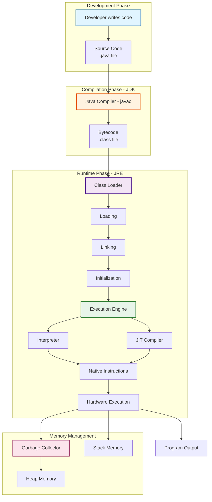

---

## 10.2 Complete Architecture Diagram

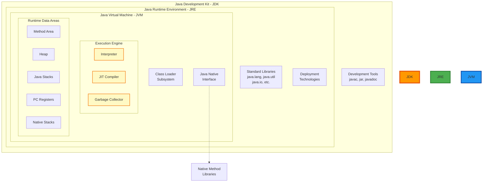

---

## 10.3 Detailed Execution Timeline

```
Complete Java Program Execution Timeline

PHASE 1: DEVELOPMENT
┌────────────────────────────────────────┐
│ Developer writes HelloWorld.java       │
│                                        │
│ public class HelloWorld {              │
│     public static void main(String[]) {│
│         System.out.println("Hello");   │
│     }                                  │
│ }                                      │
└────────────────────────────────────────┘

PHASE 2: COMPILATION (JDK - javac)
┌────────────────────────────────────────┐
│ $ javac HelloWorld.java                │
│                                        │
│ ├─ Lexical Analysis                   │
│ ├─ Syntax Checking                    │
│ ├─ Semantic Analysis                  │
│ └─ Bytecode Generation                │
│                                        │
│ Output: HelloWorld.class               │
└────────────────────────────────────────┘

PHASE 3: EXECUTION (JRE - java)
┌────────────────────────────────────────┐
│ $ java HelloWorld                      │
│                                        │
│ Step 1: CLASS LOADING                 │
│   ├─ Loading                          │
│   │   ├─ Read HelloWorld.class        │
│   │   ├─ Generate binary data         │
│   │   └─ Create Class object in heap  │
│   │                                   │
│   ├─ Linking                          │
│   │   ├─ Verification                 │
│   │   ├─ Preparation                  │
│   │   └─ Resolution                   │
│   │                                   │
│   └─ Initialization                   │
│       └─ Execute static blocks        │
│                                        │
│ Step 2: EXECUTION ENGINE              │
│   ├─ Find main() method               │
│   ├─ Create stack frame for main()    │
│   ├─ Interpreter begins execution     │
│   │   └─ Execute bytecode line by line│
│   │                                   │
│   ├─ Encounter System.out.println()   │
│   │   ├─ Load System class            │
│   │   ├─ Access 'out' field           │
│   │   ├─ Call println() method        │
│   │   └─ Print "Hello" to console     │
│   │                                   │
│   └─ main() returns                   │
│       └─ Remove stack frame           │
│                                        │
│ Step 3: TERMINATION                   │
│   ├─ All threads complete             │
│   ├─ Garbage collection (if needed)   │
│   └─ JVM exits                        │
└────────────────────────────────────────┘

OUTPUT:
Hello
```

---

## 10.4 Component Interactions

**How All Components Work Together:**

1. **JDK provides development environment:**
   - Compiler (javac) translates source to bytecode
   - Debugger helps find and fix errors
   - Documentation generator creates API docs
   - JAR tool packages applications

2. **JRE provides runtime environment:**
   - Contains JVM for execution
   - Includes standard libraries
   - Provides deployment technologies

3. **JVM executes bytecode:**
   - Class loader loads classes into memory
   - Bytecode verifier ensures safety
   - Execution engine runs code
   - Garbage collector manages memory

4. **Memory areas store data:**
   - Method area stores class-level data
   - Heap stores objects
   - Stack stores method calls and local variables

5. **Execution engine optimizes performance:**
   - Interpreter provides quick startup
   - JIT compiler optimizes hot code
   - Garbage collector reclaims memory

---

# 11. Development Environment Setup {#11-environment-setup}

## 11.1 Required Software

To develop and run Java applications, you need to install the JDK and an Integrated Development Environment (IDE).

### A) Java Development Kit (JDK)

**Download Source:**

Official Oracle JDK: https://www.oracle.com/java/technologies/javase-downloads.html

**Alternative Distributions:**

- OpenJDK (open-source): https://openjdk.java.net/
- AdoptOpenJDK: https://adoptopenjdk.net/
- Amazon Corretto: https://aws.amazon.com/corretto/
- Azul Zulu: https://www.azul.com/downloads/zulu-community/

**Installation Steps:**

1. Download the appropriate installer for your operating system

2. Run the installer with administrator privileges

3. Follow the installation wizard

4. Set JAVA_HOME environment variable

5. Add JDK bin directory to system PATH

**Verify Installation:**

```bash
# Check Java version
java -version

# Check compiler version
javac -version

# Should display version information
```

---

### B) Integrated Development Environment (IDE)

**IntelliJ IDEA (Recommended):**

IntelliJ IDEA is a powerful IDE with excellent Java support, intelligent code completion, and advanced refactoring capabilities.

**Download Links:**

- Windows: https://www.jetbrains.com/idea/download/#section=windows
- macOS: https://www.jetbrains.com/idea/download/#section=mac
- Linux: https://www.jetbrains.com/idea/download/#section=linux

**Versions:**

- **Community Edition:** Free, open-source, suitable for Java development
- **Ultimate Edition:** Paid, includes additional enterprise features

**Alternative IDEs:**

1. **Eclipse:**
   - Free and open-source
   - Extensive plugin ecosystem
   - Download: https://www.eclipse.org/downloads/

2. **NetBeans:**
   - Free and open-source
   - Official Oracle support
   - Download: https://netbeans.apache.org/

3. **Visual Studio Code:**
   - Lightweight editor with Java extensions
   - Requires Java Extension Pack
   - Download: https://code.visualstudio.com/

---

## 11.2 Setting Up Environment Variables

### Windows

**Setting JAVA_HOME:**

1. Right-click "This PC" → Properties
2. Click "Advanced system settings"
3. Click "Environment Variables"
4. Under System Variables, click "New"
5. Variable name: `JAVA_HOME`
6. Variable value: `C:\Program Files\Java\jdk-17` (your JDK path)
7. Click OK

**Updating PATH:**

1. In Environment Variables, find "Path" under System Variables
2. Click "Edit"
3. Click "New"
4. Add: `%JAVA_HOME%\bin`
5. Click OK

**Verify:**

```cmd
echo %JAVA_HOME%
java -version
javac -version
```

---

### macOS

**Setting JAVA_HOME:**

Edit `.bash_profile` or `.zshrc`:

```bash
# Open terminal and edit profile
nano ~/.bash_profile  # or ~/.zshrc for newer macOS

# Add the following line
export JAVA_HOME=$(/usr/libexec/java_home)

# Add to PATH
export PATH=$JAVA_HOME/bin:$PATH

# Save and reload
source ~/.bash_profile  # or source ~/.zshrc
```

**Verify:**

```bash
echo $JAVA_HOME
java -version
javac -version
```

---

### Linux

**Setting JAVA_HOME:**

Edit `.bashrc` or `.profile`:

```bash
# Open terminal and edit bashrc
nano ~/.bashrc

# Add the following lines
export JAVA_HOME=/usr/lib/jvm/java-17-openjdk-amd64
export PATH=$JAVA_HOME/bin:$PATH

# Save and reload
source ~/.bashrc
```

**Verify:**

```bash
echo $JAVA_HOME
java -version
javac -version
```

---

## 11.3 First Java Program

**Creating Your First Program:**

```java
// File: HelloWorld.java
public class HelloWorld {
    public static void main(String[] args) {
        System.out.println("Hello, World!");
        System.out.println("Java is awesome!");
    }
}
```

**Compiling and Running:**

```bash
# Compile the program
javac HelloWorld.java

# This creates HelloWorld.class

# Run the program
java HelloWorld

# Output:
# Hello, World!
# Java is awesome!
```

**Understanding the Code:**

- `public class HelloWorld`: Declares a public class named HelloWorld
- `public static void main(String[] args)`: The entry point of the program
- `System.out.println()`: Prints text to console
- File name must match class name: HelloWorld.java
- Java is case-sensitive

---

## 11.4 Common Setup Issues and Solutions

**Issue 1: 'javac' is not recognized**

Solution: Java bin directory not in PATH
- Verify JAVA_HOME is set correctly
- Ensure %JAVA_HOME%\bin (Windows) or $JAVA_HOME/bin (Linux/Mac) is in PATH
- Restart terminal/command prompt after changes

**Issue 2: Wrong Java version**

Solution: Multiple Java installations
- Check which java is being used: `which java` (Linux/Mac) or `where java` (Windows)
- Ensure JAVA_HOME points to desired version
- Update PATH to prioritize correct JDK

**Issue 3: Class not found error**

Solution: Classpath or naming issues
- Ensure class name matches file name
- Check for package declarations
- Verify you're running from correct directory

**Issue 4: Permission denied (Linux/Mac)**

Solution: Insufficient permissions
- Use sudo for system-wide installation
- Install in user directory instead
- Check file permissions: `chmod +x file`

---

## Summary

This comprehensive guide has covered the fundamental concepts of Java architecture and environment:

1. **Introduction:** Understanding why programming languages exist and Java's role

2. **Compilation and Execution:** The two-stage process from source code to execution

3. **Platform Independence:** How Java achieves "Write Once, Run Anywhere"

4. **JDK:** The complete development toolkit with compiler and tools

5. **JRE:** The runtime environment for executing Java applications

6. **JVM:** The virtual machine that executes bytecode and manages memory

7. **Class Loading:** The three-phase process of loading, linking, and initializing classes

8. **Execution Engine:** How the interpreter and JIT compiler work together

9. **Memory Management:** Understanding stack and heap memory

10. **Complete Architecture:** How all components interact

11. **Environment Setup:** Installing and configuring your development environment

**Key Takeaways:**

- Java bytecode is platform-independent; JVM is platform-dependent
- JDK = JRE + Development Tools
- JRE = JVM + Libraries
- Class loading follows: Loading → Linking → Initialization
- JIT compiler optimizes frequently executed code
- Garbage collector automatically manages memory
- Stack memory stores method calls; heap memory stores objects

---
