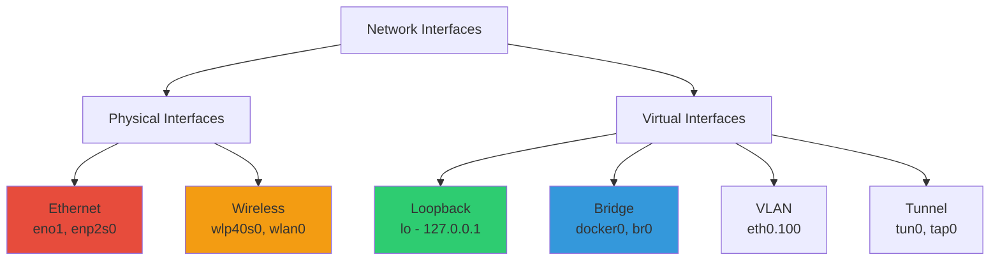

---
title:
  "{ Title }":
tags:
  - OS
  - Linux
created:
  "{ date }":
updated:
  "{ date }":
---
# Linux Networking Commands - Complete Reference

```
╔════════════════════════════════════════════════════════════════╗
║                                                                ║
║   ███╗   ██╗███████╗████████╗██╗    ██╗ ██████╗ ██████╗██╗  ██╗║
║   ████╗  ██║██╔════╝╚══██╔══╝██║    ██║██╔═══██╗██╔══██╗██║ ██╔╝║
║   ██╔██╗ ██║█████╗     ██║   ██║ █╗ ██║██║   ██║██████╔╝█████╔╝ ║
║   ██║╚██╗██║██╔══╝     ██║   ██║███╗██║██║   ██║██╔══██╗██╔═██╗ ║
║   ██║ ╚████║███████╗   ██║   ╚███╔███╔╝╚██████╔╝██║  ██║██║  ██╗║
║   ╚═╝  ╚═══╝╚══════╝   ╚═╝    ╚══╝╚══╝  ╚═════╝ ╚═╝  ╚═╝╚═╝  ╚═╝║
║                                                                ║
║              Linux Network Administration                     ║
║                                                                ║
╚════════════════════════════════════════════════════════════════╝
```

---

## Table of Contents

1. [Network Interfaces](https://claude.ai/chat/ccc747c5-c7ba-45c1-8ef0-6f9e4b64f666#network-interfaces)
2. [Connectivity Testing](https://claude.ai/chat/ccc747c5-c7ba-45c1-8ef0-6f9e4b64f666#connectivity-testing)
3. [Network Configuration](https://claude.ai/chat/ccc747c5-c7ba-45c1-8ef0-6f9e4b64f666#network-configuration)
4. [DNS Tools](https://claude.ai/chat/ccc747c5-c7ba-45c1-8ef0-6f9e4b64f666#dns-tools)
5. [Network Monitoring](https://claude.ai/chat/ccc747c5-c7ba-45c1-8ef0-6f9e4b64f666#network-monitoring)
6. [Port and Service Tools](https://claude.ai/chat/ccc747c5-c7ba-45c1-8ef0-6f9e4b64f666#port-and-service-tools)
7. [Routing Commands](https://claude.ai/chat/ccc747c5-c7ba-45c1-8ef0-6f9e4b64f666#routing-commands)
8. [Network Scanning](https://claude.ai/chat/ccc747c5-c7ba-45c1-8ef0-6f9e4b64f666#network-scanning)
9. [Data Transfer Tools](https://claude.ai/chat/ccc747c5-c7ba-45c1-8ef0-6f9e4b64f666#data-transfer-tools)
10. [Interview Preparation](https://claude.ai/chat/ccc747c5-c7ba-45c1-8ef0-6f9e4b64f666#interview-preparation)

---

## Network Interfaces

### Understanding Network Interface Naming

```ascii
┌────────────────────────────────────────────────────────────┐
│              LINUX NETWORK INTERFACE TYPES                 │
├────────────────────────────────────────────────────────────┤
│                                                            │
│  Traditional Naming (Legacy):                              │
│  ├─ eth0, eth1, eth2  → Ethernet interfaces                │
│  ├─ wlan0, wlan1      → Wireless interfaces                │
│  └─ lo                → Loopback interface                 │
│                                                            │
│  Predictable Network Interface Names (Modern):             │
│  ├─ eno1, eno2        → Onboard Ethernet                   │
│  ├─ ens1, ens33       → PCI Express slot Ethernet          │
│  ├─ enp2s0            → PCI Express (bus:slot)             │
│  ├─ wlp3s0, wlp40s0   → Wireless PCI Express               │
│  └─ docker0, br0      → Bridge interfaces                  │
│                                                            │
└────────────────────────────────────────────────────────────┘
```

### Network Interface Hierarchy



### Common Network Interfaces Explained

#### lo - Loopback Interface

```
┌─────────────────────────────────────────────────────────────┐
│                    LOOPBACK INTERFACE                       │
│                         (lo)                                │
├─────────────────────────────────────────────────────────────┤
│                                                             │
│  Purpose:                                                   │
│  - Virtual network interface for internal communication    │
│  - Always active, never fails                              │
│  - Used for local service testing                          │
│  - No physical hardware required                           │
│                                                             │
│  Default Configuration:                                     │
│  ┌───────────────────────────────────────────────────┐     │
│  │  Interface:  lo                                   │     │
│  │  IPv4:       127.0.0.1/8                          │     │
│  │  IPv6:       ::1/128                              │     │
│  │  State:      UP (always)                          │     │
│  │  MTU:        65536                                │     │
│  └───────────────────────────────────────────────────┘     │
│                                                             │
│  Common Uses:                                               │
│  - Testing network applications locally                    │
│  - Database connections (localhost)                        │
│  - Web servers (127.0.0.1:8080)                           │
│  - Inter-process communication                             │
│                                                             │
│  Example:                                                   │
│  $ ping 127.0.0.1                                          │
│  $ curl http://localhost:8080                              │
│  $ mysql -h 127.0.0.1 -u root -p                          │
│                                                             │
│  Key Facts:                                                 │
│  ✓ Packets never leave the host                            │
│  ✓ No encryption/security needed                           │
│  ✓ Very fast (no network overhead)                         │
│  ✓ Cannot be disabled                                      │
│                                                             │
└─────────────────────────────────────────────────────────────┘
```

#### eno1 / enp2s0 - Ethernet Interfaces

```
┌─────────────────────────────────────────────────────────────┐
│                   ETHERNET INTERFACES                       │
│                (eno1, enp2s0, ens33)                        │
├─────────────────────────────────────────────────────────────┤
│                                                             │
│  Naming Convention:                                         │
│  ┌───────────────────────────────────────────────────┐     │
│  │  en  → Ethernet                                   │     │
│  │  o1  → Onboard device 1                           │     │
│  │  p2  → PCI Express bus 2                          │     │
│  │  s0  → Slot 0                                     │     │
│  └───────────────────────────────────────────────────┘     │
│                                                             │
│  Examples:                                                  │
│  eno1   → First onboard Ethernet                           │
│  enp2s0 → PCI Express bus 2, slot 0                        │
│  ens33  → PCI Express slot 33 (VMs)                        │
│                                                             │
│  Typical Configuration:                                     │
│  ┌───────────────────────────────────────────────────┐     │
│  │  Interface:  eno1                                 │     │
│  │  IP:         192.168.1.100/24                     │     │
│  │  Gateway:    192.168.1.1                          │     │
│  │  DNS:        8.8.8.8                              │     │
│  │  MAC:        00:1a:2b:3c:4d:5e                    │     │
│  │  Speed:      1000 Mb/s (Gigabit)                  │     │
│  │  Duplex:     Full                                 │     │
│  └───────────────────────────────────────────────────┘     │
│                                                             │
│  Common Commands:                                           │
│  $ ip addr show eno1                                       │
│  $ sudo ip link set eno1 up                                │
│  $ sudo ip link set eno1 down                              │
│  $ ethtool eno1              # Hardware details            │
│  $ ip -s link show eno1      # Statistics                  │
│                                                             │
└─────────────────────────────────────────────────────────────┘
```

#### wlp40s0 - Wireless Interface

```
┌─────────────────────────────────────────────────────────────┐
│                   WIRELESS INTERFACES                       │
│                  (wlp40s0, wlan0)                           │
├─────────────────────────────────────────────────────────────┤
│                                                             │
│  Naming Convention:                                         │
│  ┌───────────────────────────────────────────────────┐     │
│  │  wl  → Wireless LAN                               │     │
│  │  p40 → PCI Express bus 40                         │     │
│  │  s0  → Slot 0                                     │     │
│  └───────────────────────────────────────────────────┘     │
│                                                             │
│  Configuration:                                             │
│  ┌───────────────────────────────────────────────────┐     │
│  │  Interface:  wlp40s0                              │     │
│  │  SSID:       HomeNetwork                          │     │
│  │  Mode:       Managed                              │     │
│  │  Frequency:  2.4 GHz / 5 GHz                      │     │
│  │  Channel:    6                                    │     │
│  │  Signal:     -45 dBm (Excellent)                  │     │
│  │  Security:   WPA2-PSK                             │     │
│  │  Speed:      300 Mb/s (802.11n)                   │     │
│  └───────────────────────────────────────────────────┘     │
│                                                             │
│  Common Commands:                                           │
│  $ iwconfig wlp40s0                # Wireless info          │
│  $ iw dev wlp40s0 link             # Connection status     │
│  $ iw dev wlp40s0 scan             # Scan networks         │
│  $ nmcli dev wifi list             # List WiFi networks    │
│  $ nmcli dev wifi connect "SSID" password "pass"          │
│                                                             │
│  Wireless Modes:                                            │
│  - Managed: Client mode (connect to AP)                   │
│  - Master: Access Point mode                               │
│  - Ad-Hoc: Peer-to-peer networking                         │
│  - Monitor: Packet sniffing mode                           │
│                                                             │
└─────────────────────────────────────────────────────────────┘
```

#### docker0 - Docker Bridge Interface

```
┌─────────────────────────────────────────────────────────────┐
│                   DOCKER BRIDGE INTERFACE                   │
│                        (docker0)                            │
├─────────────────────────────────────────────────────────────┤
│                                                             │
│  Purpose:                                                   │
│  - Virtual Ethernet bridge for Docker containers           │
│  - Default network for containers                          │
│  - Provides NAT for container internet access              │
│  - Created automatically by Docker daemon                  │
│                                                             │
│  Default Configuration:                                     │
│  ┌───────────────────────────────────────────────────┐     │
│  │  Interface:  docker0                              │     │
│  │  IP:         172.17.0.1/16                        │     │
│  │  Type:       Bridge                               │     │
│  │  State:      UP (when Docker running)             │     │
│  │  MTU:        1500                                 │     │
│  └───────────────────────────────────────────────────┘     │
│                                                             │
│  How It Works:                                              │
│  ┌───────────────────────────────────────────────────┐     │
│  │                                                   │     │
│  │   Host Machine (172.17.0.1)                       │     │
│  │          │                                        │     │
│  │          │ docker0 bridge                         │     │
│  │          │                                        │     │
│  │    ┌─────┼─────┬─────────┬─────────┐             │     │
│  │    │           │         │         │             │     │
│  │  veth1      veth2      veth3     veth4           │     │
│  │    │           │         │         │             │     │
│  │ Container1 Container2 Container3 Container4      │     │
│  │ 172.17.0.2 172.17.0.3 172.17.0.4 172.17.0.5     │     │
│  │                                                   │     │
│  └───────────────────────────────────────────────────┘     │
│                                                             │
│  Common Commands:                                           │
│  $ ip addr show docker0                                    │
│  $ docker network ls                                       │
│  $ docker network inspect bridge                           │
│  $ sudo iptables -t nat -L -n  # NAT rules                │
│                                                             │
│  Key Features:                                              │
│  ✓ Automatic IP assignment via DHCP                        │
│  ✓ Internal DNS resolution                                 │
│  ✓ Port forwarding via iptables                            │
│  ✓ Container-to-container communication                    │
│                                                             │
└─────────────────────────────────────────────────────────────┘
```

---

## Connectivity Testing

### ping - ICMP Echo Request

```
┌─────────────────────────────────────────────────────────────┐
│                          PING                               │
│              (Packet Internet Groper)                       │
├─────────────────────────────────────────────────────────────┤
│                                                             │
│  Purpose:                                                   │
│  - Test network connectivity                                │
│  - Measure round-trip time (latency)                        │
│  - Check packet loss                                        │
│  - Verify DNS resolution                                    │
│                                                             │
│  How It Works:                                              │
│  ┌───────────────────────────────────────────────────┐     │
│  │                                                   │     │
│  │  Your Computer                                    │     │
│  │       │                                           │     │
│  │       │ ICMP Echo Request (Type 8)               │     │
│  │       ├──────────────────────────────────►        │     │
│  │       │                                  Target   │     │
│  │       │ ICMP Echo Reply (Type 0)                 │     │
│  │       ◄──────────────────────────────────┤        │     │
│  │       │                                           │     │
│  │  Round-Trip Time (RTT) measured                   │     │
│  │                                                   │     │
│  └───────────────────────────────────────────────────┘     │
│                                                             │
│  Basic Usage:                                               │
│  $ ping google.com                                         │
│  $ ping 8.8.8.8                                            │
│  $ ping -c 4 google.com        # Send 4 packets            │
│  $ ping -i 2 google.com         # 2 second interval        │
│  $ ping -s 1000 google.com      # 1000 byte packet size    │
│                                                             │
│  Advanced Options:                                          │
│  $ ping -c 10 -i 0.2 google.com  # Fast ping               │
│  $ ping -W 1 google.com          # 1 second timeout        │
│  $ ping -I eth0 google.com       # Specific interface      │
│  $ ping -t 5 google.com          # TTL = 5 hops            │
│  $ ping -f google.com            # Flood ping (root only)  │
│                                                             │
│  Output Example:                                            │
│  ┌───────────────────────────────────────────────────┐     │
│  │ PING google.com (142.250.185.46) 56(84) bytes    │     │
│  │ 64 bytes from lhr25s34: icmp_seq=1 ttl=117 time=15ms │  │
│  │ 64 bytes from lhr25s34: icmp_seq=2 ttl=117 time=14ms │  │
│  │ 64 bytes from lhr25s34: icmp_seq=3 ttl=117 time=16ms │  │
│  │                                                   │     │
│  │ --- google.com ping statistics ---                │     │
│  │ 3 packets transmitted, 3 received, 0% packet loss │     │
│  │ rtt min/avg/max/mdev = 14.2/15.0/16.1/0.8 ms    │     │
│  └───────────────────────────────────────────────────┘     │
│                                                             │
│  Troubleshooting:                                           │
│  ❌ "Destination Host Unreachable" → Routing issue          │
│  ❌ "Request timeout" → Firewall/host down                  │
│  ❌ "Name or service not known" → DNS issue                 │
│  ❌ "Network is unreachable" → No route to network          │
│                                                             │
└─────────────────────────────────────────────────────────────┘
```

### traceroute vs tracepath

```
┌─────────────────────────────────────────────────────────────┐
│              TRACEROUTE vs TRACEPATH                        │
│              (Path Discovery Tools)                         │
├─────────────────────────────────────────────────────────────┤
│                                                             │
│  Purpose:                                                   │
│  - Trace network path to destination                       │
│  - Identify routing issues                                 │
│  - Measure latency per hop                                 │
│  - Discover network topology                               │
│                                                             │
│  How They Work:                                             │
│  ┌───────────────────────────────────────────────────┐     │
│  │                                                   │     │
│  │  Your PC → Router1 → Router2 → Router3 → Target   │     │
│  │  (TTL=1)   (TTL=2)   (TTL=3)   (TTL=4)            │     │
│  │                                                   │     │
│  │  Step 1: Send packet with TTL=1                   │     │
│  │         Router1 responds (TTL exceeded)           │     │
│  │  Step 2: Send packet with TTL=2                   │     │
│  │         Router2 responds                          │     │
│  │  Step 3: Continue until destination reached       │     │
│  │                                                   │     │
│  └───────────────────────────────────────────────────┘     │
│                                                             │
│  traceroute (Traditional):                                  │
│  $ traceroute google.com                                   │
│  $ traceroute -n google.com       # No DNS resolution       │
│  $ traceroute -I google.com       # Use ICMP (needs root)  │
│  $ traceroute -T google.com       # Use TCP                │
│  $ traceroute -m 20 google.com    # Max 20 hops            │
│                                                             │
│  tracepath (Modern, No Root):                               │
│  $ tracepath google.com                                    │
│  $ tracepath -n google.com        # No DNS resolution       │
│  $ tracepath -b google.com        # Both IP and hostname   │
│                                                             │
│  Output Example:                                            │
│  ┌───────────────────────────────────────────────────┐     │
│  │ traceroute to google.com (142.250.185.46)         │     │
│  │  1  192.168.1.1 (192.168.1.1)  2.5 ms  2.3 ms     │     │
│  │  2  10.0.0.1 (10.0.0.1)  8.2 ms  7.8 ms           │     │
│  │  3  * * *                    (timeout)            │     │
│  │  4  72.14.215.85  15.2 ms  14.8 ms  15.1 ms       │     │
│  │  5  142.250.185.46  16.5 ms  !X  !X               │     │
│  └───────────────────────────────────────────────────┘     │
│                                                             │
│  Comparison:                                                │
│  ┌──────────────┬─────────────┬──────────────┐             │
│  │ Feature      │ traceroute  │ tracepath    │             │
│  ├──────────────┼─────────────┼──────────────┤             │
│  │ Root needed  │ Sometimes   │ No           │             │
│  │ Protocol     │ UDP/ICMP/TCP│ UDP          │             │
│  │ MTU discover │ No          │ Yes          │             │
│  │ Pre-installed│ Usually     │ Usually      │             │
│  │ Flexibility  │ High        │ Limited      │             │
│  └──────────────┴─────────────┴──────────────┘             │
│                                                             │
│  Symbols in Output:                                         │
│  * → Timeout (no response from this hop)                   │
│  !H → Host unreachable                                      │
│  !N → Network unreachable                                   │
│  !X → Communication administratively prohibited            │
│                                                             │
└─────────────────────────────────────────────────────────────┘
```

### mtr - My TraceRoute

```
┌─────────────────────────────────────────────────────────────┐
│                           MTR                               │
│          (Combines ping + traceroute)                       │
├─────────────────────────────────────────────────────────────┤
│                                                             │
│  Purpose:                                                   │
│  - Real-time network diagnostics                           │
│  - Continuous monitoring of route                          │
│  - Statistical analysis of packet loss                     │
│  - Better than traceroute for troubleshooting              │
│                                                             │
│  Basic Usage:                                               │
│  $ mtr google.com                                          │
│  $ mtr -r -c 100 google.com    # Report mode, 100 packets  │
│  $ mtr -n google.com           # No DNS resolution          │
│  $ mtr -b google.com           # Both IP and hostname       │
│  $ mtr -o "LSDR NABW" google.com  # Custom columns         │
│                                                             │
│  Interactive Mode Output:                                   │
│  ┌───────────────────────────────────────────────────┐     │
│  │ Host                Loss%  Snt  Last  Avg  Best  Wrst │  │
│  │  1. 192.168.1.1     0.0%   10   2.1  2.3  2.0  2.8 │    │
│  │  2. 10.0.0.1        0.0%   10   8.5  8.2  7.9  9.1 │    │
│  │  3. ???             100%   10   0.0  0.0  0.0  0.0 │    │
│  │  4. 72.14.215.85    0.0%   10  15.2 15.5 14.8 16.2 │    │
│  │  5. 142.250.185.46  0.0%   10  16.8 16.5 16.1 17.2 │    │
│  └───────────────────────────────────────────────────┘     │
│                                                             │
│  Column Meanings:                                           │
│  - Loss%: Percentage of packets lost                       │
│  - Snt: Packets sent                                       │
│  - Last: Latency of last packet                            │
│  - Avg: Average latency                                    │
│  - Best: Best (minimum) latency                            │
│  - Wrst: Worst (maximum) latency                           │
│                                                             │
│  Advanced Options:                                          │
│  $ mtr -i 0.5 google.com       # 0.5 sec interval          │
│  $ mtr -s 1000 google.com      # 1000 byte packets         │
│  $ mtr -T google.com           # TCP mode                  │
│  $ mtr -u google.com           # UDP mode                  │
│  $ mtr --report google.com     # Generate report and exit  │
│                                                             │
│  Use Cases:                                                 │
│  ✓ Identify intermittent packet loss                       │
│  ✓ Find problematic router/hop                             │
│  ✓ Monitor network stability over time                     │
│  ✓ Prove network issues to ISP                             │
│                                                             │
└─────────────────────────────────────────────────────────────┘
```

---

## Network Configuration

### ifconfig - Interface Configuration (Legacy)

```
┌─────────────────────────────────────────────────────────────┐
│                        IFCONFIG                             │
│              (Interface Configuration)                      │
├─────────────────────────────────────────────────────────────┤
│                                                             │
│  Status: DEPRECATED - Use 'ip' command instead              │
│  Still widely used for legacy compatibility                │
│                                                             │
│  Basic Usage:                                               │
│  $ ifconfig                    # Show all interfaces        │
│  $ ifconfig -a                 # Include disabled interfaces│
│  $ ifconfig eth0               # Show specific interface    │
│                                                             │
│  Configuration:                                             │
│  $ sudo ifconfig eth0 up                                   │
│  $ sudo ifconfig eth0 down                                 │
│  $ sudo ifconfig eth0 192.168.1.100 netmask 255.255.255.0 │
│  $ sudo ifconfig eth0 mtu 1400                             │
│                                                             │
│  Output Example:                                            │
│  ┌───────────────────────────────────────────────────┐     │
│  │ eth0: flags=4163<UP,BROADCAST,RUNNING,MULTICAST>  │     │
│  │       inet 192.168.1.100  netmask 255.255.255.0   │     │
│  │       inet6 fe80::a00:27ff:fe4e:66a1               │     │
│  │       ether 08:00:27:4e:66:a1  txqueuelen 1000    │     │
│  │       RX packets 1234  bytes 123456 (120.5 KiB)   │     │
│  │       TX packets 5678  bytes 567890 (554.5 KiB)   │     │
│  └───────────────────────────────────────────────────┘     │
│                                                             │
│  Key Fields:                                                │
│  - UP: Interface is active                                 │
│  - RUNNING: Interface is connected                         │
│  - BROADCAST: Supports broadcasting                        │
│  - MULTICAST: Supports multicasting                        │
│  - inet: IPv4 address                                      │
│  - ether: MAC address                                      │
│  - RX/TX: Received/Transmitted packets                     │
│                                                             │
└─────────────────────────────────────────────────────────────┘
```

### ip - Modern Network Configuration

```
┌─────────────────────────────────────────────────────────────┐
│                        IP COMMAND                           │
│              (Modern ifconfig Replacement)                  │
├─────────────────────────────────────────────────────────────┤
│                                                             │
│  Purpose:                                                   │
│  - Modern replacement for ifconfig, route, arp             │
│  - More powerful and flexible                              │
│  - Part of iproute2 package                                │
│  - Recommended for all new scripts                         │
│                                                             │
│  Show Information:                                          │
│  $ ip addr                      # Show all addresses        │
│  $ ip addr show dev eth0        # Specific interface       │
│  $ ip -4 addr                   # IPv4 only                │
│  $ ip -6 addr                   # IPv6 only                │
│  $ ip link show                 # Link layer info          │
│  $ ip -s link                   # With statistics          │
│  $ ip route show                # Routing table            │
│  $ ip neigh show                # ARP table (neighbors)    │
│                                                             │
│  Interface Management:                                      │
│  $ sudo ip link set eth0 up                                │
│  $ sudo ip link set eth0 down                              │
│  $ sudo ip link set eth0 mtu 1400                          │
│  $ sudo ip link set eth0 address 00:11:22:33:44:55        │
│                                                             │
│  Address Configuration:                                     │
│  $ sudo ip addr add 192.168.1.100/24 dev eth0             │
│  $ sudo ip addr del 192.168.1.100/24 dev eth0             │
│  $ sudo ip addr flush dev eth0      # Remove all addresses │
│                                                             │
│  Routing:                                                   │
│  $ sudo ip route add default via 192.168.1.1               │
│  $ sudo ip route add 10.0.0.0/8 via 192.168.1.254         │
│  $ sudo ip route del 10.0.0.0/8                            │
│  $ sudo ip route get 8.8.8.8        # Show route to IP     │
│                                                             │
│  Output Example (ip addr):                                  │
│  ┌───────────────────────────────────────────────────┐     │
│  │ 2: eth0: <BROADCAST,MULTICAST,UP> mtu 1500       │     │
│  │    link/ether 08:00:27:4e:66:a1 brd ff:ff:ff:ff  │     │
│  │    inet 192.168.1.100/24 brd 192.168.1.255        │     │
│  │         scope global dynamic eth0                 │     │
│  │    inet6 fe80::a00:27ff:fe4e:66a1/64              │     │
│  │         scope link                                │     │
│  └───────────────────────────────────────────────────┘     │
│                                                             │
│  ifconfig → ip Command Migration:                           │
│  ┌─────────────────────────┬──────────────────────────┐   │
│  │ ifconfig                │ ip                       │   │
│  ├─────────────────────────┼──────────────────────────┤   │
│  │ ifconfig -a             │ ip addr                  │   │
│  │ ifconfig eth0 up        │ ip link set eth0 up      │   │
│  │ ifconfig eth0 down      │ ip link set eth0 down    │   │
│  │ route -n                │ ip route                 │   │
│  │ arp -n                  │ ip neigh                 │   │
│  └─────────────────────────┴──────────────────────────┘   │
│                                                             │
└─────────────────────────────────────────────────────────────┘
```

### iwconfig - Wireless Configuration

```
┌─────────────────────────────────────────────────────────────┐
│                        IWCONFIG                             │
│              (Wireless Interface Configuration)             │
├─────────────────────────────────────────────────────────────┤
│                                                             │
│  Purpose:                                                   │
│  - Configure wireless network interfaces                   │
│  - View wireless connection details                        │
│  - Set WiFi parameters                                     │
│                                                             │
│  Basic Usage:                                               │
│  $ iwconfig                    # Show all wireless          │
│  $ iwconfig wlan0              # Specific interface         │
│                                                             │
│  Configuration:                                             │
│  $ sudo iwconfig wlan0 essid "MyNetwork"                   │
│  $ sudo iwconfig wlan0 key s:password                      │
│  $ sudo iwconfig wlan0 mode Managed                        │
│  $ sudo iwconfig wlan0 channel 6                           │
│  $ sudo iwconfig wlan0 txpower 20                          │
│                                                             │
│  Output Example:                                            │
│  ┌───────────────────────────────────────────────────┐     │
│  │ wlan0  IEEE 802.11  ESSID:"HomeNetwork"           │     │
│  │        Mode:Managed  Frequency:2.437 GHz          │     │
│  │        Access Point: AA:BB:CC:DD:EE:FF            │     │
│  │        Bit Rate=72.2 Mb/s   Tx-Power=20 dBm      │     │
│  │        Link Quality=70/70  Signal level=-40 dBm   │     │
│  │        Rx invalid nwid:0  invalid crypt:0         │     │
│  └───────────────────────────────────────────────────┘     │
│                                                             │
│  Signal Strength Guide:                                     │
│  -30 dBm: Excellent (max signal)                           │
│  -50 dBm: Very good                                        │
│  -60 dBm: Good                                             │
│  -70 dBm: Fair (minimum for reliable connection)           │
│  -80 dBm: Poor (barely usable)                             │
│  -90 dBm: Extremely poor (unusable)                        │
│                                                             │
│  Note: Modern systems prefer 'iw' command:                  │
│  $ iw dev wlan0 info                                       │
│  $ iw dev wlan0 scan                                       │
│  $ iw dev wlan0 link                                       │
│                                                             │
└─────────────────────────────────────────────────────────────┘
```

---

## DNS Tools

### nslookup - Name Server Lookup

```
┌─────────────────────────────────────────────────────────────┐
│                        NSLOOKUP                             │
│              (Name Server Lookup)                           │
├─────────────────────────────────────────────────────────────┤
│                                                             │
│  Purpose:                                                   │
│  - Query DNS servers                                       │
│  - Resolve hostnames to IP addresses                       │
│  - Reverse DNS lookups                                     │
│  - Troubleshoot DNS issues                                 │
│                                                             │
│  Basic Usage:                                               │
│  $ nslookup google.com                                     │
│  $ nslookup 8.8.8.8                     # Reverse lookup    │
│  $ nslookup google.com 8.8.8.8          # Specific server  │
│                                                             │
│  Interactive Mode:                                          │
│  $ nslookup                                                │
│  > server 8.8.8.8                       # Change DNS server │
│  > set type=MX                          # Query MX records  │
│  > google.com                                              │
│  > exit                                                    │
│                                                             │
│  Output Example:                                            │
│  ┌───────────────────────────────────────────────────┐     │
│  │ Server:    192.168.1.1                            │     │
│  │ Address:   192.168.1.1#53                         │     │
│  │                                                   │     │
│  │ Non-authoritative answer:                         │     │
│  │ Name:      google.com                             │     │
│  │ Address:   142.250.185.46                         │     │
│  └───────────────────────────────────────────────────┘     │
│                                                             │
│  Query Types:                                               │
│  $ nslookup -type=A google.com          # IPv4 address     │
│  $ nslookup -type=AAAA google.com       # IPv6 address     │
│  $ nslookup -type=MX google.com         # Mail servers     │
│  $ nslookup -type=NS google.com         # Name servers     │
│  $ nslookup -type=TXT google.com        # TXT records      │
│  $ nslookup -type=SOA google.com        # Start of Authority│
│                                                             │
│  Note: dig is more powerful for DNS queries                 │
│                                                             │
└─────────────────────────────────────────────────────────────┘
```

### dig - Domain Information Groper

```
┌─────────────────────────────────────────────────────────────┐
│                           DIG                               │
│              (Domain Information Groper)                    │
├─────────────────────────────────────────────────────────────┤
│                                                             │
│  Purpose:                                                   │
│  - Advanced DNS lookup tool                                │
│  - More detailed than nslookup                             │
│  - Preferred by system administrators                      │
│  - Scriptable output                                       │
│                                                             │
│  Basic Usage:                                               │
│  $ dig google.com                                          │
│  $ dig google.com +short          # Concise output         │
│  $ dig @8.8.8.8 google.com        # Specific DNS server    │
│  $ dig -x 8.8.8.8                 # Reverse lookup         │
│                                                             │
│  Query Types:                                               │
│  $ dig google.com A               # IPv4 address           │
│  $ dig google.com AAAA            # IPv6 address           │
│  $ dig google.com MX              # Mail servers           │
│  $ dig google.com NS              # Name servers           │
│  $ dig google.com TXT             # TXT records            │
│  $ dig google.com ANY             # All records            │
│                                                             │
│  Output Example:                                            │
│  ┌───────────────────────────────────────────────────┐     │
│  │ ; <<>> DiG 9.18.1 <<>> google.com                 │     │
│  │ ;; QUESTION SECTION:                              │     │
│  │ ;google.com.           IN      A                  │     │
│  │                                                   │     │
│  │ ;; ANSWER SECTION:                                │     │
│  │ google.com.     300     IN      A   142.250.185.46│     │
│  │                                                   │     │
│  │ ;; Query time: 15 msec                            │     │
│  │ ;; SERVER: 192.168.1.1#53(192.168.1.1)           │     │
│  │ ;; WHEN: Sun Dec 22 10:30:00 UTC 2025             │     │
│  │ ;; MSG SIZE  rcvd: 55                             │     │
│  └───────────────────────────────────────────────────┘     │
│                                                             │
│  Advanced Options:                                          │
│  $ dig +trace google.com          # Trace delegation path  │
│  $ dig +noall +answer google.com  # Only answer section    │
│  $ dig +stats google.com          # Show statistics        │
│  $ dig +nocmd +noall +answer google.com  # Minimal output  │
│                                                             │
│  Batch Queries:                                             │
│  $ dig google.com yahoo.com bing.com                       │
│  $ dig -f domains.txt             # Read from file         │
│                                                             │
│  DNS Propagation Check:                                     │
│  $ dig @8.8.8.8 domain.com        # Google DNS             │
│  $ dig @1.1.1.1 domain.com        # Cloudflare DNS         │
│  $ dig @208.67.222.222 domain.com # OpenDNS               │
│                                                             │
└─────────────────────────────────────────────────────────────┘
```

### host - DNS Lookup Utility

```
┌─────────────────────────────────────────────────────────────┐
│                          HOST                               │
│              (Simple DNS Lookup)                            │
├─────────────────────────────────────────────────────────────┤
│                                                             │
│  Purpose:                                                   │
│  - Simple DNS lookup tool                                  │
│  - User-friendly output                                    │
│  - Quick queries                                           │
│                                                             │
│  Basic Usage:                                               │
│  $ host google.com                                         │
│  $ host 8.8.8.8                       # Reverse lookup      │
│  $ host -t MX google.com              # Mail servers        │
│  $ host -t NS google.com              # Name servers        │
│  $ host -a google.com                 # All records         │
│                                                             │
│  Output Example:                                            │
│  ┌───────────────────────────────────────────────────┐     │
│  │ google.com has address 142.250.185.46             │     │
│  │ google.com has IPv6 address 2607:f8b0:4004:...   │     │
│  │ google.com mail is handled by 10 smtp.google.com │     │
│  └───────────────────────────────────────────────────┘     │
│                                                             │
└─────────────────────────────────────────────────────────────┘
```

### whois - Domain Information

```
┌─────────────────────────────────────────────────────────────┐
│                          WHOIS                              │
│              (Domain Registration Information)              │
├─────────────────────────────────────────────────────────────┤
│                                                             │
│  Purpose:                                                   │
│  - Query domain registration information                   │
│  - Find domain owner details                               │
│  - Check domain expiration                                 │
│  - Identify registrar                                      │
│                                                             │
│  Basic Usage:                                               │
│  $ whois google.com                                        │
│  $ whois 8.8.8.8                      # IP address lookup   │
│                                                             │
│  Output Includes:                                           │
│  - Domain registrar                                        │
│  - Registration date                                       │
│  - Expiration date                                         │
│  - Name servers                                            │
│  - Registrant contact (often redacted)                     │
│  - Administrative contact                                  │
│  - Technical contact                                       │
│                                                             │
│  Example Output:                                            │
│  ┌───────────────────────────────────────────────────┐     │
│  │ Domain Name: GOOGLE.COM                           │     │
│  │ Registrar: MarkMonitor Inc.                       │     │
│  │ Creation Date: 1997-09-15T04:00:00Z               │     │
│  │ Expiration Date: 2028-09-14T04:00:00Z             │     │
│  │ Name Server: NS1.GOOGLE.COM                       │     │
│  │ Name Server: NS2.GOOGLE.COM                       │     │
│  └───────────────────────────────────────────────────┘     │
│                                                             │
│  Use Cases:                                                 │
│  ✓ Check domain availability                               │
│  ✓ Verify domain ownership                                 │
│  ✓ Find abuse contact                                      │
│  ✓ Investigate phishing domains                            │
│                                                             │
└─────────────────────────────────────────────────────────────┘
```

---

## Network Monitoring

### netstat - Network Statistics (Legacy)

```
┌─────────────────────────────────────────────────────────────┐
│                        NETSTAT                              │
│              (Network Statistics)                           │
├─────────────────────────────────────────────────────────────┤
│                                                             │
│  Status: DEPRECATED - Use 'ss' command instead              │
│  Still commonly used in many environments                  │
│                                                             │
│  Purpose:                                                   │
│  - Display network connections                             │
│  - Show routing tables                                     │
│  - Network interface statistics                            │
│  - Listening ports                                         │
│                                                             │
│  Common Commands:                                           │
│  $ netstat -a                  # All connections            │
│  $ netstat -t                  # TCP connections            │
│  $ netstat -u                  # UDP connections            │
│  $ netstat -l                  # Listening ports            │
│  $ netstat -tulpn              # TCP/UDP, listening, PID, numeric│
│  $ netstat -r                  # Routing table              │
│  $ netstat -i                  # Interface statistics       │
│  $ netstat -s                  # Protocol statistics        │
│                                                             │
│  Most Useful Combination:                                   │
│  $ sudo netstat -tulpn                                     │
│  ┌───────────────────────────────────────────────────┐     │
│  │ Proto  Local Address    Foreign Address  State    PID │  │
│  │ tcp    0.0.0.0:22        0.0.0.0:*       LISTEN   1234 │  │
│  │ tcp    0.0.0.0:80        0.0.0.0:*       LISTEN   5678 │  │
│  │ tcp    192.168.1.100:443 192.168.1.50   ESTABLISHED │   │
│  └───────────────────────────────────────────────────┘     │
│                                                             │
│  Connection States:                                         │
│  - LISTEN: Waiting for connection requests                 │
│  - ESTABLISHED: Active connection                          │
│  - TIME_WAIT: Waiting after close                          │
│  - CLOSE_WAIT: Waiting for connection termination          │
│  - SYN_SENT: Attempting connection                         │
│  - SYN_RECEIVED: Received connection request               │
│                                                             │
│  Options Explained:                                         │
│  -t → TCP connections                                      │
│  -u → UDP connections                                      │
│  -l → Listening sockets                                    │
│  -p → Show process ID/name                                 │
│  -n → Numeric addresses (no DNS resolution)                │
│  -a → All sockets                                          │
│                                                             │
└─────────────────────────────────────────────────────────────┘
```

### ss - Socket Statistics (Modern)

```
┌─────────────────────────────────────────────────────────────┐
│                           SS                                │
│              (Socket Statistics - Modern netstat)           │
├─────────────────────────────────────────────────────────────┤
│                                                             │
│  Purpose:                                                   │
│  - Modern replacement for netstat                          │
│  - Faster and more efficient                               │
│  - More detailed information                               │
│  - Part of iproute2 package                                │
│                                                             │
│  Common Commands:                                           │
│  $ ss -a                       # All sockets                │
│  $ ss -t                       # TCP sockets                │
│  $ ss -u                       # UDP sockets                │
│  $ ss -l                       # Listening sockets          │
│  $ ss -tulpn                   # TCP/UDP, listening, process│
```