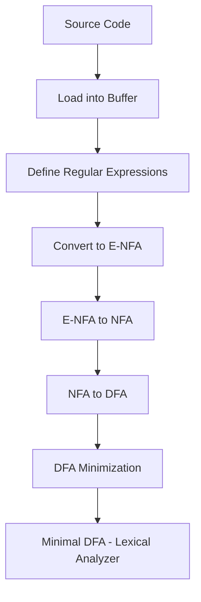
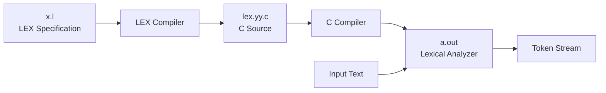

---
title:
  "{ Title }":
tags:
created:
  "{ date }":
updated:
  "{ date }":
---

# Compiler Design: Complete Notes

---

## 1. Compiler Passes

### Definition
A **pass** is a complete traversal of the source program or an intermediate representation during compilation.

### Types of Compilers by Pass

#### Single Pass Compiler
```
Source Code ──→ [Single Pass] ──→ Target Code
```

**Characteristics:**
- Processes source code once from start to finish
- Translation happens in one sequential scan
- Faster compilation time
- Lower memory consumption
- Suitable for simple languages

**Example:** Tiny C Compiler (TCC)

**Advantages:**
- Fast compilation
- Minimal memory usage
- Simple implementation

**Disadvantages:**
- Limited optimization capabilities
- Cannot handle forward references easily
- Restricted language features

#### Multi-Pass Compiler
```
Source Code ──→ [Pass 1] ──→ [Pass 2] ──→ ... ──→ [Pass N] ──→ Target Code
```

**Characteristics:**
- Multiple traversals of source/intermediate code
- Each pass performs specific tasks
- Slower compilation but better optimization
- Higher memory requirements

**Examples:** GCC, LLVM

**Advantages:**
- Advanced optimization techniques
- Better error detection
- Handles complex language features
- Superior code quality

**Disadvantages:**
- Slower compilation
- Higher memory consumption
- More complex implementation

---

## 2. Compiler Phases

### Phase Pipeline
```
┌──────────────────┐
│  Source Code     │
└────────┬─────────┘
         │
         ▼
┌──────────────────┐
│ Lexical Analysis │
└────────┬─────────┘
         │
         ▼
┌──────────────────┐
│ Syntax Analysis  │
└────────┬─────────┘
         │
         ▼
┌──────────────────┐
│ Semantic Analysis│
└────────┬─────────┘
         │
         ▼
┌──────────────────┐
│ Intermediate Code│
│   Generation     │
└────────┬─────────┘
         │
         ▼
┌──────────────────┐
│ Code Optimization│
└────────┬─────────┘
         │
         ▼
┌──────────────────┐
│ Code Generation  │
└────────┬─────────┘
         │
         ▼
┌──────────────────┐
│  Target Code     │
└──────────────────┘
```

**Key Concept:** Each phase's output serves as input to the next phase, creating a sequential pipeline.

---

## 3. Bootstrapping

### Historical Context
Early compilers were written in assembly/machine language:
- Highly complex to write and maintain
- Hardware-specific implementations
- Difficult to port across platforms

### Bootstrapping Solution
Writing a compiler in the language it is designed to compile.

### T-Diagram Notation
```
┌─────────┐
│ Source  │
│Language │
├─────────┤
│  Host   │
│Language │
├─────────┤
│ Target  │
│Machine  │
└─────────┘
```
T diagram 
```
c! ---> Assembly lang
	| 
	 assembly lang

```

```
c++ ---> Assembly lang
	|
	 c!
```

```
c++ ---> Assembly lang         c++ ---> Assembly lang
	|                                  |
	 c! c! ---> Assembly lang  Assembly lang
	         | 
	 assembly lang
```


### Bootstrapping Process Example

#### Step 1: Initial Compiler
```
┌─────┐
│  C  │
├─────┤
│ ASM │
├─────┤
│ ASM │
└─────┘
```
*Initial C compiler written in Assembly*

#### Step 2: Self-Compiling
```
┌─────┐
│ C++ │
├─────┤
│  C  │
├─────┤
│ ASM │
└─────┘
```
*C++ compiler written in C*

#### Step 3: Full Bootstrap
```
┌─────┐     ┌─────┐
│ C++ │     │  C  │
├─────┤     ├─────┤
│  C  │  +  │ ASM │  =  Final Compiler
├─────┤     ├─────┤
│ ASM │     │ ASM │
└─────┘     └─────┘
```

### Advantages
- Portability across platforms
- Self-testing capability
- Language improvements benefit compiler itself
- Easier maintenance

### Disadvantages
- Initial bootstrapping complexity
- Requires existing compiler or interpreter
- Circular dependency issues
- Debugging challenges in early stages

---

## 4. Cross Compiler

### Definition
A compiler that runs on one machine (host) but generates code for another machine (target).

T Diagram
1) same machine 
```

Python ---> Byte                    Python ---> byte
	   |                                    |
	 c++ c++ ---> Assembly lang  Assembly lang
	         | 
	 assembly lang
```


2) different machine

let n = machine code
let m = machine code 
```

  x ---> n machine  AL             x  ---> n machine 
      |                                 |
	 c++ c++ ---> M machine AL   M machine AL
	         | 
	 M machine AL
```

### Same Machine Cross Compilation

#### Example: Python to Bytecode
```
┌────────┐     ┌─────┐
│ Python │     │ C++ │
├────────┤  +  ├─────┤  =  Python Compiler
│  C++   │     │ ASM │
├────────┤     ├─────┤
│  ASM   │     │ ASM │
└────────┘     └─────┘
```

### Different Machine Cross Compilation

#### Example: Compiler for Target Machine N
```
┌─────┐     ┌─────┐
│  X  │     │ C++ │
├─────┤  +  ├─────┤  =  Cross Compiler
│ C++ │     │  M  │
├─────┤     ├─────┤
│  N  │     │  M  │
└─────┘     └─────┘

Where:
N = Target machine code
M = Host machine code
```

### Assembly Language and Machine Dependence

**Question:** Is assembly language machine-dependent?

**Answer:** YES
- Each processor architecture has its own assembly language
- x86, ARM, MIPS have different instruction sets
- Registers, addressing modes vary by architecture

**Exception:** Virtual Machines
- JVM (Java Virtual Machine) generates bytecode
- Bytecode is platform-independent
- JVM itself is platform-specific
- Enables "Write Once, Run Anywhere"

```
┌──────────────┐
│ Java Source  │
└──────┬───────┘
       │
       ▼
┌──────────────┐
│   Compiler   │
└──────┬───────┘
       │
       ▼
┌──────────────┐
│   Bytecode   │ (Platform Independent)
└──────┬───────┘
       │
   ┌───┴───┐
   │       │
   ▼       ▼
┌─────┐ ┌─────┐
│ JVM │ │ JVM │
│ Win │ │Linux│
└─────┘ └─────┘
```

---

## 5. Lexical Analysis

### Definition
First phase of compilation that reads source code and converts it into tokens.

### Example Analysis
```
Statement: x = a + b * 2
```

#### Token Classification

| Lexeme | Token Type   | Description      |
|--------|--------------|------------------|
| x      | IDENTIFIER   | Variable name    |
| =      | OPERATOR     | Assignment       |
| a      | IDENTIFIER   | Variable name    |
| +      | OPERATOR     | Addition         |
| b      | IDENTIFIER   | Variable name    |
| *      | OPERATOR     | Multiplication   |
| 2      | LITERAL      | Numeric constant |

#### Token Categories

**1. Identifiers**
- Variable names: x, a, b, counter, sum
- Function names: main, calculate, print

**2. Literals**
- Numeric: 2, 3.14, 0xFF
- String: "hello", "world"
- Character: 'a', 'b'

**3. Operators**
- Arithmetic: +, -, *, /, %
- Relational: <, >, ==, !=
- Logical: &&, ||, !
- Assignment: =, +=, -=

**4. Separators**
- Semicolon: ;
- Comma: ,
- Parentheses: ( )
- Braces: { }
- Brackets: [ ]

### Implementation Steps



#### Step-by-Step Process

**Step 1: Load Source into Buffer**
```
Buffer: "x = a + b * 2"
        ^
    Current Position
```

**Step 2: Define Regular Expressions**
```
IDENTIFIER  = [a-zA-Z][a-zA-Z0-9]*
NUMBER      = [0-9]+
OPERATOR    = [+\-*/=]
WHITESPACE  = [ \t\n]+
```

**Step 3: Epsilon-NFA (E-NFA)**
- Initial automaton with epsilon transitions
- Represents regular expressions

**Step 4: NFA Conversion**
- Remove epsilon transitions
- Non-deterministic finite automaton

**Step 5: DFA Conversion**
- Deterministic finite automaton
- Each state has exactly one transition per input

**Step 6: DFA Minimization**
- Reduce number of states
- Optimize performance


#### Removal of comments 
it remove comments and all do line numbering helps to tell the error which is present in which line . 


---

## 6. Lexical Analyzer Generator (LEX)

### Overview
LEX is a Unix utility for automatic generation of lexical analyzers.

### LEX Workflow



### Process Description

**Step 1:** Write LEX Specification File (x.l)
```
Definitions
%%
Rules
%%
User Code
```

**Step 2:** LEX Compiler processes x.l
- Reads patterns and actions
- Generates C code

**Step 3:** Produces lex.yy.c
- C source file containing lexical analyzer

**Step 4:** C Compiler compiles lex.yy.c
- Creates executable analyzer

**Step 5:** Executable a.out
- Final lexical analyzer program

### LEX Program Structure

```
┌─────────────────────────────────┐
│      DECLARATIONS SECTION       │
│  - C code in %{ }%              │
│  - Pattern definitions          │
│  - Regular definitions          │
└─────────────────────────────────┘
              │
         %%   │
              │
┌─────────────────────────────────┐
│         RULES SECTION           │
│  Pattern  { Action }            │
│  Pattern  { Action }            │
│  ...                            │
└─────────────────────────────────┘
              │
         %%   │
              │
┌─────────────────────────────────┐
│     USER CODE SECTION           │
│  - Auxiliary functions          │
│  - main() function              │
└─────────────────────────────────┘
```

### LEX Program Components

#### 1. Declarations Section
```c
%{
    #include <stdio.h>
    int token_count = 0;
%}

DIGIT    [0-9]
LETTER   [a-zA-Z]
ID       {LETTER}({LETTER}|{DIGIT})*
```

#### 2. Rules Section
```c
%%
{ID}        { printf("IDENTIFIER: %s\n", yytext); }
{DIGIT}+    { printf("NUMBER: %s\n", yytext); }
"+"         { printf("PLUS\n"); }
"-"         { printf("MINUS\n"); }
"*"         { printf("MULTIPLY\n"); }
"/"         { printf("DIVIDE\n"); }
"="         { printf("ASSIGN\n"); }
[ \t\n]     { /* skip whitespace */ }
.           { printf("UNKNOWN: %s\n", yytext); }
%%
```

#### 3. User Code Section
```c
%%
int main(int argc, char **argv) {
    yylex();
    return 0;
}

int yywrap() {
    return 1;
}
```

### Complete Example

**Input:** x.l
```
%{
#include <stdio.h>
%}

%%
[0-9]+          { printf("NUMBER: %s\n", yytext); }
[a-zA-Z]+       { printf("WORD: %s\n", yytext); }
[+\-*/=]        { printf("OPERATOR: %s\n", yytext); }
[ \t\n]         ;
.               { printf("UNKNOWN: %s\n", yytext); }
%%

int main() {
    yylex();
    return 0;
}

int yywrap() {
    return 1;
}
```

**Processing:**
```
$ lex x.l
$ gcc lex.yy.c -ll
$ echo "x = a + b * 2" | ./a.out
```

**Output:**
```
WORD: x
OPERATOR: =
WORD: a
OPERATOR: +
WORD: b
OPERATOR: *
NUMBER: 2
```

---

## Summary Comparison Table

| Aspect              | Single Pass      | Multi Pass         |
|---------------------|------------------|--------------------|
| Speed               | Fast             | Slower             |
| Memory              | Low              | High               |
| Optimization        | Limited          | Advanced           |
| Language Complexity | Simple           | Complex            |
| Examples            | TCC              | GCC, LLVM          |

---

**End of Notes**


