```mermaid
flowchart TD
    A([Statistics]) --> B([Descriptive])
    A --> C([Inferential])

    B --> D([Categorical])
    B --> E([Numerical])

    D --> F([Nominal - no order])
    D --> G([Ordinal - ordered])

    E --> H([Discrete - countable])
    E --> I([Continuous - any value])

    F --> F1["Operations: Mode, Freq, Rel. freq"]
    F1 --> F2["Mode = most frequent\nRel. freq = f_i / sum_f"]
    F2 --> F3["Graphs: countplot, pie, barplot"]

    G --> G1["Operations: Mode, Median, Freq"]
    G1 --> G2["Median = middle sorted value\nMode = most frequent rank"]
    G2 --> G3["Graphs: bar chart, countplot"]

    H --> H1([Central tendency])
    H --> H2([Dispersion])

    H1 --> H1a["Mean\nx_bar = sum_xi / n\nWeighted = sum_wi_xi / sum_wi"]
    H1 --> H1b["Median\nodd n: middle value\neven n: avg of middle two"]
    H1 --> H1c["Mode\nmost frequent value"]

    H1a --> H1ag["Graphs: barplot, pointplot"]
    H1b --> H1bg["Graphs: boxplot"]
    H1c --> H1cg["Graphs: countplot, histplot"]

    H2 --> H2a["Range = max minus min"]
    H2 --> H2b["Variance\npop: s2 = sum of x-mu squared / N\nsample: s2 = sum of x-xbar squared / n-1"]
    H2 --> H2c["Std Dev\nsigma = sqrt of variance"]
    H2 --> H2d["MAD = sum of abs x-xbar / n\nCV = sigma / mu x 100 percent"]

    H2a --> H2ag["Graphs: boxplot whiskers"]
    H2b --> H2bg["Graphs: boxplot, violinplot"]
    H2c --> H2cg["Graphs: errorbar, boxplot"]
    H2d --> H2dg["Graphs: violinplot, boxplot"]

    I --> I1([Central tendency])
    I --> I2([Dispersion])
    I --> I3([Relationship])

    I1 --> I1a["Mean, Median, Mode\nBin width = max-min / k"]
    I1a --> I1ag["Graphs: histplot, kdeplot, histplot kde=True"]

    I2 --> I2a["Variance, Std dev\nIQR = Q3 minus Q1"]
    I2a --> I2ag["Graphs: boxplot, violinplot"]

    I3 --> I3a["Correlation\nr = sum of x-xbar times y-ybar / n-1 sx sy"]
    I3a --> I3ag["Graphs: scatterplot, regplot, heatmap"]

    C --> C1([Hypothesis testing])
    C --> C2([Confidence interval])
    C --> C3([Regression])

    C1 --> C1a["One-sample t-test\nt = xbar - mu0 / s / sqrt n"]
    C1 --> C1b["Chi-square\nchi2 = sum of O-E squared / E"]

    C1a --> C1ag["Graphs: boxplot, histplot"]
    C1b --> C1bg["Graphs: heatmap, barplot"]

    C2 --> C2a["CI for mean\nxbar plus-minus z-star times sigma / sqrt n"]
    C2a --> C2ag["Graphs: pointplot, errorbar"]

    C3 --> C3a["Linear regression\ny_hat = b0 + b1 x"]
    C3a --> C3ag["Graphs: regplot, lmplot, residplot"]

    style A fill:#EEEDFE,stroke:#AFA9EC,color:#3C3489
    style B fill:#E1F5EE,stroke:#5DCAA5,color:#085041
    style C fill:#E1F5EE,stroke:#5DCAA5,color:#085041
    style D fill:#FAECE7,stroke:#F0997B,color:#712B13
    style E fill:#FAECE7,stroke:#F0997B,color:#712B13
    style F fill:#FAEEDA,stroke:#EF9F27,color:#633806
    style G fill:#FAEEDA,stroke:#EF9F27,color:#633806
    style H fill:#FAEEDA,stroke:#EF9F27,color:#633806
    style I fill:#FAEEDA,stroke:#EF9F27,color:#633806
    style H1 fill:#EAF3DE,stroke:#97C459,color:#27500A
    style H2 fill:#EAF3DE,stroke:#97C459,color:#27500A
    style I1 fill:#EAF3DE,stroke:#97C459,color:#27500A
    style I2 fill:#EAF3DE,stroke:#97C459,color:#27500A
    style I3 fill:#EAF3DE,stroke:#97C459,color:#27500A
    style C1 fill:#FAECE7,stroke:#F0997B,color:#712B13
    style C2 fill:#FAECE7,stroke:#F0997B,color:#712B13
    style C3 fill:#FAECE7,stroke:#F0997B,color:#712B13
```

---

## 1. Types of Statistics

| Type | Purpose | Example |
|---|---|---|
| **Descriptive** | Summarise data you have | Mean marks of a class |
| **Inferential** | Draw conclusions about a population from a sample | Exit poll predicting election result |

---

## 2. Types of Data

### 2.1 Categorical Data
Data that represents **groups or labels** — no mathematical meaning in the value itself.

| Sub-type | Key property | Example |
|---|---|---|
| **Nominal** | No order | Blood group (A, B, O, AB), Colours |
| **Ordinal** | Ordered, but gaps between ranks are unequal | Rating (Poor < Fair < Good < Excellent) |

### 2.2 Numerical Data
Data that carries actual numeric meaning and can be measured.

| Sub-type | Key property | Example |
|---|---|---|
| **Discrete** | Countable, whole numbers only | No. of students = 30, No. of cars |
| **Continuous** | Any value in a range (including decimals) | Height = 5.73 ft, Temperature = 36.6 °C |

---

## 3. Descriptive Statistics

### 3.1 Measures of Central Tendency

#### Mean (Arithmetic Mean)
$$\bar{x} = \frac{\sum_{i=1}^{n} x_i}{n} \quad \text{(sample mean)}$$
$$\mu = \frac{\sum_{i=1}^{N} x_i}{N} \quad \text{(population mean)}$$

> **Population mean $\mu$ ≠ Sample mean $\bar{x}$**  
> $\mu$ is the true value (often unknown). $\bar{x}$ is an **estimate** from a subset.

⚠️ Mean is **sensitive to outliers**. If one value is extremely large/small, the mean shifts heavily.

---

#### Weighted Mean
Used when different values contribute **unequally** (e.g., GPA with different credit hours).
$$\bar{x}_w = \frac{\sum_{i=1}^{n} w_i x_i}{\sum_{i=1}^{n} w_i}$$

**Example:**
| Subject | Marks ($x_i$) | Credits ($w_i$) |
|---|---|---|
| Maths | 90 | 4 |
| English | 70 | 2 |

$$\bar{x}_w = \frac{(90 \times 4) + (70 \times 2)}{4 + 2} = \frac{360 + 140}{6} = \frac{500}{6} \approx 83.3$$

---

#### Trimmed Mean
Remove the top and bottom $p\%$ of data, then compute the mean on remaining values. Reduces effect of outliers.

$$\bar{x}_{\text{trim}} = \frac{\sum \text{remaining values}}{n - 2k}$$

where $k = \lfloor n \cdot p \rfloor$ values are removed from each end.

**Example:** Trim 10% from `[2, 10, 12, 14, 15, 100]`  
Drop lowest (2) and highest (100) → mean of `[10, 12, 14, 15]` = $12.75$

---

#### Median
The **middle value** when data is sorted. Not affected by outliers.

$$\text{Median} = \begin{cases} x_{\frac{n+1}{2}} & \text{if } n \text{ is odd} \\ \frac{x_{\frac{n}{2}} + x_{\frac{n}{2}+1}}{2} & \text{if } n \text{ is even} \end{cases}$$

> Use **median** when data has outliers or is skewed (e.g., income data, house prices).

---

#### Mode
The **most frequently occurring** value.
- No formula — just count frequency.
- **Bimodal**: two modes. **Multimodal**: more than two.
- Best used with **categorical data** — tells which category appears most.

> Example: Survey responses — `[Happy, Sad, Happy, Happy, Neutral]` → Mode = **Happy**

---

### 3.2 Measures of Dispersion

#### Range
$$\text{Range} = x_{\max} - x_{\min}$$
⚠️ Very sensitive to outliers — one extreme value ruins the range.

---

#### Variance
Measures the **average squared distance** of each data point from the mean.

$$\sigma^2 = \frac{\sum_{i=1}^{N}(x_i - \mu)^2}{N} \quad \text{(population)}$$

$$s^2 = \frac{\sum_{i=1}^{n}(x_i - \bar{x})^2}{n-1} \quad \text{(sample — Bessel's correction)}$$

> Squaring ensures distances don't cancel each other out. Also penalises large deviations more.

---

#### Standard Deviation
Square root of variance — **same unit as original data**.

$$\sigma = \sqrt{\sigma^2} \qquad s = \sqrt{s^2}$$

---

#### Mean Absolute Deviation (MAD)
$$\text{MAD} = \frac{\sum_{i=1}^{n} |x_i - \bar{x}|}{n}$$

- Uses absolute value instead of squaring.
- Intuitive, but **not good for statistical inference** — absolute values are not differentiable and don't have nice mathematical properties compared to variance.

---

#### Coefficient of Variation (CV)
Normalised measure of spread — useful to **compare variability across datasets with different units or scales**.

$$\text{CV} = \frac{\sigma}{\mu} \times 100\%$$

> Example: CV of heights vs weights — lets you compare which is more spread relatively.

---

### 3.3 Spread of Categorical Data — Frequency Distribution

For categorical data, you can't compute variance. Instead, use:

**Frequency Table:**
| Category | Frequency ($f$) | Relative Frequency |
|---|---|---|
| A | 15 | $15/50 = 0.30$ |
| B | 20 | $20/50 = 0.40$ |
| C | 15 | $15/50 = 0.30$ |

$$\text{Relative Frequency} = \frac{f_i}{\sum f_i}$$

→ Plot a **Pie Chart** or **Bar Chart** for visual representation.

---

## 4. Seaborn Graphs — What to Use When

| Situation | Graph | `sns` function | Key inputs |
|---|---|---|---|
| Distribution of one numerical variable | Histogram | `sns.histplot()` | `data`, `x`, `bins` |
| Distribution (smooth curve) | KDE plot | `sns.kdeplot()` | `data`, `x`, `bw_adjust` |
| Distribution + KDE combined | Dist plot | `sns.histplot(kde=True)` | `data`, `x`, `bins` |
| Outlier detection, spread, median | Box plot | `sns.boxplot()` | `data`, `x` or `y` |
| Box plot + individual data points | Violin plot | `sns.violinplot()` | `data`, `x`, `y` |
| Relationship between 2 numerical vars | Scatter plot | `sns.scatterplot()` | `data`, `x`, `y` |
| Scatter + regression line | Regression plot | `sns.regplot()` | `data`, `x`, `y` |
| Categorical vs numerical (mean bar) | Bar plot | `sns.barplot()` | `data`, `x`, `y` |
| Count of categorical values | Count plot | `sns.countplot()` | `data`, `x` |
| All pairwise relationships | Pair plot | `sns.pairplot()` | `data` |
| Correlation matrix | Heatmap | `sns.heatmap()` | `data.corr()`, `annot=True` |
| Grouped distributions | Strip plot | `sns.stripplot()` | `data`, `x`, `y` |

---

## 5. Bin / Bucket Concept (Histograms)

Bins group continuous data into intervals so you can visualise its distribution.

$$\text{Bin width} = \frac{x_{\max} - x_{\min}}{k}$$

where $k$ = number of bins (can also use **Sturges' rule**: $k = \lceil 1 + \log_2 n \rceil$).

**Example:** Marks from 0–100, 5 bins → each bin covers 20 marks.

```python
import seaborn as sns
import matplotlib.pyplot as plt

sns.histplot(data=df, x='marks', bins=10)  # bins = number of buckets
# or
sns.histplot(data=df, x='marks', binwidth=5)  # binwidth = size of each bucket
plt.show()
```

**Key `histplot` parameters:**
| Parameter | Type | Meaning |
|---|---|---|
| `bins` | int | Number of equal-width bins |
| `binwidth` | float | Width of each bin |
| `binrange` | tuple `(min, max)` | Limit the range |
| `kde` | bool | Overlay a KDE curve |
| `stat` | str | `'count'`, `'frequency'`, `'density'`, `'probability'` |

---

## 6. Quick Decision Guide

```
Data type?
├── Categorical → Mode, Frequency table, Pie/Bar/Count plot
└── Numerical
    ├── Has outliers? → Use Median, IQR (not Mean/Range)
    └── No outliers?  → Use Mean, Variance, Std Dev, Histogram
```




![[Pasted image 20260420091536.png]]

